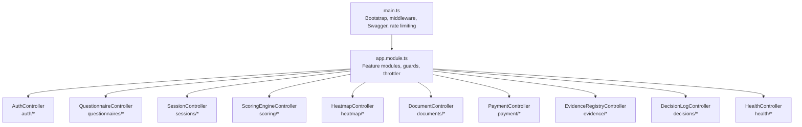
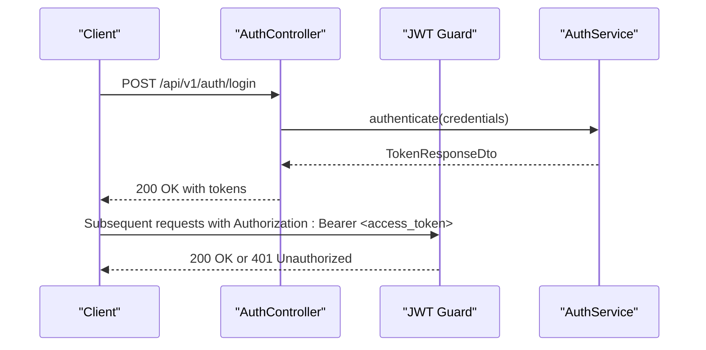
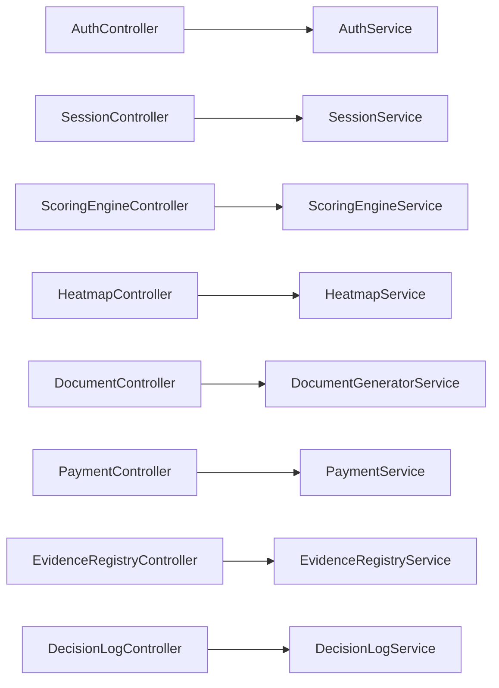

# API Reference

<cite>
**Referenced Files in This Document**
- [main.ts](file://apps/api/src/main.ts)
- [app.module.ts](file://apps/api/src/app.module.ts)
- [health.controller.ts](file://apps/api/src/health.controller.ts)
- [auth.controller.ts](file://apps/api/src/modules/auth/auth.controller.ts)
- [questionnaire.controller.ts](file://apps/api/src/modules/questionnaire/questionnaire.controller.ts)
- [session.controller.ts](file://apps/api/src/modules/session/session.controller.ts)
- [document.controller.ts](file://apps/api/src/modules/document-generator/controllers/document.controller.ts)
- [payment.controller.ts](file://apps/api/src/modules/payment/payment.controller.ts)
- [scoring-engine.controller.ts](file://apps/api/src/modules/scoring-engine/scoring-engine.controller.ts)
- [heatmap.controller.ts](file://apps/api/src/modules/heatmap/heatmap.controller.ts)
- [decision-log.controller.ts](file://apps/api/src/modules/decision-log/decision-log.controller.ts)
- [evidence-registry.controller.ts](file://apps/api/src/modules/evidence-registry/evidence-registry.controller.ts)
</cite>

## Table of Contents
1. [Introduction](#introduction)
2. [Project Structure](#project-structure)
3. [Core Components](#core-components)
4. [Architecture Overview](#architecture-overview)
5. [Detailed Component Analysis](#detailed-component-analysis)
6. [Dependency Analysis](#dependency-analysis)
7. [Performance Considerations](#performance-considerations)
8. [Troubleshooting Guide](#troubleshooting-guide)
9. [Conclusion](#conclusion)
10. [Appendices](#appendices)

## Introduction
This document provides comprehensive API documentation for Quiz-to-Build’s RESTful endpoints. It covers all public API endpoints organized by functional modules: authentication, questionnaire management, scoring, document generation, payment processing, evidence registry, decision log, and administrative functions. For each endpoint, you will find HTTP methods, URL patterns, request/response schemas, authentication requirements, error codes, parameter descriptions, validation rules, and example requests/responses. It also documents the OpenAPI/Swagger specification, API versioning strategy, rate limiting policies, webhook endpoints, authentication flows, token management, security considerations, pagination patterns, filtering options, search capabilities, client SDK examples, integration guides, health checks, monitoring APIs, administrative interfaces, error handling strategies, retry mechanisms, and debugging approaches.

## Project Structure
The API is built with NestJS and organized into feature modules. The application bootstraps middleware, security headers, rate limiting, and Swagger/OpenAPI documentation. Controllers are grouped under modules such as auth, questionnaire, session, scoring-engine, heatmap, document-generator, payment, evidence-registry, decision-log, and others. The global prefix is configurable and defaults to api/v1.

**Diagram sources**
- [main.ts:28-329](file://apps/api/src/main.ts#L28-L329)
- [app.module.ts:53-129](file://apps/api/src/app.module.ts#L53-L129)

**Section sources**
- [main.ts:28-329](file://apps/api/src/main.ts#L28-L329)
- [app.module.ts:53-129](file://apps/api/src/app.module.ts#L53-L129)

## Core Components
- Global middleware and security:
  - Compression (gzip/brotli), skipping SSE/streaming endpoints.
  - Helmet CSP, HSTS in production, Permissions-Policy restricting features.
  - Cookie parsing for CSRF tokens.
  - Request body size limits (1 MB).
  - CORS configuration supporting wildcard origins with credentials in development.
- OpenAPI/Swagger:
  - Enabled conditionally via environment variable.
  - Base server configured per environment.
  - Bearer JWT auth scheme defined.
  - Tags for all major modules.
- Rate limiting:
  - Throttler configured with short, medium, and long windows with limits.
- Health checks:
  - HealthController exposes health endpoints.

**Section sources**
- [main.ts:43-191](file://apps/api/src/main.ts#L43-L191)
- [main.ts:214-298](file://apps/api/src/main.ts#L214-L298)
- [app.module.ts:68-85](file://apps/api/src/app.module.ts#L68-L85)
- [health.controller.ts](file://apps/api/src/health.controller.ts)

## Architecture Overview
The API follows a modular NestJS architecture with controllers exposing REST endpoints. Authentication is JWT-based and enforced via guards. Controllers delegate to services implementing domain logic. Payment processing integrates with Stripe via webhook verification using rawBody and signature headers. Document generation supports bulk downloads and versioning. Evidence registry supports file uploads, integrity verification, and CI artifact ingestion.

**Diagram sources**
- [auth.controller.ts:47-57](file://apps/api/src/modules/auth/auth.controller.ts#L47-L57)
- [auth.controller.ts:83-91](file://apps/api/src/modules/auth/auth.controller.ts#L83-L91)

**Section sources**
- [auth.controller.ts:38-171](file://apps/api/src/modules/auth/auth.controller.ts#L38-L171)

## Detailed Component Analysis

### Authentication Module
- Base path: /api/v1/auth
- Authentication: Bearer JWT required for protected routes except login/register/verification.
- CSRF protection: CSRF token endpoint and guard applied to state-changing requests.

Endpoints:
- POST /auth/register
  - Description: Register a new user.
  - Auth: None.
  - Body: Register DTO.
  - Responses: 201 Created with TokenResponseDto; 409 Conflict if email exists.
- POST /auth/login
  - Description: Login with email and password.
  - Auth: None.
  - Body: Login DTO.
  - Responses: 200 OK with TokenResponseDto; 401 Unauthorized.
  - Throttling: Short window limit.
- POST /auth/refresh
  - Description: Refresh access token.
  - Auth: None.
  - Body: RefreshToken DTO.
  - Responses: 200 OK with RefreshResponseDto; 401 Unauthorized.
- POST /auth/logout
  - Description: Logout and invalidate refresh token.
  - Auth: None.
  - Body: RefreshToken DTO.
  - Responses: 200 OK with message.
- GET /auth/me
  - Description: Get current user profile.
  - Auth: Bearer JWT.
  - Responses: 200 OK with user; 401 Unauthorized.
- POST /auth/verify-email
  - Description: Verify email address with token.
  - Auth: None.
  - Body: VerifyEmail DTO.
  - Responses: 200 OK with message and verified flag; 400 Bad Request.
- POST /auth/resend-verification
  - Description: Resend verification email.
  - Auth: None.
  - Body: ResendVerification DTO.
  - Responses: 200 OK; 400 Bad Request.
  - Throttling: Short window limit.
- POST /auth/forgot-password
  - Description: Request password reset email.
  - Auth: None.
  - Body: RequestPasswordReset DTO.
  - Responses: 200 OK; 400 Bad Request.
  - Throttling: Short window limit.
- POST /auth/reset-password
  - Description: Reset password with token.
  - Auth: None.
  - Body: ResetPassword DTO.
  - Responses: 200 OK; 400 Bad Request.
  - Throttling: Short window limit.
- GET /auth/csrf-token
  - Description: Get CSRF token for state-changing requests.
  - Auth: None.
  - Responses: 200 OK with csrfToken and message.

Validation and security:
- DTO validation via ValidationPipe.
- CSRF guard applied to state-changing endpoints.
- Rate limits for sensitive endpoints (login, verification, reset).

Example request (login):
- POST /api/v1/auth/login
- Headers: Content-Type: application/json
- Body: { "email": "...", "password": "..." }

Example response (login):
- 200 OK
- Body: { "accessToken": "...", "refreshToken": "..." }

**Section sources**
- [auth.controller.ts:38-171](file://apps/api/src/modules/auth/auth.controller.ts#L38-L171)

### Questionnaire Management
- Base path: /api/v1/questionnaires
- Authentication: Bearer JWT required.
- Filtering: Query param industry for filtering by industry.

Endpoints:
- GET /questionnaires
  - Description: List all available questionnaires.
  - Auth: Bearer JWT.
  - Query params: Pagination DTO (page, limit); optional industry.
  - Responses: 200 OK with items and pagination metadata.
- GET /questionnaires/:id
  - Description: Get questionnaire details with sections and questions.
  - Auth: Bearer JWT.
  - Path params: id (UUID).
  - Responses: 200 OK with QuestionnaireDetail; 404 Not Found.

Pagination pattern:
- Returns items array and pagination object with page, limit, totalItems, totalPages.

**Section sources**
- [questionnaire.controller.ts:18-47](file://apps/api/src/modules/questionnaire/questionnaire.controller.ts#L18-L47)

### Sessions and Responses
- Base path: /api/v1/sessions
- Authentication: Bearer JWT required.

Endpoints:
- POST /sessions
  - Description: Start a new questionnaire session.
  - Auth: Bearer JWT.
  - Body: CreateSession DTO.
  - Responses: 201 Created with SessionResponse.
- GET /sessions
  - Description: List user's sessions.
  - Auth: Bearer JWT.
  - Query params: Pagination DTO (page, limit); optional status enum.
  - Responses: 200 OK with items and pagination metadata.
- GET /sessions/:id
  - Description: Get session details.
  - Auth: Bearer JWT.
  - Path params: id (UUID).
  - Responses: 200 OK with SessionResponse; 404 Not Found.
- GET /sessions/:id/continue
  - Description: Continue session, apply adaptive logic, return next question(s) and progress.
  - Auth: Bearer JWT.
  - Query params: questionCount (default 1, max 5).
  - Responses: 200 OK with ContinueSessionResponse; 404 Not Found; 403 Forbidden.
- GET /sessions/:id/questions/next
  - Description: Get next question(s) based on adaptive logic.
  - Auth: Bearer JWT.
  - Query params: count (default 1, max 5).
  - Responses: 200 OK with NextQuestionResponse.
- POST /sessions/:id/responses
  - Description: Submit a response to a question.
  - Auth: Bearer JWT.
  - Body: SubmitResponse DTO.
  - Responses: 201 Created with SubmitResponseResult.
- PUT /sessions/:id/responses/:questionId
  - Description: Update a response.
  - Auth: Bearer JWT.
  - Path params: id (UUID), questionId (UUID).
  - Body: Omit SubmitResponse DTO fields that are auto-filled.
  - Responses: 200 OK with SubmitResponseResult.
- POST /sessions/:id/complete
  - Description: Mark session as complete.
  - Auth: Bearer JWT.
  - Path params: id (UUID).
  - Responses: 200 OK with SessionResponse.

Validation rules:
- UUID parsing for id and questionId.
- questionCount/count clamped between 1 and 5.

**Section sources**
- [session.controller.ts:39-165](file://apps/api/src/modules/session/session.controller.ts#L39-L165)

### Scoring Engine
- Base path: /api/v1/scoring
- Authentication: Bearer JWT required.

Endpoints:
- POST /scoring/calculate
  - Description: Calculate readiness score for a session.
  - Auth: Bearer JWT.
  - Body: CalculateScore DTO.
  - Responses: 200 OK with ReadinessScoreResult; 404 Not Found.
- POST /scoring/next-questions
  - Description: Get next priority questions (NQS).
  - Auth: Bearer JWT.
  - Body: NextQuestions DTO.
  - Responses: 200 OK with NextQuestionsResult.
- GET /scoring/:sessionId
  - Description: Get session score (cached or calculated).
  - Auth: Bearer JWT.
  - Path params: sessionId (UUID).
  - Responses: 200 OK with ReadinessScoreResult; 404 Not Found.
- POST /scoring/:sessionId/invalidate
  - Description: Invalidate score cache for a session.
  - Auth: Bearer JWT.
  - Path params: sessionId (UUID).
  - Responses: 204 No Content.
- GET /scoring/:sessionId/history
  - Description: Get score history for a session.
  - Auth: Bearer JWT.
  - Path params: sessionId (UUID).
  - Query params: limit (optional number).
  - Responses: 200 OK with ScoreHistoryResult; 404 Not Found.
- GET /scoring/:sessionId/benchmark
  - Description: Get industry benchmark comparison.
  - Auth: Bearer JWT.
  - Path params: sessionId (UUID).
  - Query params: industry (optional string).
  - Responses: 200 OK with BenchmarkResult; 404 Not Found.
- GET /scoring/:sessionId/benchmark/dimensions
  - Description: Get dimension-level benchmarks.
  - Auth: Bearer JWT.
  - Path params: sessionId (UUID).
  - Responses: 200 OK with array of DimensionBenchmarkResult; 404 Not Found.

**Section sources**
- [scoring-engine.controller.ts:55-267](file://apps/api/src/modules/scoring-engine/scoring-engine.controller.ts#L55-L267)

### Heatmap
- Base path: /api/v1/heatmap
- Authentication: Bearer JWT required.

Endpoints:
- GET /heatmap/:sessionId
  - Description: Generate gap heatmap for a session.
  - Auth: Bearer JWT.
  - Path params: sessionId (UUID).
  - Responses: 200 OK with HeatmapResultDto; 404 Not Found.
- GET /heatmap/:sessionId/summary
  - Description: Get heatmap summary statistics.
  - Auth: Bearer JWT.
  - Path params: sessionId (UUID).
  - Responses: 200 OK with HeatmapSummaryDto; 404 Not Found.
- GET /heatmap/:sessionId/export/csv
  - Description: Export heatmap to CSV.
  - Auth: Bearer JWT.
  - Path params: sessionId (UUID).
  - Responses: 200 OK CSV file; 404 Not Found.
- GET /heatmap/:sessionId/export/markdown
  - Description: Export heatmap to Markdown.
  - Auth: Bearer JWT.
  - Path params: sessionId (UUID).
  - Responses: 200 OK Markdown file; 404 Not Found.
- GET /heatmap/:sessionId/cells
  - Description: Get filtered heatmap cells.
  - Auth: Bearer JWT.
  - Path params: sessionId (UUID).
  - Query params: dimension (optional), severity (optional).
  - Responses: 200 OK array of HeatmapCellDto; 404 Not Found.
- GET /heatmap/:sessionId/drilldown/:dimensionKey/:severityBucket
  - Description: Drilldown into a specific cell.
  - Auth: Bearer JWT.
  - Path params: sessionId (UUID), dimensionKey (string), severityBucket (string).
  - Responses: 200 OK with HeatmapDrilldownDto; 404 Not Found.

**Section sources**
- [heatmap.controller.ts:54-185](file://apps/api/src/modules/heatmap/heatmap.controller.ts#L54-L185)

### Document Generation
- Base path: /api/v1/documents
- Authentication: Bearer JWT required.

Endpoints:
- POST /documents/generate
  - Description: Request document generation for a session.
  - Auth: Bearer JWT.
  - Body: RequestGeneration DTO.
  - Responses: 201 Created with DocumentResponseDto; 400 Bad Request; 404 Not Found.
- GET /documents/types
  - Description: List available document types.
  - Auth: Bearer JWT.
  - Responses: 200 OK array of DocumentTypeResponseDto.
- GET /documents/session/:sessionId/types
  - Description: List document types available for a session (project-type-scoped).
  - Auth: Bearer JWT.
  - Path params: sessionId (UUID).
  - Responses: 200 OK array of DocumentTypeResponseDto; 404 Not Found.
- GET /documents/session/:sessionId
  - Description: List all documents for a session.
  - Auth: Bearer JWT.
  - Path params: sessionId (UUID).
  - Responses: 200 OK array of DocumentResponseDto; 404 Not Found.
- GET /documents/:id
  - Description: Get document details.
  - Auth: Bearer JWT.
  - Path params: id (UUID).
  - Responses: 200 OK with DocumentResponseDto; 404 Not Found.
- GET /documents/:id/download
  - Description: Get secure download URL for document.
  - Auth: Bearer JWT.
  - Path params: id (UUID).
  - Query params: expiresIn (optional minutes, default 60).
  - Responses: 200 OK with DownloadUrlResponseDto; 400 Bad Request; 404 Not Found.
- GET /documents/session/:sessionId/bulk-download
  - Description: Download all session documents as ZIP.
  - Auth: Bearer JWT.
  - Path params: sessionId (UUID).
  - Responses: 200 OK ZIP stream; 400 Bad Request; 404 Not Found.
- POST /documents/bulk-download
  - Description: Download selected documents as ZIP.
  - Auth: Bearer JWT.
  - Body: { documentIds: [string] }.
  - Responses: 200 OK ZIP stream; 400 Bad Request.
- GET /documents/:id/versions
  - Description: Get document version history.
  - Auth: Bearer JWT.
  - Path params: id (UUID).
  - Responses: 200 OK array of DocumentResponseDto; 404 Not Found.
- GET /documents/:id/versions/:version/download
  - Description: Download a specific document version.
  - Auth: Bearer JWT.
  - Path params: id (UUID), version (integer).
  - Responses: 200 OK with DownloadUrlResponseDto; 404 Not Found; 400 Bad Request.

Bulk download headers:
- X-Document-Count indicates total documents in the ZIP.

**Section sources**
- [document.controller.ts:45-277](file://apps/api/src/modules/document-generator/controllers/document.controller.ts#L45-L277)

### Payment Processing
- Base path: /api/v1/payment
- Authentication: Bearer JWT required for protected endpoints.

Endpoints:
- GET /payment/tiers
  - Description: Get available subscription tiers.
  - Auth: Public.
  - Responses: 200 OK with tiers map.
- POST /payment/checkout
  - Description: Create checkout session for subscription.
  - Auth: Bearer JWT.
  - Body: CreateCheckout DTO (organizationId, tier, successUrl, cancelUrl, customerId).
  - Responses: 200 OK with sessionId and url; 403 Forbidden; 400 Bad Request.
- POST /payment/portal
  - Description: Create customer portal session.
  - Auth: Bearer JWT.
  - Body: CreatePortalSession DTO (customerId, returnUrl).
  - Responses: 200 OK with url; 403 Forbidden; 400 Bad Request.
- GET /payment/subscription/:organizationId
  - Description: Get subscription status for an organization.
  - Auth: Bearer JWT.
  - Path params: organizationId (string).
  - Responses: 200 OK with SubscriptionResponseDto; 403 Forbidden; 404 Not Found.
- GET /payment/invoices/:customerId
  - Description: Get billing history (invoices).
  - Auth: Bearer JWT.
  - Path params: customerId (string).
  - Query params: limit (optional number).
  - Responses: 200 OK array of InvoiceResponseDto; 403 Forbidden; 404 Not Found.
- GET /payment/usage/:organizationId
  - Description: Get usage stats and tier limits for an organization.
  - Auth: Bearer JWT.
  - Path params: organizationId (string).
  - Responses: 200 OK with usage and limits; 403 Forbidden; 404 Not Found.
- POST /payment/cancel/:organizationId
  - Description: Schedule subscription cancellation at period end.
  - Auth: Bearer JWT.
  - Path params: organizationId (string).
  - Responses: 200 OK with message; 400 Bad Request; 403 Forbidden.
- POST /payment/resume/:organizationId
  - Description: Resume a subscription that is set to cancel at period end.
  - Auth: Bearer JWT.
  - Path params: organizationId (string).
  - Responses: 200 OK with message; 400 Bad Request; 403 Forbidden.
- POST /payment/webhook
  - Description: Stripe webhook handler.
  - Auth: Public.
  - Headers: stripe-signature (required), raw body required.
  - Responses: 200 OK with { received: true }; 400 Bad Request for invalid signature or missing raw body.
  - Supported events: checkout.session.completed, customer.subscription.created/updated/deleted, invoice.payment_succeeded/failed.

Webhook security:
- Signature verification using configured webhook secret.
- Raw body required for verification.

**Section sources**
- [payment.controller.ts:81-395](file://apps/api/src/modules/payment/payment.controller.ts#L81-L395)

### Evidence Registry
- Base path: /api/v1/evidence
- Authentication: Bearer JWT required.

Endpoints:
- POST /evidence/upload
  - Description: Upload evidence file with SHA-256 hashing.
  - Auth: Bearer JWT.
  - Body: Multipart form-data with file, sessionId, questionId, artifactType, optional fileName.
  - Responses: 201 Created with EvidenceItemResponse; 400 Bad Request.
- POST /evidence/verify
  - Description: Verify evidence (optionally update coverage).
  - Auth: Bearer JWT.
  - Body: VerifyEvidence DTO.
  - Responses: 200 OK with EvidenceItemResponse; 404 Not Found.
- GET /evidence/:evidenceId
  - Description: Get evidence by ID.
  - Auth: Bearer JWT.
  - Path params: evidenceId (UUID).
  - Responses: 200 OK with EvidenceItemResponse; 404 Not Found.
- GET /evidence
  - Description: List evidence with filters (session, question, type, verification status).
  - Auth: Bearer JWT.
  - Query params: filters DTO.
  - Responses: 200 OK array of EvidenceItemResponse.
- GET /evidence/stats/:sessionId
  - Description: Get evidence statistics for a session.
  - Auth: Bearer JWT.
  - Path params: sessionId (UUID).
  - Responses: 200 OK with totals and counts by type.
- DELETE /evidence/:evidenceId
  - Description: Delete an unverified evidence item.
  - Auth: Bearer JWT.
  - Path params: evidenceId (UUID).
  - Responses: 204 No Content; 403 Forbidden; 404 Not Found.
- POST /evidence/:evidenceId/chain
  - Description: Add evidence to integrity chain (hash chain and optional timestamp).
  - Auth: Bearer JWT.
  - Path params: evidenceId (UUID).
  - Body: { sessionId: string }.
  - Responses: 200 OK; 404 Not Found.
- GET /evidence/chain/:sessionId
  - Description: Get evidence chain for a session.
  - Auth: Bearer JWT.
  - Path params: sessionId (UUID).
  - Responses: 200 OK with chain entries.
- GET /evidence/chain/:sessionId/verify
  - Description: Verify evidence chain integrity.
  - Auth: Bearer JWT.
  - Path params: sessionId (UUID).
  - Responses: 200 OK with verification result.
- GET /evidence/:evidenceId/integrity
  - Description: Verify single evidence integrity (hash, chain position, timestamp).
  - Auth: Bearer JWT.
  - Path params: evidenceId (UUID).
  - Responses: 200 OK with integrity result; 404 Not Found.
- GET /evidence/integrity-report/:sessionId
  - Description: Generate integrity report for a session.
  - Auth: Bearer JWT.
  - Path params: sessionId (UUID).
  - Responses: 200 OK with report.
- POST /evidence/ci/ingest
  - Description: Ingest CI artifact as evidence (JUnit, Jest, lcov, Cobertura, CycloneDX, SPDX, Trivy, OWASP).
  - Auth: Bearer JWT.
  - Body: IngestArtifact DTO.
  - Responses: 201 Created; 400 Bad Request.
- POST /evidence/ci/bulk-ingest
  - Description: Bulk ingest CI artifacts from a single build.
  - Auth: Bearer JWT.
  - Body: BulkIngest DTO.
  - Responses: 201 Created.
- GET /evidence/ci/session/:sessionId
  - Description: Get all CI artifacts ingested for a session.
  - Auth: Bearer JWT.
  - Path params: sessionId (UUID).
  - Responses: 200 OK with artifacts.
- GET /evidence/ci/build/:sessionId/:buildId
  - Description: Get aggregated metrics and artifacts for a specific CI build.
  - Auth: Bearer JWT.
  - Path params: sessionId (UUID), buildId (string).
  - Responses: 200 OK with build summary; 404 Not Found.

**Section sources**
- [evidence-registry.controller.ts:68-462](file://apps/api/src/modules/evidence-registry/evidence-registry.controller.ts#L68-L462)

### Decision Log
- Base path: /api/v1/decisions
- Authentication: Bearer JWT required.

Endpoints:
- POST /decisions
  - Description: Create a new decision (DRAFT).
  - Auth: Bearer JWT.
  - Body: CreateDecision DTO.
  - Responses: 201 Created with DecisionResponse; 400 Bad Request.
- POST /decisions/lock
  - Description: Lock a DRAFT decision (LOCKED).
  - Auth: Bearer JWT.
  - Body: UpdateDecisionStatus DTO.
  - Responses: 200 OK with DecisionResponse; 403 Forbidden.
- PATCH /decisions/:decisionId/status
  - Description: Update decision status (frontend-friendly PATCH).
  - Auth: Bearer JWT.
  - Path params: decisionId (UUID).
  - Body: { status: string }.
  - Responses: 200 OK with DecisionResponse; 403 Forbidden.
- POST /decisions/supersede
  - Description: Supersede a LOCKED decision (create new decision replacing the old).
  - Auth: Bearer JWT.
  - Body: SupersedeDecision DTO.
  - Responses: 201 Created with DecisionResponse; 400 Bad Request.
- GET /decisions/:decisionId
  - Description: Get a decision by ID.
  - Auth: Bearer JWT.
  - Path params: decisionId (UUID).
  - Responses: 200 OK with DecisionResponse; 404 Not Found.
- GET /decisions
  - Description: List decisions with filters (session, owner, status).
  - Auth: Bearer JWT.
  - Query params: ListDecisions DTO.
  - Responses: 200 OK array of DecisionResponse.
- GET /decisions/:decisionId/chain
  - Description: Get the full supersession history for a decision.
  - Auth: Bearer JWT.
  - Path params: decisionId (UUID).
  - Responses: 200 OK array of DecisionResponse.
- GET /decisions/export/:sessionId
  - Description: Export all decisions for a session in audit format.
  - Auth: Bearer JWT.
  - Path params: sessionId (UUID).
  - Responses: 200 OK with DecisionAuditExport.
- DELETE /decisions/:decisionId
  - Description: Delete a DRAFT decision.
  - Auth: Bearer JWT.
  - Path params: decisionId (UUID).
  - Responses: 204 No Content; 403 Forbidden.

**Section sources**
- [decision-log.controller.ts:46-278](file://apps/api/src/modules/decision-log/decision-log.controller.ts#L46-L278)

### Administrative Functions
- Base path: /api/v1/admin/*
- Authentication: Bearer JWT required.
- Note: Admin module is present and includes controllers/services; specific endpoints are module-specific and guarded by appropriate guards.

**Section sources**
- [app.module.ts:16-112](file://apps/api/src/app.module.ts#L16-L112)

### Health Checks and Monitoring
- Base path: /api/v1/health/*
- Authentication: None.
- Endpoints:
  - GET /health/alive
    - Description: Liveness probe.
    - Responses: 200 OK.
  - GET /health/ready
    - Description: Readiness probe.
    - Responses: 200 OK.
  - GET /health/db
    - Description: Database connectivity check.
    - Responses: 200 OK; 500 Internal Server Error on failure.

**Section sources**
- [health.controller.ts](file://apps/api/src/health.controller.ts)

## Dependency Analysis
The API uses a layered architecture:
- Controllers depend on services for business logic.
- Services depend on repositories/data access layers (PrismaModule).
- Guards enforce authentication and CSRF protection.
- Interceptors handle logging and response transformation.
- Rate limiting is enforced globally via ThrottlerGuard.

**Diagram sources**
- [auth.controller.ts:32-36](file://apps/api/src/modules/auth/auth.controller.ts#L32-L36)
- [session.controller.ts:37-23](file://apps/api/src/modules/session/session.controller.ts#L37-L23)
- [scoring-engine.controller.ts:47-25](file://apps/api/src/modules/scoring-engine/scoring-engine.controller.ts#L47-L25)
- [heatmap.controller.ts:35-11](file://apps/api/src/modules/heatmap/heatmap.controller.ts#L35-L11)
- [document.controller.ts:40-26](file://apps/api/src/modules/document-generator/controllers/document.controller.ts#L40-L26)
- [payment.controller.ts:45-27](file://apps/api/src/modules/payment/payment.controller.ts#L45-L27)
- [evidence-registry.controller.ts:62-33](file://apps/api/src/modules/evidence-registry/evidence-registry.controller.ts#L62-L33)
- [decision-log.controller.ts:41-16](file://apps/api/src/modules/decision-log/decision-log.controller.ts#L41-L16)

**Section sources**
- [app.module.ts:53-129](file://apps/api/src/app.module.ts#L53-L129)

## Performance Considerations
- Compression: Enabled for most responses; disabled for SSE/streaming endpoints.
- Request size limits: 1 MB to prevent abuse.
- Rate limiting: Three throttle windows configured globally.
- Pagination: All list endpoints support pagination DTO with page and limit.
- Filtering/search: Query parameters for filtering and drilldown endpoints.
- Streaming: Bulk downloads return StreamableFile streams.

[No sources needed since this section provides general guidance]

## Troubleshooting Guide
Common issues and resolutions:
- 401 Unauthorized: Ensure Authorization header with valid Bearer token is included.
- 403 Forbidden: Access denied to organization/customer or insufficient permissions.
- 400 Bad Request: Invalid request body or missing raw body for webhooks; verify DTO validation.
- 404 Not Found: Resource not found (session, document, evidence, decision).
- 429 Too Many Requests: Exceeded rate limits; reduce request frequency.
- Webhook signature failures: Verify stripe-signature header and raw body; confirm webhook secret configuration.

Retry mechanisms:
- Implement exponential backoff for transient failures.
- Reattempt webhook delivery if initial processing fails.

Debugging approaches:
- Enable Swagger UI for interactive testing.
- Use health endpoints for liveness/readiness checks.
- Inspect logs and structured JSON logs via Pino.

**Section sources**
- [main.ts:214-298](file://apps/api/src/main.ts#L214-L298)
- [payment.controller.ts:274-324](file://apps/api/src/modules/payment/payment.controller.ts#L274-L324)

## Conclusion
This API provides a comprehensive set of endpoints for managing assessments, scoring, document generation, payments, evidence, and decisions. It enforces strong security practices, includes robust rate limiting, and offers extensive filtering and pagination. The OpenAPI/Swagger documentation is available for interactive exploration. Webhooks enable asynchronous integrations with Stripe and internal systems. Clients should follow the documented authentication flows, adhere to rate limits, and leverage pagination and filtering for efficient data retrieval.

[No sources needed since this section summarizes without analyzing specific files]

## Appendices

### OpenAPI/Swagger Specification
- Title: Quiz2Biz API
- Description: Adaptive Questionnaire System API with authentication, questionnaires, scoring, documents, evidence, and more.
- Version: 1.0.0
- Base servers: Development (http://localhost:PORT/api/v1) and Production (https://api.quiz2biz.com/api/v1)
- Bearer JWT auth scheme defined for Authorization header.
- Tags: auth, users, questionnaires, sessions, responses, scoring, evidence, documents, admin, payment, health.

**Section sources**
- [main.ts:220-270](file://apps/api/src/main.ts#L220-L270)

### API Versioning Strategy
- Global prefix: api/v1 (configurable via API_PREFIX environment variable).
- Base path examples:
  - Development: http://localhost:PORT/api/v1
  - Production: https://api.quiz2biz.com/api/v1

**Section sources**
- [main.ts:40-41](file://apps/api/src/main.ts#L40-L41)

### Rate Limiting Policies
- Global throttling windows:
  - short: TTL 1 second, limit 3
  - medium: TTL 10 seconds, limit 20
  - long: TTL 60 seconds, limit 100
- Additional endpoint-specific throttles:
  - Login: 5 per minute
  - Resend verification: 3 per minute
  - Reset password: 5 per minute

**Section sources**
- [app.module.ts:68-85](file://apps/api/src/app.module.ts#L68-L85)
- [auth.controller.ts:50](file://apps/api/src/modules/auth/auth.controller.ts#L50)
- [auth.controller.ts:108](file://apps/api/src/modules/auth/auth.controller.ts#L108)
- [auth.controller.ts:130](file://apps/api/src/modules/auth/auth.controller.ts#L130)

### Authentication Flows and Token Management
- Registration: POST /api/v1/auth/register → receive tokens.
- Login: POST /api/v1/auth/login → receive accessToken and refreshToken.
- Refresh: POST /api/v1/auth/refresh → receive new accessToken.
- Logout: POST /api/v1/auth/logout → invalidate refresh token.
- Protected routes: Include Authorization: Bearer <access_token>.
- CSRF: GET /api/v1/auth/csrf-token → set cookie and return token for state-changing requests.

**Section sources**
- [auth.controller.ts:38-171](file://apps/api/src/modules/auth/auth.controller.ts#L38-L171)

### Security Considerations
- Helmet CSP, HSTS in production, Permissions-Policy restricts features.
- Cookie parsing for CSRF tokens.
- Request body size limits.
- CORS configured with credentials support.
- Stripe webhook signature verification using rawBody and configured secret.

**Section sources**
- [main.ts:69-168](file://apps/api/src/main.ts#L69-L168)
- [payment.controller.ts:274-294](file://apps/api/src/modules/payment/payment.controller.ts#L274-L294)

### Pagination Patterns, Filtering, and Search
- Pagination DTO supports page and limit.
- Filtering:
  - Questionnaires: industry query param.
  - Sessions: status enum query param.
  - Heatmap: dimension and severity query params.
  - Evidence: filters for session, question, type, verification status.
  - Decisions: filters for session, owner, status.
- Search: Not explicitly implemented; use filtering and pagination.

**Section sources**
- [questionnaire.controller.ts:20-24](file://apps/api/src/modules/questionnaire/questionnaire.controller.ts#L20-L24)
- [session.controller.ts:51-64](file://apps/api/src/modules/session/session.controller.ts#L51-L64)
- [heatmap.controller.ts:143-155](file://apps/api/src/modules/heatmap/heatmap.controller.ts#L143-L155)
- [evidence-registry.controller.ts:212-214](file://apps/api/src/modules/evidence-registry/evidence-registry.controller.ts#L212-L214)
- [decision-log.controller.ts:196-197](file://apps/api/src/modules/decision-log/decision-log.controller.ts#L196-L197)

### Webhook Endpoints
- Stripe Webhook: POST /api/v1/payment/webhook
  - Headers: stripe-signature (required), raw body required.
  - Supported events: checkout.session.completed, customer.subscription.created/updated/deleted, invoice.payment_succeeded/failed.
  - Verification: Signature validated against configured webhook secret.

**Section sources**
- [payment.controller.ts:272-324](file://apps/api/src/modules/payment/payment.controller.ts#L272-L324)

### Client SDK Examples and Integration Guides
- Use the Swagger UI at /api/v1/docs for interactive testing and schema inspection.
- Follow authentication flows above.
- Implement retries with exponential backoff for transient errors.
- Respect rate limits and paginate large lists.

[No sources needed since this section provides general guidance]