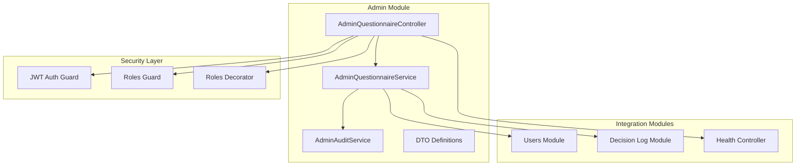
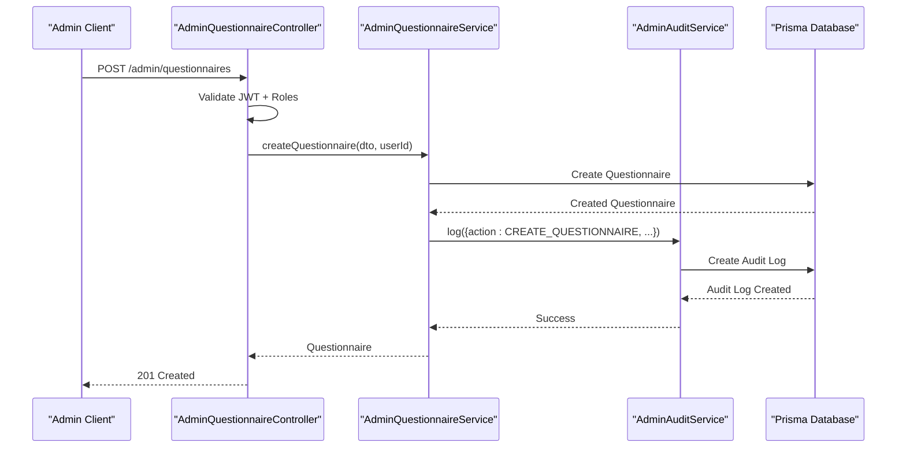
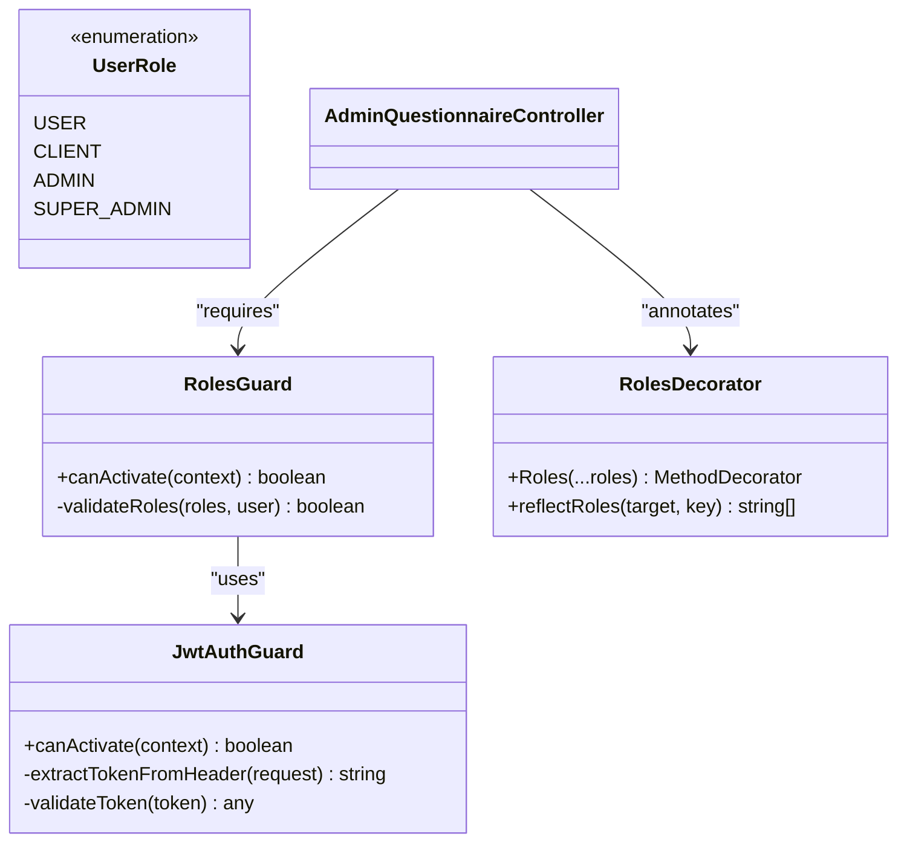
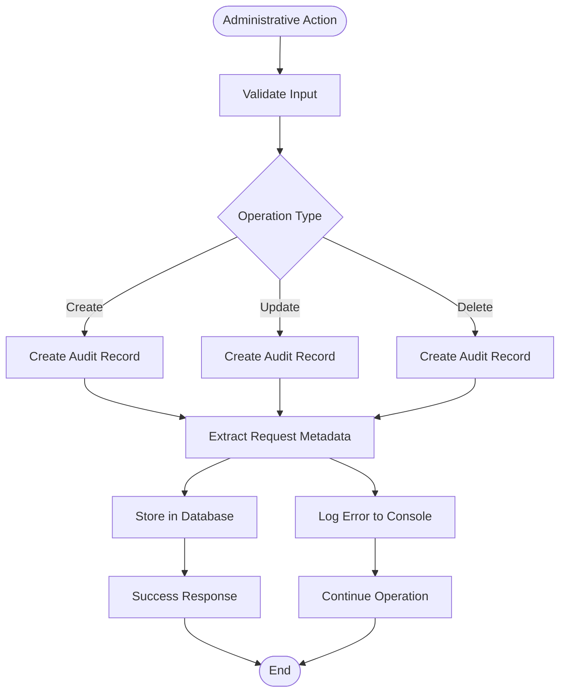
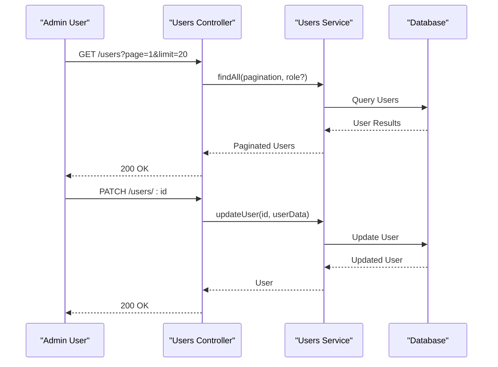
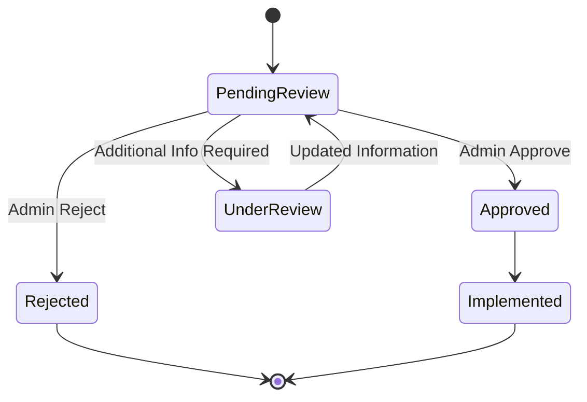
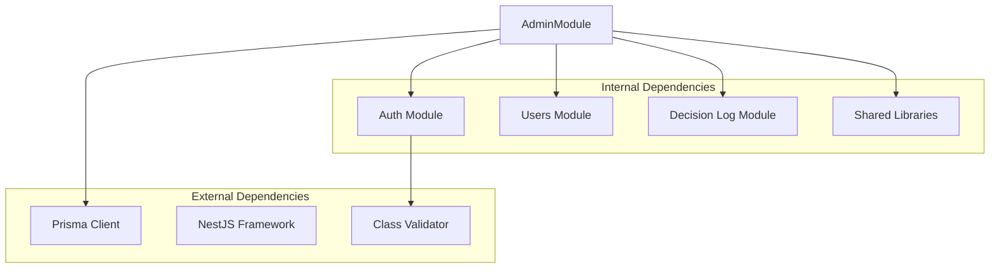

# Admin Management API

<cite>
**Referenced Files in This Document**
- [admin.module.ts](file://apps/api/src/modules/admin/admin.module.ts)
- [admin-questionnaire.controller.ts](file://apps/api/src/modules/admin/controllers/admin-questionnaire.controller.ts)
- [admin-questionnaire.service.ts](file://apps/api/src/modules/admin/services/admin-questionnaire.service.ts)
- [admin-audit.service.ts](file://apps/api/src/modules/admin/services/admin-audit.service.ts)
- [create-questionnaire.dto.ts](file://apps/api/src/modules/admin/dto/create-questionnaire.dto.ts)
- [update-questionnaire.dto.ts](file://apps/api/src/modules/admin/dto/update-questionnaire.dto.ts)
- [create-section.dto.ts](file://apps/api/src/modules/admin/dto/create-section.dto.ts)
- [update-section.dto.ts](file://apps/api/src/modules/admin/dto/update-section.dto.ts)
- [create-question.dto.ts](file://apps/api/src/modules/admin/dto/create-question.dto.ts)
- [health.controller.ts](file://apps/api/src/health.controller.ts)
- [jwt-auth.guard.ts](file://apps/api/src/modules/auth/guards/jwt-auth.guard.ts)
- [roles.guard.ts](file://apps/api/src/modules/auth/guards/roles.guard.ts)
- [roles.decorator.ts](file://apps/api/src/modules/auth/decorators/roles.decorator.ts)
- [auth.service.ts](file://apps/api/src/modules/auth/auth.service.ts)
- [users.controller.ts](file://apps/api/src/modules/users/users.controller.ts)
- [users.service.ts](file://apps/api/src/modules/users/users.service.ts)
- [decision-log.controller.ts](file://apps/api/src/modules/decision-log/decision-log.controller.ts)
- [approval-workflow.service.ts](file://apps/api/src/modules/decision-log/approval-workflow.service.ts)
- [decision-log.service.ts](file://apps/api/src/modules/decision-log/decision-log.service.ts)
- [admin-approval-workflow.flow.test.ts](file://apps/api/test/integration/admin-approval-workflow.flow.test.ts)
- [dashboard.e2e.test.ts](file://e2e/admin/dashboard.e2e.test.ts)
- [configuration.ts](file://apps/api/src/config/configuration.ts)
- [feature-flags.config.ts](file://apps/api/src/config/feature-flags.config.ts)
- [uptime-monitoring.config.ts](file://apps/api/src/config/uptime-monitoring.config.ts)
- [appinsights.config.ts](file://apps/api/src/config/appinsights.config.ts)
- [logger.config.ts](file://apps/api/src/config/logger.config.ts)
- [monitoring folder](file://apps/api/src/common/monitoring/)
- [memory-optimization.service.ts](file://apps/api/src/common/services/memory-optimization.service.ts)
</cite>

## Table of Contents
1. [Introduction](#introduction)
2. [Project Structure](#project-structure)
3. [Core Components](#core-components)
4. [Architecture Overview](#architecture-overview)
5. [Detailed Component Analysis](#detailed-component-analysis)
6. [Dependency Analysis](#dependency-analysis)
7. [Performance Considerations](#performance-considerations)
8. [Troubleshooting Guide](#troubleshooting-guide)
9. [Conclusion](#conclusion)

## Introduction
This document provides comprehensive API documentation for Quiz-to-Build's administrative management endpoints. It covers user management APIs, role-based access controls, organizational administration services, decision log management, approval workflow endpoints, administrative audit trails, system configuration APIs, feature flag management, administrative reporting services, bulk user operations, permission management, administrative dashboards, administrative workflows, approval processes, system monitoring endpoints, administrative security measures, audit logging, privileged access controls, system health monitoring, performance metrics, and administrative troubleshooting endpoints.

## Project Structure
The administrative functionality is primarily implemented within the Admin module, which includes:
- AdminQuestionnaireController: Exposes REST endpoints for managing questionnaires, sections, questions, and visibility rules
- AdminQuestionnaireService: Implements business logic for questionnaire CRUD operations and audit logging
- AdminAuditService: Handles administrative audit trail creation and metadata extraction
- DTOs: Strongly-typed request/response models for validation and documentation
- Guards and Decorators: Role-based access control enforcement
- Integration with Users module for user management
- Integration with Decision Log module for approval workflows

**Diagram sources**
- [admin.module.ts:1-14](file://apps/api/src/modules/admin/admin.module.ts#L1-L14)
- [admin-questionnaire.controller.ts:35-39](file://apps/api/src/modules/admin/controllers/admin-questionnaire.controller.ts#L35-L39)
- [admin-questionnaire.service.ts:35-40](file://apps/api/src/modules/admin/services/admin-questionnaire.service.ts#L35-L40)

**Section sources**
- [admin.module.ts:1-14](file://apps/api/src/modules/admin/admin.module.ts#L1-L14)
- [admin-questionnaire.controller.ts:1-275](file://apps/api/src/modules/admin/controllers/admin-questionnaire.controller.ts#L1-L275)

## Core Components
The Admin module consists of three primary components working together to provide comprehensive administrative capabilities:

### AdminQuestionnaireController
REST API controller that exposes endpoints for managing the complete questionnaire lifecycle including CRUD operations for questionnaires, sections, questions, and visibility rules. All endpoints are protected by JWT authentication and role-based authorization.

### AdminQuestionnaireService
Core business logic implementation that handles:
- Complete questionnaire CRUD operations with proper validation and error handling
- Transactional operations for bulk updates and reordering
- Audit trail generation for all administrative actions
- Cascade operations and referential integrity maintenance
- Complex nested entity relationships (questionnaire → sections → questions → visibility rules)

### AdminAuditService
Centralized audit logging system that captures:
- All administrative actions with detailed change tracking
- Request metadata including IP address, user agent, and request IDs
- Structured audit logs for compliance and monitoring
- Error handling for audit logging failures

**Section sources**
- [admin-questionnaire.controller.ts:35-275](file://apps/api/src/modules/admin/controllers/admin-questionnaire.controller.ts#L35-L275)
- [admin-questionnaire.service.ts:35-575](file://apps/api/src/modules/admin/services/admin-questionnaire.service.ts#L35-L575)
- [admin-audit.service.ts:15-58](file://apps/api/src/modules/admin/services/admin-audit.service.ts#L15-L58)

## Architecture Overview
The administrative API follows a layered architecture with clear separation of concerns:

**Diagram sources**
- [admin-questionnaire.controller.ts:72-81](file://apps/api/src/modules/admin/controllers/admin-questionnaire.controller.ts#L72-L81)
- [admin-questionnaire.service.ts:94-116](file://apps/api/src/modules/admin/services/admin-questionnaire.service.ts#L94-L116)
- [admin-audit.service.ts:21-44](file://apps/api/src/modules/admin/services/admin-audit.service.ts#L21-L44)

The architecture implements several key patterns:
- **Layered Architecture**: Clear separation between presentation, business logic, and data access layers
- **Repository Pattern**: Prisma service abstraction for database operations
- **Audit Trail Pattern**: Centralized logging for all administrative actions
- **Transaction Pattern**: Atomic operations for complex updates
- **DTO Pattern**: Strongly-typed request/response validation

## Detailed Component Analysis

### Role-Based Access Control
The system implements a hierarchical role-based access control system with two administrative roles:

**Diagram sources**
- [roles.guard.ts](file://apps/api/src/modules/auth/guards/roles.guard.ts)
- [jwt-auth.guard.ts](file://apps/api/src/modules/auth/guards/jwt-auth.guard.ts)
- [roles.decorator.ts](file://apps/api/src/modules/auth/decorators/roles.decorator.ts)
- [admin-questionnaire.controller.ts:47-98](file://apps/api/src/modules/admin/controllers/admin-questionnaire.controller.ts#L47-L98)

**Section sources**
- [roles.guard.ts](file://apps/api/src/modules/auth/guards/roles.guard.ts)
- [jwt-auth.guard.ts](file://apps/api/src/modules/auth/guards/jwt-auth.guard.ts)
- [roles.decorator.ts](file://apps/api/src/modules/auth/decorators/roles.decorator.ts)
- [admin-questionnaire.controller.ts:47-98](file://apps/api/src/modules/admin/controllers/admin-questionnaire.controller.ts#L47-L98)

### Questionnaire Management Endpoints
The questionnaire management system provides comprehensive CRUD operations with proper validation and audit logging:

#### Questionnaire Operations
- **GET /admin/questionnaires**: List all questionnaires with pagination support
- **GET /admin/questionnaires/:id**: Retrieve complete questionnaire with sections and questions
- **POST /admin/questionnaires**: Create new questionnaire with metadata
- **PATCH /admin/questionnaires/:id**: Update questionnaire metadata
- **DELETE /admin/questionnaires/:id**: Soft-delete questionnaire (SUPER_ADMIN only)

#### Section Operations  
- **POST /admin/questionnaires/:questionnaireId/sections**: Add section to questionnaire
- **PATCH /admin/sections/:id**: Update section details
- **DELETE /admin/sections/:id**: Delete section (SUPER_ADMIN only)
- **PATCH /admin/questionnaires/:questionnaireId/sections/reorder**: Bulk section reordering

#### Question Operations
- **POST /admin/sections/:sectionId/questions**: Add question to section
- **PATCH /admin/questions/:id**: Update question details
- **DELETE /admin/questions/:id**: Delete question (SUPER_ADMIN only)
- **PATCH /admin/sections/:sectionId/questions/reorder**: Bulk question reordering

#### Visibility Rule Operations
- **GET /admin/questions/:questionId/rules**: List visibility rules for question
- **POST /admin/questions/:questionId/rules**: Add visibility rule
- **PATCH /admin/rules/:id**: Update visibility rule
- **DELETE /admin/rules/:id**: Delete visibility rule

**Section sources**
- [admin-questionnaire.controller.ts:46-274](file://apps/api/src/modules/admin/controllers/admin-questionnaire.controller.ts#L46-L274)

### Audit Trail Management
The audit system provides comprehensive logging for all administrative actions:

**Diagram sources**
- [admin-audit.service.ts:21-44](file://apps/api/src/modules/admin/services/admin-audit.service.ts#L21-L44)

**Section sources**
- [admin-audit.service.ts:15-58](file://apps/api/src/modules/admin/services/admin-audit.service.ts#L15-L58)

### User Management Integration
The administrative system integrates with the user management module for comprehensive organization administration:

**Diagram sources**
- [users.controller.ts](file://apps/api/src/modules/users/users.controller.ts)
- [users.service.ts](file://apps/api/src/modules/users/users.service.ts)

**Section sources**
- [users.controller.ts](file://apps/api/src/modules/users/users.controller.ts)
- [users.service.ts](file://apps/api/src/modules/users/users.service.ts)

### Decision Log and Approval Workflows
The system includes comprehensive decision log management and approval workflow capabilities:

**Diagram sources**
- [decision-log.controller.ts](file://apps/api/src/modules/decision-log/decision-log.controller.ts)
- [approval-workflow.service.ts](file://apps/api/src/modules/decision-log/approval-workflow.service.ts)

**Section sources**
- [decision-log.controller.ts](file://apps/api/src/modules/decision-log/decision-log.controller.ts)
- [approval-workflow.service.ts](file://apps/api/src/modules/decision-log/approval-workflow.service.ts)
- [admin-approval-workflow.flow.test.ts:1-50](file://apps/api/test/integration/admin-approval-workflow.flow.test.ts#L1-L50)

## Dependency Analysis
The administrative system has well-defined dependencies and integration points:

**Diagram sources**
- [admin.module.ts:1-14](file://apps/api/src/modules/admin/admin.module.ts#L1-L14)
- [admin-questionnaire.service.ts:1-20](file://apps/api/src/modules/admin/services/admin-questionnaire.service.ts#L1-L20)

Key dependency relationships:
- **PrismaModule**: Database abstraction and ORM operations
- **AuthModule**: JWT authentication and role-based authorization
- **UsersModule**: User management and organization administration
- **DecisionLogModule**: Approval workflows and decision tracking
- **SharedLibs**: Common DTOs, pagination, and utilities

**Section sources**
- [admin.module.ts:1-14](file://apps/api/src/modules/admin/admin.module.ts#L1-L14)
- [admin-questionnaire.service.ts:1-20](file://apps/api/src/modules/admin/services/admin-questionnaire.service.ts#L1-L20)

## Performance Considerations
The administrative API implements several performance optimization strategies:

### Database Optimization
- **Batch Operations**: Bulk updates use Prisma transactions for atomicity and performance
- **Lazy Loading**: Selective inclusion of related entities to minimize payload size
- **Pagination**: Built-in pagination prevents large result sets
- **Indexing**: Strategic database indexing for frequently queried fields

### Memory Management
- **Streaming Responses**: Large dataset responses use streaming where appropriate
- **Memory Optimization**: Dedicated service for memory optimization during intensive operations
- **Connection Pooling**: Efficient database connection management

### Caching Strategy
- **Response Caching**: Appropriate caching for read-heavy administrative operations
- **Query Optimization**: Optimized database queries with proper indexing

**Section sources**
- [memory-optimization.service.ts](file://apps/api/src/common/services/memory-optimization.service.ts)
- [admin-questionnaire.service.ts:46-62](file://apps/api/src/modules/admin/services/admin-questionnaire.service.ts#L46-L62)

## Troubleshooting Guide

### Common Administrative Issues
1. **Permission Denied Errors**: Ensure proper role assignment (ADMIN vs SUPER_ADMIN)
2. **Validation Failures**: Check DTO validation rules and required fields
3. **Audit Log Failures**: Monitor audit service error logs
4. **Transaction Rollbacks**: Review database constraint violations

### Debugging Endpoints
- **Health Check**: GET `/health` for system status
- **Audit Logs**: Query audit logs for recent administrative actions
- **System Metrics**: Monitor performance indicators and error rates

### Security Considerations
- **Audit Trail Verification**: Regular review of administrative actions
- **Role Validation**: Ensure proper authorization for sensitive operations
- **Input Sanitization**: All administrative inputs are validated and sanitized

**Section sources**
- [health.controller.ts](file://apps/api/src/health.controller.ts)
- [admin-audit.service.ts:38-43](file://apps/api/src/modules/admin/services/admin-audit.service.ts#L38-L43)

## Conclusion
The Quiz-to-Build administrative management API provides a comprehensive, secure, and auditable platform for organization administration. The system implements robust role-based access control, comprehensive audit logging, and integrated approval workflows. With its layered architecture, strong typing through DTOs, and extensive security measures, it offers administrators the tools needed for effective system management while maintaining compliance and operational transparency.

The modular design ensures maintainability and extensibility, while the integration with monitoring and logging systems provides comprehensive observability for administrative operations. The combination of automated testing, audit trails, and security controls makes this system suitable for enterprise-grade administrative management.