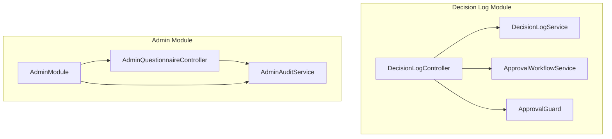
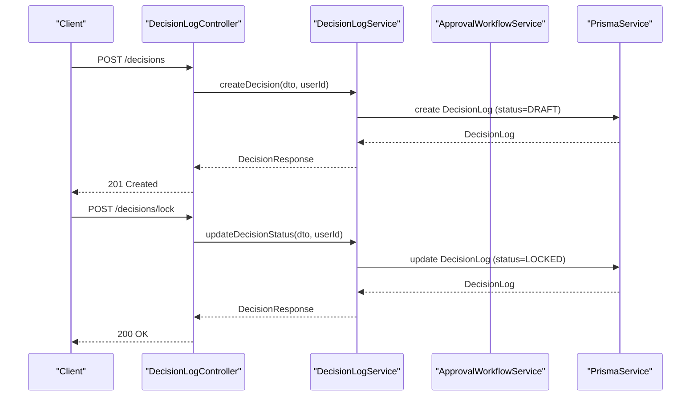
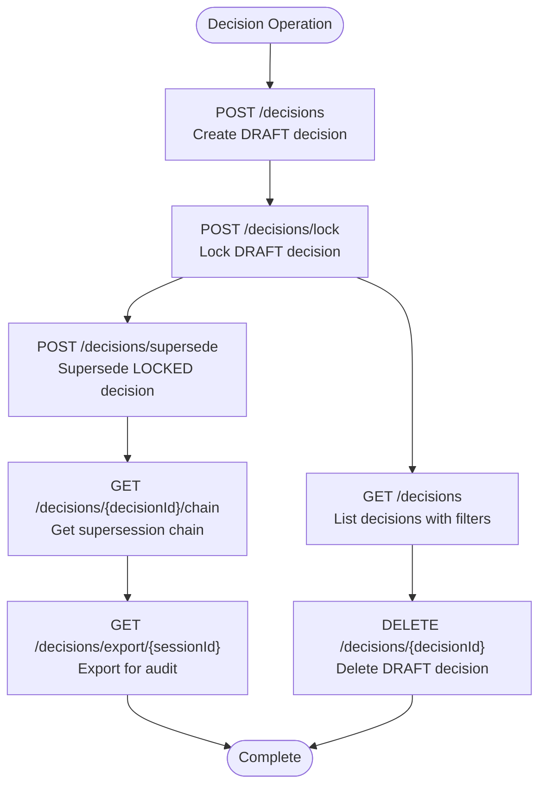
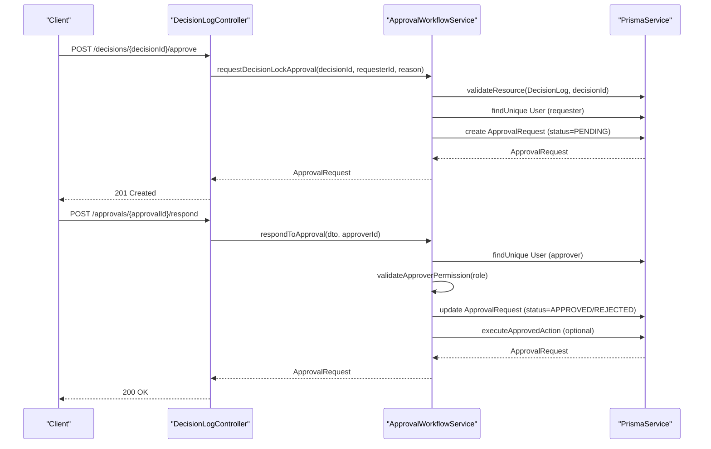
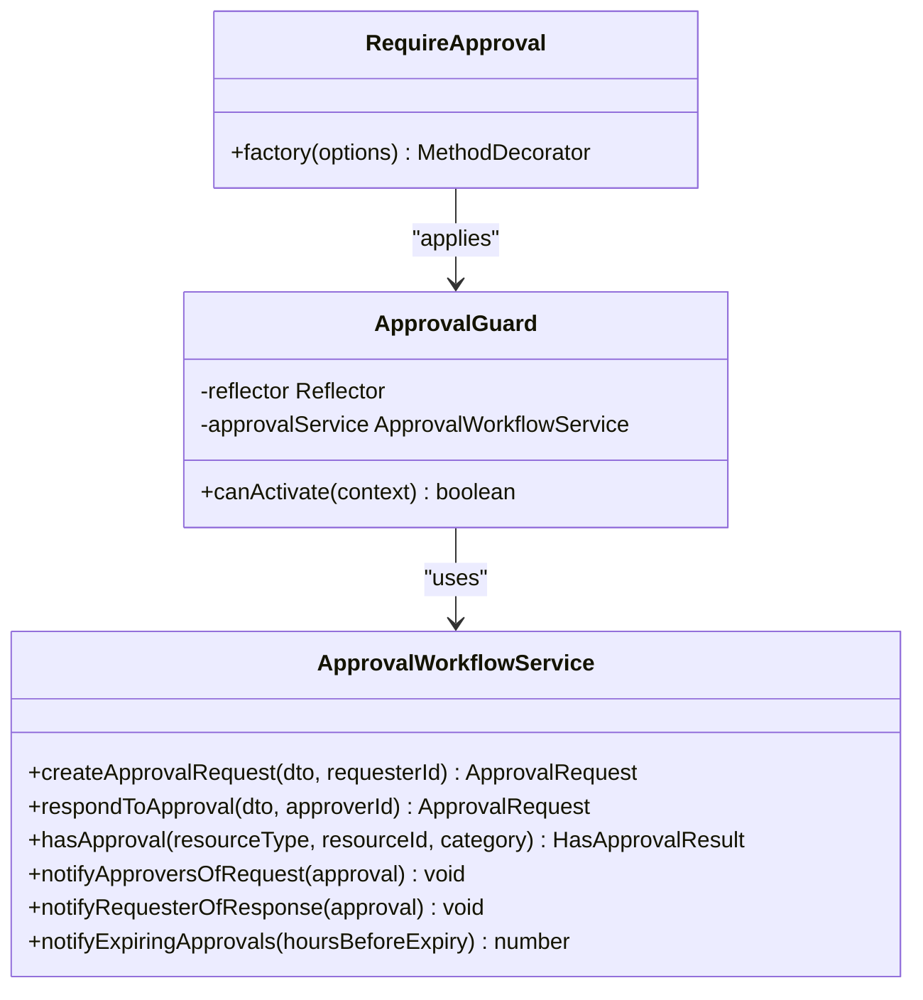
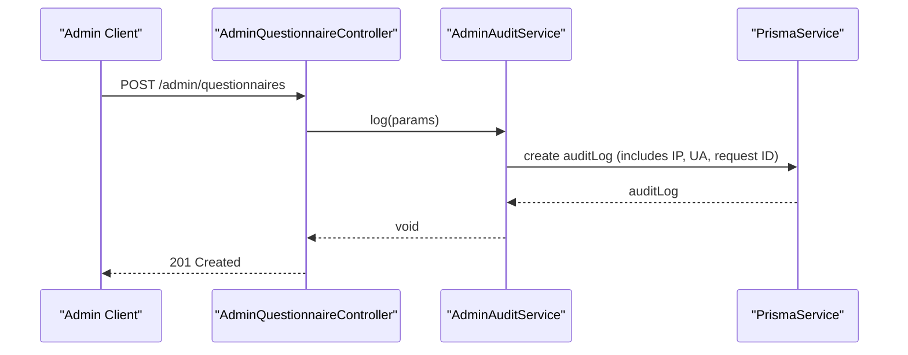
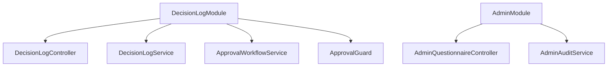

# Decision Workflow API

<cite>
**Referenced Files in This Document**
- [decision-log.module.ts](file://apps/api/src/modules/decision-log/decision-log.module.ts)
- [decision-log.controller.ts](file://apps/api/src/modules/decision-log/decision-log.controller.ts)
- [decision-log.service.ts](file://apps/api/src/modules/decision-log/decision-log.service.ts)
- [approval-workflow.service.ts](file://apps/api/src/modules/decision-log/approval-workflow.service.ts)
- [require-approval.decorator.ts](file://apps/api/src/modules/decision-log/decorators/require-approval.decorator.ts)
- [index.ts](file://apps/api/src/modules/decision-log/index.ts)
- [admin.module.ts](file://apps/api/src/modules/admin/admin.module.ts)
- [admin-questionnaire.controller.ts](file://apps/api/src/modules/admin/controllers/admin-questionnaire.controller.ts)
- [admin-audit.service.ts](file://apps/api/src/modules/admin/services/admin-audit.service.ts)
</cite>

## Table of Contents
1. [Introduction](#introduction)
2. [Project Structure](#project-structure)
3. [Core Components](#core-components)
4. [Architecture Overview](#architecture-overview)
5. [Detailed Component Analysis](#detailed-component-analysis)
6. [Dependency Analysis](#dependency-analysis)
7. [Performance Considerations](#performance-considerations)
8. [Troubleshooting Guide](#troubleshooting-guide)
9. [Conclusion](#conclusion)

## Introduction
This document provides comprehensive API documentation for decision workflow and approval management endpoints. It covers:
- Approval request submission and review processes
- Decision lifecycle management (creation, locking, supersession)
- Workflow configuration, approver assignment, and escalation rules
- Decision log management, audit trail operations, and approval history retrieval
- Workflow status updates, decision notifications, and workflow automation endpoints
- Examples of approval workflows, decision routing, and administrative oversight
- Workflow security, approval permissions, and administrative controls

## Project Structure
The decision workflow functionality is implemented within the Decision Log module and integrated with the Approval Workflow service and decorators. Administrative oversight is provided by the Admin module with dedicated audit capabilities.

**Diagram sources**
- [decision-log.controller.ts:36-40](file://apps/api/src/modules/decision-log/decision-log.controller.ts#L36-L40)
- [decision-log.service.ts:37-41](file://apps/api/src/modules/decision-log/decision-log.service.ts#L37-L41)
- [approval-workflow.service.ts:89-99](file://apps/api/src/modules/decision-log/approval-workflow.service.ts#L89-L99)
- [require-approval.decorator.ts:69-74](file://apps/api/src/modules/decision-log/decorators/require-approval.decorator.ts#L69-L74)
- [admin-questionnaire.controller.ts:35-39](file://apps/api/src/modules/admin/controllers/admin-questionnaire.controller.ts#L35-L39)
- [admin-audit.service.ts:15-19](file://apps/api/src/modules/admin/services/admin-audit.service.ts#L15-L19)

**Section sources**
- [decision-log.module.ts:1-25](file://apps/api/src/modules/decision-log/decision-log.module.ts#L1-L25)
- [admin.module.ts:1-14](file://apps/api/src/modules/admin/admin.module.ts#L1-L14)

## Core Components
- DecisionLogController: Exposes REST endpoints for decision creation, locking, supersession, listing, exporting, and deletion.
- DecisionLogService: Implements append-only decision lifecycle with strict status transitions and audit logging.
- ApprovalWorkflowService: Manages approval requests, responses, notifications, and automated actions upon approval.
- ApprovalGuard and RequireApproval decorators: Enforce two-person rule and approval requirements at runtime.
- AdminQuestionnaireController and AdminAuditService: Provide administrative controls and audit logging for administrative operations.

Key capabilities:
- Two-person rule enforcement for high-risk decisions
- Approval categories and role-based approver permissions
- Automatic decision locking upon approval
- Comprehensive audit trail for compliance
- Supersession chain for decision amendments

**Section sources**
- [decision-log.controller.ts:27-39](file://apps/api/src/modules/decision-log/decision-log.controller.ts#L27-L39)
- [decision-log.service.ts:19-36](file://apps/api/src/modules/decision-log/decision-log.service.ts#L19-L36)
- [approval-workflow.service.ts:75-88](file://apps/api/src/modules/decision-log/approval-workflow.service.ts#L75-L88)
- [require-approval.decorator.ts:14-61](file://apps/api/src/modules/decision-log/decorators/require-approval.decorator.ts#L14-L61)
- [admin-questionnaire.controller.ts:35-39](file://apps/api/src/modules/admin/controllers/admin-questionnaire.controller.ts#L35-L39)
- [admin-audit.service.ts:15-57](file://apps/api/src/modules/admin/services/admin-audit.service.ts#L15-L57)

## Architecture Overview
The system enforces a secure, auditable decision workflow with approval gating and append-only decision records.

**Diagram sources**
- [decision-log.controller.ts:43-66](file://apps/api/src/modules/decision-log/decision-log.controller.ts#L43-L66)
- [decision-log.service.ts:48-74](file://apps/api/src/modules/decision-log/decision-log.service.ts#L48-L74)
- [decision-log.service.ts:86-123](file://apps/api/src/modules/decision-log/decision-log.service.ts#L86-L123)

**Section sources**
- [decision-log.controller.ts:43-98](file://apps/api/src/modules/decision-log/decision-log.controller.ts#L43-L98)
- [decision-log.service.ts:48-123](file://apps/api/src/modules/decision-log/decision-log.service.ts#L48-L123)

## Detailed Component Analysis

### Decision Management Endpoints
Endpoints for creating, locking, updating status, superseding, listing, retrieving chains, exporting for audit, and deleting draft decisions.

**Diagram sources**
- [decision-log.controller.ts:43-278](file://apps/api/src/modules/decision-log/decision-log.controller.ts#L43-L278)

Operational notes:
- Append-only enforcement prevents modification of locked decisions; use supersession to amend.
- Deletion is restricted to DRAFT decisions.
- Audit export includes supersession chain mapping for compliance review.

**Section sources**
- [decision-log.controller.ts:43-278](file://apps/api/src/modules/decision-log/decision-log.controller.ts#L43-L278)
- [decision-log.service.ts:76-347](file://apps/api/src/modules/decision-log/decision-log.service.ts#L76-L347)

### Approval Workflow Endpoints and Decorators
Approval requests and responses are managed through dedicated endpoints and enforced via decorators.

**Diagram sources**
- [approval-workflow.service.ts:108-160](file://apps/api/src/modules/decision-log/approval-workflow.service.ts#L108-L160)
- [approval-workflow.service.ts:172-243](file://apps/api/src/modules/decision-log/approval-workflow.service.ts#L172-L243)
- [require-approval.decorator.ts:69-84](file://apps/api/src/modules/decision-log/decorators/require-approval.decorator.ts#L69-L84)

Approval categories and permissions:
- POLICY_LOCK: Requires ADMIN or SUPER_ADMIN
- ADR_APPROVAL: Requires DEVELOPER, ADMIN, or SUPER_ADMIN
- HIGH_RISK_DECISION: Requires DEVELOPER, ADMIN, or SUPER_ADMIN
- SECURITY_EXCEPTION: Requires ADMIN or SUPER_ADMIN
- DATA_ACCESS: Requires ADMIN or SUPER_ADMIN

Expiration and notifications:
- Default expiration: 72 hours
- Notifications for new requests, responses, and expiring approvals
- Eligible approvers fetched by role-based criteria

**Section sources**
- [approval-workflow.service.ts:15-31](file://apps/api/src/modules/decision-log/approval-workflow.service.ts#L15-L31)
- [approval-workflow.service.ts:444-463](file://apps/api/src/modules/decision-log/approval-workflow.service.ts#L444-L463)
- [approval-workflow.service.ts:533-585](file://apps/api/src/modules/decision-log/approval-workflow.service.ts#L533-L585)
- [approval-workflow.service.ts:618-651](file://apps/api/src/modules/decision-log/approval-workflow.service.ts#L618-L651)

### Security and Permissions
The RequireApproval decorator and ApprovalGuard enforce:
- Two-person rule: requesters cannot approve their own requests
- Role-based approver validation per approval category
- Optional admin bypass control (disabled for security exceptions)
- Metadata-driven enforcement with customizable error messages

**Diagram sources**
- [require-approval.decorator.ts:69-84](file://apps/api/src/modules/decision-log/decorators/require-approval.decorator.ts#L69-L84)
- [require-approval.decorator.ts:59-61](file://apps/api/src/modules/decision-log/decorators/require-approval.decorator.ts#L59-L61)
- [approval-workflow.service.ts:108-160](file://apps/api/src/modules/decision-log/approval-workflow.service.ts#L108-L160)

**Section sources**
- [require-approval.decorator.ts:14-61](file://apps/api/src/modules/decision-log/decorators/require-approval.decorator.ts#L14-L61)
- [require-approval.decorator.ts:69-202](file://apps/api/src/modules/decision-log/decorators/require-approval.decorator.ts#L69-L202)
- [approval-workflow.service.ts:172-243](file://apps/api/src/modules/decision-log/approval-workflow.service.ts#L172-L243)

### Administrative Oversight and Audit
Administrative controllers and audit services provide oversight and compliance logging for administrative operations.

**Diagram sources**
- [admin-questionnaire.controller.ts:76-81](file://apps/api/src/modules/admin/controllers/admin-questionnaire.controller.ts#L76-L81)
- [admin-audit.service.ts:21-44](file://apps/api/src/modules/admin/services/admin-audit.service.ts#L21-L44)

**Section sources**
- [admin-questionnaire.controller.ts:46-107](file://apps/api/src/modules/admin/controllers/admin-questionnaire.controller.ts#L46-L107)
- [admin-audit.service.ts:21-57](file://apps/api/src/modules/admin/services/admin-audit.service.ts#L21-L57)

## Dependency Analysis
The Decision Log module integrates tightly with the Approval Workflow service and decorators, while the Admin module provides separate administrative controls.

**Diagram sources**
- [decision-log.module.ts:18-24](file://apps/api/src/modules/decision-log/decision-log.module.ts#L18-L24)
- [admin.module.ts:7-13](file://apps/api/src/modules/admin/admin.module.ts#L7-L13)

**Section sources**
- [decision-log.module.ts:1-25](file://apps/api/src/modules/decision-log/decision-log.module.ts#L1-L25)
- [admin.module.ts:1-14](file://apps/api/src/modules/admin/admin.module.ts#L1-L14)

## Performance Considerations
- Approval in-memory storage: The service maintains approvals in-memory for demonstration; in production, replace with persistent storage to avoid data loss during restarts.
- Batch notifications: Consider queuing and batching notification triggers for large-scale deployments.
- Pagination: Decision listing supports pagination to manage large result sets efficiently.
- Audit logging overhead: Audit entries are created for all significant operations; ensure database performance is monitored under load.

## Troubleshooting Guide
Common issues and resolutions:
- Approval not found: Verify approval ID and ensure it exists in the approvals map.
- Two-person rule violation: Ensure the approver is not the same user who requested the approval.
- Insufficient permissions: Confirm the approver has the required role for the approval category.
- Decision status errors: Only DRAFT decisions can be locked or deleted; use supersession for locked decisions.
- Resource not found: Ensure the resource type and ID match supported resources.

Audit and logging:
- Review audit logs for approval requests, grants, rejections, and expiry warnings.
- Administrative actions are logged with request metadata (IP, user agent, request ID).

**Section sources**
- [approval-workflow.service.ts:172-243](file://apps/api/src/modules/decision-log/approval-workflow.service.ts#L172-L243)
- [approval-workflow.service.ts:444-463](file://apps/api/src/modules/decision-log/approval-workflow.service.ts#L444-L463)
- [decision-log.service.ts:86-123](file://apps/api/src/modules/decision-log/decision-log.service.ts#L86-L123)
- [admin-audit.service.ts:46-56](file://apps/api/src/modules/admin/services/admin-audit.service.ts#L46-L56)

## Conclusion
The Decision Workflow API provides a robust, auditable framework for managing decisions with strong approval controls and append-only integrity. By leveraging decorators, services, and administrative oversight, organizations can enforce governance policies, maintain compliance, and ensure transparent decision-making processes.