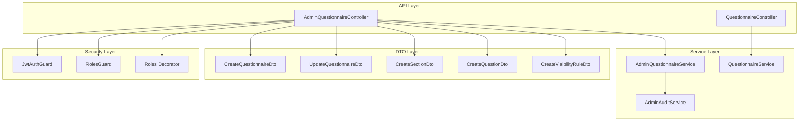
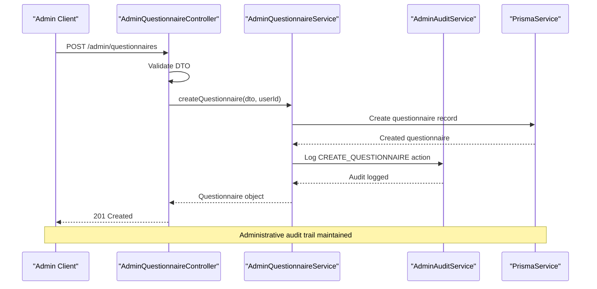
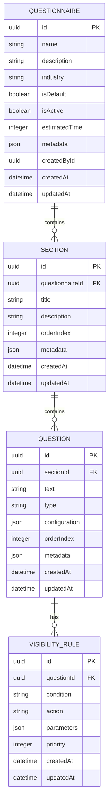
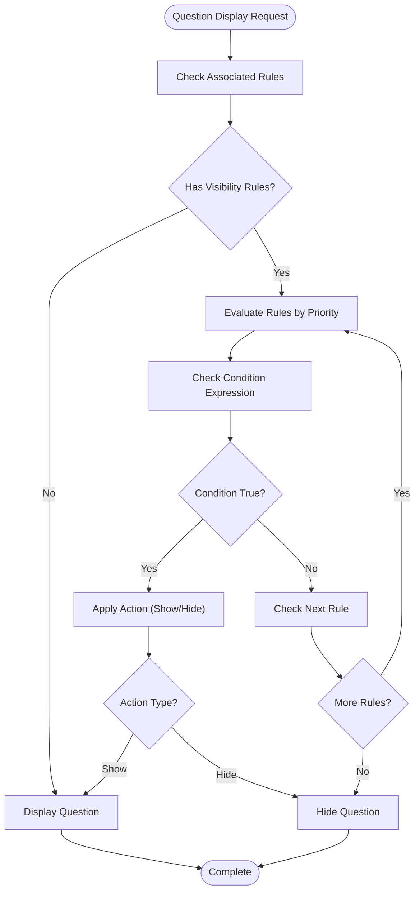
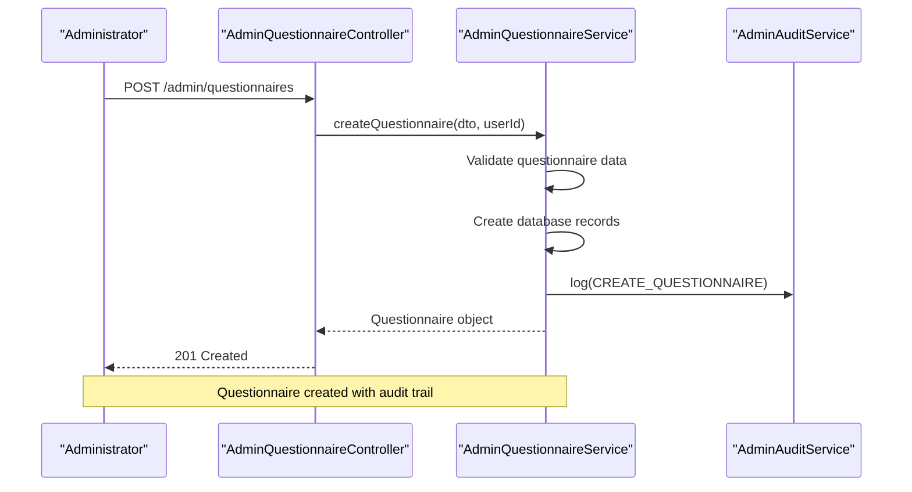

# Questionnaire Administration API

<cite>
**Referenced Files in This Document**
- [admin-questionnaire.controller.ts](file://apps/api/src/modules/admin/controllers/admin-questionnaire.controller.ts)
- [questionnaire.controller.ts](file://apps/api/src/modules/questionnaire/questionnaire.controller.ts)
- [admin-questionnaire.service.ts](file://apps/api/src/modules/admin/services/admin-questionnaire.service.ts)
- [admin.module.ts](file://apps/api/src/modules/admin/admin.module.ts)
- [questionnaire.service.ts](file://apps/api/src/modules/questionnaire/questionnaire.service.ts)
- [create-questionnaire.dto.ts](file://apps/api/src/modules/admin/dto/create-questionnaire.dto.ts)
- [update-questionnaire.dto.ts](file://apps/api/src/modules/admin/dto/update-questionnaire.dto.ts)
- [create-section.dto.ts](file://apps/api/src/modules/admin/dto/create-section.dto.ts)
- [update-section.dto.ts](file://apps/api/src/modules/admin/dto/update-section.dto.ts)
- [create-question.dto.ts](file://apps/api/src/modules/admin/dto/create-question.dto.ts)
- [update-question.dto.ts](file://apps/api/src/modules/admin/dto/update-question.dto.ts)
- [create-visibility-rule.dto.ts](file://apps/api/src/modules/admin/dto/create-visibility-rule.dto.ts)
- [update-visibility-rule.dto.ts](file://apps/api/src/modules/admin/dto/update-visibility-rule.dto.ts)
- [reorder-sections.dto.ts](file://apps/api/src/modules/admin/dto/reorder-sections.dto.ts)
- [reorder-questions.dto.ts](file://apps/api/src/modules/admin/dto/reorder-questions.dto.ts)
- [pagination.dto.ts](file://apps/api/src/common/dto/pagination.dto.ts)
- [jwt-auth.guard.ts](file://apps/api/src/modules/auth/guards/jwt-auth.guard.ts)
- [roles.guard.ts](file://apps/api/src/modules/auth/guards/roles.guard.ts)
- [roles.decorator.ts](file://apps/api/src/modules/auth/decorators/roles.decorator.ts)
- [user.decorator.ts](file://apps/api/src/modules/auth/decorators/user.decorator.ts)
- [admin-audit.service.ts](file://apps/api/src/modules/admin/services/admin-audit.service.ts)
</cite>

## Table of Contents
1. [Introduction](#introduction)
2. [Project Structure](#project-structure)
3. [Core Components](#core-components)
4. [Architecture Overview](#architecture-overview)
5. [Detailed Component Analysis](#detailed-component-analysis)
6. [API Reference](#api-reference)
7. [Security and Access Control](#security-and-access-control)
8. [Administrative Workflows](#administrative-workflows)
9. [Performance Considerations](#performance-considerations)
10. [Troubleshooting Guide](#troubleshooting-guide)
11. [Conclusion](#conclusion)

## Introduction

The Questionnaire Administration API provides comprehensive management capabilities for creating, modifying, and deleting questionnaires within the Quiz-to-Build platform. This API enables administrators to manage questionnaire templates, question banks, adaptive logic configurations, and publishing workflows while maintaining strict security controls and audit trails.

The system supports hierarchical questionnaire structures with sections and questions, dynamic visibility rules for adaptive logic, and robust administrative controls for content management. Administrators can create complex questionnaire templates, configure conditional display logic, and manage the entire lifecycle of questionnaire content from creation to publication.

## Project Structure

The questionnaire administration functionality is organized within the NestJS application architecture with clear separation of concerns:

**Diagram sources**
- [admin-questionnaire.controller.ts:1-275](file://apps/api/src/modules/admin/controllers/admin-questionnaire.controller.ts#L1-L275)
- [questionnaire.controller.ts:1-49](file://apps/api/src/modules/questionnaire/questionnaire.controller.ts#L1-L49)
- [admin-questionnaire.service.ts:1-575](file://apps/api/src/modules/admin/services/admin-questionnaire.service.ts#L1-L575)

**Section sources**
- [admin.module.ts:1-14](file://apps/api/src/modules/admin/admin.module.ts#L1-L14)

## Core Components

### AdminQuestionnaireController
The primary controller managing all administrative questionnaire operations with comprehensive CRUD functionality for questionnaires, sections, questions, and visibility rules.

### AdminQuestionnaireService
Core business logic implementation handling all questionnaire management operations including:
- Questionnaire lifecycle management (create, update, soft delete)
- Section and question hierarchy management
- Visibility rule configuration for adaptive logic
- Audit trail integration
- Data validation and business rule enforcement

### QuestionnaireController
Public endpoint controller providing read-only access to available questionnaires for end users.

### AdminAuditService
Comprehensive audit logging system tracking all administrative actions with detailed change documentation.

**Section sources**
- [admin-questionnaire.controller.ts:35-275](file://apps/api/src/modules/admin/controllers/admin-questionnaire.controller.ts#L35-L275)
- [admin-questionnaire.service.ts:35-575](file://apps/api/src/modules/admin/services/admin-questionnaire.service.ts#L35-L575)

## Architecture Overview

The questionnaire administration API follows a layered architecture pattern with clear separation between presentation, business logic, and data access layers:

**Diagram sources**
- [admin-questionnaire.controller.ts:72-81](file://apps/api/src/modules/admin/controllers/admin-questionnaire.controller.ts#L72-L81)
- [admin-questionnaire.service.ts:94-116](file://apps/api/src/modules/admin/services/admin-questionnaire.service.ts#L94-L116)

## Detailed Component Analysis

### Questionnaire Management Operations

The questionnaire management system provides comprehensive CRUD operations with role-based access controls:

#### Questionnaire CRUD Endpoints
- **GET /admin/questionnaires** - List all questionnaires with pagination
- **GET /admin/questionnaires/:id** - Retrieve complete questionnaire with sections and questions
- **POST /admin/questionnaires** - Create new questionnaire with metadata
- **PATCH /admin/questionnaires/:id** - Update questionnaire metadata
- **DELETE /admin/questionnaires/:id** - Soft-delete questionnaire (SUPER_ADMIN only)

#### Section Management Operations
- **POST /admin/questionnaires/:questionnaireId/sections** - Add section to questionnaire
- **PATCH /admin/sections/:id** - Update section details
- **DELETE /admin/sections/:id** - Remove section (SUPER_ADMIN only)
- **PATCH /admin/questionnaires/:questionnaireId/sections/reorder** - Reorder sections

#### Question Management Operations
- **POST /admin/sections/:sectionId/questions** - Add question to section
- **PATCH /admin/questions/:id** - Update question content and configuration
- **DELETE /admin/questions/:id** - Remove question (SUPER_ADMIN only)
- **PATCH /admin/sections/:sectionId/questions/reorder** - Reorder questions within section

#### Visibility Rule Configuration
- **GET /admin/questions/:questionId/rules** - List visibility rules for question
- **POST /admin/questions/:questionId/rules** - Create new visibility rule
- **PATCH /admin/rules/:id** - Update visibility rule
- **DELETE /admin/rules/:id** - Remove visibility rule

**Section sources**
- [admin-questionnaire.controller.ts:46-275](file://apps/api/src/modules/admin/controllers/admin-questionnaire.controller.ts#L46-L275)

### Data Model Relationships

**Diagram sources**
- [admin-questionnaire.service.ts:24-33](file://apps/api/src/modules/admin/services/admin-questionnaire.service.ts#L24-L33)

**Section sources**
- [admin-questionnaire.service.ts:24-33](file://apps/api/src/modules/admin/services/admin-questionnaire.service.ts#L24-L33)

### Adaptive Logic Configuration

The visibility rule system enables sophisticated conditional display logic:

**Diagram sources**
- [create-visibility-rule.dto.ts:1-200](file://apps/api/src/modules/admin/dto/create-visibility-rule.dto.ts#L1-L200)
- [update-visibility-rule.dto.ts:1-200](file://apps/api/src/modules/admin/dto/update-visibility-rule.dto.ts#L1-L200)

## API Reference

### Authentication and Authorization

All administrative endpoints require:
- **JWT Bearer Token**: Authentication via JWT guard
- **Role-Based Access**: ADMIN or SUPER_ADMIN roles required
- **SUPER_ADMIN Privileges**: Additional permissions for deletion operations

### Questionnaire Management Endpoints

#### List Questionnaires
- **Method**: GET
- **Path**: `/admin/questionnaires`
- **Authentication**: JWT + ADMIN/SUPER_ADMIN
- **Response**: Paginated list with metadata counts

#### Get Questionnaire Details
- **Method**: GET
- **Path**: `/admin/questionnaires/{id}`
- **Authentication**: JWT + ADMIN/SUPER_ADMIN
- **Response**: Complete questionnaire with nested sections and questions

#### Create Questionnaire
- **Method**: POST
- **Path**: `/admin/questionnaires`
- **Authentication**: JWT + ADMIN/SUPER_ADMIN
- **Request Body**: CreateQuestionnaireDto
- **Response**: Created questionnaire object

#### Update Questionnaire
- **Method**: PATCH
- **Path**: `/admin/questionnaires/{id}`
- **Authentication**: JWT + ADMIN/SUPER_ADMIN
- **Request Body**: UpdateQuestionnaireDto
- **Response**: Updated questionnaire object

#### Delete Questionnaire
- **Method**: DELETE
- **Path**: `/admin/questionnaires/{id}`
- **Authentication**: JWT + SUPER_ADMIN
- **Response**: Deactivation confirmation

### Section Management Endpoints

#### Create Section
- **Method**: POST
- **Path**: `/admin/questionnaires/{questionnaireId}/sections`
- **Authentication**: JWT + ADMIN/SUPER_ADMIN
- **Request Body**: CreateSectionDto
- **Response**: Created section object

#### Update Section
- **Method**: PATCH
- **Path**: `/admin/sections/{id}`
- **Authentication**: JWT + ADMIN/SUPER_ADMIN
- **Request Body**: UpdateSectionDto
- **Response**: Updated section object

#### Delete Section
- **Method**: DELETE
- **Path**: `/admin/sections/{id}`
- **Authentication**: JWT + SUPER_ADMIN
- **Response**: Deletion confirmation

#### Reorder Sections
- **Method**: PATCH
- **Path**: `/admin/questionnaires/{questionnaireId}/sections/reorder`
- **Authentication**: JWT + ADMIN/SUPER_ADMIN
- **Request Body**: ReorderSectionsDto
- **Response**: Confirmation of reordering

### Question Management Endpoints

#### Create Question
- **Method**: POST
- **Path**: `/admin/sections/{sectionId}/questions`
- **Authentication**: JWT + ADMIN/SUPER_ADMIN
- **Request Body**: CreateQuestionDto
- **Response**: Created question object

#### Update Question
- **Method**: PATCH
- **Path**: `/admin/questions/{id}`
- **Authentication**: JWT + ADMIN/SUPER_ADMIN
- **Request Body**: UpdateQuestionDto
- **Response**: Updated question object

#### Delete Question
- **Method**: DELETE
- **Path**: `/admin/questions/{id}`
- **Authentication**: JWT + SUPER_ADMIN
- **Response**: Deletion confirmation

#### Reorder Questions
- **Method**: PATCH
- **Path**: `/admin/sections/{sectionId}/questions/reorder`
- **Authentication**: JWT + ADMIN/SUPER_ADMIN
- **Request Body**: ReorderQuestionsDto
- **Response**: Confirmation of reordering

### Visibility Rule Endpoints

#### List Visibility Rules
- **Method**: GET
- **Path**: `/admin/questions/{questionId}/rules`
- **Authentication**: JWT + ADMIN/SUPER_ADMIN
- **Response**: Array of visibility rules

#### Create Visibility Rule
- **Method**: POST
- **Path**: `/admin/questions/{questionId}/rules`
- **Authentication**: JWT + ADMIN/SUPER_ADMIN
- **Request Body**: CreateVisibilityRuleDto
- **Response**: Created rule object

#### Update Visibility Rule
- **Method**: PATCH
- **Path**: `/admin/rules/{id}`
- **Authentication**: JWT + ADMIN/SUPER_ADMIN
- **Request Body**: UpdateVisibilityRuleDto
- **Response**: Updated rule object

#### Delete Visibility Rule
- **Method**: DELETE
- **Path**: `/admin/rules/{id}`
- **Authentication**: JWT + ADMIN/SUPER_ADMIN
- **Response**: Deletion confirmation

**Section sources**
- [admin-questionnaire.controller.ts:46-275](file://apps/api/src/modules/admin/controllers/admin-questionnaire.controller.ts#L46-L275)

## Security and Access Control

### Role-Based Permissions

The system implements a tiered permission model:

| Endpoint | Required Role | Description |
|----------|---------------|-------------|
| Questionnaire CRUD | ADMIN | Basic questionnaire management |
| Section CRUD | ADMIN | Section-level modifications |
| Question CRUD | ADMIN | Question-level modifications |
| Visibility Rules | ADMIN | Conditional logic configuration |
| Soft Delete | SUPER_ADMIN | Questionnaire removal |
| Hard Delete | SUPER_ADMIN | Permanent data deletion |

### Security Measures

1. **JWT Authentication**: All endpoints require valid bearer tokens
2. **Role Validation**: Runtime role checking for each operation
3. **Input Validation**: Comprehensive DTO validation
4. **Audit Logging**: Complete administrative action tracking
5. **Soft Deletion**: Non-destructive removal with recovery capability

### Audit Trail Implementation

Every administrative action generates a detailed audit record containing:
- User identifier
- Action type and timestamp
- Resource modified
- Changes made to the resource
- IP address and user agent

**Section sources**
- [admin-questionnaire.controller.ts:13-39](file://apps/api/src/modules/admin/controllers/admin-questionnaire.controller.ts#L13-L39)
- [admin-audit.service.ts:1-200](file://apps/api/src/modules/admin/services/admin-audit.service.ts#L1-L200)

## Administrative Workflows

### Questionnaire Creation Workflow

**Diagram sources**
- [admin-questionnaire.controller.ts:72-81](file://apps/api/src/modules/admin/controllers/admin-questionnaire.controller.ts#L72-L81)
- [admin-questionnaire.service.ts:94-116](file://apps/api/src/modules/admin/services/admin-questionnaire.service.ts#L94-L116)

### Bulk Operations Support

The API supports efficient bulk operations through:
- **Batch Reordering**: Reorder multiple sections or questions in single requests
- **Bulk Updates**: Update multiple questionnaires or sections simultaneously
- **Hierarchical Management**: Manage entire questionnaire structures atomically

### Publishing and Version Control

While the current implementation focuses on administrative management, the system architecture supports future publishing workflows through:
- Metadata-based version tracking
- Status-based publishing controls
- Approval workflow integration points

**Section sources**
- [admin-questionnaire.service.ts:46-62](file://apps/api/src/modules/admin/services/admin-questionnaire.service.ts#L46-L62)

## Performance Considerations

### Database Optimization

1. **Lazy Loading**: Sections and questions loaded only when requested
2. **Pagination**: Built-in pagination for large dataset navigation
3. **Indexing**: Strategic database indexing for frequently queried fields
4. **Connection Pooling**: Efficient database connection management

### Caching Strategies

- **Read-Heavy Optimization**: Frequently accessed questionnaires cached
- **ETag Support**: HTTP caching headers for reduced bandwidth
- **Query Optimization**: Minimized N+1 query patterns through proper includes

### Scalability Features

- **Horizontal Scaling**: Stateless API design supporting load balancing
- **Database Sharding**: Potential for questionnaire-based sharding
- **Asynchronous Processing**: Background tasks for heavy operations

## Troubleshooting Guide

### Common Error Scenarios

#### Authentication Failures
- **401 Unauthorized**: Invalid or missing JWT token
- **403 Forbidden**: Insufficient role permissions
- **401 Invalid Token**: Expired or malformed token

#### Data Validation Errors
- **400 Bad Request**: Invalid DTO structure or missing required fields
- **422 Unprocessable Entity**: Business rule violations
- **409 Conflict**: Duplicate resource creation attempts

#### Resource Management Issues
- **404 Not Found**: Attempted operation on non-existent resource
- **400 Bad Request**: Invalid operation for resource state
- **409 Conflict**: Resource dependencies preventing operation

### Debugging Tools

1. **Audit Logs**: Comprehensive administrative action tracking
2. **Request Validation**: Detailed error messages for invalid requests
3. **Database Triggers**: Automatic conflict detection and resolution
4. **Monitoring Integration**: Performance metrics and error tracking

**Section sources**
- [admin-questionnaire.service.ts:155-178](file://apps/api/src/modules/admin/services/admin-questionnaire.service.ts#L155-L178)

## Conclusion

The Questionnaire Administration API provides a comprehensive, secure, and scalable solution for managing questionnaire content within the Quiz-to-Build platform. The system's layered architecture ensures maintainability while its role-based security model protects against unauthorized access.

Key strengths include:
- **Complete CRUD Operations**: Full lifecycle management of questionnaire content
- **Adaptive Logic Support**: Sophisticated conditional display configuration
- **Robust Security**: Multi-layered authentication and authorization
- **Comprehensive Auditing**: Complete administrative action tracking
- **Performance Optimization**: Efficient database operations and caching

The API's modular design allows for future enhancements including advanced publishing workflows, approval processes, and expanded version control capabilities while maintaining backward compatibility and system stability.