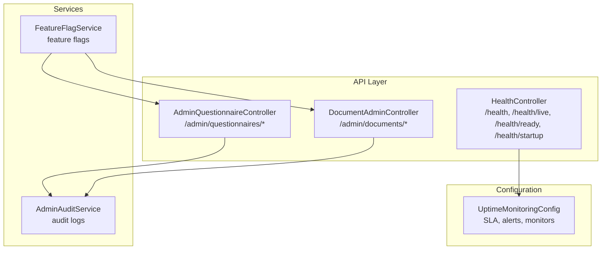
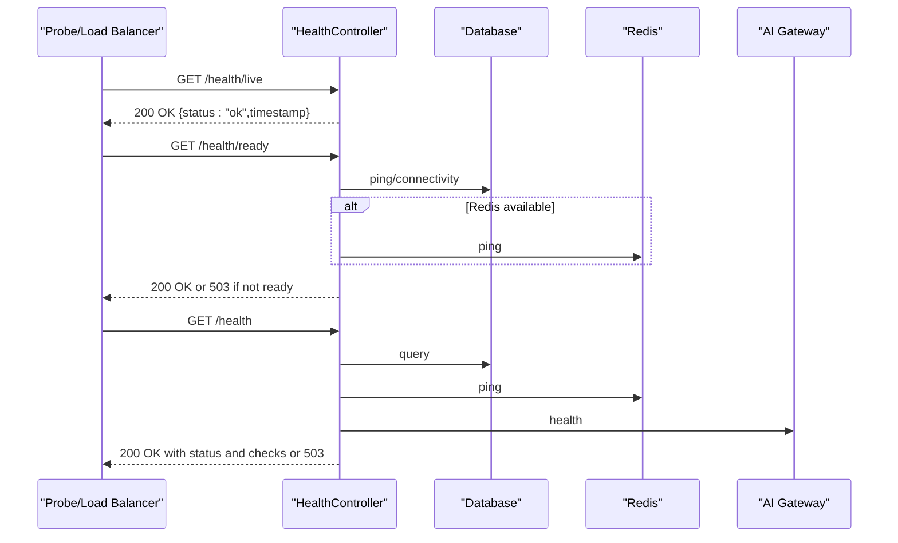
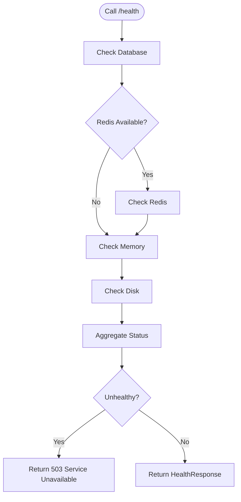
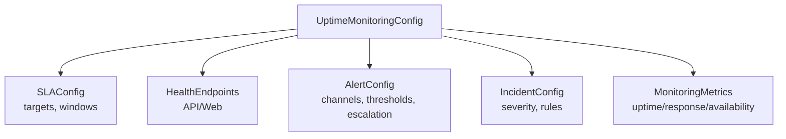
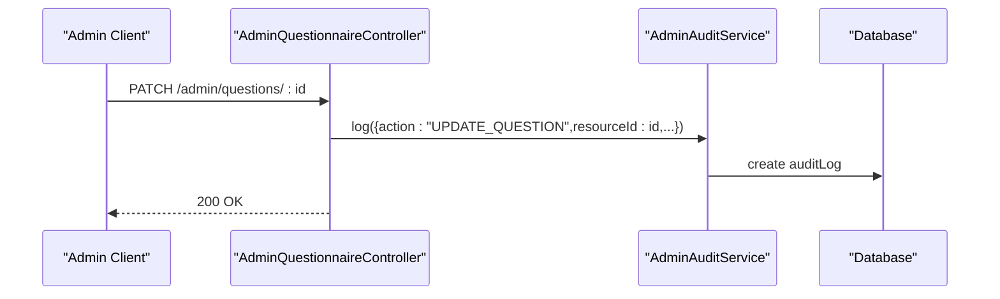
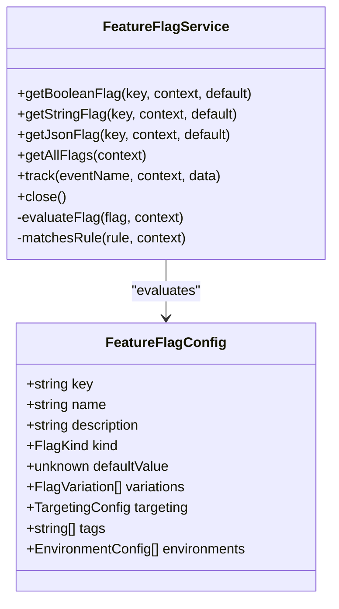
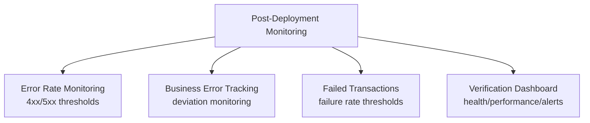
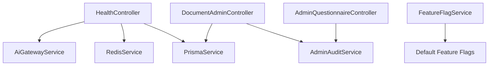

# System Monitoring API

<cite>
**Referenced Files in This Document**
- [health.controller.ts](file://apps/api/src/health.controller.ts)
- [uptime-monitoring.config.ts](file://apps/api/src/config/uptime-monitoring.config.ts)
- [admin-questionnaire.controller.ts](file://apps/api/src/modules/admin/controllers/admin-questionnaire.controller.ts)
- [document-admin.controller.ts](file://apps/api/src/modules/document-generator/controllers/document-admin.controller.ts)
- [admin-audit.service.ts](file://apps/api/src/modules/admin/services/admin-audit.service.ts)
- [feature-flags.config.ts](file://apps/api/src/config/feature-flags.config.ts)
- [POST-DEPLOYMENT-TESTING-PROTOCOL.md](file://docs/testing/POST-DEPLOYMENT-TESTING-PROTOCOL.md)
- [POST-DEPLOYMENT-VERIFICATION.md](file://docs/testing/POST-DEPLOYMENT-VERIFICATION.md)
</cite>

## Table of Contents
1. [Introduction](#introduction)
2. [Project Structure](#project-structure)
3. [Core Components](#core-components)
4. [Architecture Overview](#architecture-overview)
5. [Detailed Component Analysis](#detailed-component-analysis)
6. [Dependency Analysis](#dependency-analysis)
7. [Performance Considerations](#performance-considerations)
8. [Troubleshooting Guide](#troubleshooting-guide)
9. [Conclusion](#conclusion)
10. [Appendices](#appendices)

## Introduction
This document provides comprehensive API documentation for system monitoring and administrative oversight endpoints. It covers:
- System health checks and Kubernetes probes
- Performance metrics and uptime monitoring configuration
- Administrative dashboards and audit log retrieval
- System configuration endpoints, feature flag management, and administrative reporting
- Diagnostics, troubleshooting, and security access controls

The goal is to enable operators and administrators to monitor system health, enforce access controls, manage configurations, and troubleshoot issues effectively.

## Project Structure
The monitoring and administrative capabilities are primarily implemented in:
- Health controller exposing Kubernetes-compatible health endpoints
- Uptime monitoring configuration for external monitoring services
- Admin controllers for questionnaire and document administration
- Audit logging service for administrative actions
- Feature flags configuration and evaluation service
- Operational documentation for post-deployment monitoring

**Diagram sources**
- [health.controller.ts:52-234](file://apps/api/src/health.controller.ts#L52-L234)
- [admin-questionnaire.controller.ts:35-275](file://apps/api/src/modules/admin/controllers/admin-questionnaire.controller.ts#L35-L275)
- [document-admin.controller.ts:30-265](file://apps/api/src/modules/document-generator/controllers/document-admin.controller.ts#L30-L265)
- [admin-audit.service.ts:15-58](file://apps/api/src/modules/admin/services/admin-audit.service.ts#L15-L58)
- [uptime-monitoring.config.ts:1-379](file://apps/api/src/config/uptime-monitoring.config.ts#L1-L379)
- [feature-flags.config.ts:695-826](file://apps/api/src/config/feature-flags.config.ts#L695-L826)

**Section sources**
- [health.controller.ts:52-234](file://apps/api/src/health.controller.ts#L52-L234)
- [uptime-monitoring.config.ts:1-379](file://apps/api/src/config/uptime-monitoring.config.ts#L1-L379)
- [admin-questionnaire.controller.ts:35-275](file://apps/api/src/modules/admin/controllers/admin-questionnaire.controller.ts#L35-L275)
- [document-admin.controller.ts:30-265](file://apps/api/src/modules/document-generator/controllers/document-admin.controller.ts#L30-L265)
- [admin-audit.service.ts:15-58](file://apps/api/src/modules/admin/services/admin-audit.service.ts#L15-L58)
- [feature-flags.config.ts:695-826](file://apps/api/src/config/feature-flags.config.ts#L695-L826)

## Core Components
- HealthController: Provides Kubernetes liveness, readiness, startup, and full health endpoints with dependency checks and memory/disk diagnostics.
- UptimeMonitoringConfig: Defines SLA targets, health endpoint monitoring, alert channels, escalation policies, and status messages.
- Admin controllers: Expose administrative endpoints for questionnaire/document management with role-based access control.
- AdminAuditService: Logs administrative actions with request metadata for auditability.
- FeatureFlagService: Manages feature flags and A/B tests with targeting rules and environment-specific configurations.

**Section sources**
- [health.controller.ts:52-234](file://apps/api/src/health.controller.ts#L52-L234)
- [uptime-monitoring.config.ts:12-379](file://apps/api/src/config/uptime-monitoring.config.ts#L12-L379)
- [admin-questionnaire.controller.ts:35-275](file://apps/api/src/modules/admin/controllers/admin-questionnaire.controller.ts#L35-L275)
- [document-admin.controller.ts:30-265](file://apps/api/src/modules/document-generator/controllers/document-admin.controller.ts#L30-L265)
- [admin-audit.service.ts:15-58](file://apps/api/src/modules/admin/services/admin-audit.service.ts#L15-L58)
- [feature-flags.config.ts:695-826](file://apps/api/src/config/feature-flags.config.ts#L695-L826)

## Architecture Overview
The monitoring and administrative architecture integrates health checks, uptime monitoring, admin endpoints, auditing, and feature flags.

**Diagram sources**
- [health.controller.ts:147-234](file://apps/api/src/health.controller.ts#L147-L234)

**Section sources**
- [health.controller.ts:68-234](file://apps/api/src/health.controller.ts#L68-L234)

## Detailed Component Analysis

### Health and Kubernetes Probes
- Endpoints:
  - GET /health/live: Liveness probe confirming process is alive.
  - GET /health/ready: Readiness probe verifying database and optional Redis connectivity.
  - GET /health: Full health check including database, Redis, AI gateway, memory, and disk.
  - GET /health/startup: Startup probe similar to readiness.
- Behavior:
  - Returns structured responses with status, timestamps, and component checks.
  - Throws HTTP 503 when overall status is unhealthy or not ready.
  - Uses dependency checks with response times and thresholds for degraded states.

**Diagram sources**
- [health.controller.ts:75-141](file://apps/api/src/health.controller.ts#L75-L141)

**Section sources**
- [health.controller.ts:68-234](file://apps/api/src/health.controller.ts#L68-L234)

### Uptime Monitoring and Alerting
- SLA targets and response time goals define acceptable performance.
- Health endpoints configured for external monitors (UptimeRobot).
- Alert channels include email, Slack, Teams, PagerDuty with escalation levels.
- Severity levels and auto-incident rules trigger alerts based on failures and response times.
- Status messages and metrics (uptime, response time, availability) support status pages.

**Diagram sources**
- [uptime-monitoring.config.ts:12-311](file://apps/api/src/config/uptime-monitoring.config.ts#L12-L311)

**Section sources**
- [uptime-monitoring.config.ts:12-379](file://apps/api/src/config/uptime-monitoring.config.ts#L12-L379)

### Administrative Dashboards and Audit Logging
- AdminQuestionnaireController:
  - Role-based endpoints for managing questionnaires, sections, questions, and visibility rules.
  - Requires JWT and roles guard; supports soft deletion for super admins.
- DocumentAdminController:
  - Manages document types and reviews pending documents with approval/rejection workflows.
  - Supports batch operations for efficiency.
- AdminAuditService:
  - Logs administrative actions with user ID, action, resource type, and request metadata.
  - Extracts IP address, user agent, and request ID for traceability.

**Diagram sources**
- [admin-questionnaire.controller.ts:180-194](file://apps/api/src/modules/admin/controllers/admin-questionnaire.controller.ts#L180-L194)
- [admin-audit.service.ts:21-44](file://apps/api/src/modules/admin/services/admin-audit.service.ts#L21-L44)

**Section sources**
- [admin-questionnaire.controller.ts:35-275](file://apps/api/src/modules/admin/controllers/admin-questionnaire.controller.ts#L35-L275)
- [document-admin.controller.ts:30-265](file://apps/api/src/modules/document-generator/controllers/document-admin.controller.ts#L30-L265)
- [admin-audit.service.ts:15-58](file://apps/api/src/modules/admin/services/admin-audit.service.ts#L15-L58)

### Feature Flag Management
- FeatureFlagService:
  - Evaluates boolean, string, and JSON flags with targeting rules and fallthrough.
  - Supports weighted rollouts, prerequisite flags, and environment-specific configurations.
  - Provides getAllFlags for client-side bootstrapping and track for analytics.
- Default flags include questionnaire flows, AI suggestions, heatmaps, pricing redesign, dark mode, kill switches, and rate limiting configurations.

**Diagram sources**
- [feature-flags.config.ts:695-826](file://apps/api/src/config/feature-flags.config.ts#L695-L826)
- [feature-flags.config.ts:14-102](file://apps/api/src/config/feature-flags.config.ts#L14-L102)

**Section sources**
- [feature-flags.config.ts:695-826](file://apps/api/src/config/feature-flags.config.ts#L695-L826)

### Operational Reporting and Post-Deployment Monitoring
- Post-deployment protocols define error rate monitoring, business error tracking, and failed transaction monitoring with thresholds and rollback triggers.
- Verification dashboard captures real-time health, error tracking, performance comparisons, user impact, and alert counts.

**Diagram sources**
- [POST-DEPLOYMENT-TESTING-PROTOCOL.md:348-393](file://docs/testing/POST-DEPLOYMENT-TESTING-PROTOCOL.md#L348-L393)
- [POST-DEPLOYMENT-VERIFICATION.md:544-591](file://docs/testing/POST-DEPLOYMENT-VERIFICATION.md#L544-L591)

**Section sources**
- [POST-DEPLOYMENT-TESTING-PROTOCOL.md:348-393](file://docs/testing/POST-DEPLOYMENT-TESTING-PROTOCOL.md#L348-L393)
- [POST-DEPLOYMENT-VERIFICATION.md:544-591](file://docs/testing/POST-DEPLOYMENT-VERIFICATION.md#L544-L591)

## Dependency Analysis
- HealthController depends on PrismaService, RedisService, and AiGatewayService for health checks.
- Admin controllers depend on services and guards for authentication and authorization.
- AdminAuditService persists audit logs to the database.
- FeatureFlagService encapsulates flag evaluation and environment configuration.

**Diagram sources**
- [health.controller.ts:56-62](file://apps/api/src/health.controller.ts#L56-L62)
- [admin-questionnaire.controller.ts:39-40](file://apps/api/src/modules/admin/controllers/admin-questionnaire.controller.ts#L39-L40)
- [document-admin.controller.ts:34-38](file://apps/api/src/modules/document-generator/controllers/document-admin.controller.ts#L34-L38)
- [admin-audit.service.ts:19-20](file://apps/api/src/modules/admin/services/admin-audit.service.ts#L19-L20)
- [feature-flags.config.ts:695-724](file://apps/api/src/config/feature-flags.config.ts#L695-L724)

**Section sources**
- [health.controller.ts:56-62](file://apps/api/src/health.controller.ts#L56-L62)
- [admin-questionnaire.controller.ts:39-40](file://apps/api/src/modules/admin/controllers/admin-questionnaire.controller.ts#L39-L40)
- [document-admin.controller.ts:34-38](file://apps/api/src/modules/document-generator/controllers/document-admin.controller.ts#L34-L38)
- [admin-audit.service.ts:19-20](file://apps/api/src/modules/admin/services/admin-audit.service.ts#L19-L20)
- [feature-flags.config.ts:695-724](file://apps/api/src/config/feature-flags.config.ts#L695-L724)

## Performance Considerations
- Health endpoint timeouts and intervals are configured to balance responsiveness and overhead.
- Memory and disk checks use process metrics; slow responses mark components as degraded.
- Uptime monitoring defines response time targets for health checks, API endpoints, and page loads.
- Feature flags support gradual rollouts and can mitigate performance regressions via kill switches.

[No sources needed since this section provides general guidance]

## Troubleshooting Guide
- Kubernetes probes:
  - Verify /health/live returns 200 when the process is alive.
  - /health/ready returns 200 only when database is connected; check database connectivity if 503 is returned.
  - /health/startup mirrors readiness; confirm database availability.
- Health endpoint:
  - Inspect response status and individual component checks; degraded indicates slow dependencies, unhealthy requires immediate attention.
  - Review memory and disk diagnostics included in the response.
- Alerts and incidents:
  - Confirm alert channels and escalation levels; verify external monitoring configuration.
  - Use severity levels to prioritize remediation.
- Audit logs:
  - Investigate AdminAuditService entries for administrative actions; correlate with request metadata.

**Section sources**
- [health.controller.ts:147-234](file://apps/api/src/health.controller.ts#L147-L234)
- [uptime-monitoring.config.ts:155-268](file://apps/api/src/config/uptime-monitoring.config.ts#L155-L268)
- [admin-audit.service.ts:21-58](file://apps/api/src/modules/admin/services/admin-audit.service.ts#L21-L58)

## Conclusion
The system provides robust monitoring and administrative capabilities through dedicated health endpoints, comprehensive uptime monitoring, role-based admin controllers, audit logging, and feature flag management. Operators can leverage these components to maintain system health, enforce access controls, manage configurations, and troubleshoot issues efficiently.

[No sources needed since this section summarizes without analyzing specific files]

## Appendices

### API Reference Summary

- Health Endpoints
  - GET /health/live: Liveness probe
  - GET /health/ready: Readiness probe
  - GET /health: Full health status
  - GET /health/startup: Startup probe

- Admin Questionnaire Endpoints
  - GET /admin/questionnaires
  - GET /admin/questionnaires/:id
  - POST /admin/questionnaires
  - PATCH /admin/questionnaires/:id
  - DELETE /admin/questionnaires/:id
  - POST /admin/questionnaires/:questionnaireId/sections
  - PATCH /admin/sections/:id
  - DELETE /admin/sections/:id
  - PATCH /admin/questionnaires/:questionnaireId/sections/reorder
  - POST /admin/sections/:sectionId/questions
  - PATCH /admin/questions/:id
  - DELETE /admin/questions/:id
  - PATCH /admin/sections/:sectionId/questions/reorder
  - GET /admin/questions/:questionId/rules
  - POST /admin/questions/:questionId/rules
  - PATCH /admin/rules/:id
  - DELETE /admin/rules/:id

- Document Admin Endpoints
  - GET /admin/document-types
  - GET /admin/document-types/:id
  - POST /admin/document-types
  - PATCH /admin/document-types/:id
  - GET /admin/documents/pending-review
  - PATCH /admin/documents/:id/approve
  - PATCH /admin/documents/:id/reject
  - POST /admin/documents/batch-approve
  - POST /admin/documents/batch-reject

- Security and Access Controls
  - All admin endpoints require JWT bearer authentication and roles guard.
  - Soft deletes and restricted operations (e.g., SUPER_ADMIN only) enforce administrative oversight.

**Section sources**
- [health.controller.ts:68-234](file://apps/api/src/health.controller.ts#L68-L234)
- [admin-questionnaire.controller.ts:46-273](file://apps/api/src/modules/admin/controllers/admin-questionnaire.controller.ts#L46-L273)
- [document-admin.controller.ts:44-263](file://apps/api/src/modules/document-generator/controllers/document-admin.controller.ts#L44-L263)