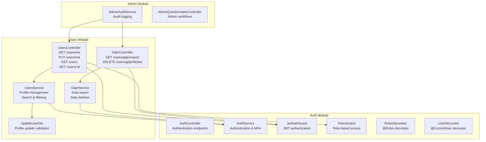
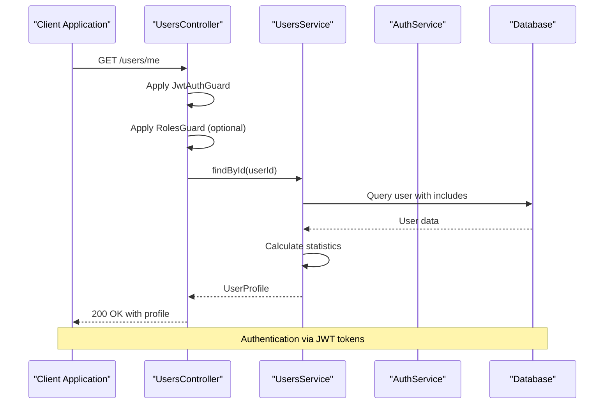
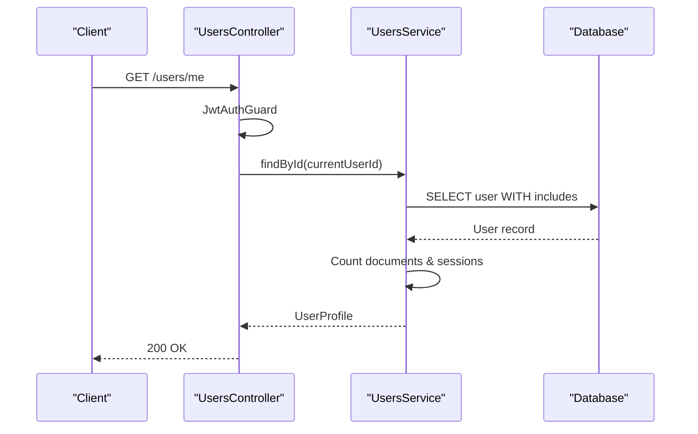
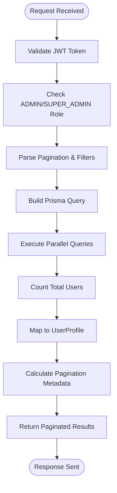
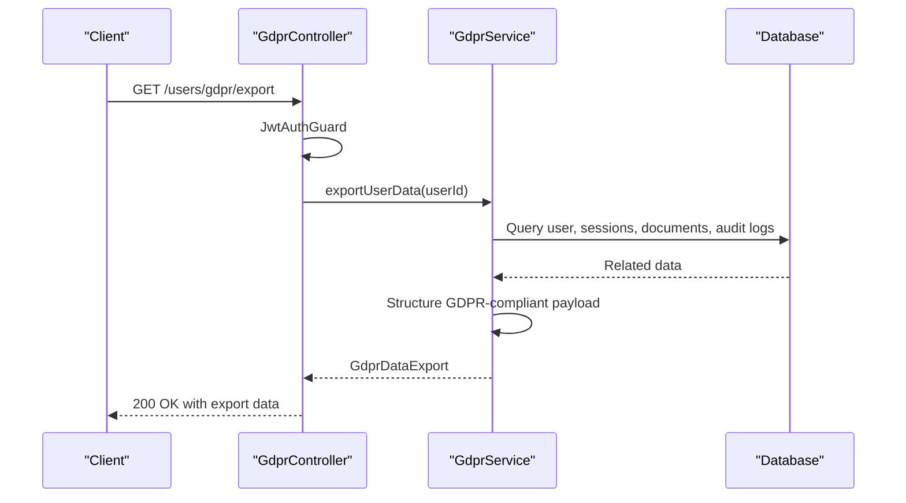
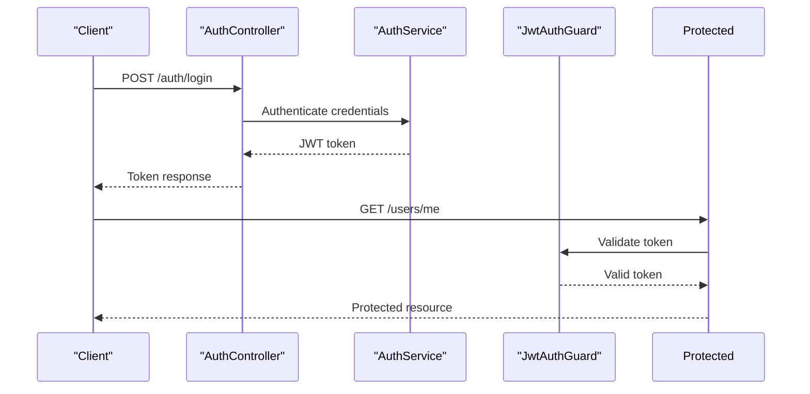
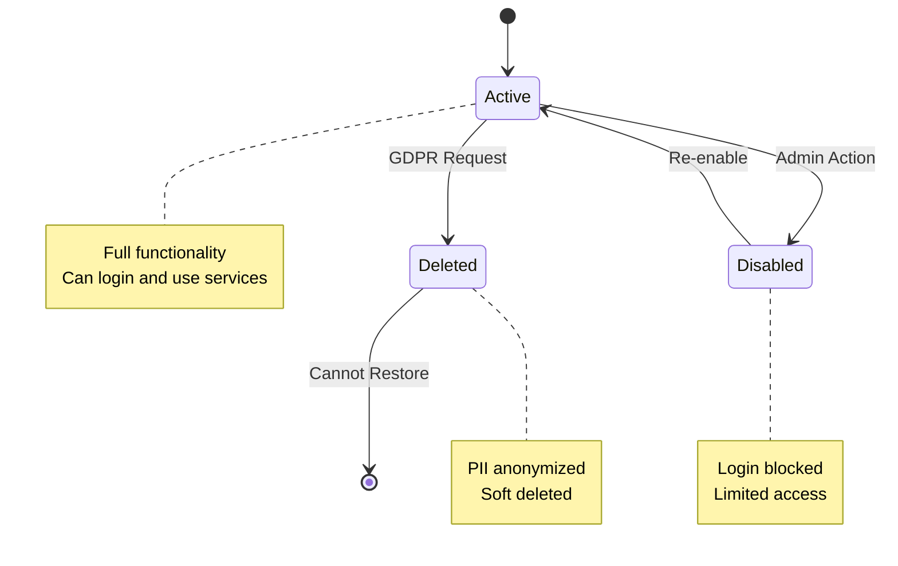
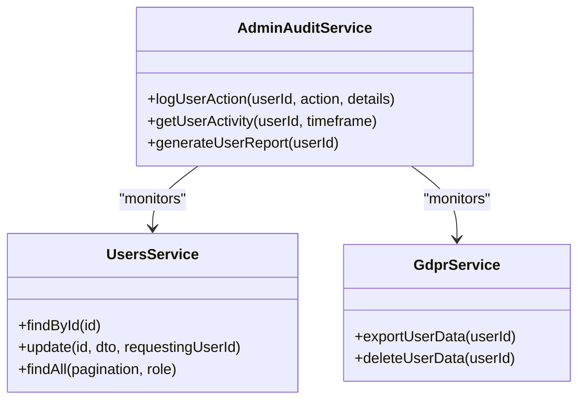
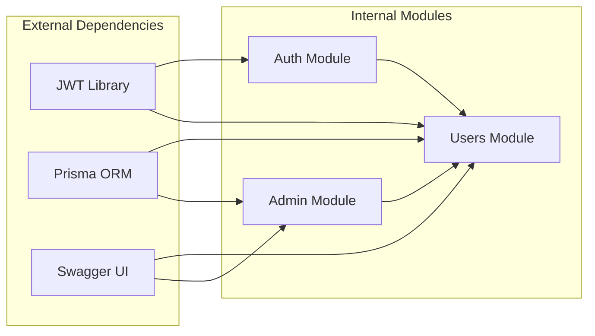

# User Administration API

<cite>
**Referenced Files in This Document**
- [users.controller.ts](file://apps/api/src/modules/users/users.controller.ts)
- [users.service.ts](file://apps/api/src/modules/users/users.service.ts)
- [gdpr.controller.ts](file://apps/api/src/modules/users/gdpr.controller.ts)
- [gdpr.service.ts](file://apps/api/src/modules/users/gdpr.service.ts)
- [update-user.dto.ts](file://apps/api/src/modules/users/dto/update-user.dto.ts)
- [users.module.ts](file://apps/api/src/modules/users/users.module.ts)
- [auth.controller.ts](file://apps/api/src/modules/auth/auth.controller.ts)
- [auth.service.ts](file://apps/api/src/modules/auth/auth.service.ts)
- [jwt-auth.guard.ts](file://apps/api/src/modules/auth/guards/jwt-auth.guard.ts)
- [roles.guard.ts](file://apps/api/src/modules/auth/guards/roles.guard.ts)
- [roles.decorator.ts](file://apps/api/src/modules/auth/decorators/roles.decorator.ts)
- [user.decorator.ts](file://apps/api/src/modules/auth/decorators/user.decorator.ts)
- [admin-audit.service.ts](file://apps/api/src/modules/admin/services/admin-audit.service.ts)
- [admin-questionnaire.controller.ts](file://apps/api/src/modules/admin/controllers/admin-questionnaire.controller.ts)
</cite>

## Table of Contents
1. [Introduction](#introduction)
2. [Project Structure](#project-structure)
3. [Core Components](#core-components)
4. [Architecture Overview](#architecture-overview)
5. [Detailed Component Analysis](#detailed-component-analysis)
6. [Dependency Analysis](#dependency-analysis)
7. [Performance Considerations](#performance-considerations)
8. [Troubleshooting Guide](#troubleshooting-guide)
9. [Conclusion](#conclusion)

## Introduction
This document provides comprehensive API documentation for user administration endpoints. It covers user CRUD operations, role assignment, permission management, bulk user operations, user import/export functionality, user status management, search and filtering capabilities, user profile management, account lifecycle operations, administrative user actions, user audit trails, and user activity monitoring. The documentation includes practical examples of user management workflows, bulk operations, and administrative controls, along with security measures, account recovery procedures, and administrative access controls.

## Project Structure
The user administration functionality is primarily implemented within the Users module, which includes controllers, services, DTOs, and GDPR-related endpoints. Authentication and authorization are handled by the Auth module, while administrative audit capabilities are provided by the Admin module.

**Diagram sources**
- [users.controller.ts:16-75](file://apps/api/src/modules/users/users.controller.ts#L16-L75)
- [users.service.ts:37-203](file://apps/api/src/modules/users/users.service.ts#L37-L203)
- [gdpr.controller.ts:8-32](file://apps/api/src/modules/users/gdpr.controller.ts#L8-L32)
- [gdpr.service.ts:40-174](file://apps/api/src/modules/users/gdpr.service.ts#L40-L174)
- [update-user.dto.ts:4-36](file://apps/api/src/modules/users/dto/update-user.dto.ts#L4-L36)
- [auth.controller.ts](file://apps/api/src/modules/auth/auth.controller.ts)
- [auth.service.ts](file://apps/api/src/modules/auth/auth.service.ts)
- [jwt-auth.guard.ts](file://apps/api/src/modules/auth/guards/jwt-auth.guard.ts)
- [roles.guard.ts](file://apps/api/src/modules/auth/guards/roles.guard.ts)
- [roles.decorator.ts](file://apps/api/src/modules/auth/decorators/roles.decorator.ts)
- [user.decorator.ts](file://apps/api/src/modules/auth/decorators/user.decorator.ts)
- [admin-audit.service.ts](file://apps/api/src/modules/admin/services/admin-audit.service.ts)
- [admin-questionnaire.controller.ts](file://apps/api/src/modules/admin/controllers/admin-questionnaire.controller.ts)

**Section sources**
- [users.module.ts:1-12](file://apps/api/src/modules/users/users.module.ts#L1-L12)

## Core Components
This section outlines the primary components involved in user administration:

- **UsersController**: Exposes endpoints for retrieving and updating user profiles, listing users, and fetching individual user details.
- **UsersService**: Implements business logic for user profile management, search, filtering, and statistics calculation.
- **GdprController**: Provides GDPR-compliant data export and deletion endpoints.
- **GdprService**: Handles comprehensive data export and secure data deletion with anonymization.
- **UpdateUserDto**: Validates and structures user profile update requests.
- **Auth Guards and Decorators**: Enforce JWT authentication and role-based access control.

Key capabilities include:
- Profile management with partial updates
- Role-based access control for administrative endpoints
- GDPR-compliant data handling
- Audit trail integration

**Section sources**
- [users.controller.ts:16-75](file://apps/api/src/modules/users/users.controller.ts#L16-L75)
- [users.service.ts:37-203](file://apps/api/src/modules/users/users.service.ts#L37-L203)
- [gdpr.controller.ts:8-32](file://apps/api/src/modules/users/gdpr.controller.ts#L8-L32)
- [gdpr.service.ts:40-174](file://apps/api/src/modules/users/gdpr.service.ts#L40-L174)
- [update-user.dto.ts:4-36](file://apps/api/src/modules/users/dto/update-user.dto.ts#L4-L36)

## Architecture Overview
The user administration API follows a layered architecture with clear separation of concerns:

**Diagram sources**
- [users.controller.ts:23-28](file://apps/api/src/modules/users/users.controller.ts#L23-L28)
- [users.service.ts:41-73](file://apps/api/src/modules/users/users.service.ts#L41-L73)
- [auth.service.ts](file://apps/api/src/modules/auth/auth.service.ts)
- [jwt-auth.guard.ts](file://apps/api/src/modules/auth/guards/jwt-auth.guard.ts)

The architecture ensures:
- Centralized authentication and authorization
- Clear separation between presentation and business logic
- Extensible service layer for future enhancements
- Comprehensive audit and GDPR compliance

## Detailed Component Analysis

### User Profile Management Endpoints

#### Get Current User Profile
Retrieves the authenticated user's profile with enriched statistics and organization information.

**Endpoint**: `GET /users/me`
**Authentication**: Required (JWT)
**Authorization**: None (self-service)
**Response**: Complete user profile with statistics

**Diagram sources**
- [users.controller.ts:23-28](file://apps/api/src/modules/users/users.controller.ts#L23-L28)
- [users.service.ts:41-73](file://apps/api/src/modules/users/users.service.ts#L41-L73)

#### Update Current User Profile
Allows authenticated users to update their own profile information with partial updates.

**Endpoint**: `PUT /users/me`
**Authentication**: Required (JWT)
**Authorization**: None (self-service)
**Request Body**: Partial profile updates via UpdateUserDto
**Response**: Updated user profile

Validation rules:
- Name: String, max 100 characters
- Phone: String, max 20 characters
- Timezone: String, max 50 characters
- Preferences: Object with nested structure

**Section sources**
- [users.controller.ts:30-38](file://apps/api/src/modules/users/users.controller.ts#L30-L38)
- [update-user.dto.ts:4-36](file://apps/api/src/modules/users/dto/update-user.dto.ts#L4-L36)
- [users.service.ts:75-127](file://apps/api/src/modules/users/users.service.ts#L75-L127)

#### List All Users (Administrative)
Provides paginated user listings with optional role filtering for administrators.

**Endpoint**: `GET /users`
**Authentication**: Required (JWT)
**Authorization**: ADMIN or SUPER_ADMIN
**Query Parameters**:
- `page`: Page number (default: 1)
- `limit`: Items per page (default: 20)
- `role`: Filter by user role (optional)

**Response**: Paginated user list with metadata

**Diagram sources**
- [users.controller.ts:40-63](file://apps/api/src/modules/users/users.controller.ts#L40-L63)
- [users.service.ts:129-164](file://apps/api/src/modules/users/users.service.ts#L129-L164)

**Section sources**
- [users.controller.ts:40-63](file://apps/api/src/modules/users/users.controller.ts#L40-L63)
- [users.service.ts:129-164](file://apps/api/src/modules/users/users.service.ts#L129-L164)

#### Get User by ID (Administrative)
Retrieves a specific user's profile by ID for administrative purposes.

**Endpoint**: `GET /users/:id`
**Authentication**: Required (JWT)
**Authorization**: ADMIN or SUPER_ADMIN
**Path Parameter**: `id` (UUID format)
**Response**: User profile

**Section sources**
- [users.controller.ts:65-73](file://apps/api/src/modules/users/users.controller.ts#L65-L73)
- [users.service.ts:41-73](file://apps/api/src/modules/users/users.service.ts#L41-L73)

### GDPR Compliance Endpoints

#### Export Personal Data
Exports all personally identifiable information for GDPR compliance.

**Endpoint**: `GET /users/gdpr/export`
**Authentication**: Required (JWT)
**Authorization**: None (self-service)
**Response**: Comprehensive data export including user info, sessions, documents, and audit logs

Data included:
- User profile and preferences
- Session history with timestamps
- Generated documents with metadata
- Audit trail with actions

**Diagram sources**
- [gdpr.controller.ts:15-21](file://apps/api/src/modules/users/gdpr.controller.ts#L15-L21)
- [gdpr.service.ts:50-110](file://apps/api/src/modules/users/gdpr.service.ts#L50-L110)

#### Delete Personal Data
Deletes all personally identifiable information with anonymization for GDPR erasure.

**Endpoint**: `DELETE /users/gdpr/delete`
**Authentication**: Required (JWT)
**Authorization**: None (self-service)
**Response**: Deletion result with item count

Deletion process:
1. Anonymize audit logs (remove PII while preserving structure)
2. Remove refresh tokens
3. Soft-delete user with PII anonymization
4. Mark deletion timestamp

**Section sources**
- [gdpr.controller.ts:23-30](file://apps/api/src/modules/users/gdpr.controller.ts#L23-L30)
- [gdpr.service.ts:117-172](file://apps/api/src/modules/users/gdpr.service.ts#L117-L172)

### Authentication and Authorization

#### JWT Authentication Flow
The system uses JWT-based authentication with bearer tokens:

**Diagram sources**
- [auth.controller.ts](file://apps/api/src/modules/auth/auth.controller.ts)
- [auth.service.ts](file://apps/api/src/modules/auth/auth.service.ts)
- [jwt-auth.guard.ts](file://apps/api/src/modules/auth/guards/jwt-auth.guard.ts)

#### Role-Based Access Control
Administrative endpoints require elevated privileges:

- **Standard users**: Can only access self-service endpoints (`/users/me`)
- **Admin users**: Can access all user management endpoints
- **Super Admin users**: Full administrative privileges

Access control enforcement:
- `@UseGuards(RolesGuard)`
- `@Roles(UserRole.ADMIN, UserRole.SUPER_ADMIN)`
- Automatic permission checks in service layer

**Section sources**
- [users.controller.ts:18-21](file://apps/api/src/modules/users/users.controller.ts#L18-L21)
- [users.controller.ts:41-42](file://apps/api/src/modules/users/users.controller.ts#L41-L42)
- [users.controller.ts:66-67](file://apps/api/src/modules/users/users.controller.ts#L66-L67)
- [roles.guard.ts](file://apps/api/src/modules/auth/guards/roles.guard.ts)
- [roles.decorator.ts](file://apps/api/src/modules/auth/decorators/roles.decorator.ts)

### Administrative User Actions

#### User Status Management
The system supports user status management through soft deletion with PII anonymization:

**Diagram sources**
- [gdpr.service.ts:142-157](file://apps/api/src/modules/users/gdpr.service.ts#L142-L157)

#### Bulk Operations
While direct bulk endpoints are not implemented, the system supports efficient batch processing through:

- Parallel queries in service layer
- Pagination for large datasets
- Asynchronous processing for non-blocking operations

### User Search and Filtering

#### Advanced Search Capabilities
The user listing endpoint supports:
- Role-based filtering
- Pagination with configurable limits
- Creation date ordering
- Organization association filtering

Future enhancement opportunities:
- Email address search
- Name-based filtering
- Date range filtering
- Status-based filtering

**Section sources**
- [users.controller.ts:47-48](file://apps/api/src/modules/users/users.controller.ts#L47-L48)
- [users.service.ts:129-164](file://apps/api/src/modules/users/users.service.ts#L129-L164)

### User Activity Monitoring

#### Audit Trail Integration
The system integrates with administrative audit services:

**Diagram sources**
- [admin-audit.service.ts](file://apps/api/src/modules/admin/services/admin-audit.service.ts)
- [users.service.ts:37-203](file://apps/api/src/modules/users/users.service.ts#L37-L203)
- [gdpr.service.ts:40-174](file://apps/api/src/modules/users/gdpr.service.ts#L40-L174)

**Section sources**
- [admin-audit.service.ts](file://apps/api/src/modules/admin/services/admin-audit.service.ts)

## Dependency Analysis

**Diagram sources**
- [users.module.ts:1-12](file://apps/api/src/modules/users/users.module.ts#L1-L12)
- [users.controller.ts:1-11](file://apps/api/src/modules/users/users.controller.ts#L1-L11)
- [auth.controller.ts](file://apps/api/src/modules/auth/auth.controller.ts)

Key dependencies:
- **Prisma Service**: Database abstraction layer
- **JWT Authentication**: Security framework
- **Class Validation**: Request DTO validation
- **Swagger**: API documentation generation

**Section sources**
- [users.module.ts:1-12](file://apps/api/src/modules/users/users.module.ts#L1-L12)
- [users.controller.ts:1-11](file://apps/api/src/modules/users/users.controller.ts#L1-L11)

## Performance Considerations

### Query Optimization
The service layer implements several performance optimizations:

- **Parallel Queries**: User listing executes multiple database queries concurrently
- **Selective Includes**: Only required associations are loaded
- **Pagination**: Limits database load for large datasets
- **Count Queries**: Separate counting queries prevent expensive array operations

### Caching Opportunities
Recommended caching strategies:
- User profile caching with TTL
- Role permission caching
- Organization association caching
- Recent activity aggregation caching

### Scalability Guidelines
- Implement database indexing on frequently queried fields
- Consider read replicas for heavy read workloads
- Use connection pooling for database connections
- Implement circuit breakers for external dependencies

## Troubleshooting Guide

### Common Issues and Solutions

#### Authentication Failures
**Symptoms**: 401 Unauthorized responses
**Causes**: Expired tokens, invalid signatures, missing headers
**Solutions**:
- Refresh expired tokens using refresh endpoints
- Verify JWT configuration and secret keys
- Check token expiration settings

#### Authorization Errors
**Symptoms**: 403 Forbidden responses on administrative endpoints
**Causes**: Insufficient user roles
**Solutions**:
- Verify user has ADMIN or SUPER_ADMIN role
- Check role assignment in database
- Review role guard configuration

#### User Not Found Errors
**Symptoms**: 404 Not Found for user operations
**Causes**: Non-existent user IDs, soft-deleted users
**Solutions**:
- Validate user ID format (UUID)
- Check user status (deleted vs active)
- Verify user existence in database

#### Validation Errors
**Symptoms**: 400 Bad Request with validation messages
**Causes**: Invalid input data according to DTO rules
**Solutions**:
- Review UpdateUserDto validation rules
- Check input data types and lengths
- Validate timezone formats

**Section sources**
- [users.service.ts:58-88](file://apps/api/src/modules/users/users.service.ts#L58-L88)
- [update-user.dto.ts:4-36](file://apps/api/src/modules/users/dto/update-user.dto.ts#L4-L36)

## Conclusion
The User Administration API provides a comprehensive, secure, and scalable foundation for user management operations. Its architecture emphasizes security through JWT authentication and role-based access control, while maintaining flexibility for future enhancements. The implementation includes essential features such as GDPR compliance, audit trail integration, and performance optimizations. The modular design allows for easy extension and maintenance, supporting both current requirements and future growth needs.

Key strengths of the implementation include:
- Strong security foundation with proper authentication and authorization
- GDPR-compliant data handling with export and deletion capabilities
- Comprehensive user profile management with statistics and organization integration
- Audit-ready design with administrative monitoring capabilities
- Performance-optimized database queries and pagination support

The API structure provides a solid foundation for building advanced user administration features while maintaining security and compliance standards.