# Authentication API

<cite>
**Referenced Files in This Document**
- [auth.controller.ts](file://apps/api/src/modules/auth/auth.controller.ts)
- [auth.service.ts](file://apps/api/src/modules/auth/auth.service.ts)
- [auth.module.ts](file://apps/api/src/modules/auth/auth.module.ts)
- [jwt-auth.guard.ts](file://apps/api/src/modules/auth/guards/jwt-auth.guard.ts)
- [csrf.guard.ts](file://apps/api/src/common/guards/csrf.guard.ts)
- [auth.ts](file://apps/web/src/api/auth.ts)
- [mfa.ts](file://apps/web/src/api/mfa.ts)
- [auth.store.ts](file://apps/web/src/stores/auth.ts)
- [auth.ts](file://apps/web/src/components/auth/index.ts)
- [login.tsx](file://apps/web/src/pages/auth/login.tsx)
- [register.tsx](file://apps/web/src/pages/auth/register.tsx)
- [forgot-password.tsx](file://apps/web/src/pages/auth/forgot-password.tsx)
- [reset-password.tsx](file://apps/web/src/pages/auth/reset-password.tsx)
- [verify-email.tsx](file://apps/web/src/pages/auth/verify-email.tsx)
- [settings.tsx](file://apps/web/src/pages/settings/settings.tsx)
- [auth.config.ts](file://apps/web/src/config/auth.config.ts)
</cite>

## Table of Contents
1. [Introduction](#introduction)
2. [Project Structure](#project-structure)
3. [Core Components](#core-components)
4. [Architecture Overview](#architecture-overview)
5. [Detailed Component Analysis](#detailed-component-analysis)
6. [Dependency Analysis](#dependency-analysis)
7. [Performance Considerations](#performance-considerations)
8. [Troubleshooting Guide](#troubleshooting-guide)
9. [Conclusion](#conclusion)

## Introduction
This document provides comprehensive API documentation for Quiz-to-Build's authentication system. It covers all authentication-related endpoints including user registration, login/logout, token refresh, password reset, email verification, and CSRF protection. It also details JWT token management, refresh token handling, and outlines the planned MFA and OAuth2 integration components. Security headers, token expiration policies, rate limiting, account lockout policies, and client-side integration patterns are documented to support secure and reliable authentication flows.

## Project Structure
The authentication system is implemented as a NestJS module with dedicated controller, service, guards, and DTOs. The web application provides client-side integration examples for authentication flows.

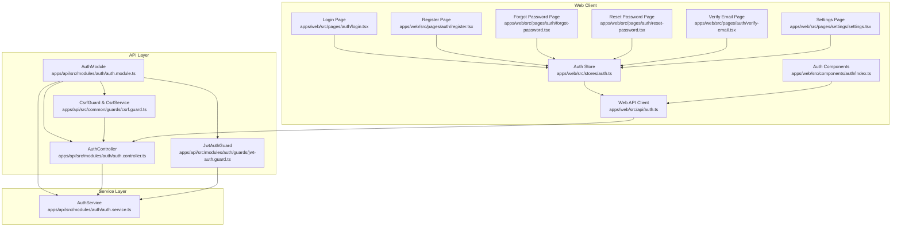

**Diagram sources**
- [auth.controller.ts:1-171](file://apps/api/src/modules/auth/auth.controller.ts#L1-L171)
- [auth.module.ts:1-53](file://apps/api/src/modules/auth/auth.module.ts#L1-L53)
- [jwt-auth.guard.ts:1-64](file://apps/api/src/modules/auth/guards/jwt-auth.guard.ts#L1-L64)
- [csrf.guard.ts:1-242](file://apps/api/src/common/guards/csrf.guard.ts#L1-L242)
- [auth.service.ts:1-507](file://apps/api/src/modules/auth/auth.service.ts#L1-L507)
- [auth.ts:1-200](file://apps/web/src/api/auth.ts#L1-L200)
- [auth.store.ts:1-200](file://apps/web/src/stores/auth.ts#L1-L200)

**Section sources**
- [auth.controller.ts:1-171](file://apps/api/src/modules/auth/auth.controller.ts#L1-L171)
- [auth.module.ts:1-53](file://apps/api/src/modules/auth/auth.module.ts#L1-L53)
- [auth.service.ts:1-507](file://apps/api/src/modules/auth/auth.service.ts#L1-L507)

## Core Components
- AuthController: Exposes authentication endpoints and delegates to AuthService.
- AuthService: Implements registration, login, token generation/refresh, logout, email verification, and password reset flows.
- JwtAuthGuard: Protects routes requiring authenticated users.
- CsrfGuard/CsrfService: Enforces CSRF protection using the Double Submit Cookie pattern.

Key responsibilities:
- Token lifecycle management (access and refresh tokens)
- Rate limiting and account lockout policies
- Email verification and password reset token handling
- CSRF protection for state-changing requests

**Section sources**
- [auth.controller.ts:38-171](file://apps/api/src/modules/auth/auth.controller.ts#L38-L171)
- [auth.service.ts:64-247](file://apps/api/src/modules/auth/auth.service.ts#L64-L247)
- [jwt-auth.guard.ts:14-63](file://apps/api/src/modules/auth/guards/jwt-auth.guard.ts#L14-L63)
- [csrf.guard.ts:47-148](file://apps/api/src/common/guards/csrf.guard.ts#L47-L148)

## Architecture Overview
The authentication architecture follows a layered design with clear separation of concerns:
- HTTP endpoints exposed by AuthController
- Business logic encapsulated in AuthService
- Security enforced by JwtAuthGuard and CsrfGuard
- Token storage using Redis and database persistence
- Notification service for verification and reset emails

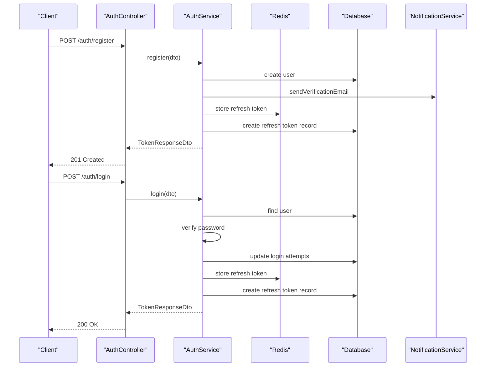

**Diagram sources**
- [auth.controller.ts:38-57](file://apps/api/src/modules/auth/auth.controller.ts#L38-L57)
- [auth.service.ts:64-145](file://apps/api/src/modules/auth/auth.service.ts#L64-L145)

**Section sources**
- [auth.controller.ts:38-91](file://apps/api/src/modules/auth/auth.controller.ts#L38-L91)
- [auth.service.ts:64-247](file://apps/api/src/modules/auth/auth.service.ts#L64-L247)

## Detailed Component Analysis

### Authentication Endpoints

#### Registration
- Method: POST
- URL: /auth/register
- Purpose: Create a new user account
- CSRF: Skipped
- Rate limiting: None
- Request body: Register DTO
- Response: TokenResponseDto
- Security: Returns success regardless of whether user existed (non-disclosure)

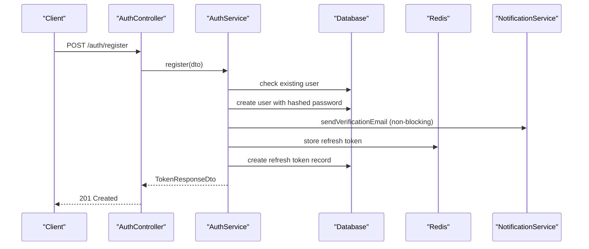

**Diagram sources**
- [auth.controller.ts:38-45](file://apps/api/src/modules/auth/auth.controller.ts#L38-L45)
- [auth.service.ts:64-102](file://apps/api/src/modules/auth/auth.service.ts#L64-L102)

**Section sources**
- [auth.controller.ts:38-45](file://apps/api/src/modules/auth/auth.controller.ts#L38-L45)
- [auth.service.ts:64-102](file://apps/api/src/modules/auth/auth.service.ts#L64-L102)

#### Login
- Method: POST
- URL: /auth/login
- Purpose: Authenticate user and issue tokens
- CSRF: Skipped
- Rate limiting: 5 requests per minute (short window)
- Request body: Login DTO
- Response: TokenResponseDto
- Security: Account lockout after 5 failed attempts for 15 minutes

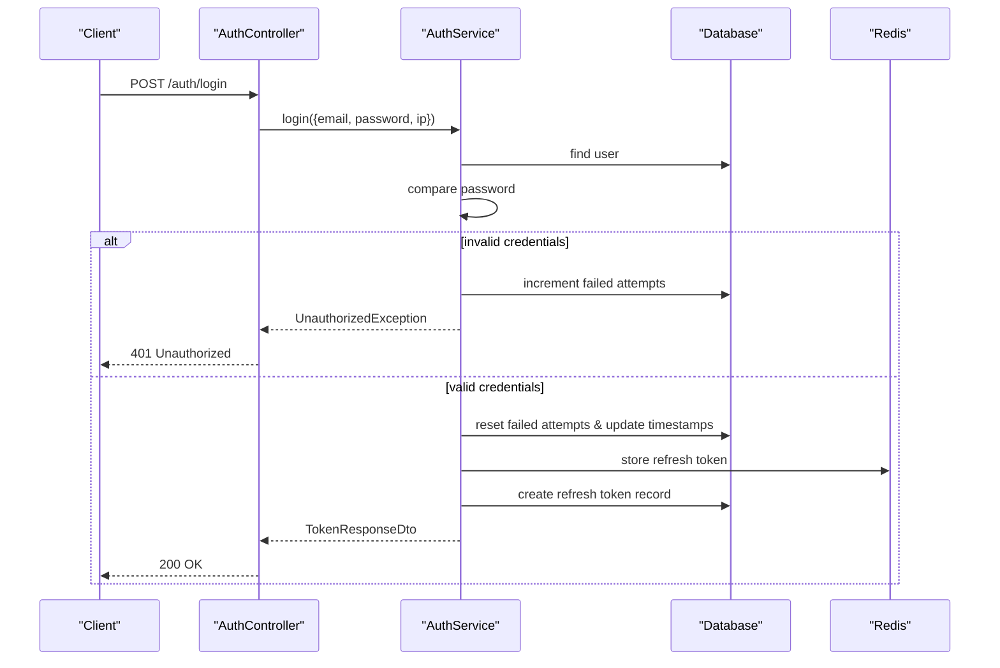

**Diagram sources**
- [auth.controller.ts:47-57](file://apps/api/src/modules/auth/auth.controller.ts#L47-L57)
- [auth.service.ts:104-145](file://apps/api/src/modules/auth/auth.service.ts#L104-L145)

**Section sources**
- [auth.controller.ts:47-57](file://apps/api/src/modules/auth/auth.controller.ts#L47-L57)
- [auth.service.ts:104-145](file://apps/api/src/modules/auth/auth.service.ts#L104-L145)

#### Token Refresh
- Method: POST
- URL: /auth/refresh
- Purpose: Issue a new access token using a valid refresh token
- CSRF: Skipped
- Request body: RefreshToken DTO
- Response: RefreshResponse DTO with new access token and expiration
- Security: Validates refresh token in Redis; throws 401 for invalid/expired tokens

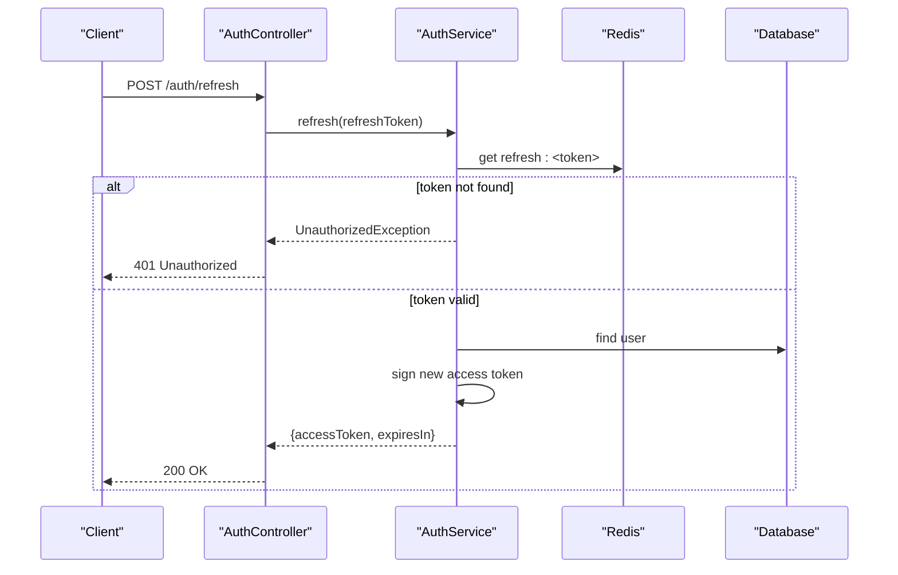

**Diagram sources**
- [auth.controller.ts:59-71](file://apps/api/src/modules/auth/auth.controller.ts#L59-L71)
- [auth.service.ts:147-177](file://apps/api/src/modules/auth/auth.service.ts#L147-L177)

**Section sources**
- [auth.controller.ts:59-71](file://apps/api/src/modules/auth/auth.controller.ts#L59-L71)
- [auth.service.ts:147-177](file://apps/api/src/modules/auth/auth.service.ts#L147-L177)

#### Logout
- Method: POST
- URL: /auth/logout
- Purpose: Invalidate refresh token
- CSRF: Skipped
- Request body: RefreshToken DTO
- Response: Success message
- Security: Removes refresh token from Redis

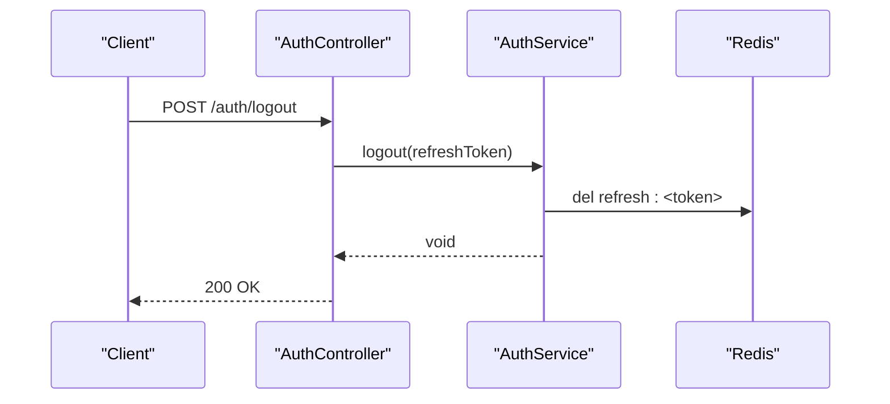

**Diagram sources**
- [auth.controller.ts:73-81](file://apps/api/src/modules/auth/auth.controller.ts#L73-L81)
- [auth.service.ts:179-183](file://apps/api/src/modules/auth/auth.service.ts#L179-L183)

**Section sources**
- [auth.controller.ts:73-81](file://apps/api/src/modules/auth/auth.controller.ts#L73-L81)
- [auth.service.ts:179-183](file://apps/api/src/modules/auth/auth.service.ts#L179-L183)

#### Get Current User Profile
- Method: GET
- URL: /auth/me
- Purpose: Retrieve authenticated user's profile
- Authentication: Required (JWT)
- Response: AuthenticatedUser
- Security: Protected by JwtAuthGuard

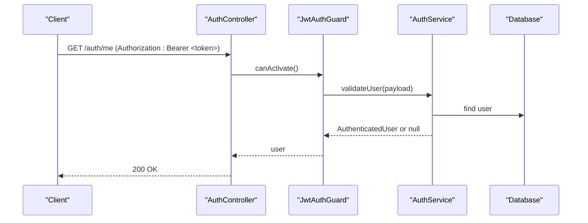

**Diagram sources**
- [auth.controller.ts:83-91](file://apps/api/src/modules/auth/auth.controller.ts#L83-L91)
- [jwt-auth.guard.ts:22-62](file://apps/api/src/modules/auth/guards/jwt-auth.guard.ts#L22-L62)
- [auth.service.ts:185-209](file://apps/api/src/modules/auth/auth.service.ts#L185-L209)

**Section sources**
- [auth.controller.ts:83-91](file://apps/api/src/modules/auth/auth.controller.ts#L83-L91)
- [jwt-auth.guard.ts:14-63](file://apps/api/src/modules/auth/guards/jwt-auth.guard.ts#L14-L63)
- [auth.service.ts:185-209](file://apps/api/src/modules/auth/auth.service.ts#L185-L209)

#### Email Verification
- Methods: POST /auth/verify-email, POST /auth/resend-verification
- Purpose: Verify email address and resend verification email
- CSRF: Skipped for both endpoints
- Rate limiting: Resend verification limited to 3 requests per minute

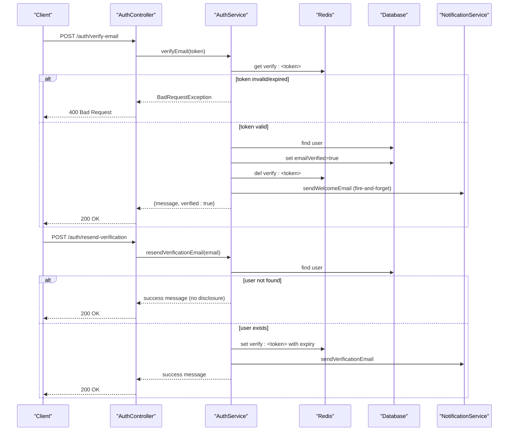

**Diagram sources**
- [auth.controller.ts:95-113](file://apps/api/src/modules/auth/auth.controller.ts#L95-L113)
- [auth.service.ts:318-383](file://apps/api/src/modules/auth/auth.service.ts#L318-L383)

**Section sources**
- [auth.controller.ts:95-113](file://apps/api/src/modules/auth/auth.controller.ts#L95-L113)
- [auth.service.ts:293-383](file://apps/api/src/modules/auth/auth.service.ts#L293-L383)

#### Password Reset
- Methods: POST /auth/forgot-password, POST /auth/reset-password
- Purpose: Initiate password reset and apply new password
- CSRF: Skipped for both endpoints
- Rate limiting: Forgot password 3/min, Reset password 5/min
- Security: Tokens expire after 1 hour; password minimum 12 characters

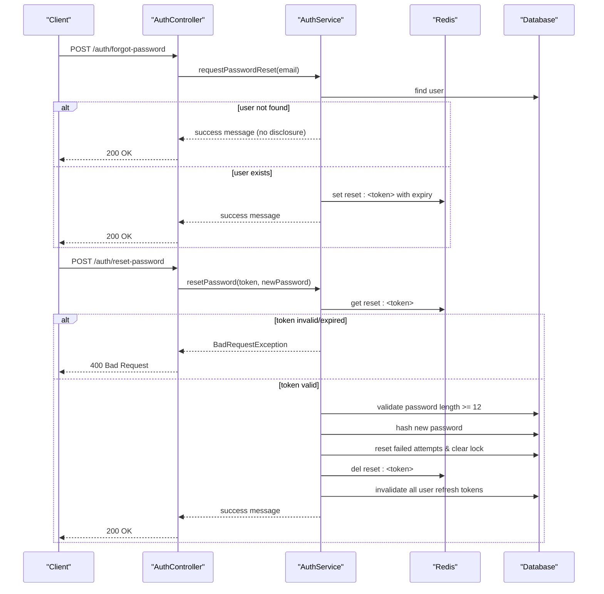

**Diagram sources**
- [auth.controller.ts:117-136](file://apps/api/src/modules/auth/auth.controller.ts#L117-L136)
- [auth.service.ts:390-466](file://apps/api/src/modules/auth/auth.service.ts#L390-L466)

**Section sources**
- [auth.controller.ts:117-136](file://apps/api/src/modules/auth/auth.controller.ts#L117-L136)
- [auth.service.ts:385-466](file://apps/api/src/modules/auth/auth.service.ts#L385-L466)

#### CSRF Token Endpoint
- Method: GET
- URL: /auth/csrf-token
- Purpose: Generate and return a CSRF token in a cookie and response
- CSRF: Skipped for this endpoint
- Response: { csrfToken, message }
- Security: Sets HttpOnly=false cookie for client-side access; requires X-CSRF-Token header for state-changing requests

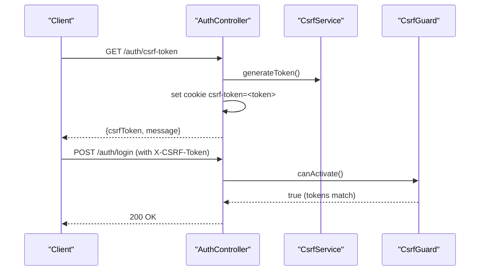

**Diagram sources**
- [auth.controller.ts:140-169](file://apps/api/src/modules/auth/auth.controller.ts#L140-L169)
- [csrf.guard.ts:66-148](file://apps/api/src/common/guards/csrf.guard.ts#L66-L148)

**Section sources**
- [auth.controller.ts:140-169](file://apps/api/src/modules/auth/auth.controller.ts#L140-L169)
- [csrf.guard.ts:47-148](file://apps/api/src/common/guards/csrf.guard.ts#L47-L148)

### Token Management and Policies

#### JWT Access Tokens
- Issued on successful registration/login
- Expiration: 15 minutes (configurable)
- Validation: JwtAuthGuard handles expiration and invalid token errors

#### Refresh Tokens
- Generated on registration/login
- Stored in Redis with TTL derived from configuration
- Also recorded in database for audit and revocation
- Used to obtain new access tokens
- Logout invalidates the refresh token

#### Token Expiration and Storage
- Access token TTL: 15 minutes
- Refresh token TTL: 7 days (configurable)
- Verification token TTL: 24 hours (configurable)
- Password reset token TTL: 1 hour (configurable)

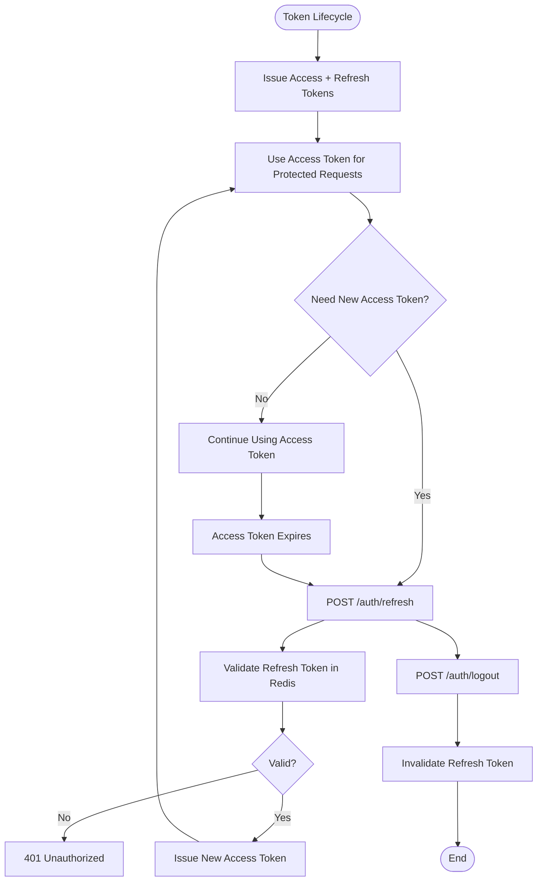

**Diagram sources**
- [auth.service.ts:211-247](file://apps/api/src/modules/auth/auth.service.ts#L211-L247)
- [auth.service.ts:147-183](file://apps/api/src/modules/auth/auth.service.ts#L147-L183)

**Section sources**
- [auth.service.ts:211-247](file://apps/api/src/modules/auth/auth.service.ts#L211-L247)
- [auth.service.ts:147-183](file://apps/api/src/modules/auth/auth.service.ts#L147-L183)

### Security Headers and CSRF Protection
- CSRF Protection: Implemented via Double Submit Cookie pattern
  - Server sets HttpOnly=false cookie named csrf-token
  - Client must send matching X-CSRF-Token header
  - Tokens validated with constant-time comparison
- Environment-specific behavior:
  - CSRF disabled only in non-production when explicitly configured
  - Production requires CSRF_SECRET environment variable
- Safe vs. State-Changing Methods:
  - Safe methods (GET, HEAD, OPTIONS) bypass CSRF checks
  - State-changing methods require CSRF validation

**Section sources**
- [csrf.guard.ts:47-148](file://apps/api/src/common/guards/csrf.guard.ts#L47-L148)
- [auth.controller.ts:140-169](file://apps/api/src/modules/auth/auth.controller.ts#L140-L169)

### Rate Limiting and Account Lockout
- Login attempts: Max 5 per minute; lockout for 15 minutes after threshold
- Email verification resend: Max 3 per minute
- Password reset initiation: Max 3 per minute
- Password reset attempts: Max 5 per minute
- These limits are enforced via NestJS throttler decorators on endpoints

**Section sources**
- [auth.controller.ts:50](file://apps/api/src/modules/auth/auth.controller.ts#L50)
- [auth.controller.ts:108](file://apps/api/src/modules/auth/auth.controller.ts#L108)
- [auth.controller.ts:120](file://apps/api/src/modules/auth/auth.controller.ts#L120)
- [auth.controller.ts:130](file://apps/api/src/modules/auth/auth.controller.ts#L130)
- [auth.service.ts:249-268](file://apps/api/src/modules/auth/auth.service.ts#L249-L268)

### OAuth2 Integration
- Module structure indicates OAuth2 integration is planned and being developed
- OAuthController and OAuthService are imported in AuthModule
- Supported providers include Google and GitHub (as indicated by adapter modules)
- Implementation details are not present in the current codebase snapshot

**Section sources**
- [auth.module.ts:11-14](file://apps/api/src/modules/auth/auth.module.ts#L11-L14)

### Multi-Factor Authentication (MFA)
- Module structure indicates MFA is planned and being developed
- MfaController and MfaService are imported in AuthModule
- Implementation details are not present in the current codebase snapshot

**Section sources**
- [auth.module.ts:13-14](file://apps/api/src/modules/auth/auth.module.ts#L13-L14)

### Client-Side Integration Examples
The web application demonstrates typical client-side authentication flows:

- Web API Client: Centralized API client for authentication requests
- Auth Store: Manages authentication state, tokens, and user profile
- Auth Components: Reusable components for login, registration, password reset
- Pages: Dedicated pages for login, registration, forgot password, reset password, email verification
- Settings: Integration points for MFA and account settings

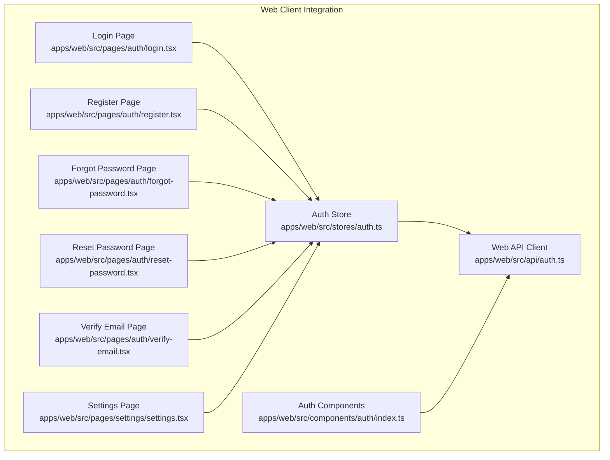

**Diagram sources**
- [auth.ts:1-200](file://apps/web/src/api/auth.ts#L1-L200)
- [auth.store.ts:1-200](file://apps/web/src/stores/auth.ts#L1-L200)
- [auth.ts:1-200](file://apps/web/src/components/auth/index.ts#L1-L200)
- [login.tsx](file://apps/web/src/pages/auth/login.tsx)
- [register.tsx](file://apps/web/src/pages/auth/register.tsx)
- [forgot-password.tsx](file://apps/web/src/pages/auth/forgot-password.tsx)
- [reset-password.tsx](file://apps/web/src/pages/auth/reset-password.tsx)
- [verify-email.tsx](file://apps/web/src/pages/auth/verify-email.tsx)
- [settings.tsx](file://apps/web/src/pages/settings/settings.tsx)

**Section sources**
- [auth.ts:1-200](file://apps/web/src/api/auth.ts#L1-L200)
- [auth.store.ts:1-200](file://apps/web/src/stores/auth.ts#L1-L200)
- [auth.ts:1-200](file://apps/web/src/components/auth/index.ts#L1-L200)

## Dependency Analysis
The authentication module has clear dependencies and low coupling:
- AuthController depends on AuthService and CsrfService
- AuthService depends on PrismaService, JwtService, ConfigService, RedisService, and NotificationService
- JwtAuthGuard integrates with Passport and JwtService
- CsrfGuard/CsrfService enforce CSRF policy across endpoints

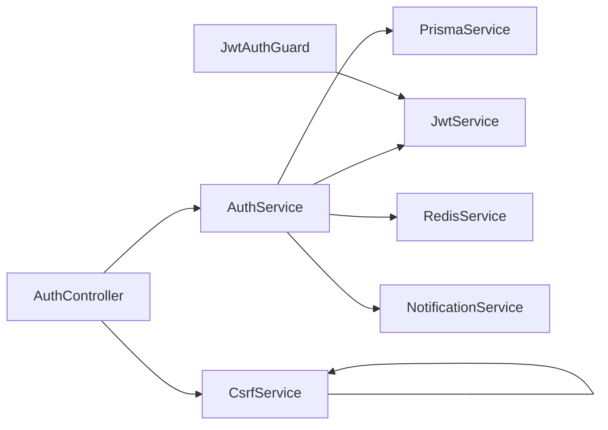

**Diagram sources**
- [auth.controller.ts:1-36](file://apps/api/src/modules/auth/auth.controller.ts#L1-L36)
- [auth.service.ts:46-52](file://apps/api/src/modules/auth/auth.service.ts#L46-L52)
- [auth.module.ts:17-51](file://apps/api/src/modules/auth/auth.module.ts#L17-L51)

**Section sources**
- [auth.controller.ts:1-36](file://apps/api/src/modules/auth/auth.controller.ts#L1-L36)
- [auth.service.ts:46-52](file://apps/api/src/modules/auth/auth.service.ts#L46-L52)
- [auth.module.ts:17-51](file://apps/api/src/modules/auth/auth.module.ts#L17-L51)

## Performance Considerations
- Token storage: Redis provides fast access for refresh token validation
- Database writes: Minimal writes during login (updates only on success)
- Non-blocking operations: Email sending is fire-and-forget to avoid blocking responses
- Rate limiting: Prevents abuse and reduces load on authentication endpoints
- JWT expiration: Short-lived access tokens reduce risk and require frequent refreshes

## Troubleshooting Guide
Common issues and resolutions:
- 401 Unauthorized on protected routes:
  - Ensure Authorization header contains a valid Bearer token
  - Check token expiration; use refresh endpoint if needed
- 401 Unauthorized on login:
  - Verify credentials and confirm account is not locked
  - Check rate limiting; wait for cooldown period
- CSRF validation failed (403):
  - Ensure csrf-token cookie is present and readable by JavaScript
  - Include matching X-CSRF-Token header in state-changing requests
- Invalid or expired verification/reset token (400):
  - Request a new token via resend or forgot-password endpoints
  - Confirm token TTL has not elapsed

Security best practices:
- Always use HTTPS in production
- Configure CSRF_SECRET in production environments
- Implement proper CORS and security headers
- Monitor authentication logs for suspicious activity
- Regularly review token TTL configurations

**Section sources**
- [jwt-auth.guard.ts:35-62](file://apps/api/src/modules/auth/guards/jwt-auth.guard.ts#L35-L62)
- [csrf.guard.ts:66-148](file://apps/api/src/common/guards/csrf.guard.ts#L66-L148)
- [auth.service.ts:423-428](file://apps/api/src/modules/auth/auth.service.ts#L423-L428)

## Conclusion
Quiz-to-Build's authentication system provides a robust foundation with JWT-based access tokens, Redis-backed refresh tokens, comprehensive CSRF protection, and built-in rate limiting and account lockout policies. The modular design supports future enhancements such as OAuth2 and MFA integrations. Client-side examples demonstrate secure integration patterns for common authentication flows, ensuring developers can implement secure and user-friendly authentication experiences.