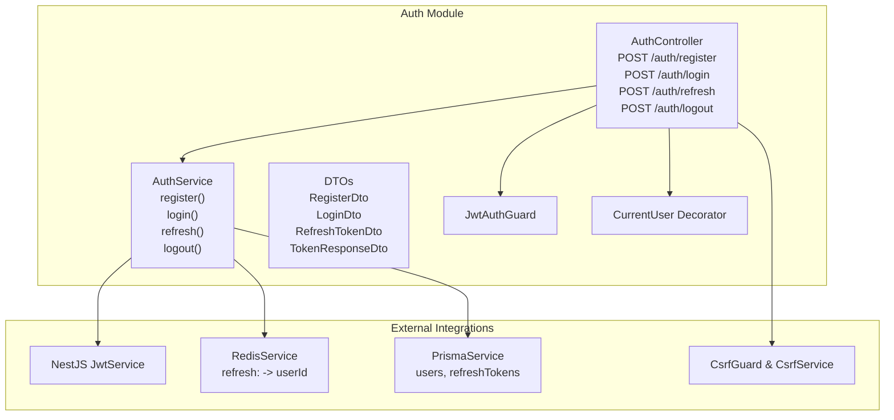
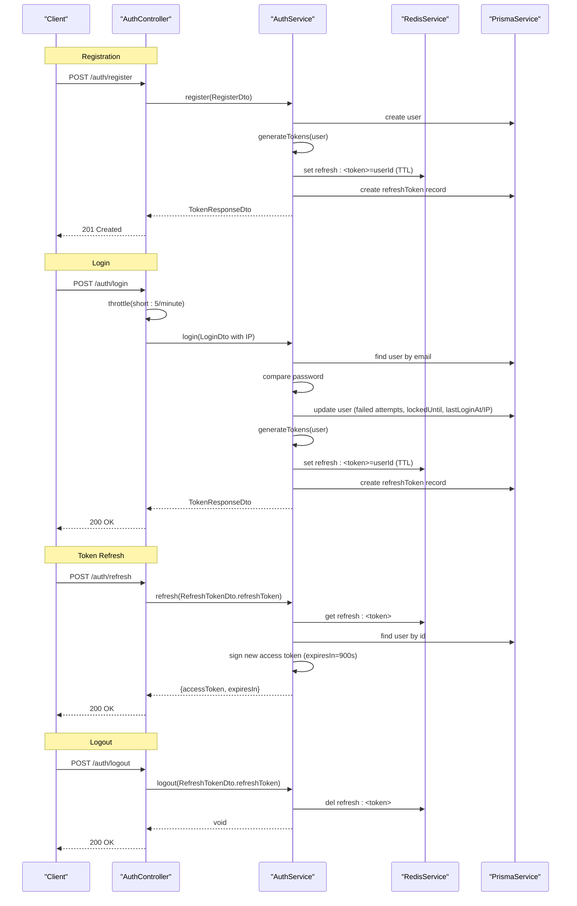
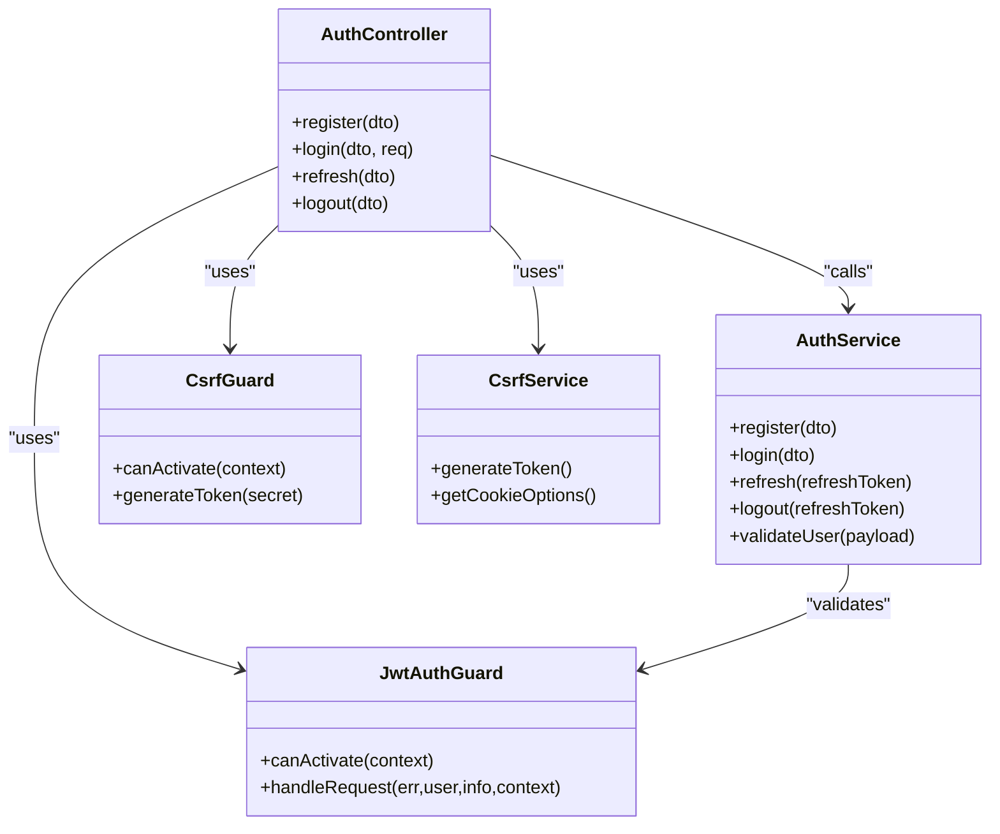

# Basic Authentication

<cite>
**Referenced Files in This Document**
- [auth.controller.ts](file://apps/api/src/modules/auth/auth.controller.ts)
- [auth.service.ts](file://apps/api/src/modules/auth/auth.service.ts)
- [register.dto.ts](file://apps/api/src/modules/auth/dto/register.dto.ts)
- [login.dto.ts](file://apps/api/src/modules/auth/dto/login.dto.ts)
- [refresh-token.dto.ts](file://apps/api/src/modules/auth/dto/refresh-token.dto.ts)
- [token.dto.ts](file://apps/api/src/modules/auth/dto/token.dto.ts)
- [jwt-auth.guard.ts](file://apps/api/src/modules/auth/guards/jwt-auth.guard.ts)
- [user.decorator.ts](file://apps/api/src/modules/auth/decorators/user.decorator.ts)
- [csrf.guard.ts](file://apps/api/src/common/guards/csrf.guard.ts)
- [auth.module.ts](file://apps/api/src/modules/auth/auth.module.ts)
</cite>

## Table of Contents
1. [Introduction](#introduction)
2. [Project Structure](#project-structure)
3. [Core Components](#core-components)
4. [Architecture Overview](#architecture-overview)
5. [Detailed Component Analysis](#detailed-component-analysis)
6. [Dependency Analysis](#dependency-analysis)
7. [Performance Considerations](#performance-considerations)
8. [Troubleshooting Guide](#troubleshooting-guide)
9. [Conclusion](#conclusion)

## Introduction
This document provides comprehensive API documentation for Quiz-to-Build’s basic authentication endpoints. It covers user registration, login, token refresh, and logout, including request/response schemas, validation rules, error handling, IP tracking, rate limiting, JWT access token structure, expiration policies, and security considerations. It also outlines integration patterns and best practices for client-side token lifecycle management.

## Project Structure
The authentication module is implemented as a NestJS module with a dedicated controller, service, DTOs, guards, and decorators. The module integrates with JWT, Redis for refresh token storage, and Prisma for persistence.

**Diagram sources**
- [auth.controller.ts:38-81](file://apps/api/src/modules/auth/auth.controller.ts#L38-L81)
- [auth.service.ts:64-183](file://apps/api/src/modules/auth/auth.service.ts#L64-L183)
- [auth.module.ts:17-51](file://apps/api/src/modules/auth/auth.module.ts#L17-L51)

**Section sources**
- [auth.controller.ts:30-91](file://apps/api/src/modules/auth/auth.controller.ts#L30-L91)
- [auth.service.ts:37-62](file://apps/api/src/modules/auth/auth.service.ts#L37-L62)
- [auth.module.ts:17-51](file://apps/api/src/modules/auth/auth.module.ts#L17-L51)

## Core Components
- AuthController: Exposes endpoints for registration, login, refresh, and logout; applies CSRF bypass for state-changing endpoints and throttling for login; uses guards for JWT-protected routes.
- AuthService: Implements business logic for user registration, login, token generation/refresh, logout, and validation; integrates with Redis for refresh token storage and Prisma for user data.
- DTOs: Define request schemas and validation rules for registration, login, refresh token, and response payloads.
- Guards and Decorators: JwtAuthGuard enforces JWT authentication; CurrentUser decorator extracts the authenticated user from the request.

**Section sources**
- [auth.controller.ts:38-81](file://apps/api/src/modules/auth/auth.controller.ts#L38-L81)
- [auth.service.ts:64-183](file://apps/api/src/modules/auth/auth.service.ts#L64-L183)
- [register.dto.ts:4-24](file://apps/api/src/modules/auth/dto/register.dto.ts#L4-L24)
- [login.dto.ts:4-19](file://apps/api/src/modules/auth/dto/login.dto.ts#L4-L19)
- [refresh-token.dto.ts:4-9](file://apps/api/src/modules/auth/dto/refresh-token.dto.ts#L4-L9)
- [token.dto.ts:21-44](file://apps/api/src/modules/auth/dto/token.dto.ts#L21-L44)
- [jwt-auth.guard.ts:14-63](file://apps/api/src/modules/auth/guards/jwt-auth.guard.ts#L14-L63)
- [user.decorator.ts:4-18](file://apps/api/src/modules/auth/decorators/user.decorator.ts#L4-L18)

## Architecture Overview
The authentication flow leverages:
- Access tokens signed by JWT with short-lived expiration.
- Refresh tokens stored in Redis with TTL derived from configuration and persisted in the database for audit.
- Rate limiting on login and related operations.
- CSRF protection for state-changing requests.

**Diagram sources**
- [auth.controller.ts:38-81](file://apps/api/src/modules/auth/auth.controller.ts#L38-L81)
- [auth.service.ts:64-183](file://apps/api/src/modules/auth/auth.service.ts#L64-L183)

## Detailed Component Analysis

### Endpoint: POST /auth/register
- Purpose: Create a new user account.
- Authentication: No prior authentication required.
- CSRF: Bypassed via decorator.
- Throttling: Not applied.
- Request body: RegisterDto
  - email: string, required, valid email format
  - password: string, required, minimum 12 characters, must contain lowercase, uppercase, and digit
  - name: string, required, 2–100 characters
- Responses:
  - 201 Created: TokenResponseDto
  - 409 Conflict: Email already exists
- Processing:
  - Validates uniqueness by email.
  - Hashes password using bcrypt with configurable rounds.
  - Creates user with role CLIENT and emailVerified=false.
  - Attempts to send a verification email asynchronously.
  - Generates access and refresh tokens; stores refresh token in Redis and persists refresh token record in DB.
- Security considerations:
  - Password strength enforced server-side.
  - Non-blocking email delivery; user can request resend later.

**Section sources**
- [auth.controller.ts:38-45](file://apps/api/src/modules/auth/auth.controller.ts#L38-L45)
- [register.dto.ts:4-24](file://apps/api/src/modules/auth/dto/register.dto.ts#L4-L24)
- [auth.service.ts:64-102](file://apps/api/src/modules/auth/auth.service.ts#L64-L102)

### Endpoint: POST /auth/login
- Purpose: Authenticate user with email and password.
- Authentication: No prior authentication required.
- CSRF: Bypassed via decorator.
- Throttling: Short burst limit (e.g., 5 per minute) to mitigate brute force.
- Request body: LoginDto
  - email: string, required, valid email format
  - password: string, required, non-empty
  - ip: string, populated by controller from request IP
- Responses:
  - 200 OK: TokenResponseDto
  - 401 Unauthorized: Invalid credentials or locked account
- Processing:
  - Finds user by normalized email.
  - Checks account lockout window; rejects if locked.
  - Compares hashed password; increments failed attempts on mismatch; locks account after threshold.
  - On success, resets failed attempts, clears lock, updates last login timestamp and IP.
  - Generates access and refresh tokens; stores refresh token in Redis and DB.
- IP tracking:
  - Controller captures client IP and passes to service; service persists IP on successful login.

**Section sources**
- [auth.controller.ts:47-57](file://apps/api/src/modules/auth/auth.controller.ts#L47-L57)
- [login.dto.ts:4-19](file://apps/api/src/modules/auth/dto/login.dto.ts#L4-L19)
- [auth.service.ts:104-145](file://apps/api/src/modules/auth/auth.service.ts#L104-L145)

### Endpoint: POST /auth/refresh
- Purpose: Issue a new access token using a valid refresh token.
- Authentication: No prior authentication required.
- CSRF: Bypassed via decorator.
- Throttling: Not applied.
- Request body: RefreshTokenDto
  - refreshToken: string, required, non-empty
- Responses:
  - 200 OK: RefreshResponseDto with new accessToken and expiresIn
  - 401 Unauthorized: Invalid or expired refresh token
- Processing:
  - Retrieves stored user ID from Redis using key pattern refresh:<token>.
  - Validates user existence and activity.
  - Signs a new access token with fixed expiresIn of 900 seconds.
- Refresh token management:
  - Redis TTL is derived from configuration; refresh token records are stored in DB for audit.

**Section sources**
- [auth.controller.ts:59-71](file://apps/api/src/modules/auth/auth.controller.ts#L59-L71)
- [refresh-token.dto.ts:4-9](file://apps/api/src/modules/auth/dto/refresh-token.dto.ts#L4-L9)
- [auth.service.ts:147-177](file://apps/api/src/modules/auth/auth.service.ts#L147-L177)

### Endpoint: POST /auth/logout
- Purpose: Invalidate a refresh token and end the session.
- Authentication: No prior authentication required.
- CSRF: Bypassed via decorator.
- Throttling: Not applied.
- Request body: RefreshTokenDto
  - refreshToken: string, required, non-empty
- Responses:
  - 200 OK: Success message
  - 401 Unauthorized: Invalid or expired refresh token
- Processing:
  - Deletes the refresh token from Redis.
  - Does not require DB lookup for deletion; invalidation is immediate.

**Section sources**
- [auth.controller.ts:73-81](file://apps/api/src/modules/auth/auth.controller.ts#L73-L81)
- [refresh-token.dto.ts:4-9](file://apps/api/src/modules/auth/dto/refresh-token.dto.ts#L4-L9)
- [auth.service.ts:179-183](file://apps/api/src/modules/auth/auth.service.ts#L179-L183)

### JWT Access Token Structure and Policies
- Signing:
  - Signed by NestJS JwtService using configured secret and expiration.
  - Access token payload includes subject (user ID), email, role, and standard claims.
- Expiration:
  - Access token expiration is configured; service generates tokens with a fixed expiresIn of 900 seconds for refresh responses.
- Token usage:
  - Protected routes use JwtAuthGuard; unauthorized responses distinguish expired vs invalid tokens.

**Section sources**
- [auth.service.ts:211-247](file://apps/api/src/modules/auth/auth.service.ts#L211-L247)
- [auth.module.ts:20-29](file://apps/api/src/modules/auth/auth.module.ts#L20-L29)
- [jwt-auth.guard.ts:35-62](file://apps/api/src/modules/auth/guards/jwt-auth.guard.ts#L35-L62)

### Request and Response Schemas

#### RegisterDto
- email: string, required, valid email
- password: string, required, min length 12, must include lowercase, uppercase, and digit
- name: string, required, 2–100 characters

#### LoginDto
- email: string, required, valid email
- password: string, required, non-empty
- ip: string, optional (auto-populated by controller)

#### RefreshTokenDto
- refreshToken: string, required, non-empty

#### TokenResponseDto
- accessToken: string
- refreshToken: string
- expiresIn: number (seconds)
- tokenType: string (Bearer)
- user: UserResponseDto
  - id: string
  - email: string
  - role: enum (CLIENT, ADMIN, etc.)
  - name?: string

#### RefreshResponseDto
- accessToken: string
- expiresIn: number (seconds)

**Section sources**
- [register.dto.ts:4-24](file://apps/api/src/modules/auth/dto/register.dto.ts#L4-L24)
- [login.dto.ts:4-19](file://apps/api/src/modules/auth/dto/login.dto.ts#L4-L19)
- [refresh-token.dto.ts:4-9](file://apps/api/src/modules/auth/dto/refresh-token.dto.ts#L4-L9)
- [token.dto.ts:21-44](file://apps/api/src/modules/auth/dto/token.dto.ts#L21-L44)

### Validation Rules and Error Handling
- Registration:
  - Duplicate email triggers conflict error.
  - Password must meet strength criteria; otherwise validation errors apply.
- Login:
  - Invalid credentials yield unauthorized; failed attempts increment and may lock the account.
  - Locked accounts return unauthorized with a retry-after message.
- Refresh:
  - Missing or invalid refresh token yields unauthorized.
- Logout:
  - Invalid refresh token yields unauthorized; successful logout returns success message.
- General:
  - DTO validation ensures request shape and types.
  - Controller-level throttling limits repeated login attempts.

**Section sources**
- [auth.controller.ts:38-81](file://apps/api/src/modules/auth/auth.controller.ts#L38-L81)
- [auth.service.ts:64-183](file://apps/api/src/modules/auth/auth.service.ts#L64-L183)
- [register.dto.ts:4-24](file://apps/api/src/modules/auth/dto/register.dto.ts#L4-L24)
- [login.dto.ts:4-19](file://apps/api/src/modules/auth/dto/login.dto.ts#L4-L19)
- [refresh-token.dto.ts:4-9](file://apps/api/src/modules/auth/dto/refresh-token.dto.ts#L4-L9)

### Integration Patterns and Token Lifecycle Management
- Initial registration:
  - Client sends RegisterDto; upon 201, stores both accessToken and refreshToken securely.
- Subsequent login:
  - Client sends LoginDto; upon 200, replaces stored tokens.
- Access token refresh:
  - When access token nears expiry, client calls POST /auth/refresh with refreshToken; on success, replaces stored accessToken.
- Logout:
  - Client calls POST /auth/logout with refreshToken; on success, removes stored tokens locally.
- Best practices:
  - Store refresh tokens in secure, HTTP-only storage (e.g., encrypted local storage or secure cookies).
  - Use short-lived access tokens and rotate them via refresh.
  - Implement robust error handling for token expiration and invalidation.

**Section sources**
- [auth.controller.ts:38-81](file://apps/api/src/modules/auth/auth.controller.ts#L38-L81)
- [auth.service.ts:147-183](file://apps/api/src/modules/auth/auth.service.ts#L147-L183)

### Security Considerations
- CSRF Protection:
  - State-changing requests (including auth endpoints) are protected by CSRF guard; clients must include X-CSRF-Token header matching the csrf-token cookie value.
  - CSRF token is served via a dedicated endpoint and cookie configuration.
- Rate Limiting:
  - Login endpoint is throttled to reduce brute-force risk.
- Token Storage:
  - Refresh tokens are stored in Redis with TTL and in DB for audit; access tokens are stateless and short-lived.
- Account Lockout:
  - Failed login attempts are tracked; excessive failures lock the account for a period.
- Password Security:
  - Passwords are hashed with bcrypt; minimum length and character requirements enforced.

**Section sources**
- [auth.controller.ts:47-57](file://apps/api/src/modules/auth/auth.controller.ts#L47-L57)
- [csrf.guard.ts:47-148](file://apps/api/src/common/guards/csrf.guard.ts#L47-L148)
- [auth.service.ts:249-268](file://apps/api/src/modules/auth/auth.service.ts#L249-L268)

## Dependency Analysis

**Diagram sources**
- [auth.controller.ts:38-81](file://apps/api/src/modules/auth/auth.controller.ts#L38-L81)
- [auth.service.ts:185-209](file://apps/api/src/modules/auth/auth.service.ts#L185-L209)
- [jwt-auth.guard.ts:14-63](file://apps/api/src/modules/auth/guards/jwt-auth.guard.ts#L14-L63)
- [csrf.guard.ts:47-148](file://apps/api/src/common/guards/csrf.guard.ts#L47-L148)

**Section sources**
- [auth.controller.ts:38-81](file://apps/api/src/modules/auth/auth.controller.ts#L38-L81)
- [auth.service.ts:185-209](file://apps/api/src/modules/auth/auth.service.ts#L185-L209)
- [jwt-auth.guard.ts:14-63](file://apps/api/src/modules/auth/guards/jwt-auth.guard.ts#L14-L63)
- [csrf.guard.ts:47-148](file://apps/api/src/common/guards/csrf.guard.ts#L47-L148)

## Performance Considerations
- Redis-backed refresh tokens enable fast retrieval and invalidation.
- Access tokens are short-lived to minimize exposure windows.
- DTO validation occurs before heavy operations to fail fast.
- Asynchronous email sending avoids blocking registration/login responses.

[No sources needed since this section provides general guidance]

## Troubleshooting Guide
- 401 Unauthorized on login:
  - Verify credentials and ensure account is not locked.
  - Check failed attempts and lockout duration.
- 401 Unauthorized on refresh:
  - Confirm refresh token validity and expiration.
  - Ensure token was not invalidated by logout or password reset.
- 409 Conflict on register:
  - Use a different email; existing accounts cannot be re-registered.
- CSRF validation failures:
  - Ensure X-CSRF-Token header matches csrf-token cookie value.
  - Regenerate CSRF token via the dedicated endpoint if needed.

**Section sources**
- [auth.service.ts:104-145](file://apps/api/src/modules/auth/auth.service.ts#L104-L145)
- [auth.service.ts:147-183](file://apps/api/src/modules/auth/auth.service.ts#L147-L183)
- [csrf.guard.ts:95-148](file://apps/api/src/common/guards/csrf.guard.ts#L95-L148)

## Conclusion
The authentication module provides a secure, scalable foundation for Quiz-to-Build with strong validation, rate limiting, CSRF protection, and robust token lifecycle management. Clients should implement proper token storage, rotation, and error handling to maintain security and reliability.