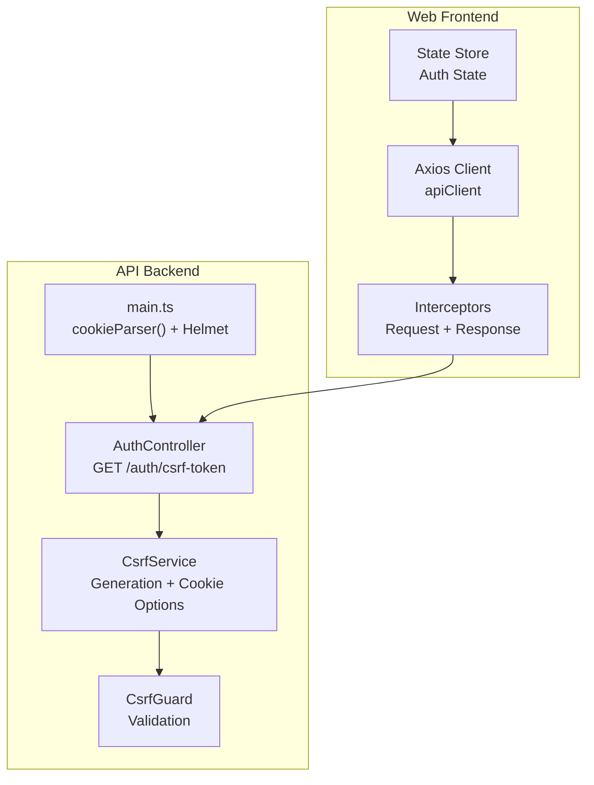
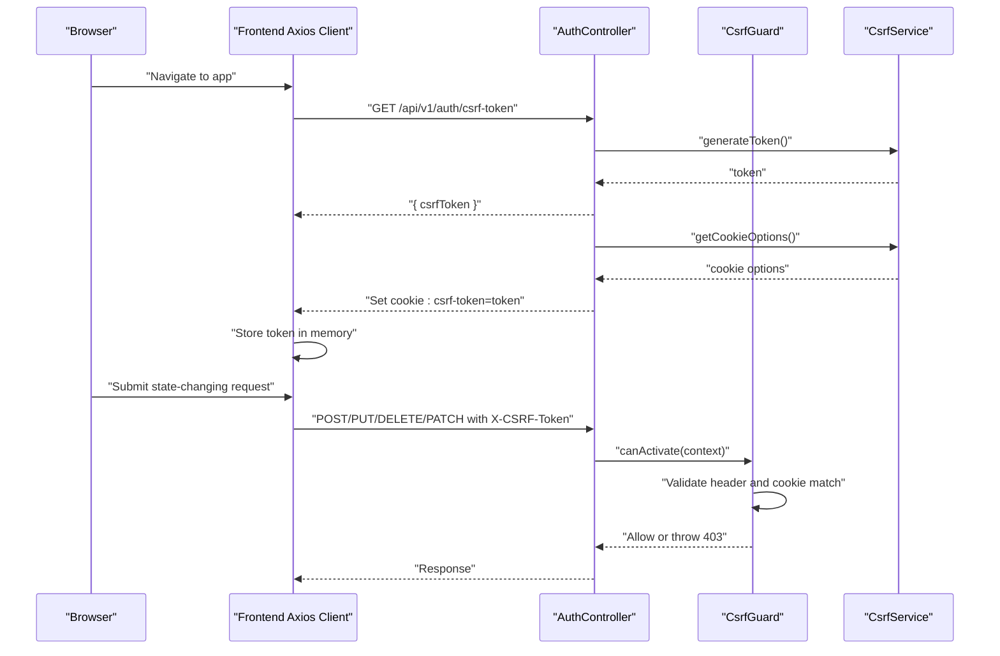
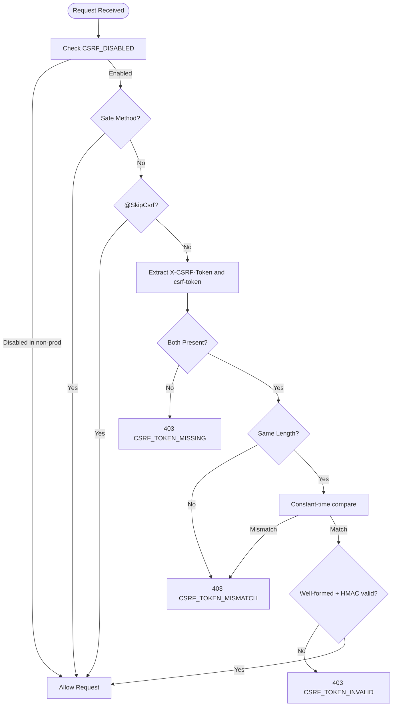
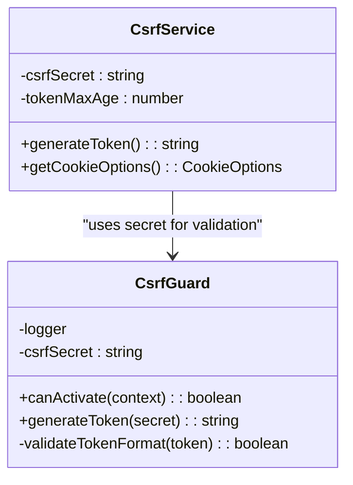
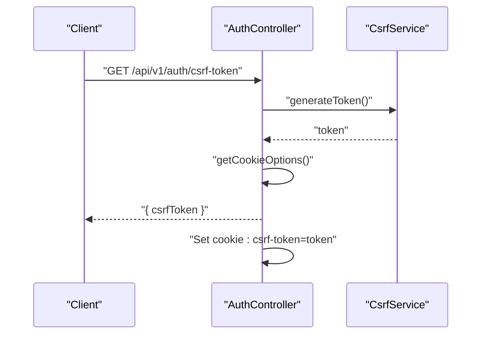
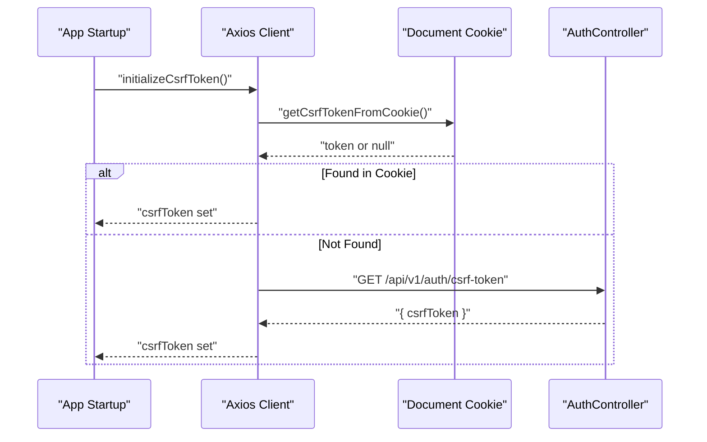
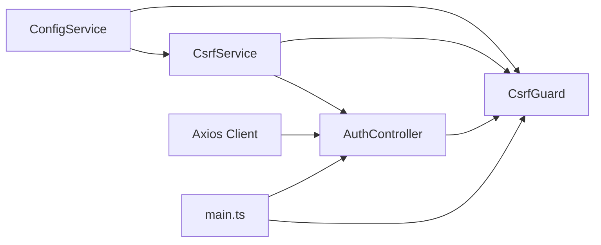

# CSRF Protection

<cite>
**Referenced Files in This Document**
- [csrf.guard.ts](file://apps/api/src/common/guards/csrf.guard.ts)
- [csrf.guard.spec.ts](file://apps/api/src/common/guards/csrf.guard.spec.ts)
- [auth.controller.ts](file://apps/api/src/modules/auth/auth.controller.ts)
- [main.ts](file://apps/api/src/main.ts)
- [client.ts](file://apps/web/src/api/client.ts)
- [auth.ts](file://apps/web/src/api/auth.ts)
- [graceful-degradation.config.ts](file://apps/api/src/config/graceful-degradation.config.ts)
</cite>

## Table of Contents
1. [Introduction](#introduction)
2. [Project Structure](#project-structure)
3. [Core Components](#core-components)
4. [Architecture Overview](#architecture-overview)
5. [Detailed Component Analysis](#detailed-component-analysis)
6. [Dependency Analysis](#dependency-analysis)
7. [Performance Considerations](#performance-considerations)
8. [Troubleshooting Guide](#troubleshooting-guide)
9. [Conclusion](#conclusion)

## Introduction
This document provides comprehensive API documentation for Quiz-to-Build's CSRF protection mechanism. It covers the CSRF token endpoint, token generation and storage, client-side integration requirements, and security considerations. The implementation follows the Double Submit Cookie pattern with a dedicated X-CSRF-Token header for state-changing requests.

## Project Structure
The CSRF protection spans three primary areas:
- Backend guard and service for token validation and generation
- Authentication controller exposing the CSRF token endpoint
- Frontend Axios client integrating CSRF tokens into outgoing requests

**Diagram sources**
- [csrf.guard.ts:48-148](file://apps/api/src/common/guards/csrf.guard.ts#L48-L148)
- [auth.controller.ts:140-169](file://apps/api/src/modules/auth/auth.controller.ts#L140-L169)
- [main.ts:173-174](file://apps/api/src/main.ts#L173-L174)
- [client.ts:95-198](file://apps/web/src/api/client.ts#L95-L198)

**Section sources**
- [csrf.guard.ts:1-242](file://apps/api/src/common/guards/csrf.guard.ts#L1-L242)
- [auth.controller.ts:1-171](file://apps/api/src/modules/auth/auth.controller.ts#L1-L171)
- [main.ts:173-174](file://apps/api/src/main.ts#L173-L174)
- [client.ts:1-326](file://apps/web/src/api/client.ts#L1-L326)

## Core Components
- CsrfGuard: Validates CSRF tokens for state-changing requests using the Double Submit Cookie pattern.
- CsrfService: Generates CSRF tokens and provides cookie options for secure storage.
- AuthController: Exposes GET /auth/csrf-token to provision tokens.
- Frontend Axios Client: Automatically attaches X-CSRF-Token for state-changing requests and handles CSRF failures.

Key constants:
- Header: X-CSRF-Token
- Cookie: csrf-token
- Methods requiring CSRF: POST, PUT, DELETE, PATCH
- Safe methods: GET, HEAD, OPTIONS (no CSRF required)

**Section sources**
- [csrf.guard.ts:13-15](file://apps/api/src/common/guards/csrf.guard.ts#L13-L15)
- [csrf.guard.ts:82-86](file://apps/api/src/common/guards/csrf.guard.ts#L82-L86)
- [auth.controller.ts:140-169](file://apps/api/src/modules/auth/auth.controller.ts#L140-L169)
- [client.ts:33-34](file://apps/web/src/api/client.ts#L33-L34)

## Architecture Overview
The CSRF protection architecture enforces the Double Submit Cookie pattern:
- Server generates a CSRF token and sets it in a cookie (JsReadable).
- Client reads the cookie and sends the same value in the X-CSRF-Token header for state-changing requests.
- Server validates that both values match and are well-formed.

**Diagram sources**
- [auth.controller.ts:140-169](file://apps/api/src/modules/auth/auth.controller.ts#L140-L169)
- [csrf.guard.ts:66-148](file://apps/api/src/common/guards/csrf.guard.ts#L66-L148)
- [client.ts:60-93](file://apps/web/src/api/client.ts#L60-L93)

## Detailed Component Analysis

### CsrfGuard: Validation Logic
- CSRF is disabled only in non-production environments when CSRF_DISABLED is true; in production, it is enforced.
- Safe HTTP methods (GET, HEAD, OPTIONS) bypass CSRF checks.
- The @SkipCsrf decorator allows specific routes to bypass CSRF checks.
- For state-changing requests, both X-CSRF-Token header and csrf-token cookie must be present.
- Tokens are compared using constant-time comparison to prevent timing attacks.
- Optional token format validation ensures the token is well-formed and signed.

**Diagram sources**
- [csrf.guard.ts:66-148](file://apps/api/src/common/guards/csrf.guard.ts#L66-L148)

**Section sources**
- [csrf.guard.ts:66-148](file://apps/api/src/common/guards/csrf.guard.ts#L66-L148)
- [csrf.guard.spec.ts:67-279](file://apps/api/src/common/guards/csrf.guard.spec.ts#L67-L279)

### CsrfService: Token Generation and Cookie Options
- Generates tokens using a timestamp, random bytes, and HMAC with a secret.
- Provides cookie options:
  - httpOnly: false (required for JavaScript to read the cookie)
  - secure: true in production, false otherwise
  - sameSite: strict
  - maxAge: configurable via CSRF_TOKEN_MAX_AGE (default 24 hours)
  - path: /

**Diagram sources**
- [csrf.guard.ts:196-241](file://apps/api/src/common/guards/csrf.guard.ts#L196-L241)
- [csrf.guard.ts:48-148](file://apps/api/src/common/guards/csrf.guard.ts#L48-L148)

**Section sources**
- [csrf.guard.ts:196-241](file://apps/api/src/common/guards/csrf.guard.ts#L196-L241)

### AuthController: CSRF Token Endpoint
- GET /auth/csrf-token returns a csrfToken and sets the csrf-token cookie with appropriate attributes.
- The endpoint is decorated with @SkipCsrf since it itself produces the token needed for subsequent requests.

**Diagram sources**
- [auth.controller.ts:140-169](file://apps/api/src/modules/auth/auth.controller.ts#L140-L169)

**Section sources**
- [auth.controller.ts:140-169](file://apps/api/src/modules/auth/auth.controller.ts#L140-L169)

### Frontend Axios Client: Automatic CSRF Integration
- Initializes CSRF token on startup by reading the cookie or fetching a fresh token.
- Adds X-CSRF-Token header for POST, PUT, DELETE, PATCH requests.
- Handles CSRF 403 errors by refetching the token and retrying the request.
- Requires withCredentials: true to ensure cookies are included.

**Diagram sources**
- [client.ts:83-93](file://apps/web/src/api/client.ts#L83-L93)
- [client.ts:60-77](file://apps/web/src/api/client.ts#L60-L77)

**Section sources**
- [client.ts:33-34](file://apps/web/src/api/client.ts#L33-L34)
- [client.ts:46-55](file://apps/web/src/api/client.ts#L46-L55)
- [client.ts:60-77](file://apps/web/src/api/client.ts#L60-L77)
- [client.ts:83-93](file://apps/web/src/api/client.ts#L83-L93)
- [client.ts:173-193](file://apps/web/src/api/client.ts#L173-L193)
- [client.ts:222-242](file://apps/web/src/api/client.ts#L222-L242)

## Dependency Analysis
- CsrfGuard depends on ConfigService for secrets and environment, and Reflector for route metadata (@SkipCsrf).
- CsrfService depends on ConfigService for secrets and token lifetime configuration.
- AuthController depends on CsrfService to generate and set tokens.
- Frontend Axios client depends on DOM cookie parsing and the backend CSRF token endpoint.
- main.ts enables cookie parsing and applies Helmet security headers.

**Diagram sources**
- [csrf.guard.ts:52-64](file://apps/api/src/common/guards/csrf.guard.ts#L52-L64)
- [csrf.guard.ts:196-212](file://apps/api/src/common/guards/csrf.guard.ts#L196-L212)
- [auth.controller.ts:33-36](file://apps/api/src/modules/auth/auth.controller.ts#L33-L36)
- [main.ts:173-174](file://apps/api/src/main.ts#L173-L174)

**Section sources**
- [csrf.guard.ts:52-64](file://apps/api/src/common/guards/csrf.guard.ts#L52-L64)
- [csrf.guard.ts:196-212](file://apps/api/src/common/guards/csrf.guard.ts#L196-L212)
- [auth.controller.ts:33-36](file://apps/api/src/modules/auth/auth.controller.ts#L33-L36)
- [main.ts:173-174](file://apps/api/src/main.ts#L173-L174)

## Performance Considerations
- Token generation is lightweight and performed per request initialization on the backend.
- Frontend token retrieval occurs once per session or when needed; caching avoids repeated network calls.
- Constant-time comparisons prevent timing attacks without significant overhead.
- Cookie parsing is O(n) over cookie count; negligible impact in practice.

[No sources needed since this section provides general guidance]

## Troubleshooting Guide

Common integration errors and resolutions:
- Missing X-CSRF-Token header or csrf-token cookie:
  - Symptom: 403 CSRF_TOKEN_MISSING
  - Fix: Ensure frontend initializes CSRF token and attaches header for state-changing requests.
- Token mismatch or length mismatch:
  - Symptom: 403 CSRF_TOKEN_MISMATCH
  - Fix: Verify the header value exactly matches the cookie value; check for encoding issues.
- Invalid token format or HMAC mismatch:
  - Symptom: 403 CSRF_TOKEN_INVALID
  - Fix: Regenerate token via /auth/csrf-token; ensure CSRF_SECRET is consistent.
- CSRF disabled in production:
  - Symptom: Unexpected behavior
  - Fix: Remove CSRF_DISABLED in production; set CSRF_SECRET.

Debugging techniques:
- Enable logging for CsrfGuard to inspect validation failures.
- Use browser developer tools to verify cookie presence and header attachment.
- Confirm withCredentials is enabled in Axios for cookie handling.
- Validate SameSite and Secure attributes align with deployment environment.

Security implications and best practices:
- Keep CSRF_SECRET secret and rotate periodically.
- Use strict SameSite and secure cookies in production.
- Treat CSRF tokens as ephemeral; regenerate after sensitive operations.
- Avoid storing CSRF tokens in localStorage; rely on cookies for JS access.

Rate limiting considerations:
- While CSRF protection is separate from rate limiting, both are essential for security.
- The API includes rate limiter configurations for general traffic and specific endpoints (e.g., login).
- Combine CSRF protection with rate limiting to mitigate brute-force and abuse attempts.

**Section sources**
- [csrf.guard.ts:100-145](file://apps/api/src/common/guards/csrf.guard.ts#L100-L145)
- [client.ts:222-242](file://apps/web/src/api/client.ts#L222-L242)
- [graceful-degradation.config.ts:692-734](file://apps/api/src/config/graceful-degradation.config.ts#L692-L734)

## Conclusion
Quiz-to-Build implements robust CSRF protection using the Double Submit Cookie pattern. The backend enforces validation for state-changing requests while the frontend integrates seamlessly via Axios interceptors. Proper configuration of cookie attributes, secret management, and client-side header attachment are critical to maintaining security. Combined with rate limiting and other security measures, this approach provides strong defense against cross-site request forgery attacks.