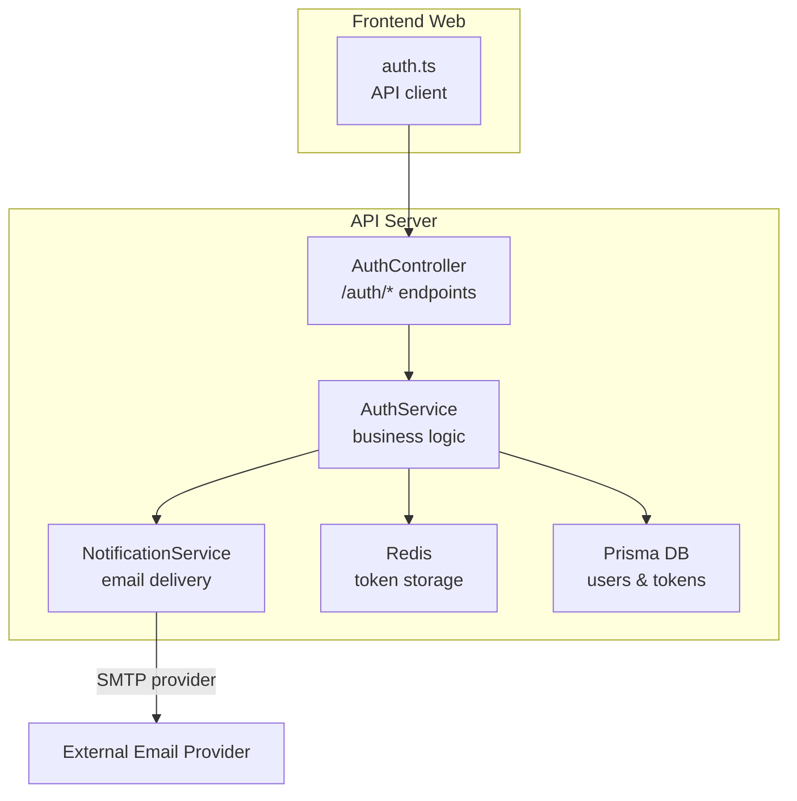
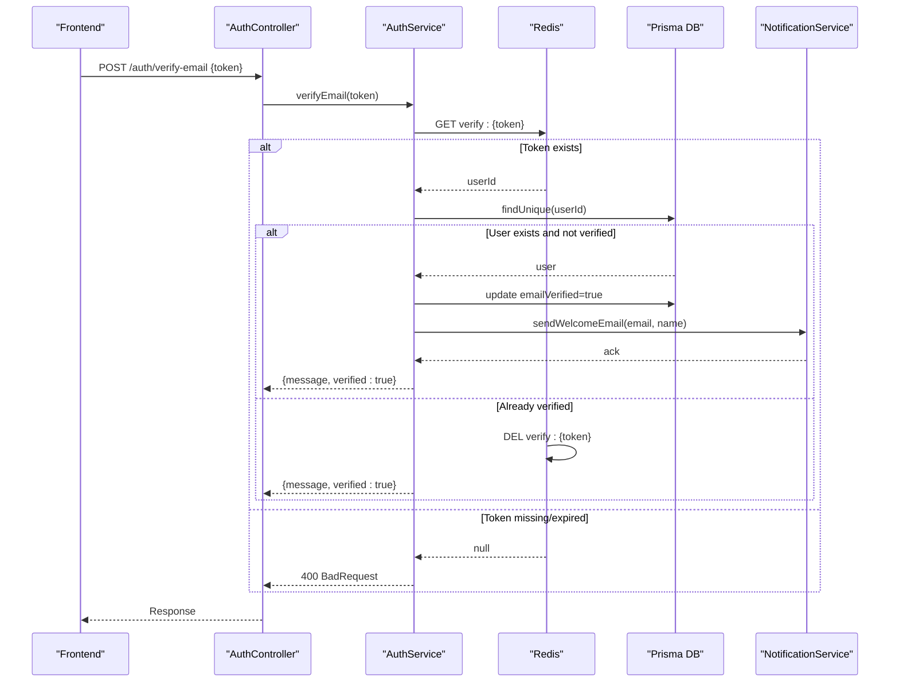
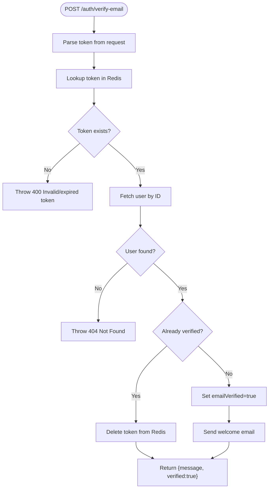
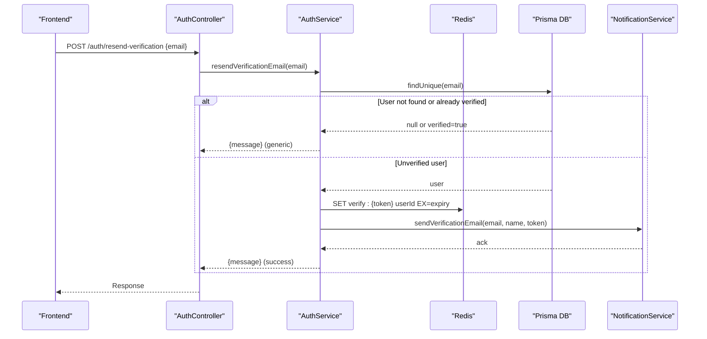
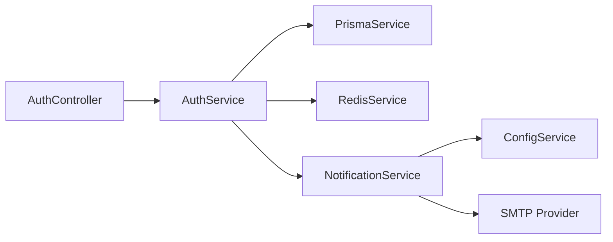

# Email Verification

<cite>
**Referenced Files in This Document**
- [auth.controller.ts](file://apps/api/src/modules/auth/auth.controller.ts)
- [auth.service.ts](file://apps/api/src/modules/auth/auth.service.ts)
- [verification.dto.ts](file://apps/api/src/modules/auth/dto/verification.dto.ts)
- [notification.service.ts](file://apps/api/src/modules/notifications/notification.service.ts)
- [email-template.dto.ts](file://apps/api/src/modules/notifications/dto/email-template.dto.ts)
- [configuration.ts](file://apps/api/src/config/configuration.ts)
- [auth.ts](file://apps/web/src/api/auth.ts)
</cite>

## Table of Contents
1. [Introduction](#introduction)
2. [Project Structure](#project-structure)
3. [Core Components](#core-components)
4. [Architecture Overview](#architecture-overview)
5. [Detailed Component Analysis](#detailed-component-analysis)
6. [Dependency Analysis](#dependency-analysis)
7. [Performance Considerations](#performance-considerations)
8. [Troubleshooting Guide](#troubleshooting-guide)
9. [Conclusion](#conclusion)

## Introduction
This document provides comprehensive API documentation for Quiz-to-Build’s email verification system. It covers:
- Email verification endpoint (/auth/verify-email) with token validation, success/failure scenarios, and user account activation
- Resend verification endpoint (/auth/resend-verification) with rate limiting, email delivery confirmation, and user experience considerations
- Token generation, expiration policies, and security measures
- Examples of successful verification flows, common error scenarios (invalid/expired tokens), and integration patterns for frontend applications
- Verification email content, delivery reliability, and user onboarding flows

## Project Structure
The email verification system spans the API server and the frontend client:
- API endpoints are defined in the Auth controller and implemented in the Auth service
- Email delivery is handled by the Notification service with configurable providers
- Frontend integrates via a dedicated auth API client

**Diagram sources**
- [auth.controller.ts:95-113](file://apps/api/src/modules/auth/auth.controller.ts#L95-L113)
- [auth.service.ts:298-383](file://apps/api/src/modules/auth/auth.service.ts#L298-L383)
- [notification.service.ts:160-320](file://apps/api/src/modules/notifications/notification.service.ts#L160-L320)

**Section sources**
- [auth.controller.ts:95-113](file://apps/api/src/modules/auth/auth.controller.ts#L95-L113)
- [auth.service.ts:298-383](file://apps/api/src/modules/auth/auth.service.ts#L298-L383)
- [notification.service.ts:160-320](file://apps/api/src/modules/notifications/notification.service.ts#L160-L320)

## Core Components
- AuthController: Exposes /auth/verify-email and /auth/resend-verification endpoints with DTO validation and throttling
- AuthService: Implements token validation, user lookup, verification updates, and email resending
- NotificationService: Renders and sends verification emails via configurable providers
- Email Templates: Predefined HTML/text templates for verification and welcome emails
- Configuration: Environment-driven token expiry and provider settings

**Section sources**
- [auth.controller.ts:95-113](file://apps/api/src/modules/auth/auth.controller.ts#L95-L113)
- [auth.service.ts:298-383](file://apps/api/src/modules/auth/auth.service.ts#L298-L383)
- [notification.service.ts:260-320](file://apps/api/src/modules/notifications/notification.service.ts#L260-L320)
- [email-template.dto.ts:50-89](file://apps/api/src/modules/notifications/dto/email-template.dto.ts#L50-L89)
- [configuration.ts:109-112](file://apps/api/src/config/configuration.ts#L109-L112)

## Architecture Overview
The verification flow involves token validation against Redis, user persistence checks, and optional welcome email delivery.

**Diagram sources**
- [auth.controller.ts:95-103](file://apps/api/src/modules/auth/auth.controller.ts#L95-L103)
- [auth.service.ts:318-358](file://apps/api/src/modules/auth/auth.service.ts#L318-L358)
- [notification.service.ts:307-319](file://apps/api/src/modules/notifications/notification.service.ts#L307-L319)

## Detailed Component Analysis

### Endpoint: POST /auth/verify-email
- Purpose: Validate a verification token and activate the user’s email
- Request body: VerifyEmailDto with token
- Responses:
  - 200 OK: { message, verified: true } on success
  - 400 Bad Request: Invalid or expired token
- Validation and flow:
  - Token retrieved from Redis under key pattern verify:{token}
  - If present, user record is fetched; if not verified, emailVerified is set to true and welcome email is sent
  - If token absent, throws a bad request error
  - If user already verified, returns success without updating DB and deletes the token

**Diagram sources**
- [auth.controller.ts:95-103](file://apps/api/src/modules/auth/auth.controller.ts#L95-L103)
- [auth.service.ts:318-358](file://apps/api/src/modules/auth/auth.service.ts#L318-L358)

**Section sources**
- [auth.controller.ts:95-103](file://apps/api/src/modules/auth/auth.controller.ts#L95-L103)
- [auth.service.ts:318-358](file://apps/api/src/modules/auth/auth.service.ts#L318-L358)
- [verification.dto.ts:4-9](file://apps/api/src/modules/auth/dto/verification.dto.ts#L4-L9)

### Endpoint: POST /auth/resend-verification
- Purpose: Resend a verification email to a user
- Request body: ResendVerificationDto with email
- Rate limiting: 3 requests per minute (throttled)
- Behavior:
  - If user does not exist or is already verified, returns a generic message to prevent email enumeration
  - Otherwise, generates a new token, stores it in Redis, and triggers email delivery
- Response: { message }

**Diagram sources**
- [auth.controller.ts:105-113](file://apps/api/src/modules/auth/auth.controller.ts#L105-L113)
- [auth.service.ts:363-383](file://apps/api/src/modules/auth/auth.service.ts#L363-L383)
- [notification.service.ts:263-280](file://apps/api/src/modules/notifications/notification.service.ts#L263-L280)

**Section sources**
- [auth.controller.ts:105-113](file://apps/api/src/modules/auth/auth.controller.ts#L105-L113)
- [auth.service.ts:363-383](file://apps/api/src/modules/auth/auth.service.ts#L363-L383)
- [verification.dto.ts:30-35](file://apps/api/src/modules/auth/dto/verification.dto.ts#L30-L35)

### Token Generation, Expiration, and Security
- Generation: Cryptographically secure random token using platform APIs
- Storage: Redis with TTL derived from environment configuration
- Expiration:
  - Verification token expiry: VERIFICATION_TOKEN_EXPIRY (default 24h)
  - Password reset token expiry: PASSWORD_RESET_TOKEN_EXPIRY (default 1h)
- Security measures:
  - Tokens are not stored in plaintext in the database; only Redis holds the mapping
  - Token keys are namespaced (verify:{token}, reset:{token}) to avoid collisions
  - Generic messages for resend endpoint prevent email enumeration
  - Frontend redirect URL is built from FRONTEND_URL and token

**Section sources**
- [auth.service.ts:303-305](file://apps/api/src/modules/auth/auth.service.ts#L303-L305)
- [auth.service.ts](file://apps/api/src/modules/auth/auth.service.ts#L302)
- [configuration.ts:110-111](file://apps/api/src/config/configuration.ts#L110-L111)
- [notification.service.ts](file://apps/api/src/modules/notifications/notification.service.ts#L268)

### Email Content and Delivery Reliability
- Templates:
  - Verification email: personalized subject and body, prominent action button, expiration notice
  - Welcome email: on successful verification, introduces the product and directs to dashboard
- Providers:
  - Brevo (preferred), with fallback to SendGrid, or console provider for development
- Delivery confirmation:
  - Response includes messageId when available; errors are logged and surfaced in audit logs
- Reliability:
  - Email provider initialization is environment-driven
  - Console provider avoids network calls during local development

**Section sources**
- [email-template.dto.ts:50-89](file://apps/api/src/modules/notifications/dto/email-template.dto.ts#L50-L89)
- [email-template.dto.ts:134-181](file://apps/api/src/modules/notifications/dto/email-template.dto.ts#L134-L181)
- [notification.service.ts:165-187](file://apps/api/src/modules/notifications/notification.service.ts#L165-L187)
- [notification.service.ts:263-319](file://apps/api/src/modules/notifications/notification.service.ts#L263-L319)

### Frontend Integration Patterns
- Frontend client exposes typed methods for verification and resend:
  - verifyEmail(token): posts to /auth/verify-email
  - resendVerification(email): posts to /auth/resend-verification
- Typical flow:
  - On registration, app displays “check your inbox” messaging
  - On click of verification link, app calls verifyEmail(token)
  - On resend, app calls resendVerification(email) and shows a generic success message
- Error handling:
  - Invalid/expired token: show user-friendly message and offer resend
  - Network errors: retry with user feedback

**Section sources**
- [auth.ts:53-67](file://apps/web/src/api/auth.ts#L53-L67)
- [auth.ts:63-67](file://apps/web/src/api/auth.ts#L63-L67)

## Dependency Analysis
- AuthController depends on AuthService for business logic
- AuthService depends on:
  - Prisma for user persistence
  - Redis for ephemeral token storage
  - NotificationService for email delivery
- NotificationService depends on:
  - ConfigService for provider credentials and sender info
  - External SMTP provider via fetch

**Diagram sources**
- [auth.controller.ts:33-36](file://apps/api/src/modules/auth/auth.controller.ts#L33-L36)
- [auth.service.ts:46-52](file://apps/api/src/modules/auth/auth.service.ts#L46-L52)
- [notification.service.ts:165-187](file://apps/api/src/modules/notifications/notification.service.ts#L165-L187)

**Section sources**
- [auth.controller.ts:33-36](file://apps/api/src/modules/auth/auth.controller.ts#L33-L36)
- [auth.service.ts:46-52](file://apps/api/src/modules/auth/auth.service.ts#L46-L52)
- [notification.service.ts:165-187](file://apps/api/src/modules/notifications/notification.service.ts#L165-L187)

## Performance Considerations
- Redis-backed token validation ensures O(1) lookup and minimal DB load
- Non-blocking email sending: verification completion does not wait for email delivery
- Rate limiting on resend endpoint prevents abuse and reduces downstream provider load
- Token TTLs balance usability (24h) with security (limited lifetime)

[No sources needed since this section provides general guidance]

## Troubleshooting Guide
Common issues and resolutions:
- Invalid or expired token
  - Symptom: 400 Bad Request on /auth/verify-email
  - Cause: token missing or expired in Redis
  - Resolution: prompt user to request a new verification email
- User not found
  - Symptom: 404 Not Found during verification
  - Cause: token mapped to a non-existent user
  - Resolution: re-register or contact support
- Already verified
  - Symptom: success response with verified=true
  - Cause: user’s emailVerified was already true
  - Resolution: proceed to dashboard or next step
- Resend returns generic message
  - Symptom: message indicates potential delivery regardless of existence
  - Cause: anti-enumeration behavior
  - Resolution: inform user to check inbox/spam
- Email delivery failures
  - Symptom: audit logs show failures
  - Cause: provider API errors or network issues
  - Resolution: check provider credentials and logs; consider fallback provider

**Section sources**
- [auth.service.ts:321-323](file://apps/api/src/modules/auth/auth.service.ts#L321-L323)
- [auth.service.ts:330-332](file://apps/api/src/modules/auth/auth.service.ts#L330-L332)
- [auth.service.ts:373-375](file://apps/api/src/modules/auth/auth.service.ts#L373-L375)
- [notification.service.ts:444-469](file://apps/api/src/modules/notifications/notification.service.ts#L444-L469)

## Conclusion
The email verification system provides robust, secure, and user-friendly mechanisms for email validation. It leverages Redis for efficient token management, configurable email providers for reliable delivery, and thoughtful UX patterns to minimize friction while preventing abuse. Integrating the frontend client with the documented endpoints enables seamless onboarding and verification flows.