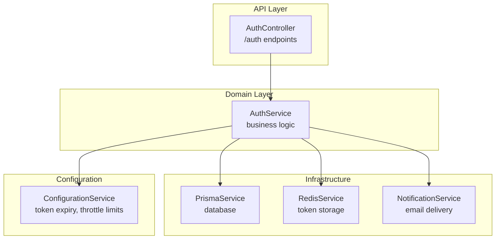
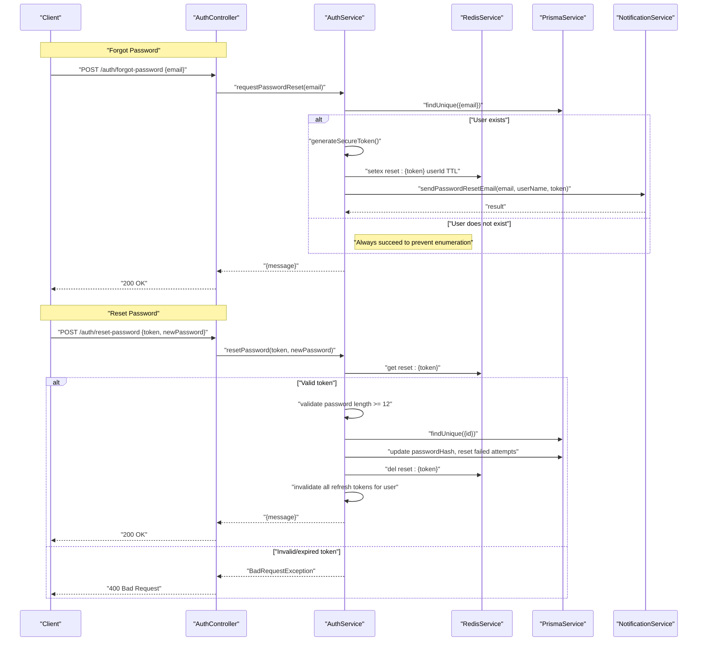
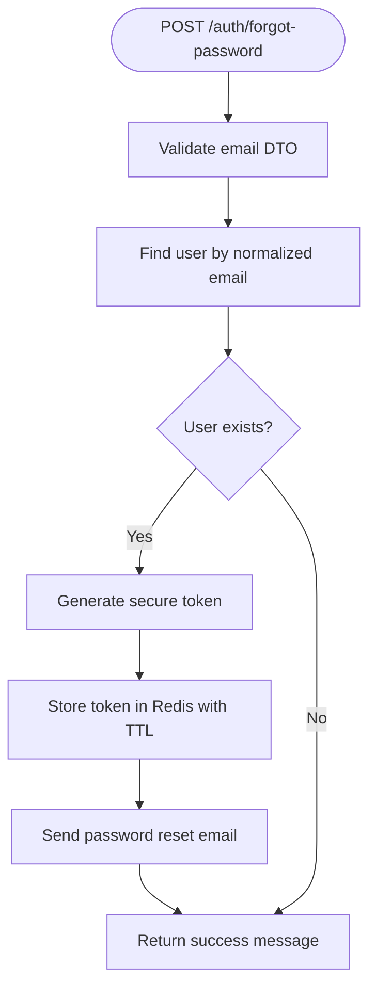
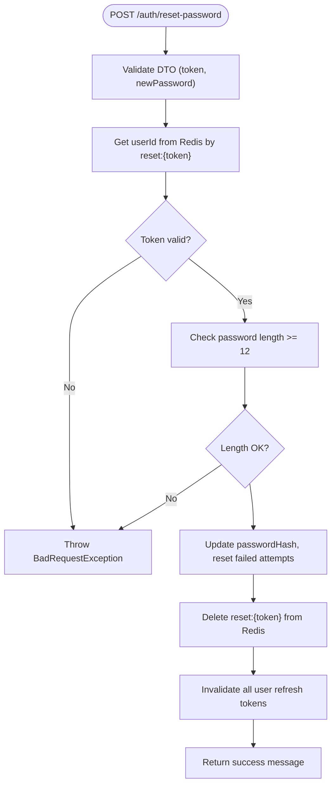
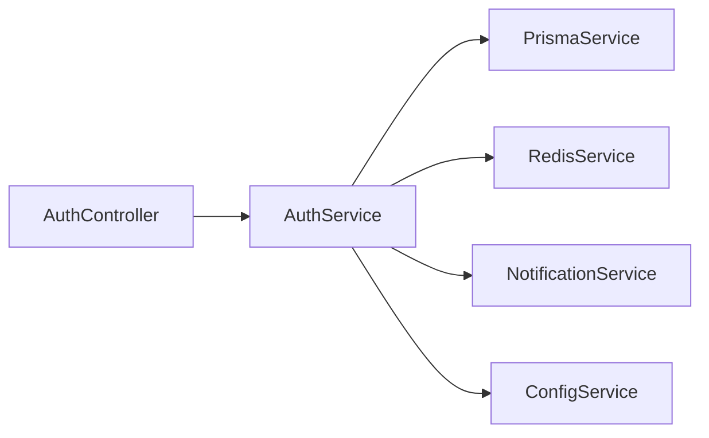

# Password Reset

<cite>
**Referenced Files in This Document**
- [auth.controller.ts](file://apps/api/src/modules/auth/auth.controller.ts)
- [auth.service.ts](file://apps/api/src/modules/auth/auth.service.ts)
- [verification.dto.ts](file://apps/api/src/modules/auth/dto/verification.dto.ts)
- [notification.service.ts](file://apps/api/src/modules/notifications/notification.service.ts)
- [email-template.dto.ts](file://apps/api/src/modules/notifications/dto/email-template.dto.ts)
- [configuration.ts](file://apps/api/src/config/configuration.ts)
- [csrf.guard.ts](file://apps/api/src/common/guards/csrf.guard.ts)
</cite>

## Table of Contents
1. [Introduction](#introduction)
2. [Project Structure](#project-structure)
3. [Core Components](#core-components)
4. [Architecture Overview](#architecture-overview)
5. [Detailed Component Analysis](#detailed-component-analysis)
6. [Dependency Analysis](#dependency-analysis)
7. [Performance Considerations](#performance-considerations)
8. [Troubleshooting Guide](#troubleshooting-guide)
9. [Conclusion](#conclusion)

## Introduction
This document provides comprehensive API documentation for Quiz-to-Build’s password reset functionality. It covers the forgot password and reset password endpoints, including request/response specifications, rate limiting, token generation and expiration, security measures, and integration patterns. It also describes the password reset email content, user experience flows, and best practices to prevent unauthorized access.

## Project Structure
The password reset feature spans the authentication controller and service, DTOs for request validation, the notification service for email delivery, and configuration for token lifetimes and throttling.

**Diagram sources**
- [auth.controller.ts:117-136](file://apps/api/src/modules/auth/auth.controller.ts#L117-L136)
- [auth.service.ts:385-466](file://apps/api/src/modules/auth/auth.service.ts#L385-L466)
- [notification.service.ts:159-302](file://apps/api/src/modules/notifications/notification.service.ts#L159-L302)
- [configuration.ts:109-112](file://apps/api/src/config/configuration.ts#L109-L112)

**Section sources**
- [auth.controller.ts:117-136](file://apps/api/src/modules/auth/auth.controller.ts#L117-L136)
- [auth.service.ts:385-466](file://apps/api/src/modules/auth/auth.service.ts#L385-L466)
- [notification.service.ts:159-302](file://apps/api/src/modules/notifications/notification.service.ts#L159-L302)
- [configuration.ts:109-112](file://apps/api/src/config/configuration.ts#L109-L112)

## Core Components
- Forgot Password Endpoint: Initiates password reset by validating the email and sending a reset link if an account exists.
- Reset Password Endpoint: Validates the reset token, enforces password strength, updates the password, invalidates refresh tokens, and returns a success message.
- Token Management: Secure token generation, Redis-backed storage with TTL, and strict expiration handling.
- Rate Limiting: Per-minute throttling for both forgot-password and reset-password endpoints.
- Security Measures: CSRF protection for state-changing requests, constant-time comparisons, and defensive email delivery.

**Section sources**
- [auth.controller.ts:117-136](file://apps/api/src/modules/auth/auth.controller.ts#L117-L136)
- [auth.service.ts:385-466](file://apps/api/src/modules/auth/auth.service.ts#L385-L466)
- [verification.dto.ts:11-28](file://apps/api/src/modules/auth/dto/verification.dto.ts#L11-L28)
- [csrf.guard.ts:48-148](file://apps/api/src/common/guards/csrf.guard.ts#L48-L148)

## Architecture Overview
The password reset flow integrates NestJS controllers, domain services, Redis for temporary token storage, Prisma for user persistence, and a notification service for email delivery.

**Diagram sources**
- [auth.controller.ts:117-136](file://apps/api/src/modules/auth/auth.controller.ts#L117-L136)
- [auth.service.ts:390-466](file://apps/api/src/modules/auth/auth.service.ts#L390-L466)
- [notification.service.ts:285-302](file://apps/api/src/modules/notifications/notification.service.ts#L285-L302)
- [configuration.ts:109-112](file://apps/api/src/config/configuration.ts#L109-L112)

## Detailed Component Analysis

### Forgot Password Endpoint
- Path: POST /auth/forgot-password
- Purpose: Initiate password reset by sending a reset link if an account exists for the given email.
- Request Validation:
  - email: required, valid email format.
- Behavior:
  - Lookup user by normalized email.
  - Generate a cryptographically secure token.
  - Store token in Redis with a TTL derived from configuration.
  - Send password reset email via NotificationService.
  - Always return a success message to prevent email enumeration.
- Rate Limiting:
  - 3 requests per minute per IP.
- Security Considerations:
  - No user enumeration via response differences.
  - Token stored server-side with short TTL.
  - CSRF protection enabled for state-changing requests.

**Diagram sources**
- [auth.controller.ts:117-125](file://apps/api/src/modules/auth/auth.controller.ts#L117-L125)
- [auth.service.ts:390-418](file://apps/api/src/modules/auth/auth.service.ts#L390-L418)
- [verification.dto.ts:11-16](file://apps/api/src/modules/auth/dto/verification.dto.ts#L11-L16)
- [configuration.ts:109-112](file://apps/api/src/config/configuration.ts#L109-L112)

**Section sources**
- [auth.controller.ts:117-125](file://apps/api/src/modules/auth/auth.controller.ts#L117-L125)
- [auth.service.ts:390-418](file://apps/api/src/modules/auth/auth.service.ts#L390-L418)
- [verification.dto.ts:11-16](file://apps/api/src/modules/auth/dto/verification.dto.ts#L11-L16)
- [notification.service.ts:285-302](file://apps/api/src/modules/notifications/notification.service.ts#L285-L302)
- [configuration.ts:109-112](file://apps/api/src/config/configuration.ts#L109-L112)

### Reset Password Endpoint
- Path: POST /auth/reset-password
- Purpose: Validate the reset token, enforce password strength, update the password, invalidate refresh tokens, and confirm reset.
- Request Validation:
  - token: required, non-empty string.
  - newPassword: required, minimum 12 characters.
- Behavior:
  - Retrieve user ID from Redis using the reset token.
  - Reject if token is missing/expired.
  - Validate password meets minimum length requirement.
  - Update user’s password hash and reset failed login attempts.
  - Delete the reset token from Redis.
  - Invalidate all of the user’s refresh tokens.
  - Return success message.
- Rate Limiting:
  - 5 attempts per minute per IP.
- Security Considerations:
  - Strict password length enforcement.
  - Immediate invalidation of refresh tokens upon reset.
  - Constant-time comparisons and CSRF protection.

**Diagram sources**
- [auth.controller.ts:127-136](file://apps/api/src/modules/auth/auth.controller.ts#L127-L136)
- [auth.service.ts:423-466](file://apps/api/src/modules/auth/auth.service.ts#L423-L466)
- [verification.dto.ts:18-28](file://apps/api/src/modules/auth/dto/verification.dto.ts#L18-L28)

**Section sources**
- [auth.controller.ts:127-136](file://apps/api/src/modules/auth/auth.controller.ts#L127-L136)
- [auth.service.ts:423-466](file://apps/api/src/modules/auth/auth.service.ts#L423-L466)
- [verification.dto.ts:18-28](file://apps/api/src/modules/auth/dto/verification.dto.ts#L18-L28)

### Token Generation, Storage, and Expiration
- Token Generation:
  - Cryptographically secure random token using platform APIs.
- Storage:
  - Redis keys: reset:{token} -> userId with TTL.
- Expiration:
  - Derived from configuration: PASSWORD_RESET_TOKEN_EXPIRY (default 1 hour).
- Revocation:
  - On successful reset, token is deleted.
  - On password change, all refresh tokens for the user are invalidated.

**Section sources**
- [auth.service.ts:503-505](file://apps/api/src/modules/auth/auth.service.ts#L503-L505)
- [auth.service.ts:402-405](file://apps/api/src/modules/auth/auth.service.ts#L402-L405)
- [auth.service.ts:457-461](file://apps/api/src/modules/auth/auth.service.ts#L457-L461)
- [configuration.ts:109-112](file://apps/api/src/config/configuration.ts#L109-L112)

### Password Reset Email Content
- Email Type: PASSWORD_RESET
- Subject: “Reset your Quiz2Biz password”
- Variables:
  - userName: recipient’s name or username.
  - actionUrl: frontend URL with token query parameter.
  - expiresIn: token lifetime (1 hour).
- Delivery:
  - Uses NotificationService with configurable providers (Brevo/SendGrid/console fallback).
- Frontend URL:
  - Configured via FRONTEND_URL environment variable.

**Section sources**
- [notification.service.ts:285-302](file://apps/api/src/modules/notifications/notification.service.ts#L285-L302)
- [email-template.dto.ts:91-132](file://apps/api/src/modules/notifications/dto/email-template.dto.ts#L91-L132)
- [configuration.ts](file://apps/api/src/config/configuration.ts#L108)

### Rate Limiting and Brute Force Mitigation
- Forgot Password:
  - 3 requests per minute per IP.
- Reset Password:
  - 5 attempts per minute per IP.
- Additional Mitigations:
  - Constant-time CSRF token validation.
  - Strong JWT secrets enforced in production.
  - Account lockout behavior during login (defensive measure).

**Section sources**
- [auth.controller.ts](file://apps/api/src/modules/auth/auth.controller.ts#L120)
- [auth.controller.ts](file://apps/api/src/modules/auth/auth.controller.ts#L130)
- [csrf.guard.ts:113-134](file://apps/api/src/common/guards/csrf.guard.ts#L113-L134)
- [configuration.ts:32-43](file://apps/api/src/config/configuration.ts#L32-L43)

### Request and Response Specifications

#### Forgot Password
- Request
  - Method: POST
  - Path: /auth/forgot-password
  - Headers: Content-Type: application/json
  - Body:
    - email: string (required, valid email)
- Response
  - Status: 200 OK
  - Body: { message: string }
  - Example: { "message": "If your email is registered, you will receive a password reset link" }

**Section sources**
- [auth.controller.ts:117-125](file://apps/api/src/modules/auth/auth.controller.ts#L117-L125)
- [verification.dto.ts:11-16](file://apps/api/src/modules/auth/dto/verification.dto.ts#L11-L16)

#### Reset Password
- Request
  - Method: POST
  - Path: /auth/reset-password
  - Headers: Content-Type: application/json
  - Body:
    - token: string (required, non-empty)
    - newPassword: string (required, minimum 12 characters)
- Response
  - Status: 200 OK
  - Body: { message: string }
  - Example: { "message": "Password has been reset successfully" }
- Error Responses
  - 400 Bad Request: Invalid or expired reset token
  - 400 Bad Request: Password too short (< 12 characters)

**Section sources**
- [auth.controller.ts:127-136](file://apps/api/src/modules/auth/auth.controller.ts#L127-L136)
- [verification.dto.ts:18-28](file://apps/api/src/modules/auth/dto/verification.dto.ts#L18-L28)
- [auth.service.ts:423-466](file://apps/api/src/modules/auth/auth.service.ts#L423-L466)

### Integration Patterns
- Frontend Integration:
  - Trigger forgot-password with user’s email.
  - Redirect to reset-password page with token query parameter from the email link.
  - Submit reset-password with token and new password.
- Backend Integration:
  - Ensure Redis is configured and reachable.
  - Configure email provider credentials (BREVO or SENDGRID) for production.
  - Respect rate limits to avoid blocking legitimate users.
- Security Integration:
  - Enforce CSRF protection for state-changing requests.
  - Validate JWT secrets meet production requirements.
  - Monitor audit logs for email delivery outcomes.

**Section sources**
- [notification.service.ts:285-302](file://apps/api/src/modules/notifications/notification.service.ts#L285-L302)
- [configuration.ts:70-85](file://apps/api/src/config/configuration.ts#L70-L85)
- [csrf.guard.ts:48-148](file://apps/api/src/common/guards/csrf.guard.ts#L48-L148)

## Dependency Analysis
The password reset feature depends on:
- AuthController for endpoint exposure and throttling.
- AuthService for business logic, token handling, and user updates.
- RedisService for transient token storage.
- PrismaService for persistent user data.
- NotificationService for email delivery.
- ConfigurationService for token TTL and throttle limits.

**Diagram sources**
- [auth.controller.ts:117-136](file://apps/api/src/modules/auth/auth.controller.ts#L117-L136)
- [auth.service.ts:385-466](file://apps/api/src/modules/auth/auth.service.ts#L385-L466)
- [notification.service.ts:159-302](file://apps/api/src/modules/notifications/notification.service.ts#L159-L302)
- [configuration.ts:109-112](file://apps/api/src/config/configuration.ts#L109-L112)

**Section sources**
- [auth.controller.ts:117-136](file://apps/api/src/modules/auth/auth.controller.ts#L117-L136)
- [auth.service.ts:385-466](file://apps/api/src/modules/auth/auth.service.ts#L385-L466)
- [notification.service.ts:159-302](file://apps/api/src/modules/notifications/notification.service.ts#L159-L302)
- [configuration.ts:109-112](file://apps/api/src/config/configuration.ts#L109-L112)

## Performance Considerations
- Redis latency: Ensure low-latency Redis connectivity for token operations.
- Email throughput: NotificationService supports bulk sends with small delays to avoid provider rate limits.
- Token TTL: Keep reset token TTL short to minimize stale data in Redis.
- Rate limiting: Tune throttle limits per deployment needs to balance usability and abuse prevention.

[No sources needed since this section provides general guidance]

## Troubleshooting Guide
- Reset token invalid or expired:
  - Cause: Token not found in Redis or TTL exceeded.
  - Resolution: Require user to initiate a new forgot-password request.
- Password too short:
  - Cause: newPassword shorter than 12 characters.
  - Resolution: Enforce client-side and server-side validation to require at least 12 characters.
- Email delivery failures:
  - Cause: Missing or invalid email provider credentials.
  - Resolution: Configure BREVO or SENDGRID credentials; verify provider availability.
- CSRF validation errors:
  - Cause: Missing or mismatched CSRF token in header vs cookie.
  - Resolution: Ensure frontend reads the CSRF cookie and sends matching X-CSRF-Token header.
- Rate limit exceeded:
  - Cause: Too many forgot-password or reset attempts.
  - Resolution: Inform user to retry after the throttle window; consider increasing limits if legitimate usage patterns require it.

**Section sources**
- [auth.service.ts:423-428](file://apps/api/src/modules/auth/auth.service.ts#L423-L428)
- [auth.service.ts:430-433](file://apps/api/src/modules/auth/auth.service.ts#L430-L433)
- [notification.service.ts:169-187](file://apps/api/src/modules/notifications/notification.service.ts#L169-L187)
- [csrf.guard.ts:95-147](file://apps/api/src/common/guards/csrf.guard.ts#L95-L147)
- [auth.controller.ts](file://apps/api/src/modules/auth/auth.controller.ts#L120)
- [auth.controller.ts](file://apps/api/src/modules/auth/auth.controller.ts#L130)

## Conclusion
The password reset feature is designed with security and resilience in mind: tokens are securely generated and stored with short TTLs, rate limiting protects against abuse, and strict validation ensures robustness. The email content is standardized and delivered through a configurable provider. Integrators should configure Redis, email providers, and CSRF secrets appropriately for production and monitor audit logs for operational insights.