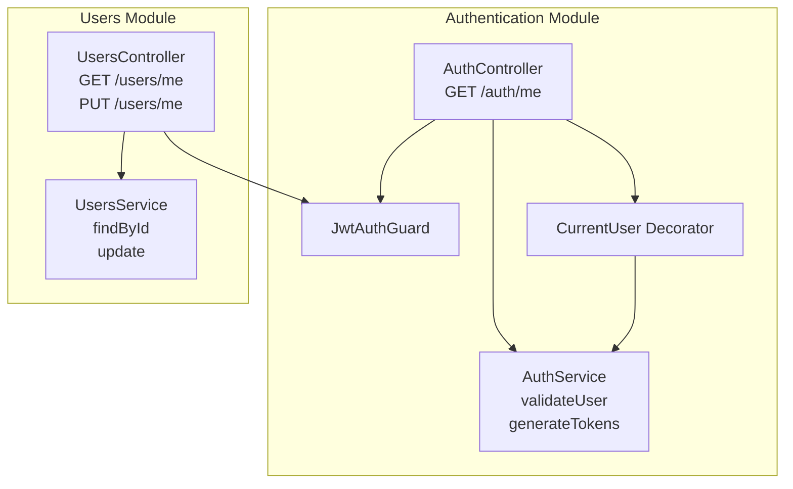
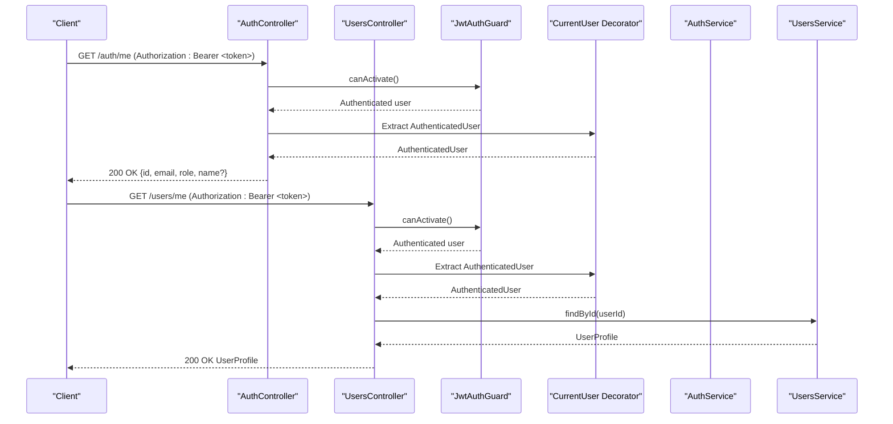
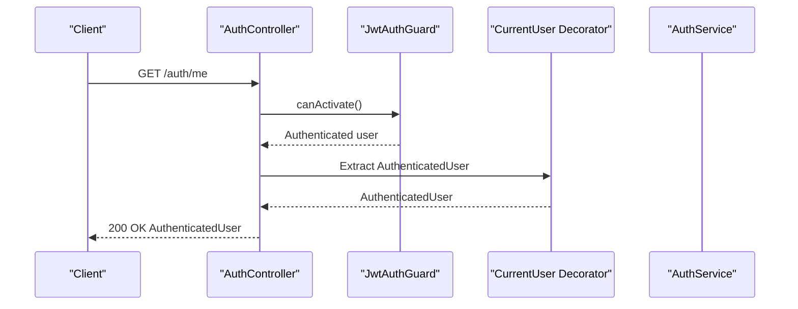
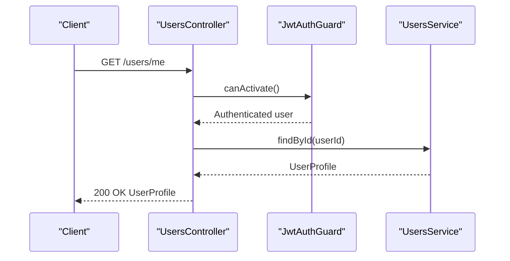
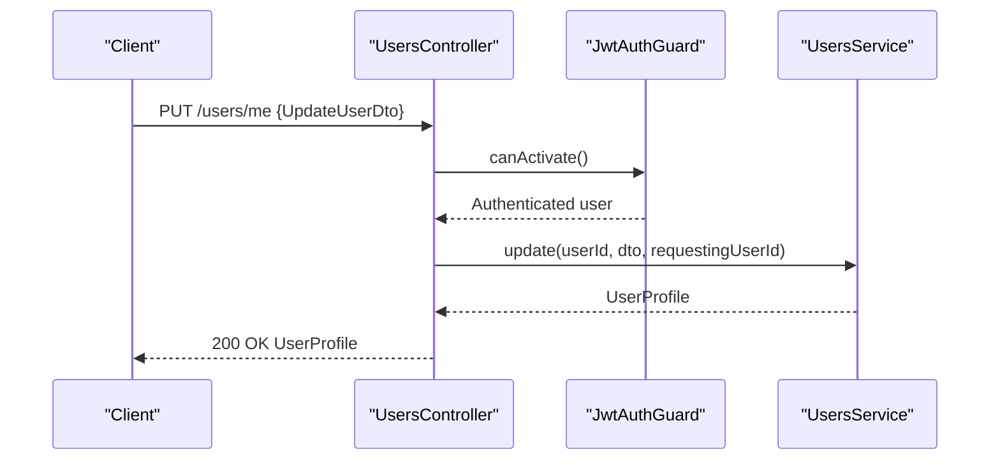
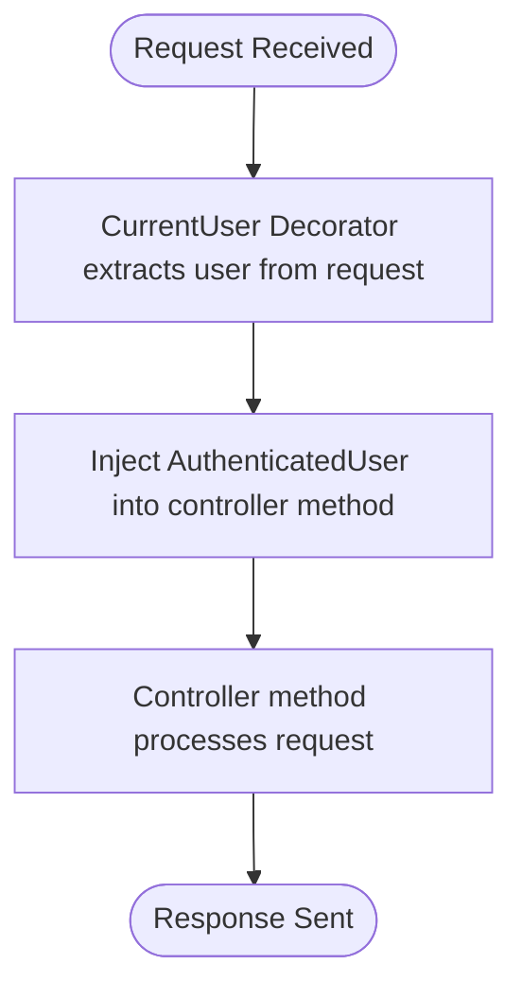
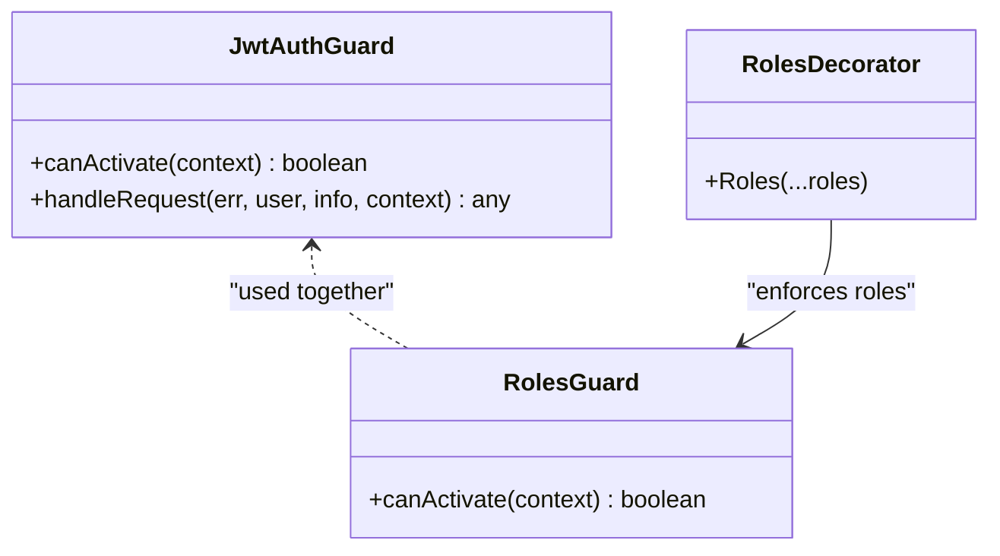
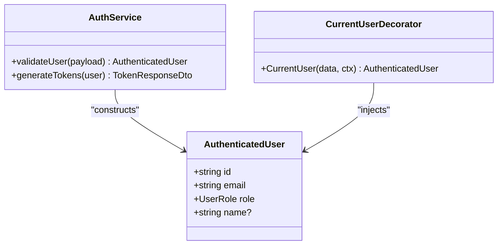
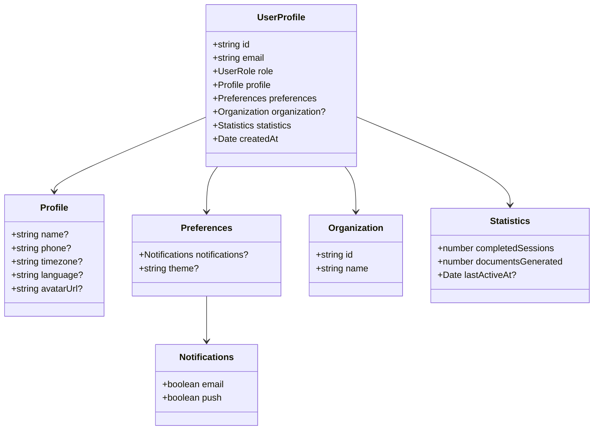
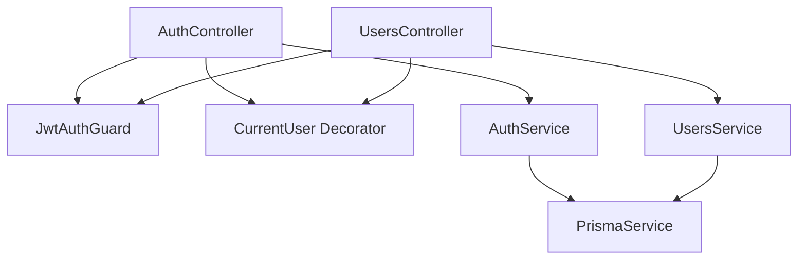

# User Profile Management

<cite>
**Referenced Files in This Document**
- [auth.controller.ts](file://apps/api/src/modules/auth/auth.controller.ts)
- [auth.service.ts](file://apps/api/src/modules/auth/auth.service.ts)
- [jwt-auth.guard.ts](file://apps/api/src/modules/auth/guards/jwt-auth.guard.ts)
- [user.decorator.ts](file://apps/api/src/modules/auth/decorators/user.decorator.ts)
- [users.controller.ts](file://apps/api/src/modules/users/users.controller.ts)
- [users.service.ts](file://apps/api/src/modules/users/users.service.ts)
- [update-user.dto.ts](file://apps/api/src/modules/users/dto/update-user.dto.ts)
</cite>

## Table of Contents
1. [Introduction](#introduction)
2. [Project Structure](#project-structure)
3. [Core Components](#core-components)
4. [Architecture Overview](#architecture-overview)
5. [Detailed Component Analysis](#detailed-component-analysis)
6. [Dependency Analysis](#dependency-analysis)
7. [Performance Considerations](#performance-considerations)
8. [Troubleshooting Guide](#troubleshooting-guide)
9. [Conclusion](#conclusion)

## Introduction
This document provides comprehensive API documentation for Quiz-to-Build's user profile management endpoints, focusing on retrieving and updating the authenticated user's profile. It covers the GET /users/me endpoint, JWT authentication requirements, user data retrieval, profile information structure, authenticated user decorator usage, role-based access control, and user context management. It also includes user profile data schema, optional fields, privacy considerations, examples of successful profile retrieval, authentication failures, user data updates, session management, profile caching strategies, and integration patterns for frontend applications. Security considerations for profile data exposure and access control mechanisms are addressed throughout.

## Project Structure
The user profile management functionality spans two primary modules:
- Authentication module: Handles JWT authentication, guard logic, and user context extraction via decorators.
- Users module: Manages user profile retrieval and updates, including role-based access control for administrative endpoints.

**Diagram sources**
- [auth.controller.ts:83-91](file://apps/api/src/modules/auth/auth.controller.ts#L83-L91)
- [auth.service.ts:185-209](file://apps/api/src/modules/auth/auth.service.ts#L185-L209)
- [jwt-auth.guard.ts:14-63](file://apps/api/src/modules/auth/guards/jwt-auth.guard.ts#L14-L63)
- [user.decorator.ts:4-18](file://apps/api/src/modules/auth/decorators/user.decorator.ts#L4-L18)
- [users.controller.ts:23-38](file://apps/api/src/modules/users/users.controller.ts#L23-L38)
- [users.service.ts:41-73](file://apps/api/src/modules/users/users.service.ts#L41-L73)

**Section sources**
- [auth.controller.ts:83-91](file://apps/api/src/modules/auth/auth.controller.ts#L83-L91)
- [users.controller.ts:23-38](file://apps/api/src/modules/users/users.controller.ts#L23-L38)

## Core Components
- AuthController: Exposes the GET /auth/me endpoint for retrieving the current user's basic authenticated context. It uses JwtAuthGuard and the CurrentUser decorator to enforce authentication and inject the user context.
- UsersController: Exposes GET /users/me and PUT /users/me for retrieving and updating the authenticated user's complete profile. It enforces JWT authentication and applies role-based access control for administrative endpoints.
- AuthService: Provides user validation and token generation. The validateUser method constructs the AuthenticatedUser object used by the CurrentUser decorator.
- UsersService: Implements profile retrieval and updates, mapping raw database records to the UserProfile interface and enforcing permissions.
- JwtAuthGuard: Custom authentication guard that validates JWT tokens, handles expiration and invalid token scenarios, and logs authentication failures.
- CurrentUser Decorator: Extracts the authenticated user from the request context, enabling direct injection into controller methods.

**Section sources**
- [auth.controller.ts:83-91](file://apps/api/src/modules/auth/auth.controller.ts#L83-L91)
- [users.controller.ts:23-38](file://apps/api/src/modules/users/users.controller.ts#L23-L38)
- [auth.service.ts:185-209](file://apps/api/src/modules/auth/auth.service.ts#L185-L209)
- [users.service.ts:7-35](file://apps/api/src/modules/users/users.service.ts#L7-L35)
- [jwt-auth.guard.ts:14-63](file://apps/api/src/modules/auth/guards/jwt-auth.guard.ts#L14-L63)
- [user.decorator.ts:4-18](file://apps/api/src/modules/auth/decorators/user.decorator.ts#L4-L18)

## Architecture Overview
The user profile management flow integrates authentication and authorization layers with the users service to provide secure access to profile data.

**Diagram sources**
- [auth.controller.ts:83-91](file://apps/api/src/modules/auth/auth.controller.ts#L83-L91)
- [users.controller.ts:23-28](file://apps/api/src/modules/users/users.controller.ts#L23-L28)
- [jwt-auth.guard.ts:22-62](file://apps/api/src/modules/auth/guards/jwt-auth.guard.ts#L22-L62)
- [user.decorator.ts:9-16](file://apps/api/src/modules/auth/decorators/user.decorator.ts#L9-L16)
- [auth.service.ts:185-209](file://apps/api/src/modules/auth/auth.service.ts#L185-L209)
- [users.service.ts:41-73](file://apps/api/src/modules/users/users.service.ts#L41-L73)

## Detailed Component Analysis

### GET /auth/me Endpoint
- Purpose: Retrieve the current authenticated user's basic context (id, email, role, optional name).
- Authentication: Requires a valid JWT bearer token.
- Authorization: Enforced by JwtAuthGuard.
- Decorators: Uses CurrentUser to inject the AuthenticatedUser object.
- Response: Returns the AuthenticatedUser object.

**Diagram sources**
- [auth.controller.ts:83-91](file://apps/api/src/modules/auth/auth.controller.ts#L83-L91)
- [jwt-auth.guard.ts:22-62](file://apps/api/src/modules/auth/guards/jwt-auth.guard.ts#L22-L62)
- [user.decorator.ts:9-16](file://apps/api/src/modules/auth/decorators/user.decorator.ts#L9-L16)
- [auth.service.ts:185-209](file://apps/api/src/modules/auth/auth.service.ts#L185-L209)

**Section sources**
- [auth.controller.ts:83-91](file://apps/api/src/modules/auth/auth.controller.ts#L83-L91)
- [jwt-auth.guard.ts:14-63](file://apps/api/src/modules/auth/guards/jwt-auth.guard.ts#L14-L63)
- [user.decorator.ts:4-18](file://apps/api/src/modules/auth/decorators/user.decorator.ts#L4-L18)
- [auth.service.ts:30-35](file://apps/api/src/modules/auth/auth.service.ts#L30-L35)

### GET /users/me Endpoint
- Purpose: Retrieve the current authenticated user's complete profile.
- Authentication: Requires a valid JWT bearer token.
- Authorization: Enforced by JwtAuthGuard.
- Permissions: No role restrictions; accessible to all authenticated users.
- Response: Returns the UserProfile object constructed by UsersService.

**Diagram sources**
- [users.controller.ts:23-28](file://apps/api/src/modules/users/users.controller.ts#L23-L28)
- [jwt-auth.guard.ts:22-62](file://apps/api/src/modules/auth/guards/jwt-auth.guard.ts#L22-L62)
- [users.service.ts:41-73](file://apps/api/src/modules/users/users.service.ts#L41-L73)

**Section sources**
- [users.controller.ts:23-28](file://apps/api/src/modules/users/users.controller.ts#L23-L28)
- [users.service.ts:41-73](file://apps/api/src/modules/users/users.service.ts#L41-L73)

### PUT /users/me Endpoint
- Purpose: Update the authenticated user's profile.
- Authentication: Requires a valid JWT bearer token.
- Authorization: Enforced by JwtAuthGuard.
- Permissions: Users can only update their own profile; administrators can update others.
- Request Body: UpdateUserDto supports partial updates to name, phone, timezone, and preferences.
- Response: Returns the updated UserProfile object.

**Diagram sources**
- [users.controller.ts:30-38](file://apps/api/src/modules/users/users.controller.ts#L30-L38)
- [jwt-auth.guard.ts:22-62](file://apps/api/src/modules/auth/guards/jwt-auth.guard.ts#L22-L62)
- [users.service.ts:75-127](file://apps/api/src/modules/users/users.service.ts#L75-L127)
- [update-user.dto.ts:4-35](file://apps/api/src/modules/users/dto/update-user.dto.ts#L4-L35)

**Section sources**
- [users.controller.ts:30-38](file://apps/api/src/modules/users/users.controller.ts#L30-L38)
- [users.service.ts:75-127](file://apps/api/src/modules/users/users.service.ts#L75-L127)
- [update-user.dto.ts:4-35](file://apps/api/src/modules/users/dto/update-user.dto.ts#L4-L35)

### Authenticated User Decorator Usage
- CurrentUser Decorator: Extracts the AuthenticatedUser from the request context. It supports accessing specific properties or the entire user object.
- Usage: Applied to controller parameters to inject the authenticated user context.

**Diagram sources**
- [user.decorator.ts:4-18](file://apps/api/src/modules/auth/decorators/user.decorator.ts#L4-L18)

**Section sources**
- [user.decorator.ts:4-18](file://apps/api/src/modules/auth/decorators/user.decorator.ts#L4-L18)

### Role-Based Access Control
- JwtAuthGuard: Validates JWT tokens and handles authentication failures.
- RolesGuard and @Roles: Used for administrative endpoints to restrict access to ADMIN and SUPER_ADMIN roles.
- Profile Management Endpoints: GET /users/me and PUT /users/me are protected by JwtAuthGuard but do not require elevated roles.

**Diagram sources**
- [jwt-auth.guard.ts:14-63](file://apps/api/src/modules/auth/guards/jwt-auth.guard.ts#L14-L63)
- [users.controller.ts:40-73](file://apps/api/src/modules/users/users.controller.ts#L40-L73)

**Section sources**
- [jwt-auth.guard.ts:14-63](file://apps/api/src/modules/auth/guards/jwt-auth.guard.ts#L14-L63)
- [users.controller.ts:40-73](file://apps/api/src/modules/users/users.controller.ts#L40-L73)

### User Context Management
- AuthenticatedUser Interface: Defines the shape of the user context injected into controllers.
- AuthService.validateUser: Constructs the AuthenticatedUser object from database records, including optional name field derived from profile.
- CurrentUser Decorator: Provides direct access to the authenticated user's properties.

**Diagram sources**
- [auth.service.ts:30-35](file://apps/api/src/modules/auth/auth.service.ts#L30-L35)
- [auth.service.ts:185-209](file://apps/api/src/modules/auth/auth.service.ts#L185-L209)
- [user.decorator.ts:4-18](file://apps/api/src/modules/auth/decorators/user.decorator.ts#L4-L18)

**Section sources**
- [auth.service.ts:30-35](file://apps/api/src/modules/auth/auth.service.ts#L30-L35)
- [auth.service.ts:185-209](file://apps/api/src/modules/auth/auth.service.ts#L185-L209)
- [user.decorator.ts:4-18](file://apps/api/src/modules/auth/decorators/user.decorator.ts#L4-L18)

### User Profile Data Schema
The UserProfile interface defines the structure of the user profile returned by the API.

**Diagram sources**
- [users.service.ts:7-35](file://apps/api/src/modules/users/users.service.ts#L7-L35)

**Section sources**
- [users.service.ts:7-35](file://apps/api/src/modules/users/users.service.ts#L7-L35)

### Optional Fields and Privacy Considerations
- Optional Fields: name, phone, timezone, language, avatarUrl, notifications, theme, organization, lastActiveAt.
- Privacy: The profile excludes sensitive information such as hashed passwords and focuses on public or user-controlled attributes. Administrators can access additional details via dedicated endpoints.

**Section sources**
- [users.service.ts:7-35](file://apps/api/src/modules/users/users.service.ts#L7-L35)

### Examples

#### Successful Profile Retrieval
- Request: GET /users/me with a valid JWT bearer token.
- Response: UserProfile object containing user's profile and statistics.

#### Authentication Failures
- Invalid or missing token: JwtAuthGuard throws UnauthorizedException with appropriate messages for expired or invalid tokens.
- Public endpoint differences: GET /auth/me returns basic authenticated context; administrative endpoints may require elevated roles.

#### User Data Updates
- Request: PUT /users/me with UpdateUserDto payload.
- Response: Updated UserProfile object reflecting changes.

**Section sources**
- [jwt-auth.guard.ts:35-62](file://apps/api/src/modules/auth/guards/jwt-auth.guard.ts#L35-L62)
- [users.controller.ts:30-38](file://apps/api/src/modules/users/users.controller.ts#L30-L38)
- [update-user.dto.ts:4-35](file://apps/api/src/modules/users/dto/update-user.dto.ts#L4-L35)

### Session Management and Caching Strategies
- Session Tokens: JWT access tokens are short-lived; refresh tokens are managed server-side with Redis for scalability.
- Caching: Consider caching UserProfile for frequently accessed endpoints to reduce database load. Use cache keys that invalidate on profile updates.
- Frontend Integration: Store JWT tokens securely (HttpOnly cookies for CSRF protection) and implement automatic token refresh on expiration.

**Section sources**
- [auth.service.ts:147-183](file://apps/api/src/modules/auth/auth.service.ts#L147-L183)
- [auth.service.ts:211-247](file://apps/api/src/modules/auth/auth.service.ts#L211-L247)

### Integration Patterns for Frontend Applications
- Authentication Header: Include Authorization: Bearer <access_token> for protected endpoints.
- CSRF Protection: Use the CSRF token endpoint for state-changing requests when applicable.
- Error Handling: Implement retry logic for token refresh and graceful handling of 401 responses.

**Section sources**
- [auth.controller.ts:140-169](file://apps/api/src/modules/auth/auth.controller.ts#L140-L169)

## Dependency Analysis
The user profile management endpoints rely on authentication guards, decorators, and services to enforce security and manage user data.

**Diagram sources**
- [auth.controller.ts:83-91](file://apps/api/src/modules/auth/auth.controller.ts#L83-L91)
- [users.controller.ts:23-38](file://apps/api/src/modules/users/users.controller.ts#L23-L38)
- [jwt-auth.guard.ts:14-63](file://apps/api/src/modules/auth/guards/jwt-auth.guard.ts#L14-L63)
- [user.decorator.ts:4-18](file://apps/api/src/modules/auth/decorators/user.decorator.ts#L4-L18)
- [auth.service.ts:185-209](file://apps/api/src/modules/auth/auth.service.ts#L185-L209)
- [users.service.ts:41-73](file://apps/api/src/modules/users/users.service.ts#L41-L73)

**Section sources**
- [auth.controller.ts:83-91](file://apps/api/src/modules/auth/auth.controller.ts#L83-L91)
- [users.controller.ts:23-38](file://apps/api/src/modules/users/users.controller.ts#L23-L38)
- [jwt-auth.guard.ts:14-63](file://apps/api/src/modules/auth/guards/jwt-auth.guard.ts#L14-L63)
- [user.decorator.ts:4-18](file://apps/api/src/modules/auth/decorators/user.decorator.ts#L4-L18)
- [auth.service.ts:185-209](file://apps/api/src/modules/auth/auth.service.ts#L185-L209)
- [users.service.ts:41-73](file://apps/api/src/modules/users/users.service.ts#L41-L73)

## Performance Considerations
- Token Validation: Keep JWT validation efficient by minimizing database lookups during token verification.
- Profile Queries: Use selective queries and include only necessary relations to reduce payload size.
- Caching: Implement caching for UserProfile to minimize database load, especially for frequently accessed endpoints.

## Troubleshooting Guide
- Authentication Failures: Check token validity and expiration; review JwtAuthGuard logs for detailed failure reasons.
- Permission Denied: Ensure the requesting user has the correct role for administrative endpoints; verify role-based guard configuration.
- Profile Not Found: Confirm user existence and that the user is not marked as deleted.

**Section sources**
- [jwt-auth.guard.ts:35-62](file://apps/api/src/modules/auth/guards/jwt-auth.guard.ts#L35-L62)
- [users.service.ts:58-60](file://apps/api/src/modules/users/users.service.ts#L58-L60)

## Conclusion
The user profile management endpoints provide secure and flexible access to authenticated user data. By leveraging JWT authentication, role-based access control, and structured user profiles, the system ensures both usability and security. Proper session management, caching strategies, and frontend integration patterns further enhance the user experience while maintaining robust security controls.