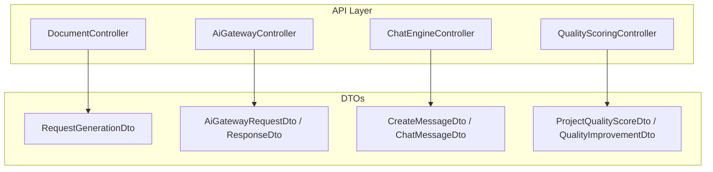
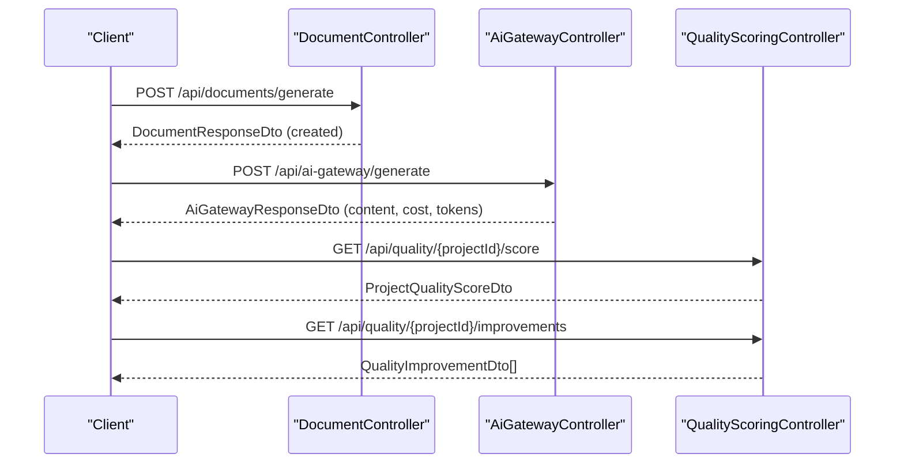
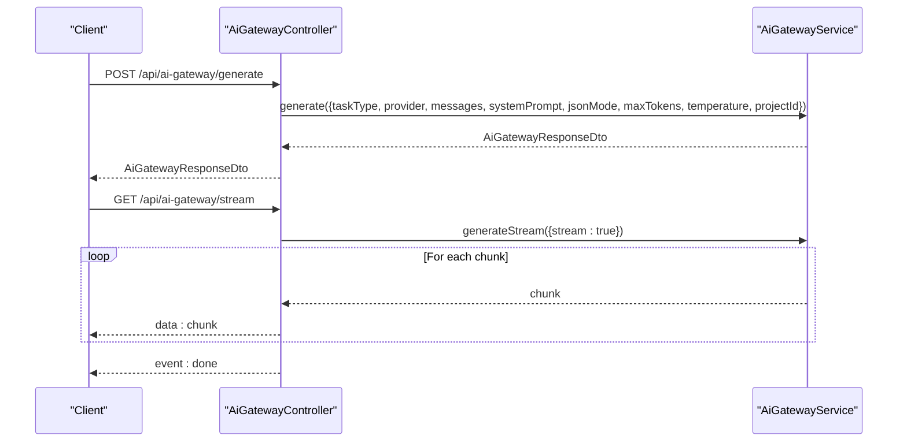
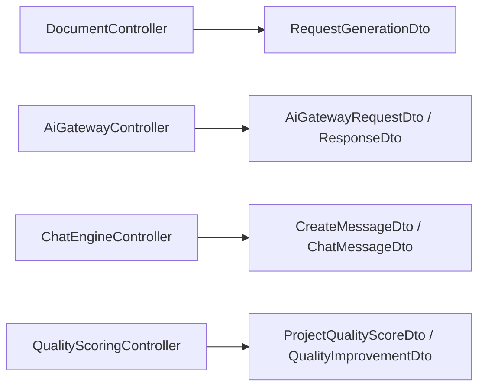

# AI Content Generation API

<cite>
**Referenced Files in This Document**
- [document.controller.ts](file://apps/api/src/modules/document-generator/controllers/document.controller.ts)
- [request-generation.dto.ts](file://apps/api/src/modules/document-generator/dto/request-generation.dto.ts)
- [ai-gateway.controller.ts](file://apps/api/src/modules/ai-gateway/ai-gateway.controller.ts)
- [ai-gateway.dto.ts](file://apps/api/src/modules/ai-gateway/dto/ai-gateway.dto.ts)
- [chat-engine.controller.ts](file://apps/api/src/modules/chat-engine/chat-engine.controller.ts)
- [chat-engine.dto.ts](file://apps/api/src/modules/chat-engine/dto/chat-engine.dto.ts)
- [quality-scoring.controller.ts](file://apps/api/src/modules/quality-scoring/quality-scoring.controller.ts)
- [quality-scoring.dto.ts](file://apps/api/src/modules/quality-scoring/dto/quality-scoring.dto.ts)
</cite>

## Table of Contents
1. [Introduction](#introduction)
2. [Project Structure](#project-structure)
3. [Core Components](#core-components)
4. [Architecture Overview](#architecture-overview)
5. [Detailed Component Analysis](#detailed-component-analysis)
6. [Dependency Analysis](#dependency-analysis)
7. [Performance Considerations](#performance-considerations)
8. [Troubleshooting Guide](#troubleshooting-guide)
9. [Conclusion](#conclusion)
10. [Appendices](#appendices)

## Introduction
This document describes the AI-assisted document content generation APIs and related services. It covers:
- Prompt engineering and content generation workflows via the AI Gateway
- Document generation orchestration and delivery
- Quality calibration and improvement suggestions
- Provider integration, cost tracking, and usage limits
- Style adaptation and content customization
- Validation, compliance, and governance controls

The APIs are protected by JWT authentication and expose both synchronous and streaming endpoints for real-time experiences.

## Project Structure
The AI content generation surface spans several modules:
- Document Generator: request document creation, list document types, manage downloads, and versioning
- AI Gateway: unified entry for chat, extraction, and generation tasks with provider selection and streaming
- Chat Engine: conversational AI with message lifecycle and streaming responses
- Quality Scoring: project quality metrics, completeness, confidence, and improvement suggestions

**Diagram sources**
- [document.controller.ts:35-278](file://apps/api/src/modules/document-generator/controllers/document.controller.ts#L35-L278)
- [ai-gateway.controller.ts:25-157](file://apps/api/src/modules/ai-gateway/ai-gateway.controller.ts#L25-L157)
- [chat-engine.controller.ts:19-130](file://apps/api/src/modules/chat-engine/chat-engine.controller.ts#L19-L130)
- [quality-scoring.controller.ts:15-183](file://apps/api/src/modules/quality-scoring/quality-scoring.controller.ts#L15-L183)
- [request-generation.dto.ts:1-28](file://apps/api/src/modules/document-generator/dto/request-generation.dto.ts#L1-L28)
- [ai-gateway.dto.ts:36-191](file://apps/api/src/modules/ai-gateway/dto/ai-gateway.dto.ts#L36-L191)
- [chat-engine.dto.ts:7-90](file://apps/api/src/modules/chat-engine/dto/chat-engine.dto.ts#L7-L90)
- [quality-scoring.dto.ts:49-100](file://apps/api/src/modules/quality-scoring/dto/quality-scoring.dto.ts#L49-L100)

**Section sources**
- [document.controller.ts:35-278](file://apps/api/src/modules/document-generator/controllers/document.controller.ts#L35-L278)
- [ai-gateway.controller.ts:25-157](file://apps/api/src/modules/ai-gateway/ai-gateway.controller.ts#L25-L157)
- [chat-engine.controller.ts:19-130](file://apps/api/src/modules/chat-engine/chat-engine.controller.ts#L19-L130)
- [quality-scoring.controller.ts:15-183](file://apps/api/src/modules/quality-scoring/quality-scoring.controller.ts#L15-L183)

## Core Components
- Document Generation API
  - Endpoint: POST /api/documents/generate
  - Purpose: Submit a generation request bound to a session and document type
  - Authentication: JWT required
  - Validation: Session UUID, document type UUID, optional output format (DOCX)
  - Response: Document metadata and status
- AI Gateway API
  - Endpoint: POST /api/ai-gateway/generate
  - Endpoint: GET /api/ai-gateway/stream
  - Purpose: Unified AI request routing supporting chat, extraction, and generation
  - Features: Provider selection, JSON mode, streaming, token limits, temperature, project context
  - Response: Content, provider/model, token usage, cost, latency, finish reason, fallback info
- Chat Engine API
  - Endpoint: POST /api/projects/{projectId}/messages
  - Endpoint: POST /api/projects/{projectId}/messages/stream
  - Purpose: Conversational AI with streaming responses and message limits
  - Response: Message metadata, token usage, latency
- Quality Scoring API
  - Endpoint: GET /api/quality/{projectId}/score
  - Endpoint: GET /api/quality/{projectId}/improvements
  - Endpoint: POST /api/quality/{projectId}/recalculate
  - Purpose: Compute and persist project quality metrics and improvement suggestions

**Section sources**
- [document.controller.ts:45-65](file://apps/api/src/modules/document-generator/controllers/document.controller.ts#L45-L65)
- [request-generation.dto.ts:4-27](file://apps/api/src/modules/document-generator/dto/request-generation.dto.ts#L4-L27)
- [ai-gateway.controller.ts:35-62](file://apps/api/src/modules/ai-gateway/ai-gateway.controller.ts#L35-L62)
- [ai-gateway.controller.ts:67-127](file://apps/api/src/modules/ai-gateway/ai-gateway.controller.ts#L67-L127)
- [ai-gateway.dto.ts:36-87](file://apps/api/src/modules/ai-gateway/dto/ai-gateway.dto.ts#L36-L87)
- [ai-gateway.dto.ts:123-159](file://apps/api/src/modules/ai-gateway/dto/ai-gateway.dto.ts#L123-L159)
- [chat-engine.controller.ts:56-67](file://apps/api/src/modules/chat-engine/chat-engine.controller.ts#L56-L67)
- [chat-engine.controller.ts:77-115](file://apps/api/src/modules/chat-engine/chat-engine.controller.ts#L77-L115)
- [chat-engine.dto.ts:7-16](file://apps/api/src/modules/chat-engine/dto/chat-engine.dto.ts#L7-L16)
- [chat-engine.dto.ts:21-48](file://apps/api/src/modules/chat-engine/dto/chat-engine.dto.ts#L21-L48)
- [quality-scoring.controller.ts:30-53](file://apps/api/src/modules/quality-scoring/quality-scoring.controller.ts#L30-L53)
- [quality-scoring.controller.ts:58-87](file://apps/api/src/modules/quality-scoring/quality-scoring.controller.ts#L58-L87)
- [quality-scoring.controller.ts:92-117](file://apps/api/src/modules/quality-scoring/quality-scoring.controller.ts#L92-L117)
- [quality-scoring.dto.ts:49-75](file://apps/api/src/modules/quality-scoring/dto/quality-scoring.dto.ts#L49-L75)
- [quality-scoring.dto.ts:77-99](file://apps/api/src/modules/quality-scoring/dto/quality-scoring.dto.ts#L77-L99)

## Architecture Overview
The AI content generation pipeline integrates controllers, DTOs, and provider-aware services. The AI Gateway centralizes provider selection and streaming, while the Document Generator coordinates document lifecycle and delivery.

**Diagram sources**
- [document.controller.ts:45-65](file://apps/api/src/modules/document-generator/controllers/document.controller.ts#L45-L65)
- [ai-gateway.controller.ts:35-62](file://apps/api/src/modules/ai-gateway/ai-gateway.controller.ts#L35-L62)
- [quality-scoring.controller.ts:30-53](file://apps/api/src/modules/quality-scoring/quality-scoring.controller.ts#L30-L53)
- [quality-scoring.controller.ts:58-87](file://apps/api/src/modules/quality-scoring/quality-scoring.controller.ts#L58-L87)

## Detailed Component Analysis

### Document Generation API
Endpoints:
- POST /api/documents/generate
  - Request: RequestGenerationDto (sessionId, documentTypeId, optional format)
  - Response: DocumentResponseDto with status, format, version, timestamps, and document type metadata
- GET /api/documents/types
  - Response: List of available document types
- GET /api/documents/session/{sessionId}/types
  - Response: Document types scoped to a session
- GET /api/documents/session/{sessionId}
  - Response: Documents for a session
- GET /api/documents/{id}
  - Response: Document details
- GET /api/documents/{id}/download?expiresIn=N
  - Response: Download URL with expiry
- GET /api/documents/session/{sessionId}/bulk-download
  - Response: ZIP stream of all session documents
- POST /api/documents/bulk-download
  - Response: ZIP stream of selected documents
- GET /api/documents/{id}/versions
  - Response: Version history
- GET /api/documents/{id}/versions/{version}/download
  - Response: Download URL for a specific version

Validation and behavior:
- UUID parsing for identifiers
- Optional expiresIn parameter for download URLs
- Bulk download limits enforced by service logic
- Version-specific download URLs

**Section sources**
- [document.controller.ts:45-65](file://apps/api/src/modules/document-generator/controllers/document.controller.ts#L45-L65)
- [document.controller.ts:67-92](file://apps/api/src/modules/document-generator/controllers/document.controller.ts#L67-L92)
- [document.controller.ts:94-105](file://apps/api/src/modules/document-generator/controllers/document.controller.ts#L94-L105)
- [document.controller.ts:107-117](file://apps/api/src/modules/document-generator/controllers/document.controller.ts#L107-L117)
- [document.controller.ts:119-141](file://apps/api/src/modules/document-generator/controllers/document.controller.ts#L119-L141)
- [document.controller.ts:143-162](file://apps/api/src/modules/document-generator/controllers/document.controller.ts#L143-L162)
- [document.controller.ts:164-197](file://apps/api/src/modules/document-generator/controllers/document.controller.ts#L164-L197)
- [document.controller.ts:199-226](file://apps/api/src/modules/document-generator/controllers/document.controller.ts#L199-L226)
- [request-generation.dto.ts:4-27](file://apps/api/src/modules/document-generator/dto/request-generation.dto.ts#L4-L27)

### AI Gateway API
Endpoints:
- POST /api/ai-gateway/generate
  - Request: AiGatewayRequestDto (taskType, provider, messages, systemPrompt, optional jsonMode, stream, maxTokens, temperature, projectId)
  - Response: AiGatewayResponseDto (content, provider, model, usage, cost, latency, finishReason, usedFallback, originalProvider)
- GET /api/ai-gateway/stream
  - Streaming response via Server-Sent Events (SSE)
  - Headers: Content-Type: text/event-stream; keep-alive semantics
  - Final event: done
- GET /api/ai-gateway/health
  - Response: GatewayHealthDto (status, provider statuses, timestamp)
- GET /api/ai-gateway/providers
  - Response: default provider and available providers

Key capabilities:
- Task routing: chat, extract, generate
- Provider selection: claude, openai, gemini
- Structured outputs: JSON mode
- Streaming: token-by-token SSE chunks
- Limits: maxTokens range validated
- Cost tracking: per-response cost and currency
- Fallback: usedFallback and originalProvider indicate provider failover

**Diagram sources**
- [ai-gateway.controller.ts:35-62](file://apps/api/src/modules/ai-gateway/ai-gateway.controller.ts#L35-L62)
- [ai-gateway.controller.ts:67-127](file://apps/api/src/modules/ai-gateway/ai-gateway.controller.ts#L67-L127)
- [ai-gateway.dto.ts:36-87](file://apps/api/src/modules/ai-gateway/dto/ai-gateway.dto.ts#L36-L87)
- [ai-gateway.dto.ts:123-159](file://apps/api/src/modules/ai-gateway/dto/ai-gateway.dto.ts#L123-L159)

**Section sources**
- [ai-gateway.controller.ts:35-62](file://apps/api/src/modules/ai-gateway/ai-gateway.controller.ts#L35-L62)
- [ai-gateway.controller.ts:67-127](file://apps/api/src/modules/ai-gateway/ai-gateway.controller.ts#L67-L127)
- [ai-gateway.controller.ts:132-155](file://apps/api/src/modules/ai-gateway/ai-gateway.controller.ts#L132-L155)
- [ai-gateway.dto.ts:36-87](file://apps/api/src/modules/ai-gateway/dto/ai-gateway.dto.ts#L36-L87)
- [ai-gateway.dto.ts:123-159](file://apps/api/src/modules/ai-gateway/dto/ai-gateway.dto.ts#L123-L159)
- [ai-gateway.dto.ts:181-190](file://apps/api/src/modules/ai-gateway/dto/ai-gateway.dto.ts#L181-L190)

### Chat Engine API
Endpoints:
- GET /api/projects/{projectId}/messages/status
  - Response: ChatStatusDto (messageCount, messageLimit, remainingMessages, limitReached, optional qualityScore)
- GET /api/projects/{projectId}/messages
  - Query: skip, take (min 1, max 100)
  - Response: ChatMessageDto[]
- POST /api/projects/{projectId}/messages
  - Request: CreateMessageDto (content, optional provider)
  - Response: ChatMessageDto
- POST /api/projects/{projectId}/messages/stream
  - Streaming SSE response of assistant replies
- GET /api/projects/{projectId}/messages/can-send
  - Response: Can send status and remaining count

Behavior:
- Message pagination and limits
- Provider preference override
- Streaming with done event

**Section sources**
- [chat-engine.controller.ts:31-37](file://apps/api/src/modules/chat-engine/chat-engine.controller.ts#L31-L37)
- [chat-engine.controller.ts:42-51](file://apps/api/src/modules/chat-engine/chat-engine.controller.ts#L42-L51)
- [chat-engine.controller.ts:56-67](file://apps/api/src/modules/chat-engine/chat-engine.controller.ts#L56-L67)
- [chat-engine.controller.ts:77-115](file://apps/api/src/modules/chat-engine/chat-engine.controller.ts#L77-L115)
- [chat-engine.controller.ts:120-128](file://apps/api/src/modules/chat-engine/chat-engine.controller.ts#L120-L128)
- [chat-engine.dto.ts:53-71](file://apps/api/src/modules/chat-engine/dto/chat-engine.dto.ts#L53-L71)
- [chat-engine.dto.ts:76-89](file://apps/api/src/modules/chat-engine/dto/chat-engine.dto.ts#L76-L89)

### Quality Scoring API
Endpoints:
- GET /api/quality/{projectId}/score
  - Response: ProjectQualityScoreDto (overallScore, completenessScore, confidenceScore, dimensionScores, recommendations, scoredAt)
- GET /api/quality/{projectId}/improvements
  - Response: QualityImprovementDto[] (dimensionId, dimensionName, currentScore, potentialScore, missingCriteria, suggestedQuestions)
- POST /api/quality/{projectId}/recalculate
  - Response: ProjectQualityScoreDto (saved to project)

Metrics:
- Overall, completeness, and confidence scores
- Dimension-level breakdown with weighted criteria
- Recommendations and scoredAt timestamp

**Section sources**
- [quality-scoring.controller.ts:30-53](file://apps/api/src/modules/quality-scoring/quality-scoring.controller.ts#L30-L53)
- [quality-scoring.controller.ts:58-87](file://apps/api/src/modules/quality-scoring/quality-scoring.controller.ts#L58-L87)
- [quality-scoring.controller.ts:92-117](file://apps/api/src/modules/quality-scoring/quality-scoring.controller.ts#L92-L117)
- [quality-scoring.dto.ts:49-75](file://apps/api/src/modules/quality-scoring/dto/quality-scoring.dto.ts#L49-L75)
- [quality-scoring.dto.ts:77-99](file://apps/api/src/modules/quality-scoring/dto/quality-scoring.dto.ts#L77-L99)

## Dependency Analysis
- Controllers depend on DTOs for input validation and output serialization
- AI Gateway controller delegates to a service for provider routing and streaming
- Document controller orchestrates document generation and download workflows
- Quality Scoring controller computes and persists scores based on project context

**Diagram sources**
- [document.controller.ts:35-278](file://apps/api/src/modules/document-generator/controllers/document.controller.ts#L35-L278)
- [ai-gateway.controller.ts:25-157](file://apps/api/src/modules/ai-gateway/ai-gateway.controller.ts#L25-L157)
- [chat-engine.controller.ts:19-130](file://apps/api/src/modules/chat-engine/chat-engine.controller.ts#L19-L130)
- [quality-scoring.controller.ts:15-183](file://apps/api/src/modules/quality-scoring/quality-scoring.controller.ts#L15-L183)
- [request-generation.dto.ts:1-28](file://apps/api/src/modules/document-generator/dto/request-generation.dto.ts#L1-L28)
- [ai-gateway.dto.ts:36-191](file://apps/api/src/modules/ai-gateway/dto/ai-gateway.dto.ts#L36-L191)
- [chat-engine.dto.ts:7-90](file://apps/api/src/modules/chat-engine/dto/chat-engine.dto.ts#L7-L90)
- [quality-scoring.dto.ts:49-100](file://apps/api/src/modules/quality-scoring/dto/quality-scoring.dto.ts#L49-L100)

**Section sources**
- [document.controller.ts:35-278](file://apps/api/src/modules/document-generator/controllers/document.controller.ts#L35-L278)
- [ai-gateway.controller.ts:25-157](file://apps/api/src/modules/ai-gateway/ai-gateway.controller.ts#L25-L157)
- [chat-engine.controller.ts:19-130](file://apps/api/src/modules/chat-engine/chat-engine.controller.ts#L19-L130)
- [quality-scoring.controller.ts:15-183](file://apps/api/src/modules/quality-scoring/quality-scoring.controller.ts#L15-L183)

## Performance Considerations
- Streaming responses reduce perceived latency and enable real-time feedback
- Token and temperature parameters control output length and randomness
- Provider health checks and fallbacks improve reliability
- Pagination and limits prevent excessive memory usage in message lists
- Cost and token usage reporting supports budget-aware consumption

## Troubleshooting Guide
Common issues and resolutions:
- Bad request errors (HTTP 400)
  - Validate UUIDs and numeric ranges (e.g., maxTokens)
  - Ensure required fields are present in requests
- Internal server errors (HTTP 500)
  - Inspect AI provider availability and network connectivity
  - Review SSE streaming termination and client disconnect handling
- Download URL expiration
  - Adjust expiresIn parameter or regenerate URL
- Message limits reached
  - Check remainingMessages and qualityScore context
- Quality score not available
  - Start a conversation to build project profile; empty score response indicates no project data

**Section sources**
- [ai-gateway.controller.ts:53-62](file://apps/api/src/modules/ai-gateway/ai-gateway.controller.ts#L53-L62)
- [ai-gateway.controller.ts:113-127](file://apps/api/src/modules/ai-gateway/ai-gateway.controller.ts#L113-L127)
- [chat-engine.controller.ts:60-61](file://apps/api/src/modules/chat-engine/chat-engine.controller.ts#L60-L61)
- [chat-engine.controller.ts:126-128](file://apps/api/src/modules/chat-engine/chat-engine.controller.ts#L126-L128)
- [quality-scoring.controller.ts:171-181](file://apps/api/src/modules/quality-scoring/quality-scoring.controller.ts#L171-L181)

## Conclusion
The AI Content Generation API provides a cohesive set of endpoints for prompt engineering, document generation, quality calibration, and provider-agnostic AI orchestration. With streaming, cost tracking, and governance-aligned controls, it enables scalable, compliant, and high-quality content creation workflows.

## Appendices

### API Definitions

- POST /api/documents/generate
  - Request: RequestGenerationDto
  - Responses: 201 DocumentResponseDto, 400 invalid session or missing questions, 404 session or document type not found
- GET /api/documents/types
  - Responses: 200 List of DocumentTypeResponseDto
- GET /api/documents/session/{sessionId}/types
  - Responses: 200 List of DocumentTypeResponseDto, 404 session not found
- GET /api/documents/session/{sessionId}
  - Responses: 200 List of DocumentResponseDto, 404 session not found
- GET /api/documents/{id}
  - Responses: 200 DocumentResponseDto, 404 document not found
- GET /api/documents/{id}/download?expiresIn=N
  - Responses: 200 DownloadUrlResponseDto, 400 document not available, 404 document not found
- GET /api/documents/session/{sessionId}/bulk-download
  - Responses: 200 ZIP stream, 400 no documents available, 404 session not found
- POST /api/documents/bulk-download
  - Responses: 200 ZIP stream, 400 no documents selected or max exceeded
- GET /api/documents/{id}/versions
  - Responses: 200 List of DocumentResponseDto
- GET /api/documents/{id}/versions/{version}/download
  - Responses: 200 DownloadUrlResponseDto, 404 version not found, 400 version not available

- POST /api/ai-gateway/generate
  - Request: AiGatewayRequestDto
  - Responses: 200 AiGatewayResponseDto, 400 bad request, 500 AI generation failed
- GET /api/ai-gateway/stream
  - Responses: 200 SSE stream of chunks, 400 bad request, 500 stream failed
- GET /api/ai-gateway/health
  - Responses: 200 GatewayHealthDto
- GET /api/ai-gateway/providers
  - Responses: 200 { default: string, available: string[] }

- GET /api/projects/{projectId}/messages/status
  - Responses: 200 ChatStatusDto
- GET /api/projects/{projectId}/messages
  - Query: skip, take
  - Responses: 200 ChatMessageDto[]
- POST /api/projects/{projectId}/messages
  - Request: CreateMessageDto
  - Responses: 201 ChatMessageDto, 400 message limit reached
- POST /api/projects/{projectId}/messages/stream
  - Request: CreateMessageDto
  - Responses: 200 SSE stream, 400 message limit reached
- GET /api/projects/{projectId}/messages/can-send
  - Responses: 200 { canSend: boolean, remaining: number, message?: string }

- GET /api/quality/{projectId}/score
  - Responses: 200 ProjectQualityScoreDto
- GET /api/quality/{projectId}/improvements
  - Responses: 200 QualityImprovementDto[]
- POST /api/quality/{projectId}/recalculate
  - Responses: 200 ProjectQualityScoreDto

### Parameter Tuning Examples
- Temperature and maxTokens
  - Lower temperature for deterministic outputs; higher for creativity
  - Cap maxTokens to control cost and latency
- JSON mode
  - Enable for structured outputs to simplify downstream parsing
- Provider selection
  - Choose provider based on latency, availability, and content safety requirements
- Streaming
  - Use SSE for real-time user feedback and progressive disclosure

### Output Formatting
- Document generation
  - Output format controlled by optional format parameter (e.g., DOCX)
  - Versioning and download URLs support archival and distribution
- AI Gateway
  - Content returned as string; cost and token usage included for transparency
- Chat Engine
  - Messages include role, content, provider, token usage, and latency

### Governance and Compliance
- Authentication
  - All endpoints protected by JWT
- Provider switching and fallback
  - Health endpoint reports provider availability; fallback indicated in response
- Cost tracking and usage limits
  - Per-request cost and token usage; provider health informs capacity planning
- Content customization and style adaptation
  - System prompts and provider selection tailor content to domain and tone
- Validation and error handling
  - Strict DTO validation and explicit error responses guide clients