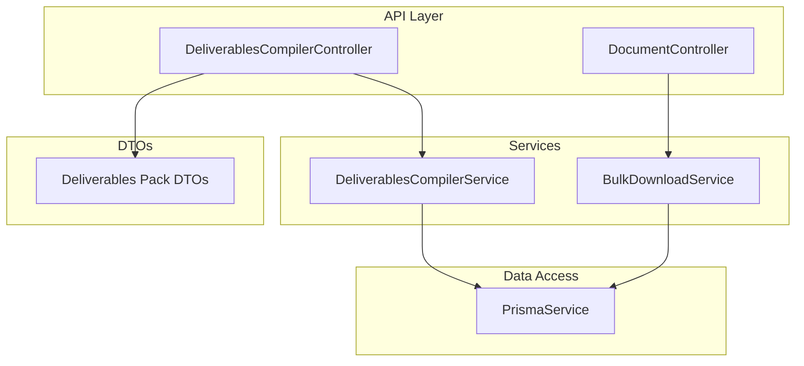
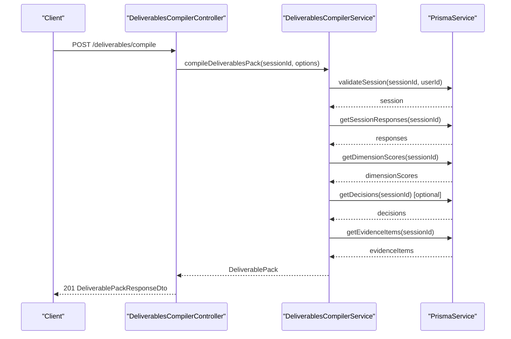
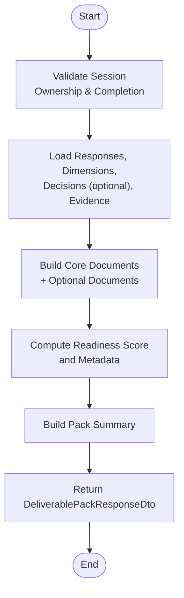
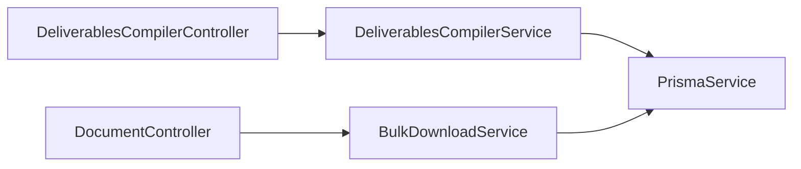

# Document Compilation API

<cite>
**Referenced Files in This Document**
- [deliverables-compiler.controller.ts](file://apps/api/src/modules/document-generator/controllers/deliverables-compiler.controller.ts)
- [deliverables-pack.dto.ts](file://apps/api/src/modules/document-generator/dto/deliverables-pack.dto.ts)
- [deliverables-compiler.service.ts](file://apps/api/src/modules/document-generator/services/deliverables-compiler.service.ts)
- [compiler-types.ts](file://apps/api/src/modules/document-generator/services/compiler-types.ts)
- [bulk-download.service.ts](file://apps/api/src/modules/document-generator/services/bulk-download.service.ts)
- [document.controller.ts](file://apps/api/src/modules/document-generator/controllers/document.controller.ts)
- [document-generator.module.ts](file://apps/api/src/modules/document-generator/document-generator.module.ts)
- [document-purchase.service.ts](file://apps/api/src/modules/document-commerce/services/document-purchase.service.ts)
- [documentCommerce.ts](file://apps/web/src/api/documentCommerce.ts)
</cite>

## Table of Contents
1. [Introduction](#introduction)
2. [Project Structure](#project-structure)
3. [Core Components](#core-components)
4. [Architecture Overview](#architecture-overview)
5. [Detailed Component Analysis](#detailed-component-analysis)
6. [Dependency Analysis](#dependency-analysis)
7. [Performance Considerations](#performance-considerations)
8. [Troubleshooting Guide](#troubleshooting-guide)
9. [Conclusion](#conclusion)
10. [Appendices](#appendices)

## Introduction
This document describes the Document Compilation API focused on deliverables pack compilation, multi-document packaging, and batch processing capabilities. It covers compilation job management, progress tracking, completion notifications, queue management, priority handling, error recovery, parameter validation, result retrieval, status monitoring, retry policies, administrative controls, and performance optimization.

## Project Structure
The deliverables compilation feature resides in the Document Generator module. The primary entry points are:
- Deliverables Compiler Controller: exposes endpoints for compiling deliverables packs, exporting individual documents, and retrieving pack summaries.
- Deliverables Compiler Service: orchestrates compilation by fetching session data and invoking specialized section builders.
- DTOs: define request/response schemas for compilation requests and pack responses.
- Bulk Download Service: supports batch downloads of generated documents via ZIP archives.
- Document Controller: provides document lifecycle APIs (generation, listing, download URLs) complementary to deliverables compilation.

**Diagram sources**
- [deliverables-compiler.controller.ts:30-256](file://apps/api/src/modules/document-generator/controllers/deliverables-compiler.controller.ts#L30-L256)
- [deliverables-compiler.service.ts:47-210](file://apps/api/src/modules/document-generator/services/deliverables-compiler.service.ts#L47-L210)
- [bulk-download.service.ts:17-267](file://apps/api/src/modules/document-generator/services/bulk-download.service.ts#L17-L267)
- [document.controller.ts:35-278](file://apps/api/src/modules/document-generator/controllers/document.controller.ts#L35-L278)
- [deliverables-pack.dto.ts:1-180](file://apps/api/src/modules/document-generator/dto/deliverables-pack.dto.ts#L1-L180)

**Section sources**
- [document-generator.module.ts:1-46](file://apps/api/src/modules/document-generator/document-generator.module.ts#L1-L46)
- [deliverables-compiler.controller.ts:30-256](file://apps/api/src/modules/document-generator/controllers/deliverables-compiler.controller.ts#L30-L256)
- [deliverables-compiler.service.ts:47-210](file://apps/api/src/modules/document-generator/services/deliverables-compiler.service.ts#L47-L210)
- [bulk-download.service.ts:17-267](file://apps/api/src/modules/document-generator/services/bulk-download.service.ts#L17-L267)
- [document.controller.ts:35-278](file://apps/api/src/modules/document-generator/controllers/document.controller.ts#L35-L278)

## Core Components
- Deliverables Compiler Controller: Provides endpoints to compile a full deliverables pack, retrieve specific documents by category, export the pack as JSON, and fetch summaries and categories.
- Deliverables Compiler Service: Validates session eligibility, aggregates responses and evidence, builds documents, computes readiness scores, and constructs the deliverables pack.
- DTOs: Define request validation and response schemas for compilation requests and pack responses.
- Bulk Download Service: Creates ZIP archives for session or selected documents, streaming content and handling partial failures.
- Document Controller: Manages document generation lifecycle and bulk downloads for individual documents.

**Section sources**
- [deliverables-compiler.controller.ts:30-256](file://apps/api/src/modules/document-generator/controllers/deliverables-compiler.controller.ts#L30-L256)
- [deliverables-compiler.service.ts:47-210](file://apps/api/src/modules/document-generator/services/deliverables-compiler.service.ts#L47-L210)
- [deliverables-pack.dto.ts:1-180](file://apps/api/src/modules/document-generator/dto/deliverables-pack.dto.ts#L1-L180)
- [bulk-download.service.ts:17-267](file://apps/api/src/modules/document-generator/services/bulk-download.service.ts#L17-L267)
- [document.controller.ts:35-278](file://apps/api/src/modules/document-generator/controllers/document.controller.ts#L35-L278)

## Architecture Overview
The deliverables compilation pipeline integrates with session data and optional governance/evidence data to produce a structured pack of documents. The service validates session state and delegates document construction to specialized builders. Results can be streamed as JSON or downloaded individually.

**Diagram sources**
- [deliverables-compiler.controller.ts:49-60](file://apps/api/src/modules/document-generator/controllers/deliverables-compiler.controller.ts#L49-L60)
- [deliverables-compiler.service.ts:56-137](file://apps/api/src/modules/document-generator/services/deliverables-compiler.service.ts#L56-L137)

## Detailed Component Analysis

### Deliverables Compiler Controller
Endpoints:
- POST /deliverables/compile: Compiles a full deliverables pack for a session with configurable options.
- GET /deliverables/session/{sessionId}/document/{category}: Retrieves a single document by category from the compiled pack.
- GET /deliverables/session/{sessionId}/export/json: Exports the entire pack as JSON.
- GET /deliverables/session/{sessionId}/summary: Returns pack summary and metadata without full content.
- GET /deliverables/categories: Lists available document categories and descriptions.
- GET /deliverables/session/{sessionId}/decision-log: Retrieves the decision log document.
- GET /deliverables/session/{sessionId}/readiness-report: Retrieves the readiness report document.

Validation and behavior:
- Authentication: Requires JWT bearer token.
- Authorization: Validates session ownership and completion status.
- Options: includeDecisionLog, includeReadinessReport, includePolicyPack, autoSection, maxWordsPerSection.
- Error handling: Throws appropriate exceptions for invalid sessions, missing data, or unauthorized access.

**Section sources**
- [deliverables-compiler.controller.ts:30-256](file://apps/api/src/modules/document-generator/controllers/deliverables-compiler.controller.ts#L30-L256)

### Deliverables Compiler Service
Responsibilities:
- Validates session ownership and completion status.
- Loads responses, dimensions, decisions (optional), and evidence items.
- Builds documents in a predefined order and optionally adds optional documents.
- Computes readiness score and pack metadata.
- Returns a structured deliverables pack with summary and metadata.

Processing logic highlights:
- Parallel data loading for performance.
- Conditional inclusion of optional documents.
- Word-count and sectioning logic integrated via builder functions.

**Section sources**
- [deliverables-compiler.service.ts:47-210](file://apps/api/src/modules/document-generator/services/deliverables-compiler.service.ts#L47-L210)
- [compiler-types.ts:1-138](file://apps/api/src/modules/document-generator/services/compiler-types.ts#L1-L138)

### DTOs and Validation
Request DTO:
- CompileDeliverablesDto: Includes sessionId, booleans for optional documents, autoSection flag, and maxWordsPerSection with min/max constraints.

Response DTOs:
- CompiledDocumentDto: Document identity, title, category, sections, counts, and generation timestamp.
- DeliverablePackResponseDto: Complete pack with documents, summary, readiness score, and metadata.
- ExportUrlResponseDto: Secure download URL with expiration and format metadata.

Validation rules:
- UUID validation for sessionId.
- Boolean toggles for optional documents.
- Numeric bounds for maxWordsPerSection.

**Section sources**
- [deliverables-pack.dto.ts:10-45](file://apps/api/src/modules/document-generator/dto/deliverables-pack.dto.ts#L10-L45)
- [deliverables-pack.dto.ts:67-160](file://apps/api/src/modules/document-generator/dto/deliverables-pack.dto.ts#L67-L160)

### Bulk Download Service
Capabilities:
- Create ZIP archives for all documents in a session or a selected subset.
- Stream ZIP content to clients.
- Generate unique filenames and estimate total size.
- Gracefully continue despite individual fetch failures.

Constraints:
- Maximum 50 documents per selection download.
- Requires completed documents.

**Section sources**
- [bulk-download.service.ts:17-267](file://apps/api/src/modules/document-generator/services/bulk-download.service.ts#L17-L267)

### Document Controller (Complementary APIs)
Endpoints:
- POST /documents/generate: Requests generation of a single document for a session.
- GET /documents/session/{sessionId}/bulk-download: Streams a ZIP of all completed session documents.
- POST /documents/bulk-download: Streams a ZIP of selected document IDs.
- GET /documents/{id}/download: Issues secure download URLs with optional expiration.

Integration:
- Works alongside deliverables compilation for single-document workflows.
- Supports administrative and user-triggered downloads.

**Section sources**
- [document.controller.ts:35-278](file://apps/api/src/modules/document-generator/controllers/document.controller.ts#L35-L278)

### Compilation Workflows and Batch Processing
- Single-pack compilation: POST /deliverables/compile returns a complete deliverables pack.
- Individual document retrieval: GET /deliverables/session/{sessionId}/document/{category}.
- Full pack export: GET /deliverables/session/{sessionId}/export/json.
- Batch downloads: 
  - Session-wide: GET /documents/session/{sessionId}/bulk-download
  - Selected documents: POST /documents/bulk-download with documentIds array

**Diagram sources**
- [deliverables-compiler.service.ts:56-137](file://apps/api/src/modules/document-generator/services/deliverables-compiler.service.ts#L56-L137)

## Dependency Analysis
- Controller depends on DeliverablesCompilerService for orchestration.
- Service depends on PrismaService for data access and builder functions for document construction.
- BulkDownloadService also depends on PrismaService for document metadata and storage URLs.
- DocumentController complements deliverables compilation with single-document workflows.

**Diagram sources**
- [deliverables-compiler.controller.ts:30-256](file://apps/api/src/modules/document-generator/controllers/deliverables-compiler.controller.ts#L30-L256)
- [deliverables-compiler.service.ts:47-210](file://apps/api/src/modules/document-generator/services/deliverables-compiler.service.ts#L47-L210)
- [bulk-download.service.ts:17-267](file://apps/api/src/modules/document-generator/services/bulk-download.service.ts#L17-L267)
- [document.controller.ts:35-278](file://apps/api/src/modules/document-generator/controllers/document.controller.ts#L35-L278)

**Section sources**
- [document-generator.module.ts:19-46](file://apps/api/src/modules/document-generator/document-generator.module.ts#L19-L46)

## Performance Considerations
- Parallel data loading: The service loads responses, dimensions, decisions, and evidence concurrently to reduce latency.
- Auto-sectioning: Limits section size to improve readability and manageability.
- Streaming ZIP creation: Bulk downloads stream content to avoid large memory footprints.
- Selective inclusion: Optional documents are conditionally included to minimize processing overhead.

[No sources needed since this section provides general guidance]

## Troubleshooting Guide
Common issues and resolutions:
- Session not found or access denied: Ensure the sessionId belongs to the authenticated user and the session status is completed.
- No documents available for bulk download: Verify that documents exist and are in COMPLETED status.
- Invalid options: Confirm maxWordsPerSection is within allowed bounds and options are boolean-typed.
- Partial failures during ZIP creation: The service logs warnings and continues with remaining documents.

Administrative controls:
- Category listing endpoint helps users discover available documents.
- Summary endpoint enables quick inspection without downloading full content.

**Section sources**
- [deliverables-compiler.service.ts:141-160](file://apps/api/src/modules/document-generator/services/deliverables-compiler.service.ts#L141-L160)
- [bulk-download.service.ts:29-114](file://apps/api/src/modules/document-generator/services/bulk-download.service.ts#L29-L114)
- [deliverables-compiler.controller.ts:173-204](file://apps/api/src/modules/document-generator/controllers/deliverables-compiler.controller.ts#L173-L204)

## Conclusion
The Document Compilation API provides robust endpoints for compiling deliverables packs, exporting individual documents, and performing batch downloads. It enforces strict validation, supports optional components, and offers streaming capabilities for efficient resource usage. Administrators and users can monitor and manage compilation outcomes through summaries, categories, and download URLs.

[No sources needed since this section summarizes without analyzing specific files]

## Appendices

### API Endpoints Reference

- POST /deliverables/compile
  - Description: Compile deliverables pack for a session.
  - Auth: Required (JWT).
  - Request: CompileDeliverablesDto.
  - Responses: 201 DeliverablePackResponseDto, 400 on invalid options or incomplete session, 404 if session not found.

- GET /deliverables/session/{sessionId}/document/{category}
  - Description: Retrieve a specific document by category from the compiled pack.
  - Auth: Required (JWT).
  - Responses: 200 CompiledDocumentDto, 404 if not found.

- GET /deliverables/session/{sessionId}/export/json
  - Description: Export the complete deliverables pack as JSON.
  - Auth: Required (JWT).
  - Responses: 200 StreamableFile (JSON), 404 if session not found.

- GET /deliverables/session/{sessionId}/summary
  - Description: Retrieve pack summary and metadata.
  - Auth: Required (JWT).
  - Responses: 200 with summary, metadata, readiness score, and document titles.

- GET /deliverables/categories
  - Description: List available document categories and descriptions.
  - Auth: Required (JWT).
  - Responses: 200 with categories and descriptions.

- GET /deliverables/session/{sessionId}/decision-log
  - Description: Export decision log document.
  - Auth: Required (JWT).
  - Responses: 200 CompiledDocumentDto or null.

- GET /deliverables/session/{sessionId}/readiness-report
  - Description: Get readiness report document.
  - Auth: Required (JWT).
  - Responses: 200 CompiledDocumentDto or null.

- GET /documents/session/{sessionId}/bulk-download
  - Description: Download all session documents as ZIP.
  - Auth: Required (JWT).
  - Responses: 200 StreamableFile (ZIP), 400 if none available, 404 if session not found.

- POST /documents/bulk-download
  - Description: Download selected documents as ZIP.
  - Auth: Required (JWT).
  - Request: { documentIds: string[] } with up to 50 IDs.
  - Responses: 200 StreamableFile (ZIP), 400 if selection invalid, 404 if not found.

**Section sources**
- [deliverables-compiler.controller.ts:36-255](file://apps/api/src/modules/document-generator/controllers/deliverables-compiler.controller.ts#L36-L255)
- [document.controller.ts:143-197](file://apps/api/src/modules/document-generator/controllers/document.controller.ts#L143-L197)

### Compilation Job Management and Progress Tracking
- Job initiation: POST /deliverables/compile starts compilation asynchronously and returns the deliverables pack.
- Progress: Not applicable for single-pack compilation; results are returned immediately upon completion.
- Completion notifications: Clients receive the deliverables pack directly; no separate polling endpoint is exposed.

**Section sources**
- [deliverables-compiler.controller.ts:36-60](file://apps/api/src/modules/document-generator/controllers/deliverables-compiler.controller.ts#L36-L60)
- [deliverables-compiler.service.ts:56-137](file://apps/api/src/modules/document-generator/services/deliverables-compiler.service.ts#L56-L137)

### Queue Management, Priority Handling, and Error Recovery
- Queue management: No explicit queue is implemented in the referenced code; compilation runs synchronously.
- Priority handling: Not implemented in the referenced code.
- Error recovery: 
  - Session validation throws explicit errors for missing or unauthorized sessions.
  - Bulk download continues despite individual document fetch failures.

**Section sources**
- [deliverables-compiler.service.ts:141-160](file://apps/api/src/modules/document-generator/services/deliverables-compiler.service.ts#L141-L160)
- [bulk-download.service.ts:99-102](file://apps/api/src/modules/document-generator/services/bulk-download.service.ts#L99-L102)

### Parameter Validation Examples
- CompileDeliverablesDto:
  - sessionId: UUID string.
  - includeDecisionLog: boolean (optional).
  - includeReadinessReport: boolean (optional).
  - includePolicyPack: boolean (optional).
  - autoSection: boolean (optional).
  - maxWordsPerSection: number between 100 and 2000 (optional).

**Section sources**
- [deliverables-pack.dto.ts:10-45](file://apps/api/src/modules/document-generator/dto/deliverables-pack.dto.ts#L10-L45)

### Result Retrieval Patterns
- JSON export: GET /deliverables/session/{sessionId}/export/json returns a downloadable JSON file.
- Individual document retrieval: GET /deliverables/session/{sessionId}/document/{category} returns a single document.
- Summary and categories: GET /deliverables/session/{sessionId}/summary and GET /deliverables/categories provide lightweight introspection.

**Section sources**
- [deliverables-compiler.controller.ts:107-204](file://apps/api/src/modules/document-generator/controllers/deliverables-compiler.controller.ts#L107-L204)

### Status Monitoring, Retry Policies, and Administrative Controls
- Status monitoring: 
  - Session completion is validated before compilation.
  - Bulk download returns counts via response headers.
- Retry policies: Not implemented in the referenced code.
- Administrative controls:
  - Category enumeration aids discovery.
  - Summary endpoint enables quick assessment without downloading full content.

**Section sources**
- [deliverables-compiler.service.ts:141-160](file://apps/api/src/modules/document-generator/services/deliverables-compiler.service.ts#L141-L160)
- [deliverables-compiler.controller.ts:141-168](file://apps/api/src/modules/document-generator/controllers/deliverables-compiler.controller.ts#L141-L168)

### Administrative Controls and Web Client Integration
- Web client functions:
  - getProjectDocuments, createPurchase, getPurchaseStatus, getUserPurchases integrate with commerce flows.
- These functions support purchase-driven generation triggers and status checks.

**Section sources**
- [documentCommerce.ts:97-134](file://apps/web/src/api/documentCommerce.ts#L97-L134)
- [document-purchase.service.ts:231-251](file://apps/api/src/modules/document-commerce/services/document-purchase.service.ts#L231-L251)