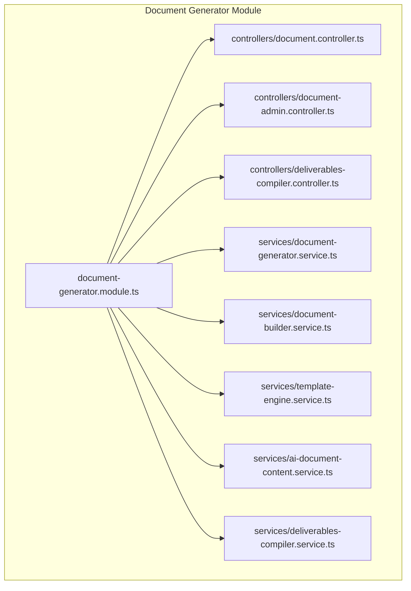
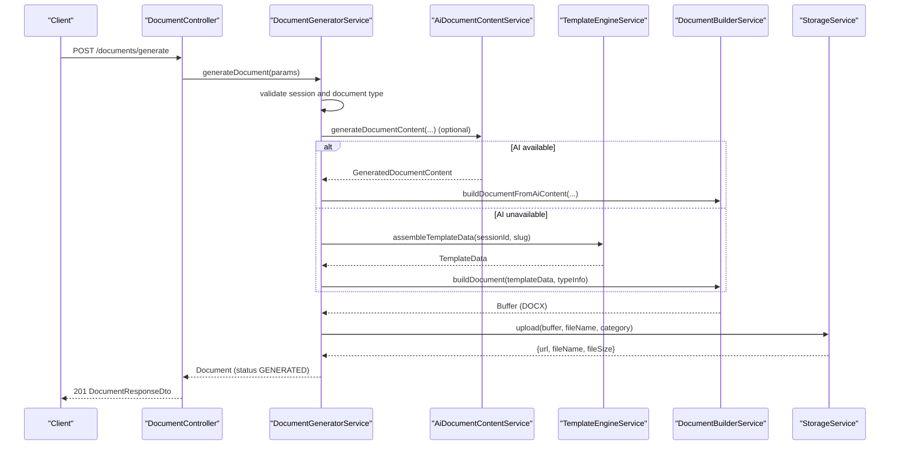
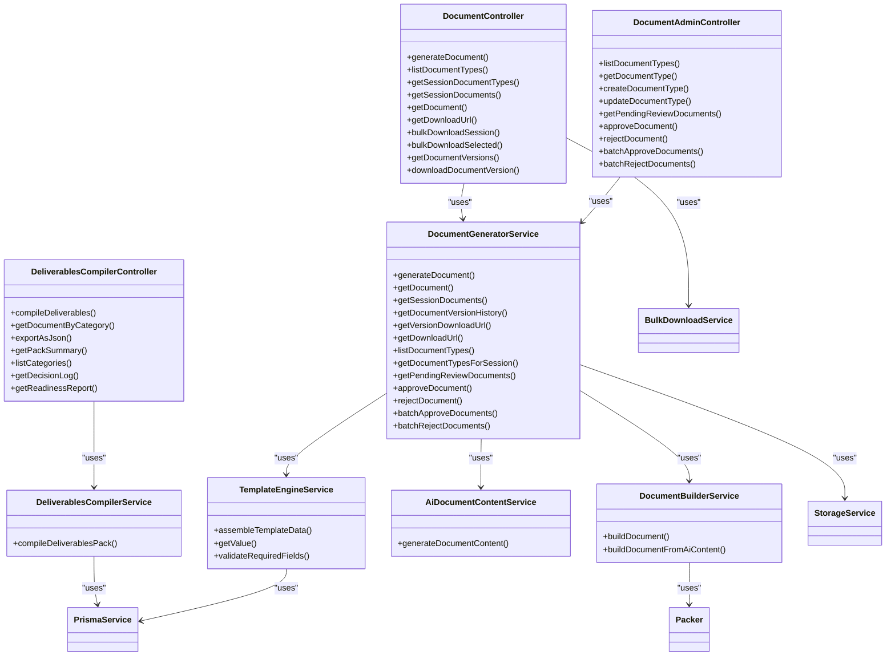

# Document Generation API

<cite>
**Referenced Files in This Document**
- [document-generator.module.ts](file://apps/api/src/modules/document-generator/document-generator.module.ts)
- [document.controller.ts](file://apps/api/src/modules/document-generator/controllers/document.controller.ts)
- [document-admin.controller.ts](file://apps/api/src/modules/document-generator/controllers/document-admin.controller.ts)
- [deliverables-compiler.controller.ts](file://apps/api/src/modules/document-generator/controllers/deliverables-compiler.controller.ts)
- [document-generator.service.ts](file://apps/api/src/modules/document-generator/services/document-generator.service.ts)
- [document-builder.service.ts](file://apps/api/src/modules/document-generator/services/document-builder.service.ts)
- [template-engine.service.ts](file://apps/api/src/modules/document-generator/services/template-engine.service.ts)
- [ai-document-content.service.ts](file://apps/api/src/modules/document-generator/services/ai-document-content.service.ts)
- [deliverables-compiler.service.ts](file://apps/api/src/modules/document-generator/services/deliverables-compiler.service.ts)
- [index.ts](file://apps/api/src/modules/document-generator/dto/index.ts)
</cite>

## Table of Contents
1. [Introduction](#introduction)
2. [Project Structure](#project-structure)
3. [Core Components](#core-components)
4. [Architecture Overview](#architecture-overview)
5. [Detailed Component Analysis](#detailed-component-analysis)
6. [Dependency Analysis](#dependency-analysis)
7. [Performance Considerations](#performance-considerations)
8. [Troubleshooting Guide](#troubleshooting-guide)
9. [Conclusion](#conclusion)
10. [Appendices](#appendices)

## Introduction
This document provides comprehensive API documentation for Quiz-to-Build’s document generation system. It covers:
- Template management APIs for document types
- Document compilation endpoints and multi-format export capabilities
- AI-assisted content generation and fallback mechanisms
- Quality calibration services and bulk document processing
- Deliverables compilation APIs for the Quiz2Biz pack
- Document versioning and review workflow integration
- Template engine APIs, custom template creation, and styling options
- Examples of generation requests, progress tracking, and completion notifications
- Document quality assurance, validation rules, and error handling
- Webhook endpoints for document generation status updates and administrative document management

## Project Structure
The document generation feature is implemented as a NestJS module with dedicated controllers, services, DTOs, and template utilities.

**Diagram sources**
- [document-generator.module.ts:19-46](file://apps/api/src/modules/document-generator/document-generator.module.ts#L19-L46)
- [document.controller.ts:35-39](file://apps/api/src/modules/document-generator/controllers/document.controller.ts#L35-L39)
- [document-admin.controller.ts:30-34](file://apps/api/src/modules/document-generator/controllers/document-admin.controller.ts#L30-L34)
- [deliverables-compiler.controller.ts:26-30](file://apps/api/src/modules/document-generator/controllers/deliverables-compiler.controller.ts#L26-L30)
- [document-generator.service.ts:22-32](file://apps/api/src/modules/document-generator/services/document-generator.service.ts#L22-L32)
- [document-builder.service.ts:28-30](file://apps/api/src/modules/document-generator/services/document-builder.service.ts#L28-L30)
- [template-engine.service.ts:26-30](file://apps/api/src/modules/document-generator/services/template-engine.service.ts#L26-L30)
- [ai-document-content.service.ts:59-70](file://apps/api/src/modules/document-generator/services/ai-document-content.service.ts#L59-L70)
- [deliverables-compiler.service.ts:47-51](file://apps/api/src/modules/document-generator/services/deliverables-compiler.service.ts#L47-L51)

**Section sources**
- [document-generator.module.ts:1-47](file://apps/api/src/modules/document-generator/document-generator.module.ts#L1-L47)

## Core Components
- Controllers expose REST endpoints for document generation, admin management, and deliverables compilation.
- Services orchestrate generation, template assembly, AI content generation, document building, and deliverables compilation.
- DTOs define request/response shapes for clients.
- Template engine and builder services handle legacy template-based generation and AI-driven content rendering.

Key responsibilities:
- DocumentController: generation, listing, downloads, bulk downloads, versions, and version downloads
- DocumentAdminController: document type CRUD, review workflow (approve/reject), and batch operations
- DeliverablesCompilerController: deliverables pack compilation, category retrieval, JSON export, summaries, and optional documents
- DocumentGeneratorService: validates sessions, checks required questions, creates documents, triggers generation, handles failures, and notifies users
- TemplateEngineService: maps session responses to structured content for templates
- DocumentBuilderService: constructs DOCX documents from template data or AI content
- AiDocumentContentService: generates structured content via Claude with fallbacks
- DeliverablesCompilerService: compiles the Quiz2Biz deliverables pack from session data

**Section sources**
- [document.controller.ts:39-278](file://apps/api/src/modules/document-generator/controllers/document.controller.ts#L39-L278)
- [document-admin.controller.ts:34-265](file://apps/api/src/modules/document-generator/controllers/document-admin.controller.ts#L34-L265)
- [deliverables-compiler.controller.ts:30-256](file://apps/api/src/modules/document-generator/controllers/deliverables-compiler.controller.ts#L30-L256)
- [document-generator.service.ts:22-609](file://apps/api/src/modules/document-generator/services/document-generator.service.ts#L22-L609)
- [template-engine.service.ts:26-318](file://apps/api/src/modules/document-generator/services/template-engine.service.ts#L26-L318)
- [document-builder.service.ts:28-539](file://apps/api/src/modules/document-generator/services/document-builder.service.ts#L28-L539)
- [ai-document-content.service.ts:59-359](file://apps/api/src/modules/document-generator/services/ai-document-content.service.ts#L59-L359)
- [deliverables-compiler.service.ts:47-210](file://apps/api/src/modules/document-generator/services/deliverables-compiler.service.ts#L47-L210)

## Architecture Overview
High-level flow for document generation and deliverables compilation:

**Diagram sources**
- [document.controller.ts:45-65](file://apps/api/src/modules/document-generator/controllers/document.controller.ts#L45-L65)
- [document-generator.service.ts:37-136](file://apps/api/src/modules/document-generator/services/document-generator.service.ts#L37-L136)
- [ai-document-content.service.ts:94-110](file://apps/api/src/modules/document-generator/services/ai-document-content.service.ts#L94-L110)
- [template-engine.service.ts:44-103](file://apps/api/src/modules/document-generator/services/template-engine.service.ts#L44-L103)
- [document-builder.service.ts:75-124](file://apps/api/src/modules/document-generator/services/document-builder.service.ts#L75-L124)

## Detailed Component Analysis

### Document Generation Endpoints
- Authentication: All endpoints require JWT bearer authentication.
- Authorization: Users can only access their own sessions and documents.

Endpoints:
- POST /documents/generate
  - Purpose: Request document generation for a completed session and document type.
  - Validation: Session must be COMPLETED; user must own the session; document type must exist and be active; required questions must be answered.
  - Response: DocumentResponseDto with status PENDING -> GENERATED.
  - Errors: 400 for incomplete session or missing required questions; 404 for not found.

- GET /documents/types
  - Purpose: List all active document types.
  - Response: Array of DocumentTypeResponseDto.

- GET /documents/session/{sessionId}/types
  - Purpose: List document types scoped to the session’s project type.
  - Response: Array of DocumentTypeResponseDto.

- GET /documents/session/{sessionId}
  - Purpose: List all documents for a session owned by the user.
  - Response: Array of DocumentResponseDto.

- GET /documents/{id}
  - Purpose: Get document details by ID.
  - Response: DocumentResponseDto.

- GET /documents/{id}/download
  - Purpose: Get a secure pre-signed download URL for the generated document.
  - Query: expiresIn (minutes, default 60).
  - Response: DownloadUrlResponseDto with url and expiresAt.

- GET /documents/session/{sessionId}/bulk-download
  - Purpose: Download all session documents as a ZIP archive.
  - Response: StreamableFile (application/zip).

- POST /documents/bulk-download
  - Purpose: Download selected documents as a ZIP archive.
  - Body: { documentIds: string[] }.
  - Response: StreamableFile (application/zip).

- GET /documents/{id}/versions
  - Purpose: Retrieve version history for a document.
  - Response: Array of DocumentResponseDto.

- GET /documents/{id}/versions/{version}/download
  - Purpose: Get a secure pre-signed download URL for a specific version.
  - Response: DownloadUrlResponseDto.

Quality and validation:
- Required questions: Controlled by document type; enforced during generation.
- Status transitions: PENDING -> GENERATING -> GENERATED or FAILED.
- Access control: Each endpoint verifies ownership of the session/document.

Progress and completion:
- Generation runs synchronously in current implementation; asynchronous execution is noted in comments.
- Completion triggers a notification to the session owner.

**Section sources**
- [document.controller.ts:45-278](file://apps/api/src/modules/document-generator/controllers/document.controller.ts#L45-L278)
- [document-generator.service.ts:37-136](file://apps/api/src/modules/document-generator/services/document-generator.service.ts#L37-L136)
- [document-generator.service.ts:368-388](file://apps/api/src/modules/document-generator/services/document-generator.service.ts#L368-L388)
- [document-generator.service.ts:309-325](file://apps/api/src/modules/document-generator/services/document-generator.service.ts#L309-L325)
- [document-generator.service.ts:327-366](file://apps/api/src/modules/document-generator/services/document-generator.service.ts#L327-L366)

### Template Management APIs
- Document types are managed by administrators.
- Endpoints support listing, retrieving, creating, and updating document types.

Admin endpoints:
- GET /admin/document-types
  - Purpose: Paginated list of document types.
  - Response: Items with pagination metadata.

- GET /admin/document-types/{id}
  - Purpose: Retrieve document type details including standard mappings and counts.
  - Response: DocumentTypeResponseDto.

- POST /admin/document-types
  - Purpose: Create a new document type.
  - Body: CreateDocumentTypeDto.
  - Response: DocumentTypeResponseDto.

- PATCH /admin/document-types/{id}
  - Purpose: Update an existing document type.
  - Body: UpdateDocumentTypeDto.
  - Response: DocumentTypeResponseDto.

Validation and behavior:
- Required questions: Stored as an array of question IDs; generation enforces presence.
- Output formats: Stored as an array; default includes DOCX.
- Activation: isActive flag controls availability.

**Section sources**
- [document-admin.controller.ts:44-135](file://apps/api/src/modules/document-generator/controllers/document-admin.controller.ts#L44-L135)
- [document-admin.controller.ts:69-90](file://apps/api/src/modules/document-generator/controllers/document-admin.controller.ts#L69-L90)
- [document-admin.controller.ts:92-110](file://apps/api/src/modules/document-generator/controllers/document-admin.controller.ts#L92-L110)
- [document-admin.controller.ts:112-135](file://apps/api/src/modules/document-generator/controllers/document-admin.controller.ts#L112-L135)

### Document Compilation and Multi-format Export
- Deliverables pack compilation aggregates multiple documents into a single response.
- Optional documents include Decision Log, Readiness Report, and Policy Pack.
- JSON export endpoint returns the entire pack as JSON.

Endpoints:
- POST /deliverables/compile
  - Purpose: Compile deliverables pack for a session.
  - Body: CompileDeliverablesDto (options for optional documents).
  - Response: DeliverablePackResponseDto.

- GET /deliverables/session/{sessionId}/document/{category}
  - Purpose: Retrieve a single document by category from the compiled pack.
  - Response: CompiledDocumentDto.

- GET /deliverables/session/{sessionId}/export/json
  - Purpose: Export the deliverables pack as JSON.
  - Response: StreamableFile (application/json).

- GET /deliverables/session/{sessionId}/summary
  - Purpose: Get a summary of the pack without full content.
  - Response: { summary, metadata, readinessScore, documentTitles }.

- GET /deliverables/categories
  - Purpose: List available document categories and descriptions.

- GET /deliverables/session/{sessionId}/decision-log
  - Purpose: Export the decision log document.

- GET /deliverables/session/{sessionId}/readiness-report
  - Purpose: Export the readiness report document.

Validation:
- Session must be COMPLETED; access is restricted to the session owner.

**Section sources**
- [deliverables-compiler.controller.ts:36-102](file://apps/api/src/modules/document-generator/controllers/deliverables-compiler.controller.ts#L36-L102)
- [deliverables-compiler.controller.ts:107-136](file://apps/api/src/modules/document-generator/controllers/deliverables-compiler.controller.ts#L107-L136)
- [deliverables-compiler.controller.ts:141-168](file://apps/api/src/modules/document-generator/controllers/deliverables-compiler.controller.ts#L141-L168)
- [deliverables-compiler.controller.ts:173-204](file://apps/api/src/modules/document-generator/controllers/deliverables-compiler.controller.ts#L173-L204)
- [deliverables-compiler.controller.ts:209-230](file://apps/api/src/modules/document-generator/controllers/deliverables-compiler.controller.ts#L209-L230)
- [deliverables-compiler.controller.ts:235-254](file://apps/api/src/modules/document-generator/controllers/deliverables-compiler.controller.ts#L235-L254)
- [deliverables-compiler.service.ts:56-137](file://apps/api/src/modules/document-generator/services/deliverables-compiler.service.ts#L56-L137)

### AI-assisted Content Generation and Fallback
- AiDocumentContentService generates structured content using Claude.
- Falls back to placeholder content when the API key is not configured or when API calls fail.
- Generates a title, executive summary, and sections based on template definitions.

Behavior:
- Streaming response from Claude to avoid timeouts.
- Parses JSON response into GeneratedDocumentContent.
- Builds placeholder content when AI is unavailable.

**Section sources**
- [ai-document-content.service.ts:94-110](file://apps/api/src/modules/document-generator/services/ai-document-content.service.ts#L94-L110)
- [ai-document-content.service.ts:116-153](file://apps/api/src/modules/document-generator/services/ai-document-content.service.ts#L116-L153)
- [ai-document-content.service.ts:251-291](file://apps/api/src/modules/document-generator/services/ai-document-content.service.ts#L251-L291)
- [ai-document-content.service.ts:298-311](file://apps/api/src/modules/document-generator/services/ai-document-content.service.ts#L298-L311)

### Template Engine APIs and Custom Templates
- TemplateEngineService assembles structured content from session responses using document mappings.
- Supports nested content paths, safe path construction, and required field validation.
- Builds standards sections for CTO documents.

Key capabilities:
- Map responses to content using documentMappings per question.
- Extract values based on question types (TEXT, SCALE, SINGLE_CHOICE, MULTIPLE_CHOICE, MATRIX, FILE_UPLOAD, etc.).
- Validate required fields using dot-notation paths.

**Section sources**
- [template-engine.service.ts:44-103](file://apps/api/src/modules/document-generator/services/template-engine.service.ts#L44-L103)
- [template-engine.service.ts:108-137](file://apps/api/src/modules/document-generator/services/template-engine.service.ts#L108-L137)
- [template-engine.service.ts:157-175](file://apps/api/src/modules/document-generator/services/template-engine.service.ts#L157-L175)
- [template-engine.service.ts:204-250](file://apps/api/src/modules/document-generator/services/template-engine.service.ts#L204-L250)
- [template-engine.service.ts:299-316](file://apps/api/src/modules/document-generator/services/template-engine.service.ts#L299-L316)

### Document Builder and Styling Options
- DocumentBuilderService constructs DOCX documents from either template data or AI-generated content.
- Supports headers, footers, page margins, and default styles.
- Converts AI content paragraphs by splitting on double newlines.

Styling and structure:
- Default font Calibri, 12pt, 1.15 line spacing.
- Page margins 1 inch.
- Headers and footers include document title and page numbers.

**Section sources**
- [document-builder.service.ts:35-69](file://apps/api/src/modules/document-generator/services/document-builder.service.ts#L35-L69)
- [document-builder.service.ts:75-124](file://apps/api/src/modules/document-generator/services/document-builder.service.ts#L75-L124)
- [document-builder.service.ts:459-506](file://apps/api/src/modules/document-generator/services/document-builder.service.ts#L459-L506)
- [document-builder.service.ts:511-527](file://apps/api/src/modules/document-generator/services/document-builder.service.ts#L511-L527)

### Review Workflow Integration and Administrative Management
- Pending review documents can be listed by admins.
- Approve or reject documents with reasons; batch operations supported.
- Notifications are sent to document owners upon approval or completion.

Admin endpoints:
- GET /admin/documents/pending-review
- PATCH /admin/documents/{id}/approve
- PATCH /admin/documents/{id}/reject
- POST /admin/documents/batch-approve
- POST /admin/documents/batch-reject

**Section sources**
- [document-admin.controller.ts:141-170](file://apps/api/src/modules/document-generator/controllers/document-admin.controller.ts#L141-L170)
- [document-admin.controller.ts:172-191](file://apps/api/src/modules/document-generator/controllers/document-admin.controller.ts#L172-L191)
- [document-admin.controller.ts:193-213](file://apps/api/src/modules/document-generator/controllers/document-admin.controller.ts#L193-L213)
- [document-admin.controller.ts:219-240](file://apps/api/src/modules/document-generator/controllers/document-admin.controller.ts#L219-L240)
- [document-admin.controller.ts:242-263](file://apps/api/src/modules/document-generator/controllers/document-admin.controller.ts#L242-L263)
- [document-generator.service.ts:434-440](file://apps/api/src/modules/document-generator/services/document-generator.service.ts#L434-L440)
- [document-generator.service.ts:445-481](file://apps/api/src/modules/document-generator/services/document-generator.service.ts#L445-L481)
- [document-generator.service.ts:486-513](file://apps/api/src/modules/document-generator/services/document-generator.service.ts#L486-L513)
- [document-generator.service.ts:518-571](file://apps/api/src/modules/document-generator/services/document-generator.service.ts#L518-L571)

### Bulk Document Processing
- Bulk download endpoints support downloading all session documents or selected documents as a ZIP.
- Enforces ownership and returns a StreamableFile with appropriate headers.

**Section sources**
- [document.controller.ts:143-162](file://apps/api/src/modules/document-generator/controllers/document.controller.ts#L143-L162)
- [document.controller.ts:164-197](file://apps/api/src/modules/document-generator/controllers/document.controller.ts#L164-L197)

### Document Versioning Endpoints
- Retrieve version history and download specific versions with pre-signed URLs.
- Validates status and storage URL before generating download links.

**Section sources**
- [document.controller.ts:199-226](file://apps/api/src/modules/document-generator/controllers/document.controller.ts#L199-L226)
- [document-generator.service.ts:309-325](file://apps/api/src/modules/document-generator/services/document-generator.service.ts#L309-L325)
- [document-generator.service.ts:327-366](file://apps/api/src/modules/document-generator/services/document-generator.service.ts#L327-L366)

### Webhook Endpoints and Notifications
- Completion notifications are sent to document owners upon successful generation or approval.
- Notifications are fire-and-forget and logged if they fail.

**Section sources**
- [document-generator.service.ts:215-219](file://apps/api/src/modules/document-generator/services/document-generator.service.ts#L215-L219)
- [document-generator.service.ts:473-479](file://apps/api/src/modules/document-generator/services/document-generator.service.ts#L473-L479)

## Dependency Analysis
Module-level dependencies among core components:

**Diagram sources**
- [document.controller.ts:40-43](file://apps/api/src/modules/document-generator/controllers/document.controller.ts#L40-L43)
- [document-admin.controller.ts:36-37](file://apps/api/src/modules/document-generator/controllers/document-admin.controller.ts#L36-L37)
- [deliverables-compiler.controller.ts:31](file://apps/api/src/modules/document-generator/controllers/deliverables-compiler.controller.ts#L31)
- [document-generator.service.ts:25-32](file://apps/api/src/modules/document-generator/services/document-generator.service.ts#L25-L32)
- [template-engine.service.ts:30](file://apps/api/src/modules/document-generator/services/template-engine.service.ts#L30)
- [document-builder.service.ts:29](file://apps/api/src/modules/document-generator/services/document-builder.service.ts#L29)
- [ai-document-content.service.ts:60](file://apps/api/src/modules/document-generator/services/ai-document-content.service.ts#L60)
- [deliverables-compiler.service.ts:48-51](file://apps/api/src/modules/document-generator/services/deliverables-compiler.service.ts#L48-L51)

**Section sources**
- [document-generator.module.ts:19-46](file://apps/api/src/modules/document-generator/document-generator.module.ts#L19-L46)

## Performance Considerations
- AI content generation uses streaming to mitigate timeouts; ensure adequate network and API rate limits.
- DOCX generation and storage uploads occur synchronously; consider offloading to background jobs for large volumes.
- Bulk ZIP generation streams content; ensure server-side buffering and compression settings are tuned.
- Template assembly and content mapping are O(n) over responses; keep question mappings efficient.

## Troubleshooting Guide
Common errors and resolutions:
- Session not completed: Ensure the session status is COMPLETED before generation.
- Missing required questions: Add answers for all required question IDs defined in the document type.
- Document type inactive: Activate the document type in admin.
- Access denied: Only the session owner can access documents.
- No documents available for bulk download: Generate documents first or select valid IDs.
- Version not available: Only GENERATED or APPROVED versions can be downloaded.
- AI content unavailable: Configure ANTHROPIC_API_KEY for enhanced content; otherwise, placeholder content is generated.

Notification failures:
- Completion and approval notifications are fire-and-forget; check logs for warnings if emails do not arrive.

**Section sources**
- [document-generator.service.ts:53-57](file://apps/api/src/modules/document-generator/services/document-generator.service.ts#L53-L57)
- [document-generator.service.ts:78-100](file://apps/api/src/modules/document-generator/services/document-generator.service.ts#L78-L100)
- [document-generator.service.ts:374-387](file://apps/api/src/modules/document-generator/services/document-generator.service.ts#L374-L387)
- [document-generator.service.ts:352-365](file://apps/api/src/modules/document-generator/services/document-generator.service.ts#L352-L365)
- [ai-document-content.service.ts:76-81](file://apps/api/src/modules/document-generator/services/ai-document-content.service.ts#L76-L81)

## Conclusion
The document generation system integrates template-based and AI-assisted content creation, robust validation, and comprehensive administrative controls. It supports deliverables compilation, versioning, bulk processing, and secure downloads, while maintaining strong access control and quality safeguards.

## Appendices

### API Definitions

- Document Generation
  - POST /documents/generate
    - Body: RequestGenerationDto
    - Response: DocumentResponseDto
    - Status: 201 Created
    - Errors: 400, 404

  - GET /documents/types
    - Response: DocumentTypeResponseDto[]
    - Status: 200 OK

  - GET /documents/session/{sessionId}/types
    - Response: DocumentTypeResponseDto[]
    - Status: 200 OK
    - Errors: 404

  - GET /documents/session/{sessionId}
    - Response: DocumentResponseDto[]
    - Status: 200 OK
    - Errors: 404

  - GET /documents/{id}
    - Response: DocumentResponseDto
    - Status: 200 OK
    - Errors: 404

  - GET /documents/{id}/download?expiresIn={minutes}
    - Response: DownloadUrlResponseDto
    - Status: 200 OK
    - Errors: 400, 404

  - GET /documents/session/{sessionId}/bulk-download
    - Response: StreamableFile (application/zip)
    - Status: 200 OK
    - Errors: 400, 404

  - POST /documents/bulk-download
    - Body: { documentIds: string[] }
    - Response: StreamableFile (application/zip)
    - Status: 200 OK
    - Errors: 400

  - GET /documents/{id}/versions
    - Response: DocumentResponseDto[]
    - Status: 200 OK
    - Errors: 404

  - GET /documents/{id}/versions/{version}/download
    - Response: DownloadUrlResponseDto
    - Status: 200 OK
    - Errors: 404, 400

- Admin Document Types
  - GET /admin/document-types
    - Response: { items, pagination }
    - Status: 200 OK

  - GET /admin/document-types/{id}
    - Response: DocumentTypeResponseDto
    - Status: 200 OK
    - Errors: 404

  - POST /admin/document-types
    - Body: CreateDocumentTypeDto
    - Response: DocumentTypeResponseDto
    - Status: 201 Created

  - PATCH /admin/document-types/{id}
    - Body: UpdateDocumentTypeDto
    - Response: DocumentTypeResponseDto
    - Status: 200 OK
    - Errors: 404

- Admin Review Workflow
  - GET /admin/documents/pending-review
    - Response: DocumentResponseDto[]
    - Status: 200 OK

  - PATCH /admin/documents/{id}/approve
    - Response: { message, document }
    - Status: 200 OK
    - Errors: 400, 404

  - PATCH /admin/documents/{id}/reject
    - Body: RejectDocumentDto
    - Response: { message, document }
    - Status: 200 OK
    - Errors: 400, 404

  - POST /admin/documents/batch-approve
    - Body: { documentIds: string[], notes?: string }
    - Response: { message, approved, failed, totalRequested }
    - Status: 200 OK
    - Errors: 400

  - POST /admin/documents/batch-reject
    - Body: { documentIds: string[], reason: string }
    - Response: { message, rejected, failed, totalRequested }
    - Status: 200 OK
    - Errors: 400

- Deliverables Compilation
  - POST /deliverables/compile
    - Body: CompileDeliverablesDto
    - Response: DeliverablePackResponseDto
    - Status: 201 Created
    - Errors: 400, 404

  - GET /deliverables/session/{sessionId}/document/{category}
    - Response: CompiledDocumentDto
    - Status: 200 OK
    - Errors: 404

  - GET /deliverables/session/{sessionId}/export/json
    - Response: StreamableFile (application/json)
    - Status: 200 OK
    - Errors: 404

  - GET /deliverables/session/{sessionId}/summary
    - Response: { summary, metadata, readinessScore, documentTitles }
    - Status: 200 OK
    - Errors: 404

  - GET /deliverables/categories
    - Response: { categories, descriptions }
    - Status: 200 OK

  - GET /deliverables/session/{sessionId}/decision-log
    - Response: CompiledDocumentDto | null
    - Status: 200 OK
    - Errors: 404

  - GET /deliverables/session/{sessionId}/readiness-report
    - Response: CompiledDocumentDto | null
    - Status: 200 OK
    - Errors: 404

**Section sources**
- [document.controller.ts:45-278](file://apps/api/src/modules/document-generator/controllers/document.controller.ts#L45-L278)
- [document-admin.controller.ts:44-265](file://apps/api/src/modules/document-generator/controllers/document-admin.controller.ts#L44-L265)
- [deliverables-compiler.controller.ts:36-256](file://apps/api/src/modules/document-generator/controllers/deliverables-compiler.controller.ts#L36-L256)

### Data Models and DTOs
- RequestGenerationDto: { sessionId, documentTypeId }
- DocumentResponseDto: { id, sessionId, documentTypeId, status, format, fileName?, fileSize?, version, generatedAt?, createdAt, updatedAt, documentType? }
- DocumentTypeResponseDto: { id, name, slug, description?, category, outputFormats, estimatedPages?, isActive }
- DownloadUrlResponseDto: { url, expiresAt }
- CreateDocumentTypeDto / UpdateDocumentTypeDto: Fields mirror DocumentType entity
- RejectDocumentDto: { reason: string }
- CompileDeliverablesDto: { sessionId, includeDecisionLog?, includeReadinessReport?, includePolicyPack?, autoSection?, maxWordsPerSection? }
- DeliverablePackResponseDto: { sessionId, generatedAt, documents, summary, readinessScore, metadata }
- CompiledDocumentDto: { title, category, content, wordCount }

**Section sources**
- [index.ts:1-20](file://apps/api/src/modules/document-generator/dto/index.ts#L1-L20)