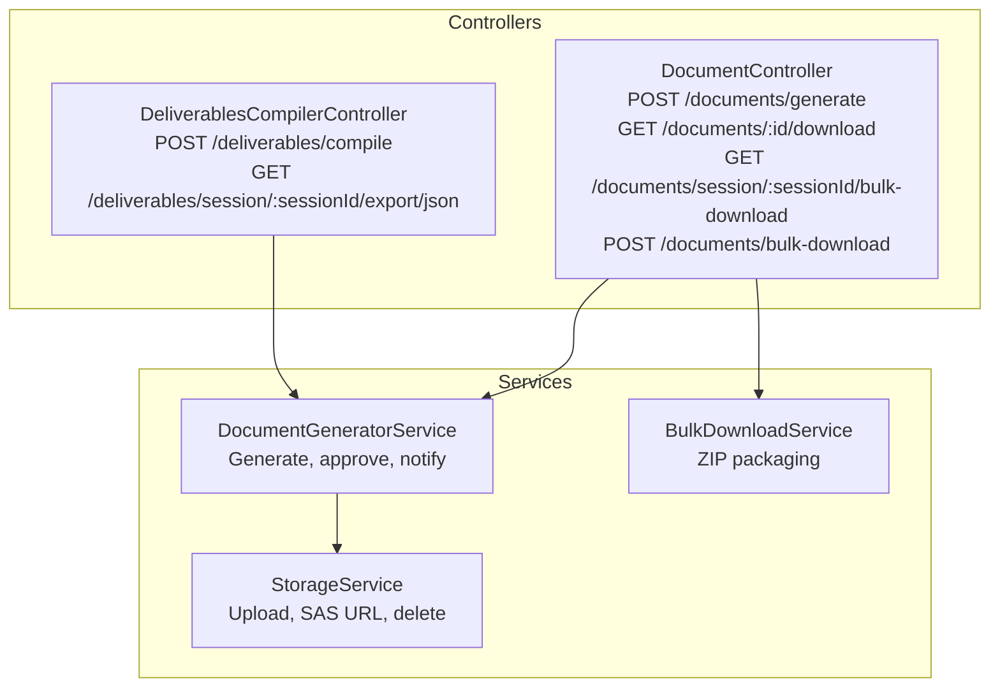
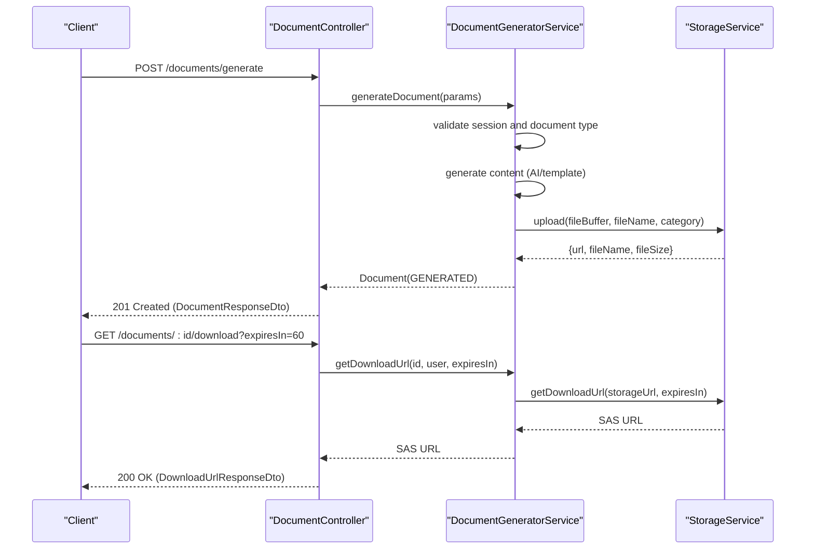
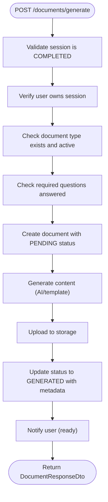
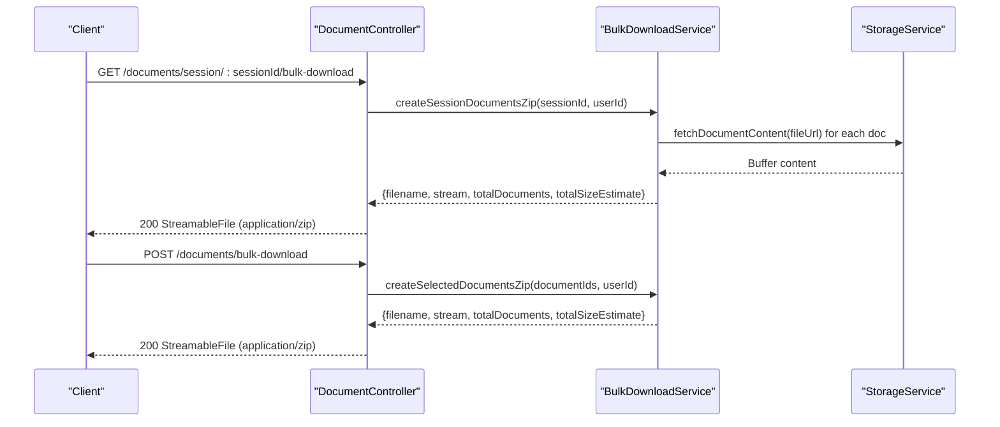
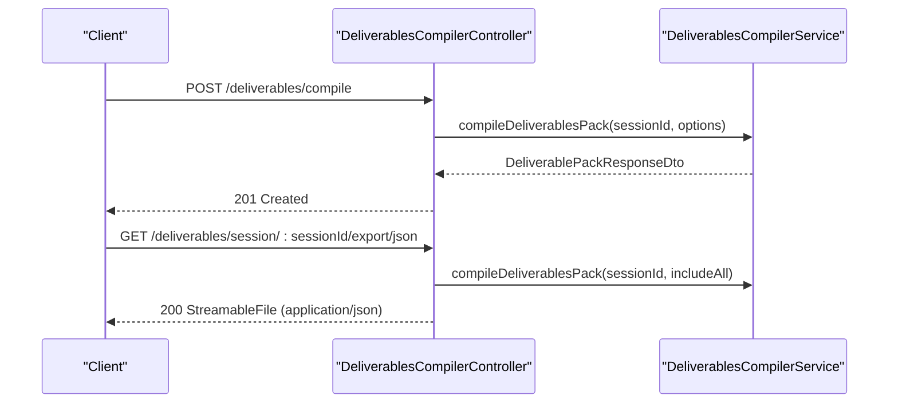
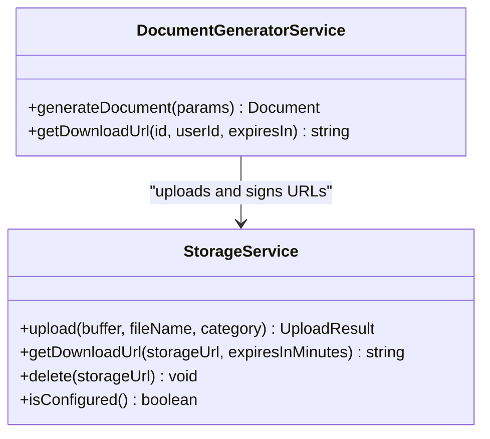
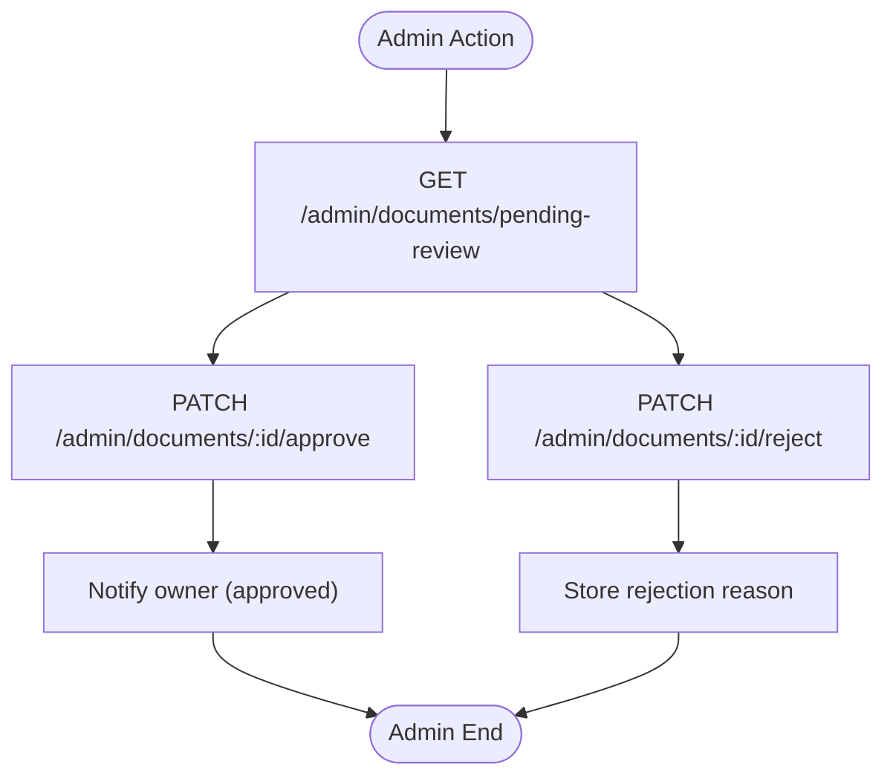
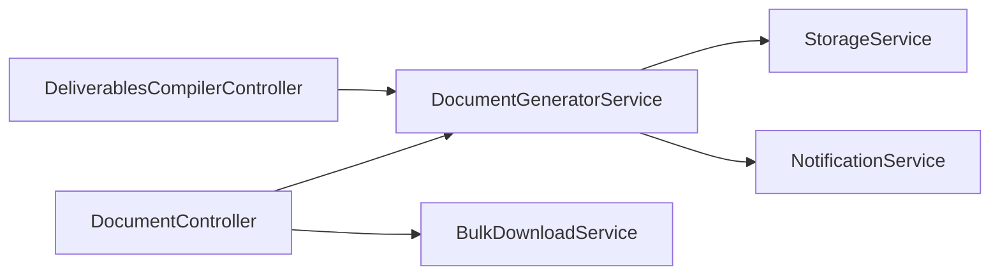

# Export & Delivery API

<cite>
**Referenced Files in This Document**
- [document.controller.ts](file://apps/api/src/modules/document-generator/controllers/document.controller.ts)
- [deliverables-compiler.controller.ts](file://apps/api/src/modules/document-generator/controllers/deliverables-compiler.controller.ts)
- [document-generator.service.ts](file://apps/api/src/modules/document-generator/services/document-generator.service.ts)
- [storage.service.ts](file://apps/api/src/modules/document-generator/services/storage.service.ts)
- [bulk-download.service.ts](file://apps/api/src/modules/document-generator/services/bulk-download.service.ts)
- [document.controller.ts](file://apps/api/src/modules/document-generator/controllers/document-admin.controller.ts)
</cite>

## Table of Contents
1. [Introduction](#introduction)
2. [Project Structure](#project-structure)
3. [Core Components](#core-components)
4. [Architecture Overview](#architecture-overview)
5. [Detailed Component Analysis](#detailed-component-analysis)
6. [Dependency Analysis](#dependency-analysis)
7. [Performance Considerations](#performance-considerations)
8. [Troubleshooting Guide](#troubleshooting-guide)
9. [Conclusion](#conclusion)

## Introduction
This document describes the Export & Delivery API for document generation and delivery. It covers:
- Multi-format export capabilities (DOCX and JSON)
- File generation workflows and storage integration
- Export quality settings, compression options, and format-specific configurations
- Delivery mechanisms, webhook notifications, and status tracking
- Examples of export requests, download URLs, and file retrieval
- Bulk export operations, progress monitoring, and error handling
- File security, access controls, and retention policies

## Project Structure
The export and delivery functionality is implemented in the document generator module with dedicated controllers and services:
- Controllers expose REST endpoints for document generation, retrieval, downloads, and bulk operations
- Services orchestrate generation, storage, and notifications
- Storage service integrates with Azure Blob Storage for uploads and signed URLs
- Bulk download service packages multiple documents into a ZIP archive

**Diagram sources**
- [document.controller.ts:35-278](file://apps/api/src/modules/document-generator/controllers/document.controller.ts#L35-L278)
- [deliverables-compiler.controller.ts:26-256](file://apps/api/src/modules/document-generator/controllers/deliverables-compiler.controller.ts#L26-L256)
- [document-generator.service.ts:22-609](file://apps/api/src/modules/document-generator/services/document-generator.service.ts#L22-L609)
- [storage.service.ts:82-129](file://apps/api/src/modules/document-generator/services/storage.service.ts#L82-L129)
- [bulk-download.service.ts:86-207](file://apps/api/src/modules/document-generator/services/bulk-download.service.ts#L86-L207)

**Section sources**
- [document.controller.ts:35-278](file://apps/api/src/modules/document-generator/controllers/document.controller.ts#L35-L278)
- [deliverables-compiler.controller.ts:26-256](file://apps/api/src/modules/document-generator/controllers/deliverables-compiler.controller.ts#L26-L256)
- [document-generator.service.ts:22-609](file://apps/api/src/modules/document-generator/services/document-generator.service.ts#L22-L609)
- [storage.service.ts:82-129](file://apps/api/src/modules/document-generator/services/storage.service.ts#L82-L129)
- [bulk-download.service.ts:86-207](file://apps/api/src/modules/document-generator/services/bulk-download.service.ts#L86-L207)

## Core Components
- DocumentController: Exposes endpoints for document generation, listing types, retrieving documents, downloading files, and bulk downloads
- DeliverablesCompilerController: Compiles and exports deliverables packs (JSON) and retrieves individual documents by category
- DocumentGeneratorService: Orchestrates generation, validation, storage, and notifications
- StorageService: Handles uploads to Azure Blob Storage and generates SAS-based download URLs
- BulkDownloadService: Creates ZIP archives of session or selected documents

**Section sources**
- [document.controller.ts:35-278](file://apps/api/src/modules/document-generator/controllers/document.controller.ts#L35-L278)
- [deliverables-compiler.controller.ts:26-256](file://apps/api/src/modules/document-generator/controllers/deliverables-compiler.controller.ts#L26-L256)
- [document-generator.service.ts:22-609](file://apps/api/src/modules/document-generator/services/document-generator.service.ts#L22-L609)
- [storage.service.ts:82-129](file://apps/api/src/modules/document-generator/services/storage.service.ts#L82-L129)
- [bulk-download.service.ts:86-207](file://apps/api/src/modules/document-generator/services/bulk-download.service.ts#L86-L207)

## Architecture Overview
The export pipeline follows a request-driven flow:
- Clients submit generation requests
- The system validates prerequisites (session completion, required answers)
- Content is generated (AI or template-based)
- Generated content is uploaded to storage
- Download URLs are issued via SAS tokens
- Notifications are sent to users upon completion or approval

**Diagram sources**
- [document.controller.ts:45-65](file://apps/api/src/modules/document-generator/controllers/document.controller.ts#L45-L65)
- [document-generator.service.ts:37-136](file://apps/api/src/modules/document-generator/services/document-generator.service.ts#L37-L136)
- [storage.service.ts:92-122](file://apps/api/src/modules/document-generator/services/storage.service.ts#L92-L122)

## Detailed Component Analysis

### Document Generation and Retrieval
Endpoints:
- POST /documents/generate: Initiates document generation for a completed session
- GET /documents/types: Lists available document types
- GET /documents/session/:sessionId/types: Lists types scoped to a session
- GET /documents/session/:sessionId: Lists all documents for a session
- GET /documents/:id: Retrieves a specific document
- GET /documents/:id/versions: Lists version history
- GET /documents/:id/versions/:version/download: Downloads a specific version

Key behaviors:
- Validation ensures the session is completed and the requesting user owns the session
- Required questions for the document type are enforced
- Generation method is tracked (AI vs template-based)
- Storage metadata (URL, filename, size) is persisted
- Download URLs are signed and time-limited

**Diagram sources**
- [document-generator.service.ts:37-136](file://apps/api/src/modules/document-generator/services/document-generator.service.ts#L37-L136)

**Section sources**
- [document.controller.ts:45-117](file://apps/api/src/modules/document-generator/controllers/document.controller.ts#L45-L117)
- [document-generator.service.ts:37-136](file://apps/api/src/modules/document-generator/services/document-generator.service.ts#L37-L136)

### Download and Delivery
Endpoints:
- GET /documents/:id/download: Issues a signed download URL with optional expiry
- GET /documents/session/:sessionId/bulk-download: Streams a ZIP of all session documents
- POST /documents/bulk-download: Streams a ZIP of selected documents (max 50)

Quality and compression:
- ZIP archives are streamed to reduce memory overhead
- Total document count and estimated size are exposed via response headers
- Individual document downloads use SAS tokens with configurable expiry

**Diagram sources**
- [document.controller.ts:143-197](file://apps/api/src/modules/document-generator/controllers/document.controller.ts#L143-L197)
- [bulk-download.service.ts:86-207](file://apps/api/src/modules/document-generator/services/bulk-download.service.ts#L86-L207)

**Section sources**
- [document.controller.ts:119-197](file://apps/api/src/modules/document-generator/controllers/document.controller.ts#L119-L197)
- [bulk-download.service.ts:86-207](file://apps/api/src/modules/document-generator/services/bulk-download.service.ts#L86-L207)

### Deliverables Pack Export (JSON)
Endpoints:
- POST /deliverables/compile: Compiles a complete deliverables pack for a session
- GET /deliverables/session/:sessionId/export/json: Exports the pack as JSON
- GET /deliverables/session/:sessionId/document/:category: Retrieves a specific document by category
- GET /deliverables/categories: Lists available categories

Capabilities:
- Full deliverables pack compilation with multiple document categories
- JSON export for downstream consumption
- Category-based retrieval for selective access

**Diagram sources**
- [deliverables-compiler.controller.ts:36-136](file://apps/api/src/modules/document-generator/controllers/deliverables-compiler.controller.ts#L36-L136)

**Section sources**
- [deliverables-compiler.controller.ts:36-136](file://apps/api/src/modules/document-generator/controllers/deliverables-compiler.controller.ts#L36-L136)

### Storage Integration and Security
- Uploads to Azure Blob Storage with structured paths including date segments
- Signed SAS URLs for secure, time-limited downloads
- Access control enforced per session ownership
- Optional deletion support for storage cleanup

**Diagram sources**
- [storage.service.ts:82-129](file://apps/api/src/modules/document-generator/services/storage.service.ts#L82-L129)
- [document-generator.service.ts:189-218](file://apps/api/src/modules/document-generator/services/document-generator.service.ts#L189-L218)

**Section sources**
- [storage.service.ts:82-129](file://apps/api/src/modules/document-generator/services/storage.service.ts#L82-L129)
- [document-generator.service.ts:189-218](file://apps/api/src/modules/document-generator/services/document-generator.service.ts#L189-L218)

### Admin Review and Batch Operations
Admin endpoints manage document review lifecycle:
- List documents pending review
- Approve or reject documents
- Batch approve/reject multiple documents

**Diagram sources**
- [document-admin.controller.ts:141-213](file://apps/api/src/modules/document-generator/controllers/document-admin.controller.ts#L141-L213)

**Section sources**
- [document-admin.controller.ts:141-213](file://apps/api/src/modules/document-generator/controllers/document-admin.controller.ts#L141-L213)

## Dependency Analysis
- Controllers depend on services for business logic
- Services depend on storage for persistence and retrieval
- Notifications are triggered after generation and approval
- Bulk operations depend on storage URLs for content fetching

**Diagram sources**
- [document.controller.ts:35-278](file://apps/api/src/modules/document-generator/controllers/document.controller.ts#L35-L278)
- [deliverables-compiler.controller.ts:26-256](file://apps/api/src/modules/document-generator/controllers/deliverables-compiler.controller.ts#L26-L256)
- [document-generator.service.ts:22-609](file://apps/api/src/modules/document-generator/services/document-generator.service.ts#L22-L609)
- [bulk-download.service.ts:86-207](file://apps/api/src/modules/document-generator/services/bulk-download.service.ts#L86-L207)
- [storage.service.ts:82-129](file://apps/api/src/modules/document-generator/services/storage.service.ts#L82-L129)

**Section sources**
- [document.controller.ts:35-278](file://apps/api/src/modules/document-generator/controllers/document.controller.ts#L35-L278)
- [deliverables-compiler.controller.ts:26-256](file://apps/api/src/modules/document-generator/controllers/deliverables-compiler.controller.ts#L26-L256)
- [document-generator.service.ts:22-609](file://apps/api/src/modules/document-generator/services/document-generator.service.ts#L22-L609)
- [bulk-download.service.ts:86-207](file://apps/api/src/modules/document-generator/services/bulk-download.service.ts#L86-L207)
- [storage.service.ts:82-129](file://apps/api/src/modules/document-generator/services/storage.service.ts#L82-L129)

## Performance Considerations
- Streaming ZIP archives reduces memory footprint during bulk downloads
- Estimated total size and document counts are returned for client-side progress awareness
- Generation uses asynchronous updates to avoid blocking the request thread
- SAS URL expiry can be tuned to balance convenience and security

## Troubleshooting Guide
Common errors and resolutions:
- Session not completed: Ensure the session status is COMPLETED before generation
- Missing required questions: Answer all required questions for the target document type
- Access denied: Only the session owner can generate or download documents
- Document not available for download: Document must be in GENERATED or APPROVED state
- No documents available: Bulk operations require at least one eligible document
- Maximum selection exceeded: Selected bulk downloads are limited (e.g., 50 documents)

Operational checks:
- Verify storage credentials and container configuration for upload and SAS URL generation
- Confirm notification delivery settings for user alerts
- Monitor generation logs for failures and retry conditions

**Section sources**
- [document-generator.service.ts:49-136](file://apps/api/src/modules/document-generator/services/document-generator.service.ts#L49-L136)
- [document.controller.ts:119-197](file://apps/api/src/modules/document-generator/controllers/document.controller.ts#L119-L197)
- [bulk-download.service.ts:119-190](file://apps/api/src/modules/document-generator/services/bulk-download.service.ts#L119-L190)

## Conclusion
The Export & Delivery API provides a robust, secure, and scalable solution for generating, storing, and delivering documents. It supports DOCX generation and JSON export for deliverables, enforces strict access controls, and offers efficient bulk operations with streaming and time-limited download URLs. Administrators can review and approve documents, while clients receive timely notifications and reliable access to their generated content.