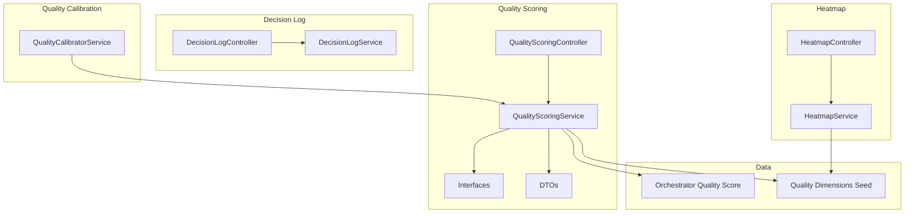
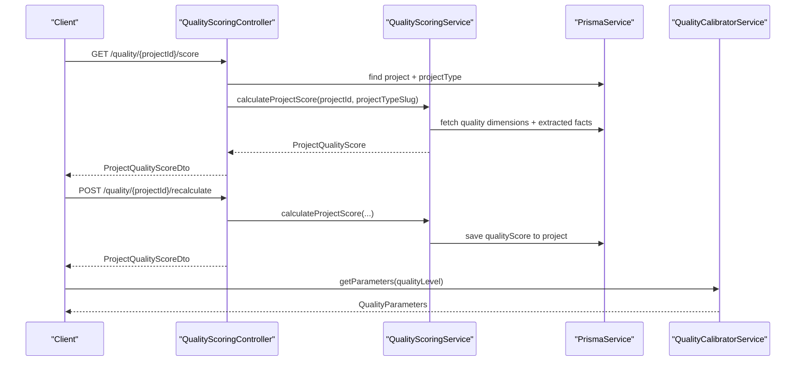
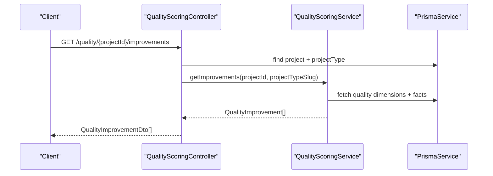
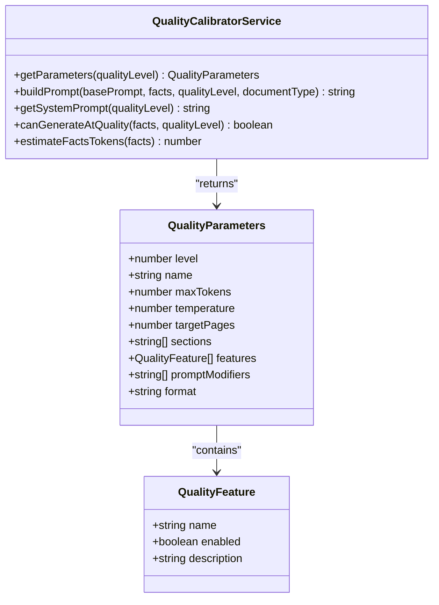
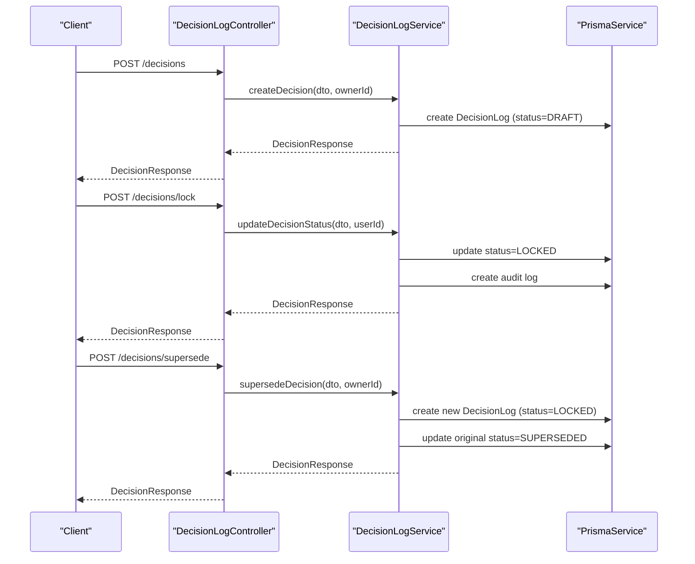
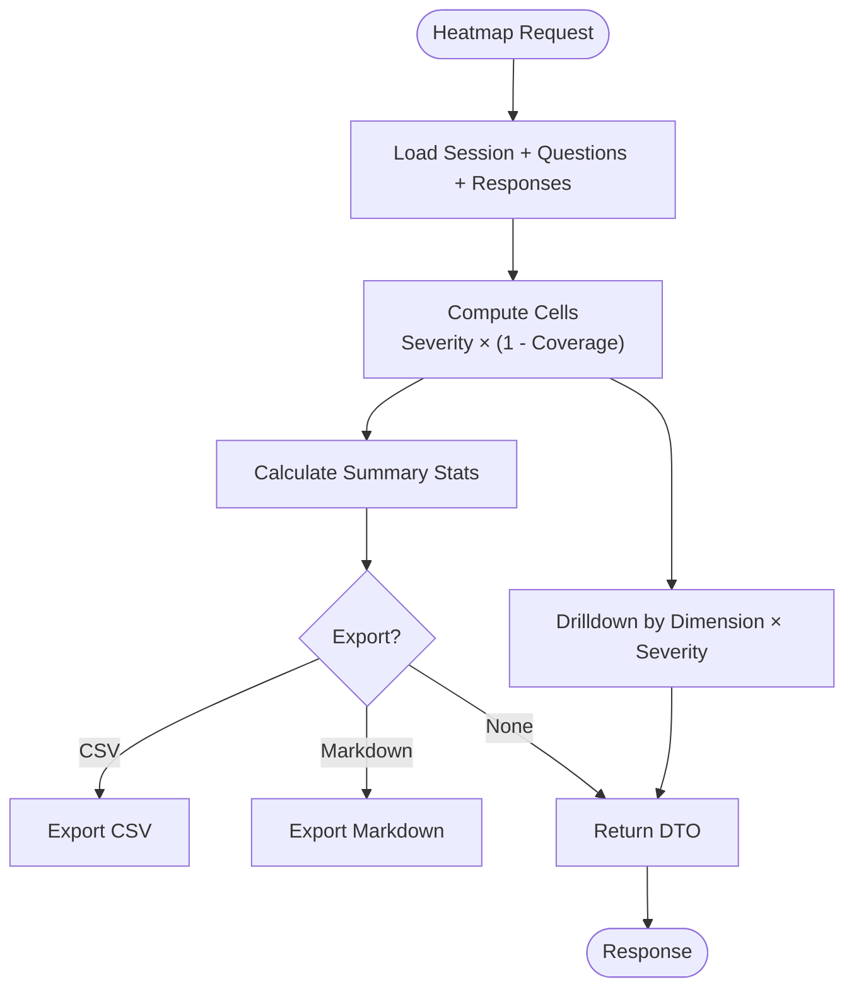
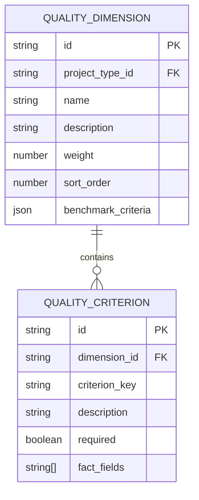
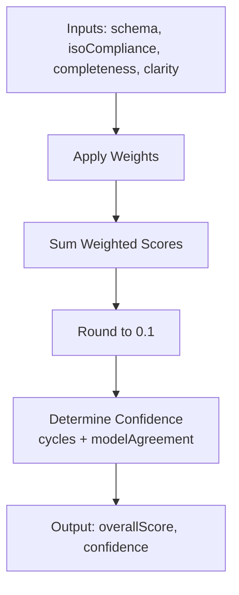
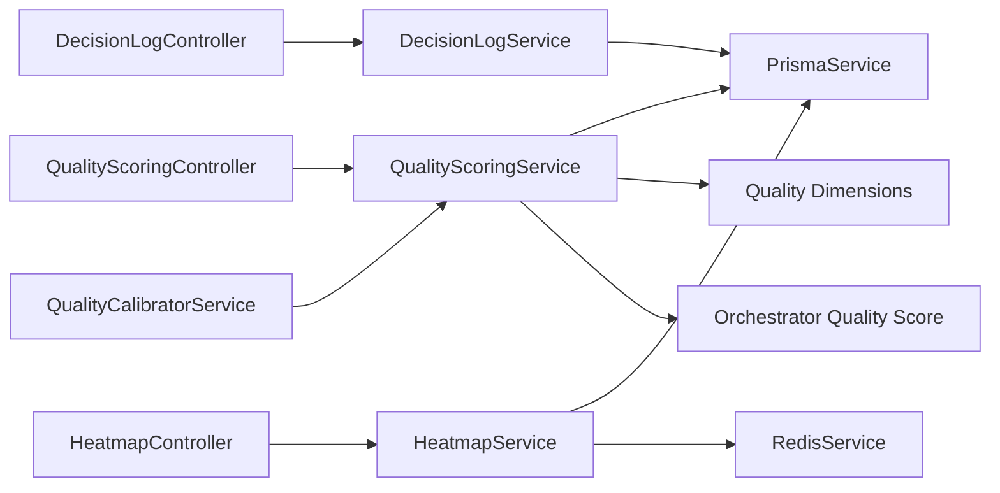

# Quality Assurance API

<cite>
**Referenced Files in This Document**
- [quality-scoring.controller.ts](file://apps/api/src/modules/quality-scoring/quality-scoring.controller.ts)
- [quality-scoring.service.ts](file://apps/api/src/modules/quality-scoring/services/quality-scoring.service.ts)
- [quality-calibrator.service.ts](file://apps/api/src/modules/document-generator/services/quality-calibrator.service.ts)
- [interfaces.ts](file://apps/api/src/modules/quality-scoring/interfaces.ts)
- [quality-scoring.dto.ts](file://apps/api/src/modules/quality-scoring/dto/quality-scoring.dto.ts)
- [decision-log.controller.ts](file://apps/api/src/modules/decision-log/decision-log.controller.ts)
- [decision-log.service.ts](file://apps/api/src/modules/decision-log/decision-log.service.ts)
- [heatmap.controller.ts](file://apps/api/src/modules/heatmap/heatmap.controller.ts)
- [heatmap.service.ts](file://apps/api/src/modules/heatmap/heatmap.service.ts)
- [quality-dimensions.seed.ts](file://prisma/seeds/quality-dimensions.seed.ts)
- [quality-score.ts](file://libs/orchestrator/src/schemas/quality-score.ts)
</cite>

## Table of Contents
1. [Introduction](#introduction)
2. [Project Structure](#project-structure)
3. [Core Components](#core-components)
4. [Architecture Overview](#architecture-overview)
5. [Detailed Component Analysis](#detailed-component-analysis)
6. [Dependency Analysis](#dependency-analysis)
7. [Performance Considerations](#performance-considerations)
8. [Troubleshooting Guide](#troubleshooting-guide)
9. [Conclusion](#conclusion)

## Introduction
This document describes the Quality Assurance API that powers automated quality assessment, compliance checking, and governance for document generation workflows. It covers:
- Automated quality scoring across quality dimensions
- Quality calibration for document generation parameters
- Validation rules and standards-based benchmarks
- Manual review and approval workflows
- Reporting, trend analysis, and governance audit trails
- Thresholds, escalation, and administrative oversight

## Project Structure
The Quality Assurance API spans several modules:
- Quality Scoring: computes project quality scores and improvement suggestions
- Quality Calibration: adjusts generation parameters based on quality level
- Decision Log: append-only decision records with audit trail and supersession
- Heatmap: readiness gap visualization and trend analysis
- Quality Dimensions: standards-based benchmark criteria for each project type

**Diagram sources**
- [quality-scoring.controller.ts:1-183](file://apps/api/src/modules/quality-scoring/quality-scoring.controller.ts#L1-L183)
- [quality-scoring.service.ts:1-339](file://apps/api/src/modules/quality-scoring/services/quality-scoring.service.ts#L1-L339)
- [quality-calibrator.service.ts:1-356](file://apps/api/src/modules/document-generator/services/quality-calibrator.service.ts#L1-L356)
- [decision-log.controller.ts:1-279](file://apps/api/src/modules/decision-log/decision-log.controller.ts#L1-L279)
- [decision-log.service.ts:1-396](file://apps/api/src/modules/decision-log/decision-log.service.ts#L1-L396)
- [heatmap.controller.ts:1-186](file://apps/api/src/modules/heatmap/heatmap.controller.ts#L1-L186)
- [heatmap.service.ts:1-851](file://apps/api/src/modules/heatmap/heatmap.service.ts#L1-L851)
- [quality-dimensions.seed.ts:1-433](file://prisma/seeds/quality-dimensions.seed.ts#L1-L433)
- [quality-score.ts:1-91](file://libs/orchestrator/src/schemas/quality-score.ts#L1-L91)

**Section sources**
- [quality-scoring.controller.ts:1-183](file://apps/api/src/modules/quality-scoring/quality-scoring.controller.ts#L1-L183)
- [quality-scoring.service.ts:1-339](file://apps/api/src/modules/quality-scoring/services/quality-scoring.service.ts#L1-L339)
- [quality-calibrator.service.ts:1-356](file://apps/api/src/modules/document-generator/services/quality-calibrator.service.ts#L1-L356)
- [decision-log.controller.ts:1-279](file://apps/api/src/modules/decision-log/decision-log.controller.ts#L1-L279)
- [decision-log.service.ts:1-396](file://apps/api/src/modules/decision-log/decision-log.service.ts#L1-L396)
- [heatmap.controller.ts:1-186](file://apps/api/src/modules/heatmap/heatmap.controller.ts#L1-L186)
- [heatmap.service.ts:1-851](file://apps/api/src/modules/heatmap/heatmap.service.ts#L1-L851)
- [quality-dimensions.seed.ts:1-433](file://prisma/seeds/quality-dimensions.seed.ts#L1-L433)
- [quality-score.ts:1-91](file://libs/orchestrator/src/schemas/quality-score.ts#L1-L91)

## Core Components
- Quality Scoring Controller: exposes endpoints to fetch scores, improvement suggestions, and recalculation results for a project.
- Quality Scoring Service: calculates dimension and overall scores, completeness, confidence, and recommendations based on extracted facts and quality dimensions.
- Quality Calibration Service: maps quality levels to generation parameters (tokens, sections, features, prompt modifiers) and validates capacity.
- Decision Log Controller/Service: manages append-only decision records, locking, supersession, and audit exports.
- Heatmap Controller/Service: generates readiness gap matrices, summaries, exports, drilldowns, and prioritized action plans.
- Quality Dimensions Seed: defines standards-based benchmark criteria per project type and validates weight sums.
- Orchestrator Quality Score: central calculation of weighted scores and confidence determination.

**Section sources**
- [quality-scoring.controller.ts:1-183](file://apps/api/src/modules/quality-scoring/quality-scoring.controller.ts#L1-L183)
- [quality-scoring.service.ts:1-339](file://apps/api/src/modules/quality-scoring/services/quality-scoring.service.ts#L1-L339)
- [quality-calibrator.service.ts:1-356](file://apps/api/src/modules/document-generator/services/quality-calibrator.service.ts#L1-L356)
- [decision-log.controller.ts:1-279](file://apps/api/src/modules/decision-log/decision-log.controller.ts#L1-L279)
- [decision-log.service.ts:1-396](file://apps/api/src/modules/decision-log/decision-log.service.ts#L1-L396)
- [heatmap.controller.ts:1-186](file://apps/api/src/modules/heatmap/heatmap.controller.ts#L1-L186)
- [heatmap.service.ts:1-851](file://apps/api/src/modules/heatmap/heatmap.service.ts#L1-L851)
- [quality-dimensions.seed.ts:1-433](file://prisma/seeds/quality-dimensions.seed.ts#L1-L433)
- [quality-score.ts:1-91](file://libs/orchestrator/src/schemas/quality-score.ts#L1-L91)

## Architecture Overview
The Quality Assurance API integrates three primary workflows:
- Automated Quality Assessment: extracts facts, applies standards-based criteria, and produces scores and recommendations.
- Quality Calibration: translates quality scores into generation parameters for document producers.
- Governance and Reporting: captures immutable decision logs and visualizes readiness gaps with export and trend capabilities.

**Diagram sources**
- [quality-scoring.controller.ts:27-117](file://apps/api/src/modules/quality-scoring/quality-scoring.controller.ts#L27-L117)
- [quality-scoring.service.ts:33-94](file://apps/api/src/modules/quality-scoring/services/quality-scoring.service.ts#L33-L94)
- [quality-calibrator.service.ts:203-216](file://apps/api/src/modules/document-generator/services/quality-calibrator.service.ts#L203-L216)

## Detailed Component Analysis

### Quality Scoring API
Endpoints:
- GET /quality/{projectId}/score: Returns overall, dimension-level, completeness, and confidence scores plus recommendations.
- GET /quality/{projectId}/improvements: Returns actionable improvement suggestions with missing criteria and suggested questions.
- POST /quality/{projectId}/recalculate: Recalculates and persists the score to the project.

Processing logic:
- Loads project and project type, retrieves quality dimensions and extracted facts, computes dimension scores, completeness, confidence, and recommendations.
- Maps internal structures to DTOs for API responses.

**Diagram sources**
- [quality-scoring.controller.ts:55-87](file://apps/api/src/modules/quality-scoring/quality-scoring.controller.ts#L55-L87)
- [quality-scoring.service.ts:273-302](file://apps/api/src/modules/quality-scoring/services/quality-scoring.service.ts#L273-L302)

**Section sources**
- [quality-scoring.controller.ts:27-117](file://apps/api/src/modules/quality-scoring/quality-scoring.controller.ts#L27-L117)
- [quality-scoring.service.ts:33-94](file://apps/api/src/modules/quality-scoring/services/quality-scoring.service.ts#L33-L94)
- [quality-scoring.dto.ts:1-100](file://apps/api/src/modules/quality-scoring/dto/quality-scoring.dto.ts#L1-L100)
- [interfaces.ts:1-63](file://apps/api/src/modules/quality-scoring/interfaces.ts#L1-L63)

### Quality Calibration API
Purpose:
- Translate quality scores into generation parameters (quality level, max tokens, sections, features, prompt modifiers, format).
- Validate capacity constraints for the given facts.

Key behaviors:
- Quality levels 0–4 with increasing complexity and features.
- Prompt construction with quality guidelines, required sections, enabled features, and target length.
- Token estimation and capacity check for facts.

**Diagram sources**
- [quality-calibrator.service.ts:16-36](file://apps/api/src/modules/document-generator/services/quality-calibrator.service.ts#L16-L36)
- [quality-calibrator.service.ts:59-197](file://apps/api/src/modules/document-generator/services/quality-calibrator.service.ts#L59-L197)

**Section sources**
- [quality-calibrator.service.ts:1-356](file://apps/api/src/modules/document-generator/services/quality-calibrator.service.ts#L1-L356)

### Decision Log API (Governance and Audit)
Endpoints:
- POST /decisions: Create a decision in DRAFT status.
- POST /decisions/lock: Lock a DRAFT decision (immutable).
- POST /decisions/supersede: Create a new decision superseding a LOCKED decision.
- GET /decisions/{decisionId}: Retrieve a decision.
- GET /decisions: List decisions with filters.
- GET /decisions/{decisionId}/chain: Get supersession chain.
- GET /decisions/export/{sessionId}: Export decisions for audit.
- DELETE /decisions/{decisionId}: Delete a DRAFT decision.

Append-only enforcement:
- DRAFT → LOCKED transitions only.
- Locked decisions cannot be modified; supersession is the only amendment mechanism.
- Audit entries recorded for all state changes.

**Diagram sources**
- [decision-log.controller.ts:43-156](file://apps/api/src/modules/decision-log/decision-log.controller.ts#L43-L156)
- [decision-log.service.ts:49-188](file://apps/api/src/modules/decision-log/decision-log.service.ts#L49-L188)

**Section sources**
- [decision-log.controller.ts:1-279](file://apps/api/src/modules/decision-log/decision-log.controller.ts#L1-L279)
- [decision-log.service.ts:1-396](file://apps/api/src/modules/decision-log/decision-log.service.ts#L1-L396)

### Heatmap API (Reporting and Trend Analysis)
Endpoints:
- GET /heatmap/{sessionId}: Generate heatmap matrix.
- GET /heatmap/{sessionId}/summary: Summary counts and risk score.
- GET /heatmap/{sessionId}/export/csv: Export CSV.
- GET /heatmap/{sessionId}/export/markdown: Export Markdown.
- GET /heatmap/{sessionId}/cells: Filtered cells.
- GET /heatmap/{sessionId}/drilldown/{dimensionKey}/{severityBucket}: Drilldown details.
- GET /heatmap/{sessionId}/compare/{sessionId2}: Compare two sessions.
- GET /heatmap/{sessionId}/priority: Priority gaps for action planning.

Capabilities:
- Color-coded risk buckets (green/amber/red).
- Export formats for external consumption.
- Drilldown to identify contributing questions and residual risk.
- Priority ranking and action plan generation.

**Diagram sources**
- [heatmap.controller.ts:51-184](file://apps/api/src/modules/heatmap/heatmap.controller.ts#L51-L184)
- [heatmap.service.ts:53-91](file://apps/api/src/modules/heatmap/heatmap.service.ts#L53-L91)
- [heatmap.service.ts:227-295](file://apps/api/src/modules/heatmap/heatmap.service.ts#L227-L295)

**Section sources**
- [heatmap.controller.ts:1-186](file://apps/api/src/modules/heatmap/heatmap.controller.ts#L1-L186)
- [heatmap.service.ts:1-851](file://apps/api/src/modules/heatmap/heatmap.service.ts#L1-L851)

### Quality Dimensions and Standards-Based Benchmarks
Quality dimensions define the evaluation criteria for each project type. Each dimension includes:
- Name, description, weight, sort order
- Benchmark criteria with keys, descriptions, required flags, and associated fact fields
- Validation that weights sum to 1.0 per project type

**Diagram sources**
- [quality-dimensions.seed.ts:15-433](file://prisma/seeds/quality-dimensions.seed.ts#L15-L433)

**Section sources**
- [quality-dimensions.seed.ts:1-433](file://prisma/seeds/quality-dimensions.seed.ts#L1-L433)

### Central Quality Score Calculation
The orchestrator provides:
- Weighted score calculation across dimensions
- Confidence determination based on correction cycles and model agreement
- Validation that weights sum to 1.0

**Diagram sources**
- [quality-score.ts:44-83](file://libs/orchestrator/src/schemas/quality-score.ts#L44-L83)

**Section sources**
- [quality-score.ts:1-91](file://libs/orchestrator/src/schemas/quality-score.ts#L1-L91)

## Dependency Analysis
- QualityScoringController depends on QualityScoringService and PrismaService.
- QualityScoringService depends on PrismaService and reads quality dimensions and extracted facts.
- QualityCalibratorService consumes QualityScoringService outputs to configure generation.
- DecisionLogController/Service enforces append-only state transitions and audit logging.
- HeatmapService depends on PrismaService and Redis for caching; integrates with quality dimensions.

**Diagram sources**
- [quality-scoring.controller.ts:8-25](file://apps/api/src/modules/quality-scoring/quality-scoring.controller.ts#L8-L25)
- [quality-scoring.service.ts:8-31](file://apps/api/src/modules/quality-scoring/services/quality-scoring.service.ts#L8-L31)
- [quality-calibrator.service.ts:13-201](file://apps/api/src/modules/document-generator/services/quality-calibrator.service.ts#L13-L201)
- [decision-log.controller.ts:14-41](file://apps/api/src/modules/decision-log/decision-log.controller.ts#L14-L41)
- [decision-log.service.ts:8-41](file://apps/api/src/modules/decision-log/decision-log.service.ts#L8-L41)
- [heatmap.controller.ts:1-35](file://apps/api/src/modules/heatmap/heatmap.controller.ts#L1-L35)
- [heatmap.service.ts:1-51](file://apps/api/src/modules/heatmap/heatmap.service.ts#L1-L51)

**Section sources**
- [quality-scoring.controller.ts:1-183](file://apps/api/src/modules/quality-scoring/quality-scoring.controller.ts#L1-L183)
- [quality-scoring.service.ts:1-339](file://apps/api/src/modules/quality-scoring/services/quality-scoring.service.ts#L1-L339)
- [quality-calibrator.service.ts:1-356](file://apps/api/src/modules/document-generator/services/quality-calibrator.service.ts#L1-L356)
- [decision-log.controller.ts:1-279](file://apps/api/src/modules/decision-log/decision-log.controller.ts#L1-L279)
- [decision-log.service.ts:1-396](file://apps/api/src/modules/decision-log/decision-log.service.ts#L1-L396)
- [heatmap.controller.ts:1-186](file://apps/api/src/modules/heatmap/heatmap.controller.ts#L1-L186)
- [heatmap.service.ts:1-851](file://apps/api/src/modules/heatmap/heatmap.service.ts#L1-L851)

## Performance Considerations
- Caching: HeatmapService caches results in Redis to reduce repeated computation.
- Pagination and limits: Services cap result sizes (e.g., take limits) to prevent excessive loads.
- Token estimation: QualityCalibratorService estimates token usage to avoid exceeding limits.
- Asynchronous processing: Consider offloading heavy recalculations to background jobs for long-running tasks.

[No sources needed since this section provides general guidance]

## Troubleshooting Guide
Common issues and resolutions:
- Project type not found: Results in empty score response; verify project type slug and existence.
- No quality dimensions configured: Service returns empty score; ensure quality dimensions are seeded for the project type.
- Missing extracted facts: Completeness and confidence scores reflect available facts; encourage richer conversations.
- Decision not in DRAFT: Cannot be locked or deleted; use supersession to amend locked decisions.
- Audit export missing session: Ensure session exists before exporting decision logs.

**Section sources**
- [quality-scoring.controller.ts:43-45](file://apps/api/src/modules/quality-scoring/quality-scoring.controller.ts#L43-L45)
- [quality-scoring.service.ts:47-50](file://apps/api/src/modules/quality-scoring/services/quality-scoring.service.ts#L47-L50)
- [decision-log.controller.ts:76-98](file://apps/api/src/modules/decision-log/decision-log.controller.ts#L76-L98)
- [decision-log.service.ts:95-105](file://apps/api/src/modules/decision-log/decision-log.service.ts#L95-L105)

## Conclusion
The Quality Assurance API provides a robust foundation for automated quality assessment, standards-based validation, and governance. By combining quality scoring, calibration, decision logs, and heatmap reporting, it supports both self-service quality improvement and auditable decision-making. Administrators can enforce quality thresholds, escalate issues, and maintain compliance through immutable audit trails and standardized benchmarks.