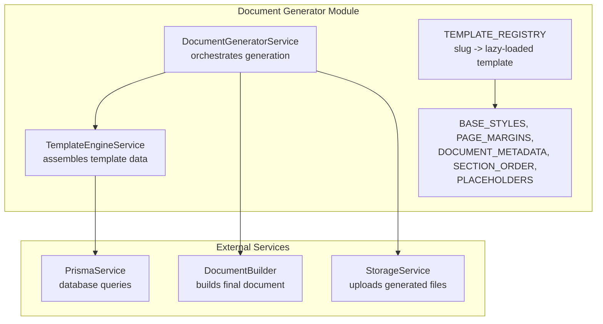
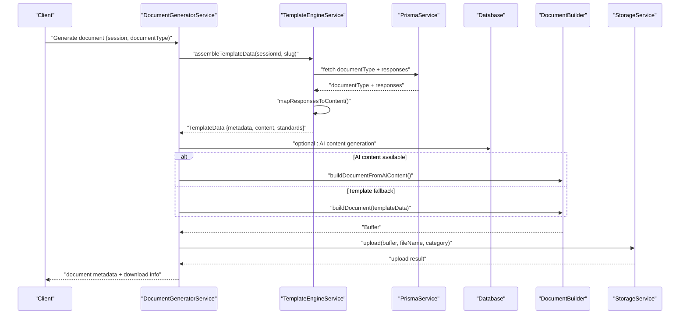
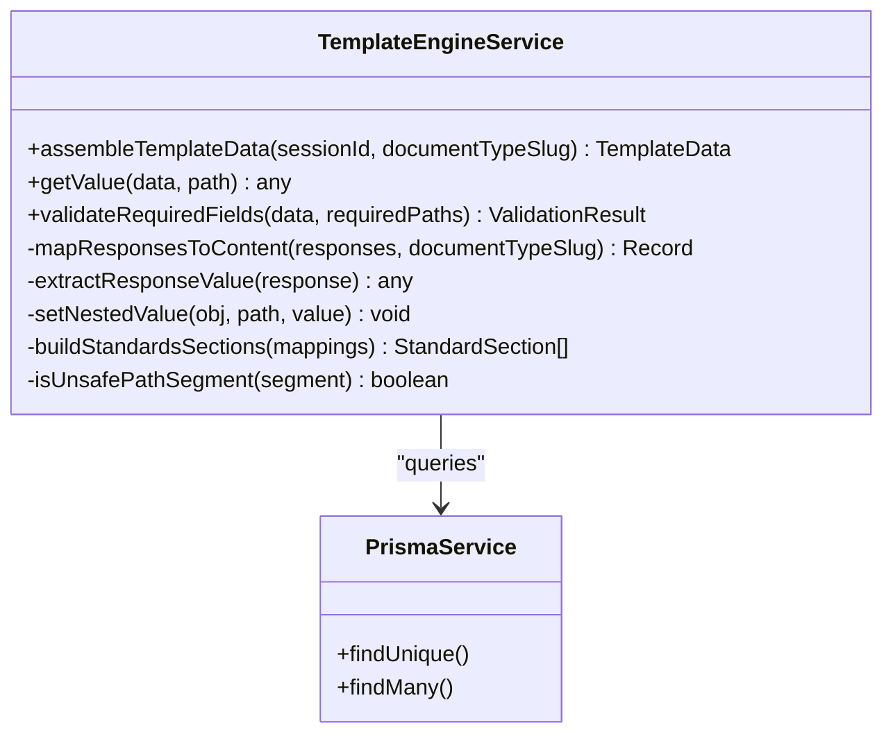
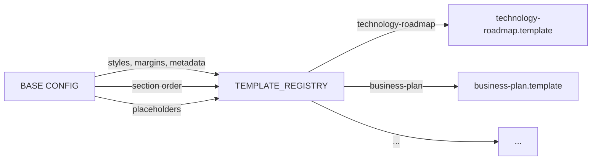
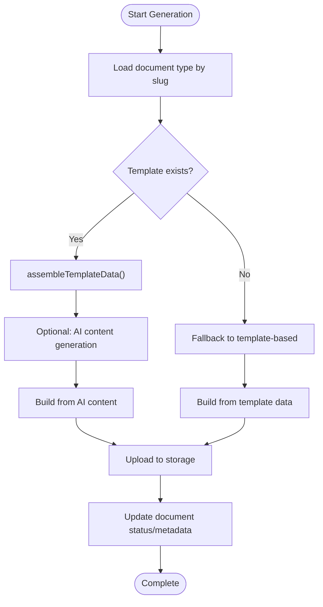
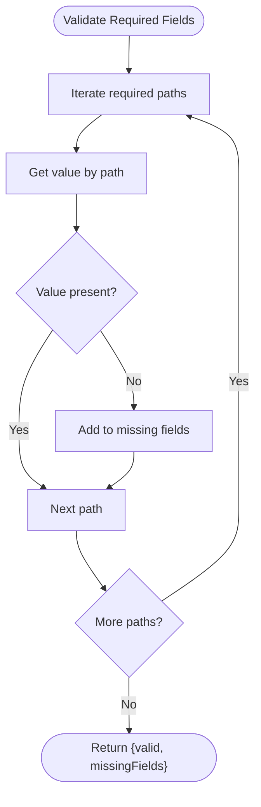
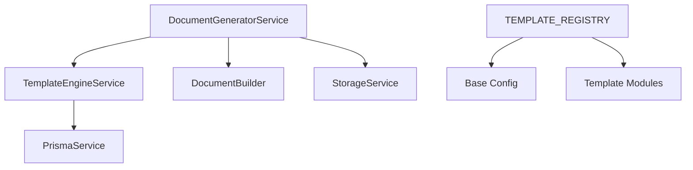

# Template Management API

<cite>
**Referenced Files in This Document**
- [template-engine.service.ts](file://apps/api/src/modules/document-generator/services/template-engine.service.ts)
- [base.template.ts](file://apps/api/src/modules/document-generator/templates/base.template.ts)
- [index.ts](file://apps/api/src/modules/document-generator/templates/index.ts)
- [document-generator.service.ts](file://apps/api/src/modules/document-generator/services/document-generator.service.ts)
- [generation.e2e.test.ts](file://e2e/document-generation/generation.e2e.test.ts)
</cite>

## Table of Contents
1. [Introduction](#introduction)
2. [Project Structure](#project-structure)
3. [Core Components](#core-components)
4. [Architecture Overview](#architecture-overview)
5. [Detailed Component Analysis](#detailed-component-analysis)
6. [Dependency Analysis](#dependency-analysis)
7. [Performance Considerations](#performance-considerations)
8. [Troubleshooting Guide](#troubleshooting-guide)
9. [Conclusion](#conclusion)

## Introduction
This document describes the template management capabilities within the document generation system. It focuses on how templates are structured, validated, assembled, and rendered into final documents. The system supports:
- Template CRUD operations via the template registry and base configuration
- Template validation using required field checks
- Template inheritance patterns through base styles and section ordering
- Rendering APIs for assembling template data and building documents
- Versioning and metadata management
- Preview and quality assurance checks during generation
- Security considerations for template data handling

## Project Structure
The template management system is organized around a central template engine service and a registry of document templates. Base styles, page margins, metadata, section ordering, and placeholders define the inheritance model. The document generator service orchestrates AI-driven and template-based generation.

**Diagram sources**
- [template-engine.service.ts:27-318](file://apps/api/src/modules/document-generator/services/template-engine.service.ts#L27-L318)
- [document-generator.service.ts:142-195](file://apps/api/src/modules/document-generator/services/document-generator.service.ts#L142-L195)
- [index.ts:37-87](file://apps/api/src/modules/document-generator/templates/index.ts#L37-L87)
- [base.template.ts:5-105](file://apps/api/src/modules/document-generator/templates/base.template.ts#L5-L105)

**Section sources**
- [template-engine.service.ts:27-318](file://apps/api/src/modules/document-generator/services/template-engine.service.ts#L27-L318)
- [index.ts:1-90](file://apps/api/src/modules/document-generator/templates/index.ts#L1-L90)
- [base.template.ts:1-106](file://apps/api/src/modules/document-generator/templates/base.template.ts#L1-L106)
- [document-generator.service.ts:142-195](file://apps/api/src/modules/document-generator/services/document-generator.service.ts#L142-L195)

## Core Components
- TemplateEngineService: Builds template data from session responses, validates required fields, and provides helpers for retrieving values and checking presence.
- Template Registry: Maps document slugs to lazily loaded template modules, enabling scalable template discovery and loading.
- Base Template Config: Provides shared styles, page margins, metadata defaults, section ordering, and placeholder values used across templates.
- DocumentGeneratorService: Chooses between AI content generation and template-based generation, then builds and uploads the final document.

Key responsibilities:
- Template assembly: map responses to nested content using document mappings
- Validation: ensure required fields are present
- Rendering: produce final document buffers using the assembled data
- Metadata/versioning: attach document type, category, generation timestamp, and version

**Section sources**
- [template-engine.service.ts:44-103](file://apps/api/src/modules/document-generator/services/template-engine.service.ts#L44-L103)
- [template-engine.service.ts:299-316](file://apps/api/src/modules/document-generator/services/template-engine.service.ts#L299-L316)
- [index.ts:37-87](file://apps/api/src/modules/document-generator/templates/index.ts#L37-L87)
- [base.template.ts:50-105](file://apps/api/src/modules/document-generator/templates/base.template.ts#L50-L105)
- [document-generator.service.ts:142-195](file://apps/api/src/modules/document-generator/services/document-generator.service.ts#L142-L195)

## Architecture Overview
The template management architecture separates concerns between data assembly, template configuration, and document building. The registry decouples template loading from runtime logic, while base configuration ensures consistent styling and structure.

**Diagram sources**
- [document-generator.service.ts:142-195](file://apps/api/src/modules/document-generator/services/document-generator.service.ts#L142-L195)
- [template-engine.service.ts:44-103](file://apps/api/src/modules/document-generator/services/template-engine.service.ts#L44-L103)

## Detailed Component Analysis

### Template Engine Service
Responsibilities:
- Assemble template data from session responses and document mappings
- Extract values from various question types
- Safely set nested values respecting path safety
- Build standards sections for specific categories
- Validate required fields and retrieve values by path

Security and validation highlights:
- Path traversal protection: blocks segments like prototype, constructor, __proto__
- Required field validation: checks presence of specified paths

Rendering and metadata:
- Returns metadata including document type, category, generation timestamp, and version
- Supports optional standards sections for specific categories

**Diagram sources**
- [template-engine.service.ts:27-318](file://apps/api/src/modules/document-generator/services/template-engine.service.ts#L27-L318)

**Section sources**
- [template-engine.service.ts:44-103](file://apps/api/src/modules/document-generator/services/template-engine.service.ts#L44-L103)
- [template-engine.service.ts:108-137](file://apps/api/src/modules/document-generator/services/template-engine.service.ts#L108-L137)
- [template-engine.service.ts:142-199](file://apps/api/src/modules/document-generator/services/template-engine.service.ts#L142-L199)
- [template-engine.service.ts:204-250](file://apps/api/src/modules/document-generator/services/template-engine.service.ts#L204-L250)
- [template-engine.service.ts:255-277](file://apps/api/src/modules/document-generator/services/template-engine.service.ts#L255-L277)
- [template-engine.service.ts:282-294](file://apps/api/src/modules/document-generator/services/template-engine.service.ts#L282-L294)
- [template-engine.service.ts:299-316](file://apps/api/src/modules/document-generator/services/template-engine.service.ts#L299-L316)

### Template Registry and Base Configuration
The registry provides a slug-to-template mapping with lazy loading, enabling efficient template discovery without loading all templates at startup. Base configuration defines shared styling, margins, metadata, section ordering, and placeholders.

**Diagram sources**
- [index.ts:37-87](file://apps/api/src/modules/document-generator/templates/index.ts#L37-L87)
- [base.template.ts:5-105](file://apps/api/src/modules/document-generator/templates/base.template.ts#L5-L105)

**Section sources**
- [index.ts:37-87](file://apps/api/src/modules/document-generator/templates/index.ts#L37-L87)
- [base.template.ts:5-105](file://apps/api/src/modules/document-generator/templates/base.template.ts#L5-L105)

### Document Generation Orchestration
The document generator chooses between AI content generation and template-based generation, then builds and uploads the final document. It updates document status and captures generation metadata.

**Diagram sources**
- [document-generator.service.ts:142-195](file://apps/api/src/modules/document-generator/services/document-generator.service.ts#L142-L195)

**Section sources**
- [document-generator.service.ts:113-195](file://apps/api/src/modules/document-generator/services/document-generator.service.ts#L113-L195)

### Template Validation Workflow
Template validation ensures required fields are present before document generation. The validator checks specified paths and reports missing fields.

**Diagram sources**
- [template-engine.service.ts:299-316](file://apps/api/src/modules/document-generator/services/template-engine.service.ts#L299-L316)

**Section sources**
- [template-engine.service.ts:299-316](file://apps/api/src/modules/document-generator/services/template-engine.service.ts#L299-L316)

### Template Inheritance Patterns
Base configuration establishes inheritance for:
- Styles: fonts, sizes, spacing
- Margins: standardized page margins
- Metadata: creator, company, last modified by
- Section ordering: category-specific ordering
- Placeholders: default values for missing data

These defaults are applied consistently across all templates, ensuring uniform appearance and behavior.

**Section sources**
- [base.template.ts:5-105](file://apps/api/src/modules/document-generator/templates/base.template.ts#L5-L105)

### Rendering and Styling Options
The template engine assembles content from responses and applies base styles and section ordering. Standards sections are included for specific categories, and placeholders provide fallback values.

**Section sources**
- [template-engine.service.ts:84-102](file://apps/api/src/modules/document-generator/services/template-engine.service.ts#L84-L102)
- [base.template.ts:59-95](file://apps/api/src/modules/document-generator/templates/base.template.ts#L59-L95)

### Versioning and Metadata Management
Each assembled template includes metadata with document type, category, generation timestamp, and version. This enables tracking and auditing of generated documents.

**Section sources**
- [template-engine.service.ts:93-102](file://apps/api/src/modules/document-generator/services/template-engine.service.ts#L93-L102)

### Preview and Quality Assurance Checks
During generation, the system:
- Validates required fields
- Applies base styles and section ordering
- Optionally includes standards sections
- Uploads the final document to storage

Quality checks include path safety validation and required field presence.

**Section sources**
- [template-engine.service.ts:32-39](file://apps/api/src/modules/document-generator/services/template-engine.service.ts#L32-L39)
- [template-engine.service.ts:299-316](file://apps/api/src/modules/document-generator/services/template-engine.service.ts#L299-L316)
- [document-generator.service.ts:142-195](file://apps/api/src/modules/document-generator/services/document-generator.service.ts#L142-L195)

### Administrative Template Management
Administrative capabilities are not exposed as explicit API endpoints in the analyzed files. However, the template registry and base configuration enable:
- Adding new templates via the registry
- Updating base styles and section ordering
- Managing standards mappings for specific categories

For actual CRUD operations, additional controllers and services would be required.

**Section sources**
- [index.ts:37-87](file://apps/api/src/modules/document-generator/templates/index.ts#L37-L87)
- [base.template.ts:59-95](file://apps/api/src/modules/document-generator/templates/base.template.ts#L59-L95)

### Sharing Mechanisms
Templates are referenced by slug and loaded lazily. There is no explicit sharing API in the analyzed files. Sharing would require additional endpoints to expose templates and manage access permissions.

**Section sources**
- [index.ts:37-87](file://apps/api/src/modules/document-generator/templates/index.ts#L37-L87)

### Examples: Upload, Modification, Deletion Workflows
- Upload: The system builds a document buffer and uploads it to storage using the document type category and a generated filename.
- Modification: Modify base styles, section ordering, or add new templates to the registry.
- Deletion: Remove entries from the registry and base configuration.

Note: These actions are derived from the documented behavior of the template engine and registry.

**Section sources**
- [document-generator.service.ts:189-195](file://apps/api/src/modules/document-generator/services/document-generator.service.ts#L189-L195)
- [index.ts:37-87](file://apps/api/src/modules/document-generator/templates/index.ts#L37-L87)
- [base.template.ts:59-95](file://apps/api/src/modules/document-generator/templates/base.template.ts#L59-L95)

### Security, Access Controls, and Compliance
Security measures observed:
- Path safety validation prevents unsafe path segments during content assembly
- Required field validation ensures completeness before generation
- Document status and metadata capture support auditability

Access controls and compliance are not explicitly implemented in the analyzed files. Administrative controls and compliance features would require additional guard layers and policies.

**Section sources**
- [template-engine.service.ts:32-39](file://apps/api/src/modules/document-generator/services/template-engine.service.ts#L32-L39)
- [template-engine.service.ts:299-316](file://apps/api/src/modules/document-generator/services/template-engine.service.ts#L299-L316)
- [document-generator.service.ts:113-135](file://apps/api/src/modules/document-generator/services/document-generator.service.ts#L113-L135)

## Dependency Analysis
TemplateEngineService depends on PrismaService for data retrieval. The registry depends on base configuration for shared settings. DocumentGeneratorService coordinates orchestration between template engine, builder, and storage.

**Diagram sources**
- [template-engine.service.ts:30-318](file://apps/api/src/modules/document-generator/services/template-engine.service.ts#L30-L318)
- [document-generator.service.ts:142-195](file://apps/api/src/modules/document-generator/services/document-generator.service.ts#L142-L195)
- [index.ts:37-87](file://apps/api/src/modules/document-generator/templates/index.ts#L37-L87)
- [base.template.ts:5-105](file://apps/api/src/modules/document-generator/templates/base.template.ts#L5-L105)

**Section sources**
- [template-engine.service.ts:30-318](file://apps/api/src/modules/document-generator/services/template-engine.service.ts#L30-L318)
- [document-generator.service.ts:142-195](file://apps/api/src/modules/document-generator/services/document-generator.service.ts#L142-L195)
- [index.ts:37-87](file://apps/api/src/modules/document-generator/templates/index.ts#L37-L87)
- [base.template.ts:5-105](file://apps/api/src/modules/document-generator/templates/base.template.ts#L5-L105)

## Performance Considerations
- Lazy loading templates via the registry reduces initial load overhead
- Assembling template data iterates through responses and mappings; keep mappings concise
- Required field validation adds minimal overhead but improves reliability
- Consider caching frequently accessed document types and standard mappings

## Troubleshooting Guide
Common issues and resolutions:
- Missing required fields: Use the validation API to identify missing paths and ensure responses include mapped values
- Unsafe path errors: Review response mappings to avoid reserved path segments
- Template not found: Verify the document type slug matches the registry keys
- Generation failures: Check document status updates and captured error metadata

**Section sources**
- [template-engine.service.ts:58-60](file://apps/api/src/modules/document-generator/services/template-engine.service.ts#L58-L60)
- [template-engine.service.ts:215-218](file://apps/api/src/modules/document-generator/services/template-engine.service.ts#L215-L218)
- [document-generator.service.ts:113-129](file://apps/api/src/modules/document-generator/services/document-generator.service.ts#L113-L129)

## Conclusion
The template management system provides a robust foundation for document generation through a centralized template engine, a lazy-loaded registry, and shared base configuration. It supports validation, inheritance, and orchestration of both AI-driven and template-based generation. Extending this system with explicit CRUD endpoints, sharing mechanisms, and administrative controls would complete the template management API.