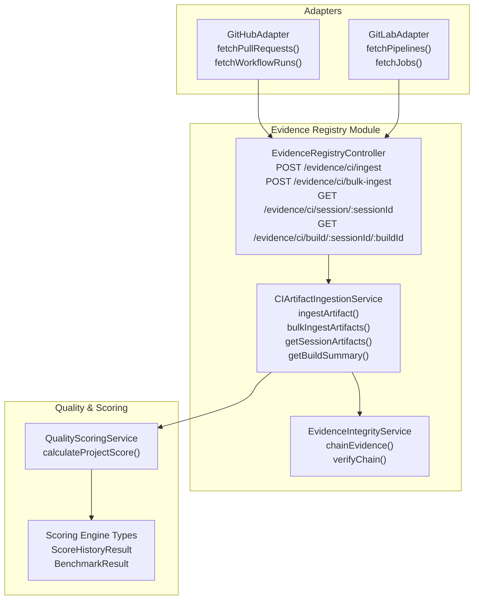
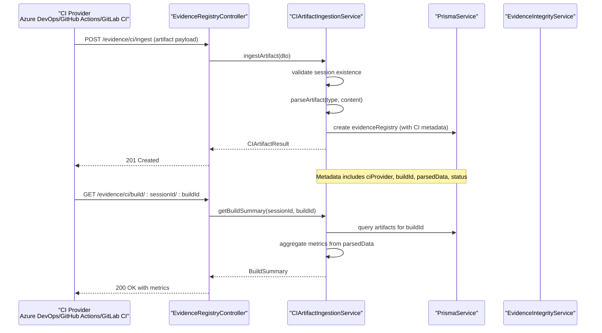
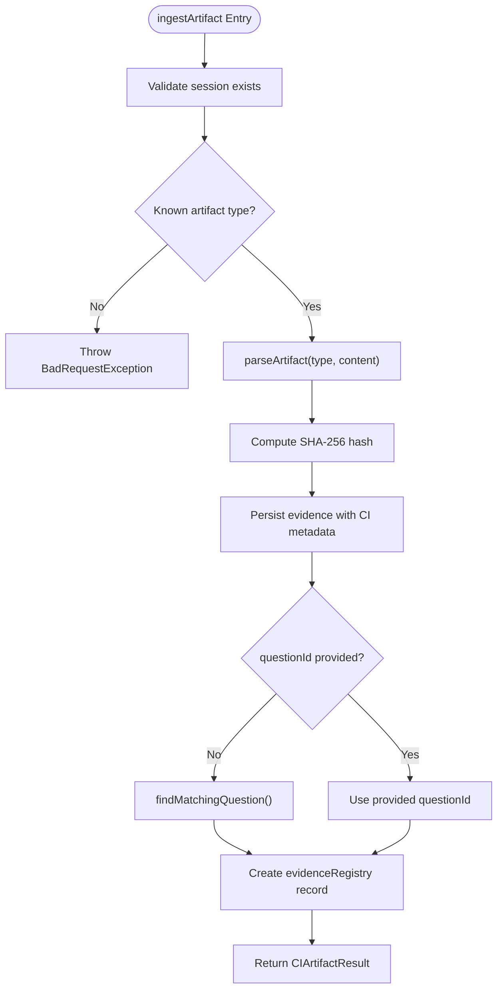
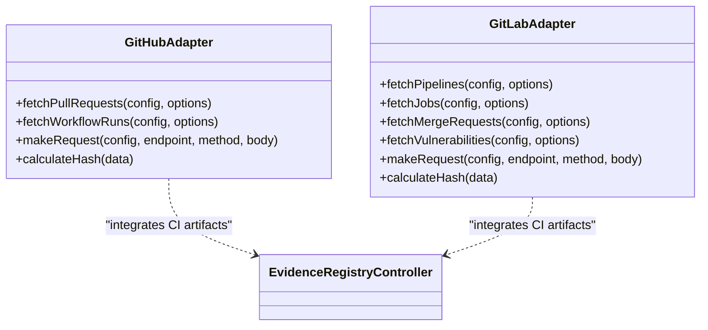
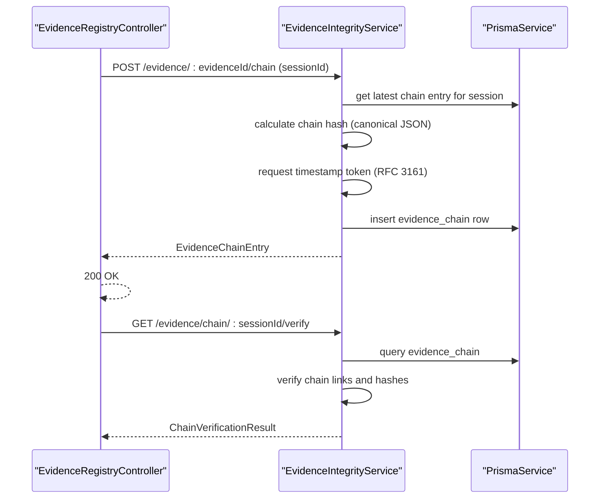
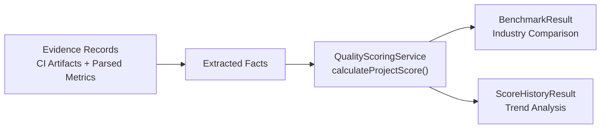
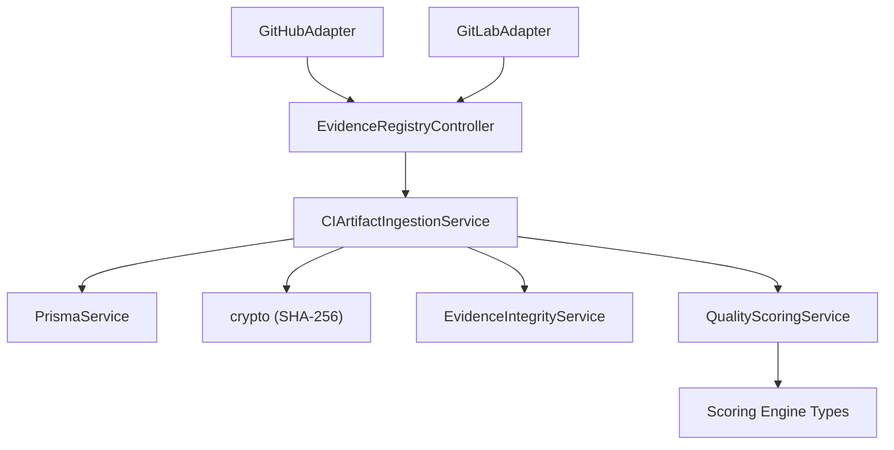

# CI Artifact Ingestion

<cite>
**Referenced Files in This Document**
- [evidence-registry.controller.ts](file://apps/api/src/modules/evidence-registry/evidence-registry.controller.ts)
- [ci-artifact-ingestion.service.ts](file://apps/api/src/modules/evidence-registry/ci-artifact-ingestion.service.ts)
- [evidence-registry.service.ts](file://apps/api/src/modules/evidence-registry/evidence-registry.service.ts)
- [github.adapter.ts](file://apps/api/src/modules/adapters/github.adapter.ts)
- [gitlab.adapter.ts](file://apps/api/src/modules/adapters/gitlab.adapter.ts)
- [adapter-config.service.spec.ts](file://apps/api/src/modules/adapters/adapter-config.service.spec.ts)
- [quality-scoring.service.ts](file://apps/api/src/modules/quality-scoring/services/quality-scoring.service.ts)
- [scoring-types.ts](file://apps/api/src/modules/scoring-engine/scoring-types.ts)
- [evidence-integrity.service.ts](file://apps/api/src/modules/evidence-registry/evidence-integrity.service.ts)
</cite>

## Table of Contents
1. [Introduction](#introduction)
2. [Project Structure](#project-structure)
3. [Core Components](#core-components)
4. [Architecture Overview](#architecture-overview)
5. [Detailed Component Analysis](#detailed-component-analysis)
6. [Dependency Analysis](#dependency-analysis)
7. [Performance Considerations](#performance-considerations)
8. [Troubleshooting Guide](#troubleshooting-guide)
9. [Conclusion](#conclusion)

## Introduction
This document provides comprehensive API documentation for CI artifact ingestion endpoints that automatically capture and parse CI/CD evidence from Azure DevOps, GitHub Actions, and GitLab CI. It covers supported artifact formats (JUnit XML, Jest JSON, lcov, Cobertura, CycloneDX SBOM, SPDX, Trivy, OWASP DC), bulk ingestion, build summary aggregation, automatic metric extraction, session association, question auto-detection, and verification automation. It also explains how ingestion integrates with quality scoring and compliance tracking for DevSecOps pipelines.

## Project Structure
The CI artifact ingestion capability is implemented within the Evidence Registry module and exposed via dedicated controller endpoints. Supporting adapters integrate with CI providers, while quality scoring and integrity services provide downstream value.

**Diagram sources**
- [evidence-registry.controller.ts:371-462](file://apps/api/src/modules/evidence-registry/evidence-registry.controller.ts#L371-L462)
- [ci-artifact-ingestion.service.ts:98-163](file://apps/api/src/modules/evidence-registry/ci-artifact-ingestion.service.ts#L98-L163)
- [evidence-integrity.service.ts:63-133](file://apps/api/src/modules/evidence-registry/evidence-integrity.service.ts#L63-L133)
- [github.adapter.ts:173-200](file://apps/api/src/modules/adapters/github.adapter.ts#L173-L200)
- [gitlab.adapter.ts:25-45](file://apps/api/src/modules/adapters/gitlab.adapter.ts#L25-L45)
- [quality-scoring.service.ts:36-94](file://apps/api/src/modules/quality-scoring/services/quality-scoring.service.ts#L36-L94)
- [scoring-types.ts:56-109](file://apps/api/src/modules/scoring-engine/scoring-types.ts#L56-L109)

**Section sources**
- [evidence-registry.controller.ts:371-462](file://apps/api/src/modules/evidence-registry/evidence-registry.controller.ts#L371-L462)
- [ci-artifact-ingestion.service.ts:36-86](file://apps/api/src/modules/evidence-registry/ci-artifact-ingestion.service.ts#L36-L86)

## Core Components
- EvidenceRegistryController: Exposes CI artifact ingestion endpoints and build summary queries.
- CIArtifactIngestionService: Parses artifacts, extracts metrics, associates with sessions/questions, and persists evidence.
- EvidenceIntegrityService: Provides cryptographic chaining and verification for ingested evidence.
- Adapters (GitHub/GitLab): Integrate with CI providers to fetch artifacts and metadata.
- QualityScoringService: Consumes CI artifacts indirectly via evidence to compute quality scores and benchmarks.

**Section sources**
- [evidence-registry.controller.ts:371-462](file://apps/api/src/modules/evidence-registry/evidence-registry.controller.ts#L371-L462)
- [ci-artifact-ingestion.service.ts:98-163](file://apps/api/src/modules/evidence-registry/ci-artifact-ingestion.service.ts#L98-L163)
- [evidence-integrity.service.ts:63-133](file://apps/api/src/modules/evidence-registry/evidence-integrity.service.ts#L63-L133)
- [github.adapter.ts:173-200](file://apps/api/src/modules/adapters/github.adapter.ts#L173-L200)
- [gitlab.adapter.ts:25-45](file://apps/api/src/modules/adapters/gitlab.adapter.ts#L25-L45)
- [quality-scoring.service.ts:36-94](file://apps/api/src/modules/quality-scoring/services/quality-scoring.service.ts#L36-L94)

## Architecture Overview
The ingestion flow accepts CI artifacts, validates and parses them, computes integrity hashes, and stores structured metadata alongside parsed metrics. Build summaries aggregate metrics across artifacts for a given build.

**Diagram sources**
- [evidence-registry.controller.ts:371-462](file://apps/api/src/modules/evidence-registry/evidence-registry.controller.ts#L371-L462)
- [ci-artifact-ingestion.service.ts:98-163](file://apps/api/src/modules/evidence-registry/ci-artifact-ingestion.service.ts#L98-L163)
- [ci-artifact-ingestion.service.ts:655-709](file://apps/api/src/modules/evidence-registry/ci-artifact-ingestion.service.ts#L655-L709)

## Detailed Component Analysis

### EvidenceRegistryController API Endpoints
- POST /evidence/ci/ingest
  - Purpose: Ingest a single CI artifact as evidence.
  - Required fields: sessionId, ciProvider, buildId, artifactType, content.
  - Optional fields: questionId, buildNumber, pipelineName, branch, commitSha, autoVerify.
  - Supported artifact types: junit, jest, lcov, cobertura, cyclonedx, spdx, trivy, owasp.
  - Response: Created artifact result with parsed metrics and integrity hash.
- POST /evidence/ci/bulk-ingest
  - Purpose: Ingest multiple artifacts from a single build in one request.
  - Response: Bulk ingestion summary with counts and per-artifact results/errors.
- GET /evidence/ci/session/:sessionId
  - Purpose: Retrieve all CI artifacts ingested for a session.
- GET /evidence/ci/build/:sessionId/:buildId
  - Purpose: Retrieve aggregated metrics and artifact list for a specific CI build.

**Section sources**
- [evidence-registry.controller.ts:371-462](file://apps/api/src/modules/evidence-registry/evidence-registry.controller.ts#L371-L462)

### CIArtifactIngestionService Processing Logic
- Session validation: Ensures the session exists before ingestion.
- Artifact mapping: Routes to parser based on artifactType.
- Parsing and metrics extraction:
  - JUnit XML: Counts tests, failures, errors, skipped; duration and pass rate.
  - Jest JSON: Aggregates totals, durations, suites, and pass rate.
  - lcov: Computes line/function/branch coverage percentages.
  - Cobertura XML: Extracts line and branch rates plus coverage counts.
  - CycloneDX SBOM: Counts components by type, collects unique licenses.
  - SPDX: Counts packages and collects declared/concluded licenses.
  - Trivy: Aggregates vulnerability counts by severity and top critical/high items.
  - OWASP DC: Aggregates vulnerability counts by severity and top critical/high items.
- Integrity: Computes SHA-256 signature of raw content.
- Persistence: Creates evidence record embedding CI metadata (provider, build, branch, commit, parsedData).
- Question auto-detection: Finds a matching question by evidence type tags; falls back to an unanswered question in the session if none found.
- Build summary aggregation: Collects metrics from all artifacts for a buildId and returns a consolidated summary.

**Diagram sources**
- [ci-artifact-ingestion.service.ts:98-163](file://apps/api/src/modules/evidence-registry/ci-artifact-ingestion.service.ts#L98-L163)
- [ci-artifact-ingestion.service.ts:573-610](file://apps/api/src/modules/evidence-registry/ci-artifact-ingestion.service.ts#L573-L610)

**Section sources**
- [ci-artifact-ingestion.service.ts:98-163](file://apps/api/src/modules/evidence-registry/ci-artifact-ingestion.service.ts#L98-L163)
- [ci-artifact-ingestion.service.ts:205-228](file://apps/api/src/modules/evidence-registry/ci-artifact-ingestion.service.ts#L205-L228)
- [ci-artifact-ingestion.service.ts:233-254](file://apps/api/src/modules/evidence-registry/ci-artifact-ingestion.service.ts#L233-L254)
- [ci-artifact-ingestion.service.ts:260-284](file://apps/api/src/modules/evidence-registry/ci-artifact-ingestion.service.ts#L260-L284)
- [ci-artifact-ingestion.service.ts:289-351](file://apps/api/src/modules/evidence-registry/ci-artifact-ingestion.service.ts#L289-L351)
- [ci-artifact-ingestion.service.ts:356-373](file://apps/api/src/modules/evidence-registry/ci-artifact-ingestion.service.ts#L356-L373)
- [ci-artifact-ingestion.service.ts:378-405](file://apps/api/src/modules/evidence-registry/ci-artifact-ingestion.service.ts#L378-L405)
- [ci-artifact-ingestion.service.ts:428-457](file://apps/api/src/modules/evidence-registry/ci-artifact-ingestion.service.ts#L428-L457)
- [ci-artifact-ingestion.service.ts:462-516](file://apps/api/src/modules/evidence-registry/ci-artifact-ingestion.service.ts#L462-L516)
- [ci-artifact-ingestion.service.ts:521-567](file://apps/api/src/modules/evidence-registry/ci-artifact-ingestion.service.ts#L521-L567)
- [ci-artifact-ingestion.service.ts:573-610](file://apps/api/src/modules/evidence-registry/ci-artifact-ingestion.service.ts#L573-L610)
- [ci-artifact-ingestion.service.ts:655-709](file://apps/api/src/modules/evidence-registry/ci-artifact-ingestion.service.ts#L655-L709)

### Adapter Integration (CI Providers)
- GitHubAdapter: Fetches pull requests, workflow runs, releases, and related metadata. Can be extended to fetch artifacts programmatically.
- GitLabAdapter: Fetches pipelines, jobs, merge requests, releases, vulnerabilities, and test coverage reports. Can be extended to fetch artifacts programmatically.
- Adapter configuration validation ensures required credentials and parameters are present for each provider.

**Diagram sources**
- [github.adapter.ts:173-200](file://apps/api/src/modules/adapters/github.adapter.ts#L173-L200)
- [gitlab.adapter.ts:25-45](file://apps/api/src/modules/adapters/gitlab.adapter.ts#L25-L45)

**Section sources**
- [github.adapter.ts:173-200](file://apps/api/src/modules/adapters/github.adapter.ts#L173-L200)
- [gitlab.adapter.ts:25-45](file://apps/api/src/modules/adapters/gitlab.adapter.ts#L25-L45)
- [adapter-config.service.spec.ts:718-832](file://apps/api/src/modules/adapters/adapter-config.service.spec.ts#L718-L832)

### Evidence Integrity and Verification
- Cryptographic chaining: Links evidence items in a blockchain-style hash chain with sequence numbers and timestamp tokens.
- Verification: Validates chain integrity, computed hashes, and evidence tampering.
- Integration: Ingested CI artifacts can be chained for immutable audit trails.

**Diagram sources**
- [evidence-registry.controller.ts:287-336](file://apps/api/src/modules/evidence-registry/evidence-registry.controller.ts#L287-L336)
- [evidence-integrity.service.ts:63-133](file://apps/api/src/modules/evidence-registry/evidence-integrity.service.ts#L63-L133)
- [evidence-integrity.service.ts:198-233](file://apps/api/src/modules/evidence-registry/evidence-integrity.service.ts#L198-L233)

**Section sources**
- [evidence-integrity.service.ts:63-133](file://apps/api/src/modules/evidence-registry/evidence-integrity.service.ts#L63-L133)
- [evidence-integrity.service.ts:198-233](file://apps/api/src/modules/evidence-registry/evidence-integrity.service.ts#L198-L233)

### Quality Scoring and Compliance Tracking
- QualityScoringService: Calculates project quality scores from extracted facts and dimensions, enabling compliance and readiness assessments.
- Scoring engine types: Provide historical trends, benchmarks, and dimension comparisons to support real-time compliance tracking.

**Diagram sources**
- [quality-scoring.service.ts:36-94](file://apps/api/src/modules/quality-scoring/services/quality-scoring.service.ts#L36-L94)
- [scoring-types.ts:56-109](file://apps/api/src/modules/scoring-engine/scoring-types.ts#L56-L109)

**Section sources**
- [quality-scoring.service.ts:36-94](file://apps/api/src/modules/quality-scoring/services/quality-scoring.service.ts#L36-L94)
- [scoring-types.ts:56-109](file://apps/api/src/modules/scoring-engine/scoring-types.ts#L56-L109)

## Dependency Analysis
- Controller depends on CIArtifactIngestionService for ingestion logic.
- CIArtifactIngestionService depends on PrismaService for persistence and crypto for hashing.
- EvidenceIntegrityService depends on PrismaService and external TSA for timestamping.
- Adapters (GitHub/GitLab) depend on HTTP clients and provider APIs; they can feed artifacts into the ingestion pipeline.
- Quality scoring consumes evidence/facts to derive compliance insights.

**Diagram sources**
- [evidence-registry.controller.ts:61-66](file://apps/api/src/modules/evidence-registry/evidence-registry.controller.ts#L61-L66)
- [ci-artifact-ingestion.service.ts:88-91](file://apps/api/src/modules/evidence-registry/ci-artifact-ingestion.service.ts#L88-L91)
- [evidence-integrity.service.ts:45-53](file://apps/api/src/modules/evidence-registry/evidence-integrity.service.ts#L45-L53)
- [github.adapter.ts:132-164](file://apps/api/src/modules/adapters/github.adapter.ts#L132-L164)
- [gitlab.adapter.ts:192-200](file://apps/api/src/modules/adapters/gitlab.adapter.ts#L192-L200)
- [quality-scoring.service.ts:28-31](file://apps/api/src/modules/quality-scoring/services/quality-scoring.service.ts#L28-L31)
- [scoring-types.ts:56-109](file://apps/api/src/modules/scoring-engine/scoring-types.ts#L56-L109)

**Section sources**
- [evidence-registry.controller.ts:61-66](file://apps/api/src/modules/evidence-registry/evidence-registry.controller.ts#L61-L66)
- [ci-artifact-ingestion.service.ts:88-91](file://apps/api/src/modules/evidence-registry/ci-artifact-ingestion.service.ts#L88-L91)
- [evidence-integrity.service.ts:45-53](file://apps/api/src/modules/evidence-registry/evidence-integrity.service.ts#L45-L53)
- [github.adapter.ts:132-164](file://apps/api/src/modules/adapters/github.adapter.ts#L132-L164)
- [gitlab.adapter.ts:192-200](file://apps/api/src/modules/adapters/gitlab.adapter.ts#L192-L200)
- [quality-scoring.service.ts:28-31](file://apps/api/src/modules/quality-scoring/services/quality-scoring.service.ts#L28-L31)
- [scoring-types.ts:56-109](file://apps/api/src/modules/scoring-engine/scoring-types.ts#L56-L109)

## Performance Considerations
- Bulk ingestion reduces round-trips and improves throughput for multi-artifact builds.
- Parsing logic uses lightweight string/JSON operations; consider streaming parsers for very large artifacts.
- Build summary aggregation scans recent artifacts; ensure appropriate limits and indexing on metadata fields.
- Integrity operations involve cryptographic computations and network calls; batch operations where feasible.

## Troubleshooting Guide
- Unknown artifact type: Ensure artifactType matches supported values (junit, jest, lcov, cobertura, cyclonedx, spdx, trivy, owasp).
- Session not found: Verify sessionId exists prior to ingestion.
- Could not auto-detect question: Provide questionId explicitly or ensure matching questions exist for the evidence type.
- Build not found: Confirm buildId and sessionId combination exists for the build summary query.
- Integrity chain errors: Validate chain links and timestamps; ensure TSA connectivity and correct configuration.

**Section sources**
- [ci-artifact-ingestion.service.ts:104-112](file://apps/api/src/modules/evidence-registry/ci-artifact-ingestion.service.ts#L104-L112)
- [ci-artifact-ingestion.service.ts:607-610](file://apps/api/src/modules/evidence-registry/ci-artifact-ingestion.service.ts#L607-L610)
- [evidence-registry.controller.ts:456-461](file://apps/api/src/modules/evidence-registry/evidence-registry.controller.ts#L456-L461)
- [evidence-integrity.service.ts:96-101](file://apps/api/src/modules/evidence-registry/evidence-integrity.service.ts#L96-L101)

## Conclusion
The CI artifact ingestion system provides a robust, extensible foundation for automated evidence collection from CI/CD pipelines. It supports multiple providers and artifact formats, performs automatic metric extraction, and integrates with integrity and quality scoring services to enable real-time compliance tracking and DevSecOps workflows. Bulk ingestion and build summaries streamline operations, while question auto-detection and verification automation reduce manual effort and improve auditability.