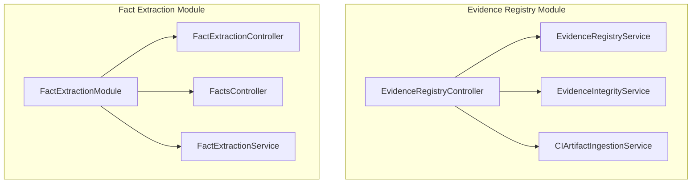
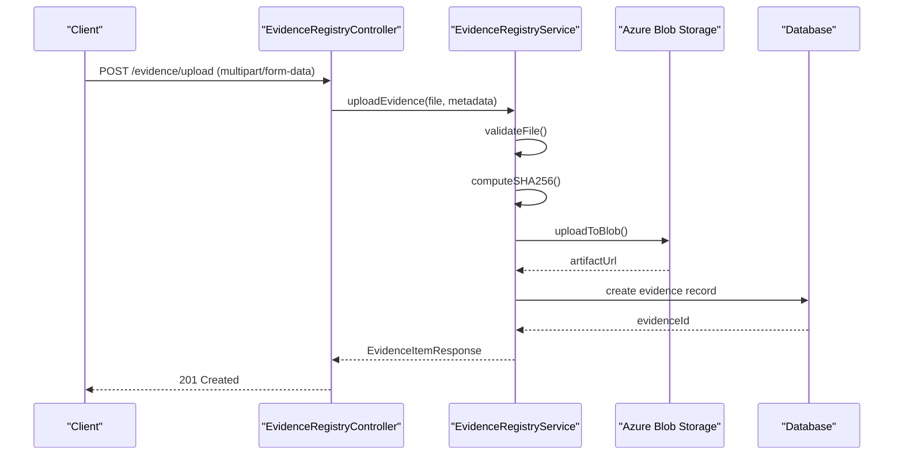
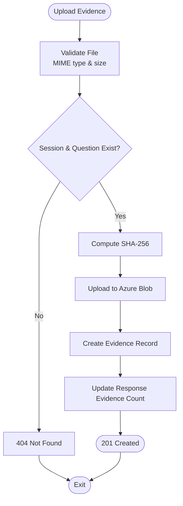
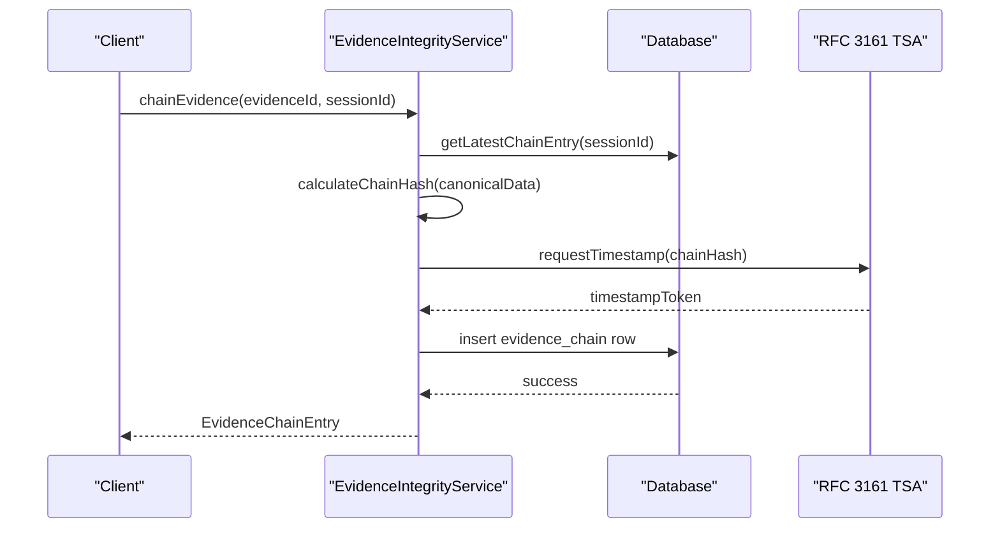
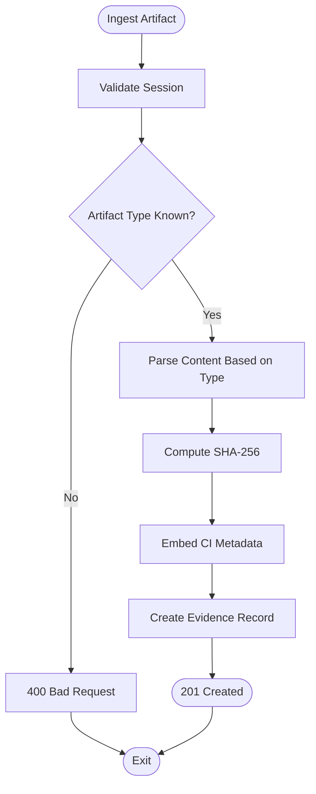
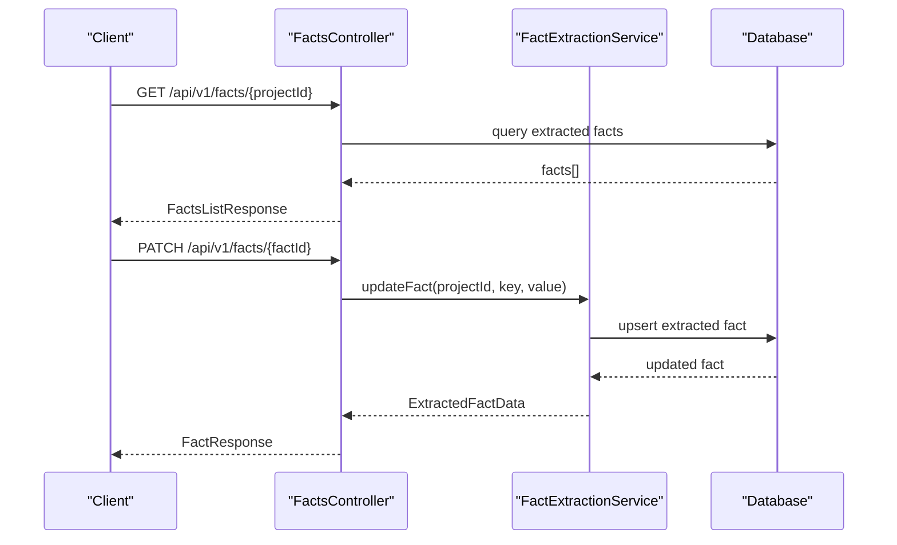
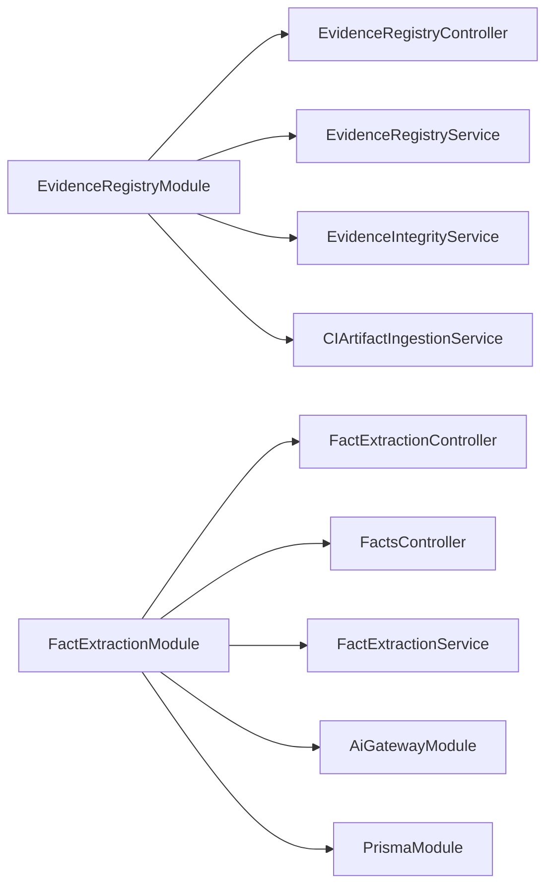
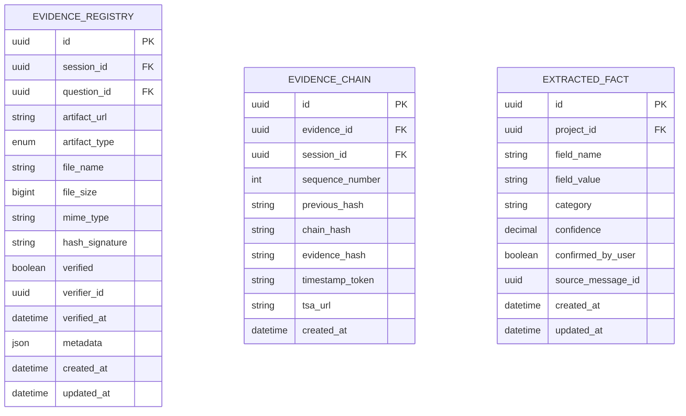

# Evidence & Compliance API

<cite>
**Referenced Files in This Document**
- [evidence-registry.module.ts](file://apps/api/src/modules/evidence-registry/evidence-registry.module.ts)
- [evidence-registry.controller.ts](file://apps/api/src/modules/evidence-registry/evidence-registry.controller.ts)
- [evidence-registry.service.ts](file://apps/api/src/modules/evidence-registry/evidence-registry.service.ts)
- [evidence-integrity.service.ts](file://apps/api/src/modules/evidence-registry/evidence-integrity.service.ts)
- [ci-artifact-ingestion.service.ts](file://apps/api/src/modules/evidence-registry/ci-artifact-ingestion.service.ts)
- [fact-extraction.module.ts](file://apps/api/src/modules/fact-extraction/fact-extraction.module.ts)
- [fact-extraction.controller.ts](file://apps/api/src/modules/fact-extraction/fact-extraction.controller.ts)
- [facts.controller.ts](file://apps/api/src/modules/fact-extraction/facts.controller.ts)
- [fact-extraction.service.ts](file://apps/api/src/modules/fact-extraction/services/fact-extraction.service.ts)
</cite>

## Table of Contents
1. [Introduction](#introduction)
2. [Project Structure](#project-structure)
3. [Core Components](#core-components)
4. [Architecture Overview](#architecture-overview)
5. [Detailed Component Analysis](#detailed-component-analysis)
6. [Dependency Analysis](#dependency-analysis)
7. [Performance Considerations](#performance-considerations)
8. [Troubleshooting Guide](#troubleshooting-guide)
9. [Conclusion](#conclusion)
10. [Appendices](#appendices)

## Introduction
This document provides comprehensive API documentation for Quiz-to-Build’s Evidence Registry and Compliance endpoints. It covers:
- Artifact ingestion APIs for manual and CI/CD sources
- Evidence collection and verification workflows
- Compliance tracking and integrity verification
- Automated evidence processing and CI/CD integration
- Fact extraction endpoints and data validation services
- Evidence repository management, metadata handling, and reporting
- Administrative controls, bulk processing, and dashboards

The APIs are implemented under the Evidence Registry and Fact Extraction modules, with strong emphasis on integrity, verifiability, and compliance-ready evidence handling.

## Project Structure
The Evidence Registry and Fact Extraction capabilities are organized as NestJS modules with dedicated controllers, services, and supporting DTOs. The Evidence Registry module integrates Azure Blob Storage, cryptographic chaining, RFC 3161 timestamps, and CI artifact ingestion. The Fact Extraction module integrates with an AI Gateway to extract structured facts from conversations.

**Diagram sources**
- [evidence-registry.module.ts:1-27](file://apps/api/src/modules/evidence-registry/evidence-registry.module.ts#L1-L27)
- [fact-extraction.module.ts:1-26](file://apps/api/src/modules/fact-extraction/fact-extraction.module.ts#L1-L26)

**Section sources**
- [evidence-registry.module.ts:1-27](file://apps/api/src/modules/evidence-registry/evidence-registry.module.ts#L1-L27)
- [fact-extraction.module.ts:1-26](file://apps/api/src/modules/fact-extraction/fact-extraction.module.ts#L1-L26)

## Core Components
- EvidenceRegistryController: Exposes REST endpoints for uploading, verifying, listing, deleting, and auditing evidence; integrity chain operations; and CI artifact ingestion.
- EvidenceRegistryService: Handles file validation, Azure Blob Storage upload, SHA-256 hashing, verification workflow, coverage updates, and audit trails.
- EvidenceIntegrityService: Implements blockchain-style hash chaining, RFC 3161 timestamping, and comprehensive integrity verification.
- CIArtifactIngestionService: Parses CI artifacts (JUnit, Jest, lcov, Cobertura, CycloneDX, SPDX, Trivy, OWASP), computes hashes, and creates evidence records with metadata.
- FactsController and FactExtractionService: Manage extracted facts, including retrieval, updates, verification, and AI-driven extraction.

**Section sources**
- [evidence-registry.controller.ts:1-463](file://apps/api/src/modules/evidence-registry/evidence-registry.controller.ts#L1-L463)
- [evidence-registry.service.ts:1-953](file://apps/api/src/modules/evidence-registry/evidence-registry.service.ts#L1-L953)
- [evidence-integrity.service.ts:1-608](file://apps/api/src/modules/evidence-registry/evidence-integrity.service.ts#L1-L608)
- [ci-artifact-ingestion.service.ts:1-871](file://apps/api/src/modules/evidence-registry/ci-artifact-ingestion.service.ts#L1-L871)
- [facts.controller.ts:1-230](file://apps/api/src/modules/fact-extraction/facts.controller.ts#L1-L230)
- [fact-extraction.service.ts:1-423](file://apps/api/src/modules/fact-extraction/services/fact-extraction.service.ts#L1-L423)

## Architecture Overview
The Evidence Registry and Fact Extraction APIs form a cohesive compliance and evidence management layer:
- Controllers define endpoints and apply guards and interceptors.
- Services encapsulate business logic, integrate with Azure Blob Storage, and manage database interactions.
- Integrity and CI ingestion services provide specialized compliance features.
- Fact extraction integrates with an AI Gateway to produce validated, structured facts.

**Diagram sources**
- [evidence-registry.controller.ts:68-141](file://apps/api/src/modules/evidence-registry/evidence-registry.controller.ts#L68-L141)
- [evidence-registry.service.ts:158-208](file://apps/api/src/modules/evidence-registry/evidence-registry.service.ts#L158-L208)

**Section sources**
- [evidence-registry.controller.ts:68-141](file://apps/api/src/modules/evidence-registry/evidence-registry.controller.ts#L68-L141)
- [evidence-registry.service.ts:158-208](file://apps/api/src/modules/evidence-registry/evidence-registry.service.ts#L158-L208)

## Detailed Component Analysis

### Evidence Registry API
Endpoints for evidence lifecycle management, verification, and integrity.

- Authentication and Authorization
  - All Evidence Registry endpoints require JWT bearer authentication and enforce role-based access for verification actions.

- Upload Evidence
  - Method: POST /evidence/upload
  - Consumes: multipart/form-data
  - Required fields: file, sessionId, questionId, artifactType
  - Optional fields: fileName
  - Validation: file type whitelist, size limit, existence of session/question
  - Behavior: computes SHA-256, uploads to Azure Blob Storage, creates evidence record, updates response evidence count

- Verify Evidence
  - Method: POST /evidence/verify
  - Required fields: evidenceId, verified (boolean)
  - Optional fields: coverageValue (updates response coverage if verified)
  - Access: Verifiers only

- Get Evidence by ID
  - Method: GET /evidence/{evidenceId}

- List Evidence
  - Method: GET /evidence
  - Query filters: sessionId, questionId, artifactType, verified

- Evidence Statistics
  - Method: GET /evidence/stats/{sessionId}
  - Returns totals, verified/pending counts, and counts by artifact type

- Delete Evidence
  - Method: DELETE /evidence/{evidenceId}
  - Constraints: unverified evidence only

- Integrity Chain Operations
  - Chain Evidence: POST /evidence/{evidenceId}/chain
  - Get Chain: GET /evidence/chain/{sessionId}
  - Verify Chain: GET /evidence/chain/{sessionId}/verify
  - Verify Single Integrity: GET /evidence/{evidenceId}/integrity
  - Generate Integrity Report: GET /evidence/integrity-report/{sessionId}

- CI Artifact Ingestion
  - Ingest Artifact: POST /evidence/ci/ingest
    - Supports: azure-devops, github-actions, gitlab-ci
    - Artifact types: junit, jest, lcov, cobertura, cyclonedx, spdx, trivy, owasp
  - Bulk Ingest: POST /evidence/ci/bulk-ingest
  - Session Artifacts: GET /evidence/ci/session/{sessionId}
  - Build Summary: GET /evidence/ci/build/{sessionId}/{buildId}

**Diagram sources**
- [evidence-registry.controller.ts:68-141](file://apps/api/src/modules/evidence-registry/evidence-registry.controller.ts#L68-L141)
- [evidence-registry.service.ts:158-208](file://apps/api/src/modules/evidence-registry/evidence-registry.service.ts#L158-L208)

**Section sources**
- [evidence-registry.controller.ts:68-462](file://apps/api/src/modules/evidence-registry/evidence-registry.controller.ts#L68-L462)
- [evidence-registry.service.ts:158-355](file://apps/api/src/modules/evidence-registry/evidence-registry.service.ts#L158-L355)

### Evidence Integrity Service
Provides cryptographic integrity guarantees and compliance-ready verification.

- Chain Evidence
  - Creates a blockchain-style chain entry linking to the previous chain hash
  - Computes canonical chain hash and requests RFC 3161 timestamp token when available

- Verify Chain
  - Validates chain continuity, hash correctness, and evidence hash consistency

- Verify Single Evidence Integrity
  - Comprehensive check: hash presence, chain linkage, timestamp status

- Integrity Report
  - Aggregated report per session with chain verification and per-item status

**Diagram sources**
- [evidence-integrity.service.ts:59-133](file://apps/api/src/modules/evidence-registry/evidence-integrity.service.ts#L59-L133)

**Section sources**
- [evidence-integrity.service.ts:55-503](file://apps/api/src/modules/evidence-registry/evidence-integrity.service.ts#L55-L503)

### CI Artifact Ingestion Service
Automates evidence ingestion from CI/CD pipelines with standardized parsing and metadata embedding.

- Supported Providers: Azure DevOps, GitHub Actions, GitLab CI
- Supported Types: Test reports (JUnit, Jest), Coverage (lcov, Cobertura), SBOM (CycloneDX, SPDX), Security scans (Trivy, OWASP)
- Automatic Question Mapping: When questionId is omitted, service attempts to map evidence type to a matching question
- Metadata Embedding: CI metadata stored in evidence record metadata JSON field
- Auto-verify Option: Optional automatic verification flag

**Diagram sources**
- [ci-artifact-ingestion.service.ts:93-163](file://apps/api/src/modules/evidence-registry/ci-artifact-ingestion.service.ts#L93-L163)

**Section sources**
- [ci-artifact-ingestion.service.ts:21-710](file://apps/api/src/modules/evidence-registry/ci-artifact-ingestion.service.ts#L21-L710)

### Fact Extraction API
Manages structured business facts extracted from conversations.

- Retrieve Project Facts
  - Method: GET /api/v1/facts/{projectId}
  - Returns facts grouped by category with counts and confidence levels

- Update Fact
  - Method: PATCH /api/v1/facts/{factId}
  - Fields: fieldValue, isVerified

- Delete Fact
  - Method: DELETE /api/v1/facts/{factId}

- Verify All Facts
  - Method: POST /api/v1/facts/{projectId}/verify-all
  - Marks all facts for the project as verified

- AI-Driven Extraction
  - FactExtractionService orchestrates AI Gateway calls, applies extraction schemas, validates completeness, and persists results

**Diagram sources**
- [facts.controller.ts:65-191](file://apps/api/src/modules/fact-extraction/facts.controller.ts#L65-L191)
- [fact-extraction.service.ts:144-187](file://apps/api/src/modules/fact-extraction/services/fact-extraction.service.ts#L144-L187)

**Section sources**
- [facts.controller.ts:60-230](file://apps/api/src/modules/fact-extraction/facts.controller.ts#L60-L230)
- [fact-extraction.service.ts:24-423](file://apps/api/src/modules/fact-extraction/services/fact-extraction.service.ts#L24-L423)

## Dependency Analysis
- Evidence Registry Module depends on PrismaModule for database access and integrates Azure Blob Storage for artifact storage.
- EvidenceIntegrityService relies on RFC 3161 TSA configuration and performs raw SQL queries for chain management.
- CIArtifactIngestionService parses artifacts and embeds metadata into evidence records.
- Fact Extraction Module depends on AiGatewayModule for AI-driven extraction and PrismaModule for persistence.

**Diagram sources**
- [evidence-registry.module.ts:1-27](file://apps/api/src/modules/evidence-registry/evidence-registry.module.ts#L1-L27)
- [fact-extraction.module.ts:1-26](file://apps/api/src/modules/fact-extraction/fact-extraction.module.ts#L1-L26)

**Section sources**
- [evidence-registry.module.ts:1-27](file://apps/api/src/modules/evidence-registry/evidence-registry.module.ts#L1-L27)
- [fact-extraction.module.ts:1-26](file://apps/api/src/modules/fact-extraction/fact-extraction.module.ts#L1-L26)

## Performance Considerations
- File Uploads: SHA-256 hashing and Azure Blob Storage uploads occur synchronously during upload; consider asynchronous processing for large files.
- Bulk Operations: EvidenceRegistryService supports bulk verification with a single transaction to minimize round trips.
- CI Parsing: Artifact parsing uses lightweight parsers; for very large reports, consider streaming or pagination.
- Integrity Checks: Chain verification iterates through entries; caching or indexing may improve performance for long chains.

## Troubleshooting Guide
- File Upload Failures
  - Causes: Invalid MIME type, size exceeded, storage not configured
  - Resolution: Validate allowed types and size limits; ensure Azure Blob configuration is set

- Evidence Not Found
  - Occurs when retrieving, verifying, or deleting evidence with invalid IDs
  - Resolution: Confirm evidenceId and session/question existence

- Integrity Verification Errors
  - Chain broken, hash mismatch, or evidence modified since chaining
  - Resolution: Recreate chain entries and re-verify; ensure immutable storage

- CI Artifact Parsing Errors
  - Unsupported artifact type or malformed content
  - Resolution: Provide supported artifactType and valid content; supply questionId if auto-mapping fails

**Section sources**
- [evidence-registry.service.ts:418-434](file://apps/api/src/modules/evidence-registry/evidence-registry.service.ts#L418-L434)
- [evidence-integrity.service.ts:197-274](file://apps/api/src/modules/evidence-registry/evidence-integrity.service.ts#L197-L274)
- [ci-artifact-ingestion.service.ts:108-112](file://apps/api/src/modules/evidence-registry/ci-artifact-ingestion.service.ts#L108-L112)

## Conclusion
The Evidence Registry and Compliance APIs deliver a robust, integrity-first framework for managing evidence, integrating CI/CD artifacts, and extracting structured facts. They support cryptographic chaining, timestamping, and comprehensive verification, enabling compliance-ready workflows with secure storage and auditable trails.

## Appendices

### API Definitions

- Evidence Registry Endpoints
  - POST /evidence/upload
    - Body: multipart/form-data with file, sessionId, questionId, artifactType, optional fileName
    - Responses: 201 Created with EvidenceItemResponse; 400 Bad Request on validation errors
  - POST /evidence/verify
    - Body: JSON with evidenceId, verified, optional coverageValue
    - Responses: 200 OK with EvidenceItemResponse; 404 Not Found
  - GET /evidence/{evidenceId}
    - Responses: 200 OK with EvidenceItemResponse; 404 Not Found
  - GET /evidence
    - Query: sessionId, questionId, artifactType, verified
    - Responses: 200 OK with array of EvidenceItemResponse
  - GET /evidence/stats/{sessionId}
    - Responses: 200 OK with stats object
  - DELETE /evidence/{evidenceId}
    - Responses: 204 No Content; 403 Forbidden for verified evidence; 404 Not Found
  - POST /evidence/{evidenceId}/chain
    - Body: JSON with sessionId
    - Responses: 200 OK with EvidenceChainEntry; 404 Not Found
  - GET /evidence/chain/{sessionId}
    - Responses: 200 OK with array of EvidenceChainEntry
  - GET /evidence/chain/{sessionId}/verify
    - Responses: 200 OK with ChainVerificationResult
  - GET /evidence/{evidenceId}/integrity
    - Responses: 200 OK with ComprehensiveIntegrityResult
  - GET /evidence/integrity-report/{sessionId}
    - Responses: 200 OK with SessionIntegrityReport
  - POST /evidence/ci/ingest
    - Body: JSON with ciProvider, buildId, artifactType, content, optional questionId, sessionId, buildNumber, pipelineName, branch, commitSha, autoVerify
    - Responses: 201 Created with CIArtifactResult; 400 Bad Request
  - POST /evidence/ci/bulk-ingest
    - Body: JSON with sessionId, ciProvider, buildId, buildNumber, pipelineName, branch, commitSha, artifacts[]
    - Responses: 201 Created with BulkIngestResult
  - GET /evidence/ci/session/{sessionId}
    - Responses: 200 OK with array of CIArtifactSummary
  - GET /evidence/ci/build/{sessionId}/{buildId}
    - Responses: 200 OK with BuildSummary; 404 Not Found

- Fact Extraction Endpoints
  - GET /api/v1/facts/{projectId}
    - Responses: 200 OK with FactsListResponse
  - PATCH /api/v1/facts/{factId}
    - Body: JSON with optional fieldValue, optional isVerified
    - Responses: 200 OK with FactResponse; 404 Not Found
  - DELETE /api/v1/facts/{factId}
    - Responses: 200 OK; 404 Not Found
  - POST /api/v1/facts/{projectId}/verify-all
    - Responses: 200 OK; 404 Not Found

### Data Models

**Diagram sources**
- [evidence-registry.service.ts:514-545](file://apps/api/src/modules/evidence-registry/evidence-registry.service.ts#L514-L545)
- [evidence-integrity.service.ts:518-529](file://apps/api/src/modules/evidence-registry/evidence-integrity.service.ts#L518-L529)
- [fact-extraction.service.ts:192-206](file://apps/api/src/modules/fact-extraction/services/fact-extraction.service.ts#L192-L206)

### Examples

- Evidence Submission Workflow
  - Steps: Authenticate -> Upload file -> Receive EvidenceItemResponse -> Optionally verify -> Track coverage updates
  - Use cases: Attach test results, coverage reports, SBOMs, screenshots, or documents to a specific question response

- CI Artifact Ingestion Workflow
  - Steps: Authenticate -> Send artifact content -> Automatic parsing -> Evidence created with metadata -> Optional auto-verify -> Chain and timestamp for integrity

- Fact Extraction Workflow
  - Steps: Trigger extraction after a message -> AI extracts facts -> Persist facts -> Validate completeness -> Edit or verify as needed

- Audit Trail Generation
  - Use EvidenceRegistryService.getEvidenceAuditTrail to retrieve uploaded and verified events along with decision logs

- Compliance Reporting
  - Use EvidenceIntegrityService.generateIntegrityReport for session-level integrity summaries and EvidenceRegistryService.getEvidenceCoverageSummary for coverage insights

**Section sources**
- [evidence-registry.controller.ts:68-462](file://apps/api/src/modules/evidence-registry/evidence-registry.controller.ts#L68-L462)
- [evidence-registry.service.ts:622-694](file://apps/api/src/modules/evidence-registry/evidence-registry.service.ts#L622-L694)
- [evidence-integrity.service.ts:446-486](file://apps/api/src/modules/evidence-registry/evidence-integrity.service.ts#L446-L486)
- [ci-artifact-ingestion.service.ts:93-163](file://apps/api/src/modules/evidence-registry/ci-artifact-ingestion.service.ts#L93-L163)
- [facts.controller.ts:65-191](file://apps/api/src/modules/fact-extraction/facts.controller.ts#L65-L191)
- [fact-extraction.service.ts:189-243](file://apps/api/src/modules/fact-extraction/services/fact-extraction.service.ts#L189-L243)