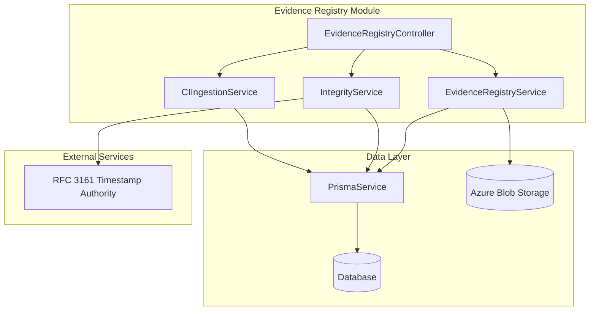
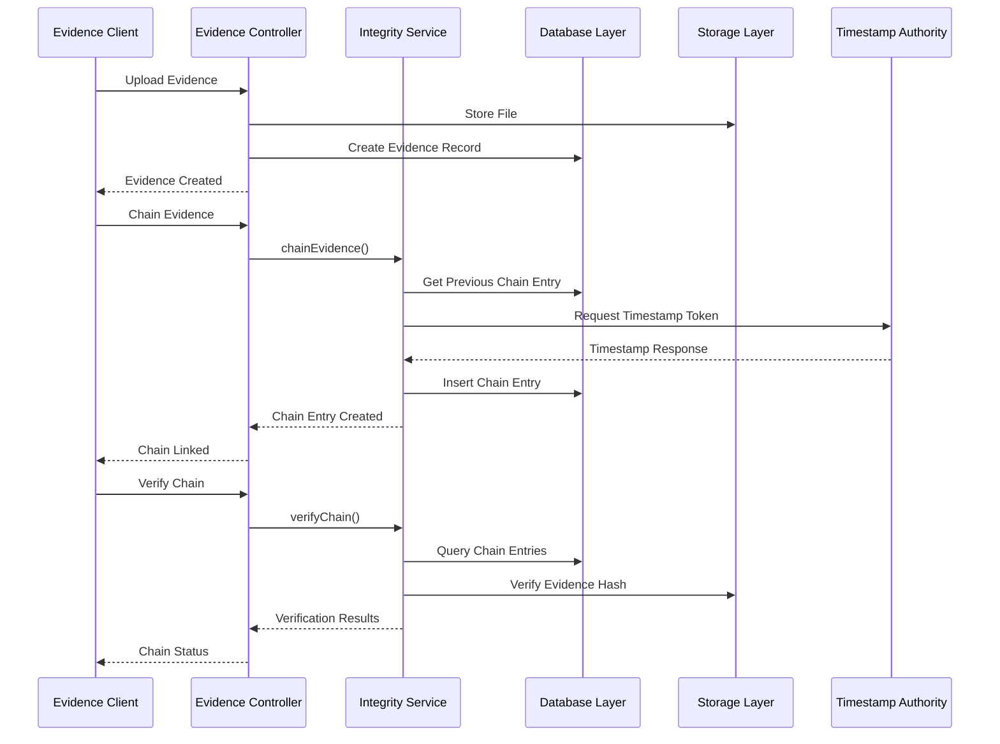
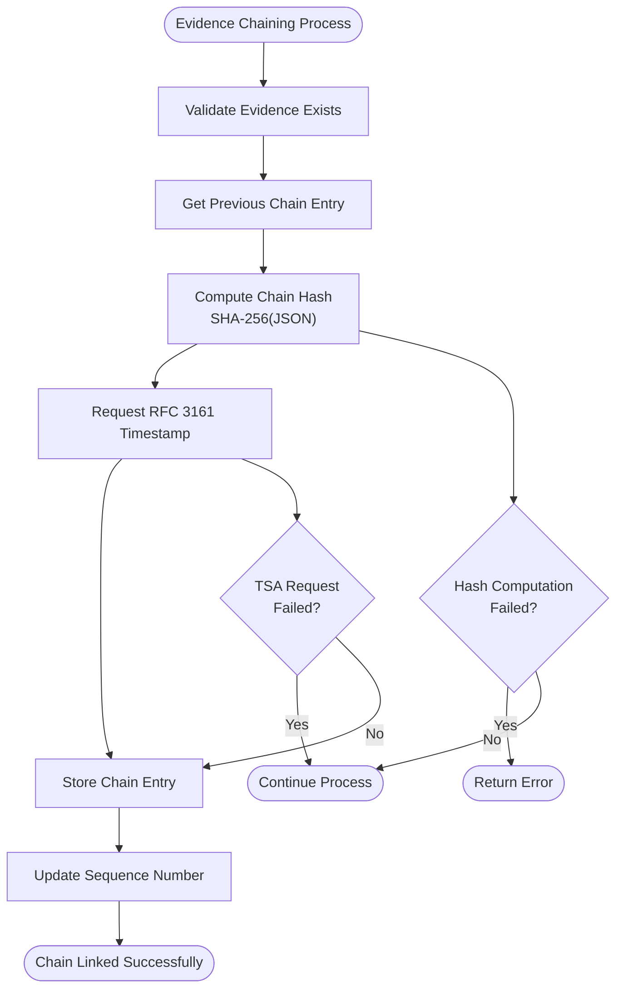
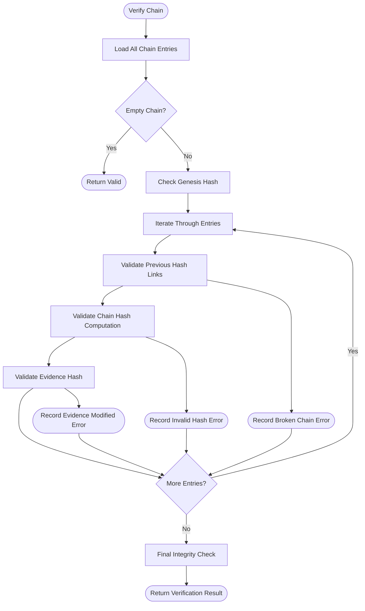
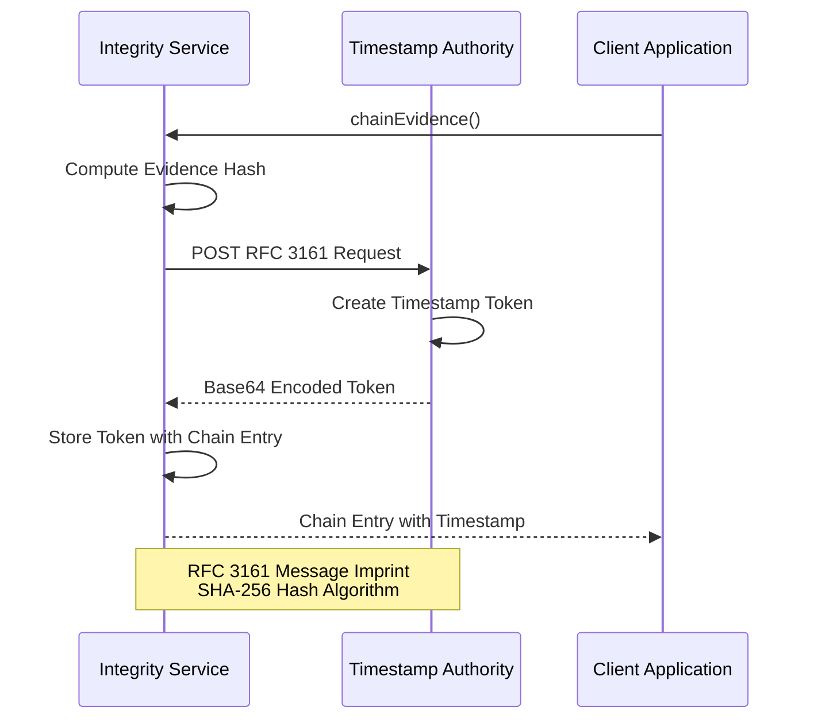

# Evidence Integrity Chain

<cite>
**Referenced Files in This Document**
- [evidence-integrity.service.ts](file://apps/api/src/modules/evidence-registry/evidence-integrity.service.ts)
- [evidence-registry.controller.ts](file://apps/api/src/modules/evidence-registry/evidence-registry.controller.ts)
- [evidence-registry.service.ts](file://apps/api/src/modules/evidence-registry/evidence-registry.service.ts)
- [evidence.dto.ts](file://apps/api/src/modules/evidence-registry/dto/evidence.dto.ts)
- [ci-artifact-ingestion.service.ts](file://apps/api/src/modules/evidence-registry/ci-artifact-ingestion.service.ts)
- [evidence-integrity.service.spec.ts](file://apps/api/src/modules/evidence-registry/evidence-integrity.service.spec.ts)
</cite>

## Table of Contents
1. [Introduction](#introduction)
2. [Project Structure](#project-structure)
3. [Core Components](#core-components)
4. [Architecture Overview](#architecture-overview)
5. [Detailed Component Analysis](#detailed-component-analysis)
6. [API Reference](#api-reference)
7. [Cryptographic Implementation](#cryptographic-implementation)
8. [Integrity Verification Workflows](#integrity-verification-workflows)
9. [RFC 3161 Timestamp Integration](#rfc-3161-timestamp-integration)
10. [Compliance and Audit Features](#compliance-and-audit-features)
11. [Performance Considerations](#performance-considerations)
12. [Troubleshooting Guide](#troubleshooting-guide)
13. [Conclusion](#conclusion)

## Introduction

The Evidence Integrity Chain system provides blockchain-inspired cryptographic integrity verification for digital evidence in the Quiz-to-Build platform. This system implements SHA-256 hash chain technology to create tamper-evident evidence trails, enabling comprehensive integrity verification workflows and compliance-ready audit capabilities.

The system transforms traditional evidence management by introducing cryptographic proofs that ensure evidence authenticity, integrity, and non-repudiation. Each piece of evidence becomes part of an immutable chain where modifications are immediately detectable, providing the foundation for regulatory compliance and forensic analysis.

## Project Structure

The evidence integrity chain implementation is organized within the evidence-registry module, following NestJS architectural patterns with clear separation of concerns:

**Diagram sources**
- [evidence-registry.controller.ts:61-66](file://apps/api/src/modules/evidence-registry/evidence-registry.controller.ts#L61-L66)
- [evidence-registry.service.ts:96-133](file://apps/api/src/modules/evidence-registry/evidence-registry.service.ts#L96-L133)
- [evidence-integrity.service.ts:36-40](file://apps/api/src/modules/evidence-registry/evidence-integrity.service.ts#L36-L40)

**Section sources**
- [evidence-registry.controller.ts:47-61](file://apps/api/src/modules/evidence-registry/evidence-registry.controller.ts#L47-L61)
- [evidence-registry.service.ts:86-96](file://apps/api/src/modules/evidence-registry/evidence-registry.service.ts#L86-L96)

## Core Components

The evidence integrity system consists of three primary components working in concert:

### EvidenceRegistryService
Handles basic evidence operations including file upload, SHA-256 hashing, and metadata management. Provides the foundational integrity checks through hash verification against stored files.

### EvidenceIntegrityService  
Implements the cryptographic hash chain functionality, RFC 3161 timestamp integration, and comprehensive verification workflows. Manages the evidence_chain database table and maintains chain integrity.

### CIArtifactIngestionService
Automatically processes CI/CD pipeline artifacts as evidence, parsing structured data from test reports, coverage metrics, SBOM files, and security scans while maintaining cryptographic integrity.

**Section sources**
- [evidence-registry.service.ts:86-96](file://apps/api/src/modules/evidence-registry/evidence-registry.service.ts#L86-L96)
- [evidence-integrity.service.ts:22-35](file://apps/api/src/modules/evidence-registry/evidence-integrity.service.ts#L22-L35)
- [ci-artifact-ingestion.service.ts:21-35](file://apps/api/src/modules/evidence-registry/ci-artifact-ingestion.service.ts#L21-L35)

## Architecture Overview

The system implements a distributed architecture with clear separation between cryptographic operations and data management:

**Diagram sources**
- [evidence-registry.controller.ts:284-305](file://apps/api/src/modules/evidence-registry/evidence-registry.controller.ts#L284-L305)
- [evidence-integrity.service.ts:92-133](file://apps/api/src/modules/evidence-registry/evidence-integrity.service.ts#L92-L133)
- [evidence-integrity.service.ts:200-274](file://apps/api/src/modules/evidence-registry/evidence-integrity.service.ts#L200-L274)

## Detailed Component Analysis

### Cryptographic Hash Chain Implementation

The integrity service implements a blockchain-inspired chain using SHA-256 hashes to create tamper-evident evidence trails:

**Diagram sources**
- [evidence-integrity.service.ts:92-133](file://apps/api/src/modules/evidence-registry/evidence-integrity.service.ts#L92-L133)
- [evidence-integrity.service.ts:279-282](file://apps/api/src/modules/evidence-registry/evidence-integrity.service.ts#L279-L282)

The chain implementation uses a genesis hash of 64 zeros for the first entry, with subsequent entries containing the previous chain hash as the previous_hash field. Each chain entry includes:

- **evidence_id**: References the evidence record
- **sequence_number**: Position in the chain
- **previous_hash**: Hash of the previous chain entry
- **chain_hash**: SHA-256 hash of the current chain entry data
- **evidence_hash**: SHA-256 hash of the evidence content
- **timestamp_token**: RFC 3161 timestamp if available
- **tsa_url**: Timestamp Authority endpoint used

**Section sources**
- [evidence-integrity.service.ts:8-20](file://apps/api/src/modules/evidence-registry/evidence-integrity.service.ts#L8-L20)
- [evidence-integrity.service.ts:409-444](file://apps/api/src/modules/evidence-registry/evidence-integrity.service.ts#L409-L444)

### Chain Verification Algorithm

The verification process ensures chain integrity through multiple validation steps:

**Diagram sources**
- [evidence-integrity.service.ts:200-274](file://apps/api/src/modules/evidence-registry/evidence-integrity.service.ts#L200-L274)
- [evidence-integrity.service.ts:248-261](file://apps/api/src/modules/evidence-registry/evidence-integrity.service.ts#L248-L261)

**Section sources**
- [evidence-integrity.service.ts:214-264](file://apps/api/src/modules/evidence-registry/evidence-integrity.service.ts#L214-L264)

### RFC 3161 Timestamp Authority Integration

The system integrates with RFC 3161-compliant timestamp authorities to provide cryptographically verifiable timestamps:

**Diagram sources**
- [evidence-integrity.service.ts:291-337](file://apps/api/src/modules/evidence-registry/evidence-integrity.service.ts#L291-L337)
- [evidence-integrity.service.ts:342-360](file://apps/api/src/modules/evidence-registry/evidence-integrity.service.ts#L342-L360)

The timestamp integration follows RFC 3161 specifications with SHA-256 hash algorithm and proper ASN.1 encoding of the timestamp request structure.

**Section sources**
- [evidence-integrity.service.ts:288-387](file://apps/api/src/modules/evidence-registry/evidence-integrity.service.ts#L288-L387)

## API Reference

### Evidence Chain Endpoints

The system provides comprehensive REST API endpoints for evidence integrity management:

#### Chain Evidence Endpoint
- **Method**: POST
- **Path**: `/evidence/{evidenceId}/chain`
- **Description**: Links evidence to the integrity chain with optional timestamp token
- **Parameters**: evidenceId (path), sessionId (body)
- **Response**: EvidenceChainEntry

#### Get Evidence Chain Endpoint
- **Method**: GET
- **Path**: `/evidence/chain/{sessionId}`
- **Description**: Retrieves complete hash chain for a session
- **Response**: Array of EvidenceChainEntry

#### Verify Chain Endpoint
- **Method**: GET
- **Path**: `/evidence/chain/{sessionId}/verify`
- **Description**: Verifies integrity of entire session chain
- **Response**: ChainVerificationResult

#### Verify Individual Evidence Endpoint
- **Method**: GET
- **Path**: `/evidence/{evidenceId}/integrity`
- **Description**: Comprehensive integrity check for single evidence
- **Response**: ComprehensiveIntegrityResult

#### Generate Integrity Report Endpoint
- **Method**: GET
- **Path**: `/evidence/integrity-report/{sessionId}`
- **Description**: Creates comprehensive integrity report for session
- **Response**: SessionIntegrityReport

**Section sources**
- [evidence-registry.controller.ts:284-365](file://apps/api/src/modules/evidence-registry/evidence-registry.controller.ts#L284-L365)

### Data Models

#### EvidenceChainEntry
Represents a single entry in the integrity chain:

| Field | Type | Description |
|-------|------|-------------|
| id | string | Unique identifier |
| evidenceId | string | Related evidence record |
| sessionId | string | Session identifier |
| sequenceNumber | number | Chain position |
| previousHash | string | Previous chain hash |
| chainHash | string | Current chain hash |
| evidenceHash | string | Evidence content hash |
| timestampToken | string | RFC 3161 timestamp |
| tsaUrl | string | Timestamp authority URL |
| createdAt | Date | Creation timestamp |

#### ChainVerificationResult
Contains results of chain verification:

| Field | Type | Description |
|-------|------|-------------|
| sessionId | string | Session identifier |
| isValid | boolean | Overall chain validity |
| totalEntries | number | Total chain entries |
| validEntries | number | Valid entries count |
| invalidEntries | ChainValidationError[] | Validation errors |
| verifiedAt | Date | Verification timestamp |

#### ComprehensiveIntegrityResult
Provides detailed integrity status for evidence:

| Field | Type | Description |
|-------|------|-------------|
| evidenceId | string | Evidence identifier |
| fileName | string | Original filename |
| originalHash | string | Stored hash value |
| checks | object | Integrity check results |
| chainPosition | object | Chain positioning info |
| timestamp | object | Timestamp information |
| overallStatus | enum | Final status classification |
| verifiedAt | Date | Verification timestamp |

**Section sources**
- [evidence-integrity.service.ts:518-583](file://apps/api/src/modules/evidence-registry/evidence-integrity.service.ts#L518-L583)

## Cryptographic Implementation

### SHA-256 Hash Chain Construction

The system implements a cryptographic hash chain using the following algorithm:

1. **Genesis Entry**: First entry uses 64-character zero hash as previous_hash
2. **Chain Hash Calculation**: SHA-256 of canonical JSON representation of entry data
3. **Canonical Serialization**: JSON keys sorted alphabetically for deterministic hashing
4. **Entry Data**: Includes evidenceId, evidenceHash, previousHash, sequenceNumber, timestamp, sessionId

### Evidence Hash Verification

The system performs dual verification:
- **Chain Hash**: Validates cryptographic chain integrity
- **Evidence Hash**: Ensures evidence content hasn't been modified since chaining
- **Timestamp Verification**: Confirms timestamp authority validation

### Security Guarantees

The implementation provides:
- **Integrity**: SHA-256 prevents evidence modification detection
- **Non-repudiation**: Timestamp tokens from trusted authorities
- **Traceability**: Complete audit trail of chain modifications
- **Tamper Evidence**: Any modification breaks the cryptographic chain

**Section sources**
- [evidence-integrity.service.ts:279-282](file://apps/api/src/modules/evidence-registry/evidence-integrity.service.ts#L279-L282)
- [evidence-integrity.service.ts:254-261](file://apps/api/src/modules/evidence-registry/evidence-integrity.service.ts#L254-L261)

## Integrity Verification Workflows

### Individual Evidence Verification

The comprehensive integrity verification process includes:

1. **Hash Storage Check**: Confirms evidence hash exists in database
2. **Chain Link Verification**: Validates evidence is properly linked in chain
3. **Timestamp Status**: Checks availability and validity of timestamp token
4. **Status Classification**: Determines overall verification status

Status classification hierarchy:
- **FULLY_VERIFIED**: Hash stored, chain linked, timestamp present
- **CHAIN_VERIFIED**: Hash stored, chain linked, no timestamp
- **HASH_ONLY**: Hash stored, not yet linked to chain
- **UNVERIFIED**: No hash stored

### Complete Session Chain Validation

The session-level verification provides:
- **Chain Integrity**: Overall chain validity assessment
- **Error Reporting**: Detailed breakdown of validation failures
- **Evidence Coverage**: Statistics on chained vs. unchained evidence
- **Timestamp Distribution**: Analysis of timestamp presence

### Forensic Analysis Capabilities

The system enables forensic analysis through:
- **Chain Reconstruction**: Complete evidence trail reconstruction
- **Modification Detection**: Precise identification of tampering attempts
- **Timeline Analysis**: Chronological ordering of evidence events
- **Audit Trail Generation**: Comprehensive documentation for compliance

**Section sources**
- [evidence-integrity.service.ts:396-444](file://apps/api/src/modules/evidence-registry/evidence-integrity.service.ts#L396-L444)
- [evidence-integrity.service.ts:449-486](file://apps/api/src/modules/evidence-registry/evidence-integrity.service.ts#L449-L486)

## RFC 3161 Timestamp Integration

### Timestamp Request Process

The system implements RFC 3161-compliant timestamp requests:

1. **Message Imprint Creation**: SHA-256 hash of evidence content
2. **ASN.1 Encoding**: Proper RFC 3161 message structure
3. **HTTP Transport**: POST request to timestamp authority
4. **Token Storage**: Base64-encoded timestamp token storage

### Timestamp Validation

Timestamp validation includes:
- **Format Verification**: Base64 token format validation
- **Authority Trust**: TSA endpoint verification
- **Algorithm Consistency**: SHA-256 algorithm confirmation
- **Timestamp Accuracy**: Time synchronization validation

### Compliance Benefits

RFC 3161 integration provides:
- **Legal Admissibility**: Court-recognized timestamp evidence
- **Regulatory Compliance**: SOX, HIPAA, and other regulatory requirements
- **Procedural Defensibility**: Automated, auditable timestamp processes
- **Cross-Platform Compatibility**: Industry-standard timestamp format

**Section sources**
- [evidence-integrity.service.ts:291-387](file://apps/api/src/modules/evidence-registry/evidence-integrity.service.ts#L291-L387)

## Compliance and Audit Features

### Audit Trail Generation

The system maintains comprehensive audit trails:
- **Evidence Lifecycle Tracking**: Complete evidence journey documentation
- **Chain Modification Logs**: Detailed change history for all chain operations
- **Verification Records**: Timestamped integrity verification results
- **Access Control Logs**: User actions and permissions tracking

### Regulatory Compliance

Built-in compliance support for:
- **ISO 27001**: Information security management
- **SOC 2**: Security and availability controls
- **GDPR**: Data protection and privacy requirements
- **SOX**: Financial reporting accuracy and internal controls

### Evidence Modification Detection

Advanced detection mechanisms:
- **Real-time Monitoring**: Continuous evidence integrity monitoring
- **Alert Systems**: Automated notifications for suspicious activities
- **Forensic Analysis Tools**: Built-in tools for investigation support
- **Immutable Records**: Tamper-evident evidence storage

**Section sources**
- [evidence-registry.service.ts:626-694](file://apps/api/src/modules/evidence-registry/evidence-registry.service.ts#L626-L694)
- [evidence-integrity.service.ts:595-607](file://apps/api/src/modules/evidence-registry/evidence-integrity.service.ts#L595-L607)

## Performance Considerations

### Database Optimization

The system implements several performance optimizations:
- **Raw SQL Queries**: Direct database access for chain operations
- **Batch Operations**: Efficient bulk processing for large datasets
- **Indexing Strategy**: Optimized database indexes for chain queries
- **Connection Pooling**: Efficient database connection management

### Scalability Features

Scalability considerations include:
- **Horizontal Partitioning**: Support for large-scale evidence volumes
- **Caching Strategies**: Intelligent caching for frequently accessed chains
- **Asynchronous Processing**: Non-blocking operations for heavy computations
- **Resource Management**: Efficient memory and CPU utilization

### Monitoring and Metrics

Comprehensive monitoring capabilities:
- **Performance Metrics**: Real-time system performance tracking
- **Error Analytics**: Detailed error pattern analysis
- **Usage Patterns**: Evidence chain usage trend analysis
- **Capacity Planning**: Resource utilization forecasting

## Troubleshooting Guide

### Common Issues and Solutions

**Evidence Not Found Errors**
- Verify evidence ID exists in database
- Check file storage connectivity
- Confirm proper authentication and authorization

**Chain Verification Failures**
- Validate timestamp authority accessibility
- Check cryptographic hash calculations
- Review database connection stability

**Timestamp Authority Issues**
- Verify TSA endpoint availability
- Check network connectivity to TSA
- Validate RFC 3161 request format

### Diagnostic Tools

Available diagnostic capabilities:
- **Chain Integrity Reports**: Detailed chain validation results
- **Hash Comparison Tools**: Evidence hash verification utilities
- **Network Diagnostics**: Connectivity and performance testing
- **System Health Checks**: Comprehensive system status monitoring

**Section sources**
- [evidence-integrity.service.spec.ts:534-569](file://apps/api/src/modules/evidence-registry/evidence-integrity.service.spec.ts#L534-L569)
- [evidence-integrity.service.spec.ts:953-978](file://apps/api/src/modules/evidence-registry/evidence-integrity.service.spec.ts#L953-L978)

## Conclusion

The Evidence Integrity Chain system provides a robust, blockchain-inspired solution for cryptographic evidence management. By implementing SHA-256 hash chains, RFC 3161 timestamp integration, and comprehensive verification workflows, the system delivers:

- **Tamper-Evident Evidence**: Immutable evidence trails with clear modification detection
- **Comprehensive Verification**: Multi-layered integrity checking for complete trust assurance
- **Regulatory Compliance**: Built-in support for industry standards and legal requirements
- **Forensic Readiness**: Advanced analysis capabilities for security investigations
- **Operational Efficiency**: Automated processes with minimal administrative overhead

The system's modular architecture ensures scalability, maintainability, and extensibility while providing the security guarantees essential for modern evidence management in regulated environments.