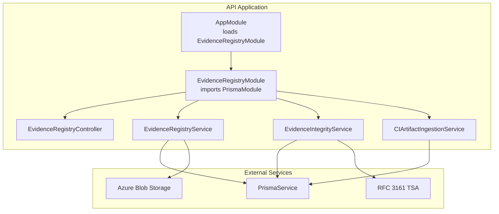
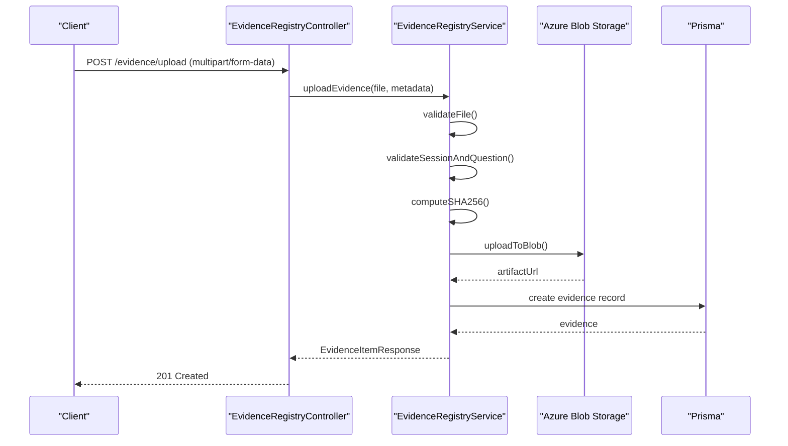
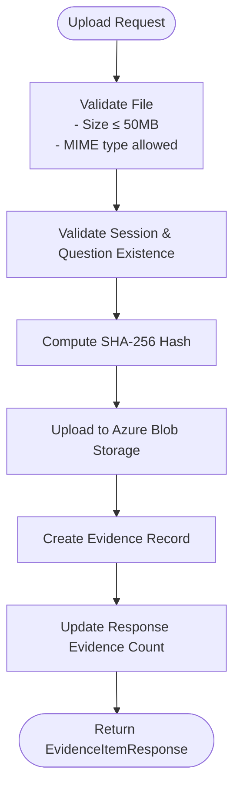
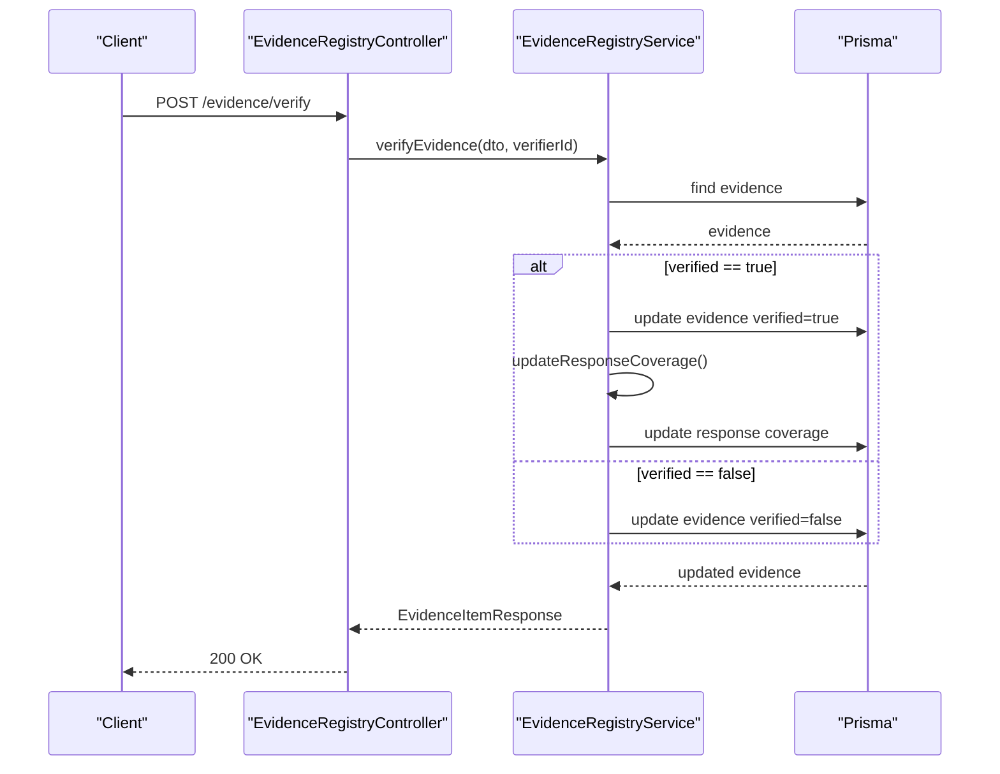
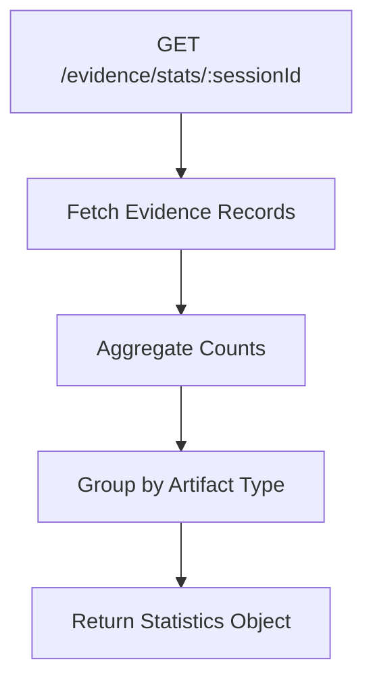
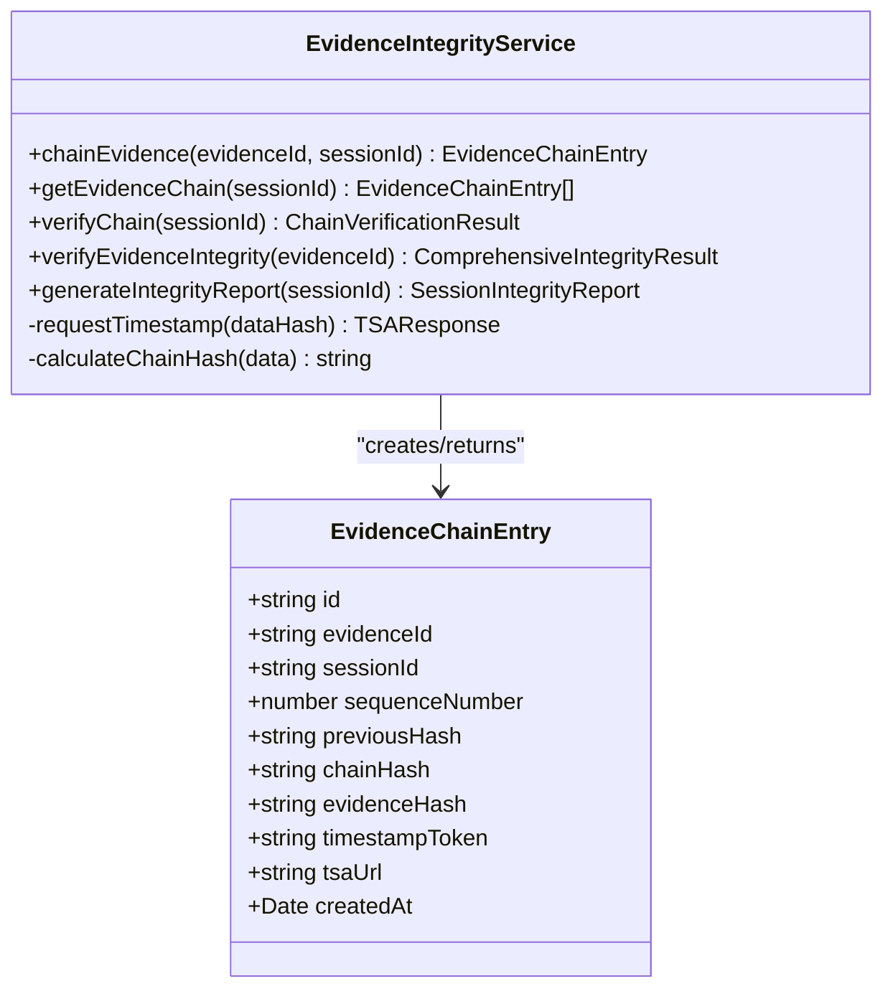
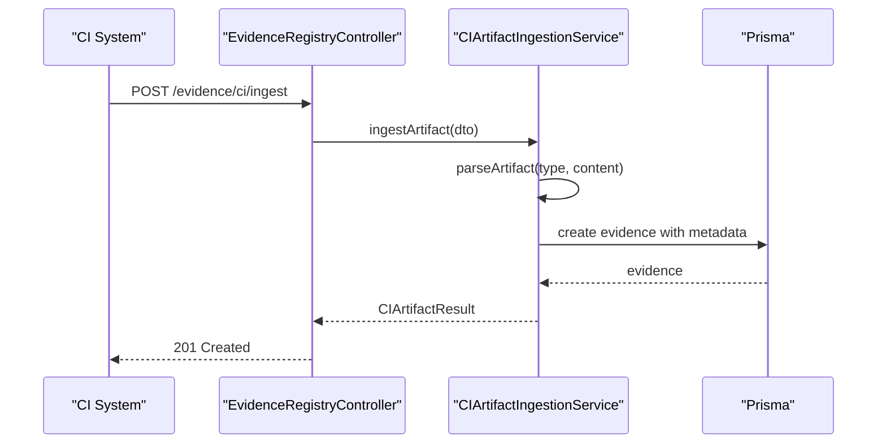
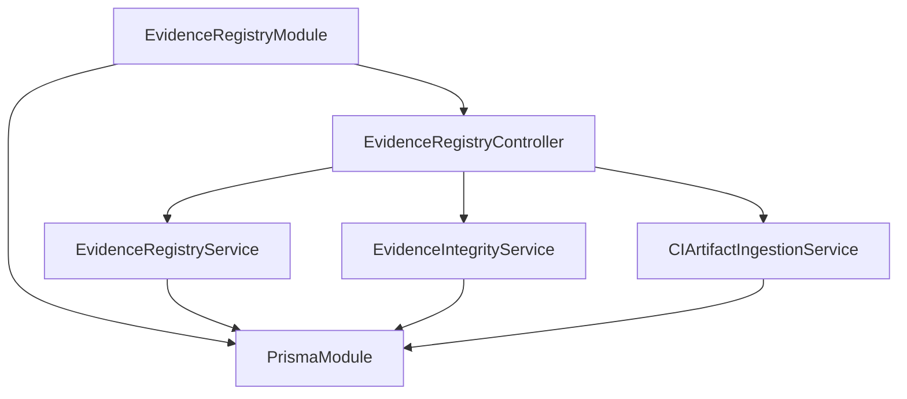

# Evidence Registry Endpoints

<cite>
**Referenced Files in This Document**
- [evidence-registry.controller.ts](file://apps/api/src/modules/evidence-registry/evidence-registry.controller.ts)
- [evidence-registry.service.ts](file://apps/api/src/modules/evidence-registry/evidence-registry.service.ts)
- [evidence-integrity.service.ts](file://apps/api/src/modules/evidence-registry/evidence-integrity.service.ts)
- [ci-artifact-ingestion.service.ts](file://apps/api/src/modules/evidence-registry/ci-artifact-ingestion.service.ts)
- [evidence-registry.module.ts](file://apps/api/src/modules/evidence-registry/evidence-registry.module.ts)
- [app.module.ts](file://apps/api/src/app.module.ts)
</cite>

## Table of Contents
1. [Introduction](#introduction)
2. [Project Structure](#project-structure)
3. [Core Components](#core-components)
4. [Architecture Overview](#architecture-overview)
5. [Detailed Component Analysis](#detailed-component-analysis)
6. [Dependency Analysis](#dependency-analysis)
7. [Performance Considerations](#performance-considerations)
8. [Troubleshooting Guide](#troubleshooting-guide)
9. [Conclusion](#conclusion)

## Introduction
This document provides comprehensive API documentation for the Evidence Registry endpoints. It covers file upload functionality with multipart/form-data handling, supported file types and size limitations, evidence verification workflows, listing and filtering capabilities, evidence statistics for coverage tracking, deletion policies for verified versus unverified evidence, integrity protection mechanisms, administrative controls, examples of submission workflows, validation processes, audit trail generation, evidence lifecycle management, retention policies, and secure storage requirements.

## Project Structure
The Evidence Registry is implemented as a NestJS module with dedicated controller, service, integrity service, and CI artifact ingestion service. It integrates with Prisma for database operations and Azure Blob Storage for secure file storage. The module is conditionally loaded via the main application module.

**Diagram sources**
- [app.module.ts:36-51](file://apps/api/src/app.module.ts#L36-L51)
- [evidence-registry.module.ts:20-26](file://apps/api/src/modules/evidence-registry/evidence-registry.module.ts#L20-L26)

**Section sources**
- [app.module.ts:36-51](file://apps/api/src/app.module.ts#L36-L51)
- [evidence-registry.module.ts:20-26](file://apps/api/src/modules/evidence-registry/evidence-registry.module.ts#L20-L26)

## Core Components
- EvidenceRegistryController: Exposes REST endpoints for upload, verification, retrieval, listing, statistics, deletion, integrity verification, and CI artifact ingestion.
- EvidenceRegistryService: Handles file validation, upload to Azure Blob Storage, database persistence, verification workflow, coverage updates, statistics aggregation, and audit trail generation.
- EvidenceIntegrityService: Implements cryptographic hash chaining, RFC 3161 timestamp integration, chain verification, and comprehensive integrity reports.
- CIArtifactIngestionService: Parses and ingests CI/CD artifacts (test reports, coverage, SBOM, security scans) as evidence with automatic question mapping.

**Section sources**
- [evidence-registry.controller.ts:61-462](file://apps/api/src/modules/evidence-registry/evidence-registry.controller.ts#L61-L462)
- [evidence-registry.service.ts:96-953](file://apps/api/src/modules/evidence-registry/evidence-registry.service.ts#L96-L953)
- [evidence-integrity.service.ts:36-608](file://apps/api/src/modules/evidence-registry/evidence-integrity.service.ts#L36-L608)
- [ci-artifact-ingestion.service.ts:37-871](file://apps/api/src/modules/evidence-registry/ci-artifact-ingestion.service.ts#L37-L871)

## Architecture Overview
The Evidence Registry follows a layered architecture:
- Presentation Layer: Controller handles HTTP requests and Swagger documentation.
- Application Layer: Services encapsulate business logic for evidence management, integrity, and CI ingestion.
- Persistence Layer: Prisma ORM manages database operations.
- External Integrations: Azure Blob Storage for secure file storage and RFC 3161 TSA for timestamping.

**Diagram sources**
- [evidence-registry.controller.ts:135-141](file://apps/api/src/modules/evidence-registry/evidence-registry.controller.ts#L135-L141)
- [evidence-registry.service.ts:165-208](file://apps/api/src/modules/evidence-registry/evidence-registry.service.ts#L165-L208)

## Detailed Component Analysis

### File Upload Functionality
- Endpoint: POST /evidence/upload
- Authentication: JWT bearer token required
- Content-Type: multipart/form-data
- Required fields: file, sessionId, questionId, artifactType
- Optional fields: fileName
- Supported file types:
  - Documents: PDF, Microsoft Word (.doc/.docx), Excel (.xls/.xlsx), Plain text, Markdown, JSON
  - Images: PNG, JPEG, GIF, WebP
  - Logs/Data: CSV, XML (including application/xml and text/xml)
  - SBOM: CycloneDX JSON, SPDX JSON
- Size limitation: Maximum 50 MB per file
- Storage: Azure Blob Storage with SHA-256 hash for integrity verification
- Response: EvidenceItemResponse with metadata and integrity hash

**Diagram sources**
- [evidence-registry.controller.ts:71-141](file://apps/api/src/modules/evidence-registry/evidence-registry.controller.ts#L71-L141)
- [evidence-registry.service.ts:100-127](file://apps/api/src/modules/evidence-registry/evidence-registry.service.ts#L100-L127)
- [evidence-registry.service.ts:419-434](file://apps/api/src/modules/evidence-registry/evidence-registry.service.ts#L419-L434)

**Section sources**
- [evidence-registry.controller.ts:71-141](file://apps/api/src/modules/evidence-registry/evidence-registry.controller.ts#L71-L141)
- [evidence-registry.service.ts:100-127](file://apps/api/src/modules/evidence-registry/evidence-registry.service.ts#L100-L127)
- [evidence-registry.service.ts:419-434](file://apps/api/src/modules/evidence-registry/evidence-registry.service.ts#L419-L434)

### Evidence Verification Workflows
- Endpoint: POST /evidence/verify
- Purpose: Mark evidence as verified/unverified and optionally update coverage
- Validation: Requires Verifier role (enforced by JWT guard)
- Coverage updates: Decimal coverage values are converted to discrete levels with enforced monotonic increases
- Response: Updated EvidenceItemResponse with verifier metadata

**Diagram sources**
- [evidence-registry.controller.ts:166-171](file://apps/api/src/modules/evidence-registry/evidence-registry.controller.ts#L166-L171)
- [evidence-registry.service.ts:216-245](file://apps/api/src/modules/evidence-registry/evidence-registry.service.ts#L216-L245)

**Section sources**
- [evidence-registry.controller.ts:146-171](file://apps/api/src/modules/evidence-registry/evidence-registry.controller.ts#L146-L171)
- [evidence-registry.service.ts:216-245](file://apps/api/src/modules/evidence-registry/evidence-registry.service.ts#L216-L245)

### Listing and Filtering Capabilities
- Endpoint: GET /evidence
- Filters: sessionId, questionId, artifactType, verified
- Pagination: Max 500 items per request
- Sorting: Descending by creation date
- Response: Array of EvidenceItemResponse

**Section sources**
- [evidence-registry.controller.ts:198-214](file://apps/api/src/modules/evidence-registry/evidence-registry.controller.ts#L198-L214)
- [evidence-registry.service.ts:265-288](file://apps/api/src/modules/evidence-registry/evidence-registry.service.ts#L265-L288)

### Evidence Statistics Endpoints
- Endpoint: GET /evidence/stats/:sessionId
- Purpose: Coverage tracking and compliance reporting
- Response includes: total evidence count, verified count, pending count, and counts by artifact type

**Diagram sources**
- [evidence-registry.controller.ts:219-246](file://apps/api/src/modules/evidence-registry/evidence-registry.controller.ts#L219-L246)
- [evidence-registry.service.ts:293-324](file://apps/api/src/modules/evidence-registry/evidence-registry.service.ts#L293-L324)

**Section sources**
- [evidence-registry.controller.ts:219-246](file://apps/api/src/modules/evidence-registry/evidence-registry.controller.ts#L219-L246)
- [evidence-registry.service.ts:293-324](file://apps/api/src/modules/evidence-registry/evidence-registry.service.ts#L293-L324)

### Deletion Policies
- Endpoint: DELETE /evidence/:evidenceId
- Policy: Only unverified evidence can be deleted
- Behavior: Soft delete concept with actual blob deletion and database removal
- Response: 204 No Content on success

**Section sources**
- [evidence-registry.controller.ts:251-278](file://apps/api/src/modules/evidence-registry/evidence-registry.controller.ts#L251-L278)
- [evidence-registry.service.ts:329-355](file://apps/api/src/modules/evidence-registry/evidence-registry.service.ts#L329-L355)

### Integrity Protection Mechanisms
- Cryptographic Hash Chain: Each evidence links to previous entry via SHA-256
- RFC 3161 Timestamp Authority: Optional timestamp token for chain entries
- Evidence Integrity Verification: Recompute hash and compare with stored signature
- Chain Verification: Validate hash chain links, computed hashes, and evidence integrity

**Diagram sources**
- [evidence-integrity.service.ts:36-608](file://apps/api/src/modules/evidence-registry/evidence-integrity.service.ts#L36-L608)

**Section sources**
- [evidence-integrity.service.ts:63-133](file://apps/api/src/modules/evidence-registry/evidence-integrity.service.ts#L63-L133)
- [evidence-integrity.service.ts:200-274](file://apps/api/src/modules/evidence-registry/evidence-integrity.service.ts#L200-L274)
- [evidence-integrity.service.ts:396-444](file://apps/api/src/modules/evidence-registry/evidence-integrity.service.ts#L396-L444)

### Administrative Controls
- Role-based Access: JWT guard enforces authentication; verification requires Verifier role
- Audit Trail: Comprehensive logging of upload, verification, and decision events
- Bulk Operations: Batch verification with transaction support
- Signed URLs: Secure temporary access to evidence files with configurable expiration

**Section sources**
- [evidence-registry.controller.ts:59](file://apps/api/src/modules/evidence-registry/evidence-registry.controller.ts#L59)
- [evidence-registry.service.ts:626-694](file://apps/api/src/modules/evidence-registry/evidence-registry.service.ts#L626-L694)
- [evidence-registry.service.ts:551-620](file://apps/api/src/modules/evidence-registry/evidence-registry.service.ts#L551-L620)
- [evidence-registry.service.ts:825-865](file://apps/api/src/modules/evidence-registry/evidence-registry.service.ts#L825-L865)

### CI Artifact Ingestion
- Endpoint: POST /evidence/ci/ingest
- Supported artifact types: junit, jest, lcov, cobertura, cyclonedx, spdx, trivy, owasp
- Automatic parsing: Extract metrics and summaries from artifacts
- Question mapping: Auto-detect matching question or require explicit questionId
- Response: Parsed artifact data with hash signature

**Diagram sources**
- [evidence-registry.controller.ts:412-414](file://apps/api/src/modules/evidence-registry/evidence-registry.controller.ts#L412-L414)
- [ci-artifact-ingestion.service.ts:98-163](file://apps/api/src/modules/evidence-registry/ci-artifact-ingestion.service.ts#L98-L163)

**Section sources**
- [evidence-registry.controller.ts:374-428](file://apps/api/src/modules/evidence-registry/evidence-registry.controller.ts#L374-L428)
- [ci-artifact-ingestion.service.ts:98-163](file://apps/api/src/modules/evidence-registry/ci-artifact-ingestion.service.ts#L98-L163)

### Evidence Lifecycle Management
- Creation: Upload with validation and storage
- Verification: Manual or automated verification with coverage updates
- Integrity: Hash chain linking and timestamping
- Access: Signed URLs for secure downloads
- Deletion: Only unverified evidence deletion
- Reporting: Statistics, coverage summaries, and integrity reports

**Section sources**
- [evidence-registry.service.ts:165-208](file://apps/api/src/modules/evidence-registry/evidence-registry.service.ts#L165-L208)
- [evidence-registry.service.ts:216-245](file://apps/api/src/modules/evidence-registry/evidence-registry.service.ts#L216-L245)
- [evidence-integrity.service.ts:449-486](file://apps/api/src/modules/evidence-registry/evidence-integrity.service.ts#L449-L486)
- [evidence-registry.service.ts:825-865](file://apps/api/src/modules/evidence-registry/evidence-registry.service.ts#L825-L865)

## Dependency Analysis
The Evidence Registry module depends on:
- PrismaModule for database operations
- Azure Blob Storage for file storage
- JWT authentication for access control
- RFC 3161 TSA for timestamping

**Diagram sources**
- [evidence-registry.module.ts:20-26](file://apps/api/src/modules/evidence-registry/evidence-registry.module.ts#L20-L26)

**Section sources**
- [evidence-registry.module.ts:20-26](file://apps/api/src/modules/evidence-registry/evidence-registry.module.ts#L20-L26)

## Performance Considerations
- File size limits prevent excessive resource consumption
- Pagination (max 500 items) prevents large response payloads
- Batch operations for verification reduce database round trips
- Hash computation and blob uploads are optimized for single-threaded processing
- Consider implementing asynchronous processing for large file uploads and CI artifact parsing

## Troubleshooting Guide
Common issues and resolutions:
- File upload failures: Verify MIME type is allowed and file size does not exceed 50MB
- Authentication errors: Ensure JWT bearer token is present and valid
- Verification errors: Confirm user has Verifier role and evidence exists
- Integrity verification failures: Check blob storage connectivity and hash computation
- CI ingestion errors: Validate artifact type and content format

**Section sources**
- [evidence-registry.service.ts:419-434](file://apps/api/src/modules/evidence-registry/evidence-registry.service.ts#L419-L434)
- [evidence-integrity.service.ts:396-444](file://apps/api/src/modules/evidence-registry/evidence-integrity.service.ts#L396-L444)
- [ci-artifact-ingestion.service.ts:108-112](file://apps/api/src/modules/evidence-registry/ci-artifact-ingestion.service.ts#L108-L112)

## Conclusion
The Evidence Registry provides a comprehensive solution for managing assessment evidence with strong integrity guarantees, automated CI/CD integration, and robust administrative controls. The modular architecture ensures maintainability while the layered design supports scalability and security requirements.