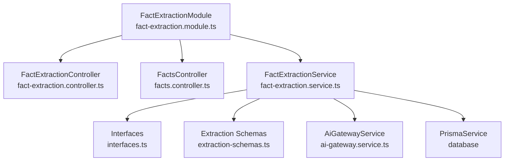
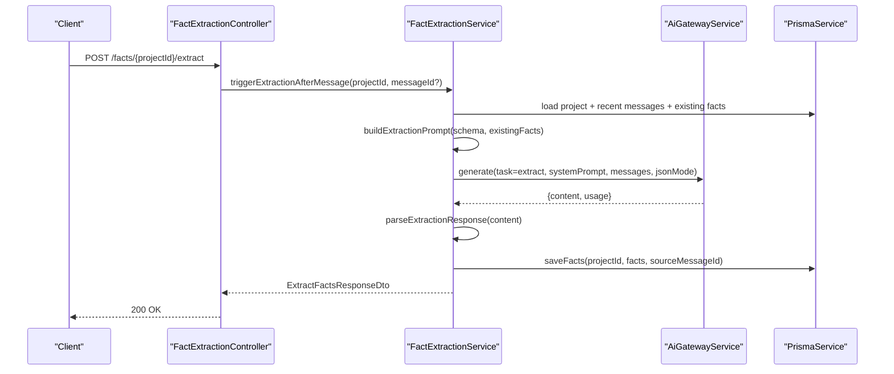
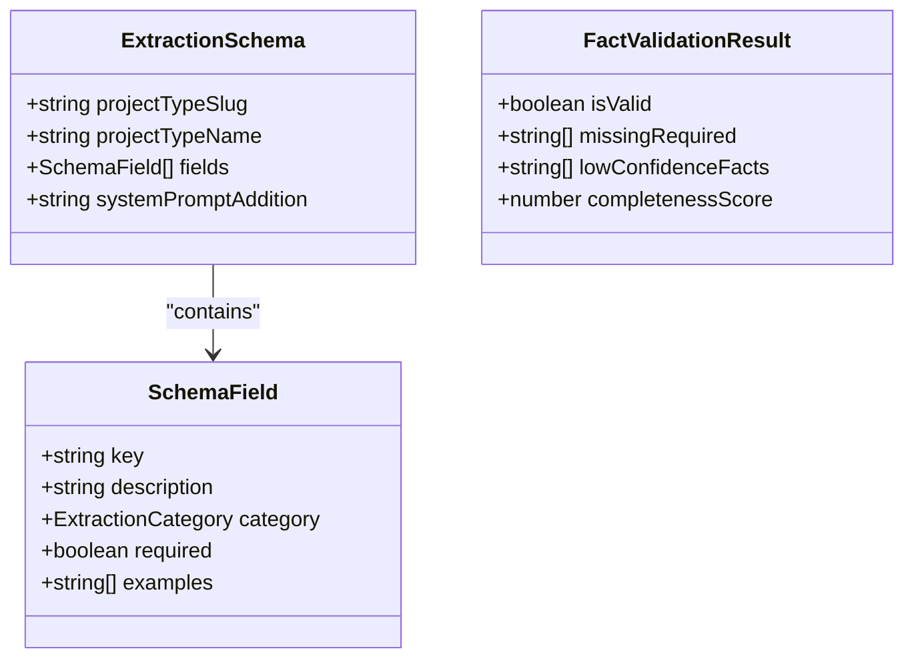
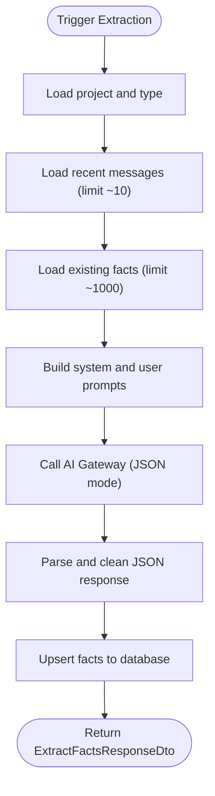
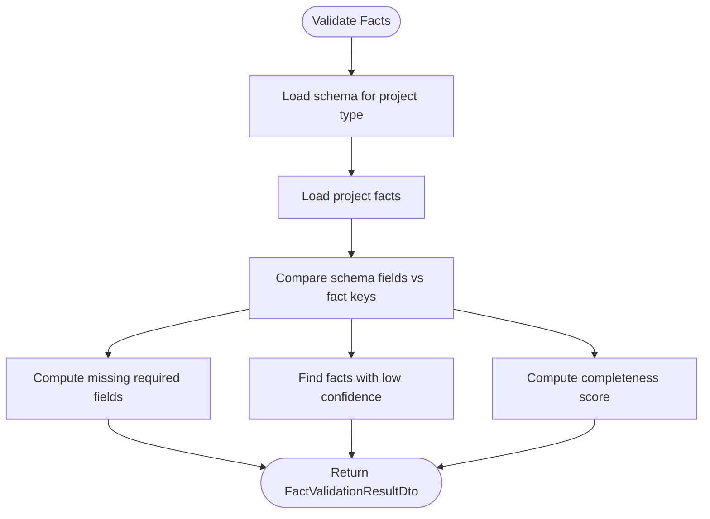
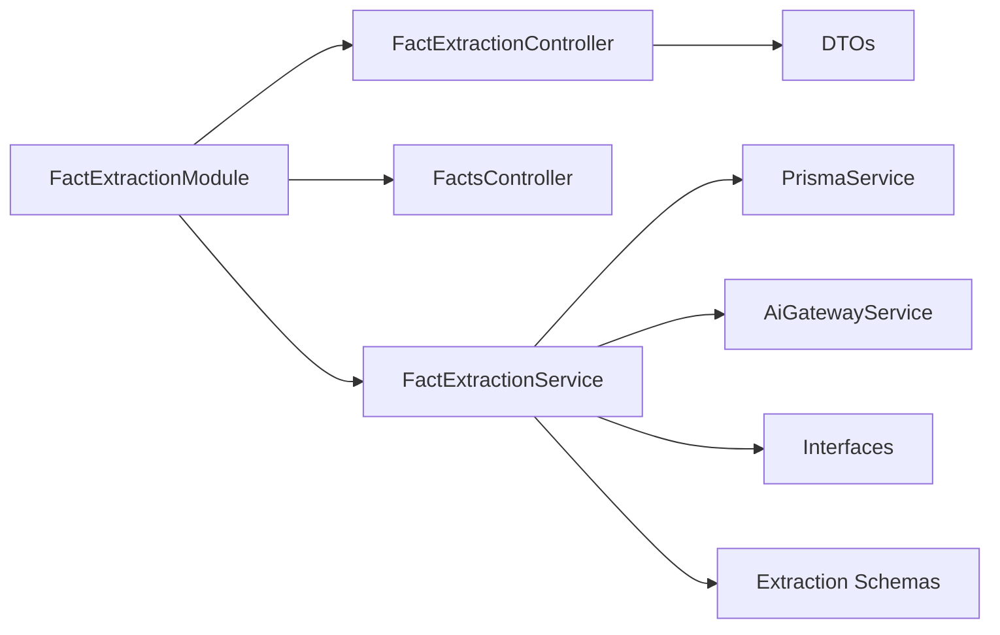

# Fact Extraction API

<cite>
**Referenced Files in This Document**
- [fact-extraction.controller.ts](file://apps/api/src/modules/fact-extraction/fact-extraction.controller.ts)
- [facts.controller.ts](file://apps/api/src/modules/fact-extraction/facts.controller.ts)
- [interfaces.ts](file://apps/api/src/modules/fact-extraction/interfaces.ts)
- [fact-extraction.dto.ts](file://apps/api/src/modules/fact-extraction/dto/fact-extraction.dto.ts)
- [fact-extraction.service.ts](file://apps/api/src/modules/fact-extraction/services/fact-extraction.service.ts)
- [extraction-schemas.ts](file://apps/api/src/modules/fact-extraction/schemas/extraction-schemas.ts)
- [fact-extraction.module.ts](file://apps/api/src/modules/fact-extraction/fact-extraction.module.ts)
</cite>

## Table of Contents
1. [Introduction](#introduction)
2. [Project Structure](#project-structure)
3. [Core Components](#core-components)
4. [Architecture Overview](#architecture-overview)
5. [Detailed Component Analysis](#detailed-component-analysis)
6. [Dependency Analysis](#dependency-analysis)
7. [Performance Considerations](#performance-considerations)
8. [Troubleshooting Guide](#troubleshooting-guide)
9. [Conclusion](#conclusion)
10. [Appendices](#appendices)

## Introduction
This document provides comprehensive API documentation for the Fact Extraction system. It covers automated extraction of structured facts from project conversations and questionnaire responses, extraction schemas, validation rules, and the resulting structured fact representation. It also documents batch processing capabilities, extraction quality scoring, confidence thresholds, filtering and categorization, relationship mapping, standardization and normalization processes, and downstream integration patterns.

## Project Structure
The Fact Extraction feature is organized as a NestJS module with dedicated controllers, services, DTOs, interfaces, and extraction schemas. Two controller sets expose REST endpoints:
- A project-focused set for triggering extractions and retrieving validated facts
- An organization-scoped set for listing, updating, verifying, and deleting facts



**Diagram sources**
- [fact-extraction.module.ts:19-25](file://apps/api/src/modules/fact-extraction/fact-extraction.module.ts#L19-L25)
- [fact-extraction.controller.ts:20-26](file://apps/api/src/modules/fact-extraction/fact-extraction.controller.ts#L20-L26)
- [facts.controller.ts:60-63](file://apps/api/src/modules/fact-extraction/facts.controller.ts#L60-L63)
- [fact-extraction.service.ts:24-31](file://apps/api/src/modules/fact-extraction/services/fact-extraction.service.ts#L24-L31)

**Section sources**
- [fact-extraction.module.ts:1-26](file://apps/api/src/modules/fact-extraction/fact-extraction.module.ts#L1-L26)

## Core Components
- FactExtractionController: Exposes endpoints to trigger extraction after a message, list project facts, validate facts against schema, update a specific fact, and delete a specific fact.
- FactsController: Exposes endpoints to list facts scoped to an organization, update a single fact, delete a single fact, and bulk verify all facts for a project.
- FactExtractionService: Orchestrates extraction, saves results, validates completeness, and manages confidence levels.
- Interfaces: Defines typed contracts for extracted facts, schemas, categories, confidence levels, and validation results.
- DTOs: Define request/response shapes for API consumers with validation decorators.
- Extraction Schemas: Define the structured fields to extract per project type, including categories, requirements, and system prompt additions.

**Section sources**
- [fact-extraction.controller.ts:23-141](file://apps/api/src/modules/fact-extraction/fact-extraction.controller.ts#L23-L141)
- [facts.controller.ts:62-229](file://apps/api/src/modules/fact-extraction/facts.controller.ts#L62-L229)
- [fact-extraction.service.ts:24-422](file://apps/api/src/modules/fact-extraction/services/fact-extraction.service.ts#L24-L422)
- [interfaces.ts:8-88](file://apps/api/src/modules/fact-extraction/interfaces.ts#L8-L88)
- [fact-extraction.dto.ts:9-92](file://apps/api/src/modules/fact-extraction/dto/fact-extraction.dto.ts#L9-L92)
- [extraction-schemas.ts:13-938](file://apps/api/src/modules/fact-extraction/schemas/extraction-schemas.ts#L13-L938)

## Architecture Overview
The Fact Extraction API integrates with an AI gateway to parse conversation content and produce structured facts aligned with a project-type schema. The service persists facts, maintains confidence levels, and supports validation and manual edits.



**Diagram sources**
- [fact-extraction.controller.ts:54-76](file://apps/api/src/modules/fact-extraction/fact-extraction.controller.ts#L54-L76)
- [fact-extraction.service.ts:82-139](file://apps/api/src/modules/fact-extraction/services/fact-extraction.service.ts#L82-L139)
- [fact-extraction.service.ts:49-76](file://apps/api/src/modules/fact-extraction/services/fact-extraction.service.ts#L49-L76)
- [fact-extraction.service.ts:144-187](file://apps/api/src/modules/fact-extraction/services/fact-extraction.service.ts#L144-L187)

## Detailed Component Analysis

### API Endpoints

#### Project-Focused Endpoints
- GET /facts/{projectId}
  - Returns all extracted facts for a project, projected to a simplified DTO shape.
  - Response: array of ExtractedFactDto
- POST /facts/{projectId}/extract
  - Triggers extraction from recent conversation messages; optionally tied to a specific message.
  - Request body: TriggerExtractionDto (optional messageId)
  - Response: ExtractFactsResponseDto (facts[], processingTimeMs, tokensUsed)
- GET /facts/{projectId}/validate
  - Validates current facts against the project type schema and computes completeness.
  - Response: FactValidationResultDto
- PUT /facts/{projectId}/{factKey}
  - Updates a specific fact’s value; marks as user-confirmed with high confidence.
  - Request body: UpdateFactDto (value)
  - Response: ExtractedFactDto
- DELETE /facts/{projectId}/{factKey}
  - Deletes a specific fact.
  - Response: { deleted: true }

**Section sources**
- [fact-extraction.controller.ts:31-140](file://apps/api/src/modules/fact-extraction/fact-extraction.controller.ts#L31-L140)
- [fact-extraction.dto.ts:48-91](file://apps/api/src/modules/fact-extraction/dto/fact-extraction.dto.ts#L48-L91)

#### Organization-Focused Endpoints
- GET /api/v1/facts/{projectId}
  - Lists all facts for a project with counts and grouped by category; enforces organization membership.
  - Response: FactsListResponse (project metadata, facts[], factsByCategory, totals)
- PATCH /api/v1/facts/{factId}
  - Updates a single fact’s value and/or verification flag; enforces organization membership.
  - Request body: UpdateFactDto (fieldValue?, isVerified?)
  - Response: FactResponse
- DELETE /api/v1/facts/{factId}
  - Deletes a single fact; enforces organization membership.
- POST /api/v1/facts/{projectId}/verify-all
  - Marks all facts for a project as verified by the user.

**Section sources**
- [facts.controller.ts:69-215](file://apps/api/src/modules/fact-extraction/facts.controller.ts#L69-L215)

### Extraction Schemas and Validation
- Extraction schemas define required and optional fields per project type (e.g., business-plan, tech-assessment, marketing-strategy, investment-pitch, operations-manual, grant-application).
- Each field specifies category, requirement, and description; system prompt additions tailor extraction focus.
- Validation compares current facts against schema requirements, reporting missing required fields, low-confidence items, and completeness percentage.



**Diagram sources**
- [interfaces.ts:61-87](file://apps/api/src/modules/fact-extraction/interfaces.ts#L61-L87)
- [extraction-schemas.ts:13-202](file://apps/api/src/modules/fact-extraction/schemas/extraction-schemas.ts#L13-L202)

**Section sources**
- [interfaces.ts:61-87](file://apps/api/src/modules/fact-extraction/interfaces.ts#L61-L87)
- [extraction-schemas.ts:13-938](file://apps/api/src/modules/fact-extraction/schemas/extraction-schemas.ts#L13-L938)

### Data Model and Confidence Levels
- ExtractedFactData includes category, key, value, confidence, optional sourceMessageId, and optional relatedQuestionIds.
- Confidence levels are mapped to high/medium/low; internal storage uses numeric decimals with conversion helpers.
- Fact keys are unique per project; upsert semantics prevent duplication while allowing updates.

```mermaid
classDiagram
class ExtractedFactData {
+ExtractionCategory category
+string key
+string value
+ConfidenceLevel confidence
+string sourceMessageId
+string[] relatedQuestionIds
}
class ConfidenceLevel {
<<enum>>
"high"
"medium"
"low"
}
ExtractedFactData --> ConfidenceLevel : "has"
```

**Diagram sources**
- [interfaces.ts:27-37](file://apps/api/src/modules/fact-extraction/interfaces.ts#L27-L37)
- [interfaces.ts:24-25](file://apps/api/src/modules/fact-extraction/interfaces.ts#L24-L25)

**Section sources**
- [interfaces.ts:27-37](file://apps/api/src/modules/fact-extraction/interfaces.ts#L27-L37)
- [fact-extraction.service.ts:299-325](file://apps/api/src/modules/fact-extraction/services/fact-extraction.service.ts#L299-L325)

### Extraction Workflow and Batch Processing
- Batch context: Recent conversation messages are aggregated (default last 10) to provide context for extraction.
- Existing facts are passed to the AI to avoid duplication.
- The service parses AI responses, cleans JSON blocks, and persists results via upsert.
- Batch-like behavior occurs when multiple facts are returned in a single extraction; the service iterates and persists each fact.



**Diagram sources**
- [fact-extraction.controller.ts:54-76](file://apps/api/src/modules/fact-extraction/fact-extraction.controller.ts#L54-L76)
- [fact-extraction.service.ts:82-139](file://apps/api/src/modules/fact-extraction/services/fact-extraction.service.ts#L82-L139)
- [fact-extraction.service.ts:328-386](file://apps/api/src/modules/fact-extraction/services/fact-extraction.service.ts#L328-L386)
- [fact-extraction.service.ts:388-421](file://apps/api/src/modules/fact-extraction/services/fact-extraction.service.ts#L388-L421)

**Section sources**
- [fact-extraction.service.ts:82-139](file://apps/api/src/modules/fact-extraction/services/fact-extraction.service.ts#L82-L139)
- [fact-extraction.service.ts:328-386](file://apps/api/src/modules/fact-extraction/services/fact-extraction.service.ts#L328-L386)

### Validation and Quality Scoring
- Completeness score is computed as (count of facts / total schema fields) × 100.
- Missing required fields are derived from schema requirements and current fact keys.
- Low-confidence facts are detected by confidence level mapping.
- Validation endpoint returns a consolidated result DTO.



**Diagram sources**
- [fact-extraction.controller.ts:85-92](file://apps/api/src/modules/fact-extraction/fact-extraction.controller.ts#L85-L92)
- [fact-extraction.service.ts:211-243](file://apps/api/src/modules/fact-extraction/services/fact-extraction.service.ts#L211-L243)

**Section sources**
- [fact-extraction.service.ts:211-243](file://apps/api/src/modules/fact-extraction/services/fact-extraction.service.ts#L211-L243)

### Filtering, Categorization, and Relationship Mapping
- Filtering: Clients can filter by category via grouping and by confidence level during validation.
- Categorization: Fields are categorized (business_overview, market_analysis, financial_data, team_and_operations, product_service, strategy, risk_assessment, technology, legal_compliance).
- Relationship mapping: Optional relatedQuestionIds are supported in the extracted fact model; sourceMessageId links facts to originating messages.

**Section sources**
- [interfaces.ts:11-20](file://apps/api/src/modules/fact-extraction/interfaces.ts#L11-L20)
- [interfaces.ts:36-37](file://apps/api/src/modules/fact-extraction/interfaces.ts#L36-L37)
- [fact-extraction.dto.ts:42-46](file://apps/api/src/modules/fact-extraction/dto/fact-extraction.dto.ts#L42-L46)

### Standardization and Normalization
- Confidence normalization: Internal decimals are mapped to standardized levels (high ≥ 0.8, medium ≥ 0.5, low otherwise).
- Field normalization: Fact keys are normalized to schema-defined keys; values are stored as extracted strings.
- Category normalization: Categories are constrained to predefined values.

**Section sources**
- [fact-extraction.service.ts:299-325](file://apps/api/src/modules/fact-extraction/services/fact-extraction.service.ts#L299-L325)
- [interfaces.ts:11-20](file://apps/api/src/modules/fact-extraction/interfaces.ts#L11-L20)

### Downstream Processing Integration
- Fact lists support grouping by category and summary counts for dashboards and document generation.
- Bulk verification endpoint enables downstream systems to mark facts as reviewed.
- Fact updates support manual correction and revalidation workflows.

**Section sources**
- [facts.controller.ts:104-121](file://apps/api/src/modules/fact-extraction/facts.controller.ts#L104-L121)
- [facts.controller.ts:197-215](file://apps/api/src/modules/fact-extraction/facts.controller.ts#L197-L215)

## Dependency Analysis
- FactExtractionModule imports PrismaModule and AiGatewayModule, wiring database and AI gateway services.
- FactExtractionService depends on PrismaService for persistence and AiGatewayService for extraction.
- Controllers depend on FactExtractionService for orchestration and on DTOs for validation.



**Diagram sources**
- [fact-extraction.module.ts:19-25](file://apps/api/src/modules/fact-extraction/fact-extraction.module.ts#L19-L25)
- [fact-extraction.controller.ts:7-17](file://apps/api/src/modules/fact-extraction/fact-extraction.controller.ts#L7-L17)
- [facts.controller.ts:16-20](file://apps/api/src/modules/fact-extraction/facts.controller.ts#L16-L20)
- [fact-extraction.service.ts:8-31](file://apps/api/src/modules/fact-extraction/services/fact-extraction.service.ts#L8-L31)

**Section sources**
- [fact-extraction.module.ts:19-25](file://apps/api/src/modules/fact-extraction/fact-extraction.module.ts#L19-L25)
- [fact-extraction.service.ts:8-31](file://apps/api/src/modules/fact-extraction/services/fact-extraction.service.ts#L8-L31)

## Performance Considerations
- Token and time metrics: Responses include processingTimeMs and tokensUsed for observability.
- Batch sizing: Recent messages are limited (e.g., 10) to balance context and performance.
- Upsert strategy: Saves are performed per fact; consider batching at higher scale if needed.
- Confidence computation: O(n) over facts and schema fields; keep schema sizes reasonable.

[No sources needed since this section provides general guidance]

## Troubleshooting Guide
- Extraction failures: The service catches errors during AI generation and returns empty results with measured processing time.
- Parsing failures: The parser trims code blocks and validates JSON structure; invalid responses yield empty fact arrays.
- Persistence errors: Upserts log failures per fact; verify database connectivity and uniqueness constraints.
- Validation anomalies: Missing schema for project type yields conservative validation results.

**Section sources**
- [fact-extraction.service.ts:71-76](file://apps/api/src/modules/fact-extraction/services/fact-extraction.service.ts#L71-L76)
- [fact-extraction.service.ts:391-421](file://apps/api/src/modules/fact-extraction/services/fact-extraction.service.ts#L391-L421)
- [fact-extraction.service.ts:177-183](file://apps/api/src/modules/fact-extraction/services/fact-extraction.service.ts#L177-L183)

## Conclusion
The Fact Extraction API provides robust, schema-driven extraction from conversations and questionnaire responses, with strong validation, confidence scoring, and flexible downstream integration. Its modular design supports extensibility across project types and aligns with downstream document generation and review workflows.

[No sources needed since this section summarizes without analyzing specific files]

## Appendices

### API Definitions

- GET /facts/{projectId}
  - Description: Retrieve all extracted facts for a project
  - Authentication: Bearer token required
  - Response: array of ExtractedFactDto

- POST /facts/{projectId}/extract
  - Description: Trigger extraction from recent conversation
  - Authentication: Bearer token required
  - Request body: TriggerExtractionDto
  - Response: ExtractFactsResponseDto

- GET /facts/{projectId}/validate
  - Description: Validate facts against project type schema
  - Authentication: Bearer token required
  - Response: FactValidationResultDto

- PUT /facts/{projectId}/{factKey}
  - Description: Update a specific fact value
  - Authentication: Bearer token required
  - Request body: UpdateFactDto
  - Response: ExtractedFactDto

- DELETE /facts/{projectId}/{factKey}
  - Description: Delete a specific fact
  - Authentication: Bearer token required
  - Response: { deleted: true }

- GET /api/v1/facts/{projectId}
  - Description: List facts with organization membership checks
  - Authentication: Bearer token required
  - Response: FactsListResponse

- PATCH /api/v1/facts/{factId}
  - Description: Update a single fact (value or verification)
  - Authentication: Bearer token required
  - Request body: UpdateFactDto
  - Response: FactResponse

- DELETE /api/v1/facts/{factId}
  - Description: Delete a single fact
  - Authentication: Bearer token required

- POST /api/v1/facts/{projectId}/verify-all
  - Description: Mark all facts for a project as verified
  - Authentication: Bearer token required

**Section sources**
- [fact-extraction.controller.ts:31-140](file://apps/api/src/modules/fact-extraction/fact-extraction.controller.ts#L31-L140)
- [facts.controller.ts:69-215](file://apps/api/src/modules/fact-extraction/facts.controller.ts#L69-L215)

### Validation Rules and Confidence Thresholds
- Confidence thresholds:
  - high: ≥ 0.8
  - medium: ≥ 0.5
  - low: < 0.5
- Completeness score: (count of facts / total schema fields) × 100
- Missing required: fields marked required in schema without corresponding facts
- Low confidence: facts with confidence level “low”

**Section sources**
- [fact-extraction.service.ts:299-325](file://apps/api/src/modules/fact-extraction/services/fact-extraction.service.ts#L299-L325)
- [fact-extraction.service.ts:211-243](file://apps/api/src/modules/fact-extraction/services/fact-extraction.service.ts#L211-L243)