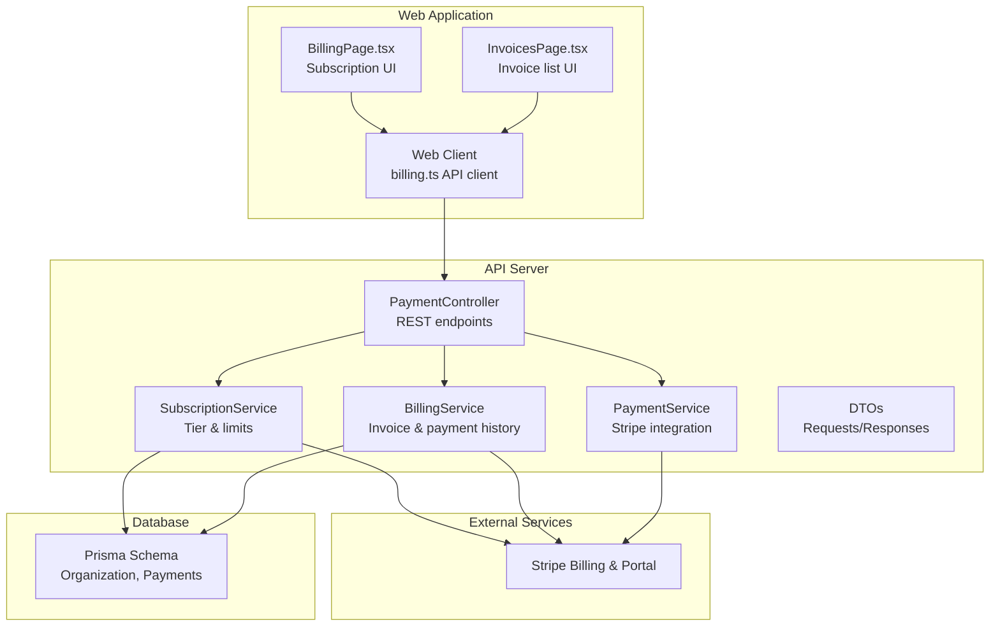
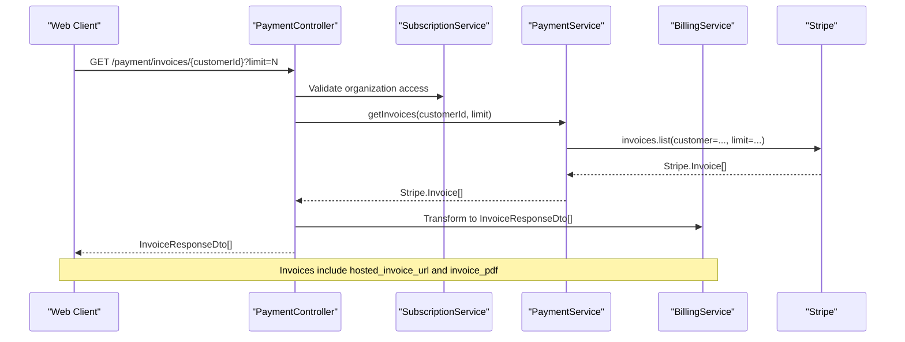
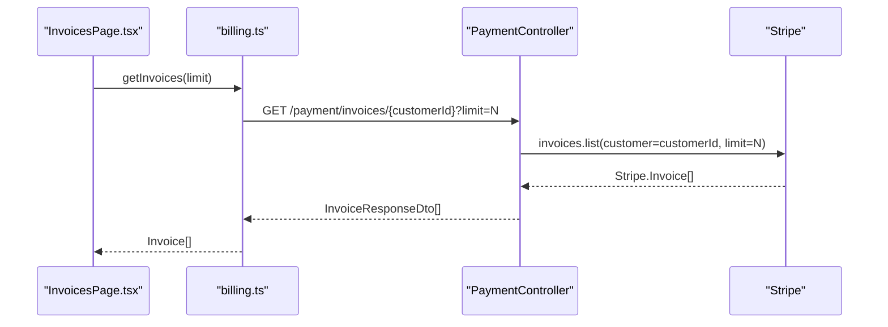
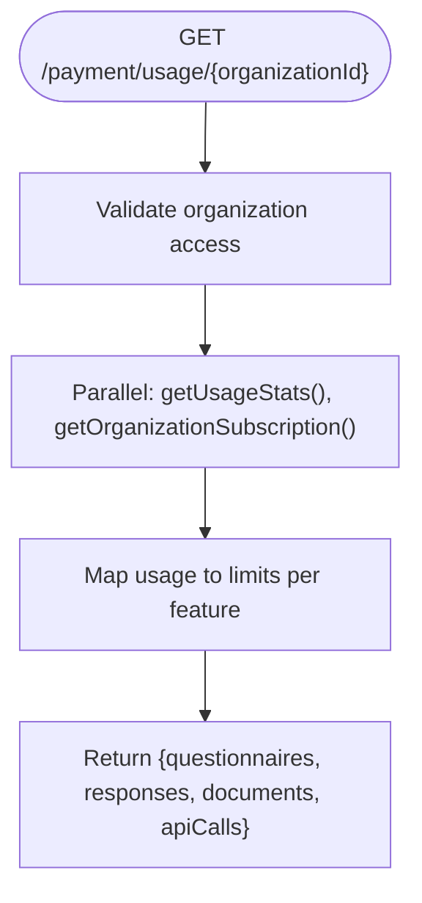
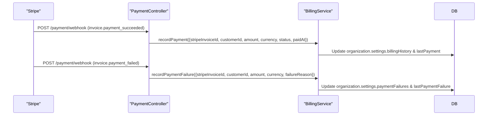
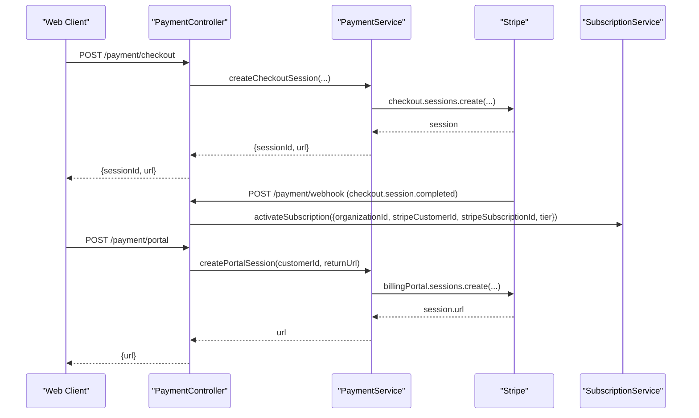
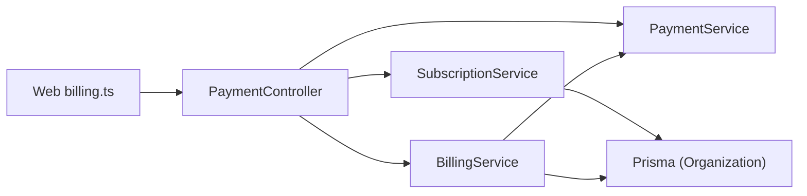

# Billing & Invoice Management

<cite>
**Referenced Files in This Document**
- [payment.controller.ts](file://apps/api/src/modules/payment/payment.controller.ts)
- [payment.service.ts](file://apps/api/src/modules/payment/payment.service.ts)
- [billing.service.ts](file://apps/api/src/modules/payment/billing.service.ts)
- [subscription.service.ts](file://apps/api/src/modules/payment/subscription.service.ts)
- [payment.dto.ts](file://apps/api/src/modules/payment/dto/payment.dto.ts)
- [billing.ts](file://apps/web/src/api/billing.ts)
- [schema.prisma](file://prisma/schema.prisma)
- [subscription.guard.ts](file://apps/api/src/common/guards/subscription.guard.ts)
- [InvoicesPage.tsx](file://apps/web/src/pages/billing/InvoicesPage.tsx)
- [SubscriptionCard.tsx](file://apps/web/src/pages/billing/BillingPage.tsx)
</cite>

## Table of Contents
1. [Introduction](#introduction)
2. [Project Structure](#project-structure)
3. [Core Components](#core-components)
4. [Architecture Overview](#architecture-overview)
5. [Detailed Component Analysis](#detailed-component-analysis)
6. [Dependency Analysis](#dependency-analysis)
7. [Performance Considerations](#performance-considerations)
8. [Troubleshooting Guide](#troubleshooting-guide)
9. [Conclusion](#conclusion)

## Introduction
This document provides comprehensive API documentation for Quiz-to-Build’s billing and invoice management system. It covers invoice retrieval by customer ID, billing history listing, usage statistics aggregation, payment status tracking, payment failure handling, and automated billing workflows. It also outlines usage-based billing calculations, metered billing integration, consumption tracking across questionnaires, responses, documents, and API calls, as well as invoice formatting, PDF generation, and customer portal integration. Guidance is included for billing cycle management, overdue payment handling, and automated retry mechanisms.

## Project Structure
The billing system spans the API server and the web application:
- API module: Payment controller, services, and DTOs manage Stripe subscriptions, invoices, and usage tracking.
- Web client: Provides UI integration for retrieving invoices, usage stats, and accessing the Stripe Customer Portal.
- Database schema: Stores organization settings, subscription metadata, and payment histories.

**Diagram sources**
- [payment.controller.ts:1-396](file://apps/api/src/modules/payment/payment.controller.ts#L1-L396)
- [payment.service.ts:1-316](file://apps/api/src/modules/payment/payment.service.ts#L1-L316)
- [billing.service.ts:1-270](file://apps/api/src/modules/payment/billing.service.ts#L1-L270)
- [subscription.service.ts:1-237](file://apps/api/src/modules/payment/subscription.service.ts#L1-L237)
- [payment.dto.ts:1-113](file://apps/api/src/modules/payment/dto/payment.dto.ts#L1-L113)
- [billing.ts:1-234](file://apps/web/src/api/billing.ts#L1-L234)
- [InvoicesPage.tsx:94-124](file://apps/web/src/pages/billing/InvoicesPage.tsx#L94-L124)
- [SubscriptionCard.tsx:40-57](file://apps/web/src/pages/billing/BillingPage.tsx#L40-L57)
- [schema.prisma:154-170](file://prisma/schema.prisma#L154-L170)

**Section sources**
- [payment.controller.ts:1-396](file://apps/api/src/modules/payment/payment.controller.ts#L1-L396)
- [payment.service.ts:1-316](file://apps/api/src/modules/payment/payment.service.ts#L1-L316)
- [billing.service.ts:1-270](file://apps/api/src/modules/payment/billing.service.ts#L1-L270)
- [subscription.service.ts:1-237](file://apps/api/src/modules/payment/subscription.service.ts#L1-L237)
- [payment.dto.ts:1-113](file://apps/api/src/modules/payment/dto/payment.dto.ts#L1-L113)
- [billing.ts:1-234](file://apps/web/src/api/billing.ts#L1-L234)
- [schema.prisma:154-170](file://prisma/schema.prisma#L154-L170)

## Core Components
- PaymentController: Exposes REST endpoints for subscription tiers, checkout sessions, customer portal sessions, subscription status, invoice retrieval, usage statistics, and webhook handling.
- PaymentService: Integrates with Stripe to create checkout sessions, customer portal sessions, retrieve invoices, and manage subscriptions.
- BillingService: Retrieves invoices, formats invoice data, records successful payments and failures, and aggregates billing summaries.
- SubscriptionService: Manages subscription tiers, limits, and synchronization with Stripe events.
- DTOs: Define request/response shapes for endpoints.
- Web billing client: Wraps API calls for the frontend, including invoice retrieval and usage stats.
- Database schema: Stores organization settings, subscription metadata, and payment histories.

**Section sources**
- [payment.controller.ts:70-396](file://apps/api/src/modules/payment/payment.controller.ts#L70-L396)
- [payment.service.ts:56-316](file://apps/api/src/modules/payment/payment.service.ts#L56-L316)
- [billing.service.ts:32-270](file://apps/api/src/modules/payment/billing.service.ts#L32-L270)
- [subscription.service.ts:28-237](file://apps/api/src/modules/payment/subscription.service.ts#L28-L237)
- [payment.dto.ts:1-113](file://apps/api/src/modules/payment/dto/payment.dto.ts#L1-L113)
- [billing.ts:104-234](file://apps/web/src/api/billing.ts#L104-L234)
- [schema.prisma:154-170](file://prisma/schema.prisma#L154-L170)

## Architecture Overview
The billing system integrates Stripe for subscription and invoice management, while the API persists billing history and usage data in the database. The web application consumes typed APIs to present invoices, usage stats, and subscription controls.

**Diagram sources**
- [payment.controller.ts:145-177](file://apps/api/src/modules/payment/payment.controller.ts#L145-L177)
- [payment.service.ts:282-296](file://apps/api/src/modules/payment/payment.service.ts#L282-L296)
- [billing.service.ts:41-60](file://apps/api/src/modules/payment/billing.service.ts#L41-L60)
- [subscription.service.ts:37-70](file://apps/api/src/modules/payment/subscription.service.ts#L37-L70)

## Detailed Component Analysis

### Invoice Retrieval by Customer ID
- Endpoint: GET /payment/invoices/{customerId}
- Access control: Validates that the authenticated user belongs to the organization owning the subscription tied to the customer ID.
- Behavior: Fetches invoices from Stripe and transforms them into a normalized response DTO including hosted invoice URL and PDF URL.
- Frontend usage: The web client retrieves invoices using the logged-in user’s Stripe customer ID and displays them in the Invoices page.

**Diagram sources**
- [InvoicesPage.tsx:94-124](file://apps/web/src/pages/billing/InvoicesPage.tsx#L94-L124)
- [billing.ts:126-139](file://apps/web/src/api/billing.ts#L126-L139)
- [payment.controller.ts:145-177](file://apps/api/src/modules/payment/payment.controller.ts#L145-L177)
- [payment.service.ts:282-296](file://apps/api/src/modules/payment/payment.service.ts#L282-L296)
- [billing.service.ts:41-60](file://apps/api/src/modules/payment/billing.service.ts#L41-L60)

**Section sources**
- [payment.controller.ts:145-177](file://apps/api/src/modules/payment/payment.controller.ts#L145-L177)
- [billing.service.ts:41-60](file://apps/api/src/modules/payment/billing.service.ts#L41-L60)
- [billing.ts:126-139](file://apps/web/src/api/billing.ts#L126-L139)
- [InvoicesPage.tsx:94-124](file://apps/web/src/pages/billing/InvoicesPage.tsx#L94-L124)

### Billing History Listing
- Endpoint: GET /payment/invoices/{customerId}
- Pagination: Optional limit query parameter passed to Stripe invoices.list.
- Data normalization: Converts Stripe timestamps, amounts, and URLs into the InvoiceResponseDto shape.
- Frontend rendering: The Invoices page fetches up to N invoices and renders a list with links to hosted invoice and PDF.

**Section sources**
- [payment.controller.ts:145-177](file://apps/api/src/modules/payment/payment.controller.ts#L145-L177)
- [payment.service.ts:282-296](file://apps/api/src/modules/payment/payment.service.ts#L282-L296)
- [billing.service.ts:41-60](file://apps/api/src/modules/payment/billing.service.ts#L41-L60)
- [InvoicesPage.tsx:94-124](file://apps/web/src/pages/billing/InvoicesPage.tsx#L94-L124)

### Usage Statistics Aggregation
- Endpoint: GET /payment/usage/{organizationId}
- Access control: Validates organization membership.
- Data source: Combines usage counts from the database with subscription tier limits.
- Current coverage: Responses usage is computed from sessions under the organization; other metrics are placeholders pending schema updates.
- Frontend presentation: The billing UI displays usage bars with near-limit warnings.

**Diagram sources**
- [payment.controller.ts:179-221](file://apps/api/src/modules/payment/payment.controller.ts#L179-L221)
- [subscription.service.ts:37-70](file://apps/api/src/modules/payment/subscription.service.ts#L37-L70)
- [billing.service.ts:236-268](file://apps/api/src/modules/payment/billing.service.ts#L236-L268)

**Section sources**
- [payment.controller.ts:179-221](file://apps/api/src/modules/payment/payment.controller.ts#L179-L221)
- [subscription.service.ts:37-70](file://apps/api/src/modules/payment/subscription.service.ts#L37-L70)
- [billing.service.ts:236-268](file://apps/api/src/modules/payment/billing.service.ts#L236-L268)
- [subscription.guard.ts:156-174](file://apps/api/src/common/guards/subscription.guard.ts#L156-L174)

### Invoice Payment Status Tracking
- Webhook: POST /payment/webhook handles Stripe events.
- Handled events:
  - invoice.payment_succeeded: Records payment in organization settings via BillingService.
  - invoice.payment_failed: Records failure in organization settings via BillingService.
- Data persistence: BillingService writes billingHistory and lastPayment fields into organization.settings; paymentFailures and lastPaymentFailure are maintained similarly.

**Diagram sources**
- [payment.controller.ts:269-394](file://apps/api/src/modules/payment/payment.controller.ts#L269-L394)
- [billing.service.ts:88-190](file://apps/api/src/modules/payment/billing.service.ts#L88-L190)
- [schema.prisma:154-170](file://prisma/schema.prisma#L154-L170)

**Section sources**
- [payment.controller.ts:269-394](file://apps/api/src/modules/payment/payment.controller.ts#L269-L394)
- [billing.service.ts:88-190](file://apps/api/src/modules/payment/billing.service.ts#L88-L190)
- [schema.prisma:154-170](file://prisma/schema.prisma#L154-L170)

### Automated Billing Workflows
- Checkout session creation: POST /payment/checkout creates a Stripe checkout session and attaches organization metadata.
- Customer portal session: POST /payment/portal generates a Stripe Billing Portal session for managing subscriptions.
- Subscription lifecycle:
  - Activation: After checkout, the webhook activates the subscription in the database.
  - Updates: Subscription updates sync status, period end, and cancellation flags.
  - Cancellation: Deactivates the subscription and sets plan to FREE.

**Diagram sources**
- [payment.controller.ts:78-129](file://apps/api/src/modules/payment/payment.controller.ts#L78-L129)
- [payment.service.ts:102-152](file://apps/api/src/modules/payment/payment.service.ts#L102-L152)
- [subscription.service.ts:74-92](file://apps/api/src/modules/payment/subscription.service.ts#L74-L92)

**Section sources**
- [payment.controller.ts:78-129](file://apps/api/src/modules/payment/payment.controller.ts#L78-L129)
- [payment.service.ts:102-152](file://apps/api/src/modules/payment/payment.service.ts#L102-L152)
- [subscription.service.ts:74-92](file://apps/api/src/modules/payment/subscription.service.ts#L74-L92)

### Usage-Based Billing Calculations and Metered Integration
- Current state: Usage aggregation endpoints exist but are not fully wired to metered consumption across questionnaires, responses, documents, and API calls in the schema.
- Recommendations:
  - Extend usage queries to count questionnaires per organization and documents per project.
  - Track API call metrics via middleware and persist usage deltas.
  - Enforce feature gating using SubscriptionService.hasFeatureAccess to prevent overages.

**Section sources**
- [billing.service.ts:236-268](file://apps/api/src/modules/payment/billing.service.ts#L236-L268)
- [subscription.guard.ts:156-174](file://apps/api/src/common/guards/subscription.guard.ts#L156-L174)
- [subscription.service.ts:168-189](file://apps/api/src/modules/payment/subscription.service.ts#L168-L189)

### Consumption Tracking Across Questionnaires, Responses, Documents, and API Calls
- Responses: Usage is derived from sessions under the organization.
- Questionnaires: Count query exists but depends on schema relationships.
- Documents: Not currently tracked in usage stats.
- API calls: Not currently tracked in usage stats.
- Next steps: Add counters and periodic aggregations to the usage service and enforce limits via feature guards.

**Section sources**
- [billing.service.ts:245-268](file://apps/api/src/modules/payment/billing.service.ts#L245-L268)
- [subscription.guard.ts:156-174](file://apps/api/src/common/guards/subscription.guard.ts#L156-L174)

### Invoice Formatting, PDF Generation, and Customer Portal Integration
- Invoice formatting: BillingService maps Stripe invoice fields to InvoiceResponseDto, including hosted_invoice_url and invoice_pdf.
- PDF generation: Stripe generates PDFs; the API surfaces invoice_pdf for download.
- Customer portal: PaymentService creates Stripe Billing Portal sessions; PaymentController validates access and returns the portal URL.

**Section sources**
- [billing.service.ts:41-60](file://apps/api/src/modules/payment/billing.service.ts#L41-L60)
- [payment.service.ts:154-168](file://apps/api/src/modules/payment/payment.service.ts#L154-L168)
- [payment.controller.ts:100-129](file://apps/api/src/modules/payment/payment.controller.ts#L100-L129)

### Billing Cycle Management, Overdue Payment Handling, and Automated Retry Mechanisms
- Billing cycles: Managed by Stripe; the API tracks currentPeriodEnd and cancelAtPeriodEnd via SubscriptionService.
- Overdue handling: Stripe events (e.g., past_due, unpaid) are handled by the webhook; the API updates subscription status accordingly.
- Retry mechanisms: Stripe automatically retries payments; the API records failures and exposes lastPaymentFailure for diagnostics.

**Section sources**
- [subscription.service.ts:94-132](file://apps/api/src/modules/payment/subscription.service.ts#L94-L132)
- [payment.controller.ts:296-324](file://apps/api/src/modules/payment/payment.controller.ts#L296-L324)
- [billing.service.ts:142-190](file://apps/api/src/modules/payment/billing.service.ts#L142-L190)

### Examples

#### Example: Invoice Generation and Payment Reconciliation
- Trigger: A subscription charge completes in Stripe.
- Flow:
  - Stripe sends invoice.payment_succeeded webhook.
  - PaymentController delegates to BillingService.recordPayment.
  - BillingService updates organization.settings with billingHistory and lastPayment.
- Outcome: The organization’s billing history reflects the payment, enabling reconciliation.

**Section sources**
- [payment.controller.ts:371-382](file://apps/api/src/modules/payment/payment.controller.ts#L371-L382)
- [billing.service.ts:88-140](file://apps/api/src/modules/payment/billing.service.ts#L88-L140)

#### Example: Revenue Recognition
- Approach: Treat successful payments as recognized revenue upon receipt of invoice.payment_succeeded.
- Data: Amounts are stored in organization.settings.billingHistory with currency and paidAt timestamps for auditability.

**Section sources**
- [billing.service.ts:105-139](file://apps/api/src/modules/payment/billing.service.ts#L105-L139)

#### Example: Automated Billing Workflow
- Steps:
  - Create checkout session with organization metadata.
  - On checkout.session.completed, activate subscription.
  - On invoice.payment_succeeded, reconcile payment.
  - On invoice.payment_failed, record failure.
- Access control ensures only authorized users can access invoices and portal.

**Section sources**
- [payment.controller.ts:296-394](file://apps/api/src/modules/payment/payment.controller.ts#L296-L394)
- [subscription.service.ts:74-92](file://apps/api/src/modules/payment/subscription.service.ts#L74-L92)

## Dependency Analysis
- PaymentController depends on PaymentService, SubscriptionService, and BillingService.
- PaymentService depends on Stripe and configuration.
- BillingService depends on Prisma and PaymentService.
- SubscriptionService depends on Prisma and maintains tier features.
- Web billing client depends on PaymentController endpoints.

**Diagram sources**
- [payment.controller.ts:41-53](file://apps/api/src/modules/payment/payment.controller.ts#L41-L53)
- [payment.service.ts:57-72](file://apps/api/src/modules/payment/payment.service.ts#L57-L72)
- [billing.service.ts:32-39](file://apps/api/src/modules/payment/billing.service.ts#L32-L39)
- [subscription.service.ts:28-32](file://apps/api/src/modules/payment/subscription.service.ts#L28-L32)
- [billing.ts:104-234](file://apps/web/src/api/billing.ts#L104-L234)
- [schema.prisma:154-170](file://prisma/schema.prisma#L154-L170)

**Section sources**
- [payment.controller.ts:41-53](file://apps/api/src/modules/payment/payment.controller.ts#L41-L53)
- [payment.service.ts:57-72](file://apps/api/src/modules/payment/payment.service.ts#L57-L72)
- [billing.service.ts:32-39](file://apps/api/src/modules/payment/billing.service.ts#L32-L39)
- [subscription.service.ts:28-32](file://apps/api/src/modules/payment/subscription.service.ts#L28-L32)
- [billing.ts:104-234](file://apps/web/src/api/billing.ts#L104-L234)
- [schema.prisma:154-170](file://prisma/schema.prisma#L154-L170)

## Performance Considerations
- Stripe API calls: Use pagination (limit) for invoice retrieval to avoid large payloads.
- Database writes: BillingService trims histories to recent entries (e.g., last 50 payments) to keep writes bounded.
- Middleware usage: Feature gating and rate limiting are applied globally to reduce unnecessary processing.

[No sources needed since this section provides general guidance]

## Troubleshooting Guide
- Webhook signature verification fails: Ensure STRIPE_WEBHOOK_SECRET is configured and the raw body is present.
- Missing Stripe configuration: PaymentService warns and disables payment features when STRIPE_SECRET_KEY is absent.
- Access denied: Controllers validate organization access; confirm the user belongs to the organization and the customer ID matches the subscription.
- Payment failures: BillingService records failures with reasons; inspect organization.settings.lastPaymentFailure for details.

**Section sources**
- [payment.controller.ts:272-294](file://apps/api/src/modules/payment/payment.controller.ts#L272-L294)
- [payment.service.ts:58-72](file://apps/api/src/modules/payment/payment.service.ts#L58-L72)
- [billing.service.ts:142-190](file://apps/api/src/modules/payment/billing.service.ts#L142-L190)

## Conclusion
Quiz-to-Build’s billing system integrates Stripe for subscription and invoice management, with the API persisting billing history and usage data. The web client provides invoice listing, usage dashboards, and portal access. While usage aggregation is partially implemented, extending metered billing across questionnaires, responses, documents, and API calls will require schema and service enhancements. Robust webhook handling ensures accurate payment reconciliation and failure tracking, supporting automated billing workflows and operational oversight.