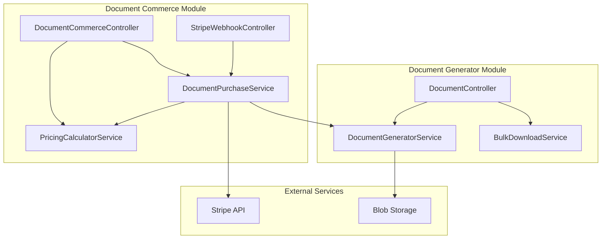
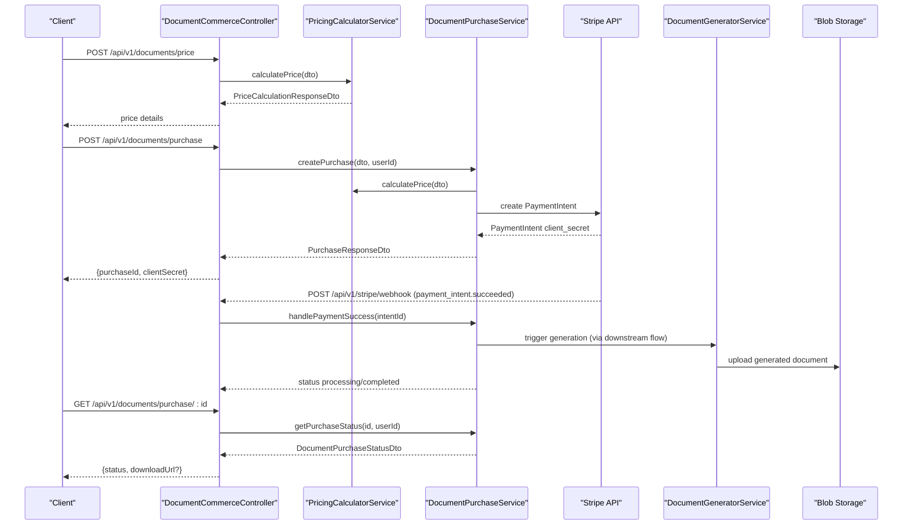
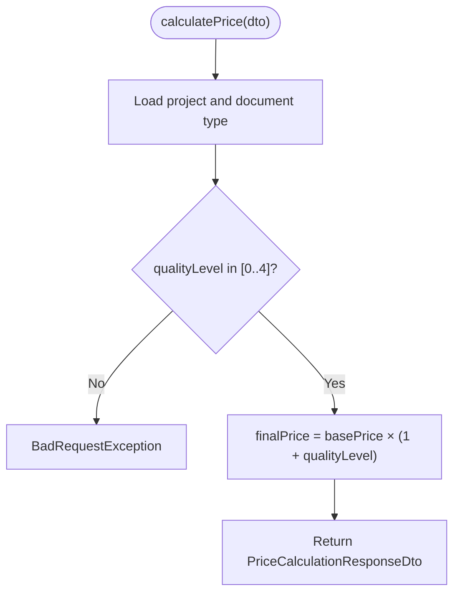
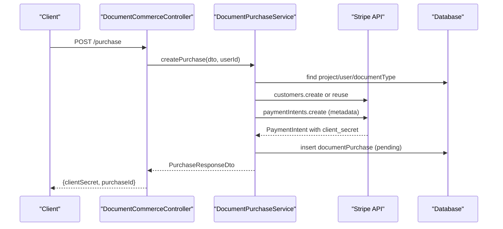
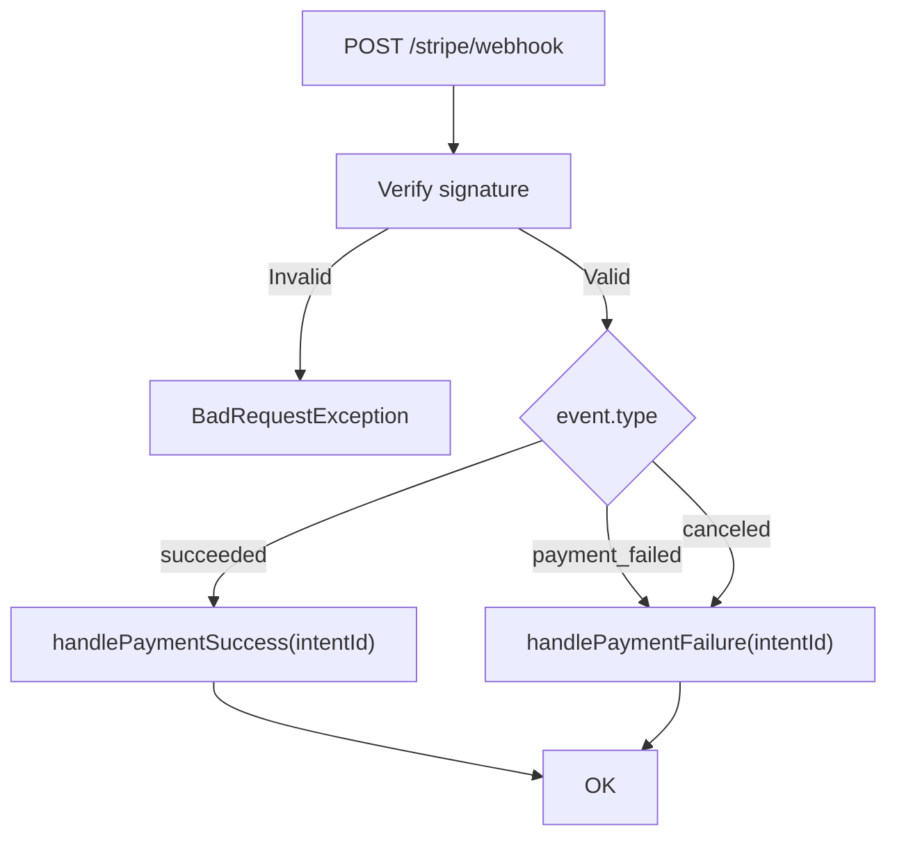
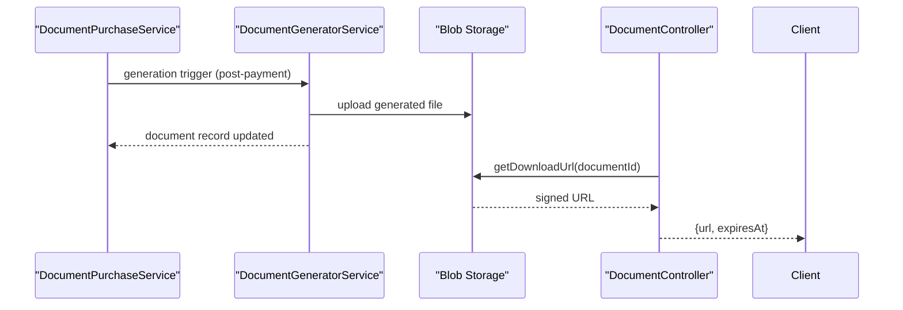
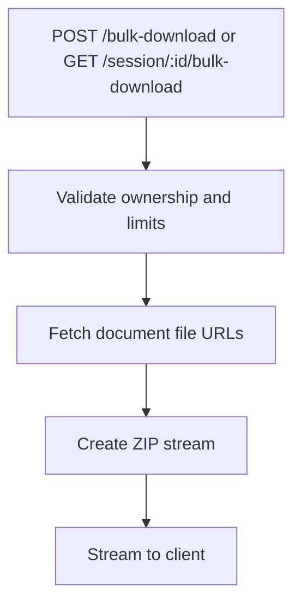
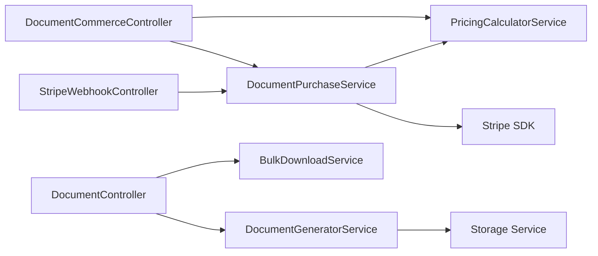

# Document Commerce

<cite>
**Referenced Files in This Document**
- [document-commerce.controller.ts](file://apps/api/src/modules/document-commerce/document-commerce.controller.ts)
- [stripe-webhook.controller.ts](file://apps/api/src/modules/document-commerce/stripe-webhook.controller.ts)
- [document-commerce.module.ts](file://apps/api/src/modules/document-commerce/document-commerce.module.ts)
- [document-commerce.dto.ts](file://apps/api/src/modules/document-commerce/dto/document-commerce.dto.ts)
- [pricing-calculator.service.ts](file://apps/api/src/modules/document-commerce/services/pricing-calculator.service.ts)
- [document-purchase.service.ts](file://apps/api/src/modules/document-commerce/services/document-purchase.service.ts)
- [document.controller.ts](file://apps/api/src/modules/document-generator/controllers/document.controller.ts)
- [document-generator.module.ts](file://apps/api/src/modules/document-generator/document-generator.module.ts)
- [document-generator.service.ts](file://apps/api/src/modules/document-generator/services/document-generator.service.ts)
- [bulk-download.service.ts](file://apps/api/src/modules/document-generator/services/bulk-download.service.ts)
</cite>

## Table of Contents
1. [Introduction](#introduction)
2. [Project Structure](#project-structure)
3. [Core Components](#core-components)
4. [Architecture Overview](#architecture-overview)
5. [Detailed Component Analysis](#detailed-component-analysis)
6. [Dependency Analysis](#dependency-analysis)
7. [Performance Considerations](#performance-considerations)
8. [Troubleshooting Guide](#troubleshooting-guide)
9. [Conclusion](#conclusion)

## Introduction
This document describes the Document Commerce system that powers per-document pricing, Stripe-based payments, purchase orchestration, and instant delivery of generated documents. It covers:
- REST endpoints for pricing calculation and purchases
- Stripe PaymentIntent integration and webhook handling
- Instant download generation and delivery
- Access control and document availability gating
- Examples of pricing tiers, bulk downloads, and purchase flow optimization

## Project Structure
The Document Commerce system spans two NestJS modules:
- Document Commerce module: pricing, purchases, and Stripe webhooks
- Document Generator module: document generation, storage, and delivery

**Diagram sources**
- [document-commerce.controller.ts:34-97](file://apps/api/src/modules/document-commerce/document-commerce.controller.ts#L34-L97)
- [stripe-webhook.controller.ts:22-143](file://apps/api/src/modules/document-commerce/stripe-webhook.controller.ts#L22-L143)
- [pricing-calculator.service.ts:57-226](file://apps/api/src/modules/document-commerce/services/pricing-calculator.service.ts#L57-L226)
- [document-purchase.service.ts:17-273](file://apps/api/src/modules/document-commerce/services/document-purchase.service.ts#L17-L273)
- [document.controller.ts:35-277](file://apps/api/src/modules/document-generator/controllers/document.controller.ts#L35-L277)
- [document-generator.service.ts:21-608](file://apps/api/src/modules/document-generator/services/document-generator.service.ts#L21-L608)
- [bulk-download.service.ts:17-266](file://apps/api/src/modules/document-generator/services/bulk-download.service.ts#L17-L266)

**Section sources**
- [document-commerce.module.ts:14-20](file://apps/api/src/modules/document-commerce/document-commerce.module.ts#L14-L20)
- [document-generator.module.ts:19-46](file://apps/api/src/modules/document-generator/document-generator.module.ts#L19-L46)

## Core Components
- DocumentCommerceController: exposes REST endpoints for pricing, project documents, purchase creation, and purchase status.
- StripeWebhookController: validates and processes Stripe webhook events to update purchase state and trigger generation.
- PricingCalculatorService: computes per-document prices based on quality tiers and project/document metadata.
- DocumentPurchaseService: orchestrates Stripe PaymentIntents, records purchases, and handles webhook outcomes.
- DocumentController: manages document retrieval, download URLs, and bulk downloads.
- DocumentGeneratorService: generates documents, uploads to storage, and notifies users.
- BulkDownloadService: creates ZIP archives of session or selected documents.

**Section sources**
- [document-commerce.controller.ts:34-97](file://apps/api/src/modules/document-commerce/document-commerce.controller.ts#L34-L97)
- [stripe-webhook.controller.ts:22-143](file://apps/api/src/modules/document-commerce/stripe-webhook.controller.ts#L22-L143)
- [pricing-calculator.service.ts:57-226](file://apps/api/src/modules/document-commerce/services/pricing-calculator.service.ts#L57-L226)
- [document-purchase.service.ts:17-273](file://apps/api/src/modules/document-commerce/services/document-purchase.service.ts#L17-L273)
- [document.controller.ts:35-277](file://apps/api/src/modules/document-generator/controllers/document.controller.ts#L35-L277)
- [document-generator.service.ts:21-608](file://apps/api/src/modules/document-generator/services/document-generator.service.ts#L21-L608)
- [bulk-download.service.ts:17-266](file://apps/api/src/modules/document-generator/services/bulk-download.service.ts#L17-L266)

## Architecture Overview
The system integrates Stripe for payment initiation and completion, then triggers document generation and delivers instant downloads.

**Diagram sources**
- [document-commerce.controller.ts:46-96](file://apps/api/src/modules/document-commerce/document-commerce.controller.ts#L46-L96)
- [pricing-calculator.service.ts:65-107](file://apps/api/src/modules/document-commerce/services/pricing-calculator.service.ts#L65-L107)
- [document-purchase.service.ts:39-161](file://apps/api/src/modules/document-commerce/services/document-purchase.service.ts#L39-L161)
- [stripe-webhook.controller.ts:55-103](file://apps/api/src/modules/document-commerce/stripe-webhook.controller.ts#L55-L103)
- [document-generator.service.ts:142-219](file://apps/api/src/modules/document-generator/services/document-generator.service.ts#L142-L219)

## Detailed Component Analysis

### REST API Endpoints

#### Pricing and Availability
- POST /api/v1/documents/price
  - Body: PriceCalculationDto
  - Response: PriceCalculationResponseDto
  - Purpose: Calculate final price based on base price, quality multiplier, and currency.
- GET /api/v1/documents/project/:projectId
  - Path param: projectId
  - Response: ProjectDocumentsDto
  - Purpose: List available and previously purchased documents for a project, gated by required facts.

#### Purchasing
- POST /api/v1/documents/purchase
  - Body: CreatePurchaseDto
  - Response: PurchaseResponseDto
  - Purpose: Create a Stripe PaymentIntent and persist purchase record.
- GET /api/v1/documents/purchase/:purchaseId
  - Path param: purchaseId
  - Response: DocumentPurchaseStatusDto
  - Purpose: Retrieve purchase status and optional download URL.
- GET /api/v1/documents/purchases
  - Response: Array of DocumentPurchaseStatusDto
  - Purpose: List all purchases for the current user.

#### Stripe Webhooks
- POST /api/v1/stripe/webhook
  - Headers: stripe-signature
  - Body: Raw webhook payload
  - Purpose: Verify signature and handle payment_intent.succeeded, payment_intent.payment_failed, payment_intent.canceled.

**Section sources**
- [document-commerce.controller.ts:42-96](file://apps/api/src/modules/document-commerce/document-commerce.controller.ts#L42-L96)
- [stripe-webhook.controller.ts:51-103](file://apps/api/src/modules/document-commerce/stripe-webhook.controller.ts#L51-L103)
- [document-commerce.dto.ts:12-100](file://apps/api/src/modules/document-commerce/dto/document-commerce.dto.ts#L12-L100)

### Pricing Calculation Service
- Quality tiers: 0 (Basic) to 4 (Enterprise), with multipliers 1x–5x.
- Base price lookup from document types; default fallback applied if missing.
- Estimated pages and feature lists per quality level.
- Project-based gating: required facts threshold determines availability.

**Diagram sources**
- [pricing-calculator.service.ts:65-107](file://apps/api/src/modules/document-commerce/services/pricing-calculator.service.ts#L65-L107)

**Section sources**
- [pricing-calculator.service.ts:16-56](file://apps/api/src/modules/document-commerce/services/pricing-calculator.service.ts#L16-L56)
- [pricing-calculator.service.ts:65-107](file://apps/api/src/modules/document-commerce/services/pricing-calculator.service.ts#L65-L107)
- [pricing-calculator.service.ts:193-226](file://apps/api/src/modules/document-commerce/services/pricing-calculator.service.ts#L193-L226)

### Document Purchase Service
- Validates project ownership and document type existence.
- Prevents re-purchasing the same document at the same or higher quality.
- Creates or retrieves Stripe customer, then creates PaymentIntent with metadata.
- Records purchase in DB with initial status pending.
- Webhook handlers:
  - payment_intent.succeeded: set status to processing (generation starts).
  - payment_intent.payment_failed/canceled: set status to failed.

**Diagram sources**
- [document-commerce.controller.ts:68-75](file://apps/api/src/modules/document-commerce/document-commerce.controller.ts#L68-L75)
- [document-purchase.service.ts:39-161](file://apps/api/src/modules/document-commerce/services/document-purchase.service.ts#L39-L161)

**Section sources**
- [document-purchase.service.ts:39-161](file://apps/api/src/modules/document-commerce/services/document-purchase.service.ts#L39-L161)
- [document-purchase.service.ts:228-272](file://apps/api/src/modules/document-commerce/services/document-purchase.service.ts#L228-L272)

### Stripe Webhook Handling
- Signature verification required; rejects invalid/unverified events.
- Supported events: succeeded, payment_failed, canceled.
- Delegates to DocumentPurchaseService to update purchase status.

**Diagram sources**
- [stripe-webhook.controller.ts:55-103](file://apps/api/src/modules/document-commerce/stripe-webhook.controller.ts#L55-L103)
- [document-purchase.service.ts:228-272](file://apps/api/src/modules/document-commerce/services/document-purchase.service.ts#L228-L272)

**Section sources**
- [stripe-webhook.controller.ts:55-103](file://apps/api/src/modules/document-commerce/stripe-webhook.controller.ts#L55-L103)
- [document-purchase.service.ts:228-272](file://apps/api/src/modules/document-commerce/services/document-purchase.service.ts#L228-L272)

### Document Generation and Delivery
- After payment success, purchase status transitions to processing; generation is triggered by downstream flows.
- Generated documents are uploaded to blob storage and marked as generated/approved.
- Secure download URLs are issued with configurable expiration.

**Diagram sources**
- [document-purchase.service.ts:228-251](file://apps/api/src/modules/document-commerce/services/document-purchase.service.ts#L228-L251)
- [document-generator.service.ts:142-219](file://apps/api/src/modules/document-generator/services/document-generator.service.ts#L142-L219)
- [document.controller.ts:119-141](file://apps/api/src/modules/document-generator/controllers/document.controller.ts#L119-L141)

**Section sources**
- [document-generator.service.ts:142-219](file://apps/api/src/modules/document-generator/services/document-generator.service.ts#L142-L219)
- [document.controller.ts:119-141](file://apps/api/src/modules/document-generator/controllers/document.controller.ts#L119-L141)

### Bulk Downloads
- Supports downloading all session documents or selected documents as a ZIP.
- Enforces ownership checks and limits (e.g., max 50 documents per selection).
- Streams ZIP content directly to clients.

**Diagram sources**
- [document.controller.ts:143-197](file://apps/api/src/modules/document-generator/controllers/document.controller.ts#L143-L197)
- [bulk-download.service.ts:28-190](file://apps/api/src/modules/document-generator/services/bulk-download.service.ts#L28-L190)

**Section sources**
- [document.controller.ts:143-197](file://apps/api/src/modules/document-generator/controllers/document.controller.ts#L143-L197)
- [bulk-download.service.ts:28-190](file://apps/api/src/modules/document-generator/services/bulk-download.service.ts#L28-L190)

## Dependency Analysis
- Controllers depend on services for business logic.
- Services depend on Stripe SDK and Prisma for persistence.
- Document generation depends on storage services and template/content engines.
- Webhooks depend on Stripe secret configuration.

**Diagram sources**
- [document-commerce.controller.ts:34-97](file://apps/api/src/modules/document-commerce/document-commerce.controller.ts#L34-L97)
- [stripe-webhook.controller.ts:22-143](file://apps/api/src/modules/document-commerce/stripe-webhook.controller.ts#L22-L143)
- [pricing-calculator.service.ts:57-226](file://apps/api/src/modules/document-commerce/services/pricing-calculator.service.ts#L57-L226)
- [document-purchase.service.ts:17-273](file://apps/api/src/modules/document-commerce/services/document-purchase.service.ts#L17-L273)
- [document.controller.ts:35-277](file://apps/api/src/modules/document-generator/controllers/document.controller.ts#L35-L277)
- [document-generator.service.ts:21-608](file://apps/api/src/modules/document-generator/services/document-generator.service.ts#L21-L608)
- [bulk-download.service.ts:17-266](file://apps/api/src/modules/document-generator/services/bulk-download.service.ts#L17-L266)

**Section sources**
- [document-commerce.module.ts:14-20](file://apps/api/src/modules/document-commerce/document-commerce.module.ts#L14-L20)
- [document-generator.module.ts:19-46](file://apps/api/src/modules/document-generator/document-generator.module.ts#L19-L46)

## Performance Considerations
- Payment intent creation and purchase recording are synchronous; consider queuing for high throughput.
- Webhook verification adds latency but ensures security; keep signature verification enabled in production.
- Bulk ZIP generation streams content; tune compression level and limit concurrent large archives.
- Pricing calculations and project queries should leverage database indexes on project/user/documentType identifiers.

## Troubleshooting Guide
Common issues and resolutions:
- Missing Stripe configuration: Payments disabled warnings; configure STRIPE_SECRET_KEY and STRIPE_WEBHOOK_SECRET.
- Invalid webhook signature: Ensure webhook secret is set and signature header is present.
- Purchase conflicts: Re-purchasing the same document at equal/higher quality is blocked; adjust quality level.
- Access denied: Document and purchase endpoints enforce ownership; verify JWT and user context.
- Download not available: Documents must be in GENERATED or APPROVED state; verify generation pipeline.

**Section sources**
- [stripe-webhook.controller.ts:33-48](file://apps/api/src/modules/document-commerce/stripe-webhook.controller.ts#L33-L48)
- [document-purchase.service.ts:27-34](file://apps/api/src/modules/document-commerce/services/document-purchase.service.ts#L27-L34)
- [document.controller.ts:119-141](file://apps/api/src/modules/document-generator/controllers/document.controller.ts#L119-L141)
- [document-generator.service.ts:371-388](file://apps/api/src/modules/document-generator/services/document-generator.service.ts#L371-L388)

## Conclusion
The Document Commerce system provides a clear, extensible flow from pricing to payment and instant document delivery. By leveraging Stripe PaymentIntents, robust access controls, and a modular document generation pipeline, it supports both individual purchases and bulk workflows while maintaining security and scalability.