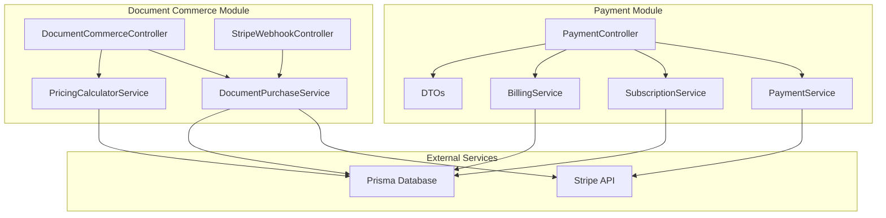
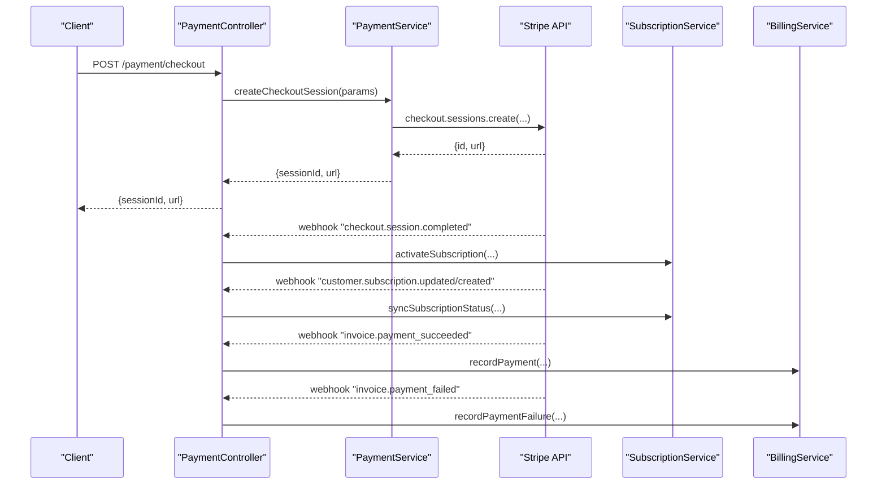
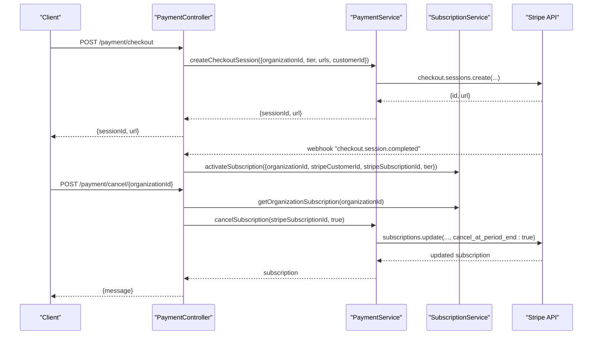
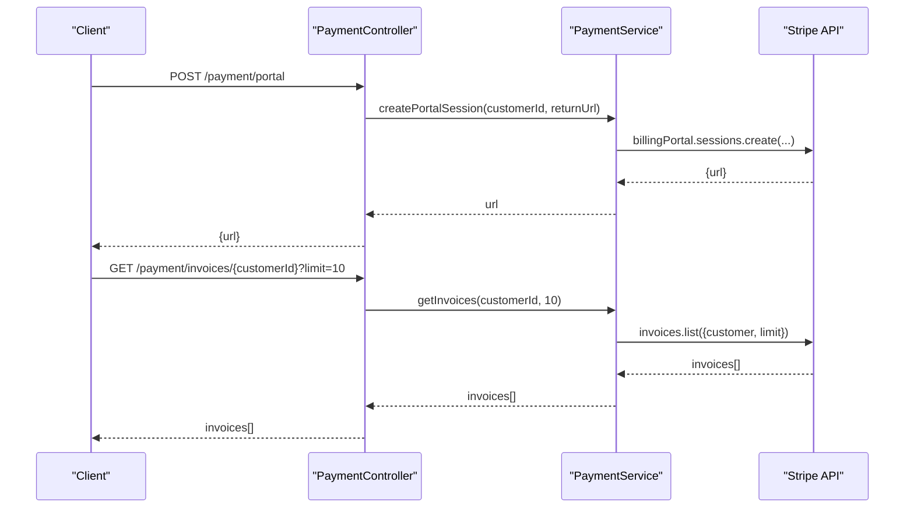
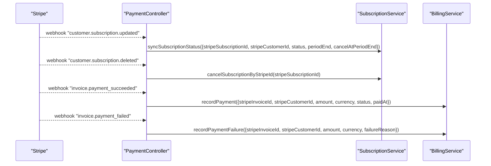
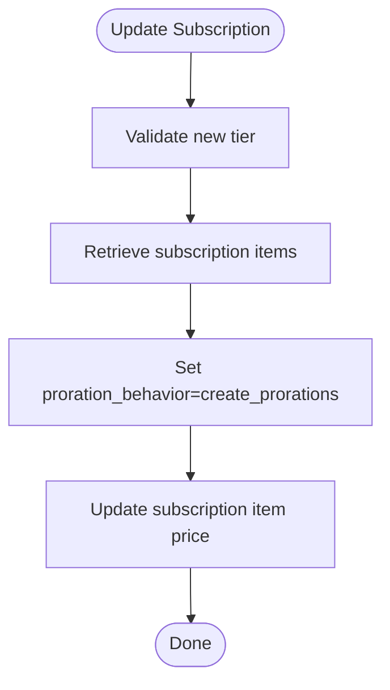
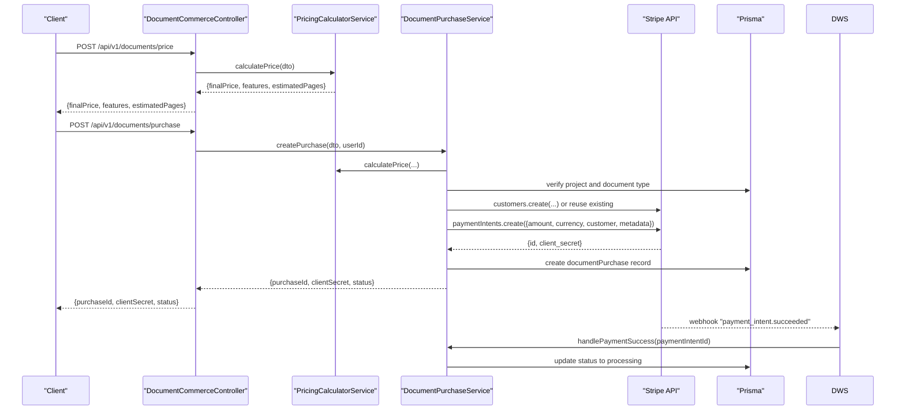
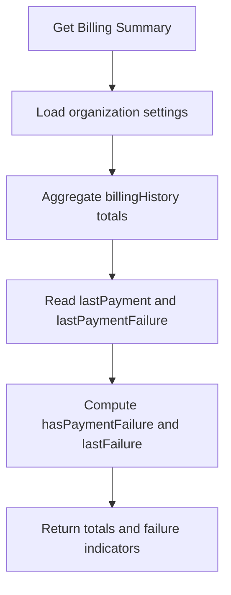
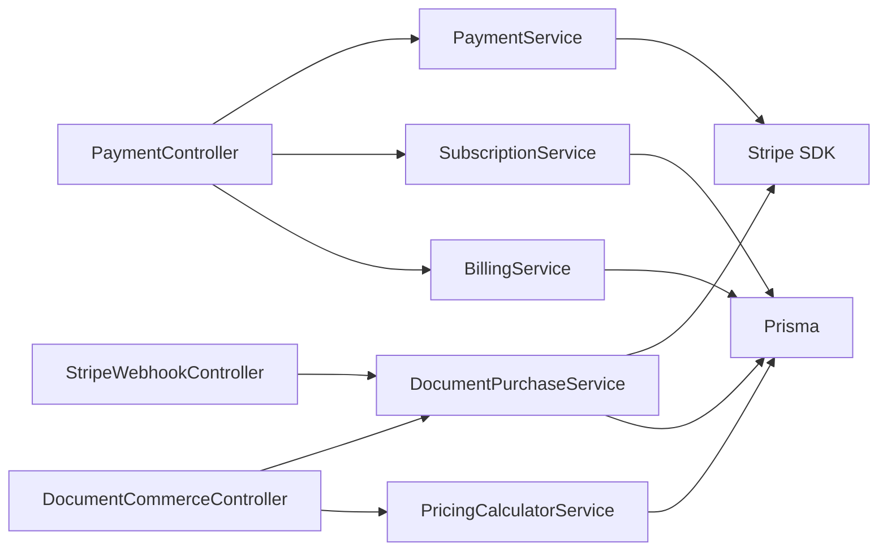

# Payment & Billing API

<cite>
**Referenced Files in This Document**
- [payment.controller.ts](file://apps/api/src/modules/payment/payment.controller.ts)
- [payment.service.ts](file://apps/api/src/modules/payment/payment.service.ts)
- [subscription.service.ts](file://apps/api/src/modules/payment/subscription.service.ts)
- [billing.service.ts](file://apps/api/src/modules/payment/billing.service.ts)
- [payment.dto.ts](file://apps/api/src/modules/payment/dto/payment.dto.ts)
- [document-commerce.controller.ts](file://apps/api/src/modules/document-commerce/document-commerce.controller.ts)
- [stripe-webhook.controller.ts](file://apps/api/src/modules/document-commerce/stripe-webhook.controller.ts)
- [document-purchase.service.ts](file://apps/api/src/modules/document-commerce/services/document-purchase.service.ts)
- [pricing-calculator.service.ts](file://apps/api/src/modules/document-commerce/services/pricing-calculator.service.ts)
- [admin.module.ts](file://apps/api/src/modules/admin/admin.module.ts)
</cite>

## Table of Contents
1. [Introduction](#introduction)
2. [Project Structure](#project-structure)
3. [Core Components](#core-components)
4. [Architecture Overview](#architecture-overview)
5. [Detailed Component Analysis](#detailed-component-analysis)
6. [Dependency Analysis](#dependency-analysis)
7. [Performance Considerations](#performance-considerations)
8. [Troubleshooting Guide](#troubleshooting-guide)
9. [Conclusion](#conclusion)
10. [Appendices](#appendices)

## Introduction
This document provides comprehensive API documentation for Quiz-to-Build’s payment and billing system. It covers:
- Subscription management APIs for creating checkout sessions, retrieving subscription status, and managing cancellations/resumes
- Stripe integration endpoints for customer portal sessions, invoice retrieval, and upcoming invoice previews
- Webhook handling for payment events (subscription lifecycle and invoice payments)
- Recurring billing management and proration behavior
- Document purchase APIs for per-document commerce using Stripe PaymentIntents
- Revenue tracking services and billing summaries
- Administrative controls and reporting endpoints
- Security and PCI considerations, error handling, and operational guidance

## Project Structure
The payment and billing capabilities are implemented across two primary modules:
- Payment module: subscription lifecycle, Stripe checkout, portal sessions, invoices, usage, and webhook handling
- Document Commerce module: per-document pricing, purchase orchestration, and Stripe PaymentIntent-based checkout

**Diagram sources**
- [payment.controller.ts:40-396](file://apps/api/src/modules/payment/payment.controller.ts#L40-L396)
- [payment.service.ts:56-316](file://apps/api/src/modules/payment/payment.service.ts#L56-L316)
- [subscription.service.ts:28-237](file://apps/api/src/modules/payment/subscription.service.ts#L28-L237)
- [billing.service.ts:32-270](file://apps/api/src/modules/payment/billing.service.ts#L32-L270)
- [document-commerce.controller.ts:34-98](file://apps/api/src/modules/document-commerce/document-commerce.controller.ts#L34-L98)
- [stripe-webhook.controller.ts:22-144](file://apps/api/src/modules/document-commerce/stripe-webhook.controller.ts#L22-L144)
- [document-purchase.service.ts:17-274](file://apps/api/src/modules/document-commerce/services/document-purchase.service.ts#L17-L274)
- [pricing-calculator.service.ts:57-227](file://apps/api/src/modules/document-commerce/services/pricing-calculator.service.ts#L57-L227)

**Section sources**
- [payment.controller.ts:40-396](file://apps/api/src/modules/payment/payment.controller.ts#L40-L396)
- [document-commerce.controller.ts:34-98](file://apps/api/src/modules/document-commerce/document-commerce.controller.ts#L34-L98)

## Core Components
- PaymentController: Exposes endpoints for subscription tiers, checkout, portal sessions, subscription status, invoices, usage, cancellation/resume, and Stripe webhooks
- PaymentService: Stripe integration for checkout sessions, customer portal, customer creation, subscription retrieval/cancel/resume/update, webhook verification, invoice listing, and upcoming invoice preview
- SubscriptionService: Manages organization subscription state, activation, synchronization from Stripe webhooks, cancellation by Stripe ID, feature access checks, tier comparisons, and tier queries
- BillingService: Retrieves invoices, upcoming invoice previews, records successful/failed payments into organization settings, computes billing summaries, and aggregates usage stats
- DocumentCommerceController: Provides pricing calculation, project document listings, purchase creation, purchase status, and user purchase history
- StripeWebhookController: Handles Stripe webhooks for document purchases (payment intent success/failure/canceled)
- DocumentPurchaseService: Orchestrates per-document purchases with PaymentIntents, manages purchase records, and updates statuses upon webhook events
- PricingCalculatorService: Implements quality-based pricing model and project document availability

**Section sources**
- [payment.controller.ts:40-396](file://apps/api/src/modules/payment/payment.controller.ts#L40-L396)
- [payment.service.ts:56-316](file://apps/api/src/modules/payment/payment.service.ts#L56-L316)
- [subscription.service.ts:28-237](file://apps/api/src/modules/payment/subscription.service.ts#L28-L237)
- [billing.service.ts:32-270](file://apps/api/src/modules/payment/billing.service.ts#L32-L270)
- [document-commerce.controller.ts:34-98](file://apps/api/src/modules/document-commerce/document-commerce.controller.ts#L34-L98)
- [stripe-webhook.controller.ts:22-144](file://apps/api/src/modules/document-commerce/stripe-webhook.controller.ts#L22-L144)
- [document-purchase.service.ts:17-274](file://apps/api/src/modules/document-commerce/services/document-purchase.service.ts#L17-L274)
- [pricing-calculator.service.ts:57-227](file://apps/api/src/modules/document-commerce/services/pricing-calculator.service.ts#L57-L227)

## Architecture Overview
The system integrates NestJS controllers and services with Stripe for payment processing and with Prisma for persistence. Webhooks from Stripe trigger updates to subscriptions and purchases, while controllers expose authenticated endpoints for clients.

**Diagram sources**
- [payment.controller.ts:84-324](file://apps/api/src/modules/payment/payment.controller.ts#L84-L324)
- [payment.service.ts:104-152](file://apps/api/src/modules/payment/payment.service.ts#L104-L152)
- [subscription.service.ts:74-132](file://apps/api/src/modules/payment/subscription.service.ts#L74-L132)
- [billing.service.ts:91-190](file://apps/api/src/modules/payment/billing.service.ts#L91-L190)

## Detailed Component Analysis

### Subscription Management APIs
Endpoints for subscription lifecycle:
- GET /payment/tiers: Returns available subscription tiers and features
- POST /payment/checkout: Creates a Stripe Checkout session for subscription upgrade
- POST /payment/portal: Creates a Stripe Billing Portal session for customer-managed billing
- GET /payment/subscription/{organizationId}: Retrieves organization subscription status
- GET /payment/invoices/{customerId}: Lists invoices for a customer
- GET /payment/usage/{organizationId}: Returns usage vs limits per feature
- POST /payment/cancel/{organizationId}: Schedules cancellation at period end
- POST /payment/resume/{organizationId}: Resumes a previously scheduled cancellation

**Diagram sources**
- [payment.controller.ts:84-244](file://apps/api/src/modules/payment/payment.controller.ts#L84-L244)
- [payment.service.ts:104-152](file://apps/api/src/modules/payment/payment.service.ts#L104-L152)
- [subscription.service.ts:74-92](file://apps/api/src/modules/payment/subscription.service.ts#L74-L92)

**Section sources**
- [payment.controller.ts:73-244](file://apps/api/src/modules/payment/payment.controller.ts#L73-L244)
- [payment.service.ts:104-270](file://apps/api/src/modules/payment/payment.service.ts#L104-L270)
- [subscription.service.ts:37-92](file://apps/api/src/modules/payment/subscription.service.ts#L37-L92)

### Stripe Integration Endpoints
- Customer portal session: POST /payment/portal with customerId and returnUrl
- Invoice listing: GET /payment/invoices/{customerId}?limit=N
- Upcoming invoice preview: PaymentService.getInvoices(customerId, limit) and PaymentService.getUpcomingInvoice(customerId)
- Webhook verification: PaymentService.constructWebhookEvent(rawBody, signature, webhookSecret)

**Diagram sources**
- [payment.controller.ts:102-177](file://apps/api/src/modules/payment/payment.controller.ts#L102-L177)
- [payment.service.ts:157-193](file://apps/api/src/modules/payment/payment.service.ts#L157-L193)
- [payment.service.ts:285-314](file://apps/api/src/modules/payment/payment.service.ts#L285-L314)

**Section sources**
- [payment.controller.ts:102-177](file://apps/api/src/modules/payment/payment.controller.ts#L102-L177)
- [payment.service.ts:157-193](file://apps/api/src/modules/payment/payment.service.ts#L157-L193)
- [payment.service.ts:285-314](file://apps/api/src/modules/payment/payment.service.ts#L285-L314)

### Webhook Handling for Payment Events
- Endpoint: POST /payment/webhook (authenticated via Stripe signature)
- Supported events:
  - checkout.session.completed → activate subscription
  - customer.subscription.created/updated → sync status
  - customer.subscription.deleted → cancel by Stripe ID
  - invoice.payment_succeeded → record payment
  - invoice.payment_failed → record failure

**Diagram sources**
- [payment.controller.ts:272-324](file://apps/api/src/modules/payment/payment.controller.ts#L272-L324)
- [subscription.service.ts:97-165](file://apps/api/src/modules/payment/subscription.service.ts#L97-L165)
- [billing.service.ts:91-190](file://apps/api/src/modules/payment/billing.service.ts#L91-L190)

**Section sources**
- [payment.controller.ts:272-324](file://apps/api/src/modules/payment/payment.controller.ts#L272-L324)
- [subscription.service.ts:97-165](file://apps/api/src/modules/payment/subscription.service.ts#L97-L165)
- [billing.service.ts:91-190](file://apps/api/src/modules/payment/billing.service.ts#L91-L190)

### Recurring Billing Management and Proration
- Subscription updates: PaymentService.updateSubscription(subscriptionId, newTier) sets proration_behavior to create prorations
- Cancellations: PaymentService.cancelSubscription(subscriptionId, cancelAtPeriodEnd=true) schedules cancellation at period end; resume clears cancel_at_period_end

**Diagram sources**
- [payment.service.ts:242-269](file://apps/api/src/modules/payment/payment.service.ts#L242-L269)

**Section sources**
- [payment.service.ts:242-269](file://apps/api/src/modules/payment/payment.service.ts#L242-L269)

### Document Purchase APIs and Commerce Workflow
Endpoints:
- POST /api/v1/documents/price: Calculate price for a document at a given quality level
- GET /api/v1/documents/project/{projectId}: List available and purchased documents for a project
- POST /api/v1/documents/purchase: Create a purchase using Stripe PaymentIntent
- GET /api/v1/documents/purchase/{purchaseId}: Get purchase status
- GET /api/v1/documents/purchases: Get all purchases for the current user

**Diagram sources**
- [document-commerce.controller.ts:46-75](file://apps/api/src/modules/document-commerce/document-commerce.controller.ts#L46-L75)
- [pricing-calculator.service.ts:65-107](file://apps/api/src/modules/document-commerce/services/pricing-calculator.service.ts#L65-L107)
- [document-purchase.service.ts:39-161](file://apps/api/src/modules/document-commerce/services/document-purchase.service.ts#L39-L161)
- [stripe-webhook.controller.ts:108-116](file://apps/api/src/modules/document-commerce/stripe-webhook.controller.ts#L108-L116)

**Section sources**
- [document-commerce.controller.ts:46-96](file://apps/api/src/modules/document-commerce/document-commerce.controller.ts#L46-L96)
- [pricing-calculator.service.ts:65-107](file://apps/api/src/modules/document-commerce/services/pricing-calculator.service.ts#L65-L107)
- [document-purchase.service.ts:39-161](file://apps/api/src/modules/document-commerce/services/document-purchase.service.ts#L39-L161)
- [stripe-webhook.controller.ts:108-116](file://apps/api/src/modules/document-commerce/stripe-webhook.controller.ts#L108-L116)

### Revenue Tracking and Reporting
- BillingService.getInvoices and getUpcomingInvoice provide invoice-level details and previews
- BillingService.getBillingSummary aggregates total paid, last payment, and last failure indicators
- SubscriptionService.hasFeatureAccess enforces feature limits based on tier

**Diagram sources**
- [billing.service.ts:195-234](file://apps/api/src/modules/payment/billing.service.ts#L195-L234)

**Section sources**
- [billing.service.ts:44-86](file://apps/api/src/modules/payment/billing.service.ts#L44-L86)
- [billing.service.ts:195-234](file://apps/api/src/modules/payment/billing.service.ts#L195-L234)
- [subscription.service.ts:170-189](file://apps/api/src/modules/payment/subscription.service.ts#L170-L189)

### Administrative Controls
- AdminModule is present but does not expose billing-specific controllers in the analyzed files
- Administrators can manage questionnaires and audits via AdminModule; billing administration endpoints are not included in the current codebase

**Section sources**
- [admin.module.ts:1-14](file://apps/api/src/modules/admin/admin.module.ts#L1-L14)

## Dependency Analysis
- Controllers depend on services for business logic and external integrations
- Services depend on Stripe SDK and Prisma for persistence
- DTOs define request/response contracts for endpoints
- Webhooks integrate asynchronously with services to keep state consistent

**Diagram sources**
- [payment.controller.ts:45-53](file://apps/api/src/modules/payment/payment.controller.ts#L45-L53)
- [document-commerce.controller.ts:37-40](file://apps/api/src/modules/document-commerce/document-commerce.controller.ts#L37-L40)
- [stripe-webhook.controller.ts:29-34](file://apps/api/src/modules/document-commerce/stripe-webhook.controller.ts#L29-L34)

**Section sources**
- [payment.controller.ts:45-53](file://apps/api/src/modules/payment/payment.controller.ts#L45-L53)
- [document-commerce.controller.ts:37-40](file://apps/api/src/modules/document-commerce/document-commerce.controller.ts#L37-L40)
- [stripe-webhook.controller.ts:29-34](file://apps/api/src/modules/document-commerce/stripe-webhook.controller.ts#L29-L34)

## Performance Considerations
- Use limit parameters for invoice retrieval to avoid large payloads
- Cache tier features and pricing calculations where appropriate
- Batch webhook processing if throughput increases significantly
- Monitor Stripe API latency and configure timeouts for PaymentService operations

## Troubleshooting Guide
Common issues and resolutions:
- Missing Stripe secret key or webhook secret: PaymentService and StripeWebhookController log warnings and reject requests
- Invalid webhook signature: PaymentController and StripeWebhookController return 400 with “Invalid webhook signature”
- Missing raw body for webhook verification: PaymentController requires rawBody for signature verification
- Organization access validation: PaymentController validates user association before sensitive operations
- Payment service not configured: PaymentService throws “Payment service not configured” when STRIPE_SECRET_KEY is absent

Operational checks:
- Confirm environment variables: STRIPE_SECRET_KEY, STRIPE_WEBHOOK_SECRET, and tier-specific price IDs
- Verify webhook endpoints are reachable and signed correctly
- Review logs for “Webhook signature verification failed” or “Payment service not configured”

**Section sources**
- [payment.service.ts:61-72](file://apps/api/src/modules/payment/payment.service.ts#L61-L72)
- [payment.controller.ts:278-294](file://apps/api/src/modules/payment/payment.controller.ts#L278-L294)
- [stripe-webhook.controller.ts:36-48](file://apps/api/src/modules/document-commerce/stripe-webhook.controller.ts#L36-L48)
- [payment.controller.ts:59-68](file://apps/api/src/modules/payment/payment.controller.ts#L59-L68)

## Conclusion
Quiz-to-Build’s payment and billing system provides a robust foundation for subscription management and per-document purchases powered by Stripe. The controllers and services encapsulate Stripe integration, webhook-driven state synchronization, and revenue tracking. Administrators can leverage existing modules for broader platform management, while billing-specific administrative endpoints are not present in the current codebase.

## Appendices

### API Reference: Payment Module
- GET /payment/tiers
  - Description: Returns available subscription tiers and features
  - Auth: None (public)
  - Response: JSON object keyed by tier id
- POST /payment/checkout
  - Description: Create a Stripe Checkout session for subscription upgrade
  - Auth: JWT required
  - Request body: CreateCheckoutDto
  - Response: { sessionId, url }
- POST /payment/portal
  - Description: Create a Stripe Billing Portal session
  - Auth: JWT required
  - Request body: CreatePortalSessionDto
  - Response: { url }
- GET /payment/subscription/{organizationId}
  - Description: Get organization subscription status
  - Auth: JWT required
  - Response: SubscriptionResponseDto
- GET /payment/invoices/{customerId}
  - Description: List invoices for a customer
  - Auth: JWT required
  - Query: limit (optional)
  - Response: InvoiceResponseDto[]
- GET /payment/usage/{organizationId}
  - Description: Get usage stats and limits per feature
  - Auth: JWT required
  - Response: { questionnaires, responses, documents, apiCalls }
- POST /payment/cancel/{organizationId}
  - Description: Schedule cancellation at period end
  - Auth: JWT required
  - Response: { message }
- POST /payment/resume/{organizationId}
  - Description: Resume a previously scheduled cancellation
  - Auth: JWT required
  - Response: { message }
- POST /payment/webhook
  - Description: Stripe webhook endpoint (signature verified)
  - Auth: None (public)
  - Headers: stripe-signature
  - Body: Raw webhook payload
  - Response: { received: true }

**Section sources**
- [payment.controller.ts:73-324](file://apps/api/src/modules/payment/payment.controller.ts#L73-L324)
- [payment.dto.ts:21-112](file://apps/api/src/modules/payment/dto/payment.dto.ts#L21-L112)

### API Reference: Document Commerce Module
- POST /api/v1/documents/price
  - Description: Calculate price for a document at a given quality level
  - Auth: JWT required
  - Request body: PriceCalculationDto
  - Response: PriceCalculationResponseDto
- GET /api/v1/documents/project/{projectId}
  - Description: List available and purchased documents for a project
  - Auth: JWT required
  - Response: ProjectDocumentsDto
- POST /api/v1/documents/purchase
  - Description: Create a purchase using Stripe PaymentIntent
  - Auth: JWT required
  - Request body: CreatePurchaseDto
  - Response: PurchaseResponseDto
- GET /api/v1/documents/purchase/{purchaseId}
  - Description: Get purchase status
  - Auth: JWT required
  - Response: DocumentPurchaseStatusDto
- GET /api/v1/documents/purchases
  - Description: Get all purchases for the current user
  - Auth: JWT required
  - Response: DocumentPurchaseStatusDto[]

**Section sources**
- [document-commerce.controller.ts:46-96](file://apps/api/src/modules/document-commerce/document-commerce.controller.ts#L46-L96)
- [pricing-calculator.service.ts:65-107](file://apps/api/src/modules/document-commerce/services/pricing-calculator.service.ts#L65-L107)
- [document-purchase.service.ts:166-226](file://apps/api/src/modules/document-commerce/services/document-purchase.service.ts#L166-L226)

### Webhook Reference
- Payment module webhooks:
  - checkout.session.completed
  - customer.subscription.created/updated
  - customer.subscription.deleted
  - invoice.payment_succeeded
  - invoice.payment_failed
- Document purchase webhooks:
  - payment_intent.succeeded
  - payment_intent.payment_failed
  - payment_intent.canceled

**Section sources**
- [payment.controller.ts:297-321](file://apps/api/src/modules/payment/payment.controller.ts#L297-L321)
- [stripe-webhook.controller.ts:84-100](file://apps/api/src/modules/document-commerce/stripe-webhook.controller.ts#L84-L100)

### Security and PCI Compliance Notes
- Never handle raw card data; all payment collection is delegated to Stripe
- Verify webhook signatures using STRIPE_WEBHOOK_SECRET
- Store only minimal necessary data; rely on Stripe for payment instrument storage
- Use HTTPS endpoints and enforce JWT authentication for protected routes
- Limit exposure of Stripe keys via environment variables and least-privilege access

**Section sources**
- [payment.controller.ts:278-294](file://apps/api/src/modules/payment/payment.controller.ts#L278-L294)
- [stripe-webhook.controller.ts:71-82](file://apps/api/src/modules/document-commerce/stripe-webhook.controller.ts#L71-L82)