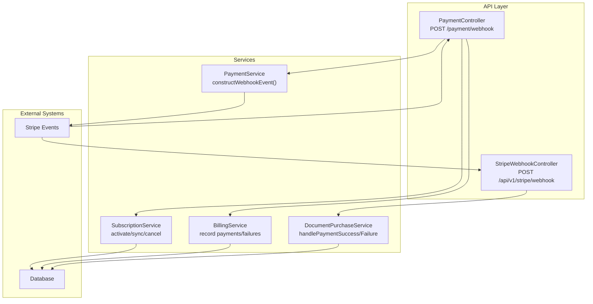
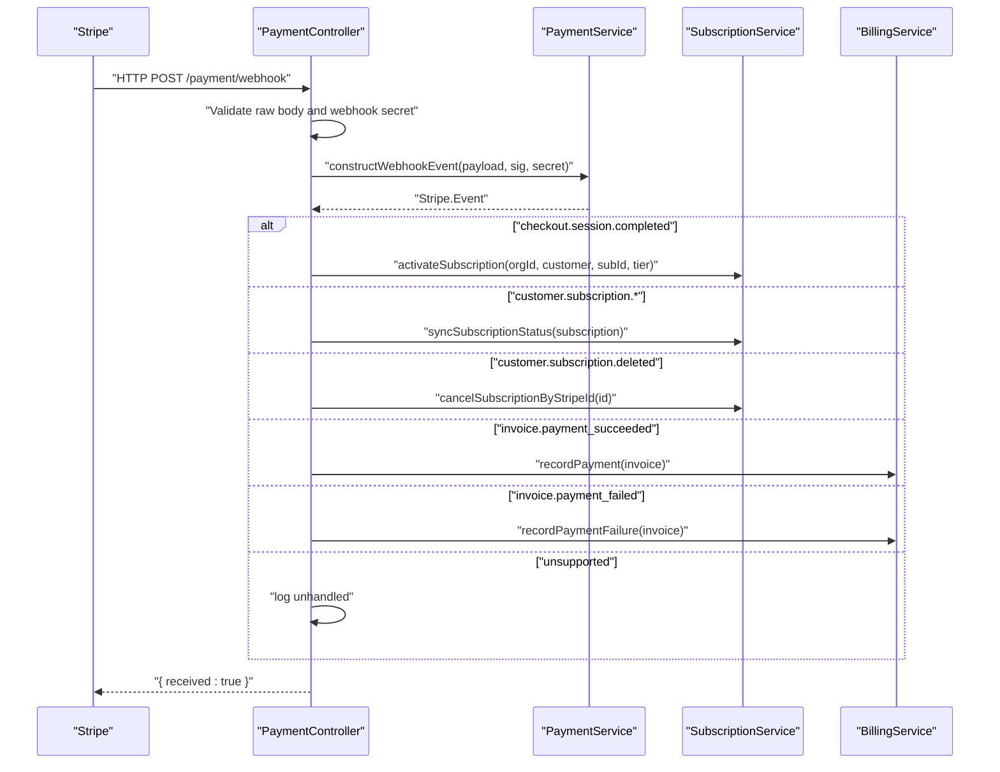
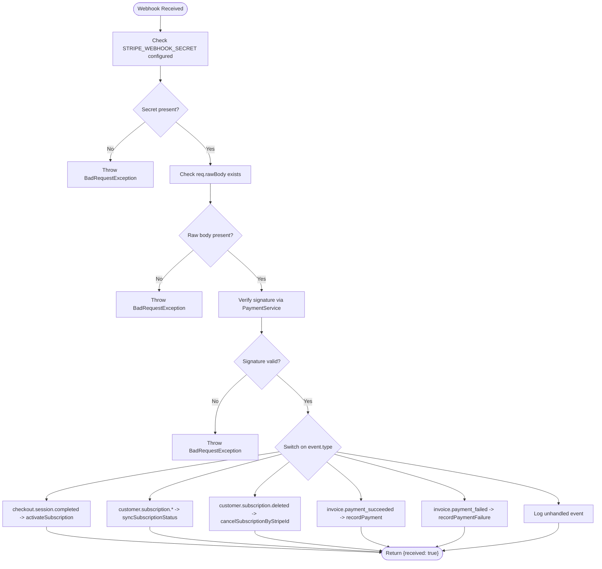
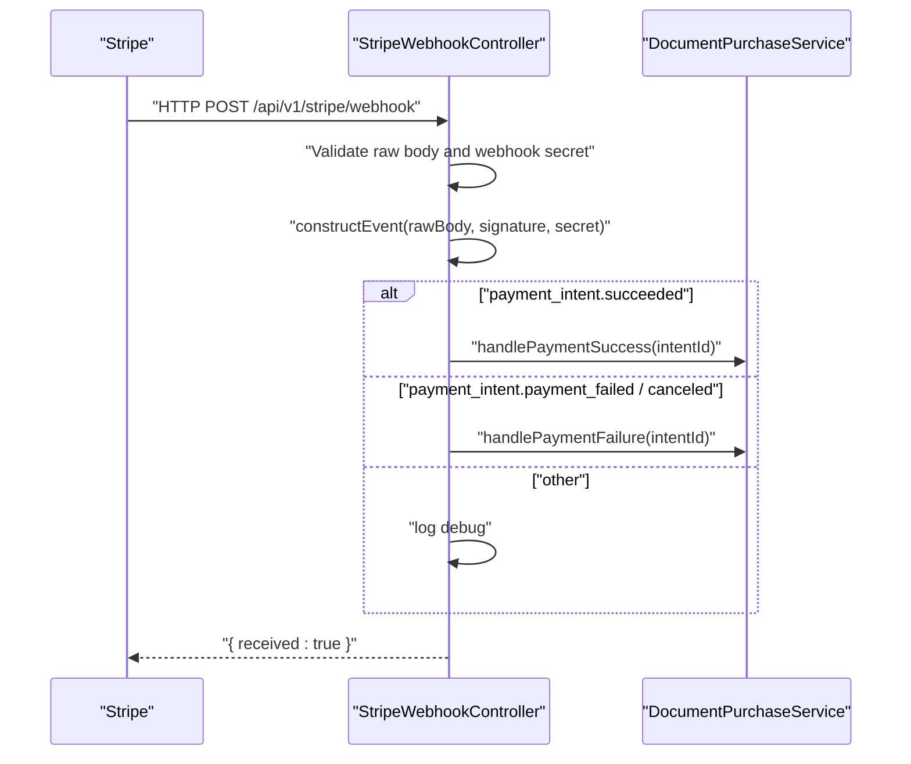
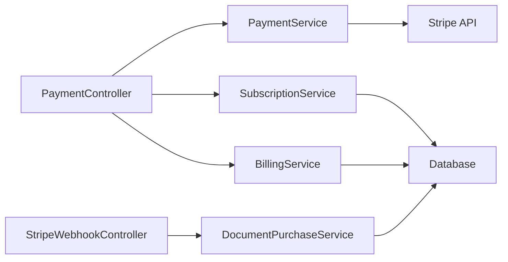

# Stripe Webhooks

<cite>
**Referenced Files in This Document**
- [stripe-webhook.controller.ts](file://apps/api/src/modules/document-commerce/stripe-webhook.controller.ts)
- [payment.controller.ts](file://apps/api/src/modules/payment/payment.controller.ts)
- [payment.service.ts](file://apps/api/src/modules/payment/payment.service.ts)
- [subscription.service.ts](file://apps/api/src/modules/payment/subscription.service.ts)
- [billing.service.ts](file://apps/api/src/modules/payment/billing.service.ts)
- [document-purchase.service.ts](file://apps/api/src/modules/document-commerce/services/document-purchase.service.ts)
- [configuration.ts](file://apps/api/src/config/configuration.ts)
- [payment.controller.spec.ts](file://apps/api/src/modules/payment/payment.controller.spec.ts)
</cite>

## Table of Contents
1. [Introduction](#introduction)
2. [Project Structure](#project-structure)
3. [Core Components](#core-components)
4. [Architecture Overview](#architecture-overview)
5. [Detailed Component Analysis](#detailed-component-analysis)
6. [Dependency Analysis](#dependency-analysis)
7. [Performance Considerations](#performance-considerations)
8. [Troubleshooting Guide](#troubleshooting-guide)
9. [Conclusion](#conclusion)
10. [Appendices](#appendices)

## Introduction
This document explains Quiz-to-Build's Stripe webhook integration and event handling system. It covers endpoint configuration, signature verification, supported event types, security measures, idempotency considerations, payload parsing, error handling, retries, and operational best practices. Two webhook endpoints are implemented: one for subscription-related events and another for per-document purchase events powered by PaymentIntents.

## Project Structure
The Stripe webhook implementation spans two modules:
- Payment module: handles subscription lifecycle events (checkout completion, subscription updates, cancellations, invoice payments).
- Document Commerce module: handles per-document purchase events via PaymentIntents (success, failure, cancellation).

**Diagram sources**
- [payment.controller.ts:272-324](file://apps/api/src/modules/payment/payment.controller.ts#L272-L324)
- [stripe-webhook.controller.ts:55-103](file://apps/api/src/modules/document-commerce/stripe-webhook.controller.ts#L55-L103)
- [payment.service.ts:274-280](file://apps/api/src/modules/payment/payment.service.ts#L274-L280)
- [subscription.service.ts:75-132](file://apps/api/src/modules/payment/subscription.service.ts#L75-L132)
- [billing.service.ts:91-140](file://apps/api/src/modules/payment/billing.service.ts#L91-L140)
- [document-purchase.service.ts:231-272](file://apps/api/src/modules/document-commerce/services/document-purchase.service.ts#L231-L272)

**Section sources**
- [payment.controller.ts:272-324](file://apps/api/src/modules/payment/payment.controller.ts#L272-L324)
- [stripe-webhook.controller.ts:55-103](file://apps/api/src/modules/document-commerce/stripe-webhook.controller.ts#L55-L103)

## Core Components
- PaymentController: Exposes POST /payment/webhook for subscription-related events. Verifies signature using PaymentService.constructWebhookEvent and dispatches to handlers for checkout completion, subscription updates, deletions, and invoice payment outcomes.
- StripeWebhookController: Exposes POST /api/v1/stripe/webhook for per-document purchase events. Verifies signature using Stripe SDK and delegates to DocumentPurchaseService for PaymentIntent outcomes.
- PaymentService: Centralizes Stripe SDK initialization and webhook signature verification.
- SubscriptionService: Activates subscriptions after checkout and synchronizes status from Stripe events.
- BillingService: Records successful and failed invoice payments into organization settings/history.
- DocumentPurchaseService: Manages per-document purchase lifecycle using PaymentIntents and updates purchase records accordingly.

**Section sources**
- [payment.controller.ts:272-324](file://apps/api/src/modules/payment/payment.controller.ts#L272-L324)
- [payment.service.ts:58-79](file://apps/api/src/modules/payment/payment.service.ts#L58-L79)
- [subscription.service.ts:75-132](file://apps/api/src/modules/payment/subscription.service.ts#L75-L132)
- [billing.service.ts:91-140](file://apps/api/src/modules/payment/billing.service.ts#L91-L140)
- [document-purchase.service.ts:231-272](file://apps/api/src/modules/document-commerce/services/document-purchase.service.ts#L231-L272)

## Architecture Overview
The webhook architecture enforces strict signature verification before any business logic executes. Controllers receive raw bodies, verify signatures, parse events, and route to domain-specific services.

**Diagram sources**
- [payment.controller.ts:272-324](file://apps/api/src/modules/payment/payment.controller.ts#L272-L324)
- [payment.service.ts:274-280](file://apps/api/src/modules/payment/payment.service.ts#L274-L280)
- [subscription.service.ts:75-132](file://apps/api/src/modules/payment/subscription.service.ts#L75-L132)
- [billing.service.ts:91-140](file://apps/api/src/modules/payment/billing.service.ts#L91-L140)

## Detailed Component Analysis

### PaymentController Webhook Endpoint
- Endpoint: POST /payment/webhook
- Signature verification: Uses PaymentService.constructWebhookEvent with STRIPE_WEBHOOK_SECRET.
- Supported events:
  - checkout.session.completed: Activates subscription for an organization.
  - customer.subscription.created / updated: Synchronizes subscription status.
  - customer.subscription.deleted: Cancels subscription.
  - invoice.payment_succeeded: Records payment.
  - invoice.payment_failed: Records failure.
- Error handling: Throws BadRequestException on missing raw body, missing/invalid webhook secret, or invalid signature.

**Diagram sources**
- [payment.controller.ts:272-324](file://apps/api/src/modules/payment/payment.controller.ts#L272-L324)
- [payment.service.ts:274-280](file://apps/api/src/modules/payment/payment.service.ts#L274-L280)

**Section sources**
- [payment.controller.ts:272-324](file://apps/api/src/modules/payment/payment.controller.ts#L272-L324)
- [payment.controller.spec.ts:285-501](file://apps/api/src/modules/payment/payment.controller.spec.ts#L285-L501)

### StripeWebhookController (Per-Document Purchases)
- Endpoint: POST /api/v1/stripe/webhook
- Signature verification: Uses Stripe SDK constructEvent with STRIPE_WEBHOOK_SECRET.
- Supported events:
  - payment_intent.succeeded: Delegates to DocumentPurchaseService.handlePaymentSuccess.
  - payment_intent.payment_failed: Delegates to DocumentPurchaseService.handlePaymentFailure.
  - payment_intent.canceled: Delegates to DocumentPurchaseService.handlePaymentFailure.
- Error handling: Throws BadRequestException on missing raw body or missing webhook secret; logs failures.

**Diagram sources**
- [stripe-webhook.controller.ts:55-103](file://apps/api/src/modules/document-commerce/stripe-webhook.controller.ts#L55-L103)
- [document-purchase.service.ts:231-272](file://apps/api/src/modules/document-commerce/services/document-purchase.service.ts#L231-L272)

**Section sources**
- [stripe-webhook.controller.ts:55-103](file://apps/api/src/modules/document-commerce/stripe-webhook.controller.ts#L55-L103)
- [document-purchase.service.ts:231-272](file://apps/api/src/modules/document-commerce/services/document-purchase.service.ts#L231-L272)

### PaymentService (Signature Verification)
- Initializes Stripe SDK with STRIPE_SECRET_KEY and apiVersion.
- Provides constructWebhookEvent(payload, signature, secret) to verify event authenticity.

**Section sources**
- [payment.service.ts:58-79](file://apps/api/src/modules/payment/payment.service.ts#L58-L79)
- [payment.service.ts:274-280](file://apps/api/src/modules/payment/payment.service.ts#L274-L280)

### SubscriptionService (Subscription Lifecycle)
- activateSubscription: Updates organization subscription with Stripe identifiers and sets status to active.
- syncSubscriptionStatus: Synchronizes subscription status, period end, and cancellation flag for all organizations linked to the Stripe customer.
- cancelSubscriptionByStripeId: Downgrades organization to FREE and marks as canceled.

**Section sources**
- [subscription.service.ts:75-132](file://apps/api/src/modules/payment/subscription.service.ts#L75-L132)

### BillingService (Invoice Payments)
- recordPayment: Adds payment record to organization settings.billingHistory and lastPayment.
- recordPaymentFailure: Adds failure record to organization settings.paymentFailures and lastPaymentFailure.

**Section sources**
- [billing.service.ts:91-140](file://apps/api/src/modules/payment/billing.service.ts#L91-L140)

### DocumentPurchaseService (Per-Document Purchases)
- handlePaymentSuccess: Transitions purchase from pending to processing; document generation is triggered by downstream systems.
- handlePaymentFailure: Marks purchase as failed.

**Section sources**
- [document-purchase.service.ts:231-272](file://apps/api/src/modules/document-commerce/services/document-purchase.service.ts#L231-L272)

## Dependency Analysis
- Controllers depend on PaymentService for signature verification and on domain services for business actions.
- Domain services persist state to the database and coordinate with Stripe APIs indirectly via PaymentService for invoice queries.
- Security depends on STRIPE_WEBHOOK_SECRET availability and correct stripe-signature header.

**Diagram sources**
- [payment.controller.ts:272-324](file://apps/api/src/modules/payment/payment.controller.ts#L272-L324)
- [payment.service.ts:274-280](file://apps/api/src/modules/payment/payment.service.ts#L274-L280)
- [subscription.service.ts:75-132](file://apps/api/src/modules/payment/subscription.service.ts#L75-L132)
- [billing.service.ts:91-140](file://apps/api/src/modules/payment/billing.service.ts#L91-L140)
- [document-purchase.service.ts:231-272](file://apps/api/src/modules/document-commerce/services/document-purchase.service.ts#L231-L272)

**Section sources**
- [payment.controller.ts:272-324](file://apps/api/src/modules/payment/payment.controller.ts#L272-L324)
- [payment.service.ts:274-280](file://apps/api/src/modules/payment/payment.service.ts#L274-L280)

## Performance Considerations
- Signature verification is CPU-light but involves cryptographic operations; keep STRIPE_WEBHOOK_SECRET secure and avoid unnecessary re-verification.
- Event handlers perform database writes; ensure database connections are pooled and indexed appropriately for organization lookups.
- Avoid long-running operations in webhook handlers; delegate heavy work to background jobs if needed.

## Troubleshooting Guide
Common issues and resolutions:
- Missing STRIPE_WEBHOOK_SECRET:
  - Symptom: BadRequestException during signature verification.
  - Resolution: Set STRIPE_WEBHOOK_SECRET in environment and redeploy.
- Missing raw body:
  - Symptom: BadRequestException indicating missing raw body.
  - Resolution: Ensure middleware preserves raw body (e.g., NestJS RawBodyMiddleware) and request is sent as application/json.
- Invalid signature:
  - Symptom: BadRequestException with invalid signature.
  - Resolution: Confirm correct webhook secret, verify stripe-signature header, and ensure event timestamp is recent.
- Unhandled event type:
  - Behavior: Logged as unhandled; no action taken.
  - Resolution: Extend controller switch statement if new events are introduced.
- Idempotency:
  - Current behavior: No explicit idempotency key handling; rely on Stripe's replay protection and idempotency headers if used by clients.
  - Recommendation: Implement idempotency keys using a cache/DB to deduplicate events.
- Retry mechanisms:
  - Current behavior: No built-in retry; Stripe retries are handled by Stripe.
  - Recommendation: Add exponential backoff and dead-letter queues for persistent failures.

Operational checks:
- Verify webhook URLs in Stripe Dashboard match deployed endpoints.
- Monitor logs for signature verification failures and unhandled events.
- Use Stripe CLI to test webhooks locally.

**Section sources**
- [payment.controller.ts:272-324](file://apps/api/src/modules/payment/payment.controller.ts#L272-L324)
- [stripe-webhook.controller.ts:55-103](file://apps/api/src/modules/document-commerce/stripe-webhook.controller.ts#L55-L103)
- [payment.controller.spec.ts:285-501](file://apps/api/src/modules/payment/payment.controller.spec.ts#L285-L501)

## Conclusion
Quiz-to-Build implements two robust webhook endpoints: one for subscription lifecycle events and another for per-document purchases. Both enforce strict signature verification and route events to specialized services for idempotent state updates. Production readiness requires secure environment configuration, proper monitoring, and optional idempotency and retry enhancements.

## Appendices

### Environment Variables
- STRIPE_SECRET_KEY: Required for Stripe SDK initialization.
- STRIPE_WEBHOOK_SECRET: Required for webhook signature verification.
- STRIPE_PRICE_PROFESSIONAL, STRIPE_PRICE_ENTERPRISE: Optional overrides for price IDs.

**Section sources**
- [payment.service.ts:61-72](file://apps/api/src/modules/payment/payment.service.ts#L61-L72)
- [payment.service.ts:85-100](file://apps/api/src/modules/payment/payment.service.ts#L85-L100)
- [configuration.ts:95-114](file://apps/api/src/config/configuration.ts#L95-L114)

### Supported Event Types
- Subscription module:
  - checkout.session.completed
  - customer.subscription.created
  - customer.subscription.updated
  - customer.subscription.deleted
  - invoice.payment_succeeded
  - invoice.payment_failed
- Document commerce module:
  - payment_intent.succeeded
  - payment_intent.payment_failed
  - payment_intent.canceled

**Section sources**
- [payment.controller.ts:297-321](file://apps/api/src/modules/payment/payment.controller.ts#L297-L321)
- [stripe-webhook.controller.ts:85-100](file://apps/api/src/modules/document-commerce/stripe-webhook.controller.ts#L85-L100)

### Webhook Security Implementation
- Signature verification: Both controllers verify the stripe-signature header against raw request body using the configured webhook secret.
- Public endpoints: The document-commerce controller is decorated as public to accept unsigned webhook requests; however, signature verification remains mandatory.

**Section sources**
- [payment.controller.ts:272-324](file://apps/api/src/modules/payment/payment.controller.ts#L272-L324)
- [stripe-webhook.controller.ts:55-103](file://apps/api/src/modules/document-commerce/stripe-webhook.controller.ts#L55-L103)

### Payload Parsing and Error Handling
- Raw body requirement: Controllers require req.rawBody to verify signatures.
- Error responses: BadRequestException thrown for missing secrets, missing raw body, or invalid signatures.
- Logging: Detailed logs for verification failures and unhandled events.

**Section sources**
- [payment.controller.ts:282-294](file://apps/api/src/modules/payment/payment.controller.ts#L282-L294)
- [stripe-webhook.controller.ts:63-82](file://apps/api/src/modules/document-commerce/stripe-webhook.controller.ts#L63-L82)

### Testing Procedures
- Unit tests validate:
  - Missing webhook secret throws exception.
  - Missing raw body throws exception.
  - Invalid signature throws exception.
  - Specific event types trigger appropriate service methods.

**Section sources**
- [payment.controller.spec.ts:285-501](file://apps/api/src/modules/payment/payment.controller.spec.ts#L285-L501)