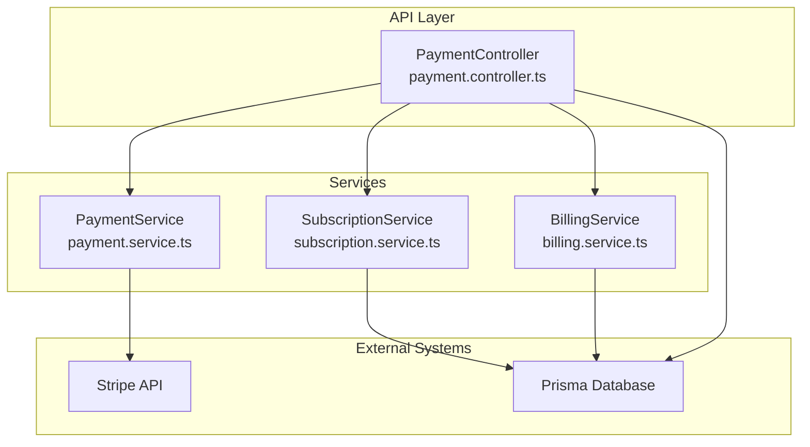
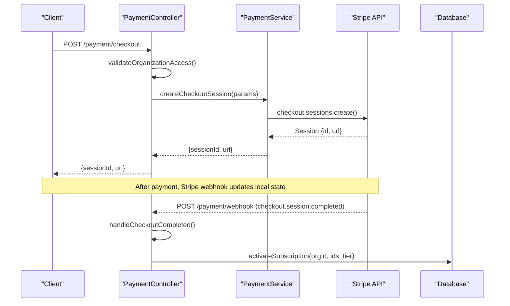
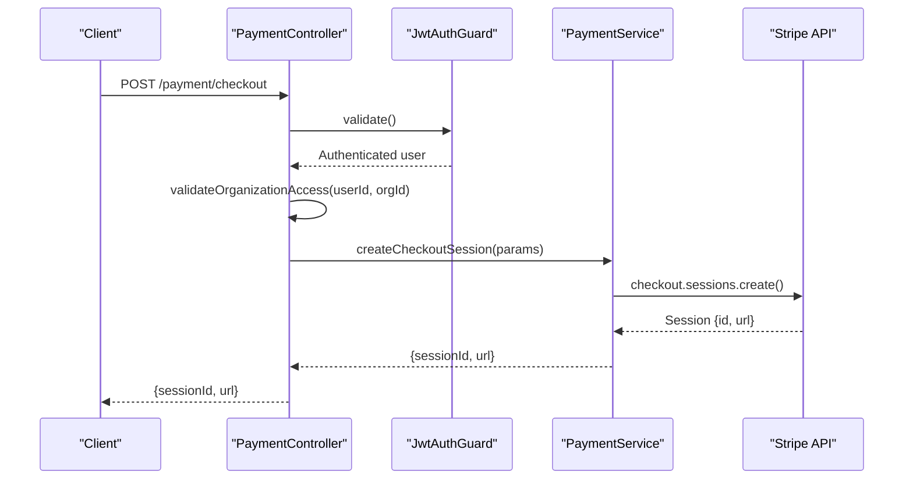
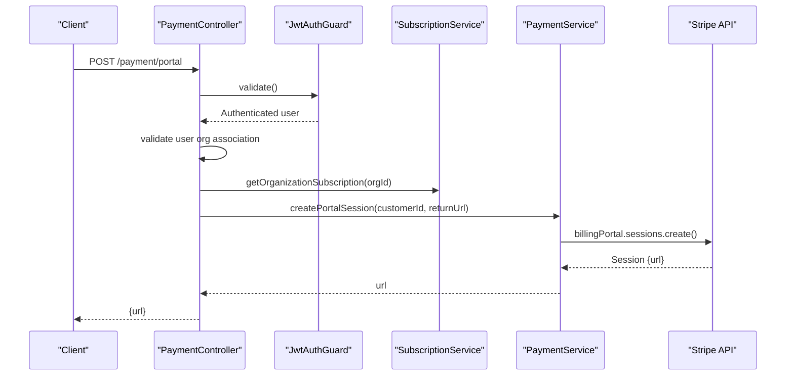
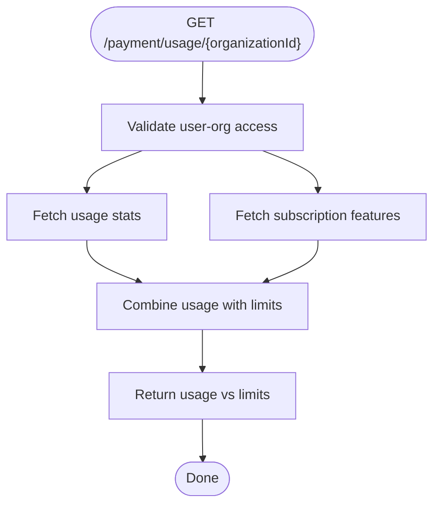
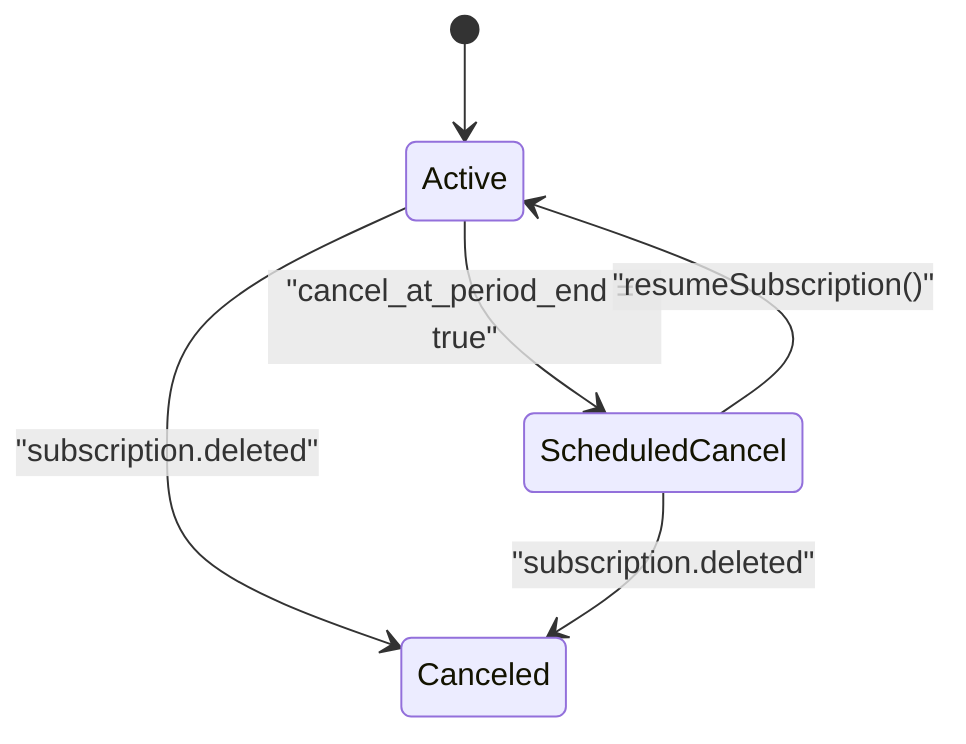
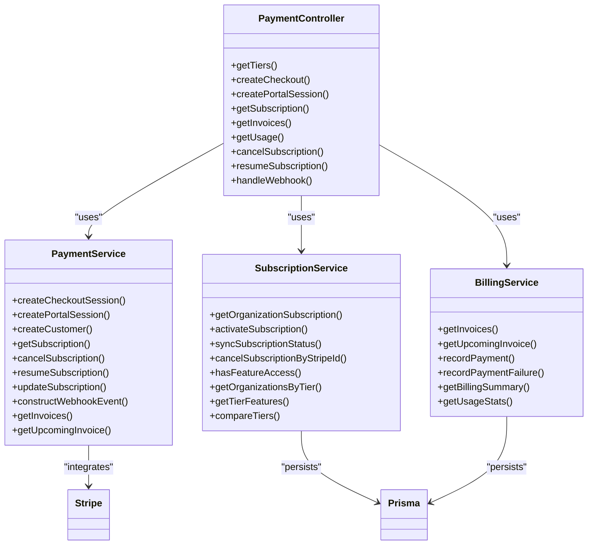

# Subscription Management

<cite>
**Referenced Files in This Document**
- [payment.controller.ts](file://apps/api/src/modules/payment/payment.controller.ts)
- [payment.service.ts](file://apps/api/src/modules/payment/payment.service.ts)
- [subscription.service.ts](file://apps/api/src/modules/payment/subscription.service.ts)
- [billing.service.ts](file://apps/api/src/modules/payment/billing.service.ts)
- [payment.dto.ts](file://apps/api/src/modules/payment/dto/payment.dto.ts)
- [subscription.guard.ts](file://apps/api/src/common/guards/subscription.guard.ts)
- [stripe-webhook.controller.ts](file://apps/api/src/modules/document-commerce/stripe-webhook.controller.ts)
</cite>

## Table of Contents
1. [Introduction](#introduction)
2. [Project Structure](#project-structure)
3. [Core Components](#core-components)
4. [Architecture Overview](#architecture-overview)
5. [Detailed Component Analysis](#detailed-component-analysis)
6. [Dependency Analysis](#dependency-analysis)
7. [Performance Considerations](#performance-considerations)
8. [Troubleshooting Guide](#troubleshooting-guide)
9. [Conclusion](#conclusion)
10. [Appendices](#appendices)

## Introduction
This document provides comprehensive API documentation for Quiz-to-Build's subscription management system. It covers retrieving subscription tiers, initiating Stripe checkout sessions, generating customer portal sessions, querying subscription status, managing cancellations and resumptions, tracking usage limits per organization, and enforcing access controls. It also explains subscription state transitions, billing period management, and webhook-driven synchronization with Stripe.

## Project Structure
The subscription management APIs reside under the payment module and are supported by dedicated services for subscriptions, billing, and Stripe integration. Access control is enforced via a subscription guard and middleware.

**Diagram sources**
- [payment.controller.ts:40-396](file://apps/api/src/modules/payment/payment.controller.ts#L40-L396)
- [payment.service.ts:56-316](file://apps/api/src/modules/payment/payment.service.ts#L56-L316)
- [subscription.service.ts:28-237](file://apps/api/src/modules/payment/subscription.service.ts#L28-L237)
- [billing.service.ts:32-270](file://apps/api/src/modules/payment/billing.service.ts#L32-L270)

**Section sources**
- [payment.controller.ts:40-396](file://apps/api/src/modules/payment/payment.controller.ts#L40-L396)
- [payment.service.ts:56-316](file://apps/api/src/modules/payment/payment.service.ts#L56-L316)
- [subscription.service.ts:28-237](file://apps/api/src/modules/payment/subscription.service.ts#L28-L237)
- [billing.service.ts:32-270](file://apps/api/src/modules/payment/billing.service.ts#L32-L270)

## Core Components
- PaymentController: Exposes REST endpoints for subscription tiers, checkout, portal sessions, subscription status, invoices, usage, cancellation, and resumption. Also handles Stripe webhooks.
- PaymentService: Integrates with Stripe to create checkout sessions, manage subscriptions, and fetch invoices/upcoming invoices.
- SubscriptionService: Manages subscription state, activates subscriptions post-checkout, synchronizes status from Stripe events, and compares tiers.
- BillingService: Retrieves invoices, upcoming invoices, records payments/failures, and computes billing summaries and usage stats.
- SubscriptionGuard: Enforces tier-based and feature-based access control at the route level and attaches subscription metadata to requests.
- DTOs: Define request/response shapes for checkout, portal sessions, subscription status, invoices, and update/cancel operations.

**Section sources**
- [payment.controller.ts:40-396](file://apps/api/src/modules/payment/payment.controller.ts#L40-L396)
- [payment.service.ts:56-316](file://apps/api/src/modules/payment/payment.service.ts#L56-L316)
- [subscription.service.ts:28-237](file://apps/api/src/modules/payment/subscription.service.ts#L28-L237)
- [billing.service.ts:32-270](file://apps/api/src/modules/payment/billing.service.ts#L32-L270)
- [payment.dto.ts:1-113](file://apps/api/src/modules/payment/dto/payment.dto.ts#L1-L113)
- [subscription.guard.ts:57-174](file://apps/api/src/common/guards/subscription.guard.ts#L57-L174)

## Architecture Overview
The system follows a layered architecture:
- Controllers orchestrate requests and enforce authentication/authorization.
- Services encapsulate business logic and external integrations.
- Stripe webhooks keep local state synchronized with real-time subscription changes.
- Guards and middleware provide runtime access enforcement and usage headers.

**Diagram sources**
- [payment.controller.ts:80-97](file://apps/api/src/modules/payment/payment.controller.ts#L80-L97)
- [payment.service.ts:104-152](file://apps/api/src/modules/payment/payment.service.ts#L104-L152)
- [subscription.service.ts:75-92](file://apps/api/src/modules/payment/subscription.service.ts#L75-L92)

**Section sources**
- [payment.controller.ts:80-97](file://apps/api/src/modules/payment/payment.controller.ts#L80-L97)
- [payment.service.ts:104-152](file://apps/api/src/modules/payment/payment.service.ts#L104-L152)
- [subscription.service.ts:75-92](file://apps/api/src/modules/payment/subscription.service.ts#L75-L92)

## Detailed Component Analysis

### API Endpoints

#### GET /payment/tiers
- Purpose: Retrieve available subscription tiers and their features.
- Authentication: None (publicly accessible).
- Response: Object keyed by tier with feature limits and support level.
- Notes: Returns predefined tiers; no Stripe integration required.

**Section sources**
- [payment.controller.ts:73-76](file://apps/api/src/modules/payment/payment.controller.ts#L73-L76)
- [payment.service.ts:10-49](file://apps/api/src/modules/payment/payment.service.ts#L10-L49)

#### POST /payment/checkout
- Purpose: Create a Stripe Checkout session for a subscription.
- Authentication: JWT required.
- Authorization: Validates that the authenticated user belongs to the target organization.
- Request body: Organization ID, tier, success/cancel URLs, optional Stripe customer ID.
- Response: { sessionId, url } pointing to Stripe-hosted checkout.
- Behavior:
  - Uses environment-configured Stripe price IDs per tier.
  - Metadata includes organizationId and tier for post-payment activation.
  - Supports reusing an existing Stripe customer.

**Diagram sources**
- [payment.controller.ts:80-97](file://apps/api/src/modules/payment/payment.controller.ts#L80-L97)
- [payment.service.ts:104-152](file://apps/api/src/modules/payment/payment.service.ts#L104-L152)

**Section sources**
- [payment.controller.ts:80-97](file://apps/api/src/modules/payment/payment.controller.ts#L80-L97)
- [payment.service.ts:104-152](file://apps/api/src/modules/payment/payment.service.ts#L104-L152)

#### POST /payment/portal
- Purpose: Create a Stripe Customer Portal session for billing management.
- Authentication: JWT required.
- Authorization: Validates that the customer ID belongs to the user's organization.
- Request body: Stripe customer ID and return URL.
- Response: { url } to the hosted portal.

**Diagram sources**
- [payment.controller.ts:102-129](file://apps/api/src/modules/payment/payment.controller.ts#L102-L129)
- [subscription.service.ts:37-70](file://apps/api/src/modules/payment/subscription.service.ts#L37-L70)
- [payment.service.ts:156-168](file://apps/api/src/modules/payment/payment.service.ts#L156-L168)

**Section sources**
- [payment.controller.ts:102-129](file://apps/api/src/modules/payment/payment.controller.ts#L102-L129)
- [subscription.service.ts:37-70](file://apps/api/src/modules/payment/subscription.service.ts#L37-L70)
- [payment.service.ts:156-168](file://apps/api/src/modules/payment/payment.service.ts#L156-L168)

#### GET /payment/subscription/{organizationId}
- Purpose: Query the current subscription status for an organization.
- Authentication: JWT required.
- Authorization: Validates that the authenticated user belongs to the target organization.
- Response: SubscriptionResponseDto including tier, status, Stripe identifiers, period end, cancellation flag, and feature limits.

**Section sources**
- [payment.controller.ts:134-143](file://apps/api/src/modules/payment/payment.controller.ts#L134-L143)
- [subscription.service.ts:37-70](file://apps/api/src/modules/payment/subscription.service.ts#L37-L70)
- [payment.dto.ts:58-73](file://apps/api/src/modules/payment/dto/payment.dto.ts#L58-L73)

#### GET /payment/invoices/{customerId}
- Purpose: Retrieve billing history (invoices) for a Stripe customer.
- Authentication: JWT required.
- Authorization: Validates that the customer belongs to the user's organization.
- Query parameters: limit (optional).
- Response: Array of InvoiceResponseDto entries.

**Section sources**
- [payment.controller.ts:148-177](file://apps/api/src/modules/payment/payment.controller.ts#L148-L177)
- [billing.service.ts:44-60](file://apps/api/src/modules/payment/billing.service.ts#L44-L60)
- [payment.dto.ts:78-88](file://apps/api/src/modules/payment/dto/payment.dto.ts#L78-L88)

#### GET /payment/usage/{organizationId}
- Purpose: Track usage versus limits per organization.
- Authentication: JWT required.
- Authorization: Validates that the authenticated user belongs to the target organization.
- Response: Aggregated usage across questionnaires, responses, documents, and API calls compared to subscription limits.

**Diagram sources**
- [payment.controller.ts:182-221](file://apps/api/src/modules/payment/payment.controller.ts#L182-L221)
- [billing.service.ts:239-268](file://apps/api/src/modules/payment/billing.service.ts#L239-L268)
- [subscription.service.ts:37-70](file://apps/api/src/modules/payment/subscription.service.ts#L37-L70)

**Section sources**
- [payment.controller.ts:182-221](file://apps/api/src/modules/payment/payment.controller.ts#L182-L221)
- [billing.service.ts:239-268](file://apps/api/src/modules/payment/billing.service.ts#L239-L268)
- [subscription.service.ts:37-70](file://apps/api/src/modules/payment/subscription.service.ts#L37-L70)

#### POST /payment/cancel/{organizationId}
- Purpose: Schedule subscription cancellation at the end of the current billing period.
- Authentication: JWT required.
- Authorization: Validates that the authenticated user belongs to the target organization.
- Behavior: Calls PaymentService to set cancel_at_period_end; returns confirmation message.

**Section sources**
- [payment.controller.ts:226-244](file://apps/api/src/modules/payment/payment.controller.ts#L226-L244)
- [payment.service.ts:209-224](file://apps/api/src/modules/payment/payment.service.ts#L209-L224)

#### POST /payment/resume/{organizationId}
- Purpose: Resume a subscription previously scheduled to cancel at period end.
- Authentication: JWT required.
- Authorization: Validates that the authenticated user belongs to the target organization.
- Behavior: Clears cancel_at_period_end via PaymentService; returns confirmation message.

**Section sources**
- [payment.controller.ts:249-267](file://apps/api/src/modules/payment/payment.controller.ts#L249-L267)
- [payment.service.ts:229-237](file://apps/api/src/modules/payment/payment.service.ts#L229-L237)

### Subscription State Transitions and Billing Period Management
- Stripe events drive state synchronization:
  - checkout.session.completed: Activates subscription in DB.
  - customer.subscription.created/updated: Updates status, period end, and cancellation flag.
  - customer.subscription.deleted: Cancels subscription in DB.
  - invoice.payment_succeeded/failed: Records payment success/failure.
- Billing period end and cancel_at_period_end are persisted to enable grace handling and future resumption.

**Diagram sources**
- [payment.controller.ts:297-369](file://apps/api/src/modules/payment/payment.controller.ts#L297-L369)
- [subscription.service.ts:97-132](file://apps/api/src/modules/payment/subscription.service.ts#L97-L132)
- [subscription.service.ts:137-165](file://apps/api/src/modules/payment/subscription.service.ts#L137-L165)

**Section sources**
- [payment.controller.ts:297-369](file://apps/api/src/modules/payment/payment.controller.ts#L297-L369)
- [subscription.service.ts:97-132](file://apps/api/src/modules/payment/subscription.service.ts#L97-L132)
- [subscription.service.ts:137-165](file://apps/api/src/modules/payment/subscription.service.ts#L137-L165)

### Access Control and Administrative Management
- SubscriptionGuard enforces:
  - Tier-based access: @RequireTier decorator checks minimum required tier.
  - Feature-based access: @RequireFeature checks usage against limits.
- FeatureUsageMiddleware attaches subscription metadata and usage headers to requests for client awareness.
- Administrative capabilities:
  - SubscriptionService exposes helpers to compare tiers and retrieve organizations by tier for admin dashboards.
  - PaymentController validates organization access for most endpoints.

**Section sources**
- [subscription.guard.ts:57-174](file://apps/api/src/common/guards/subscription.guard.ts#L57-L174)
- [subscription.guard.ts:180-215](file://apps/api/src/common/guards/subscription.guard.ts#L180-L215)
- [subscription.service.ts:194-207](file://apps/api/src/modules/payment/subscription.service.ts#L194-L207)
- [subscription.service.ts:220-235](file://apps/api/src/modules/payment/subscription.service.ts#L220-L235)
- [payment.controller.ts:59-68](file://apps/api/src/modules/payment/payment.controller.ts#L59-L68)

### Stripe Webhook Handling
- Endpoint: POST /payment/webhook
- Responsibilities:
  - Verify webhook signature using configured secret.
  - Handle checkout.session.completed, customer.subscription.* events, invoice.* events.
  - Persist state changes to database and record billing events.

**Section sources**
- [payment.controller.ts:272-324](file://apps/api/src/modules/payment/payment.controller.ts#L272-L324)
- [payment.controller.ts:330-394](file://apps/api/src/modules/payment/payment.controller.ts#L330-L394)

### Implementation Examples

#### Subscription Lifecycle Management
- Upgrade from Free to Professional:
  - Create checkout session for Professional tier.
  - On completion, activate subscription and persist Stripe identifiers.
  - Future invoices reflect the new tier; proration handled by Stripe.

- Downgrade from Enterprise to Professional:
  - Use PaymentService.updateSubscription with proration enabled.
  - Ensure customer portal reflects new billing preview.

- Cancellation and Resumption:
  - Schedule cancellation at period end; resume before renewal to restore access.

- Usage Limit Tracking:
  - Call GET /payment/usage/{organizationId} to compare usage vs limits.
  - Gate feature creation using @RequireFeature to prevent overages.

**Section sources**
- [payment.controller.ts:73-76](file://apps/api/src/modules/payment/payment.controller.ts#L73-L76)
- [payment.controller.ts:80-97](file://apps/api/src/modules/payment/payment.controller.ts#L80-L97)
- [payment.controller.ts:182-221](file://apps/api/src/modules/payment/payment.controller.ts#L182-L221)
- [payment.service.ts:242-269](file://apps/api/src/modules/payment/payment.service.ts#L242-L269)
- [subscription.guard.ts:149-173](file://apps/api/src/common/guards/subscription.guard.ts#L149-L173)

#### Proration Calculations
- When updating a subscription tier, PaymentService sets proration_behavior to create prorations, ensuring accurate billing adjustments.

**Section sources**
- [payment.service.ts:267-268](file://apps/api/src/modules/payment/payment.service.ts#L267-L268)

#### Administrative Subscription Management
- Retrieve organizations by tier for reporting and support.
- Compare tiers to determine upgrade/downgrade scenarios.

**Section sources**
- [subscription.service.ts:194-207](file://apps/api/src/modules/payment/subscription.service.ts#L194-L207)
- [subscription.service.ts:220-235](file://apps/api/src/modules/payment/subscription.service.ts#L220-L235)

## Dependency Analysis

**Diagram sources**
- [payment.controller.ts:40-396](file://apps/api/src/modules/payment/payment.controller.ts#L40-L396)
- [payment.service.ts:56-316](file://apps/api/src/modules/payment/payment.service.ts#L56-L316)
- [subscription.service.ts:28-237](file://apps/api/src/modules/payment/subscription.service.ts#L28-L237)
- [billing.service.ts:32-270](file://apps/api/src/modules/payment/billing.service.ts#L32-L270)

**Section sources**
- [payment.controller.ts:40-396](file://apps/api/src/modules/payment/payment.controller.ts#L40-L396)
- [payment.service.ts:56-316](file://apps/api/src/modules/payment/payment.service.ts#L56-L316)
- [subscription.service.ts:28-237](file://apps/api/src/modules/payment/subscription.service.ts#L28-L237)
- [billing.service.ts:32-270](file://apps/api/src/modules/payment/billing.service.ts#L32-L270)

## Performance Considerations
- Webhook processing: Ensure idempotent handling of events to avoid duplicate state changes.
- Batch lookups: SubscriptionService uses findMany with reasonable limits when syncing by Stripe identifiers.
- Usage queries: BillingService.getUsageStats currently lacks organization-scoped counts for some resources; consider adding indexed queries for performance.

## Troubleshooting Guide
- Missing Stripe configuration:
  - PaymentService logs a warning when STRIPE_SECRET_KEY is not configured; several operations will throw Bad Request exceptions.
- Invalid webhook signature:
  - PaymentController rejects requests without raw body or invalid signatures.
- Access denied:
  - PaymentController throws ForbiddenException when user does not belong to the target organization.
  - SubscriptionGuard throws ForbiddenException for insufficient tier or exceeded feature limits.
- Missing active subscription:
  - Cancel/Resume endpoints require an existing Stripe subscription ID; otherwise BadRequest is thrown.

**Section sources**
- [payment.service.ts:61-72](file://apps/api/src/modules/payment/payment.service.ts#L61-L72)
- [payment.controller.ts:278-294](file://apps/api/src/modules/payment/payment.controller.ts#L278-L294)
- [payment.controller.ts:59-68](file://apps/api/src/modules/payment/payment.controller.ts#L59-L68)
- [subscription.guard.ts:136-143](file://apps/api/src/common/guards/subscription.guard.ts#L136-L143)
- [subscription.guard.ts:162-172](file://apps/api/src/common/guards/subscription.guard.ts#L162-L172)
- [payment.controller.ts:237-241](file://apps/api/src/modules/payment/payment.controller.ts#L237-L241)
- [payment.controller.ts:260-262](file://apps/api/src/modules/payment/payment.controller.ts#L260-L262)

## Conclusion
The subscription management system integrates Stripe seamlessly with internal services to provide a robust billing experience. It supports tier retrieval, checkout, portal sessions, status querying, usage tracking, cancellation/resumption, and webhook-driven synchronization. Access control is enforced at both route and middleware levels, and administrative helpers facilitate reporting and tier comparisons.

## Appendices

### API Definitions

- GET /payment/tiers
  - Description: Retrieve available subscription tiers.
  - Response: Object keyed by tier with features.

- POST /payment/checkout
  - Description: Create a Stripe Checkout session.
  - Body: organizationId, tier, successUrl, cancelUrl, customerId (optional).
  - Response: { sessionId, url }.

- POST /payment/portal
  - Description: Create a Stripe Customer Portal session.
  - Body: customerId, returnUrl.
  - Response: { url }.

- GET /payment/subscription/{organizationId}
  - Description: Get subscription status for an organization.
  - Response: SubscriptionResponseDto.

- GET /payment/invoices/{customerId}?limit=N
  - Description: List invoices for a customer.
  - Response: Array of InvoiceResponseDto.

- GET /payment/usage/{organizationId}
  - Description: Get usage vs limits per organization.
  - Response: { questionnaires, responses, documents, apiCalls } with used and limit.

- POST /payment/cancel/{organizationId}
  - Description: Schedule cancellation at period end.
  - Response: { message }.

- POST /payment/resume/{organizationId}
  - Description: Resume a scheduled cancellation.
  - Response: { message }.

- POST /payment/webhook
  - Description: Handle Stripe webhook events.
  - Body: Stripe signature header required.
  - Response: { received: true }.

**Section sources**
- [payment.controller.ts:73-76](file://apps/api/src/modules/payment/payment.controller.ts#L73-L76)
- [payment.controller.ts:80-97](file://apps/api/src/modules/payment/payment.controller.ts#L80-L97)
- [payment.controller.ts:102-129](file://apps/api/src/modules/payment/payment.controller.ts#L102-L129)
- [payment.controller.ts:134-143](file://apps/api/src/modules/payment/payment.controller.ts#L134-L143)
- [payment.controller.ts:148-177](file://apps/api/src/modules/payment/payment.controller.ts#L148-L177)
- [payment.controller.ts:182-221](file://apps/api/src/modules/payment/payment.controller.ts#L182-L221)
- [payment.controller.ts:226-244](file://apps/api/src/modules/payment/payment.controller.ts#L226-L244)
- [payment.controller.ts:249-267](file://apps/api/src/modules/payment/payment.controller.ts#L249-L267)
- [payment.controller.ts:272-324](file://apps/api/src/modules/payment/payment.controller.ts#L272-L324)

### DTO Reference

- CreateCheckoutDto
  - Fields: organizationId, tier, successUrl, cancelUrl, customerId (optional).

- CreatePortalSessionDto
  - Fields: customerId, returnUrl.

- SubscriptionResponseDto
  - Fields: organizationId, tier, status, stripeCustomerId, stripeSubscriptionId, currentPeriodEnd, cancelAtPeriodEnd, features.

- InvoiceResponseDto
  - Fields: id, stripeInvoiceId, amount, currency, status, paidAt, createdAt, invoiceUrl, invoicePdfUrl.

**Section sources**
- [payment.dto.ts:21-40](file://apps/api/src/modules/payment/dto/payment.dto.ts#L21-L40)
- [payment.dto.ts:45-53](file://apps/api/src/modules/payment/dto/payment.dto.ts#L45-L53)
- [payment.dto.ts:58-73](file://apps/api/src/modules/payment/dto/payment.dto.ts#L58-L73)
- [payment.dto.ts:78-88](file://apps/api/src/modules/payment/dto/payment.dto.ts#L78-L88)

### Access Control Reference
- SubscriptionGuard
  - @RequireTier(tiers...): Enforce minimum tier requirement.
  - @RequireFeature(config): Enforce feature usage limits.
- FeatureUsageMiddleware
  - Attaches subscription info and usage headers to requests.

**Section sources**
- [subscription.guard.ts:40-43](file://apps/api/src/common/guards/subscription.guard.ts#L40-L43)
- [subscription.guard.ts:128-144](file://apps/api/src/common/guards/subscription.guard.ts#L128-L144)
- [subscription.guard.ts:149-173](file://apps/api/src/common/guards/subscription.guard.ts#L149-L173)
- [subscription.guard.ts:180-215](file://apps/api/src/common/guards/subscription.guard.ts#L180-L215)