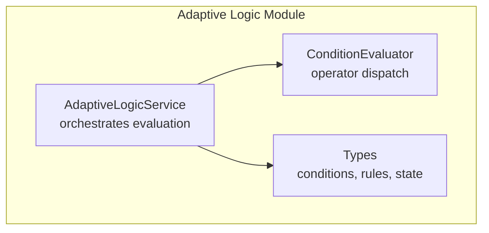
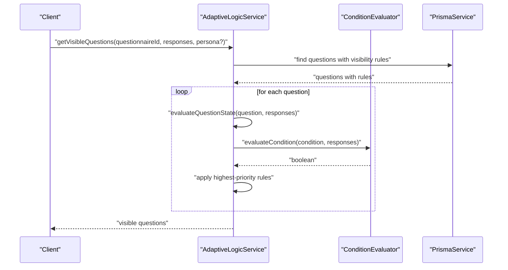
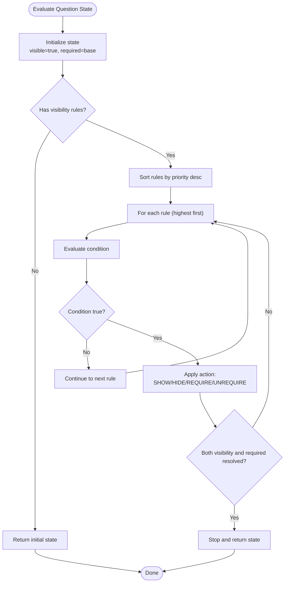
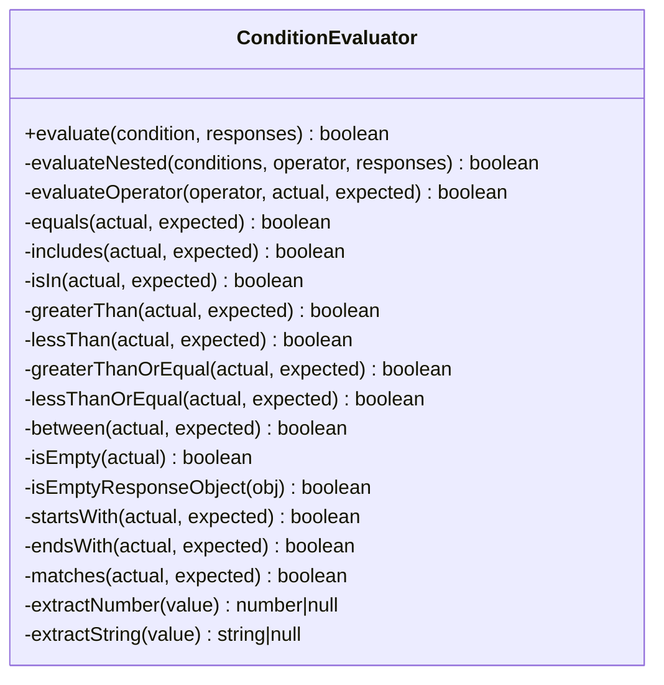
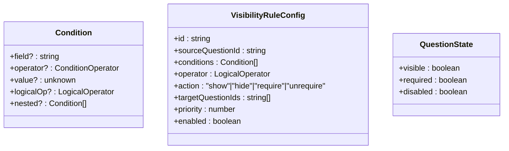
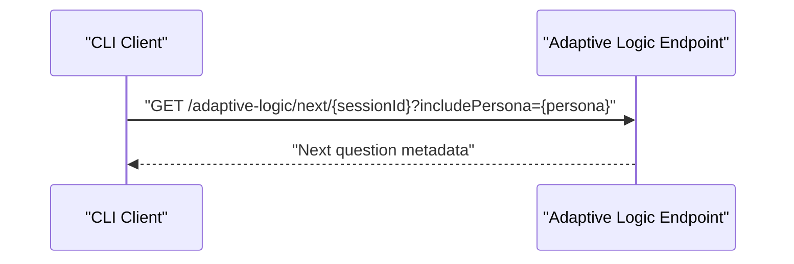
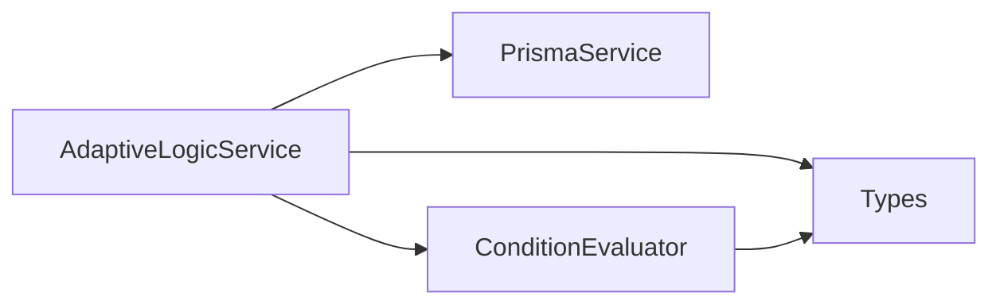

# Adaptive Logic & Visibility Rules

<cite>
**Referenced Files in This Document**
- [adaptive-logic.module.ts](file://apps/api/src/modules/adaptive-logic/adaptive-logic.module.ts)
- [adaptive-logic.service.ts](file://apps/api/src/modules/adaptive-logic/adaptive-logic.service.ts)
- [condition.evaluator.ts](file://apps/api/src/modules/adaptive-logic/evaluators/condition.evaluator.ts)
- [rule.types.ts](file://apps/api/src/modules/adaptive-logic/types/rule.types.ts)
- [adaptive-logic.service.spec.ts](file://apps/api/src/modules/adaptive-logic/adaptive-logic.service.spec.ts)
- [api-client.ts](file://apps/cli/src/lib/api-client.ts)
- [adaptive-logic.md](file://docs/questionnaire/adaptive-logic.md)
</cite>

## Table of Contents
1. [Introduction](#introduction)
2. [Project Structure](#project-structure)
3. [Core Components](#core-components)
4. [Architecture Overview](#architecture-overview)
5. [Detailed Component Analysis](#detailed-component-analysis)
6. [Dependency Analysis](#dependency-analysis)
7. [Performance Considerations](#performance-considerations)
8. [Troubleshooting Guide](#troubleshooting-guide)
9. [Conclusion](#conclusion)
10. [Appendices](#appendices)

## Introduction
This document describes the adaptive questionnaire logic and visibility rule evaluation system. It explains how questions become visible, required, or skipped based on prior responses, and how dynamic branching is evaluated. It covers condition evaluation algorithms, rule parsing, persona-based filtering, and the rule evaluation API surface for testing and debugging. Guidance is also provided for performance optimization, caching strategies, and troubleshooting common issues.

## Project Structure
The adaptive logic engine resides in the API application under the adaptive-logic module. It is composed of:
- A service that orchestrates visibility and requirement evaluation, builds dependency graphs, and computes adaptive changes
- A dedicated condition evaluator that implements operator dispatch and robust value extraction
- Type definitions for conditions, rules, and evaluation outcomes

**Diagram sources**
- [adaptive-logic.module.ts:1-12](file://apps/api/src/modules/adaptive-logic/adaptive-logic.module.ts#L1-L12)
- [adaptive-logic.service.ts:19-285](file://apps/api/src/modules/adaptive-logic/adaptive-logic.service.ts#L19-L285)
- [condition.evaluator.ts:1-382](file://apps/api/src/modules/adaptive-logic/evaluators/condition.evaluator.ts#L1-L382)
- [rule.types.ts:1-120](file://apps/api/src/modules/adaptive-logic/types/rule.types.ts#L1-L120)

**Section sources**
- [adaptive-logic.module.ts:1-12](file://apps/api/src/modules/adaptive-logic/adaptive-logic.module.ts#L1-L12)
- [adaptive-logic.service.ts:19-285](file://apps/api/src/modules/adaptive-logic/adaptive-logic.service.ts#L19-L285)
- [condition.evaluator.ts:1-382](file://apps/api/src/modules/adaptive-logic/evaluators/condition.evaluator.ts#L1-L382)
- [rule.types.ts:1-120](file://apps/api/src/modules/adaptive-logic/types/rule.types.ts#L1-L120)

## Core Components
- AdaptiveLogicService: Central coordinator for visibility, requirement, and branching evaluation; exposes methods to compute visible questions, next question, and adaptive changes; builds dependency graphs and retrieves rules.
- ConditionEvaluator: Implements operator dispatch and handles diverse response value shapes (strings, numbers, option IDs, arrays, rating objects).
- Types: Defines operators, logical operators, condition structures, visibility rule configuration, branching rule structure, and evaluation state.

Key capabilities:
- Visibility determination per question based on ordered rules
- Requirement toggling per question based on ordered rules
- Priority-driven rule application with early exit when both visibility and requirement are resolved
- AND/OR combination of conditions, including nested conditions
- Persona-aware question retrieval
- Next-question calculation based on current position in visible sequence
- Dependency graph construction for rule interdependencies

**Section sources**
- [adaptive-logic.service.ts:29-132](file://apps/api/src/modules/adaptive-logic/adaptive-logic.service.ts#L29-L132)
- [adaptive-logic.service.ts:137-176](file://apps/api/src/modules/adaptive-logic/adaptive-logic.service.ts#L137-L176)
- [adaptive-logic.service.ts:181-204](file://apps/api/src/modules/adaptive-logic/adaptive-logic.service.ts#L181-L204)
- [adaptive-logic.service.ts:209-224](file://apps/api/src/modules/adaptive-logic/adaptive-logic.service.ts#L209-L224)
- [adaptive-logic.service.ts:229-238](file://apps/api/src/modules/adaptive-logic/adaptive-logic.service.ts#L229-L238)
- [adaptive-logic.service.ts:243-283](file://apps/api/src/modules/adaptive-logic/adaptive-logic.service.ts#L243-L283)
- [condition.evaluator.ts:9-82](file://apps/api/src/modules/adaptive-logic/evaluators/condition.evaluator.ts#L9-L82)
- [rule.types.ts:4-33](file://apps/api/src/modules/adaptive-logic/types/rule.types.ts#L4-L33)
- [rule.types.ts:38-53](file://apps/api/src/modules/adaptive-logic/types/rule.types.ts#L38-L53)
- [rule.types.ts:58-82](file://apps/api/src/modules/adaptive-logic/types/rule.types.ts#L58-L82)

## Architecture Overview
The adaptive logic engine integrates with the questionnaire domain via the service layer and is consumed by clients (web and CLI). The evaluation pipeline is:
- Collect current responses as a Map keyed by question ID
- Retrieve questions with active visibility rules and optional persona filter
- For each question, evaluate rules in descending priority order until both visibility and requirement are determined
- Combine conditions using AND/OR, including nested groups
- Derive next question from the visible sequence or branching rules

**Diagram sources**
- [adaptive-logic.service.ts:29-64](file://apps/api/src/modules/adaptive-logic/adaptive-logic.service.ts#L29-L64)
- [adaptive-logic.service.ts:69-132](file://apps/api/src/modules/adaptive-logic/adaptive-logic.service.ts#L69-L132)
- [condition.evaluator.ts:9-22](file://apps/api/src/modules/adaptive-logic/evaluators/condition.evaluator.ts#L9-L22)

## Detailed Component Analysis

### AdaptiveLogicService
Responsibilities:
- Retrieve questions with visibility rules and optional persona filter
- Compute visibility and requirement state per question using ordered rules
- Determine next question in sequence or via branching rules
- Evaluate multiple conditions with AND/OR and nested groups
- Compute adaptive changes between two response sets
- Build dependency graph from rule conditions and targets
- Expose rule lookup for a given question

Evaluation flow for a single question:
- Initialize state with defaults (visible, base required flag)
- Sort active rules by priority (highest first)
- Iterate rules; when a condition evaluates to true, apply the action (SHOW/HIDE/REQUIRE/UNREQUIRE)
- Stop early when both visibility and requirement are finalized
- Return resulting state

**Diagram sources**
- [adaptive-logic.service.ts:69-132](file://apps/api/src/modules/adaptive-logic/adaptive-logic.service.ts#L69-L132)

**Section sources**
- [adaptive-logic.service.ts:29-64](file://apps/api/src/modules/adaptive-logic/adaptive-logic.service.ts#L29-L64)
- [adaptive-logic.service.ts:69-132](file://apps/api/src/modules/adaptive-logic/adaptive-logic.service.ts#L69-L132)
- [adaptive-logic.service.ts:137-176](file://apps/api/src/modules/adaptive-logic/adaptive-logic.service.ts#L137-L176)
- [adaptive-logic.service.ts:181-204](file://apps/api/src/modules/adaptive-logic/adaptive-logic.service.ts#L181-L204)
- [adaptive-logic.service.ts:209-224](file://apps/api/src/modules/adaptive-logic/adaptive-logic.service.ts#L209-L224)
- [adaptive-logic.service.ts:229-238](file://apps/api/src/modules/adaptive-logic/adaptive-logic.service.ts#L229-L238)
- [adaptive-logic.service.ts:243-283](file://apps/api/src/modules/adaptive-logic/adaptive-logic.service.ts#L243-L283)

### ConditionEvaluator
Responsibilities:
- Evaluate single or nested conditions
- Dispatch operators via a handler map
- Robust extraction of numbers and strings from varied response shapes
- Support for equality checks, inclusion checks, numeric comparisons, range checks, emptiness, prefix/suffix, and regex matching

Operator handling highlights:
- Equality: supports primitive equality, response object shape detection (selectedOptionId/text/number/rating), and deep JSON comparison
- Includes/Contains: supports arrays, multi-select option IDs, and substring matching for text
- In/NotIn: checks membership in expected arrays, with response object support
- Numeric comparisons: extracts numbers from primitives and response objects
- Between: validates closed numeric ranges
- Emptiness: recognizes null/undefined, empty strings, empty arrays, and empty response object states
- String operations: startsWith, endsWith, matches (regex)

**Diagram sources**
- [condition.evaluator.ts:1-382](file://apps/api/src/modules/adaptive-logic/evaluators/condition.evaluator.ts#L1-L382)

**Section sources**
- [condition.evaluator.ts:9-82](file://apps/api/src/modules/adaptive-logic/evaluators/condition.evaluator.ts#L9-L82)
- [condition.evaluator.ts:87-112](file://apps/api/src/modules/adaptive-logic/evaluators/condition.evaluator.ts#L87-L112)
- [condition.evaluator.ts:117-144](file://apps/api/src/modules/adaptive-logic/evaluators/condition.evaluator.ts#L117-L144)
- [condition.evaluator.ts:149-170](file://apps/api/src/modules/adaptive-logic/evaluators/condition.evaluator.ts#L149-L170)
- [condition.evaluator.ts:175-244](file://apps/api/src/modules/adaptive-logic/evaluators/condition.evaluator.ts#L175-L244)
- [condition.evaluator.ts:249-285](file://apps/api/src/modules/adaptive-logic/evaluators/condition.evaluator.ts#L249-L285)
- [condition.evaluator.ts:289-331](file://apps/api/src/modules/adaptive-logic/evaluators/condition.evaluator.ts#L289-L331)
- [condition.evaluator.ts:336-380](file://apps/api/src/modules/adaptive-logic/evaluators/condition.evaluator.ts#L336-L380)

### Types and Rule Configuration
- Operators: equals, not_equals, includes, contains, not_includes, not_contains, in, not_in, greater_than, less_than, greater_than_or_equal, less_than_or_equal, between, is_empty, is_not_empty, starts_with, ends_with, matches
- Logical operators: AND, OR
- Condition: single condition with field/operator/value, or nested conditions with logicalOp
- VisibilityRuleConfig: encapsulates rule definition, including targetQuestionIds, priority, and enablement
- QuestionState: outcome of evaluation (visible, required, disabled)

**Diagram sources**
- [rule.types.ts:38-53](file://apps/api/src/modules/adaptive-logic/types/rule.types.ts#L38-L53)
- [rule.types.ts:58-82](file://apps/api/src/modules/adaptive-logic/types/rule.types.ts#L58-L82)
- [rule.types.ts:105-109](file://apps/api/src/modules/adaptive-logic/types/rule.types.ts#L105-L109)

**Section sources**
- [rule.types.ts:4-33](file://apps/api/src/modules/adaptive-logic/types/rule.types.ts#L4-L33)
- [rule.types.ts:38-53](file://apps/api/src/modules/adaptive-logic/types/rule.types.ts#L38-L53)
- [rule.types.ts:58-82](file://apps/api/src/modules/adaptive-logic/types/rule.types.ts#L58-L82)
- [rule.types.ts:105-109](file://apps/api/src/modules/adaptive-logic/types/rule.types.ts#L105-L109)

### Visibility Rule Evaluation API
The CLI client exposes a convenience method to fetch the next question for a session, enabling testing and debugging of adaptive logic in real-time.

**Diagram sources**
- [api-client.ts:54-58](file://apps/cli/src/lib/api-client.ts#L54-L58)

**Section sources**
- [api-client.ts:54-58](file://apps/cli/src/lib/api-client.ts#L54-L58)

## Dependency Analysis
- AdaptiveLogicService depends on PrismaService for persistence and ConditionEvaluator for computation.
- ConditionEvaluator is a pure computation utility with no external dependencies.
- Module wiring uses NestJS injection and forwards the SessionModule dependency.

**Diagram sources**
- [adaptive-logic.module.ts:1-12](file://apps/api/src/modules/adaptive-logic/adaptive-logic.module.ts#L1-L12)
- [adaptive-logic.service.ts:21-24](file://apps/api/src/modules/adaptive-logic/adaptive-logic.service.ts#L21-L24)

**Section sources**
- [adaptive-logic.module.ts:1-12](file://apps/api/src/modules/adaptive-logic/adaptive-logic.module.ts#L1-L12)
- [adaptive-logic.service.ts:21-24](file://apps/api/src/modules/adaptive-logic/adaptive-logic.service.ts#L21-L24)

## Performance Considerations
- Rule ordering and short-circuiting: Rules are sorted by priority and evaluation stops once both visibility and requirement are resolved, reducing unnecessary evaluations.
- Condition evaluation: Operator dispatch minimizes branching and leverages fast-path checks for common cases (equality, includes).
- Numeric and string extraction: Dedicated helpers avoid repeated parsing and type coercion overhead.
- Batch retrieval: Questions and rules are fetched in batches with ordering and limits to constrain memory footprint.
- Dependency graph building: Iterates over active rules to construct adjacency sets for downstream traversal.

Recommendations:
- Cache visible questions per session and response snapshot to avoid recomputation when responses are unchanged.
- Cache rule evaluation results per question per response set for frequently re-evaluated flows.
- Index rules by targetQuestionIds and sourceQuestionIds to accelerate lookups.
- Limit rule counts per question and questionnaire to keep evaluation linear in practice.
- Use persona filters to reduce candidate question sets when persona-specific branching is present.

[No sources needed since this section provides general guidance]

## Troubleshooting Guide
Common issues and resolutions:
- Unexpected visibility: Verify rule priorities and ordering; higher priority rules override lower ones. Confirm persona filter alignment with expected persona.
- Requirement not applied: Ensure the question is visible before requirement rules are considered; requirement rules only apply when visibility remains true.
- Nested conditions not working: Confirm nested logicalOp is set and conditions are properly structured; AND/OR applies across nested groups.
- Operator mismatches: For multi-select and rating responses, ensure operators align with response shapes (e.g., includes for selectedOptionIds).
- Empty responses: Use is_empty/is_not_empty operators to detect unanswered states consistently across response formats.
- Performance regressions: Monitor rule counts and consider caching strategies for repeated evaluations.

Validation and testing:
- Unit tests exercise operator coverage, rule combination, nested conditions, and priority resolution.
- Edge cases include null priorities, mixed data types, and deep nesting.

**Section sources**
- [adaptive-logic.service.spec.ts:139-165](file://apps/api/src/modules/adaptive-logic/adaptive-logic.service.spec.ts#L139-L165)
- [adaptive-logic.service.spec.ts:498-524](file://apps/api/src/modules/adaptive-logic/adaptive-logic.service.spec.ts#L498-L524)
- [adaptive-logic.service.spec.ts:526-541](file://apps/api/src/modules/adaptive-logic/adaptive-logic.service.spec.ts#L526-L541)

## Conclusion
The adaptive logic engine provides a flexible, operator-rich system for visibility and requirement evaluation, with robust support for nested conditions, persona-based filtering, and efficient rule prioritization. Its modular design enables straightforward testing, debugging, and performance tuning, while the CLI endpoint facilitates interactive validation of dynamic branching and contextual adaptation.

[No sources needed since this section summarizes without analyzing specific files]

## Appendices

### API Endpoints for Adaptive Logic Testing
- GET /adaptive-logic/next/{sessionId}
  - Purpose: Retrieve the next recommended question for a session, considering visibility rules and persona.
  - Query parameters:
    - includePersona: Optional persona identifier to filter questions.
  - Response: Next question metadata suitable for rendering in the client.

**Section sources**
- [api-client.ts:54-58](file://apps/cli/src/lib/api-client.ts#L54-L58)

### Rule Configuration Reference
- Operators:
  - equals, not_equals, includes, contains, not_includes, not_contains, in, not_in
  - greater_than, less_than, greater_than_or_equal, less_than_or_equal
  - between (expects a two-element numeric array)
  - is_empty, is_not_empty
  - starts_with, ends_with
  - matches (expects a regex pattern string)
- Logical operators: AND, OR
- Conditions:
  - Single condition: field (questionId), operator, value
  - Nested conditions: logicalOp (AND/OR), nested array of conditions
- VisibilityRuleConfig:
  - id, sourceQuestionId, conditions, operator, action (show/hide/require/unrequire), targetQuestionIds, priority, enabled

**Section sources**
- [rule.types.ts:4-33](file://apps/api/src/modules/adaptive-logic/types/rule.types.ts#L4-L33)
- [rule.types.ts:38-53](file://apps/api/src/modules/adaptive-logic/types/rule.types.ts#L38-L53)
- [rule.types.ts:58-82](file://apps/api/src/modules/adaptive-logic/types/rule.types.ts#L58-L82)

### Example Scenarios and Patterns
- Complex branching: Multiple branches with AND conditions on a single source question; default path taken when none match.
- Nested conditions: Grouped OR within a larger AND; evaluate nested conditions first, then combine with parent operator.
- Multi-step logic chains: A series of rules across multiple questions influence visibility and requirement in sequence.

**Section sources**
- [adaptive-logic.md:871-928](file://docs/questionnaire/adaptive-logic.md#L871-L928)