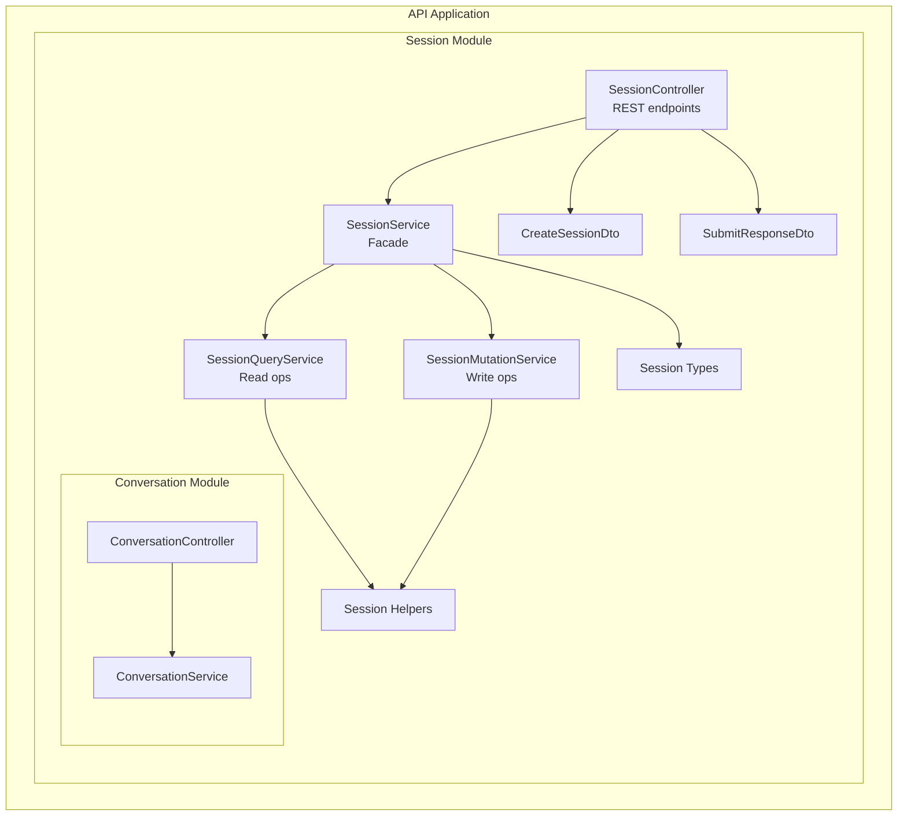
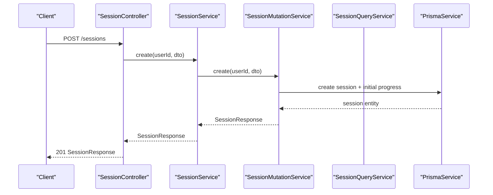
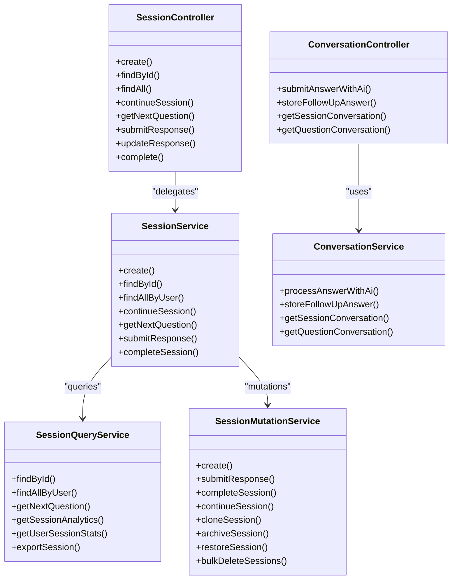

# Assessment Sessions

<cite>
**Referenced Files in This Document**
- [session.controller.ts](file://apps/api/src/modules/session/session.controller.ts)
- [session.service.ts](file://apps/api/src/modules/session/session.service.ts)
- [session-mutation.service.ts](file://apps/api/src/modules/session/services/session-mutation.service.ts)
- [session-query.service.ts](file://apps/api/src/modules/session/services/session-query.service.ts)
- [conversation.controller.ts](file://apps/api/src/modules/session/controllers/conversation.controller.ts)
- [conversation.service.ts](file://apps/api/src/modules/session/services/conversation.service.ts)
- [create-session.dto.ts](file://apps/api/src/modules/session/dto/create-session.dto.ts)
- [submit-response.dto.ts](file://apps/api/src/modules/session/dto/submit-response.dto.ts)
- [session-types.ts](file://apps/api/src/modules/session/session-types.ts)
- [session-helpers.ts](file://apps/api/src/modules/session/session-helpers.ts)
- [transaction-concurrency.test.ts](file://apps/api/test/integration/transaction-concurrency.test.ts)
- [session-reminder.job.ts](file://apps/api/src/modules/notifications/jobs/session-reminder.job.ts)
- [useDraftAutosave.ts](file://apps/web/src/hooks/useDraftAutosave.ts)
</cite>

## Table of Contents
1. [Introduction](#introduction)
2. [Project Structure](#project-structure)
3. [Core Components](#core-components)
4. [Architecture Overview](#architecture-overview)
5. [Detailed Component Analysis](#detailed-component-analysis)
6. [Dependency Analysis](#dependency-analysis)
7. [Performance Considerations](#performance-considerations)
8. [Troubleshooting Guide](#troubleshooting-guide)
9. [Conclusion](#conclusion)

## Introduction
This document provides comprehensive API documentation for assessment session management. It covers endpoints for starting sessions, retrieving session state, submitting responses, continuing interrupted sessions, and real-time conversation support during assessments. It also explains session persistence, auto-save functionality, concurrency handling, validation, completion criteria, progress tracking, and recovery mechanisms.

## Project Structure
The assessment session feature is implemented under the API application in the session module. The structure follows a layered design:
- Controller layer exposes REST endpoints
- Service layer orchestrates read/write operations
- Query and mutation services separate read-only and write operations
- DTOs define request/response schemas
- Helpers encapsulate shared logic
- Conversation endpoints integrate AI-assisted evaluation

**Diagram sources**
- [session.controller.ts:32-166](file://apps/api/src/modules/session/session.controller.ts#L32-L166)
- [session.service.ts:30-116](file://apps/api/src/modules/session/session.service.ts#L30-L116)
- [session-mutation.service.ts:31-553](file://apps/api/src/modules/session/services/session-mutation.service.ts#L31-L553)
- [session-query.service.ts:25-327](file://apps/api/src/modules/session/services/session-query.service.ts#L25-L327)
- [conversation.controller.ts:22-81](file://apps/api/src/modules/session/controllers/conversation.controller.ts#L22-L81)
- [conversation.service.ts:30-148](file://apps/api/src/modules/session/services/conversation.service.ts#L30-L148)
- [create-session.dto.ts:5-40](file://apps/api/src/modules/session/dto/create-session.dto.ts#L5-L40)
- [submit-response.dto.ts:4-22](file://apps/api/src/modules/session/dto/submit-response.dto.ts#L4-L22)
- [session-types.ts:10-141](file://apps/api/src/modules/session/session-types.ts#L10-L141)
- [session-helpers.ts:11-224](file://apps/api/src/modules/session/session-helpers.ts#L11-L224)

**Section sources**
- [session.controller.ts:32-166](file://apps/api/src/modules/session/session.controller.ts#L32-L166)
- [session.service.ts:30-116](file://apps/api/src/modules/session/session.service.ts#L30-L116)

## Core Components
- SessionController: Exposes REST endpoints for session lifecycle and response submission.
- SessionService: Facade delegating to query and mutation services.
- SessionQueryService: Read-only operations (find, list, next questions, analytics).
- SessionMutationService: Write operations (create, submit response, complete, continue).
- ConversationController and ConversationService: Real-time chat and AI evaluation during sessions.
- DTOs: Strongly typed request/response schemas for session creation and response submission.
- Types: Shared response and progress models.
- Helpers: Validation, progress calculation, mapping, and session access checks.

**Section sources**
- [session.controller.ts:36-166](file://apps/api/src/modules/session/session.controller.ts#L36-L166)
- [session.service.ts:30-116](file://apps/api/src/modules/session/session.service.ts#L30-L116)
- [session-mutation.service.ts:31-553](file://apps/api/src/modules/session/services/session-mutation.service.ts#L31-L553)
- [session-query.service.ts:25-327](file://apps/api/src/modules/session/services/session-query.service.ts#L25-L327)
- [conversation.controller.ts:22-81](file://apps/api/src/modules/session/controllers/conversation.controller.ts#L22-L81)
- [conversation.service.ts:30-148](file://apps/api/src/modules/session/services/conversation.service.ts#L30-L148)
- [create-session.dto.ts:5-40](file://apps/api/src/modules/session/dto/create-session.dto.ts#L5-L40)
- [submit-response.dto.ts:4-22](file://apps/api/src/modules/session/dto/submit-response.dto.ts#L4-L22)
- [session-types.ts:10-141](file://apps/api/src/modules/session/session-types.ts#L10-L141)
- [session-helpers.ts:11-224](file://apps/api/src/modules/session/session-helpers.ts#L11-L224)

## Architecture Overview
The session management architecture separates concerns into query and mutation services behind a facade controller. Persistence is handled via Prisma with JSON fields for flexible data structures. Real-time conversation integrates with an AI service to evaluate answers and suggest follow-ups.

**Diagram sources**
- [session.controller.ts:39-47](file://apps/api/src/modules/session/session.controller.ts#L39-L47)
- [session.service.ts:80-82](file://apps/api/src/modules/session/session.service.ts#L80-L82)
- [session-mutation.service.ts:46-86](file://apps/api/src/modules/session/services/session-mutation.service.ts#L46-L86)
- [session-helpers.ts:50-77](file://apps/api/src/modules/session/session-helpers.ts#L50-L77)

## Detailed Component Analysis

### Session Lifecycle Endpoints

#### POST /sessions
Purpose: Start a new assessment session with questionnaire selection and user context.

- Authentication: Required (JWT Bearer)
- Request body: CreateSessionDto
  - questionnaireId: UUID of the questionnaire to start
  - projectTypeId: Optional UUID linking to project type
  - ideaCaptureId: Optional UUID linking to idea capture
  - persona: Optional enum (CTO, CFO, CEO, BA, POLICY)
  - industry: Optional string up to 100 chars
- Response: SessionResponse
  - Includes session metadata, progress, current section, and readiness score placeholder
- Behavior:
  - Validates questionnaire existence
  - Computes total questions (persona-filtered if applicable)
  - Initializes session with IN_PROGRESS status, current section and question, and adaptive state
  - Returns mapped SessionResponse

Example request payload:
- [create-session.dto.ts:5-40](file://apps/api/src/modules/session/dto/create-session.dto.ts#L5-L40)

Example response:
- [session-types.ts:22-36](file://apps/api/src/modules/session/session-types.ts#L22-L36)
- [session-mutation.service.ts:46-86](file://apps/api/src/modules/session/services/session-mutation.service.ts#L46-L86)

**Section sources**
- [session.controller.ts:39-47](file://apps/api/src/modules/session/session.controller.ts#L39-L47)
- [create-session.dto.ts:5-40](file://apps/api/src/modules/session/dto/create-session.dto.ts#L5-L40)
- [session-mutation.service.ts:46-86](file://apps/api/src/modules/session/services/session-mutation.service.ts#L46-L86)
- [session-types.ts:22-36](file://apps/api/src/modules/session/session-types.ts#L22-L36)

#### GET /sessions/:id
Purpose: Retrieve session state and progress snapshot.

- Path parameter: id (UUID)
- Response: SessionResponse
  - Includes progress metrics, current section, timestamps, and optional readiness score
- Access control: Requires ownership of the session

Behavior:
- Validates session existence and ownership
- Computes total questions (persona-aware)
- Maps to SessionResponse

Example response:
- [session-types.ts:22-36](file://apps/api/src/modules/session/session-types.ts#L22-L36)
- [session-query.service.ts:32-52](file://apps/api/src/modules/session/services/session-query.service.ts#L32-L52)

**Section sources**
- [session.controller.ts:77-86](file://apps/api/src/modules/session/session.controller.ts#L77-L86)
- [session-query.service.ts:32-52](file://apps/api/src/modules/session/services/session-query.service.ts#L32-L52)
- [session-types.ts:22-36](file://apps/api/src/modules/session/session-types.ts#L22-L36)

#### GET /sessions/:id/continue
Purpose: Resume an interrupted session, returning next questions and progress.

- Path parameter: id (UUID)
- Query parameter: questionCount (default 1, max 5)
- Response: ContinueSessionResponse
  - session: SessionResponse snapshot
  - nextQuestions: Upcoming questions respecting adaptive visibility
  - currentSection: Section progress and counts
  - overallProgress: Aggregate progress
  - readinessScore: Current score if available
  - adaptiveState: Visible count, skipped count, applied rules
  - isComplete: Completion flag
  - canComplete: Whether completion criteria are met

Behavior:
- Validates session ownership
- Builds visible questions from adaptive logic
- Calculates progress across sections
- Determines readiness gate compliance
- Updates lastActivityAt for non-completed sessions

Example response:
- [session-types.ts:65-85](file://apps/api/src/modules/session/session-types.ts#L65-L85)
- [session-mutation.service.ts:209-311](file://apps/api/src/modules/session/services/session-mutation.service.ts#L209-L311)

**Section sources**
- [session.controller.ts:88-113](file://apps/api/src/modules/session/session.controller.ts#L88-L113)
- [session-mutation.service.ts:209-311](file://apps/api/src/modules/session/services/session-mutation.service.ts#L209-L311)
- [session-types.ts:65-85](file://apps/api/src/modules/session/session-types.ts#L65-L85)

#### GET /sessions/:id/questions/next
Purpose: Get next question(s) based on adaptive logic and current position.

- Path parameters: id (UUID), count (default 1, max 5)
- Response: NextQuestionResponse
  - questions: Next unanswered questions
  - section: Current section progress
  - overallProgress: Aggregate progress

Behavior:
- Validates session state and ownership
- Uses adaptive visibility and response map
- Returns questions starting from current position

Example response:
- [session-types.ts:38-42](file://apps/api/src/modules/session/session-types.ts#L38-L42)
- [session-query.service.ts:86-144](file://apps/api/src/modules/session/services/session-query.service.ts#L86-L144)

**Section sources**
- [session.controller.ts:115-131](file://apps/api/src/modules/session/session.controller.ts#L115-L131)
- [session-query.service.ts:86-144](file://apps/api/src/modules/session/services/session-query.service.ts#L86-L144)
- [session-types.ts:38-42](file://apps/api/src/modules/session/session-types.ts#L38-L42)

#### POST /sessions/:id/responses
Purpose: Submit an answer to a question and advance the assessment.

- Path parameter: id (UUID)
- Request body: SubmitResponseDto
  - questionId: UUID of the question
  - value: Unknown payload depending on question type
  - timeSpentSeconds: Optional integer >= 0
- Response: SubmitResponseResult
  - responseId, questionId, value
  - validationResult: isValid and optional errors
  - readinessScore: Updated score if calculated
  - nextQuestionByNQS: Highest-impact question suggestion
  - progress: Updated progress
  - createdAt: Timestamp

Behavior:
- Validates session is not completed
- Finds question and validates response against question rules
- Upserts response with revision tracking
- Recalculates score and adaptive visibility
- Selects next question (NQS or next unanswered)
- Updates session progress and timestamps

Example request payload:
- [submit-response.dto.ts:4-22](file://apps/api/src/modules/session/dto/submit-response.dto.ts#L4-L22)

Example response:
- [session-types.ts:44-63](file://apps/api/src/modules/session/session-types.ts#L44-L63)
- [session-mutation.service.ts:88-181](file://apps/api/src/modules/session/services/session-mutation.service.ts#L88-L181)

**Section sources**
- [session.controller.ts:133-142](file://apps/api/src/modules/session/session.controller.ts#L133-L142)
- [submit-response.dto.ts:4-22](file://apps/api/src/modules/session/dto/submit-response.dto.ts#L4-L22)
- [session-mutation.service.ts:88-181](file://apps/api/src/modules/session/services/session-mutation.service.ts#L88-L181)
- [session-types.ts:44-63](file://apps/api/src/modules/session/session-types.ts#L44-L63)

#### PUT /sessions/:id/responses/:questionId
Purpose: Update an existing response.

- Path parameters: id (UUID), questionId (UUID)
- Request body: Omit SubmitResponseDto fields that are provided via path
- Response: SubmitResponseResult

Behavior:
- Delegates to submitResponse with merged DTO

Example response:
- [session-types.ts:44-63](file://apps/api/src/modules/session/session-types.ts#L44-L63)
- [session-mutation.service.ts:144-154](file://apps/api/src/modules/session/services/session-mutation.service.ts#L144-L154)

**Section sources**
- [session.controller.ts:144-154](file://apps/api/src/modules/session/session.controller.ts#L144-L154)
- [session-mutation.service.ts:144-154](file://apps/api/src/modules/session/services/session-mutation.service.ts#L144-L154)
- [session-types.ts:44-63](file://apps/api/src/modules/session/session-types.ts#L44-L63)

#### POST /sessions/:id/complete
Purpose: Mark a session as completed if criteria are met.

- Path parameter: id (UUID)
- Response: SessionResponse
- Behavior:
  - Validates session is not already completed
  - Calculates readiness score
  - Enforces readiness gate for gated project types
  - Updates status to COMPLETED and sets completion timestamp
  - Returns updated SessionResponse

Completion criteria:
- No unanswered required questions
- At least one response exists
- Readiness score meets threshold if gated

Example response:
- [session-types.ts:22-36](file://apps/api/src/modules/session/session-types.ts#L22-L36)
- [session-mutation.service.ts:183-207](file://apps/api/src/modules/session/services/session-mutation.service.ts#L183-L207)

**Section sources**
- [session.controller.ts:156-164](file://apps/api/src/modules/session/session.controller.ts#L156-L164)
- [session-mutation.service.ts:183-207](file://apps/api/src/modules/session/services/session-mutation.service.ts#L183-L207)
- [session-types.ts:22-36](file://apps/api/src/modules/session/session-types.ts#L22-L36)

### Conversation Endpoints

#### POST /sessions/:sessionId/conversation/answer
Purpose: Submit an answer with AI evaluation and receive follow-up suggestions.

- Path parameter: sessionId (UUID)
- Request body: SubmitAnswerDto
  - questionId, questionText, answerText, dimensionContext
- Response: AnswerWithFollowUpResult
  - followUp: AI suggestion metadata
  - conversationMessages: Recent messages for the question

Behavior:
- Stores user answer as a conversation message
- Evaluates completeness via AI service
- Stores AI follow-up if suggested
- Returns recent conversation messages

Example response:
- [session-types.ts:17-28](file://apps/api/src/modules/session/session-types.ts#L17-L28)
- [conversation.controller.ts:29-47](file://apps/api/src/modules/session/controllers/conversation.controller.ts#L29-L47)
- [conversation.service.ts:40-80](file://apps/api/src/modules/session/services/conversation.service.ts#L40-L80)

**Section sources**
- [conversation.controller.ts:29-47](file://apps/api/src/modules/session/controllers/conversation.controller.ts#L29-L47)
- [conversation.service.ts:40-80](file://apps/api/src/modules/session/services/conversation.service.ts#L40-L80)
- [session-types.ts:17-28](file://apps/api/src/modules/session/session-types.ts#L17-L28)

#### POST /sessions/:sessionId/conversation/follow-up
Purpose: Record a user response to an AI follow-up question.

- Path parameters: sessionId (UUID), questionId (UUID)
- Request body: FollowUpAnswerDto
  - content: User follow-up answer
- Response: ConversationMessageDto

Example response:
- [session-types.ts:8-15](file://apps/api/src/modules/session/session-types.ts#L8-L15)
- [conversation.controller.ts:49-60](file://apps/api/src/modules/session/controllers/conversation.controller.ts#L49-L60)
- [conversation.service.ts:85-101](file://apps/api/src/modules/session/services/conversation.service.ts#L85-L101)

**Section sources**
- [conversation.controller.ts:49-60](file://apps/api/src/modules/session/controllers/conversation.controller.ts#L49-L60)
- [conversation.service.ts:85-101](file://apps/api/src/modules/session/services/conversation.service.ts#L85-L101)
- [session-types.ts:8-15](file://apps/api/src/modules/session/session-types.ts#L8-L15)

#### GET /sessions/:sessionId/conversation
Purpose: Retrieve full conversation history for a session.

- Path parameter: sessionId (UUID)
- Response: ConversationMessageDto[]

Example response:
- [session-types.ts:8-15](file://apps/api/src/modules/session/session-types.ts#L8-L15)
- [conversation.controller.ts:62-69](file://apps/api/src/modules/session/controllers/conversation.controller.ts#L62-L69)
- [conversation.service.ts:106-113](file://apps/api/src/modules/session/services/conversation.service.ts#L106-L113)

**Section sources**
- [conversation.controller.ts:62-69](file://apps/api/src/modules/session/controllers/conversation.controller.ts#L62-L69)
- [conversation.service.ts:106-113](file://apps/api/src/modules/session/services/conversation.service.ts#L106-L113)
- [session-types.ts:8-15](file://apps/api/src/modules/session/session-types.ts#L8-L15)

#### GET /sessions/:sessionId/conversation/question/:questionId
Purpose: Retrieve conversation messages for a specific question.

- Path parameters: sessionId (UUID), questionId (UUID)
- Response: ConversationMessageDto[]

Example response:
- [session-types.ts:8-15](file://apps/api/src/modules/session/session-types.ts#L8-L15)
- [conversation.controller.ts:71-79](file://apps/api/src/modules/session/controllers/conversation.controller.ts#L71-L79)
- [conversation.service.ts:118-128](file://apps/api/src/modules/session/services/conversation.service.ts#L118-L128)

**Section sources**
- [conversation.controller.ts:71-79](file://apps/api/src/modules/session/controllers/conversation.controller.ts#L71-L79)
- [conversation.service.ts:118-128](file://apps/api/src/modules/session/services/conversation.service.ts#L118-L128)
- [session-types.ts:8-15](file://apps/api/src/modules/session/session-types.ts#L8-L15)

### Session Persistence, Auto-Save, and Timeout Handling

#### Session Persistence
- Sessions are persisted with JSON fields for progress, adaptive state, and optional metadata.
- Responses are stored with revision counters and validation results.
- Conversation messages are stored per session and per question.

References:
- [session-mutation.service.ts:104-121](file://apps/api/src/modules/session/services/session-mutation.service.ts#L104-L121)
- [session-mutation.service.ts:157-169](file://apps/api/src/modules/session/services/session-mutation.service.ts#L157-L169)
- [conversation.service.ts:42-50](file://apps/api/src/modules/session/services/conversation.service.ts#L42-L50)

#### Auto-Save Functionality
- Frontend maintains draft autosave with periodic saving and recovery hooks.
- Interval defaults to 30 seconds; supports success/error callbacks and draft recovery.

References:
- [useDraftAutosave.ts:261-284](file://apps/web/src/hooks/useDraftAutosave.ts#L261-L284)

#### Timeout and Reminder Handling
- Background job tracks session last activity and sends reminders after defined intervals.
- Reminders are capped at three and increase intervals between subsequent reminders.

References:
- [session-reminder.job.ts:100-142](file://apps/api/src/modules/notifications/jobs/session-reminder.job.ts#L100-L142)

### Session Validation, Completion Criteria, and Progress Synchronization

#### Validation
- Response validation enforces required fields and type-specific constraints (min/max length, min/max numeric).
- Validation results are stored with responses.

References:
- [session-helpers.ts:144-202](file://apps/api/src/modules/session/session-helpers.ts#L144-L202)
- [session-mutation.service.ts:102-121](file://apps/api/src/modules/session/services/session-mutation.service.ts#L102-L121)

#### Completion Criteria
- Unanswered required questions must be zero.
- At least one response must exist.
- Readiness score must meet threshold if the session belongs to a gated project type.

References:
- [session-mutation.service.ts:183-207](file://apps/api/src/modules/session/services/session-mutation.service.ts#L183-L207)
- [session-helpers.ts:32-44](file://apps/api/src/modules/session/session-helpers.ts#L32-L44)

#### Progress Synchronization
- Progress is recalculated after each response submission.
- Estimates remaining time based on unanswered questions.
- Tracks sections and questions per section for granular progress.

References:
- [session-mutation.service.ts:155-169](file://apps/api/src/modules/session/services/session-mutation.service.ts#L155-L169)
- [session-helpers.ts:123-142](file://apps/api/src/modules/session/session-helpers.ts#L123-L142)
- [session-helpers.ts:79-102](file://apps/api/src/modules/session/session-helpers.ts#L79-L102)

### Examples

#### Session Initiation Payload
- questionnaireId: UUID of the target questionnaire
- projectTypeId: Optional UUID
- ideaCaptureId: Optional UUID
- persona: Optional enum
- industry: Optional string

Reference:
- [create-session.dto.ts:5-40](file://apps/api/src/modules/session/dto/create-session.dto.ts#L5-L40)

#### Response Submission Format
- questionId: UUID of the question being answered
- value: Unknown payload depending on question type
- timeSpentSeconds: Optional integer >= 0

Reference:
- [submit-response.dto.ts:4-22](file://apps/api/src/modules/session/dto/submit-response.dto.ts#L4-L22)

#### Session State Snapshot
- id, questionnaireId, userId, status, persona, industry, projectTypeName, projectTypeSlug, readinessScore, progress, currentSection, createdAt, lastActivityAt

Reference:
- [session-types.ts:22-36](file://apps/api/src/modules/session/session-types.ts#L22-L36)

### Concurrent Session Handling, Expiration, and Recovery

#### Concurrency Handling
- Concurrent updates to the same session are supported; last-write-wins semantics apply.
- Optimistic locking pattern is simulated using lastActivityAt as a version proxy to detect conflicts.

References:
- [transaction-concurrency.test.ts:244-272](file://apps/api/test/integration/transaction-concurrency.test.ts#L244-L272)
- [transaction-concurrency.test.ts:463-488](file://apps/api/test/integration/transaction-concurrency.test.ts#L463-L488)

#### Session Expiration and Recovery
- Reminder job monitors lastActivityAt and sends timed reminders to encourage completion.
- Archived sessions can be restored to IN_PROGRESS state.

References:
- [session-reminder.job.ts:100-142](file://apps/api/src/modules/notifications/jobs/session-reminder.job.ts#L100-L142)
- [session-mutation.service.ts:402-417](file://apps/api/src/modules/session/services/session-mutation.service.ts#L402-L417)

## Dependency Analysis

**Diagram sources**
- [session.controller.ts:36-166](file://apps/api/src/modules/session/session.controller.ts#L36-L166)
- [session.service.ts:30-116](file://apps/api/src/modules/session/session.service.ts#L30-L116)
- [session-mutation.service.ts:31-553](file://apps/api/src/modules/session/services/session-mutation.service.ts#L31-L553)
- [session-query.service.ts:25-327](file://apps/api/src/modules/session/services/session-query.service.ts#L25-L327)
- [conversation.controller.ts:22-81](file://apps/api/src/modules/session/controllers/conversation.controller.ts#L22-L81)
- [conversation.service.ts:30-148](file://apps/api/src/modules/session/services/conversation.service.ts#L30-L148)

**Section sources**
- [session.controller.ts:36-166](file://apps/api/src/modules/session/session.controller.ts#L36-L166)
- [session.service.ts:30-116](file://apps/api/src/modules/session/session.service.ts#L30-L116)
- [session-mutation.service.ts:31-553](file://apps/api/src/modules/session/services/session-mutation.service.ts#L31-L553)
- [session-query.service.ts:25-327](file://apps/api/src/modules/session/services/session-query.service.ts#L25-L327)
- [conversation.controller.ts:22-81](file://apps/api/src/modules/session/controllers/conversation.controller.ts#L22-L81)
- [conversation.service.ts:30-148](file://apps/api/src/modules/session/services/conversation.service.ts#L30-L148)

## Performance Considerations
- Adaptive visibility and progress calculations operate on visible questions derived from response maps; keep response counts reasonable to avoid large scans.
- Score recalculation occurs after each response; consider caching strategies for high-frequency submissions.
- Conversation message retrieval is ordered by creation time; paginate when retrieving long histories.
- Use query parameters (questionCount, count) to limit batch sizes for next questions.

## Troubleshooting Guide
- Session not found or access denied: Ensure the session exists and belongs to the authenticated user.
  - References: [session-helpers.ts:15-30](file://apps/api/src/modules/session/session-helpers.ts#L15-L30), [session-query.service.ts:32-46](file://apps/api/src/modules/session/services/session-query.service.ts#L32-L46)
- Session already completed: Cannot submit responses to completed sessions.
  - Reference: [session-mutation.service.ts:94-96](file://apps/api/src/modules/session/services/session-mutation.service.ts#L94-L96)
- Validation errors on response submission: Review required fields and type constraints.
  - Reference: [session-helpers.ts:144-202](file://apps/api/src/modules/session/session-helpers.ts#L144-L202)
- Readiness gate prevents completion: Improve score or adjust persona/industry context.
  - Reference: [session-mutation.service.ts:189-196](file://apps/api/src/modules/session/services/session-mutation.service.ts#L189-L196)
- Concurrency conflicts: Retry with refreshed state; lastActivityAt acts as a version proxy.
  - Reference: [transaction-concurrency.test.ts:463-488](file://apps/api/test/integration/transaction-concurrency.test.ts#L463-L488)

**Section sources**
- [session-helpers.ts:15-30](file://apps/api/src/modules/session/session-helpers.ts#L15-L30)
- [session-query.service.ts:32-46](file://apps/api/src/modules/session/services/session-query.service.ts#L32-L46)
- [session-mutation.service.ts:94-96](file://apps/api/src/modules/session/services/session-mutation.service.ts#L94-L96)
- [session-mutation.service.ts:189-196](file://apps/api/src/modules/session/services/session-mutation.service.ts#L189-L196)
- [transaction-concurrency.test.ts:463-488](file://apps/api/test/integration/transaction-concurrency.test.ts#L463-L488)

## Conclusion
The assessment session management system provides a robust, adaptive, and extensible foundation for interactive questionnaires. It supports real-time conversation assistance, strong validation, progress tracking, readiness gating, and resilient concurrency handling. Together with frontend autosave and reminder mechanisms, it enables a smooth and reliable assessment experience.