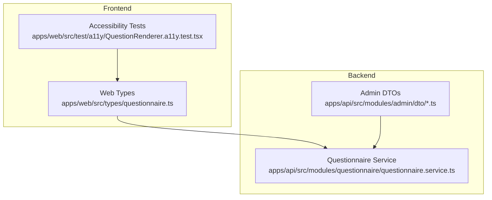
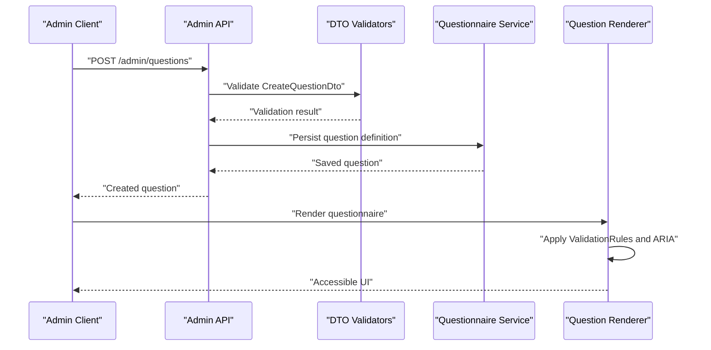
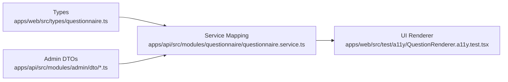
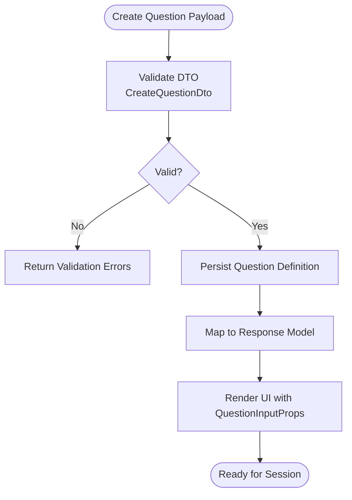

# Question Types & Validation

<cite>
**Referenced Files in This Document**
- [questionnaire.ts](file://apps/web/src/types/questionnaire.ts)
- [create-question.dto.ts](file://apps/api/src/modules/admin/dto/create-question.dto.ts)
- [update-question.dto.ts](file://apps/api/src/modules/admin/dto/update-question.dto.ts)
- [dto.spec.ts](file://apps/api/src/modules/admin/dto/dto.spec.ts)
- [questionnaire.service.ts](file://apps/api/src/modules/questionnaire/questionnaire.service.ts)
- [QuestionRenderer.a11y.test.tsx](file://apps/web/src/test/a11y/QuestionRenderer.a11y.test.tsx)
- [TODO.md](file://TODO.md)
</cite>

## Table of Contents
1. [Introduction](#introduction)
2. [Project Structure](#project-structure)
3. [Core Components](#core-components)
4. [Architecture Overview](#architecture-overview)
5. [Detailed Component Analysis](#detailed-component-analysis)
6. [Dependency Analysis](#dependency-analysis)
7. [Performance Considerations](#performance-considerations)
8. [Troubleshooting Guide](#troubleshooting-guide)
9. [Conclusion](#conclusion)
10. [Appendices](#appendices)

## Introduction
This document defines the supported question types and validation schemas for the questionnaire system. It covers all 11 question types, validation rules, required fields, input constraints, rendering specifications, client-side validation, examples of question definitions, validation patterns, response handling, metadata and weighting, scoring integration, file upload handling, accessibility, internationalization, and responsive design. It also provides guidelines for extending question types and implementing custom validation logic.

## Project Structure
The questionnaire domain spans both the frontend and backend:
- Frontend types define question models, rendering props, and response structures.
- Backend DTOs enforce server-side validation for question creation and updates.
- Service mapping exposes questions to clients with consistent shapes.
- Accessibility tests demonstrate UI component mapping and ARIA attributes.

**Diagram sources**
- [questionnaire.ts:107-128](file://apps/web/src/types/questionnaire.ts#L107-L128)
- [create-question.dto.ts:33-108](file://apps/api/src/modules/admin/dto/create-question.dto.ts#L33-L108)
- [questionnaire.service.ts:296-319](file://apps/api/src/modules/questionnaire/questionnaire.service.ts#L296-L319)
- [QuestionRenderer.a11y.test.tsx:39-82](file://apps/web/src/test/a11y/QuestionRenderer.a11y.test.tsx#L39-L82)

**Section sources**
- [questionnaire.ts:1-225](file://apps/web/src/types/questionnaire.ts#L1-L225)
- [create-question.dto.ts:1-109](file://apps/api/src/modules/admin/dto/create-question.dto.ts#L1-L109)
- [questionnaire.service.ts:281-319](file://apps/api/src/modules/questionnaire/questionnaire.service.ts#L281-L319)
- [QuestionRenderer.a11y.test.tsx:39-82](file://apps/web/src/test/a11y/QuestionRenderer.a11y.test.tsx#L39-L82)

## Core Components
- Question model: Defines question identity, text, type, options, validation rules, defaults, and metadata.
- Section model: Groups questions with ordering and optional metadata.
- Questionnaire model: Aggregates sections and questionnaire-level metadata.
- QuestionResponse: Captures answers, optional coverage, rationale, and timing.
- QuestionnaireSession: Tracks progress and responses during a session.
- ValidationRules: Centralized validation constraints applicable to most question types.
- QuestionInputProps: Props contract for question input components.

**Section sources**
- [questionnaire.ts:107-197](file://apps/web/src/types/questionnaire.ts#L107-L197)

## Architecture Overview
The system separates concerns between data modeling (frontend types), validation (backend DTOs), and presentation (service mapping and UI components). The backend validates question definitions; the frontend renders appropriate inputs and applies client-side validation; accessibility tests ensure screen reader compatibility.

**Diagram sources**
- [create-question.dto.ts:33-108](file://apps/api/src/modules/admin/dto/create-question.dto.ts#L33-L108)
- [questionnaire.service.ts:296-319](file://apps/api/src/modules/questionnaire/questionnaire.service.ts#L296-L319)
- [QuestionRenderer.a11y.test.tsx:39-82](file://apps/web/src/test/a11y/QuestionRenderer.a11y.test.tsx#L39-L82)

## Detailed Component Analysis

### Question Type Definitions and Rendering Specifications
Supported question types include:
- Text input
- Textarea
- Number
- Email
- URL
- Date
- Single choice
- Multiple choice
- Scale
- File upload
- Matrix

Rendering mapping (client-side):
- Text/Textarea/Number/Email/URL/Date: Native HTML inputs with ARIA attributes.
- Single/Multiple choice: Radio/Checkbox groups with labeled options.
- Scale: Slider or numeric input with min/max/step and optional labels.
- File upload: File input with constraints for size/format.
- Matrix: Tabular grid of row options vs column options.

Accessibility and responsive design:
- ARIA roles and attributes are applied in tests to ensure assistive technology compatibility.
- Inputs use responsive widths and consistent spacing.

**Section sources**
- [questionnaire.ts:8-20](file://apps/web/src/types/questionnaire.ts#L8-L20)
- [QuestionRenderer.a11y.test.tsx:39-82](file://apps/web/src/test/a11y/QuestionRenderer.a11y.test.tsx#L39-L82)
- [TODO.md:745-750](file://TODO.md#L745-L750)

### Validation Rules and Required Fields
Centralized validation rules:
- required: Boolean flag indicating mandatory fields.
- minLength/maxLength: String length bounds.
- min/max: Numeric bounds for Number and Scale.
- pattern/patternMessage: Regex constraint and custom message.

Server-side validation (backend DTOs):
- CreateQuestionDto enforces presence of text and type, length limits, numeric bounds, and optional fields.
- UpdateQuestionDto extends CreateQuestionDto with partial updates.

Validation patterns and constraints:
- Text length constrained to a maximum.
- Order index constrained to non-negative integers.
- Options required for choice-based questions.
- Metadata and document mappings accepted as structured objects.

**Section sources**
- [questionnaire.ts:94-102](file://apps/web/src/types/questionnaire.ts#L94-L102)
- [create-question.dto.ts:33-108](file://apps/api/src/modules/admin/dto/create-question.dto.ts#L33-L108)
- [update-question.dto.ts:1-5](file://apps/api/src/modules/admin/dto/update-question.dto.ts#L1-L5)
- [dto.spec.ts:183-255](file://apps/api/src/modules/admin/dto/dto.spec.ts#L183-L255)

### Input Constraints by Question Type
- Text/Textarea: Length constraints via validationRules; placeholder and helpText supported.
- Number: Numeric range via min/max; step increments for precise values.
- Email/URL: Pattern-based validation via validationRules.pattern; custom messages supported.
- Date: Range constraints via min/max; format enforced by client-side parsing.
- Single/Multiple choice: Options array required; selection validated against available choices.
- Scale: Requires min/max/step; optional labels; value display configurable.
- File upload: Size limits and format validation; MIME type and file extension checks; thumbnail preview optional.
- Matrix: Requires rows and columns options; each cell mapped to selected option.

**Section sources**
- [questionnaire.ts:64-89](file://apps/web/src/types/questionnaire.ts#L64-L89)
- [questionnaire.ts:94-102](file://apps/web/src/types/questionnaire.ts#L94-L102)
- [create-question.dto.ts:63-77](file://apps/api/src/modules/admin/dto/create-question.dto.ts#L63-L77)

### Question Rendering and Client-Side Validation
- QuestionInputProps defines the contract for input components: question, value, onChange, error, disabled, and toggles for explanatory content.
- Rendering logic maps question.type to appropriate input components and applies ARIA attributes based on isRequired and helpText.
- Client-side validation aligns with ValidationRules; errors surfaced via error prop.

**Section sources**
- [questionnaire.ts:202-210](file://apps/web/src/types/questionnaire.ts#L202-L210)
- [QuestionRenderer.a11y.test.tsx:39-82](file://apps/web/src/test/a11y/QuestionRenderer.a11y.test.tsx#L39-L82)

### Examples of Question Definitions and Validation Patterns
- Minimal text question: text and type required; optional isRequired, helpText, placeholder.
- Choice question: type SINGLE_CHOICE or MULTIPLE_CHOICE with options array.
- Scale question: requires ScaleConfig with min, max, step and optional labels.
- File upload: type FILE_UPLOAD with validationRules for size/format constraints.
- Validation patterns: regex via validationRules.pattern with optional custom message.

Note: Example payloads are validated by CreateQuestionDto and covered by tests.

**Section sources**
- [create-question.dto.ts:33-108](file://apps/api/src/modules/admin/dto/create-question.dto.ts#L33-L108)
- [dto.spec.ts:183-255](file://apps/api/src/modules/admin/dto/dto.spec.ts#L183-L255)

### Response Handling and Scoring Integration
- QuestionResponse captures questionId, value, optional coverageLevel, coverage decimal, rationale, evidenceCount, and time spent.
- CoverageLevel enumerates five-point scale mapped to decimals for scoring.
- QuestionnaireSession tracks progress, current section/question, and a Map of responses keyed by questionId.

Scoring integration:
- CoverageLevel and coverage fields enable weighted scoring; downstream scoring engine consumes these values.

**Section sources**
- [questionnaire.ts:161-197](file://apps/web/src/types/questionnaire.ts#L161-L197)
- [questionnaire.ts:27-46](file://apps/web/src/types/questionnaire.ts#L27-L46)

### File Upload Handling, Size Limits, and Format Validation
- EvidenceItem describes uploaded artifacts: filename, size, MIME type, artifact type, verification status, and timestamps.
- File upload question type supports size and format constraints via validationRules; backend DTO accepts structured validationRules.

Guidelines:
- Enforce minimum/maximum file sizes and allowed MIME types.
- Provide user feedback for unsupported formats and size violations.
- Store thumbnails where applicable for preview.

**Section sources**
- [questionnaire.ts:215-224](file://apps/web/src/types/questionnaire.ts#L215-L224)
- [create-question.dto.ts:75-77](file://apps/api/src/modules/admin/dto/create-question.dto.ts#L75-L77)

### Accessibility Requirements
- ARIA attributes applied in tests: aria-required and aria-describedby for help text.
- Screen reader-friendly labeling for radio/checkbox groups and sliders.
- Focus management and keyboard navigation supported by native inputs.

**Section sources**
- [QuestionRenderer.a11y.test.tsx:39-82](file://apps/web/src/test/a11y/QuestionRenderer.a11y.test.tsx#L39-L82)

### Internationalization Support
- Text fields (text, helpText, explanation, placeholder) are strings; localization keys can be used to populate these fields server-side.
- Labels and descriptions in options support localized values.

**Section sources**
- [questionnaire.ts:107-128](file://apps/web/src/types/questionnaire.ts#L107-L128)

### Responsive Design Considerations
- Inputs use responsive width classes and consistent padding/margins.
- Layout adapts across breakpoints; focus remains on readable typography and touch-friendly targets.

**Section sources**
- [QuestionRenderer.a11y.test.tsx:39-82](file://apps/web/src/test/a11y/QuestionRenderer.a11y.test.tsx#L39-L82)

### Extending Question Types and Custom Validation Logic
Guidelines:
- Define a new QuestionType constant and extend Question.model.type union.
- Add a new QuestionInputProps variant if the input component differs.
- Implement a renderer mapping for the new type in the UI.
- Add server-side DTO constraints in CreateQuestionDto/UpdateQuestionDto as needed.
- Extend ValidationRules or introduce type-specific validation schemas.
- Integrate with the scoring engine by mapping new types to coverage or numeric values.

**Section sources**
- [questionnaire.ts:8-22](file://apps/web/src/types/questionnaire.ts#L8-L22)
- [create-question.dto.ts:33-108](file://apps/api/src/modules/admin/dto/create-question.dto.ts#L33-L108)

## Dependency Analysis
The frontend types are consumed by the service mapping and UI components. The backend DTOs validate incoming requests and persist question definitions. Accessibility tests validate the UI rendering contract.

**Diagram sources**
- [questionnaire.ts:107-128](file://apps/web/src/types/questionnaire.ts#L107-L128)
- [questionnaire.service.ts:296-319](file://apps/api/src/modules/questionnaire/questionnaire.service.ts#L296-L319)
- [create-question.dto.ts:33-108](file://apps/api/src/modules/admin/dto/create-question.dto.ts#L33-L108)
- [QuestionRenderer.a11y.test.tsx:39-82](file://apps/web/src/test/a11y/QuestionRenderer.a11y.test.tsx#L39-L82)

**Section sources**
- [questionnaire.ts:107-197](file://apps/web/src/types/questionnaire.ts#L107-L197)
- [questionnaire.service.ts:296-319](file://apps/api/src/modules/questionnaire/questionnaire.service.ts#L296-L319)
- [create-question.dto.ts:33-108](file://apps/api/src/modules/admin/dto/create-question.dto.ts#L33-L108)
- [QuestionRenderer.a11y.test.tsx:39-82](file://apps/web/src/test/a11y/QuestionRenderer.a11y.test.tsx#L39-L82)

## Performance Considerations
- Cache frequently accessed question definitions and templates to reduce load times.
- Paginate list endpoints and avoid loading entire questionnaires unnecessarily.
- Use efficient client-side rendering for large matrices and long lists of options.
- Apply minimal re-renders by structuring props and state appropriately.

[No sources needed since this section provides general guidance]

## Troubleshooting Guide
Common validation failures:
- Missing text or type in question creation.
- Exceeding maximum text length or negative order index.
- Omitting options for choice-based questions.
- Invalid regex patterns in validationRules.

Resolution steps:
- Review DTO validation messages and adjust payload accordingly.
- Ensure options conform to QuestionOption shape.
- Verify validationRules match the question type’s constraints.

**Section sources**
- [dto.spec.ts:183-255](file://apps/api/src/modules/admin/dto/dto.spec.ts#L183-L255)

## Conclusion
The questionnaire system provides a robust, extensible foundation for 11 question types with centralized validation, accessible UI rendering, and clear response structures. By adhering to the defined models, DTOs, and rendering contracts, developers can implement new question types and validation logic while maintaining consistency and accessibility.

[No sources needed since this section summarizes without analyzing specific files]

## Appendices

### API Contracts and Validation Flow

**Diagram sources**
- [create-question.dto.ts:33-108](file://apps/api/src/modules/admin/dto/create-question.dto.ts#L33-L108)
- [questionnaire.service.ts:296-319](file://apps/api/src/modules/questionnaire/questionnaire.service.ts#L296-L319)
- [questionnaire.ts:202-210](file://apps/web/src/types/questionnaire.ts#L202-L210)