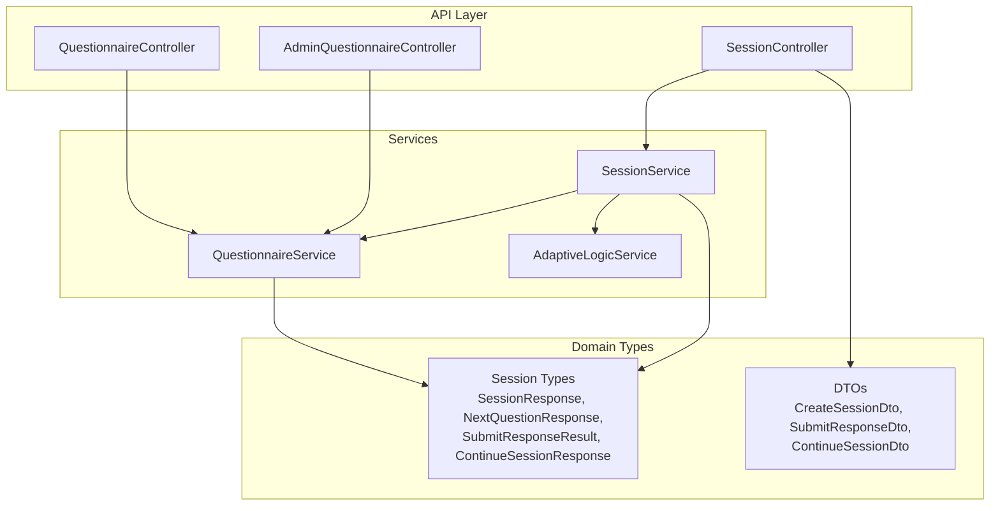
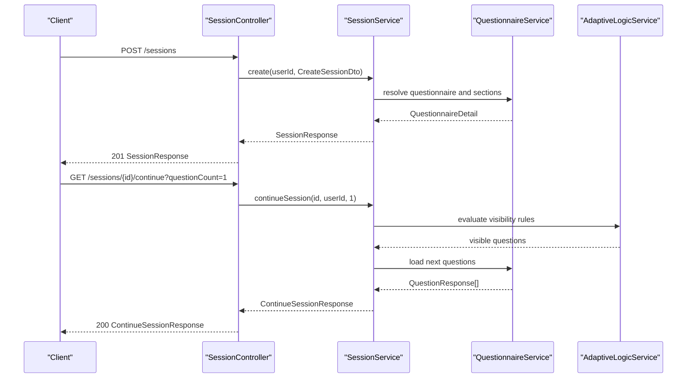
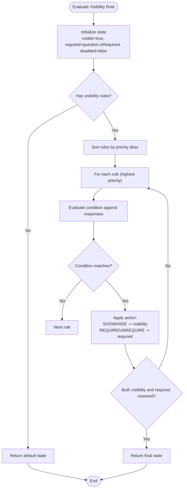
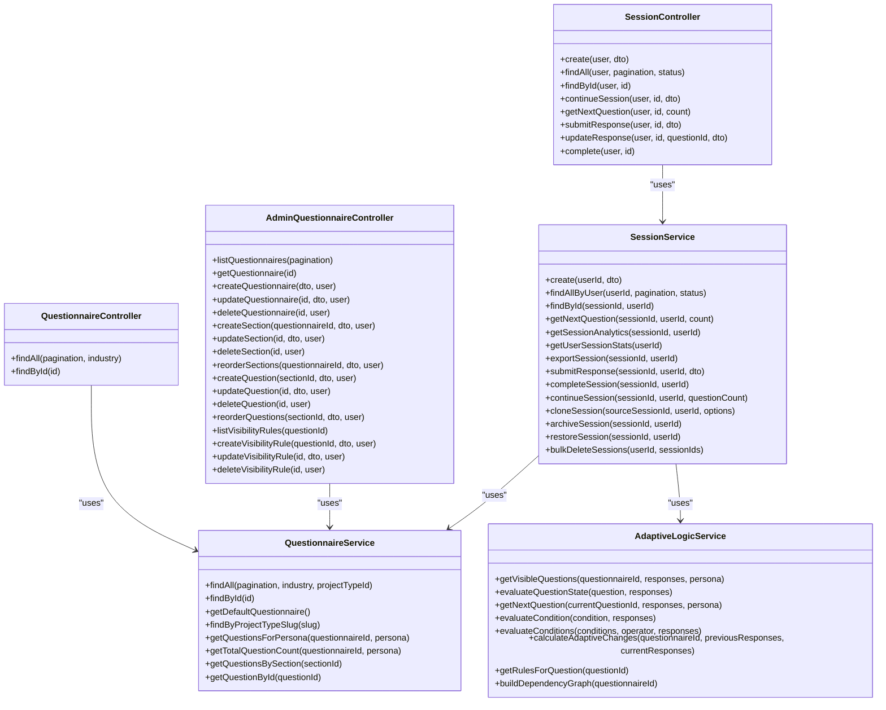

# Questionnaire API

<cite>
**Referenced Files in This Document**
- [questionnaire.controller.ts](file://apps/api/src/modules/questionnaire/questionnaire.controller.ts)
- [questionnaire.service.ts](file://apps/api/src/modules/questionnaire/questionnaire.service.ts)
- [session.controller.ts](file://apps/api/src/modules/session/session.controller.ts)
- [session.service.ts](file://apps/api/src/modules/session/session.service.ts)
- [session-types.ts](file://apps/api/src/modules/session/session-types.ts)
- [create-session.dto.ts](file://apps/api/src/modules/session/dto/create-session.dto.ts)
- [submit-response.dto.ts](file://apps/api/src/modules/session/dto/submit-response.dto.ts)
- [continue-session.dto.ts](file://apps/api/src/modules/session/dto/continue-session.dto.ts)
- [admin-questionnaire.controller.ts](file://apps/api/src/modules/admin/controllers/admin-questionnaire.controller.ts)
- [adaptive-logic.service.ts](file://apps/api/src/modules/adaptive-logic/adaptive-logic.service.ts)
</cite>

## Table of Contents
1. [Introduction](#introduction)
2. [Project Structure](#project-structure)
3. [Core Components](#core-components)
4. [Architecture Overview](#architecture-overview)
5. [Detailed Component Analysis](#detailed-component-analysis)
6. [Dependency Analysis](#dependency-analysis)
7. [Performance Considerations](#performance-considerations)
8. [Troubleshooting Guide](#troubleshooting-guide)
9. [Conclusion](#conclusion)

## Introduction
This document provides comprehensive API documentation for Quiz-to-Build's questionnaire and assessment session management. It covers:
- Questionnaire listing, retrieval, and administrative management
- Adaptive logic evaluation and visibility rule processing
- Assessment session lifecycle: start, continue, submit responses, and complete
- Branching logic and conditional question display
- Templates, question banks, and persona-based filtering
- Persistence, progress tracking, and readiness scoring
- Pagination, filtering, and search capabilities
- Permissions, access controls, and collaborative editing features

## Project Structure
The API is organized into modules:
- Questionnaire module: retrieval, listing, and persona filtering
- Session module: lifecycle management, adaptive logic integration, and scoring
- Admin module: CRUD operations for questionnaires, sections, questions, and visibility rules
- Adaptive logic module: visibility rule evaluation and branching logic

**Diagram sources**
- [questionnaire.controller.ts:1-49](file://apps/api/src/modules/questionnaire/questionnaire.controller.ts#L1-L49)
- [session.controller.ts:1-166](file://apps/api/src/modules/session/session.controller.ts#L1-L166)
- [admin-questionnaire.controller.ts:1-275](file://apps/api/src/modules/admin/controllers/admin-questionnaire.controller.ts#L1-L275)
- [questionnaire.service.ts:1-321](file://apps/api/src/modules/questionnaire/questionnaire.service.ts#L1-L321)
- [session.service.ts:1-116](file://apps/api/src/modules/session/session.service.ts#L1-L116)
- [session-types.ts:1-141](file://apps/api/src/modules/session/session-types.ts#L1-L141)
- [create-session.dto.ts:1-40](file://apps/api/src/modules/session/dto/create-session.dto.ts#L1-L40)
- [submit-response.dto.ts:1-22](file://apps/api/src/modules/session/dto/submit-response.dto.ts#L1-L22)
- [continue-session.dto.ts:1-14](file://apps/api/src/modules/session/dto/continue-session.dto.ts#L1-L14)

**Section sources**
- [questionnaire.controller.ts:1-49](file://apps/api/src/modules/questionnaire/questionnaire.controller.ts#L1-L49)
- [session.controller.ts:1-166](file://apps/api/src/modules/session/session.controller.ts#L1-L166)
- [admin-questionnaire.controller.ts:1-275](file://apps/api/src/modules/admin/controllers/admin-questionnaire.controller.ts#L1-L275)
- [questionnaire.service.ts:1-321](file://apps/api/src/modules/questionnaire/questionnaire.service.ts#L1-L321)
- [session.service.ts:1-116](file://apps/api/src/modules/session/session.service.ts#L1-L116)
- [session-types.ts:1-141](file://apps/api/src/modules/session/session-types.ts#L1-L141)
- [create-session.dto.ts:1-40](file://apps/api/src/modules/session/dto/create-session.dto.ts#L1-L40)
- [submit-response.dto.ts:1-22](file://apps/api/src/modules/session/dto/submit-response.dto.ts#L1-L22)
- [continue-session.dto.ts:1-14](file://apps/api/src/modules/session/dto/continue-session.dto.ts#L1-L14)

## Core Components
- QuestionnaireController: Public endpoints for listing and retrieving questionnaires with pagination and optional industry filter.
- QuestionnaireService: Data access and mapping for questionnaire lists, details, default questionnaire, persona-filtered questions, and counts.
- SessionController: Public endpoints for session lifecycle, including start, list, retrieve, continue, get next questions, submit/update responses, and complete.
- SessionService: Facade delegating to SessionQueryService and SessionMutationService for queries and mutations.
- Session Types: Strongly typed responses for session state, progress, readiness scoring, and analytics.
- DTOs: Validation contracts for session creation, response submission, and continuation parameters.
- AdminQuestionnaireController: Admin-only endpoints for managing questionnaires, sections, questions, and visibility rules.
- AdaptiveLogicService: Evaluates visibility rules, computes adaptive changes, and resolves branching logic.

**Section sources**
- [questionnaire.controller.ts:18-47](file://apps/api/src/modules/questionnaire/questionnaire.controller.ts#L18-L47)
- [questionnaire.service.ts:70-128](file://apps/api/src/modules/questionnaire/questionnaire.service.ts#L70-L128)
- [session.controller.ts:39-164](file://apps/api/src/modules/session/session.controller.ts#L39-L164)
- [session.service.ts:30-115](file://apps/api/src/modules/session/session.service.ts#L30-L115)
- [session-types.ts:10-85](file://apps/api/src/modules/session/session-types.ts#L10-L85)
- [create-session.dto.ts:5-39](file://apps/api/src/modules/session/dto/create-session.dto.ts#L5-L39)
- [submit-response.dto.ts:4-21](file://apps/api/src/modules/session/dto/submit-response.dto.ts#L4-L21)
- [continue-session.dto.ts:5-13](file://apps/api/src/modules/session/dto/continue-session.dto.ts#L5-L13)
- [admin-questionnaire.controller.ts:46-273](file://apps/api/src/modules/admin/controllers/admin-questionnaire.controller.ts#L46-L273)
- [adaptive-logic.service.ts:26-132](file://apps/api/src/modules/adaptive-logic/adaptive-logic.service.ts#L26-L132)

## Architecture Overview
The API follows a layered architecture:
- Controllers handle HTTP requests and responses, applying guards and Swagger metadata.
- Services encapsulate business logic and orchestrate domain operations.
- DTOs enforce input validation and document request/response shapes.
- Domain types define consistent response structures across the system.
- Adaptive logic integrates with session workflows to compute visibility and branching.

**Diagram sources**
- [session.controller.ts:39-113](file://apps/api/src/modules/session/session.controller.ts#L39-L113)
- [session.service.ts:80-94](file://apps/api/src/modules/session/session.service.ts#L80-L94)
- [questionnaire.service.ts:105-128](file://apps/api/src/modules/questionnaire/questionnaire.service.ts#L105-L128)
- [adaptive-logic.service.ts:29-64](file://apps/api/src/modules/adaptive-logic/adaptive-logic.service.ts#L29-L64)

## Detailed Component Analysis

### Questionnaire Endpoints
Public endpoints for questionnaire discovery and retrieval:
- GET /questionnaires
  - Purpose: List available questionnaires with pagination and optional industry filter.
  - Query parameters:
    - page, limit (from PaginationDto)
    - industry (optional)
  - Response: items with metadata and pagination info.
- GET /questionnaires/{id}
  - Purpose: Retrieve full questionnaire details including sections and questions.
  - Path parameter: id (UUID)
  - Response: QuestionnaireDetail with mapped sections and questions.

Additional service methods:
- getDefaultQuestionnaire(): Retrieve the default active questionnaire.
- findByProjectTypeSlug(slug): Resolve questionnaire by project type slug.
- getQuestionsForPersona(questionnaireId, persona): Filter questions by persona and order by severity.
- getTotalQuestionCount(questionnaireId, persona): Count questions respecting persona filter.

Visibility rule processing:
- getQuestionsBySection(sectionId): Load questions with visibility rules for a section.
- getQuestionById(questionId): Load a single question with visibility rules and parent context.

Pagination and filtering:
- findAll uses Prisma with skip/take and optional filters (industry, projectTypeId).
- Responses include total count and computed pagination fields.

**Section sources**
- [questionnaire.controller.ts:18-47](file://apps/api/src/modules/questionnaire/questionnaire.controller.ts#L18-L47)
- [questionnaire.service.ts:70-103](file://apps/api/src/modules/questionnaire/questionnaire.service.ts#L70-L103)
- [questionnaire.service.ts:105-128](file://apps/api/src/modules/questionnaire/questionnaire.service.ts#L105-L128)
- [questionnaire.service.ts:130-153](file://apps/api/src/modules/questionnaire/questionnaire.service.ts#L130-L153)
- [questionnaire.service.ts:195-220](file://apps/api/src/modules/questionnaire/questionnaire.service.ts#L195-L220)
- [questionnaire.service.ts:226-242](file://apps/api/src/modules/questionnaire/questionnaire.service.ts#L226-L242)
- [questionnaire.service.ts:180-189](file://apps/api/src/modules/questionnaire/questionnaire.service.ts#L180-L189)
- [questionnaire.service.ts:169-178](file://apps/api/src/modules/questionnaire/questionnaire.service.ts#L169-L178)
- [questionnaire.service.ts:155-167](file://apps/api/src/modules/questionnaire/questionnaire.service.ts#L155-L167)

### Session Management Endpoints
Session lifecycle endpoints:
- POST /sessions
  - Purpose: Start a new session.
  - Request body: CreateSessionDto (questionnaireId, optional projectTypeId, ideaCaptureId, persona, industry).
  - Response: SessionResponse with progress and metadata.
- GET /sessions
  - Purpose: List user's sessions with optional status filter.
  - Query parameters: pagination (page, limit), status (enum).
  - Response: Paginated list of SessionResponse.
- GET /sessions/{id}
  - Purpose: Retrieve session details by ID.
  - Response: SessionResponse.
- GET /sessions/{id}/continue
  - Purpose: Resume a session; returns next questions and progress after applying adaptive logic.
  - Query parameters: questionCount (min 1, max 5).
  - Response: ContinueSessionResponse including session state, next questions, section progress, overall progress, readiness score, adaptive state, completion flags.
- GET /sessions/{id}/questions/next
  - Purpose: Get next question(s) based on adaptive logic.
  - Query parameters: count (min 1, max 5).
  - Response: NextQuestionResponse with questions, section progress, and overall progress.
- POST /sessions/{id}/responses
  - Purpose: Submit a response to a question.
  - Request body: SubmitResponseDto (questionId, value, optional timeSpentSeconds).
  - Response: SubmitResponseResult including validation outcome, adaptive changes, readiness score, progress, and timestamps.
- PUT /sessions/{id}/responses/{questionId}
  - Purpose: Update an existing response.
  - Request body: Omit timeSpentSeconds; value is required.
  - Response: SubmitResponseResult.
- POST /sessions/{id}/complete
  - Purpose: Mark session as complete.
  - Response: SessionResponse reflecting completion.

Session types and thresholds:
- ProgressInfo: percentage, answeredQuestions, totalQuestions, estimatedTimeRemaining, sectionsLeft, questionsLeft, totalSections, completedSections.
- READINESS_SCORE_THRESHOLD: 95.0.
- READINESS_GATED_PROJECT_TYPE: 'technical-readiness'.

Validation and constraints:
- ContinueSessionDto limits questionCount between 1 and 5.
- SubmitResponseDto enforces UUID for questionId, non-empty value, and non-negative timeSpentSeconds.

**Section sources**
- [session.controller.ts:39-164](file://apps/api/src/modules/session/session.controller.ts#L39-L164)
- [session-types.ts:10-85](file://apps/api/src/modules/session/session-types.ts#L10-L85)
- [create-session.dto.ts:5-39](file://apps/api/src/modules/session/dto/create-session.dto.ts#L5-L39)
- [submit-response.dto.ts:4-21](file://apps/api/src/modules/session/dto/submit-response.dto.ts#L4-L21)
- [continue-session.dto.ts:5-13](file://apps/api/src/modules/session/dto/continue-session.dto.ts#L5-L13)

### Adaptive Logic and Visibility Rules
Adaptive logic evaluates visibility rules to determine which questions are visible and whether they are required or disabled. It also supports branching logic to compute the next question.

Key capabilities:
- getVisibleQuestions(questionnaireId, responses, persona): Returns visible questions considering persona and active visibility rules.
- evaluateQuestionState(question, responses): Computes visibility, requirement, and disabled state per rule priority.
- getNextQuestion(currentQuestionId, responses, persona): Resolves the next visible question in the current section.
- evaluateCondition(condition, responses): Evaluates a single condition against collected responses.
- evaluateConditions(conditions, operator, responses): Evaluates multiple conditions with AND/OR semantics.
- calculateAdaptiveChanges(questionnaireId, previousResponses, currentResponses): Identifies questions added or removed due to response changes.
- getRulesForQuestion(questionId): Retrieves active rules affecting a specific question.
- buildDependencyGraph(questionnaireId): Builds a dependency graph of questions based on visibility rules.

**Diagram sources**
- [adaptive-logic.service.ts:69-132](file://apps/api/src/modules/adaptive-logic/adaptive-logic.service.ts#L69-L132)

**Section sources**
- [adaptive-logic.service.ts:29-64](file://apps/api/src/modules/adaptive-logic/adaptive-logic.service.ts#L29-L64)
- [adaptive-logic.service.ts:69-132](file://apps/api/src/modules/adaptive-logic/adaptive-logic.service.ts#L69-L132)
- [adaptive-logic.service.ts:137-176](file://apps/api/src/modules/adaptive-logic/adaptive-logic.service.ts#L137-L176)
- [adaptive-logic.service.ts:181-204](file://apps/api/src/modules/adaptive-logic/adaptive-logic.service.ts#L181-L204)
- [adaptive-logic.service.ts:209-224](file://apps/api/src/modules/adaptive-logic/adaptive-logic.service.ts#L209-L224)
- [adaptive-logic.service.ts:229-238](file://apps/api/src/modules/adaptive-logic/adaptive-logic.service.ts#L229-L238)
- [adaptive-logic.service.ts:243-273](file://apps/api/src/modules/adaptive-logic/adaptive-logic.service.ts#L243-L273)

### Admin Questionnaire Management
Admin endpoints enable full lifecycle management of questionnaires, sections, questions, and visibility rules:
- Questionnaire CRUD:
  - GET /admin/questionnaires (paginated)
  - GET /admin/questionnaires/{id}
  - POST /admin/questionnaires
  - PATCH /admin/questionnaires/{id}
  - DELETE /admin/questionnaires/{id} (SUPER_ADMIN only)
- Section CRUD:
  - POST /admin/questionnaires/{questionnaireId}/sections
  - PATCH /admin/sections/{id}
  - DELETE /admin/sections/{id} (SUPER_ADMIN only)
  - PATCH /admin/questionnaires/{questionnaireId}/sections/reorder
- Question CRUD:
  - POST /admin/sections/{sectionId}/questions
  - PATCH /admin/questions/{id}
  - DELETE /admin/questions/{id} (SUPER_ADMIN only)
  - PATCH /admin/sections/{sectionId}/questions/reorder
- Visibility Rules:
  - GET /admin/questions/{questionId}/rules
  - POST /admin/questions/{questionId}/rules
  - PATCH /admin/rules/{id}
  - DELETE /admin/rules/{id}

Access control:
- Roles guard restricts endpoints to ADMIN and SUPER_ADMIN.
- SUPER_ADMIN required for deletion operations.

**Section sources**
- [admin-questionnaire.controller.ts:46-273](file://apps/api/src/modules/admin/controllers/admin-questionnaire.controller.ts#L46-L273)

### Session Persistence, Auto-save, and Progress Tracking
Session persistence and progress:
- SessionService acts as a facade delegating to query and mutation services.
- ProgressInfo captures completion metrics and remaining estimates.
- ContinueSessionResponse includes adaptiveState (visibleQuestionCount, skippedQuestionCount, appliedRules) and completion flags (isComplete, canComplete).
- SubmitResponseResult includes validation outcomes and readiness score updates.

Auto-save and real-time updates:
- While the controller does not expose explicit auto-save endpoints, frequent submission and continuation calls enable near real-time persistence of progress.
- Clients can poll GET /sessions/{id}/continue to receive updated state and next questions.

**Section sources**
- [session.service.ts:30-115](file://apps/api/src/modules/session/session.service.ts#L30-L115)
- [session-types.ts:10-85](file://apps/api/src/modules/session/session-types.ts#L10-L85)

### Questionnaire Templates, Question Banks, and Persona Filtering
Templates and question banks:
- getDefaultQuestionnaire(): Provides a default active questionnaire for baseline usage.
- findByProjectTypeSlug(slug): Resolves a questionnaire associated with a project type.
- getQuestionsForPersona(questionnaireId, persona): Filters questions by persona and orders by severity for NQS compatibility.

Persona-based filtering:
- Visibility rules support persona targeting.
- getVisibleQuestions accepts an optional persona to constrain visibility.

**Section sources**
- [questionnaire.service.ts:130-153](file://apps/api/src/modules/questionnaire/questionnaire.service.ts#L130-L153)
- [questionnaire.service.ts:195-220](file://apps/api/src/modules/questionnaire/questionnaire.service.ts#L195-L220)
- [questionnaire.service.ts:226-242](file://apps/api/src/modules/questionnaire/questionnaire.service.ts#L226-L242)
- [adaptive-logic.service.ts:34-64](file://apps/api/src/modules/adaptive-logic/adaptive-logic.service.ts#L34-L64)

### Permissions, Access Controls, and Collaborative Editing
Access control model:
- JWT authentication guard protects most endpoints.
- Admin endpoints additionally require roles guard with ADMIN or SUPER_ADMIN.
- Session endpoints verify ownership via user ID before operations.

Collaborative editing:
- No explicit collaborative editing endpoints are exposed in the analyzed files.
- Admin endpoints enable structured editing of questionnaires and rules.

**Section sources**
- [questionnaire.controller.ts:13-14](file://apps/api/src/modules/questionnaire/questionnaire.controller.ts#L13-L14)
- [session.controller.ts:34-35](file://apps/api/src/modules/session/session.controller.ts#L34-L35)
- [admin-questionnaire.controller.ts:37-38](file://apps/api/src/modules/admin/controllers/admin-questionnaire.controller.ts#L37-L38)

### Pagination, Filtering, and Search
Pagination:
- All list endpoints accept pagination parameters (page, limit) via PaginationDto.
- Responses include computed pagination fields: page, limit, totalItems, totalPages.

Filtering:
- Questionnaire listing supports optional industry filter.
- Session listing supports optional status filter (enum).

Search:
- No explicit free-text search endpoints are present in the analyzed files.

**Section sources**
- [questionnaire.controller.ts:18-39](file://apps/api/src/modules/questionnaire/questionnaire.controller.ts#L18-L39)
- [session.controller.ts:49-75](file://apps/api/src/modules/session/session.controller.ts#L49-L75)

## Dependency Analysis
The following diagram shows key dependencies among controllers, services, and domain types:

**Diagram sources**
- [questionnaire.controller.ts:15-16](file://apps/api/src/modules/questionnaire/questionnaire.controller.ts#L15-L16)
- [session.controller.ts:37-38](file://apps/api/src/modules/session/session.controller.ts#L37-L38)
- [admin-questionnaire.controller.ts:40](file://apps/api/src/modules/admin/controllers/admin-questionnaire.controller.ts#L40)
- [questionnaire.service.ts:67-68](file://apps/api/src/modules/questionnaire/questionnaire.service.ts#L67-L68)
- [session.service.ts:35-50](file://apps/api/src/modules/session/session.service.ts#L35-L50)
- [adaptive-logic.service.ts:21-24](file://apps/api/src/modules/adaptive-logic/adaptive-logic.service.ts#L21-L24)

**Section sources**
- [questionnaire.controller.ts:15-16](file://apps/api/src/modules/questionnaire/questionnaire.controller.ts#L15-L16)
- [session.controller.ts:37-38](file://apps/api/src/modules/session/session.controller.ts#L37-L38)
- [admin-questionnaire.controller.ts:40](file://apps/api/src/modules/admin/controllers/admin-questionnaire.controller.ts#L40)
- [questionnaire.service.ts:67-68](file://apps/api/src/modules/questionnaire/questionnaire.service.ts#L67-L68)
- [session.service.ts:35-50](file://apps/api/src/modules/session/session.service.ts#L35-L50)
- [adaptive-logic.service.ts:21-24](file://apps/api/src/modules/adaptive-logic/adaptive-logic.service.ts#L21-L24)

## Performance Considerations
- Pagination: Use page and limit parameters to avoid large payloads; server-side skip/take are applied.
- Visibility rule evaluation: getVisibleQuestions loads up to 1000 questions; ensure efficient rule design and persona filtering to minimize evaluation overhead.
- Adaptive changes: calculateAdaptiveChanges compares sets of visible questions; keep response sets bounded and avoid excessive branching.
- Queries: findAll and findById include nested relations; prefer targeted endpoints (e.g., getNextQuestion) to reduce payload size.

## Troubleshooting Guide
Common issues and resolutions:
- Not Found Errors:
  - Questionnaire not found: Occurs when findById receives an inactive or non-existent ID.
  - Session not found: Occurs when accessing sessions that do not belong to the user or do not exist.
- Access Denied:
  - Admin endpoints require ADMIN or SUPER_ADMIN roles; ensure proper role assignment.
  - Session endpoints verify user ownership; confirm authentication and user ID matching.
- Validation Errors:
  - ContinueSessionDto enforces questionCount bounds (1–5); adjust query parameter accordingly.
  - SubmitResponseDto requires a non-empty value and valid UUID for questionId; ensure correct payload structure.
- Adaptive Logic:
  - If no questions appear, verify visibility rules and persona filters; ensure responses satisfy conditions.
  - For branching anomalies, review rule priorities and logical operators.

**Section sources**
- [questionnaire.service.ts:123-125](file://apps/api/src/modules/questionnaire/questionnaire.service.ts#L123-L125)
- [session.controller.ts:106-113](file://apps/api/src/modules/session/session.controller.ts#L106-L113)
- [admin-questionnaire.controller.ts:37-38](file://apps/api/src/modules/admin/controllers/admin-questionnaire.controller.ts#L37-L38)
- [continue-session.dto.ts:8-12](file://apps/api/src/modules/session/dto/continue-session.dto.ts#L8-L12)
- [submit-response.dto.ts:6-14](file://apps/api/src/modules/session/dto/submit-response.dto.ts#L6-L14)
- [adaptive-logic.service.ts:86-132](file://apps/api/src/modules/adaptive-logic/adaptive-logic.service.ts#L86-L132)

## Conclusion
The Quiz-to-Build API provides a robust foundation for questionnaire management and adaptive assessment sessions. Administrators can manage questionnaires, sections, questions, and visibility rules through dedicated endpoints. Users can start, continue, and complete sessions with adaptive logic-driven question selection, progress tracking, and readiness scoring. The design emphasizes strong typing, pagination, and clear separation of concerns across controllers, services, and domain types.