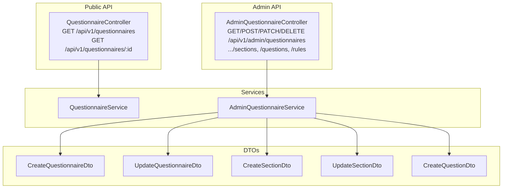
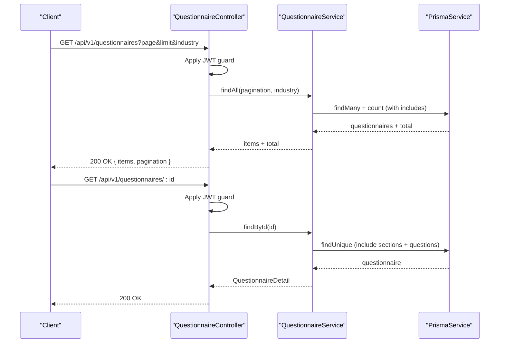
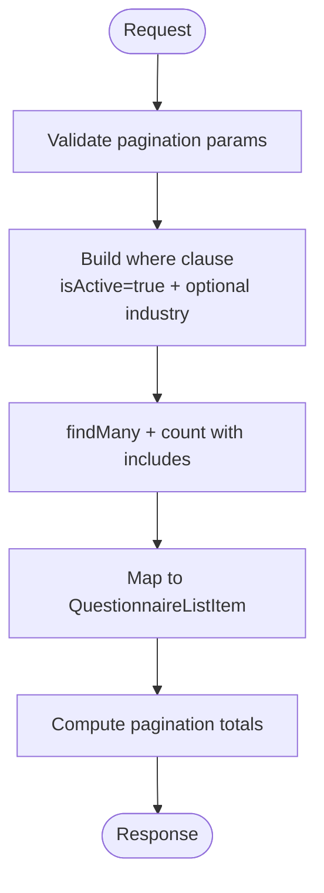
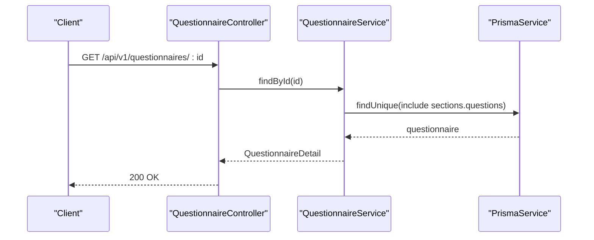
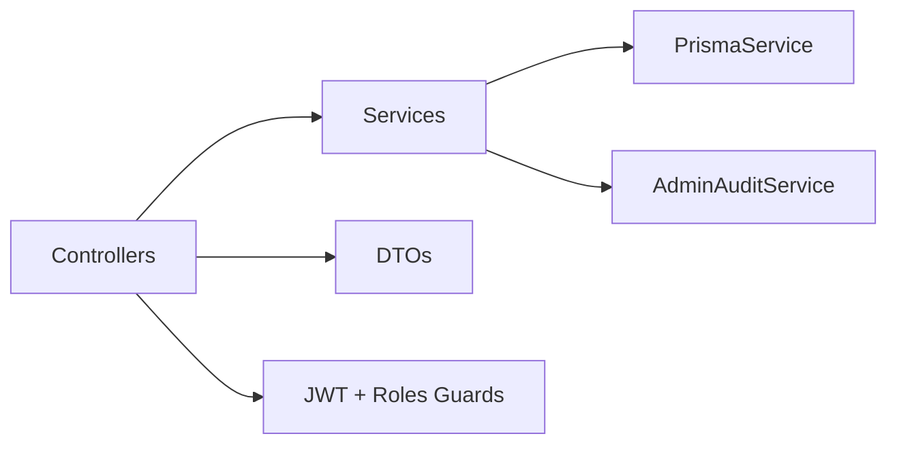

# Questionnaire Management

<cite>
**Referenced Files in This Document**
- [questionnaire.controller.ts](file://apps/api/src/modules/questionnaire/questionnaire.controller.ts)
- [questionnaire.service.ts](file://apps/api/src/modules/questionnaire/questionnaire.service.ts)
- [admin-questionnaire.controller.ts](file://apps/api/src/modules/admin/controllers/admin-questionnaire.controller.ts)
- [admin-questionnaire.service.ts](file://apps/api/src/modules/admin/services/admin-questionnaire.service.ts)
- [create-questionnaire.dto.ts](file://apps/api/src/modules/admin/dto/create-questionnaire.dto.ts)
- [update-questionnaire.dto.ts](file://apps/api/src/modules/admin/dto/update-questionnaire.dto.ts)
- [create-section.dto.ts](file://apps/api/src/modules/admin/dto/create-section.dto.ts)
- [update-section.dto.ts](file://apps/api/src/modules/admin/dto/update-section.dto.ts)
- [create-question.dto.ts](file://apps/api/src/modules/admin/dto/create-question.dto.ts)
- [subscription.guard.ts](file://apps/api/src/common/guards/subscription.guard.ts)
- [appinsights.config.ts](file://apps/api/src/config/appinsights.config.ts)
- [questionnaire.controller.spec.ts](file://apps/api/src/modules/questionnaire/questionnaire.controller.spec.ts)
- [admin-questionnaire.controller.spec.ts](file://apps/api/src/modules/admin/controllers/admin-questionnaire.controller.spec.ts)
</cite>

## Table of Contents
1. [Introduction](#introduction)
2. [Project Structure](#project-structure)
3. [Core Components](#core-components)
4. [Architecture Overview](#architecture-overview)
5. [Detailed Component Analysis](#detailed-component-analysis)
6. [Dependency Analysis](#dependency-analysis)
7. [Performance Considerations](#performance-considerations)
8. [Troubleshooting Guide](#troubleshooting-guide)
9. [Conclusion](#conclusion)
10. [Appendices](#appendices)

## Introduction
This document provides comprehensive API documentation for questionnaire management endpoints. It covers:
- Listing available questionnaires with pagination and optional industry filtering
- Retrieving complete questionnaire details including sections, questions, and configuration
- Administrative endpoints for creating, updating, reordering, and deleting questionnaires, sections, questions, and visibility rules
- Request/response schemas for questionnaire objects, section structures, and question definitions
- Lifecycle management, status transitions, and validation rules
- Examples of creation payloads, bulk operations, and administrative workflows
- Permissions, access controls, and role-based restrictions

## Project Structure
The questionnaire management APIs are implemented in two primary modules:
- Public API for consumers: GET /api/v1/questionnaires and GET /api/v1/questionnaires/:id
- Administrative API for editors and administrators: GET, POST, PATCH, DELETE under /api/v1/admin/questionnaires and related endpoints for sections, questions, and visibility rules

**Diagram sources**
- [questionnaire.controller.ts:1-49](file://apps/api/src/modules/questionnaire/questionnaire.controller.ts#L1-L49)
- [admin-questionnaire.controller.ts:1-275](file://apps/api/src/modules/admin/controllers/admin-questionnaire.controller.ts#L1-L275)
- [questionnaire.service.ts:1-321](file://apps/api/src/modules/questionnaire/questionnaire.service.ts#L1-L321)
- [admin-questionnaire.service.ts:1-575](file://apps/api/src/modules/admin/services/admin-questionnaire.service.ts#L1-L575)
- [create-questionnaire.dto.ts:1-37](file://apps/api/src/modules/admin/dto/create-questionnaire.dto.ts#L1-L37)
- [update-questionnaire.dto.ts:1-12](file://apps/api/src/modules/admin/dto/update-questionnaire.dto.ts#L1-L12)
- [create-section.dto.ts:1-41](file://apps/api/src/modules/admin/dto/create-section.dto.ts#L1-L41)
- [update-section.dto.ts:1-5](file://apps/api/src/modules/admin/dto/update-section.dto.ts#L1-L5)
- [create-question.dto.ts:1-109](file://apps/api/src/modules/admin/dto/create-question.dto.ts#L1-L109)

**Section sources**
- [questionnaire.controller.ts:1-49](file://apps/api/src/modules/questionnaire/questionnaire.controller.ts#L1-L49)
- [admin-questionnaire.controller.ts:1-275](file://apps/api/src/modules/admin/controllers/admin-questionnaire.controller.ts#L1-L275)

## Core Components
- QuestionnaireController: Exposes public endpoints for listing and retrieving questionnaires with JWT authentication.
- QuestionnaireService: Implements data access and mapping for questionnaire lists and detailed views.
- AdminQuestionnaireController: Exposes administrative endpoints protected by JWT and role guards.
- AdminQuestionnaireService: Implements CRUD operations for questionnaires, sections, questions, and visibility rules with audit logging.

**Section sources**
- [questionnaire.controller.ts:15-48](file://apps/api/src/modules/questionnaire/questionnaire.controller.ts#L15-L48)
- [questionnaire.service.ts:66-128](file://apps/api/src/modules/questionnaire/questionnaire.service.ts#L66-L128)
- [admin-questionnaire.controller.ts:39-107](file://apps/api/src/modules/admin/controllers/admin-questionnaire.controller.ts#L39-L107)
- [admin-questionnaire.service.ts:35-92](file://apps/api/src/modules/admin/services/admin-questionnaire.service.ts#L35-L92)

## Architecture Overview
The API follows a layered architecture:
- Controllers handle HTTP requests and apply guards and decorators
- Services encapsulate business logic and data access
- DTOs define validated request/response schemas
- Guards enforce authentication and role-based access control
- Audit logging tracks administrative actions

**Diagram sources**
- [questionnaire.controller.ts:18-39](file://apps/api/src/modules/questionnaire/questionnaire.controller.ts#L18-L39)
- [questionnaire.service.ts:70-103](file://apps/api/src/modules/questionnaire/questionnaire.service.ts#L70-L103)
- [questionnaire.service.ts:105-128](file://apps/api/src/modules/questionnaire/questionnaire.service.ts#L105-L128)

## Detailed Component Analysis

### Public Endpoints

#### GET /api/v1/questionnaires
- Purpose: List available questionnaires with pagination and optional industry filter
- Authentication: JWT required
- Query parameters:
  - page: integer, default 1
  - limit: integer, default 20
  - industry: string, optional
- Response:
  - items: array of QuestionnaireListItem
  - pagination: { page, limit, totalItems, totalPages }

**Diagram sources**
- [questionnaire.controller.ts:22-39](file://apps/api/src/modules/questionnaire/questionnaire.controller.ts#L22-L39)
- [questionnaire.service.ts:70-103](file://apps/api/src/modules/questionnaire/questionnaire.service.ts#L70-L103)

**Section sources**
- [questionnaire.controller.ts:18-39](file://apps/api/src/modules/questionnaire/questionnaire.controller.ts#L18-L39)
- [questionnaire.service.ts:70-103](file://apps/api/src/modules/questionnaire/questionnaire.service.ts#L70-L103)
- [questionnaire.controller.spec.ts:32-44](file://apps/api/src/modules/questionnaire/questionnaire.controller.spec.ts#L32-L44)

#### GET /api/v1/questionnaires/:id
- Purpose: Retrieve complete questionnaire details including sections and questions
- Authentication: JWT required
- Path parameter:
  - id: UUID
- Response: QuestionnaireDetail

**Diagram sources**
- [questionnaire.controller.ts:41-47](file://apps/api/src/modules/questionnaire/questionnaire.controller.ts#L41-L47)
- [questionnaire.service.ts:105-128](file://apps/api/src/modules/questionnaire/questionnaire.service.ts#L105-L128)

**Section sources**
- [questionnaire.controller.ts:41-47](file://apps/api/src/modules/questionnaire/questionnaire.controller.ts#L41-L47)
- [questionnaire.service.ts:105-128](file://apps/api/src/modules/questionnaire/questionnaire.service.ts#L105-L128)
- [questionnaire.controller.spec.ts:84-111](file://apps/api/src/modules/questionnaire/questionnaire.controller.spec.ts#L84-L111)

### Administrative Endpoints

#### GET /api/v1/admin/questionnaires
- Purpose: List all questionnaires (administrative)
- Authentication: JWT required
- Authorization: ADMIN or SUPER_ADMIN
- Query parameters:
  - page: integer, default 1
  - limit: integer, default 20
- Response:
  - items: array of Questionnaire
  - pagination: { page, limit, total, totalPages }

**Section sources**
- [admin-questionnaire.controller.ts:46-61](file://apps/api/src/modules/admin/controllers/admin-questionnaire.controller.ts#L46-L61)
- [admin-questionnaire.controller.spec.ts:93-118](file://apps/api/src/modules/admin/controllers/admin-questionnaire.controller.spec.ts#L93-L118)

#### GET /api/v1/admin/questionnaires/:id
- Purpose: Get questionnaire with full details (administrative)
- Authentication: JWT required
- Authorization: ADMIN or SUPER_ADMIN
- Path parameter:
  - id: UUID
- Response: QuestionnaireWithDetails (includes sections, questions, visibility rules, session counts)

**Section sources**
- [admin-questionnaire.controller.ts:63-70](file://apps/api/src/modules/admin/controllers/admin-questionnaire.controller.ts#L63-L70)
- [admin-questionnaire.controller.spec.ts:120-129](file://apps/api/src/modules/admin/controllers/admin-questionnaire.controller.spec.ts#L120-L129)

#### POST /api/v1/admin/questionnaires
- Purpose: Create new questionnaire
- Authentication: JWT required
- Authorization: ADMIN or SUPER_ADMIN
- Request body: CreateQuestionnaireDto
- Response: Questionnaire

Request schema (CreateQuestionnaireDto):
- name: string (required, max length 200)
- description: string (optional)
- industry: string (optional, max length 100)
- isDefault: boolean (optional, default false)
- estimatedTime: number (optional, min 1)
- metadata: object (optional)

**Section sources**
- [admin-questionnaire.controller.ts:72-81](file://apps/api/src/modules/admin/controllers/admin-questionnaire.controller.ts#L72-L81)
- [create-questionnaire.dto.ts:4-36](file://apps/api/src/modules/admin/dto/create-questionnaire.dto.ts#L4-L36)
- [admin-questionnaire.service.ts:94-116](file://apps/api/src/modules/admin/services/admin-questionnaire.service.ts#L94-L116)

#### PATCH /api/v1/admin/questionnaires/:id
- Purpose: Update questionnaire metadata
- Authentication: JWT required
- Authorization: ADMIN or SUPER_ADMIN
- Path parameter:
  - id: UUID
- Request body: UpdateQuestionnaireDto (partial CreateQuestionnaireDto with optional isActive)
- Response: Questionnaire

Request schema (UpdateQuestionnaireDto):
- name: string (optional)
- description: string (optional)
- industry: string (optional)
- isDefault: boolean (optional)
- isActive: boolean (optional)
- estimatedTime: number (optional)
- metadata: object (optional)

**Section sources**
- [admin-questionnaire.controller.ts:83-94](file://apps/api/src/modules/admin/controllers/admin-questionnaire.controller.ts#L83-L94)
- [update-questionnaire.dto.ts:6-11](file://apps/api/src/modules/admin/dto/update-questionnaire.dto.ts#L6-L11)
- [admin-questionnaire.service.ts:118-153](file://apps/api/src/modules/admin/services/admin-questionnaire.service.ts#L118-L153)

#### DELETE /api/v1/admin/questionnaires/:id
- Purpose: Soft-delete questionnaire (set inactive)
- Authentication: JWT required
- Authorization: SUPER_ADMIN only
- Path parameter:
  - id: UUID
- Response: { message: string }

Lifecycle note: Deletion is implemented as a soft delete by setting isActive to false.

**Section sources**
- [admin-questionnaire.controller.ts:96-107](file://apps/api/src/modules/admin/controllers/admin-questionnaire.controller.ts#L96-L107)
- [admin-questionnaire.service.ts:155-178](file://apps/api/src/modules/admin/services/admin-questionnaire.service.ts#L155-L178)

#### Section Endpoints

##### POST /api/v1/admin/questionnaires/:questionnaireId/sections
- Purpose: Add section to questionnaire
- Authentication: JWT required
- Authorization: ADMIN or SUPER_ADMIN
- Path parameters:
  - questionnaireId: UUID
- Request body: CreateSectionDto
- Response: Section

Request schema (CreateSectionDto):
- name: string (required, max length 200)
- description: string (optional)
- icon: string (optional, max length 50)
- estimatedTime: number (optional, min 1)
- orderIndex: number (optional, min 0) — auto-calculated if omitted
- metadata: object (optional)

**Section sources**
- [admin-questionnaire.controller.ts:113-124](file://apps/api/src/modules/admin/controllers/admin-questionnaire.controller.ts#L113-L124)
- [create-section.dto.ts:4-40](file://apps/api/src/modules/admin/dto/create-section.dto.ts#L4-L40)
- [admin-questionnaire.service.ts:184-223](file://apps/api/src/modules/admin/services/admin-questionnaire.service.ts#L184-L223)

##### PATCH /api/v1/admin/sections/:id
- Purpose: Update section
- Authentication: JWT required
- Authorization: ADMIN or SUPER_ADMIN
- Path parameter:
  - id: UUID
- Request body: UpdateSectionDto (partial CreateSectionDto)
- Response: Section

**Section sources**
- [admin-questionnaire.controller.ts:126-137](file://apps/api/src/modules/admin/controllers/admin-questionnaire.controller.ts#L126-L137)
- [update-section.dto.ts:4-4](file://apps/api/src/modules/admin/dto/update-section.dto.ts#L4-L4)
- [admin-questionnaire.service.ts:225-253](file://apps/api/src/modules/admin/services/admin-questionnaire.service.ts#L225-L253)

##### DELETE /api/v1/admin/sections/:id
- Purpose: Delete section (SUPER_ADMIN only)
- Authentication: JWT required
- Authorization: SUPER_ADMIN only
- Path parameter:
  - id: UUID
- Constraints: Section must have zero questions; otherwise returns 400
- Response: { message: string }

**Section sources**
- [admin-questionnaire.controller.ts:139-151](file://apps/api/src/modules/admin/controllers/admin-questionnaire.controller.ts#L139-L151)
- [admin-questionnaire.service.ts:255-280](file://apps/api/src/modules/admin/services/admin-questionnaire.service.ts#L255-L280)

##### PATCH /api/v1/admin/questionnaires/:questionnaireId/sections/reorder
- Purpose: Reorder sections within questionnaire
- Authentication: JWT required
- Authorization: ADMIN or SUPER_ADMIN
- Path parameters:
  - questionnaireId: UUID
- Request body: ReorderSectionsDto (array of { id, orderIndex })
- Response: Section[]

**Section sources**
- [admin-questionnaire.controller.ts:153-164](file://apps/api/src/modules/admin/controllers/admin-questionnaire.controller.ts#L153-L164)
- [admin-questionnaire.service.ts:282-313](file://apps/api/src/modules/admin/services/admin-questionnaire.service.ts#L282-L313)

#### Question Endpoints

##### POST /api/v1/admin/sections/:sectionId/questions
- Purpose: Add question to section
- Authentication: JWT required
- Authorization: ADMIN or SUPER_ADMIN
- Path parameters:
  - sectionId: UUID
- Request body: CreateQuestionDto
- Response: Question

Request schema (CreateQuestionDto):
- text: string (required, max length 1000)
- type: QuestionType (enum)
- helpText: string (optional)
- explanation: string (optional)
- placeholder: string (optional)
- isRequired: boolean (optional)
- options: array of QuestionOptionDto (optional)
- validationRules: object (optional)
- defaultValue: any (optional)
- suggestedAnswer: any (optional)
- industryTags: string[] (optional)
- documentMappings: object (optional)
- orderIndex: number (optional, min 0) — auto-calculated if omitted
- metadata: object (optional)

Nested schema (QuestionOptionDto):
- value: string (required)
- label: string (required)
- description: string (optional)

**Section sources**
- [admin-questionnaire.controller.ts:170-181](file://apps/api/src/modules/admin/controllers/admin-questionnaire.controller.ts#L170-L181)
- [create-question.dto.ts:33-108](file://apps/api/src/modules/admin/dto/create-question.dto.ts#L33-L108)
- [admin-questionnaire.service.ts:319-366](file://apps/api/src/modules/admin/services/admin-questionnaire.service.ts#L319-L366)

##### PATCH /api/v1/admin/questions/:id
- Purpose: Update question
- Authentication: JWT required
- Authorization: ADMIN or SUPER_ADMIN
- Path parameter:
  - id: UUID
- Request body: UpdateQuestionDto (partial CreateQuestionDto)
- Response: Question

**Section sources**
- [admin-questionnaire.controller.ts:183-194](file://apps/api/src/modules/admin/controllers/admin-questionnaire.controller.ts#L183-L194)
- [admin-questionnaire.service.ts:368-404](file://apps/api/src/modules/admin/services/admin-questionnaire.service.ts#L368-L404)

##### DELETE /api/v1/admin/questions/:id
- Purpose: Delete question (SUPER_ADMIN only)
- Authentication: JWT required
- Authorization: SUPER_ADMIN only
- Path parameter:
  - id: UUID
- Constraints: Question must have zero responses; otherwise returns 400
- Response: { message: string }

**Section sources**
- [admin-questionnaire.controller.ts:196-208](file://apps/api/src/modules/admin/controllers/admin-questionnaire.controller.ts#L196-L208)
- [admin-questionnaire.service.ts:406-431](file://apps/api/src/modules/admin/services/admin-questionnaire.service.ts#L406-L431)

##### PATCH /api/v1/admin/sections/:sectionId/questions/reorder
- Purpose: Reorder questions within section
- Authentication: JWT required
- Authorization: ADMIN or SUPER_ADMIN
- Path parameters:
  - sectionId: UUID
- Request body: ReorderQuestionsDto (array of { id, orderIndex })
- Response: Question[]

**Section sources**
- [admin-questionnaire.controller.ts:210-221](file://apps/api/src/modules/admin/controllers/admin-questionnaire.controller.ts#L210-L221)
- [admin-questionnaire.service.ts:433-464](file://apps/api/src/modules/admin/services/admin-questionnaire.service.ts#L433-L464)

#### Visibility Rule Endpoints

##### GET /api/v1/admin/questions/:questionId/rules
- Purpose: List visibility rules for question
- Authentication: JWT required
- Authorization: ADMIN or SUPER_ADMIN
- Path parameter:
  - questionId: UUID
- Response: VisibilityRule[] (ordered by priority desc)

**Section sources**
- [admin-questionnaire.controller.ts:227-234](file://apps/api/src/modules/admin/controllers/admin-questionnaire.controller.ts#L227-L234)
- [admin-questionnaire.service.ts:470-483](file://apps/api/src/modules/admin/services/admin-questionnaire.service.ts#L470-L483)

##### POST /api/v1/admin/questions/:questionId/rules
- Purpose: Add visibility rule to question
- Authentication: JWT required
- Authorization: ADMIN or SUPER_ADMIN
- Path parameters:
  - questionId: UUID
- Request body: CreateVisibilityRuleDto
- Response: VisibilityRule

**Section sources**
- [admin-questionnaire.controller.ts:236-247](file://apps/api/src/modules/admin/controllers/admin-questionnaire.controller.ts#L236-L247)
- [admin-questionnaire.service.ts:485-518](file://apps/api/src/modules/admin/services/admin-questionnaire.service.ts#L485-L518)

##### PATCH /api/v1/admin/rules/:id
- Purpose: Update visibility rule
- Authentication: JWT required
- Authorization: ADMIN or SUPER_ADMIN
- Path parameter:
  - id: UUID
- Request body: UpdateVisibilityRuleDto
- Response: VisibilityRule

**Section sources**
- [admin-questionnaire.controller.ts:249-260](file://apps/api/src/modules/admin/controllers/admin-questionnaire.controller.ts#L249-L260)
- [admin-questionnaire.service.ts:520-553](file://apps/api/src/modules/admin/services/admin-questionnaire.service.ts#L520-L553)

##### DELETE /api/v1/admin/rules/:id
- Purpose: Delete visibility rule
- Authentication: JWT required
- Authorization: ADMIN or SUPER_ADMIN
- Path parameter:
  - id: UUID
- Response: { message: string }

**Section sources**
- [admin-questionnaire.controller.ts:262-273](file://apps/api/src/modules/admin/controllers/admin-questionnaire.controller.ts#L262-L273)
- [admin-questionnaire.service.ts:555-573](file://apps/api/src/modules/admin/services/admin-questionnaire.service.ts#L555-L573)

### Request/Response Schemas

#### QuestionnaireListItem
- id: string (UUID)
- name: string
- description: string (optional)
- industry: string (optional)
- version: number
- estimatedTime: number (optional)
- totalQuestions: number
- sections: array of { id, name, questionCount }
- createdAt: Date

#### QuestionnaireDetail
- id: string (UUID)
- name: string
- description: string (optional)
- industry: string (optional)
- version: number
- estimatedTime: number (optional)
- sections: array of SectionResponse

#### SectionResponse
- id: string (UUID)
- name: string
- description: string (optional)
- order: number
- icon: string (optional)
- estimatedTime: number (optional)
- questionCount: number
- questions: array of QuestionResponse (optional)

#### QuestionResponse
- id: string (UUID)
- text: string
- type: QuestionType
- required: boolean
- helpText: string (optional)
- explanation: string (optional)
- placeholder: string (optional)
- options: array of QuestionOption (optional)
- validation: object (optional)
- bestPractice: string (optional)
- practicalExplainer: string (optional)
- dimensionKey: string (optional)

#### QuestionOption
- id: string (UUID)
- label: string
- description: string (optional)
- icon: string (optional)
- value: string | number | boolean (optional)

**Section sources**
- [questionnaire.service.ts:40-64](file://apps/api/src/modules/questionnaire/questionnaire.service.ts#L40-L64)
- [questionnaire.service.ts:29-38](file://apps/api/src/modules/questionnaire/questionnaire.service.ts#L29-L38)
- [questionnaire.service.ts:6-27](file://apps/api/src/modules/questionnaire/questionnaire.service.ts#L6-L27)

### Administrative Workflows and Examples

#### Creating a Questionnaire
- Endpoint: POST /api/v1/admin/questionnaires
- Example payload:
  - name: "Business Plan Questionnaire"
  - description: "Comprehensive questionnaire for business planning"
  - industry: "technology"
  - isDefault: false
  - estimatedTime: 45
  - metadata: {}

#### Bulk Operations
- Reordering sections: PATCH /api/v1/admin/questionnaires/:questionnaireId/sections/reorder with items array of { id, orderIndex }
- Reordering questions: PATCH /api/v1/admin/sections/:sectionId/questions/reorder with items array of { id, orderIndex }

#### Visibility Rules
- Create rule: POST /api/v1/admin/questions/:questionId/rules with condition, action, targetQuestionIds, priority, isActive
- Update rule: PATCH /api/v1/admin/rules/:id
- Delete rule: DELETE /api/v1/admin/rules/:id

**Section sources**
- [admin-questionnaire.controller.ts:153-164](file://apps/api/src/modules/admin/controllers/admin-questionnaire.controller.ts#L153-L164)
- [admin-questionnaire.controller.ts:210-221](file://apps/api/src/modules/admin/controllers/admin-questionnaire.controller.ts#L210-L221)
- [admin-questionnaire.controller.ts:236-247](file://apps/api/src/modules/admin/controllers/admin-questionnaire.controller.ts#L236-L247)

## Dependency Analysis
- Controllers depend on services for business logic
- Services depend on PrismaService for data access
- DTOs validate and document request/response shapes
- Guards enforce authentication and roles
- Audit logging captures administrative changes

**Diagram sources**
- [questionnaire.controller.ts:15-16](file://apps/api/src/modules/questionnaire/questionnaire.controller.ts#L15-L16)
- [admin-questionnaire.controller.ts:39-40](file://apps/api/src/modules/admin/controllers/admin-questionnaire.controller.ts#L39-L40)
- [admin-questionnaire.service.ts:37-40](file://apps/api/src/modules/admin/services/admin-questionnaire.service.ts#L37-L40)

**Section sources**
- [questionnaire.controller.ts:15-16](file://apps/api/src/modules/questionnaire/questionnaire.controller.ts#L15-L16)
- [admin-questionnaire.controller.ts:39-40](file://apps/api/src/modules/admin/controllers/admin-questionnaire.controller.ts#L39-L40)
- [admin-questionnaire.service.ts:37-40](file://apps/api/src/modules/admin/services/admin-questionnaire.service.ts#L37-L40)

## Performance Considerations
- Pagination defaults: page=1, limit=20 are applied when unspecified
- Efficient queries: findMany with skip/take and count executed in parallel
- Includes: sections with question counts, questions with visibility rules
- Recommendations:
  - Use pagination for large datasets
  - Filter by industry when listing to reduce result sets
  - Avoid requesting full details unnecessarily; use list endpoint for summaries

**Section sources**
- [questionnaire.controller.ts:33-37](file://apps/api/src/modules/questionnaire/questionnaire.controller.ts#L33-L37)
- [questionnaire.service.ts:81-102](file://apps/api/src/modules/questionnaire/questionnaire.service.ts#L81-L102)

## Troubleshooting Guide
- 404 Not Found:
  - Questionnaire not found by ID
  - Section not found by ID
  - Question not found by ID
  - Visibility rule not found by ID
- 400 Bad Request:
  - Cannot delete section with existing questions
  - Cannot delete question with existing responses
- Access Control:
  - DELETE /api/v1/admin/questionnaires/:id requires SUPER_ADMIN
  - DELETE /api/v1/admin/sections/:id requires SUPER_ADMIN
  - DELETE /api/v1/admin/questions/:id requires SUPER_ADMIN
  - DELETE /api/v1/admin/rules/:id requires ADMIN or SUPER_ADMIN

**Section sources**
- [admin-questionnaire.service.ts:87-89](file://apps/api/src/modules/admin/services/admin-questionnaire.service.ts#L87-L89)
- [admin-questionnaire.service.ts:265-269](file://apps/api/src/modules/admin/services/admin-questionnaire.service.ts#L265-L269)
- [admin-questionnaire.service.ts:416-420](file://apps/api/src/modules/admin/services/admin-questionnaire.service.ts#L416-L420)

## Conclusion
The questionnaire management APIs provide a robust, role-guarded interface for listing, retrieving, and administratively managing questionnaires, sections, questions, and visibility rules. Public endpoints focus on consumption with pagination and filtering, while administrative endpoints enable comprehensive authoring workflows with validation, ordering, and audit logging.

## Appendices

### Permissions and Access Controls
- Public endpoints:
  - GET /api/v1/questionnaires: JWT required
  - GET /api/v1/questionnaires/:id: JWT required
- Administrative endpoints:
  - GET/POST/PATCH/DELETE /api/v1/admin/questionnaires: ADMIN or SUPER_ADMIN
  - DELETE /api/v1/admin/questionnaires/:id: SUPER_ADMIN
  - Section/Question/Rule endpoints: ADMIN or SUPER_ADMIN (with specific roles noted above)

**Section sources**
- [questionnaire.controller.ts:13-14](file://apps/api/src/modules/questionnaire/questionnaire.controller.ts#L13-L14)
- [admin-questionnaire.controller.ts:47-48](file://apps/api/src/modules/admin/controllers/admin-questionnaire.controller.ts#L47-L48)
- [admin-questionnaire.controller.ts:96-98](file://apps/api/src/modules/admin/controllers/admin-questionnaire.controller.ts#L96-L98)

### Feature Limits and Subscription Guard
- Questionnaire feature availability and limits are enforced via subscription guard
- Example limits:
  - FREE: 1 questionnaire
  - ENTERPRISE: unlimited (-1)

**Section sources**
- [subscription.guard.ts:52-53](file://apps/api/src/common/guards/subscription.guard.ts#L52-L53)
- [subscription.guard.ts:238](file://apps/api/src/common/guards/subscription.guard.ts#L238)

### Metrics and Monitoring
- Questionnaire completion metrics tracked via Application Insights configuration
- Metrics include completion percentage, questions answered, and time spent

**Section sources**
- [appinsights.config.ts:178](file://apps/api/src/config/appinsights.config.ts#L178)
- [appinsights.config.ts:194](file://apps/api/src/config/appinsights.config.ts#L194)
- [appinsights.config.ts:200](file://apps/api/src/config/appinsights.config.ts#L200)
- [appinsights.config.ts:206](file://apps/api/src/config/appinsights.config.ts#L206)
- [appinsights.config.ts:473](file://apps/api/src/config/appinsights.config.ts#L473)