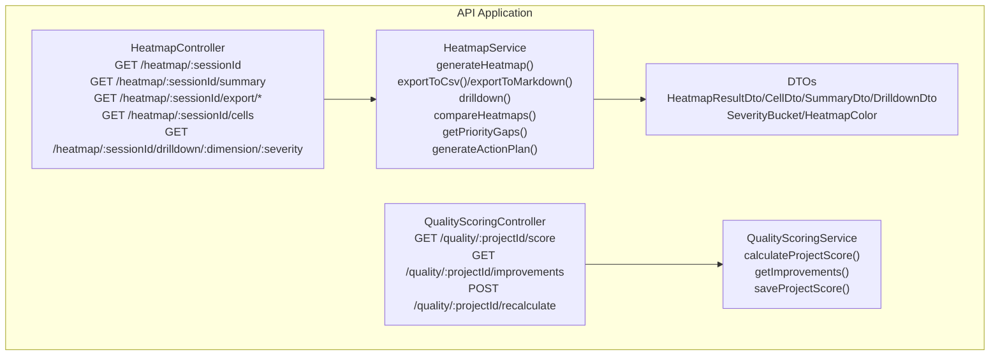
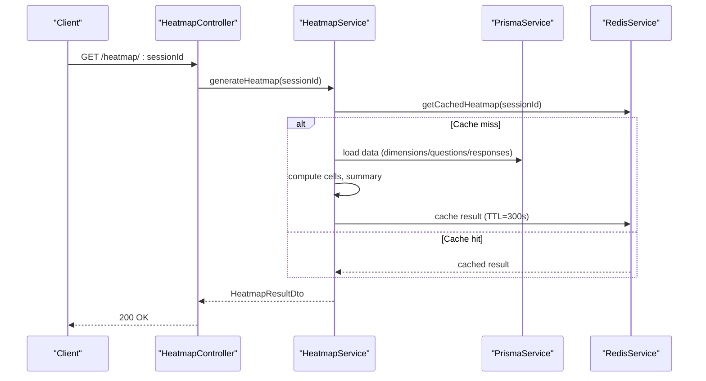
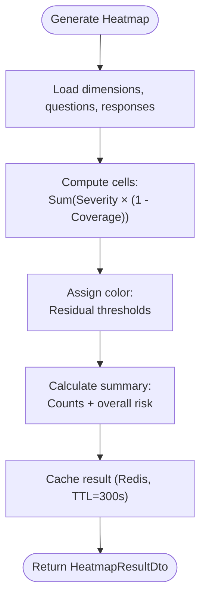
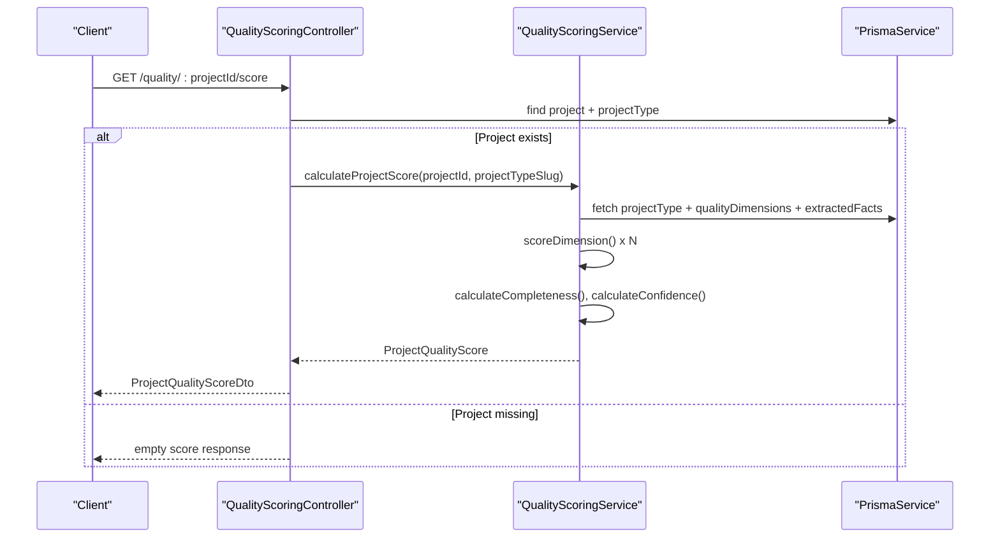
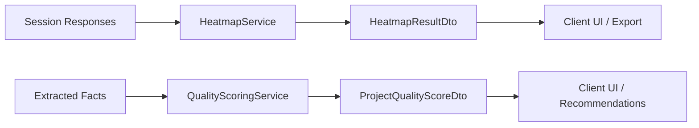
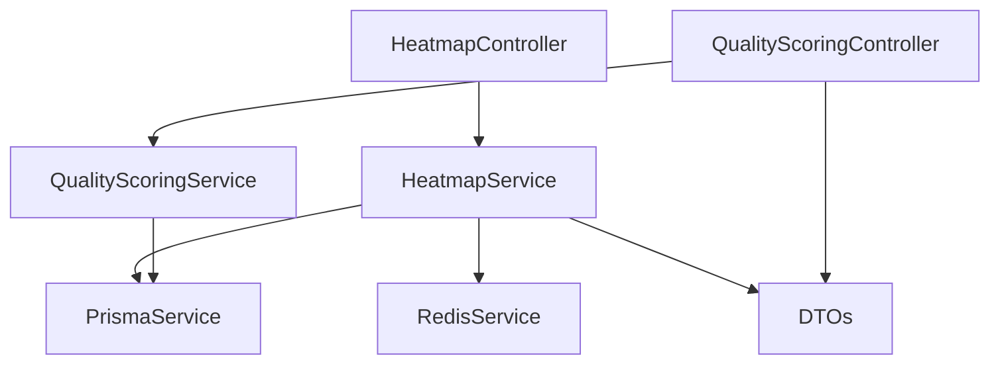

# Analytics & Visualization API

<cite>
**Referenced Files in This Document**
- [heatmap.controller.ts](file://apps/api/src/modules/heatmap/heatmap.controller.ts)
- [heatmap.service.ts](file://apps/api/src/modules/heatmap/heatmap.service.ts)
- [index.ts](file://apps/api/src/modules/heatmap/dto/index.ts)
- [quality-scoring.controller.ts](file://apps/api/src/modules/quality-scoring/quality-scoring.controller.ts)
- [quality-scoring.service.ts](file://apps/api/src/modules/quality-scoring/services/quality-scoring.service.ts)
</cite>

## Table of Contents
1. [Introduction](#introduction)
2. [Project Structure](#project-structure)
3. [Core Components](#core-components)
4. [Architecture Overview](#architecture-overview)
5. [Detailed Component Analysis](#detailed-component-analysis)
6. [Dependency Analysis](#dependency-analysis)
7. [Performance Considerations](#performance-considerations)
8. [Troubleshooting Guide](#troubleshooting-guide)
9. [Conclusion](#conclusion)

## Introduction
This document provides comprehensive API documentation for Quiz-to-Build’s analytics and visualization endpoints. It covers:
- Heatmap generation APIs for visualizing response patterns, coverage distributions, and dimension performance across questionnaires
- Quality scoring endpoints for assessing document completeness, response consistency, and assessment reliability
- Heatmap data structures, visualization parameters, and rendering options
- Quality metrics calculation, scoring algorithms for response quality assessment, and trend analysis capabilities
- Examples of heatmap generation requests, quality score interpretations, and visualization export formats
- Performance optimization for large datasets, caching strategies for frequently accessed analytics, and real-time visualization updates

## Project Structure
The analytics and visualization features are implemented as NestJS modules under the API application:
- Heatmap module: Controllers and services for generating and exporting heatmaps, plus drilldown and trend analysis
- Quality Scoring module: Controllers and services for calculating project quality scores and improvement suggestions

**Diagram sources**
- [heatmap.controller.ts:34-185](file://apps/api/src/modules/heatmap/heatmap.controller.ts#L34-L185)
- [heatmap.service.ts:43-851](file://apps/api/src/modules/heatmap/heatmap.service.ts#L43-L851)
- [index.ts:1-192](file://apps/api/src/modules/heatmap/dto/index.ts#L1-L192)
- [quality-scoring.controller.ts:19-182](file://apps/api/src/modules/quality-scoring/quality-scoring.controller.ts#L19-L182)
- [quality-scoring.service.ts:28-339](file://apps/api/src/modules/quality-scoring/services/quality-scoring.service.ts#L28-L339)

**Section sources**
- [heatmap.controller.ts:34-185](file://apps/api/src/modules/heatmap/heatmap.controller.ts#L34-L185)
- [heatmap.service.ts:43-851](file://apps/api/src/modules/heatmap/heatmap.service.ts#L43-L851)
- [index.ts:1-192](file://apps/api/src/modules/heatmap/dto/index.ts#L1-L192)
- [quality-scoring.controller.ts:19-182](file://apps/api/src/modules/quality-scoring/quality-scoring.controller.ts#L19-L182)
- [quality-scoring.service.ts:28-339](file://apps/api/src/modules/quality-scoring/services/quality-scoring.service.ts#L28-L339)

## Core Components
- HeatmapController: Exposes REST endpoints for heatmap generation, summaries, exports, cell filtering, and drilldown
- HeatmapService: Implements heatmap computation, caching, export formats, trend comparison, priority gaps, and action plans
- DTOs: Define data contracts for heatmap results, cells, summaries, drilldowns, severity buckets, and color codes
- QualityScoringController: Exposes endpoints to fetch project quality scores, improvement suggestions, and to recalculate and persist scores
- QualityScoringService: Computes weighted dimension scores, completeness, confidence, and generates recommendations

**Section sources**
- [heatmap.controller.ts:34-185](file://apps/api/src/modules/heatmap/heatmap.controller.ts#L34-L185)
- [heatmap.service.ts:43-851](file://apps/api/src/modules/heatmap/heatmap.service.ts#L43-L851)
- [index.ts:1-192](file://apps/api/src/modules/heatmap/dto/index.ts#L1-L192)
- [quality-scoring.controller.ts:19-182](file://apps/api/src/modules/quality-scoring/quality-scoring.controller.ts#L19-L182)
- [quality-scoring.service.ts:28-339](file://apps/api/src/modules/quality-scoring/services/quality-scoring.service.ts#L28-L339)

## Architecture Overview
The analytics pipeline integrates data access via Prisma, caching via Redis, and exposes REST endpoints secured by JWT authentication. The quality scoring pipeline evaluates extracted facts against benchmark criteria defined per project type.

**Diagram sources**
- [heatmap.controller.ts:66-68](file://apps/api/src/modules/heatmap/heatmap.controller.ts#L66-L68)
- [heatmap.service.ts:56-91](file://apps/api/src/modules/heatmap/heatmap.service.ts#L56-L91)
- [heatmap.service.ts:412-434](file://apps/api/src/modules/heatmap/heatmap.service.ts#L412-L434)

**Section sources**
- [heatmap.controller.ts:66-68](file://apps/api/src/modules/heatmap/heatmap.controller.ts#L66-L68)
- [heatmap.service.ts:56-91](file://apps/api/src/modules/heatmap/heatmap.service.ts#L56-L91)
- [heatmap.service.ts:412-434](file://apps/api/src/modules/heatmap/heatmap.service.ts#L412-L434)

## Detailed Component Analysis

### Heatmap API

#### Endpoints
- GET /heatmap/:sessionId
  - Description: Generates a dimension × severity matrix showing readiness gaps
  - Response: HeatmapResultDto
- GET /heatmap/:sessionId/summary
  - Description: Returns counts of green/amber/red cells, critical gaps, and overall risk
  - Response: HeatmapSummaryDto
- GET /heatmap/:sessionId/export/csv
  - Description: Downloads the heatmap as a CSV file
  - Response: 200 with CSV attachment
- GET /heatmap/:sessionId/export/markdown
  - Description: Downloads the heatmap as a Markdown file
  - Response: 200 with Markdown attachment
- GET /heatmap/:sessionId/cells?dimension=&severity=
  - Description: Returns individual heatmap cells with optional filtering by dimension or severity
  - Response: Array of HeatmapCellDto
- GET /heatmap/:sessionId/drilldown/:dimensionKey/:severityBucket
  - Description: Returns questions contributing to a specific dimension × severity cell
  - Response: HeatmapDrilldownDto

Security and validation:
- All endpoints require JWT authentication
- Session IDs are validated as UUIDs
- Export endpoints set appropriate headers and sanitization for Markdown

**Section sources**
- [heatmap.controller.ts:54-184](file://apps/api/src/modules/heatmap/heatmap.controller.ts#L54-L184)

#### Data Structures
- SeverityBucket: Low, Medium, High, Critical
- HeatmapColor: Green, Amber, Red
- HeatmapCellDto: dimensionId, dimensionKey, severityBucket, cellValue, colorCode, questionCount
- HeatmapSummaryDto: totalCells, greenCells, amberCells, redCells, criticalGapCount, overallRiskScore
- HeatmapResultDto: sessionId, cells, dimensions, severityBuckets, summary, generatedAt
- HeatmapDrilldownDto: dimensionKey, dimensionName, severityBucket, cellValue, colorCode, questionCount, questions, cell, potentialImprovement

Rendering and export:
- CSV: Header row with dimensions and severity buckets, per-dimension rows, and summary section
- Markdown: Table with emojis and legends, plus summary and legend sections
- Visualization JSON: Matrix format suitable for D3.js/Chart.js with color scale metadata

**Section sources**
- [index.ts:7-52](file://apps/api/src/modules/heatmap/dto/index.ts#L7-L52)
- [index.ts:81-149](file://apps/api/src/modules/heatmap/dto/index.ts#L81-L149)
- [index.ts:154-191](file://apps/api/src/modules/heatmap/dto/index.ts#L154-L191)
- [heatmap.service.ts:96-196](file://apps/api/src/modules/heatmap/heatmap.service.ts#L96-L196)
- [heatmap.service.ts:688-723](file://apps/api/src/modules/heatmap/heatmap.service.ts#L688-L723)

#### Processing Logic
- Data loading: Fetches dimensions, questions, and responses scoped to the session and persona/project type
- Cell generation: Sums Severity × (1 − Coverage) per dimension × severity bucket; assigns color based on residual thresholds
- Summary calculation: Counts risk categories and overall risk score
- Drilldown: Filters questions by dimension and severity bucket, computes residual risk per question
- Trend analysis: Compares two heatmaps by computing absolute and percentage changes per cell and overall trend
- Priority gaps: Computes priority score per cell using dimension weights and severity multipliers, returns top contributing questions
- Action plan: Groups priority gaps into phases (Immediate Priority, Quick Wins, Continuous Improvement) with estimated impacts

**Diagram sources**
- [heatmap.service.ts:353-410](file://apps/api/src/modules/heatmap/heatmap.service.ts#L353-L410)
- [heatmap.service.ts:412-434](file://apps/api/src/modules/heatmap/heatmap.service.ts#L412-L434)

**Section sources**
- [heatmap.service.ts:310-351](file://apps/api/src/modules/heatmap/heatmap.service.ts#L310-L351)
- [heatmap.service.ts:353-410](file://apps/api/src/modules/heatmap/heatmap.service.ts#L353-L410)
- [heatmap.service.ts:472-536](file://apps/api/src/modules/heatmap/heatmap.service.ts#L472-L536)
- [heatmap.service.ts:542-610](file://apps/api/src/modules/heatmap/heatmap.service.ts#L542-L610)
- [heatmap.service.ts:616-683](file://apps/api/src/modules/heatmap/heatmap.service.ts#L616-L683)

#### Example Requests and Interpretations
- Generate heatmap:
  - Request: GET /heatmap/{sessionId}
  - Interpretation: Each cell’s value indicates residual risk; color indicates risk level; higher values indicate more gaps
- Export to CSV/Markdown:
  - Request: GET /heatmap/{sessionId}/export/csv or /export/markdown
  - Interpretation: Use CSV for spreadsheets; Markdown for lightweight reports with legends
- Filter cells:
  - Request: GET /heatmap/{sessionId}/cells?dimension=MODERN_ARCH&severity=High
  - Interpretation: Narrow down to specific dimension and severity for targeted review
- Drilldown:
  - Request: GET /heatmap/{sessionId}/drilldown/MODERN_ARCH/Critical
  - Interpretation: See contributing questions, their severity, coverage, and residual risk; use potential improvement to prioritize actions

**Section sources**
- [heatmap.controller.ts:54-184](file://apps/api/src/modules/heatmap/heatmap.controller.ts#L54-L184)
- [heatmap.service.ts:227-295](file://apps/api/src/modules/heatmap/heatmap.service.ts#L227-L295)

### Quality Scoring API

#### Endpoints
- GET /quality/:projectId/score
  - Description: Returns project quality metrics including overall, completeness, and confidence scores, plus dimension scores and recommendations
  - Response: ProjectQualityScoreDto
- GET /quality/:projectId/improvements
  - Description: Returns actionable improvement suggestions per dimension
  - Response: Array of QualityImprovementDto
- POST /quality/:projectId/recalculate
  - Description: Recalculates and persists the project quality score
  - Response: ProjectQualityScoreDto

Security and validation:
- All endpoints require JWT authentication
- Handles missing project or project type gracefully by returning empty/default scores

**Section sources**
- [quality-scoring.controller.ts:30-117](file://apps/api/src/modules/quality-scoring/quality-scoring.controller.ts#L30-L117)

#### Data Structures
- ProjectQualityScoreDto: projectId, overallScore, completenessScore, confidenceScore, dimensionScores, recommendations, scoredAt
- QualityImprovementDto: dimensionId, dimensionName, currentScore, potentialScore, missingCriteria, suggestedQuestions

Scoring algorithm highlights:
- Dimensions: Weighted by project type; scores computed as weighted average of criterion confidences where criteria are met
- Completeness: Percentage of benchmark criteria met across all dimensions
- Confidence: Average confidence of extracted facts
- Recommendations: Prioritized by lowest dimension scores and missing criteria

**Section sources**
- [quality-scoring.controller.ts:122-166](file://apps/api/src/modules/quality-scoring/quality-scoring.controller.ts#L122-L166)
- [quality-scoring.service.ts:36-94](file://apps/api/src/modules/quality-scoring/services/quality-scoring.service.ts#L36-L94)
- [quality-scoring.service.ts:276-302](file://apps/api/src/modules/quality-scoring/services/quality-scoring.service.ts#L276-L302)

#### Processing Logic
- Project type lookup: Determines benchmark criteria and weights
- Criterion evaluation: Matches extracted facts to benchmark criteria using exact/partial key and keyword matching
- Dimension scoring: Computes completeness and weighted confidence per dimension
- Overall score: Weighted average across dimensions
- Improvements: Identifies low-scoring dimensions and suggests questions to address missing criteria

**Diagram sources**
- [quality-scoring.controller.ts:34-53](file://apps/api/src/modules/quality-scoring/quality-scoring.controller.ts#L34-L53)
- [quality-scoring.service.ts:36-94](file://apps/api/src/modules/quality-scoring/services/quality-scoring.service.ts#L36-L94)

**Section sources**
- [quality-scoring.controller.ts:34-53](file://apps/api/src/modules/quality-scoring/quality-scoring.controller.ts#L34-L53)
- [quality-scoring.service.ts:36-94](file://apps/api/src/modules/quality-scoring/services/quality-scoring.service.ts#L36-L94)
- [quality-scoring.service.ts:99-151](file://apps/api/src/modules/quality-scoring/services/quality-scoring.service.ts#L99-L151)
- [quality-scoring.service.ts:212-242](file://apps/api/src/modules/quality-scoring/services/quality-scoring.service.ts#L212-L242)
- [quality-scoring.service.ts:247-271](file://apps/api/src/modules/quality-scoring/services/quality-scoring.service.ts#L247-L271)

#### Example Requests and Interpretations
- Get quality score:
  - Request: GET /quality/{projectId}/score
  - Interpretation: Review overallScore, completenessScore, confidenceScore, and dimensionScores to understand strengths and weaknesses
- Get improvements:
  - Request: GET /quality/{projectId}/improvements
  - Interpretation: Use suggestedQuestions to prompt users for missing information; target dimensions with the lowest scores
- Recalculate and save:
  - Request: POST /quality/{projectId}/recalculate
  - Interpretation: Persist recalculated score to the project record for future reference

**Section sources**
- [quality-scoring.controller.ts:58-117](file://apps/api/src/modules/quality-scoring/quality-scoring.controller.ts#L58-L117)
- [quality-scoring.service.ts:322-337](file://apps/api/src/modules/quality-scoring/services/quality-scoring.service.ts#L322-L337)

### Conceptual Overview
- Heatmap visualization focuses on residual risk derived from severity and coverage, enabling quick identification of high-priority gaps
- Quality scoring emphasizes completeness and confidence of extracted facts against benchmark criteria, guiding document quality and reliability assessments

[No sources needed since this diagram shows conceptual workflow, not actual code structure]

[No sources needed since this section doesn't analyze specific source files]

## Dependency Analysis
- HeatmapController depends on HeatmapService
- HeatmapService depends on PrismaService for data access and RedisService for caching
- QualityScoringController depends on QualityScoringService and PrismaService
- DTOs define contracts consumed by both controllers and services

**Diagram sources**
- [heatmap.controller.ts:11-19](file://apps/api/src/modules/heatmap/heatmap.controller.ts#L11-L19)
- [heatmap.service.ts:48-51](file://apps/api/src/modules/heatmap/heatmap.service.ts#L48-L51)
- [quality-scoring.controller.ts:11-13](file://apps/api/src/modules/quality-scoring/quality-scoring.controller.ts#L11-L13)

**Section sources**
- [heatmap.controller.ts:11-19](file://apps/api/src/modules/heatmap/heatmap.controller.ts#L11-L19)
- [heatmap.service.ts:48-51](file://apps/api/src/modules/heatmap/heatmap.service.ts#L48-L51)
- [quality-scoring.controller.ts:11-13](file://apps/api/src/modules/quality-scoring/quality-scoring.controller.ts#L11-L13)

## Performance Considerations
- Caching: Heatmap results are cached in Redis with a 5-minute TTL to reduce repeated computation for the same session
- Data limits: Queries limit dimensions, questions, and responses to prevent unbounded growth; adjust take/orderBy clauses as needed
- Export optimization: CSV/Markdown generation reuses computed results to avoid recomputation
- Trend and priority computations: Use precomputed results to minimize redundant work
- Recommendations: Keep recommendation lists concise (e.g., top 3 per dimension) to maintain responsiveness

**Section sources**
- [heatmap.service.ts:45-51](file://apps/api/src/modules/heatmap/heatmap.service.ts#L45-L51)
- [heatmap.service.ts:412-434](file://apps/api/src/modules/heatmap/heatmap.service.ts#L412-L434)
- [heatmap.service.ts:325-348](file://apps/api/src/modules/heatmap/heatmap.service.ts#L325-L348)
- [quality-scoring.service.ts:65-69](file://apps/api/src/modules/quality-scoring/services/quality-scoring.service.ts#L65-L69)

## Troubleshooting Guide
- Session not found:
  - Symptom: 404 responses from heatmap endpoints
  - Cause: Invalid or missing session ID
  - Resolution: Verify sessionId parameter and ensure the session exists
- Cell not found during drilldown:
  - Symptom: 404 response from drilldown endpoint
  - Cause: dimensionKey/severityBucket combination does not exist in the computed heatmap
  - Resolution: Confirm dimension keys and severity buckets match computed values
- Cache errors:
  - Symptom: Warnings about failing to get/set cache
  - Cause: Redis connectivity or serialization issues
  - Resolution: Check Redis availability and retry; results fall back to recomputation
- Empty quality score:
  - Symptom: Zero scores and default recommendations
  - Cause: Missing project, project type, or extracted facts
  - Resolution: Ensure project exists and has associated facts and project type configured

**Section sources**
- [heatmap.controller.ts:65-66](file://apps/api/src/modules/heatmap/heatmap.controller.ts#L65-L66)
- [heatmap.controller.ts:177-178](file://apps/api/src/modules/heatmap/heatmap.controller.ts#L177-L178)
- [heatmap.service.ts:421-423](file://apps/api/src/modules/heatmap/heatmap.service.ts#L421-L423)
- [quality-scoring.controller.ts:43-45](file://apps/api/src/modules/quality-scoring/quality-scoring.controller.ts#L43-L45)
- [quality-scoring.service.ts:307-317](file://apps/api/src/modules/quality-scoring/services/quality-scoring.service.ts#L307-L317)

## Conclusion
The Analytics & Visualization APIs provide robust capabilities for:
- Generating interactive and exportable heatmaps that highlight readiness gaps across dimensions and severities
- Performing trend analysis and prioritizing improvement actions
- Assessing document quality through completeness and confidence metrics aligned with benchmark criteria
- Delivering secure, cached, and scalable analytics for real-world usage