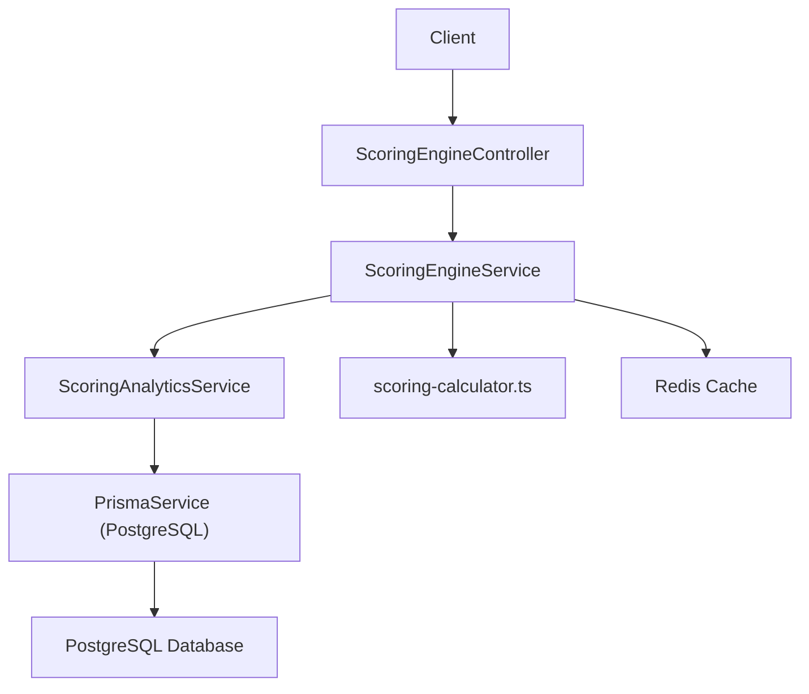
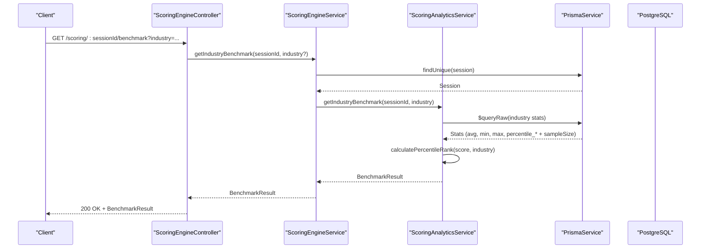
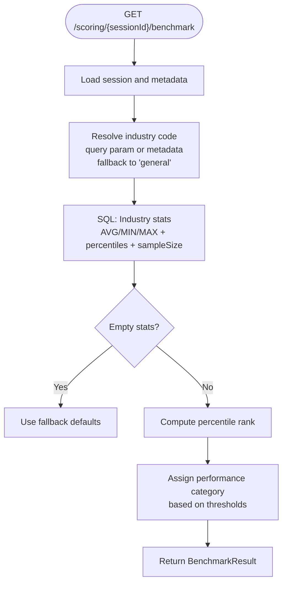
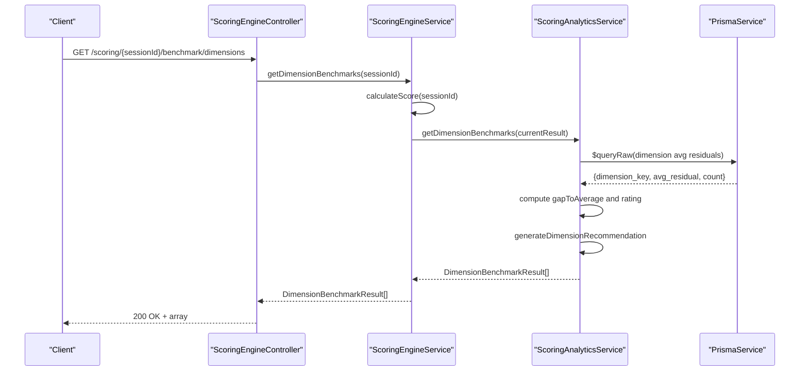
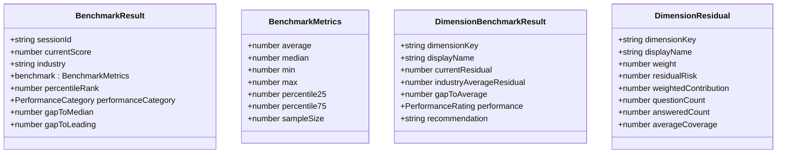
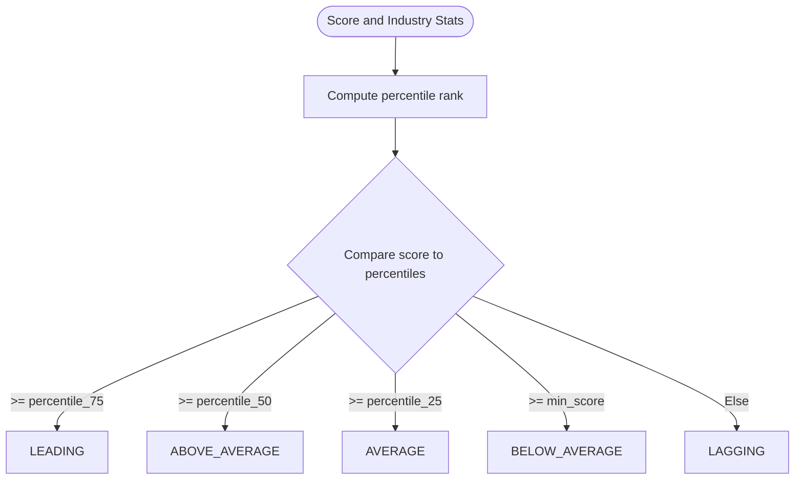
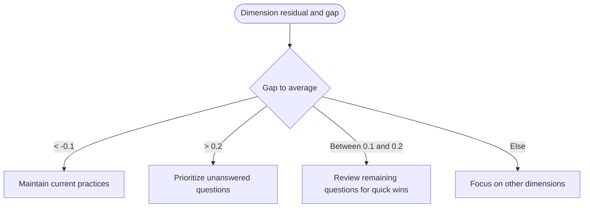
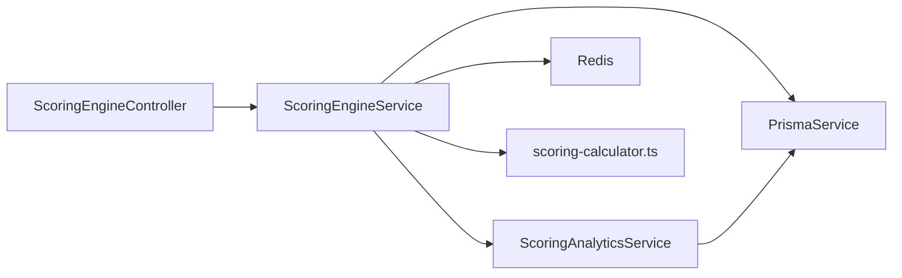

# Benchmark & Comparison API

<cite>
**Referenced Files in This Document**
- [scoring-engine.controller.ts](file://apps/api/src/modules/scoring-engine/scoring-engine.controller.ts)
- [scoring-engine.service.ts](file://apps/api/src/modules/scoring-engine/scoring-engine.service.ts)
- [scoring-analytics.ts](file://apps/api/src/modules/scoring-engine/strategies/scoring-analytics.ts)
- [scoring-calculator.ts](file://apps/api/src/modules/scoring-engine/scoring-calculator.ts)
- [scoring-types.ts](file://apps/api/src/modules/scoring-engine/scoring-types.ts)
- [calculate-score.dto.ts](file://apps/api/src/modules/scoring-engine/dto/calculate-score.dto.ts)
- [schema.prisma](file://prisma/schema.prisma)
</cite>

## Table of Contents
1. [Introduction](#introduction)
2. [Project Structure](#project-structure)
3. [Core Components](#core-components)
4. [Architecture Overview](#architecture-overview)
5. [Detailed Component Analysis](#detailed-component-analysis)
6. [Dependency Analysis](#dependency-analysis)
7. [Performance Considerations](#performance-considerations)
8. [Troubleshooting Guide](#troubleshooting-guide)
9. [Conclusion](#conclusion)

## Introduction
This document provides comprehensive API documentation for Quiz-to-Build’s benchmark and comparison endpoints. It covers:
- Industry benchmark comparison APIs that compare a session’s score against industry averages, percentiles, and performance categories
- Dimension-level benchmark endpoints for per-dimension residual risk comparisons and gap analysis
- Benchmark data structures, percentile ranking calculations, and performance categorization logic
- Industry code parameters, comparison algorithms, and recommendation generation
- Examples of benchmark report generation, gap analysis interpretation, and improvement recommendation systems
- Benchmark data maintenance, industry classification systems, and dynamic benchmark recalibration processes

## Project Structure
The benchmark and comparison functionality is implemented within the Scoring Engine module:
- Controller exposes REST endpoints for benchmark retrieval
- Service orchestrates scoring and delegates analytics
- Analytics service performs SQL-backed benchmark computations
- Calculator provides pure functions for residual risk and recommendations
- DTOs and types define request/response contracts and constants

**Diagram sources**
- [scoring-engine.controller.ts:192-266](file://apps/api/src/modules/scoring-engine/scoring-engine.controller.ts#L192-L266)
- [scoring-engine.service.ts:326-339](file://apps/api/src/modules/scoring-engine/scoring-engine.service.ts#L326-L339)
- [scoring-analytics.ts:1-268](file://apps/api/src/modules/scoring-engine/strategies/scoring-analytics.ts#L1-L268)
- [scoring-calculator.ts:67-130](file://apps/api/src/modules/scoring-engine/scoring-calculator.ts#L67-L130)

**Section sources**
- [scoring-engine.controller.ts:192-266](file://apps/api/src/modules/scoring-engine/scoring-engine.controller.ts#L192-L266)
- [scoring-engine.service.ts:326-339](file://apps/api/src/modules/scoring-engine/scoring-engine.service.ts#L326-L339)

## Core Components
- ScoringEngineController: Exposes GET endpoints for industry benchmark and dimension benchmarks
- ScoringEngineService: Thin orchestrator delegating to analytics and calculator
- ScoringAnalyticsService: Executes SQL queries for industry statistics, percentile rank, and dimension averages
- ScoringCalculator: Pure functions for residual risk, trend analysis, and recommendation generation
- DTOs and Types: Define request/response shapes and constants

Key data structures:
- BenchmarkResult: Industry benchmark metrics and performance category
- DimensionBenchmarkResult: Per-dimension residual risk and recommendations
- DimensionResidual: Per-dimension residual risk breakdown used in dimension benchmarks

**Section sources**
- [scoring-engine.controller.ts:192-266](file://apps/api/src/modules/scoring-engine/scoring-engine.controller.ts#L192-L266)
- [scoring-engine.service.ts:326-339](file://apps/api/src/modules/scoring-engine/scoring-engine.service.ts#L326-L339)
- [scoring-types.ts:80-109](file://apps/api/src/modules/scoring-engine/scoring-types.ts#L80-L109)
- [calculate-score.dto.ts:120-155](file://apps/api/src/modules/scoring-engine/dto/calculate-score.dto.ts#L120-L155)

## Architecture Overview
The benchmark endpoints follow a layered architecture:
- HTTP layer: Controller validates inputs and routes requests
- Application layer: Service calculates or retrieves cached score, then delegates analytics
- Analytics layer: Performs SQL-backed computations for industry statistics and percentile ranks
- Persistence layer: Reads/writes from PostgreSQL via Prisma and caches via Redis

**Diagram sources**
- [scoring-engine.controller.ts:192-231](file://apps/api/src/modules/scoring-engine/scoring-engine.controller.ts#L192-L231)
- [scoring-engine.service.ts:332-334](file://apps/api/src/modules/scoring-engine/scoring-engine.service.ts#L332-L334)
- [scoring-analytics.ts:73-165](file://apps/api/src/modules/scoring-engine/strategies/scoring-analytics.ts#L73-L165)

## Detailed Component Analysis

### Industry Benchmark Endpoint
- Endpoint: GET /scoring/:sessionId/benchmark
- Query parameters:
  - industry (optional): Overrides session industry metadata for comparison
- Behavior:
  - Resolves industry code from query param or session questionnaire metadata (fallback to "general")
  - Computes industry statistics via SQL window functions (AVG, MIN, MAX, PERCENTILE_CONT)
  - Calculates percentile rank using a COUNT-based percentile calculation
  - Assigns performance category based on score thresholds vs percentiles
  - Returns benchmark metrics, percentile rank, performance category, and gap measures

**Diagram sources**
- [scoring-analytics.ts:73-165](file://apps/api/src/modules/scoring-engine/strategies/scoring-analytics.ts#L73-L165)
- [scoring-types.ts:80-98](file://apps/api/src/modules/scoring-engine/scoring-types.ts#L80-L98)

**Section sources**
- [scoring-engine.controller.ts:192-231](file://apps/api/src/modules/scoring-engine/scoring-engine.controller.ts#L192-L231)
- [scoring-analytics.ts:73-165](file://apps/api/src/modules/scoring-engine/strategies/scoring-analytics.ts#L73-L165)
- [scoring-types.ts:80-98](file://apps/api/src/modules/scoring-engine/scoring-types.ts#L80-L98)

### Dimension-Level Benchmark Endpoint
- Endpoint: GET /scoring/:sessionId/benchmark/dimensions
- Behavior:
  - Calculates current readiness score and per-dimension residual risk
  - Queries industry averages for each dimension’s residual risk
  - Computes gap to average and assigns performance rating (ABOVE/AVERAGE/BELOW)
  - Generates improvement recommendations based on gap magnitude

**Diagram sources**
- [scoring-engine.controller.ts:233-266](file://apps/api/src/modules/scoring-engine/scoring-engine.controller.ts#L233-L266)
- [scoring-engine.service.ts:336-339](file://apps/api/src/modules/scoring-engine/scoring-engine.service.ts#L336-L339)
- [scoring-analytics.ts:171-240](file://apps/api/src/modules/scoring-engine/strategies/scoring-analytics.ts#L171-L240)
- [scoring-calculator.ts:189-208](file://apps/api/src/modules/scoring-engine/scoring-calculator.ts#L189-L208)

**Section sources**
- [scoring-engine.controller.ts:233-266](file://apps/api/src/modules/scoring-engine/scoring-engine.controller.ts#L233-L266)
- [scoring-engine.service.ts:336-339](file://apps/api/src/modules/scoring-engine/scoring-engine.service.ts#L336-L339)
- [scoring-analytics.ts:171-240](file://apps/api/src/modules/scoring-engine/strategies/scoring-analytics.ts#L171-L240)
- [scoring-calculator.ts:189-208](file://apps/api/src/modules/scoring-engine/scoring-calculator.ts#L189-L208)

### Data Structures and Types
- BenchmarkResult: Includes session info, industry code, benchmark metrics, percentile rank, performance category, and gap measures
- DimensionBenchmarkResult: Includes dimension keys, current residual, industry average residual, gap to average, performance rating, and recommendation
- DimensionResidual: Used internally for per-dimension residual risk breakdown

**Diagram sources**
- [scoring-types.ts:80-109](file://apps/api/src/modules/scoring-engine/scoring-types.ts#L80-L109)
- [calculate-score.dto.ts:120-155](file://apps/api/src/modules/scoring-engine/dto/calculate-score.dto.ts#L120-L155)

**Section sources**
- [scoring-types.ts:80-109](file://apps/api/src/modules/scoring-engine/scoring-types.ts#L80-L109)
- [calculate-score.dto.ts:120-155](file://apps/api/src/modules/scoring-engine/dto/calculate-score.dto.ts#L120-L155)

### Percentile Ranking and Performance Categorization
- Percentile rank computed using a COUNT-based percentile calculation over industry scores
- Performance category derived from score thresholds relative to industry percentiles:
  - LEADING: score >= percentile_75
  - ABOVE_AVERAGE: score >= percentile_50
  - AVERAGE: score >= percentile_25
  - BELOW_AVERAGE: score >= min_score
  - LAGGING: otherwise

**Diagram sources**
- [scoring-analytics.ts:132-145](file://apps/api/src/modules/scoring-engine/strategies/scoring-analytics.ts#L132-L145)
- [scoring-types.ts:80-98](file://apps/api/src/modules/scoring-engine/scoring-types.ts#L80-L98)

**Section sources**
- [scoring-analytics.ts:132-145](file://apps/api/src/modules/scoring-engine/strategies/scoring-analytics.ts#L132-L145)
- [scoring-types.ts:80-98](file://apps/api/src/modules/scoring-engine/scoring-types.ts#L80-L98)

### Recommendation Generation for Dimension Benchmarks
- Logic thresholds for generating recommendations:
  - Above industry average (gap < -0.1): Maintain current practices
  - Significant gaps (gap > 0.2): Prioritize unanswered questions
  - Slightly below average (gap between 0.1 and 0.2): Review remaining questions for quick wins
  - At average (gap between -0.1 and 0.1): Focus on other dimensions

**Diagram sources**
- [scoring-calculator.ts:189-208](file://apps/api/src/modules/scoring-engine/scoring-calculator.ts#L189-L208)
- [scoring-analytics.ts:221-239](file://apps/api/src/modules/scoring-engine/strategies/scoring-analytics.ts#L221-L239)

**Section sources**
- [scoring-calculator.ts:189-208](file://apps/api/src/modules/scoring-engine/scoring-calculator.ts#L189-L208)
- [scoring-analytics.ts:221-239](file://apps/api/src/modules/scoring-engine/strategies/scoring-analytics.ts#L221-L239)

### Example Workflows

#### Industry Benchmark Report Generation
- Request: GET /scoring/{sessionId}/benchmark?industry=healthcare
- Response fields:
  - Industry average, median, min, max, percentiles, and sample size
  - Percentile rank and performance category
  - Gap to median and gap to leading performers

Interpretation tips:
- Performance category indicates relative standing
- Gap to median quantifies distance from industry median
- Gap to leading indicates room to improve toward top quartile

#### Dimension Benchmark Report and Gap Analysis
- Request: GET /scoring/{sessionId}/benchmark/dimensions
- Response fields per dimension:
  - Current residual risk
  - Industry average residual
  - Gap to average
  - Performance rating
  - Recommendation

Interpretation tips:
- Positive gap indicates below-average residual risk (better than average)
- Negative gap indicates above-average residual risk (needs attention)
- Recommendations guide prioritization of actions

#### Improvement Recommendation System
- For each dimension, recommendation depends on gap magnitude
- Encourages maintaining strong areas, prioritizing high-impact gaps, and reviewing quick wins

**Section sources**
- [scoring-engine.controller.ts:192-266](file://apps/api/src/modules/scoring-engine/scoring-engine.controller.ts#L192-L266)
- [scoring-analytics.ts:171-240](file://apps/api/src/modules/scoring-engine/strategies/scoring-analytics.ts#L171-L240)
- [scoring-calculator.ts:189-208](file://apps/api/src/modules/scoring-engine/scoring-calculator.ts#L189-L208)

### Benchmark Data Maintenance and Dynamic Recalibration
- Industry classification:
  - Determined by query parameter or session questionnaire metadata
  - Falls back to "general" if neither provided
- Dynamic recalibration:
  - Industry statistics recomputed on each request using SQL aggregates
  - Percentile rank recalculated per session score
  - Dimension averages refreshed via SQL aggregation over completed sessions
- Data freshness:
  - Score caching via Redis reduces load; invalidation endpoint available
  - Score snapshots persisted to PostgreSQL for trend analysis

Operational notes:
- Empty or missing industry statistics fall back to safe defaults
- Null percentile rank defaults to 50
- Recommendations adapt automatically to changing benchmark averages

**Section sources**
- [scoring-engine.controller.ts:192-231](file://apps/api/src/modules/scoring-engine/scoring-engine.controller.ts#L192-L231)
- [scoring-engine.service.ts:341-386](file://apps/api/src/modules/scoring-engine/scoring-engine.service.ts#L341-L386)
- [scoring-analytics.ts:73-165](file://apps/api/src/modules/scoring-engine/strategies/scoring-analytics.ts#L73-L165)
- [scoring-analytics.ts:171-266](file://apps/api/src/modules/scoring-engine/strategies/scoring-analytics.ts#L171-L266)

## Dependency Analysis
- Controller depends on ScoringEngineService
- Service depends on ScoringAnalyticsService and Redis/Prisma
- Analytics depends on Prisma for SQL-backed computations
- Calculator is a pure function library used by both Service and Analytics

**Diagram sources**
- [scoring-engine.controller.ts:1-47](file://apps/api/src/modules/scoring-engine/scoring-engine.controller.ts#L1-L47)
- [scoring-engine.service.ts:54-64](file://apps/api/src/modules/scoring-engine/scoring-engine.service.ts#L54-L64)
- [scoring-analytics.ts:17-18](file://apps/api/src/modules/scoring-engine/strategies/scoring-analytics.ts#L17-L18)
- [scoring-calculator.ts:1-15](file://apps/api/src/modules/scoring-engine/scoring-calculator.ts#L1-L15)

**Section sources**
- [scoring-engine.controller.ts:1-47](file://apps/api/src/modules/scoring-engine/scoring-engine.controller.ts#L1-L47)
- [scoring-engine.service.ts:54-64](file://apps/api/src/modules/scoring-engine/scoring-engine.service.ts#L54-L64)
- [scoring-analytics.ts:17-18](file://apps/api/src/modules/scoring-engine/strategies/scoring-analytics.ts#L17-L18)
- [scoring-calculator.ts:1-15](file://apps/api/src/modules/scoring-engine/scoring-calculator.ts#L1-L15)

## Performance Considerations
- Caching: Scores are cached in Redis with a TTL to reduce repeated computation
- Batch processing: Service supports batch score calculation with controlled concurrency
- Indexes: PostgreSQL indexes on sessions and questionnaire metadata support efficient filtering
- Recommendations: Pure functions minimize computational overhead and enable easy unit testing

[No sources needed since this section provides general guidance]

## Troubleshooting Guide
Common issues and resolutions:
- Session not found: Controller throws a 404 when session does not exist
- Empty industry statistics: Defaults applied when SQL returns no rows
- Null percentile rank: Defaults to 50 when missing
- Industry parameter precedence: Query parameter overrides session metadata
- Cache invalidation: Use POST /scoring/{sessionId}/invalidate to force recalculation

**Section sources**
- [scoring-engine.controller.ts:192-231](file://apps/api/src/modules/scoring-engine/scoring-engine.controller.ts#L192-L231)
- [scoring-engine.service.ts:341-386](file://apps/api/src/modules/scoring-engine/scoring-engine.service.ts#L341-L386)
- [scoring-analytics.ts:73-165](file://apps/api/src/modules/scoring-engine/strategies/scoring-analytics.ts#L73-L165)
- [scoring-analytics.ts:242-266](file://apps/api/src/modules/scoring-engine/strategies/scoring-analytics.ts#L242-L266)

## Conclusion
The benchmark and comparison endpoints provide robust, SQL-backed industry comparisons and per-dimension residual risk analysis. They support flexible industry classification, dynamic recalibration, and actionable recommendations. The clean separation between controller, service, analytics, and calculator enables maintainability, testability, and scalability.