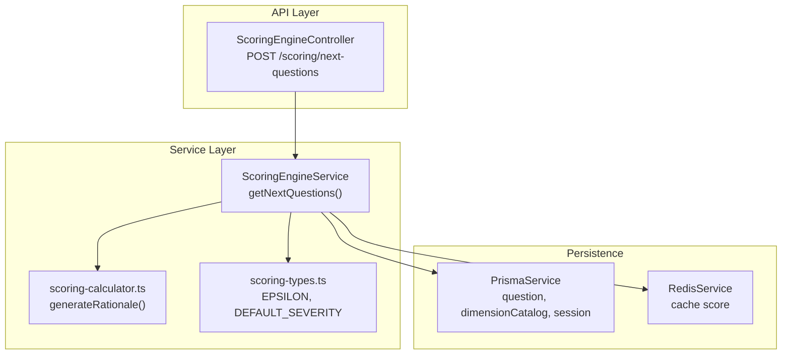
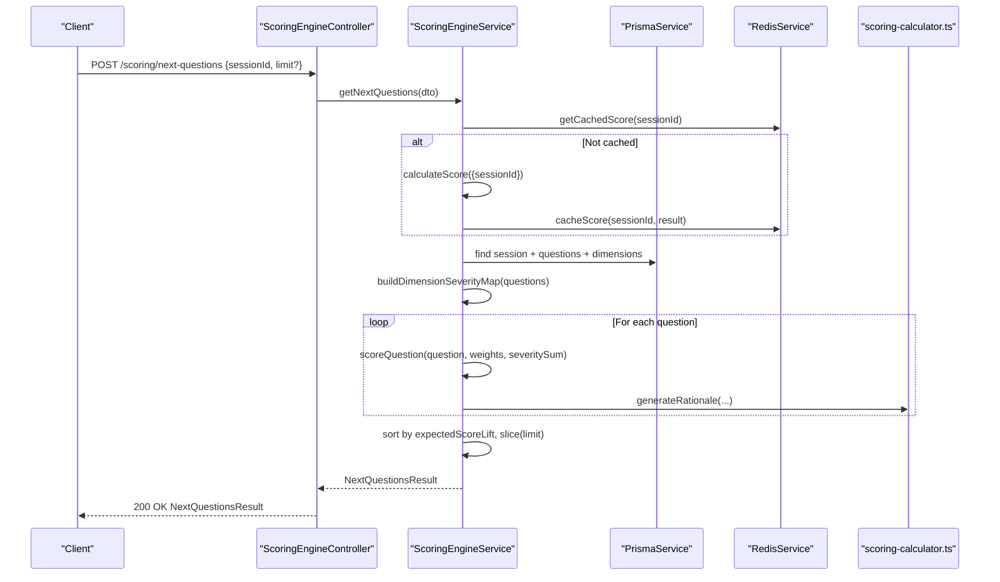
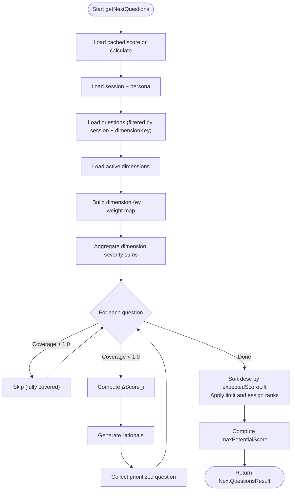
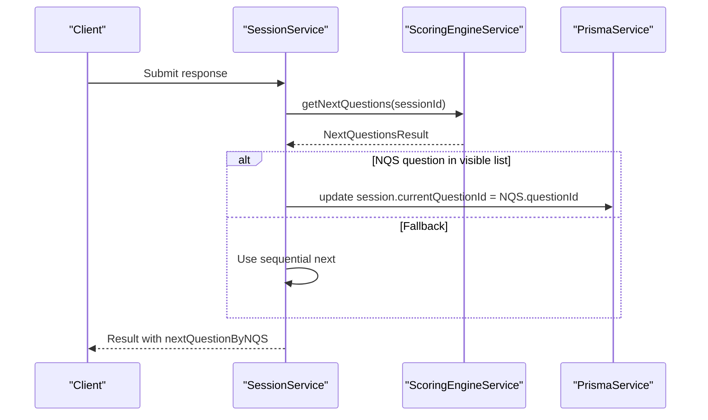
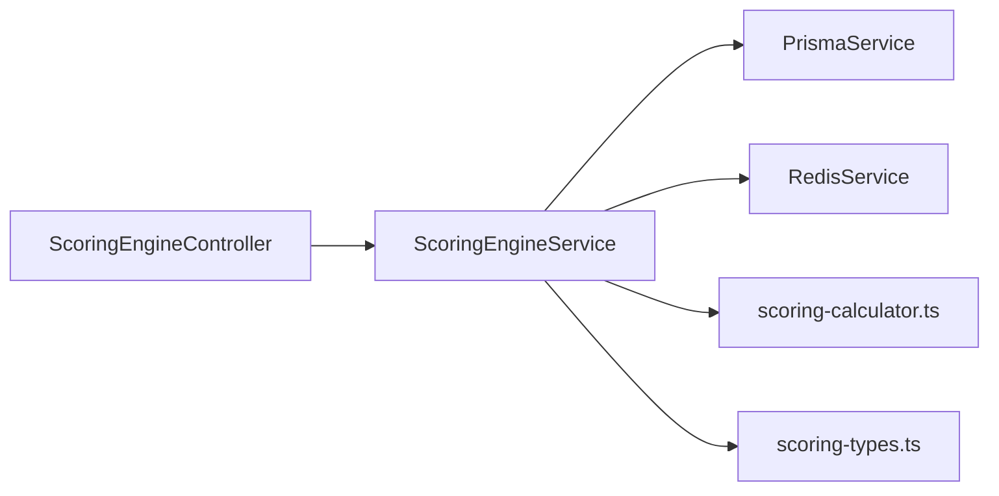

# Next Priority Questions API

<cite>
**Referenced Files in This Document**
- [scoring-engine.controller.ts](file://apps/api/src/modules/scoring-engine/scoring-engine.controller.ts)
- [scoring-engine.service.ts](file://apps/api/src/modules/scoring-engine/scoring-engine.service.ts)
- [calculate-score.dto.ts](file://apps/api/src/modules/scoring-engine/dto/calculate-score.dto.ts)
- [scoring-calculator.ts](file://apps/api/src/modules/scoring-engine/scoring-calculator.ts)
- [scoring-types.ts](file://apps/api/src/modules/scoring-engine/scoring-types.ts)
- [session.service.spec.ts](file://apps/api/src/modules/session/session.service.spec.ts)
- [nqs.ts](file://apps/cli/src/commands/nqs.ts)
- [nqs.test.ts](file://apps/cli/src/__tests__/nqs.test.ts)
- [adaptive-logic.md](file://docs/questionnaire/adaptive-logic.md)
</cite>

## Table of Contents
1. [Introduction](#introduction)
2. [Project Structure](#project-structure)
3. [Core Components](#core-components)
4. [Architecture Overview](#architecture-overview)
5. [Detailed Component Analysis](#detailed-component-analysis)
6. [Dependency Analysis](#dependency-analysis)
7. [Performance Considerations](#performance-considerations)
8. [Troubleshooting Guide](#troubleshooting-guide)
9. [Conclusion](#conclusion)

## Introduction
This document provides comprehensive API documentation for the Next Priority Questions (NQS) algorithm endpoint. It explains the NQS methodology using delta score formulas to rank questions by expected improvement potential, details the NextQuestionsDto request structure and NextQuestionsResult response format, and describes the question prioritization logic. It also covers batch processing, filtering mechanisms, adaptive logic integration, and performance considerations for large question banks and real-time prioritization.

## Project Structure
The NQS endpoint is implemented within the scoring engine module and exposed via a dedicated controller. Supporting components include DTO definitions, calculation utilities, and caching/persistence helpers. The CLI provides a command-line interface to interact with the same endpoint.

**Diagram sources**
- [scoring-engine.controller.ts:90-110](file://apps/api/src/modules/scoring-engine/scoring-engine.controller.ts#L90-L110)
- [scoring-engine.service.ts:170-227](file://apps/api/src/modules/scoring-engine/scoring-engine.service.ts#L170-L227)
- [scoring-calculator.ts:133-147](file://apps/api/src/modules/scoring-engine/scoring-calculator.ts#L133-L147)
- [scoring-types.ts:8-15](file://apps/api/src/modules/scoring-engine/scoring-types.ts#L8-L15)

**Section sources**
- [scoring-engine.controller.ts:42-110](file://apps/api/src/modules/scoring-engine/scoring-engine.controller.ts#L42-L110)
- [scoring-engine.service.ts:54-64](file://apps/api/src/modules/scoring-engine/scoring-engine.service.ts#L54-L64)

## Core Components
- Endpoint: POST /scoring/next-questions
- Request DTO: NextQuestionsDto with sessionId and optional limit
- Response DTO: NextQuestionsResult containing prioritized questions and derived metrics
- Core algorithm: NQS delta score ΔScore_i = 100 × W_d(i) × S_i × (1 - C_i) / (Σ S_j + ε)
- Supporting utilities: coverage mapping, rationale generation, dimension severity aggregation

**Section sources**
- [scoring-engine.controller.ts:90-110](file://apps/api/src/modules/scoring-engine/scoring-engine.controller.ts#L90-L110)
- [calculate-score.dto.ts:207-297](file://apps/api/src/modules/scoring-engine/dto/calculate-score.dto.ts#L207-L297)
- [scoring-engine.service.ts:166-227](file://apps/api/src/modules/scoring-engine/scoring-engine.service.ts#L166-L227)
- [scoring-calculator.ts:133-147](file://apps/api/src/modules/scoring-engine/scoring-calculator.ts#L133-L147)

## Architecture Overview
The NQS endpoint orchestrates retrieval of session context, question data, and dimension weights, computes per-question delta scores, sorts by expected improvement, and returns a ranked list with rationale and potential score projection.

**Diagram sources**
- [scoring-engine.controller.ts:90-110](file://apps/api/src/modules/scoring-engine/scoring-engine.controller.ts#L90-L110)
- [scoring-engine.service.ts:170-227](file://apps/api/src/modules/scoring-engine/scoring-engine.service.ts#L170-L227)
- [scoring-calculator.ts:133-147](file://apps/api/src/modules/scoring-engine/scoring-calculator.ts#L133-L147)

## Detailed Component Analysis

### Endpoint Definition and Behavior
- Method: POST
- Path: /scoring/next-questions
- Authentication: JWT bearer (ApiBearerAuth)
- Validation: NextQuestionsDto
- Response: NextQuestionsResult

Behavior highlights:
- Retrieves cached score for sessionId or calculates if missing
- Filters questions by session membership, presence of dimensionKey, and optional persona
- Builds dimension weight map and severity sums
- Computes ΔScore_i per question and excludes fully covered questions (C_i ≥ 1.0)
- Sorts by expectedScoreLift descending and applies limit
- Returns maxPotentialScore as currentScore plus sum of top lifts

**Section sources**
- [scoring-engine.controller.ts:90-110](file://apps/api/src/modules/scoring-engine/scoring-engine.controller.ts#L90-L110)
- [scoring-engine.service.ts:170-227](file://apps/api/src/modules/scoring-engine/scoring-engine.service.ts#L170-L227)

### Request DTO: NextQuestionsDto
- sessionId: UUID of the assessment session
- limit: Optional integer (default 5, min 1, max 20) controlling number of returned questions

Validation ensures sessionId is a UUID and limit is within bounds.

**Section sources**
- [calculate-score.dto.ts:207-222](file://apps/api/src/modules/scoring-engine/dto/calculate-score.dto.ts#L207-L222)

### Response DTO: NextQuestionsResult
- sessionId: Input session identifier
- currentScore: Score at time of calculation
- questions: Array of PrioritizedQuestion sorted by expectedScoreLift
- maxPotentialScore: Rounded sum of currentScore and total expected lifts from top questions

Each PrioritizedQuestion includes:
- questionId, text, dimensionKey, dimensionName
- severity, currentCoverage, currentCoverageLevel
- expectedScoreLift (rounded to two decimals)
- rationale (human-readable explanation)
- rank (1-based)

**Section sources**
- [calculate-score.dto.ts:277-297](file://apps/api/src/modules/scoring-engine/dto/calculate-score.dto.ts#L277-L297)
- [calculate-score.dto.ts:224-275](file://apps/api/src/modules/scoring-engine/dto/calculate-score.dto.ts#L224-L275)

### NQS Algorithm Details
- Formula: ΔScore_i = 100 × W_d(i) × S_i × (1 - C_i) / (Σ S_j + ε)
- W_d(i): Weight of the dimension containing question i
- S_i: Severity of question i (default 0.7 if unspecified)
- C_i: Current coverage of question i (0..1)
- Σ S_j: Sum of severities within the same dimension as i
- ε: Small constant (1e-10) to prevent division by zero

Processing steps:
1. Load session and filter questions by session membership and dimensionKey
2. Load active dimensions and build dimensionKey → weight map
3. Aggregate dimension severity sums across questions
4. For each question:
   - Skip if currentCoverage ≥ 1.0
   - Compute deltaScore using formula
   - Generate rationale text
   - Attach coverage level mapping
5. Sort descending by expectedScoreLift, apply limit, assign ranks
6. Compute maxPotentialScore as currentScore plus sum of selected lifts

**Diagram sources**
- [scoring-engine.service.ts:170-227](file://apps/api/src/modules/scoring-engine/scoring-engine.service.ts#L170-L227)
- [scoring-engine.service.ts:229-274](file://apps/api/src/modules/scoring-engine/scoring-engine.service.ts#L229-L274)
- [scoring-calculator.ts:133-147](file://apps/api/src/modules/scoring-engine/scoring-calculator.ts#L133-L147)
- [scoring-types.ts:8-12](file://apps/api/src/modules/scoring-engine/scoring-types.ts#L8-L12)

**Section sources**
- [scoring-engine.service.ts:166-227](file://apps/api/src/modules/scoring-engine/scoring-engine.service.ts#L166-L227)
- [scoring-engine.service.ts:229-274](file://apps/api/src/modules/scoring-engine/scoring-engine.service.ts#L229-L274)
- [scoring-calculator.ts:133-147](file://apps/api/src/modules/scoring-engine/scoring-calculator.ts#L133-L147)
- [scoring-types.ts:8-12](file://apps/api/src/modules/scoring-engine/scoring-types.ts#L8-L12)

### Filtering Mechanisms
- Session membership: Questions must belong to sections linked to the given sessionId
- Dimension requirement: Only questions with dimensionKey not null are considered
- Persona filter: If session has persona set, questions are further filtered by matching persona
- Coverage exclusion: Fully covered questions (C_i = 1.0) are excluded from results

These filters ensure relevance and feasibility of recommendations.

**Section sources**
- [scoring-engine.service.ts:183-194](file://apps/api/src/modules/scoring-engine/scoring-engine.service.ts#L183-L194)

### Recommendation Engines and Rationale
- Rationale generation: Human-readable explanation indicating potential score gain and current coverage state
- Example scenarios:
  - Zero coverage: "Answering this [Dimension] question could improve your score by up to X.X points. This question has no coverage yet."
  - Partial coverage: "Improving coverage on this [Dimension] question from Y% to 100% could add X.X points to your readiness score."

This helps users understand the reasoning behind prioritization.

**Section sources**
- [scoring-calculator.ts:133-147](file://apps/api/src/modules/scoring-engine/scoring-calculator.ts#L133-L147)

### Batch Processing Capabilities
- Batch score calculation: calculateBatchScores supports controlled concurrency (batch size 5) across multiple sessions
- Typical usage: Calculate readiness scores for multiple sessions in parallel, handling failures per session
- Note: The NQS endpoint itself operates per-session; batch mode is available for score calculations

**Section sources**
- [scoring-engine.service.ts:300-324](file://apps/api/src/modules/scoring-engine/scoring-engine.service.ts#L300-L324)

### Adaptive Logic Integration
- Visibility and persona filters: The NQS endpoint respects session persona to narrow visible questions
- Adaptive rules: The broader adaptive logic engine governs visibility/requirement/skip rules; NQS complements this by selecting the highest-impact remaining questions
- Interaction: After submitting a response, the system may update currentQuestionId to the NQS suggestion, falling back to sequential ordering if the NQS question is not currently visible

**Diagram sources**
- [session.service.spec.ts:1169-1207](file://apps/api/src/modules/session/session.service.spec.ts#L1169-L1207)
- [scoring-engine.service.ts:170-227](file://apps/api/src/modules/scoring-engine/scoring-engine.service.ts#L170-L227)

**Section sources**
- [session.service.spec.ts:1169-1207](file://apps/api/src/modules/session/session.service.spec.ts#L1169-L1207)
- [adaptive-logic.md:1-1158](file://docs/questionnaire/adaptive-logic.md#L1-L1158)

### Examples of Priority Question Ranking
- Scenario: Multiple questions in the same dimension with varying severities and coverages
- Outcome: Higher severity or lower coverage questions receive higher expectedScoreLift values
- Ranking: Descending by expectedScoreLift; ties may be resolved by implementation-specific criteria

Validation evidence:
- Tests confirm that fully covered questions are excluded
- Tests confirm correct ranking assignment
- Tests confirm rationale generation for each question

**Section sources**
- [scoring-engine.service.ts:357-387](file://apps/api/src/modules/scoring-engine/scoring-engine.service.ts#L357-L387)
- [scoring-engine.service.spec.ts:353-398](file://apps/api/src/modules/scoring-engine/scoring-engine.service.spec.ts#L353-L398)

### CLI Integration
- Command: nqs
- Options:
  - -n, --count <number>: Number of suggestions (default 5)
  - -d, --dimension <key>: Filter by dimension
  - -p, --persona <type>: Filter by persona
  - -j, --json: Output as JSON
- Behavior: Calls the API endpoint and prints formatted suggestions or JSON

**Section sources**
- [nqs.ts:13-96](file://apps/cli/src/commands/nqs.ts#L13-L96)
- [nqs.test.ts:111-195](file://apps/cli/src/__tests__/nqs.test.ts#L111-L195)

## Dependency Analysis
The NQS endpoint depends on:
- ScoringEngineController for routing and Swagger metadata
- ScoringEngineService for orchestration, persistence, caching, and computation
- PrismaService for database queries (questions, dimensions, sessions)
- RedisService for caching readiness scores
- scoring-calculator.ts for rationale generation and coverage mapping
- scoring-types.ts for constants and coverage level conversions

**Diagram sources**
- [scoring-engine.controller.ts:46-47](file://apps/api/src/modules/scoring-engine/scoring-engine.controller.ts#L46-L47)
- [scoring-engine.service.ts:59-64](file://apps/api/src/modules/scoring-engine/scoring-engine.service.ts#L59-L64)

**Section sources**
- [scoring-engine.controller.ts:46-47](file://apps/api/src/modules/scoring-engine/scoring-engine.controller.ts#L46-L47)
- [scoring-engine.service.ts:59-64](file://apps/api/src/modules/scoring-engine/scoring-engine.service.ts#L59-L64)

## Performance Considerations
- Caching: Scores are cached in Redis with a TTL; the NQS endpoint attempts to reuse cached results before recalculating
- Concurrency: Batch score calculation uses controlled concurrency (batch size 5) to avoid overload
- Query limits: Queries fetch up to 10,000 questions and dimensions; ensure appropriate indexing and filtering to minimize load
- Sorting cost: Sorting O(n log n) over the number of candidate questions; limit via the limit parameter
- Real-time prioritization: For very large question banks, consider precomputing dimension-level aggregates or using indexed views to accelerate severity sum computations

[No sources needed since this section provides general guidance]

## Troubleshooting Guide
Common issues and resolutions:
- Session not found: Ensure sessionId is valid and corresponds to an existing session
- Empty results: Fully covered questions are excluded; verify persona and dimension filters
- Cache invalidation: Use the invalidate endpoint to force recalculation if stale data is suspected
- Performance degradation: Monitor Redis connectivity and Prisma query performance; adjust limit and consider reducing question scope

**Section sources**
- [scoring-engine.controller.ts:140-157](file://apps/api/src/modules/scoring-engine/scoring-engine.controller.ts#L140-L157)
- [scoring-engine.service.ts:290-298](file://apps/api/src/modules/scoring-engine/scoring-engine.service.ts#L290-L298)

## Conclusion
The Next Priority Questions API leverages a precise delta-score formula to rank questions by expected improvement potential, integrating dimension weights, question severity, and current coverage. Its design emphasizes caching, controlled concurrency, and clear rationale generation to support efficient, real-time prioritization. The endpoint’s filtering and adaptive logic integration ensure recommendations remain contextually relevant and actionable.