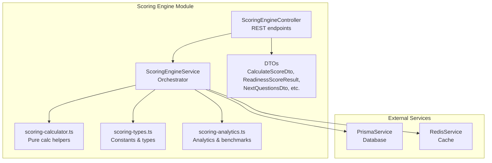
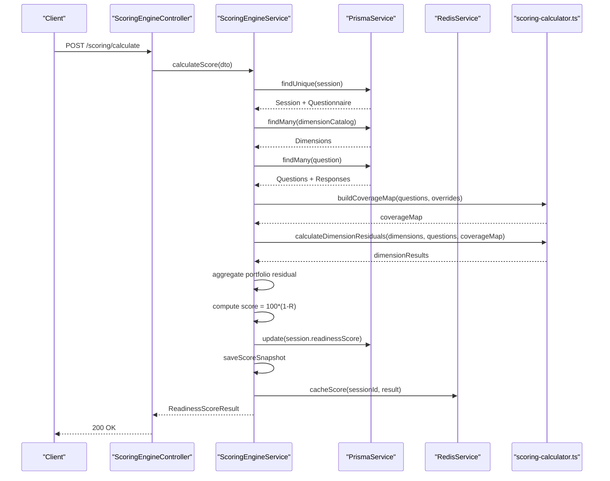
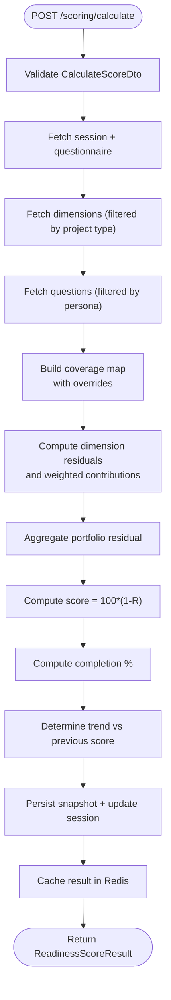
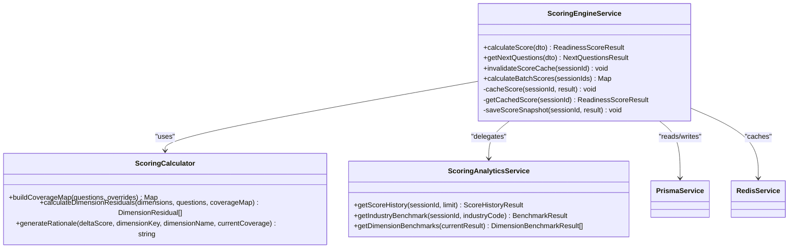
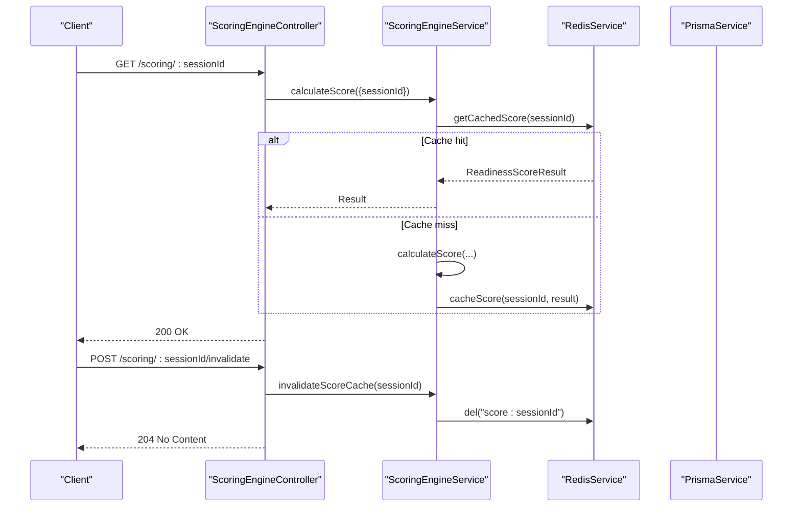
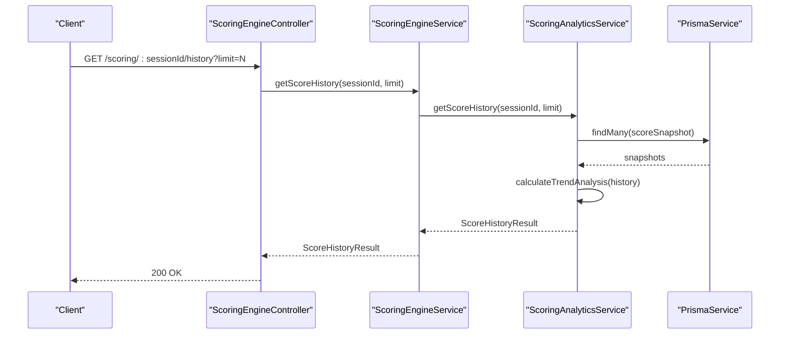
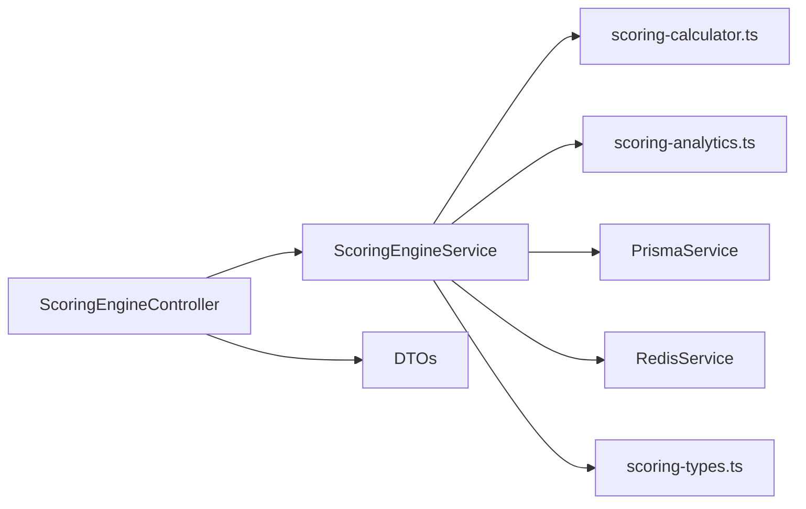

# Readiness Scoring API

<cite>
**Referenced Files in This Document**
- [scoring-engine.controller.ts](file://apps/api/src/modules/scoring-engine/scoring-engine.controller.ts)
- [scoring-engine.service.ts](file://apps/api/src/modules/scoring-engine/scoring-engine.service.ts)
- [scoring-calculator.ts](file://apps/api/src/modules/scoring-engine/scoring-calculator.ts)
- [scoring-types.ts](file://apps/api/src/modules/scoring-engine/scoring-types.ts)
- [scoring-analytics.ts](file://apps/api/src/modules/scoring-engine/strategies/scoring-analytics.ts)
- [calculate-score.dto.ts](file://apps/api/src/modules/scoring-engine/dto/calculate-score.dto.ts)
- [scoring-engine.module.ts](file://apps/api/src/modules/scoring-engine/scoring-engine.module.ts)
- [scoring-engine.service.spec.ts](file://apps/api/src/modules/scoring-engine/scoring-engine.service.spec.ts)
</cite>

## Table of Contents
1. [Introduction](#introduction)
2. [Project Structure](#project-structure)
3. [Core Components](#core-components)
4. [Architecture Overview](#architecture-overview)
5. [Detailed Component Analysis](#detailed-component-analysis)
6. [Dependency Analysis](#dependency-analysis)
7. [Performance Considerations](#performance-considerations)
8. [Troubleshooting Guide](#troubleshooting-guide)
9. [Conclusion](#conclusion)

## Introduction
This document provides comprehensive API documentation for Quiz-to-Build's readiness scoring endpoints. It focuses on the calculate readiness score endpoint, detailing the mathematical formulas, implementation logic, request/response schemas, caching and performance strategies, and scoring analytics. The scoring engine implements a risk-weighted portfolio model that computes dimension residual risks, aggregates them into a portfolio residual, and derives a final readiness score.

## Project Structure
The readiness scoring functionality is implemented within the Scoring Engine module, which exposes REST endpoints and encapsulates calculation logic, caching, and analytics.

**Diagram sources**
- [scoring-engine.controller.ts:42-47](file://apps/api/src/modules/scoring-engine/scoring-engine.controller.ts#L42-L47)
- [scoring-engine.service.ts:54-64](file://apps/api/src/modules/scoring-engine/scoring-engine.service.ts#L54-L64)
- [scoring-calculator.ts:1-20](file://apps/api/src/modules/scoring-engine/scoring-calculator.ts#L1-L20)
- [scoring-types.ts:1-20](file://apps/api/src/modules/scoring-engine/scoring-types.ts#L1-L20)
- [scoring-analytics.ts:1-20](file://apps/api/src/modules/scoring-engine/strategies/scoring-analytics.ts#L1-L20)
- [calculate-score.dto.ts:1-30](file://apps/api/src/modules/scoring-engine/dto/calculate-score.dto.ts#L1-L30)
- [scoring-engine.module.ts:16-21](file://apps/api/src/modules/scoring-engine/scoring-engine.module.ts#L16-L21)

**Section sources**
- [scoring-engine.module.ts:1-23](file://apps/api/src/modules/scoring-engine/scoring-engine.module.ts#L1-L23)

## Core Components
- ScoringEngineController: Exposes REST endpoints for calculating readiness scores, retrieving next priority questions, getting cached scores, invalidating cache, and accessing analytics.
- ScoringEngineService: Orchestrates data fetching, calculation, caching, persistence, and analytics delegation.
- scoring-calculator.ts: Pure calculation helpers for building coverage maps, computing dimension residuals, and generating rationales.
- scoring-types.ts: Constants (EPSILON, DEFAULT_SEVERITY, SCORE_CACHE_TTL), coverage level mappings, and shared interfaces.
- scoring-analytics.ts: Analytics provider for score history, trend analysis, industry benchmarks, and dimension benchmarks.
- DTOs: Strongly typed request/response schemas for scoring operations.

**Section sources**
- [scoring-engine.controller.ts:42-47](file://apps/api/src/modules/scoring-engine/scoring-engine.controller.ts#L42-L47)
- [scoring-engine.service.ts:54-64](file://apps/api/src/modules/scoring-engine/scoring-engine.service.ts#L54-L64)
- [scoring-calculator.ts:1-20](file://apps/api/src/modules/scoring-engine/scoring-calculator.ts#L1-L20)
- [scoring-types.ts:1-20](file://apps/api/src/modules/scoring-engine/scoring-types.ts#L1-L20)
- [scoring-analytics.ts:1-20](file://apps/api/src/modules/scoring-engine/strategies/scoring-analytics.ts#L1-L20)
- [calculate-score.dto.ts:101-204](file://apps/api/src/modules/scoring-engine/dto/calculate-score.dto.ts#L101-L204)

## Architecture Overview
The calculate readiness score endpoint follows a layered architecture:
- Controller validates and forwards requests to the service.
- Service fetches session, questionnaire, dimensions, and questions; builds coverage map; computes dimension residuals; aggregates portfolio residual; derives score; persists snapshot; caches result; and determines trend.
- Calculator performs pure computations without external dependencies.
- Analytics service provides historical trends and benchmarks.
- Redis cache stores recent results; Prisma persists snapshots and updates session scores.

**Diagram sources**
- [scoring-engine.controller.ts:80-82](file://apps/api/src/modules/scoring-engine/scoring-engine.controller.ts#L80-L82)
- [scoring-engine.service.ts:70-164](file://apps/api/src/modules/scoring-engine/scoring-engine.service.ts#L70-L164)
- [scoring-calculator.ts:24-61](file://apps/api/src/modules/scoring-engine/scoring-calculator.ts#L24-L61)
- [scoring-calculator.ts:67-130](file://apps/api/src/modules/scoring-engine/scoring-calculator.ts#L67-L130)

## Detailed Component Analysis

### Calculate Readiness Score Endpoint
- Endpoint: POST /scoring/calculate
- Description: Calculates the risk-weighted readiness score using Quiz2Biz formulas and returns per-dimension breakdown and trend.
- Authentication: Requires JWT bearer token.
- Request body: CalculateScoreDto
- Response: ReadinessScoreResult

Mathematical Formulas
- Coverage: C_i ∈ [0,1] per question
- Dimension Residual: R_d = Σ(S_i × (1 - C_i)) / (Σ S_i + ε)
- Portfolio Residual: R = Σ(W_d × R_d)
- Readiness Score: Score = 100 × (1 - R)

Real-time Calculation Flow
- Fetch session and questionnaire; load dimensions and questions filtered by persona and project type.
- Build coverage map preferring discrete coverageLevel over continuous coverage; apply optional overrides.
- Compute dimension residuals and weighted contributions; sum to portfolio residual.
- Derive score clamped to [0, 100]; compute completion percentage; determine trend vs previous score; persist snapshot and cache result.

**Diagram sources**
- [scoring-engine.controller.ts:55-82](file://apps/api/src/modules/scoring-engine/scoring-engine.controller.ts#L55-L82)
- [scoring-engine.service.ts:70-164](file://apps/api/src/modules/scoring-engine/scoring-engine.service.ts#L70-L164)
- [scoring-calculator.ts:24-61](file://apps/api/src/modules/scoring-engine/scoring-calculator.ts#L24-L61)
- [scoring-calculator.ts:67-130](file://apps/api/src/modules/scoring-engine/scoring-calculator.ts#L67-L130)

**Section sources**
- [scoring-engine.controller.ts:55-82](file://apps/api/src/modules/scoring-engine/scoring-engine.controller.ts#L55-L82)
- [scoring-engine.service.ts:70-164](file://apps/api/src/modules/scoring-engine/scoring-engine.service.ts#L70-L164)
- [scoring-calculator.ts:67-130](file://apps/api/src/modules/scoring-engine/scoring-calculator.ts#L67-L130)

### Request/Response Schemas

CalculateScoreDto
- sessionId: UUID v4
- coverageOverrides: Optional array of QuestionCoverageInput
  - questionId: UUID v4
  - coverageLevel: Enum NONE, PARTIAL, HALF, SUBSTANTIAL, FULL (preferred)
  - coverage: Number in [0, 1] (alternative to coverageLevel; normalized to nearest discrete level)

ReadinessScoreResult
- sessionId: UUID v4
- score: Number in [0, 100]
- portfolioResidual: Number in [0, 1]
- dimensions: Array of DimensionResidual
  - dimensionKey: String
  - displayName: String
  - weight: Number
  - residualRisk: Number in [0, 1]
  - weightedContribution: Number
  - questionCount: Integer
  - answeredCount: Integer
  - averageCoverage: Number
- totalQuestions: Integer
- answeredQuestions: Integer
- completionPercentage: Number in [0, 100]
- calculatedAt: ISO date-time
- trend: Enum 'UP', 'DOWN', 'STABLE', 'FIRST'

NextQuestionsDto
- sessionId: UUID v4
- limit: Optional integer (default 5, min 1, max 20)

NextQuestionsResult
- sessionId: UUID v4
- currentScore: Number in [0, 100]
- questions: Array of PrioritizedQuestion
  - questionId: UUID v4
  - text: String
  - dimensionKey: String
  - dimensionName: String
  - severity: Number in [0, 1]
  - currentCoverage: Number in [0, 1]
  - currentCoverageLevel: Enum NONE, PARTIAL, HALF, SUBSTANTIAL, FULL
  - expectedScoreLift: Number
  - rationale: String
  - rank: Integer
- maxPotentialScore: Number in [0, 100]

**Section sources**
- [calculate-score.dto.ts:101-204](file://apps/api/src/modules/scoring-engine/dto/calculate-score.dto.ts#L101-L204)
- [calculate-score.dto.ts:209-298](file://apps/api/src/modules/scoring-engine/dto/calculate-score.dto.ts#L209-L298)

### Scoring Algorithm Implementation Details
- Coverage normalization: Discrete coverageLevel takes precedence; numeric coverage is normalized to the nearest discrete level.
- Dimension residual computation: Uses severity-weighted average of (1 - C_i) normalized by total severity plus epsilon.
- Portfolio residual aggregation: Weighted sum of dimension residuals.
- Final score: 100 × (1 - R), clamped to [0, 100].
- Trend determination: Compared to previous score with thresholds for UP/DOWN/STABLE; FIRST for initial calculation.
- NQS prioritization: ΔScore_i = 100 × W_d(i) × S_i × (1 - C_i) / (Σ S_j + ε), with human-readable rationale.

**Diagram sources**
- [scoring-engine.service.ts:54-64](file://apps/api/src/modules/scoring-engine/scoring-engine.service.ts#L54-L64)
- [scoring-calculator.ts:1-20](file://apps/api/src/modules/scoring-engine/scoring-calculator.ts#L1-L20)
- [scoring-analytics.ts:17-18](file://apps/api/src/modules/scoring-engine/strategies/scoring-analytics.ts#L17-L18)

**Section sources**
- [scoring-engine.service.ts:70-164](file://apps/api/src/modules/scoring-engine/scoring-engine.service.ts#L70-L164)
- [scoring-calculator.ts:24-130](file://apps/api/src/modules/scoring-engine/scoring-calculator.ts#L24-L130)
- [scoring-types.ts:8-16](file://apps/api/src/modules/scoring-engine/scoring-types.ts#L8-L16)

### Real-time Scoring, Caching, and Persistence
- Real-time calculation: Endpoint calculates on demand; cached results are served when available.
- Cache invalidation: POST /scoring/:sessionId/invalidate removes cached score.
- Persistence: Score snapshots saved to database; session updated with latest score and timestamp.
- Batch processing: Controlled concurrency batch calculation supported.

**Diagram sources**
- [scoring-engine.controller.ts:115-135](file://apps/api/src/modules/scoring-engine/scoring-engine.controller.ts#L115-L135)
- [scoring-engine.controller.ts:140-157](file://apps/api/src/modules/scoring-engine/scoring-engine.controller.ts#L140-L157)
- [scoring-engine.service.ts:352-363](file://apps/api/src/modules/scoring-engine/scoring-engine.service.ts#L352-L363)
- [scoring-engine.service.ts:290-298](file://apps/api/src/modules/scoring-engine/scoring-engine.service.ts#L290-L298)
- [scoring-engine.service.ts:343-350](file://apps/api/src/modules/scoring-engine/scoring-engine.service.ts#L343-L350)

**Section sources**
- [scoring-engine.controller.ts:115-157](file://apps/api/src/modules/scoring-engine/scoring-engine.controller.ts#L115-L157)
- [scoring-engine.service.ts:290-363](file://apps/api/src/modules/scoring-engine/scoring-engine.service.ts#L290-L363)
- [scoring-types.ts:14-16](file://apps/api/src/modules/scoring-engine/scoring-types.ts#L14-L16)

### Scoring Analytics and Benchmarks
- Score history: Retrieves historical snapshots and computes trend analysis (direction, average change, volatility, projected score).
- Industry benchmark: Compares current score to industry statistics (average, median, percentiles, sample size) and assigns performance category.
- Dimension benchmarks: Compares each dimension's residual risk to industry averages and generates improvement recommendations.

**Diagram sources**
- [scoring-engine.controller.ts:162-190](file://apps/api/src/modules/scoring-engine/scoring-engine.controller.ts#L162-L190)
- [scoring-engine.service.ts:328-330](file://apps/api/src/modules/scoring-engine/scoring-engine.service.ts#L328-L330)
- [scoring-analytics.ts:24-67](file://apps/api/src/modules/scoring-engine/strategies/scoring-analytics.ts#L24-L67)

**Section sources**
- [scoring-engine.controller.ts:162-231](file://apps/api/src/modules/scoring-engine/scoring-engine.controller.ts#L162-L231)
- [scoring-engine.service.ts:328-339](file://apps/api/src/modules/scoring-engine/scoring-engine.service.ts#L328-L339)
- [scoring-analytics.ts:24-266](file://apps/api/src/modules/scoring-engine/strategies/scoring-analytics.ts#L24-L266)

### Examples and Interpretation

Scoring Result Breakdown Example
- Portfolio residual: 0.215
- Score: 78.5
- Dimensions:
  - Architecture & Security: residualRisk 0.234, weightedContribution 0.0351
  - DevOps & Infrastructure: residualRisk 0.150, weightedContribution 0.0180
  - Quality & Testing: residualRisk 0.100, weightedContribution 0.0100
- Completion: 80% (40/50 answered)
- Trend: UP (compared to previous score)

Dimension Contributions
- Each dimension contributes W_d × R_d to portfolio residual.
- Higher residualRisk or higher weight increases portfolio residual and lowers score.

Score Trend Analysis
- Trend determined by comparison to previous score with thresholds.
- History endpoint enables trend analysis and projection.

Validation and Accuracy
- Unit tests verify formula correctness and trend behavior.
- Coverage overrides validated and applied during calculation.
- DTO validation ensures request integrity.

**Section sources**
- [scoring-engine.controller.ts:62-68](file://apps/api/src/modules/scoring-engine/scoring-engine.controller.ts#L62-L68)
- [scoring-engine.service.spec.ts:255-291](file://apps/api/src/modules/scoring-engine/scoring-engine.service.spec.ts#L255-L291)
- [calculate-score.dto.ts:175-204](file://apps/api/src/modules/scoring-engine/dto/calculate-score.dto.ts#L175-L204)

## Dependency Analysis
The module exhibits clear separation of concerns:
- Controller depends on Service and DTOs.
- Service depends on Calculator, Analytics, Prisma, Redis, and Types.
- Calculator and Analytics are stateless and pure.
- External dependencies are isolated via Prisma and Redis services.

**Diagram sources**
- [scoring-engine.controller.ts:21-32](file://apps/api/src/modules/scoring-engine/scoring-engine.controller.ts#L21-L32)
- [scoring-engine.service.ts:38-52](file://apps/api/src/modules/scoring-engine/scoring-engine.service.ts#L38-L52)
- [scoring-engine.module.ts:16-21](file://apps/api/src/modules/scoring-engine/scoring-engine.module.ts#L16-L21)

**Section sources**
- [scoring-engine.module.ts:16-21](file://apps/api/src/modules/scoring-engine/scoring-engine.module.ts#L16-L21)
- [scoring-engine.service.ts:38-52](file://apps/api/src/modules/scoring-engine/scoring-engine.service.ts#L38-L52)

## Performance Considerations
- Caching: Results cached with TTL to reduce repeated calculations.
- Redis cache: Used for fast retrieval of recent scores.
- Batch processing: Controlled concurrency batch calculation for multiple sessions.
- Epsilon: Prevents division by zero in residual calculations.
- Database limits: Queries constrained with take(10000) to avoid excessive loads.
- Precision: Rounded results to appropriate decimals for stability and readability.

[No sources needed since this section provides general guidance]

## Troubleshooting Guide
Common issues and resolutions:
- Session not found: Throws NotFoundException when session does not exist.
- Cache retrieval failures: Logging and graceful fallback to recalculation.
- Cache invalidation failures: Warning logged if Redis deletion fails.
- Calculation errors: Errors caught and logged during batch processing; individual failures do not fail the entire batch.

**Section sources**
- [scoring-engine.service.ts:79-81](file://apps/api/src/modules/scoring-engine/scoring-engine.service.ts#L79-L81)
- [scoring-engine.service.ts:295-297](file://apps/api/src/modules/scoring-engine/scoring-engine.service.ts#L295-L297)
- [scoring-engine.service.ts:359-361](file://apps/api/src/modules/scoring-engine/scoring-engine.service.ts#L359-L361)
- [scoring-engine.service.ts:309-312](file://apps/api/src/modules/scoring-engine/scoring-engine.service.ts#L309-L312)

## Conclusion
The readiness scoring API implements a robust, mathematically sound risk-weighted model with clear formulas, strong typing, caching, and analytics. The endpoint provides actionable insights through per-dimension breakdowns, trend analysis, and benchmark comparisons, enabling users to understand their current state and prioritize improvements effectively.