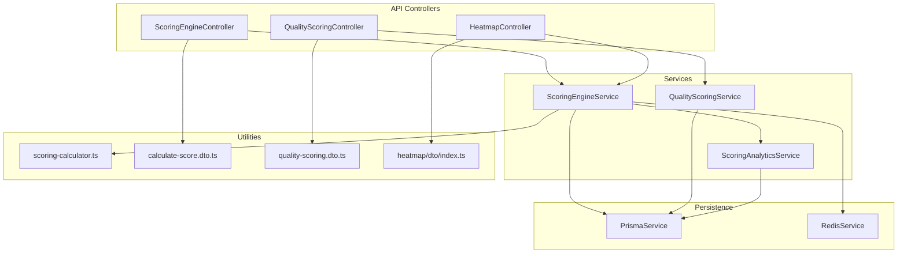
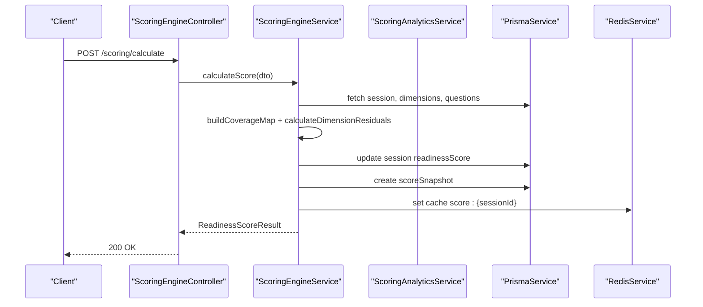
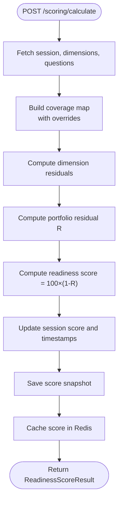
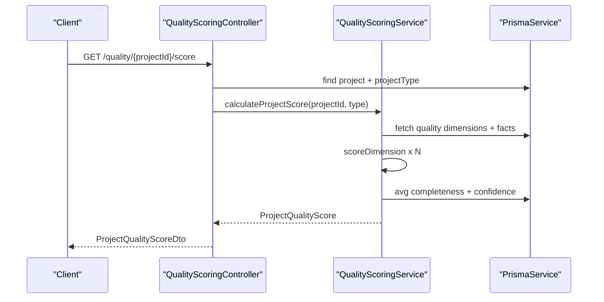
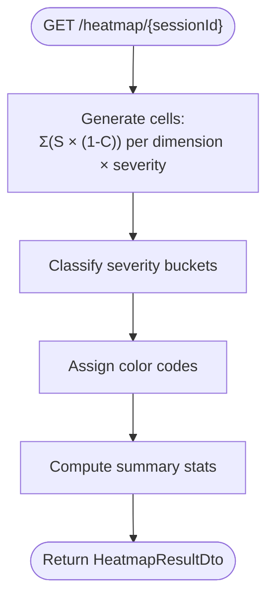
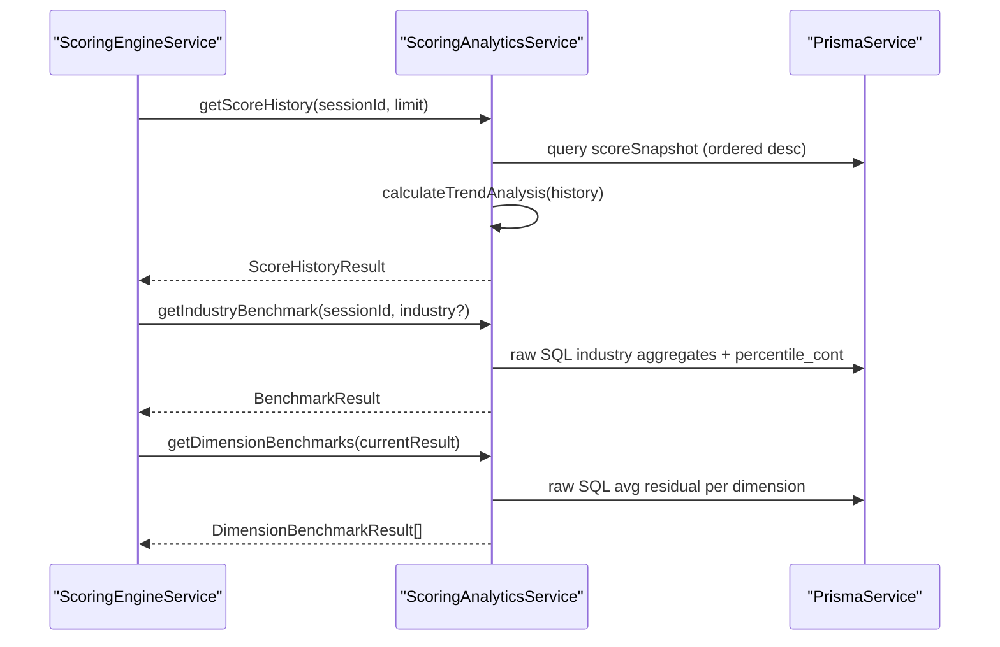
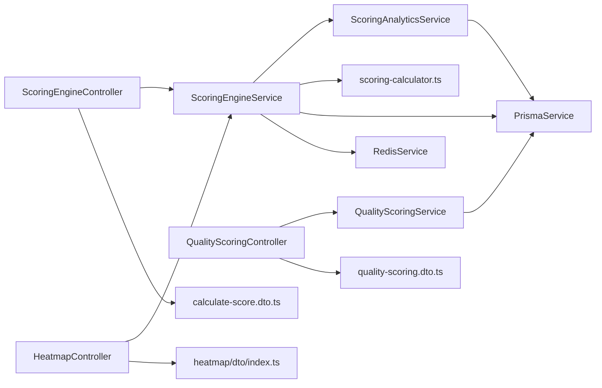

# Scoring & Analytics API

<cite>
**Referenced Files in This Document**
- [scoring-engine.controller.ts](file://apps/api/src/modules/scoring-engine/scoring-engine.controller.ts)
- [scoring-engine.service.ts](file://apps/api/src/modules/scoring-engine/scoring-engine.service.ts)
- [scoring-calculator.ts](file://apps/api/src/modules/scoring-engine/scoring-calculator.ts)
- [scoring-analytics.ts](file://apps/api/src/modules/scoring-engine/strategies/scoring-analytics.ts)
- [calculate-score.dto.ts](file://apps/api/src/modules/scoring-engine/dto/calculate-score.dto.ts)
- [quality-scoring.controller.ts](file://apps/api/src/modules/quality-scoring/quality-scoring.controller.ts)
- [quality-scoring.service.ts](file://apps/api/src/modules/quality-scoring/services/quality-scoring.service.ts)
- [quality-scoring.dto.ts](file://apps/api/src/modules/quality-scoring/dto/quality-scoring.dto.ts)
- [heatmap.controller.ts](file://apps/api/src/modules/heatmap/heatmap.controller.ts)
- [index.ts](file://apps/api/src/modules/heatmap/dto/index.ts)
</cite>

## Table of Contents
1. [Introduction](#introduction)
2. [Project Structure](#project-structure)
3. [Core Components](#core-components)
4. [Architecture Overview](#architecture-overview)
5. [Detailed Component Analysis](#detailed-component-analysis)
6. [Dependency Analysis](#dependency-analysis)
7. [Performance Considerations](#performance-considerations)
8. [Troubleshooting Guide](#troubleshooting-guide)
9. [Conclusion](#conclusion)
10. [Appendices](#appendices)

## Introduction
This document provides comprehensive API documentation for Quiz-to-Build’s scoring and analytics endpoints. It covers:
- Readiness scoring calculation and real-time updates
- Dimensional scoring and residual risk analytics
- Quality assessment services for projects based on extracted facts
- Heatmap generation, drilldown, and export
- Trend analysis, benchmark comparisons, and performance categories
- Batch processing, caching, and historical data access
- Administrative controls, validation, and operational guidance

The scoring systems implement well-defined mathematical formulas and robust service-layer orchestration with caching and analytics strategies.

## Project Structure
The scoring and analytics capabilities are implemented across three primary modules:
- Scoring Engine: readiness scoring, next priority questions (NQS), caching, history, and benchmarks
- Quality Scoring: project quality evaluation against benchmark criteria
- Heatmap: gap visualization, summaries, exports, and drilldown

**Diagram sources**
- [scoring-engine.controller.ts:46-267](file://apps/api/src/modules/scoring-engine/scoring-engine.controller.ts#L46-L267)
- [quality-scoring.controller.ts:19-182](file://apps/api/src/modules/quality-scoring/quality-scoring.controller.ts#L19-L182)
- [heatmap.controller.ts:34-185](file://apps/api/src/modules/heatmap/heatmap.controller.ts#L34-L185)
- [scoring-engine.service.ts:54-386](file://apps/api/src/modules/scoring-engine/scoring-engine.service.ts#L54-L386)
- [quality-scoring.service.ts:28-338](file://apps/api/src/modules/quality-scoring/services/quality-scoring.service.ts#L28-L338)
- [scoring-analytics.ts:17-267](file://apps/api/src/modules/scoring-engine/strategies/scoring-analytics.ts#L17-L267)
- [scoring-calculator.ts:20-208](file://apps/api/src/modules/scoring-engine/scoring-calculator.ts#L20-L208)
- [calculate-score.dto.ts:101-298](file://apps/api/src/modules/scoring-engine/dto/calculate-score.dto.ts#L101-L298)
- [quality-scoring.dto.ts:49-100](file://apps/api/src/modules/quality-scoring/dto/quality-scoring.dto.ts#L49-L100)
- [index.ts:57-192](file://apps/api/src/modules/heatmap/dto/index.ts#L57-L192)

**Section sources**
- [scoring-engine.controller.ts:46-267](file://apps/api/src/modules/scoring-engine/scoring-engine.controller.ts#L46-L267)
- [quality-scoring.controller.ts:19-182](file://apps/api/src/modules/quality-scoring/quality-scoring.controller.ts#L19-L182)
- [heatmap.controller.ts:34-185](file://apps/api/src/modules/heatmap/heatmap.controller.ts#L34-L185)

## Core Components
- Scoring Engine Controller: exposes readiness scoring, NQS, cache invalidation, history, and benchmark endpoints
- Scoring Engine Service: orchestrates scoring calculations, caching, persistence, and analytics delegation
- Scoring Calculator: pure functions for coverage mapping, residual risk computation, trend analysis, and rationale generation
- Scoring Analytics: benchmarking, percentile ranking, dimension-level comparisons, and trend analytics
- Quality Scoring Controller and Service: project quality scoring, improvements, and persistence
- Heatmap Controller and DTOs: gap heatmaps, summaries, exports, and drilldown

**Section sources**
- [scoring-engine.controller.ts:46-267](file://apps/api/src/modules/scoring-engine/scoring-engine.controller.ts#L46-L267)
- [scoring-engine.service.ts:54-386](file://apps/api/src/modules/scoring-engine/scoring-engine.service.ts#L54-L386)
- [scoring-calculator.ts:20-208](file://apps/api/src/modules/scoring-engine/scoring-calculator.ts#L20-L208)
- [scoring-analytics.ts:17-267](file://apps/api/src/modules/scoring-engine/strategies/scoring-analytics.ts#L17-L267)
- [quality-scoring.controller.ts:19-182](file://apps/api/src/modules/quality-scoring/quality-scoring.controller.ts#L19-L182)
- [quality-scoring.service.ts:28-338](file://apps/api/src/modules/quality-scoring/services/quality-scoring.service.ts#L28-L338)
- [heatmap.controller.ts:34-185](file://apps/api/src/modules/heatmap/heatmap.controller.ts#L34-L185)
- [index.ts:57-192](file://apps/api/src/modules/heatmap/dto/index.ts#L57-L192)

## Architecture Overview
The system follows a layered architecture:
- Controllers expose REST endpoints with Swagger metadata and JWT authentication
- Services encapsulate business logic and coordinate persistence and caching
- Utilities provide pure calculation functions for determinism and testability
- Analytics services compute benchmarks and trends using database queries
- DTOs define request/response contracts with validation

**Diagram sources**
- [scoring-engine.controller.ts:55-82](file://apps/api/src/modules/scoring-engine/scoring-engine.controller.ts#L55-L82)
- [scoring-engine.service.ts:70-164](file://apps/api/src/modules/scoring-engine/scoring-engine.service.ts#L70-L164)
- [scoring-calculator.ts:24-130](file://apps/api/src/modules/scoring-engine/scoring-calculator.ts#L24-L130)
- [scoring-analytics.ts:24-67](file://apps/api/src/modules/scoring-engine/strategies/scoring-analytics.ts#L24-L67)

## Detailed Component Analysis

### Readiness Scoring Engine
Endpoints:
- POST /scoring/calculate: Calculate readiness score for a session using risk-weighted residual
- GET /scoring/{sessionId}: Retrieve current score (cached or calculated)
- POST /scoring/{sessionId}/invalidate: Invalidate cache for a session
- GET /scoring/{sessionId}/history?limit=: Historical snapshots for trend analysis
- GET /scoring/{sessionId}/benchmark?industry=: Industry benchmark and percentile ranking
- GET /scoring/{sessionId}/benchmark/dimensions: Dimension-level residual benchmarks
- POST /scoring/next-questions: Next Priority Questions (NQS) ranked by expected score lift

Mathematical Formulas:
- Coverage per question: C_i ∈ [0,1]
- Dimension residual risk: R_d = Σ(S_i × (1 - C_i)) / (Σ S_i + ε)
- Portfolio residual risk: R = Σ(W_d × R_d)
- Readiness Score: Score = 100 × (1 - R)
- NQS expected lift: ΔScore_i = 100 × W_d(i) × S_i × (1 - C_i) / (Σ S_j + ε)

Processing Logic:
- Build coverage map from responses and optional overrides
- Compute per-dimension residuals and weighted contributions
- Determine trend vs. previous score
- Persist snapshot and cache result
- Provide analytics: history, benchmarks, dimension benchmarks

**Diagram sources**
- [scoring-engine.controller.ts:55-82](file://apps/api/src/modules/scoring-engine/scoring-engine.controller.ts#L55-L82)
- [scoring-engine.service.ts:70-164](file://apps/api/src/modules/scoring-engine/scoring-engine.service.ts#L70-L164)
- [scoring-calculator.ts:24-130](file://apps/api/src/modules/scoring-engine/scoring-calculator.ts#L24-L130)

**Section sources**
- [scoring-engine.controller.ts:49-266](file://apps/api/src/modules/scoring-engine/scoring-engine.controller.ts#L49-L266)
- [scoring-engine.service.ts:70-339](file://apps/api/src/modules/scoring-engine/scoring-engine.service.ts#L70-L339)
- [calculate-score.dto.ts:101-298](file://apps/api/src/modules/scoring-engine/dto/calculate-score.dto.ts#L101-L298)
- [scoring-calculator.ts:67-147](file://apps/api/src/modules/scoring-engine/scoring-calculator.ts#L67-L147)
- [scoring-analytics.ts:24-266](file://apps/api/src/modules/scoring-engine/strategies/scoring-analytics.ts#L24-L266)

### Quality Scoring Service
Endpoints:
- GET /quality/{projectId}/score: Project quality score
- GET /quality/{projectId}/improvements: Improvement suggestions
- POST /quality/{projectId}/recalculate: Recalculate and persist score

Quality Algorithm:
- Parse benchmark criteria per dimension
- Match extracted facts to criteria (exact, partial, keyword-based)
- Compute completeness and confidence scores
- Weighted average score across dimensions
- Recommendations based on lowest-performing dimensions

**Diagram sources**
- [quality-scoring.controller.ts:30-53](file://apps/api/src/modules/quality-scoring/quality-scoring.controller.ts#L30-L53)
- [quality-scoring.service.ts:36-94](file://apps/api/src/modules/quality-scoring/services/quality-scoring.service.ts#L36-L94)

**Section sources**
- [quality-scoring.controller.ts:27-117](file://apps/api/src/modules/quality-scoring/quality-scoring.controller.ts#L27-L117)
- [quality-scoring.service.ts:36-338](file://apps/api/src/modules/quality-scoring/services/quality-scoring.service.ts#L36-L338)
- [quality-scoring.dto.ts:49-100](file://apps/api/src/modules/quality-scoring/dto/quality-scoring.dto.ts#L49-L100)

### Heatmap Generation and Analytics
Endpoints:
- GET /heatmap/{sessionId}: Generate gap heatmap (dimension × severity matrix)
- GET /heatmap/{sessionId}/summary: Summary counts and risk metrics
- GET /heatmap/{sessionId}/export/csv: Download CSV
- GET /heatmap/{sessionId}/export/markdown: Download Markdown
- GET /heatmap/{sessionId}/cells?dimension=&severity=: Filtered cells
- GET /heatmap/{sessionId}/drilldown/{dimensionKey}/{severityBucket}: Questions driving gaps

Heatmap Logic:
- Severity buckets: Low, Medium, High, Critical
- Cell color coding: Green, Amber, Red thresholds
- Drilldown lists contributing questions with severity, coverage, and residual risk

**Diagram sources**
- [heatmap.controller.ts:66-87](file://apps/api/src/modules/heatmap/heatmap.controller.ts#L66-L87)
- [index.ts:26-52](file://apps/api/src/modules/heatmap/dto/index.ts#L26-L52)

**Section sources**
- [heatmap.controller.ts:54-184](file://apps/api/src/modules/heatmap/heatmap.controller.ts#L54-L184)
- [index.ts:57-192](file://apps/api/src/modules/heatmap/dto/index.ts#L57-L192)

### Trend Analysis and Benchmarks
- Trend Analysis: direction, average change, volatility, projected score
- Industry Benchmark: average, median, min, max, percentiles, sample size, percentile rank, performance category
- Dimension Benchmarks: per-dimension residual vs. industry average, gap, performance rating, recommendation

**Diagram sources**
- [scoring-engine.service.ts:328-339](file://apps/api/src/modules/scoring-engine/scoring-engine.service.ts#L328-L339)
- [scoring-analytics.ts:24-266](file://apps/api/src/modules/scoring-engine/strategies/scoring-analytics.ts#L24-L266)
- [scoring-calculator.ts:149-187](file://apps/api/src/modules/scoring-engine/scoring-calculator.ts#L149-L187)

**Section sources**
- [scoring-analytics.ts:24-266](file://apps/api/src/modules/scoring-engine/strategies/scoring-analytics.ts#L24-L266)
- [scoring-calculator.ts:149-207](file://apps/api/src/modules/scoring-engine/scoring-calculator.ts#L149-L207)

## Dependency Analysis
- Controllers depend on services for business logic
- Services depend on Prisma for persistence and Redis for caching
- Analytics service encapsulates benchmark computations
- DTOs enforce input validation and define API contracts
- Utilities are pure functions to avoid side effects

**Diagram sources**
- [scoring-engine.controller.ts:46-267](file://apps/api/src/modules/scoring-engine/scoring-engine.controller.ts#L46-L267)
- [quality-scoring.controller.ts:19-182](file://apps/api/src/modules/quality-scoring/quality-scoring.controller.ts#L19-L182)
- [heatmap.controller.ts:34-185](file://apps/api/src/modules/heatmap/heatmap.controller.ts#L34-L185)
- [scoring-engine.service.ts:54-386](file://apps/api/src/modules/scoring-engine/scoring-engine.service.ts#L54-L386)
- [quality-scoring.service.ts:28-338](file://apps/api/src/modules/quality-scoring/services/quality-scoring.service.ts#L28-L338)
- [scoring-analytics.ts:17-267](file://apps/api/src/modules/scoring-engine/strategies/scoring-analytics.ts#L17-L267)
- [scoring-calculator.ts:20-208](file://apps/api/src/modules/scoring-engine/scoring-calculator.ts#L20-L208)
- [calculate-score.dto.ts:101-298](file://apps/api/src/modules/scoring-engine/dto/calculate-score.dto.ts#L101-L298)
- [quality-scoring.dto.ts:49-100](file://apps/api/src/modules/quality-scoring/dto/quality-scoring.dto.ts#L49-L100)
- [index.ts:57-192](file://apps/api/src/modules/heatmap/dto/index.ts#L57-L192)

**Section sources**
- [scoring-engine.service.ts:54-386](file://apps/api/src/modules/scoring-engine/scoring-engine.service.ts#L54-L386)
- [scoring-analytics.ts:17-267](file://apps/api/src/modules/scoring-engine/strategies/scoring-analytics.ts#L17-L267)

## Performance Considerations
- Caching: Scores are cached in Redis with TTL to reduce repeated calculations
- Batch Processing: Controlled concurrency batches for multi-session scoring
- Pagination and Limits: History endpoint supports limit parameter to cap payload size
- Efficient Queries: Analytics use raw SQL with window functions for percentiles and aggregates
- Validation: DTOs prevent invalid inputs and normalize coverage values

[No sources needed since this section provides general guidance]

## Troubleshooting Guide
Common issues and resolutions:
- Session Not Found: Throws 404; verify sessionId and questionnaire linkage
- Cache Miss/Errors: Cache invalidation and fallback to recalculation; check Redis connectivity
- Empty or Zero Scores: Occurs when no questions/dimensions exist or project type missing; controller returns empty DTO with guidance
- Export Security: Markdown export sanitizes content and applies CSP headers

Operational checks:
- Confirm JWT authentication for protected endpoints
- Monitor cache hit rates and TTLs
- Validate DTO inputs (UUIDs, coverage levels, limits)
- Review logs for analytics query performance

**Section sources**
- [scoring-engine.controller.ts:115-157](file://apps/api/src/modules/scoring-engine/scoring-engine.controller.ts#L115-L157)
- [scoring-engine.service.ts:291-324](file://apps/api/src/modules/scoring-engine/scoring-engine.service.ts#L291-L324)
- [quality-scoring.controller.ts:43-52](file://apps/api/src/modules/quality-scoring/quality-scoring.controller.ts#L43-L52)
- [heatmap.controller.ts:100-132](file://apps/api/src/modules/heatmap/heatmap.controller.ts#L100-L132)

## Conclusion
The scoring and analytics subsystem delivers:
- Deterministic, mathematically grounded readiness scoring with NQS prioritization
- Robust quality scoring aligned to benchmark criteria and extracted facts
- Rich visualization via heatmaps with drilldown and export
- Comprehensive analytics including trend, benchmarks, and dimension comparisons
- Operational excellence through caching, batching, and validated DTOs

These capabilities support real-time insights, historical tracking, and actionable recommendations for continuous improvement.

[No sources needed since this section summarizes without analyzing specific files]

## Appendices

### API Endpoints Summary

- Scoring Engine
  - POST /scoring/calculate
  - GET /scoring/{sessionId}
  - POST /scoring/{sessionId}/invalidate
  - GET /scoring/{sessionId}/history?limit=
  - GET /scoring/{sessionId}/benchmark?industry=
  - GET /scoring/{sessionId}/benchmark/dimensions
  - POST /scoring/next-questions

- Quality Scoring
  - GET /quality/{projectId}/score
  - GET /quality/{projectId}/improvements
  - POST /quality/{projectId}/recalculate

- Heatmap
  - GET /heatmap/{sessionId}
  - GET /heatmap/{sessionId}/summary
  - GET /heatmap/{sessionId}/export/csv
  - GET /heatmap/{sessionId}/export/markdown
  - GET /heatmap/{sessionId}/cells?dimension=&severity=
  - GET /heatmap/{sessionId}/drilldown/{dimensionKey}/{severityBucket}

**Section sources**
- [scoring-engine.controller.ts:55-266](file://apps/api/src/modules/scoring-engine/scoring-engine.controller.ts#L55-L266)
- [quality-scoring.controller.ts:30-117](file://apps/api/src/modules/quality-scoring/quality-scoring.controller.ts#L30-L117)
- [heatmap.controller.ts:66-184](file://apps/api/src/modules/heatmap/heatmap.controller.ts#L66-L184)

### Mathematical Formula Reference
- Readiness Score
  - Coverage: C_i ∈ [0,1]
  - Dimension Residual: R_d = Σ(S_i × (1 - C_i)) / (Σ S_i + ε)
  - Portfolio Residual: R = Σ(W_d × R_d)
  - Score: 100 × (1 - R)
- NQS Expected Lift
  - ΔScore_i = 100 × W_d(i) × S_i × (1 - C_i) / (Σ S_j + ε)
- Trend Analysis
  - Average Change, Volatility, Direction, Projected Score
- Benchmarks
  - Percentile Rank, Performance Category, Gap Metrics

**Section sources**
- [scoring-engine.controller.ts:52-100](file://apps/api/src/modules/scoring-engine/scoring-engine.controller.ts#L52-L100)
- [scoring-calculator.ts:67-187](file://apps/api/src/modules/scoring-engine/scoring-calculator.ts#L67-L187)
- [scoring-analytics.ts:134-164](file://apps/api/src/modules/scoring-engine/strategies/scoring-analytics.ts#L134-L164)