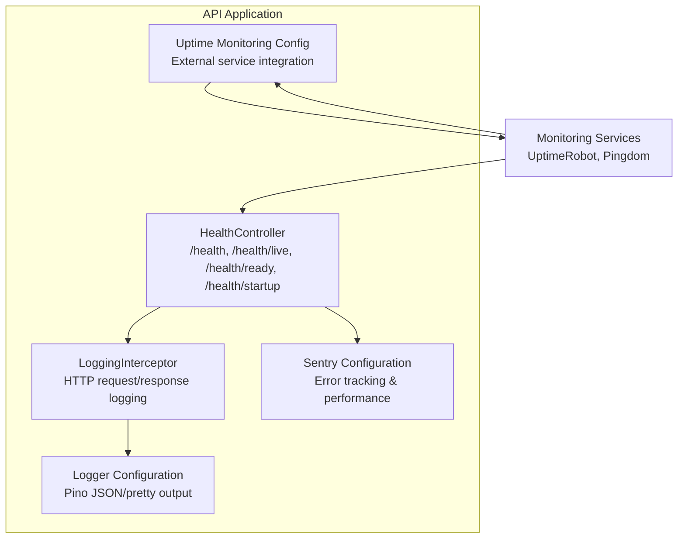
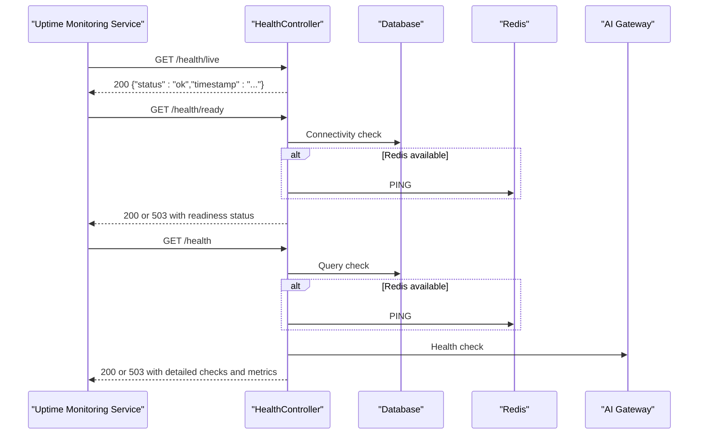
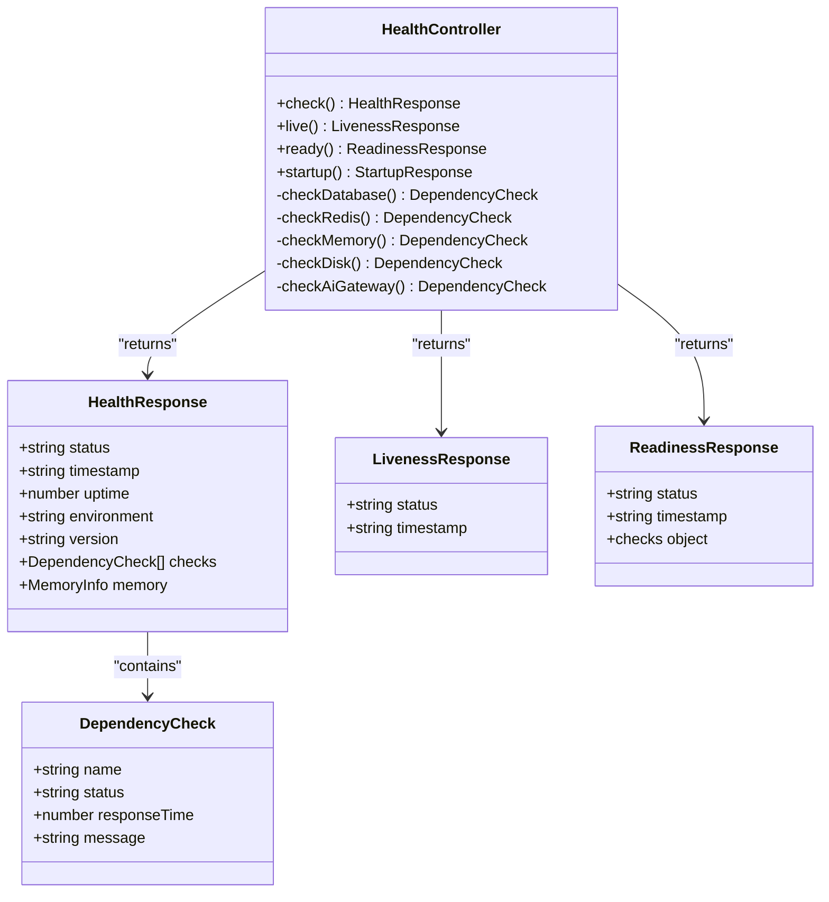
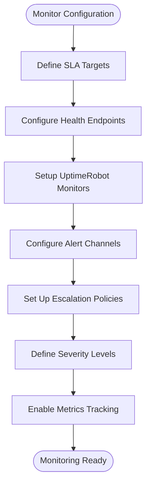
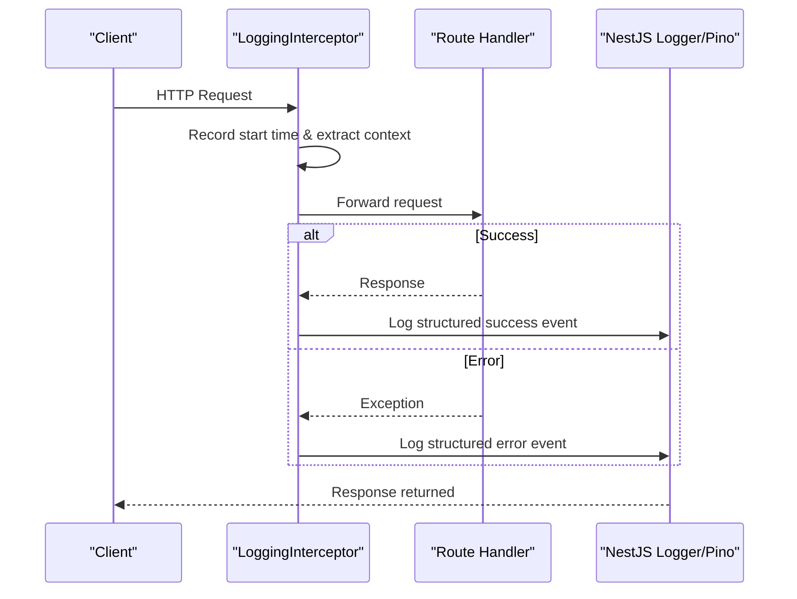
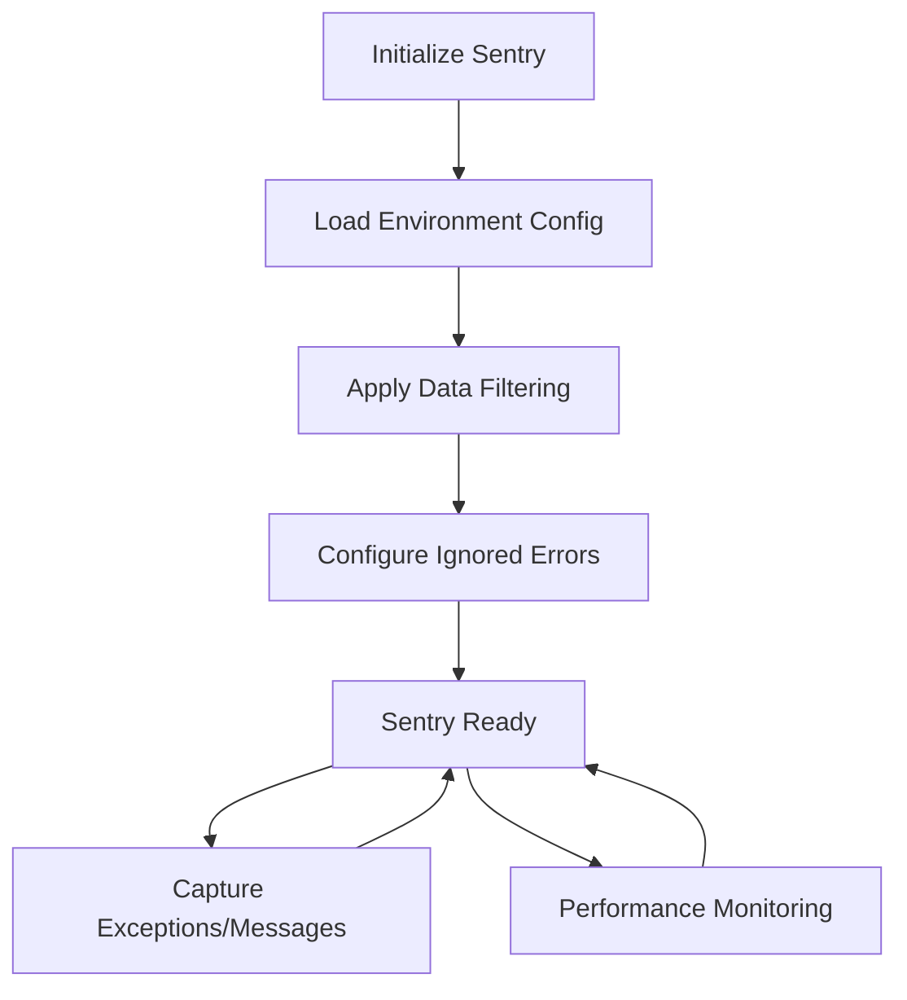
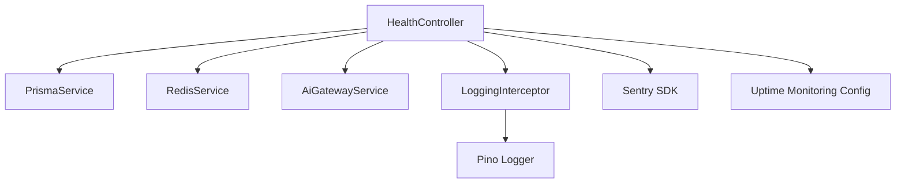

# System Health & Monitoring API

<cite>
**Referenced Files in This Document**
- [health.controller.ts](file://apps/api/src/health.controller.ts)
- [uptime-monitoring.config.ts](file://apps/api/src/config/uptime-monitoring.config.ts)
- [logging.interceptor.ts](file://apps/api/src/common/interceptors/logging.interceptor.ts)
- [logger.config.ts](file://apps/api/src/config/logger.config.ts)
- [sentry.config.ts](file://apps/api/src/config/sentry.config.ts)
- [dependency-health.spec.ts](file://apps/api/src/common/tests/validation/dependency-health.spec.ts)
</cite>

## Table of Contents
1. [Introduction](#introduction)
2. [Project Structure](#project-structure)
3. [Core Components](#core-components)
4. [Architecture Overview](#architecture-overview)
5. [Detailed Component Analysis](#detailed-component-analysis)
6. [Dependency Analysis](#dependency-analysis)
7. [Performance Considerations](#performance-considerations)
8. [Troubleshooting Guide](#troubleshooting-guide)
9. [Conclusion](#conclusion)

## Introduction
This document provides comprehensive API documentation for Quiz-to-Build's system health and monitoring endpoints. It covers health check endpoints, system status APIs, performance monitoring services, logging endpoints, error tracking integration, and system metrics exposure. The documentation includes uptime monitoring, resource utilization APIs, operational health indicators, exception handling endpoints, error reporting services, system diagnostic APIs, examples of health check responses, monitoring integrations, alerting endpoints, observability practices, and administrative monitoring interfaces.

## Project Structure
The health and monitoring capabilities are primarily implemented in the API application under the `apps/api` directory. Key components include:
- Health controller exposing Kubernetes-compatible probes and detailed health endpoints
- Uptime monitoring configuration for external monitoring services
- Structured logging interceptor and logger configuration
- Sentry error tracking and performance monitoring integration
- Dependency validation tests ensuring system stability

**Diagram sources**
- [health.controller.ts:68-234](file://apps/api/src/health.controller.ts#L68-L234)
- [logging.interceptor.ts:14-54](file://apps/api/src/common/interceptors/logging.interceptor.ts#L14-L54)
- [logger.config.ts:9-61](file://apps/api/src/config/logger.config.ts#L9-L61)
- [sentry.config.ts:51-127](file://apps/api/src/config/sentry.config.ts#L51-L127)
- [uptime-monitoring.config.ts:100-149](file://apps/api/src/config/uptime-monitoring.config.ts#L100-L149)

**Section sources**
- [health.controller.ts:52-62](file://apps/api/src/health.controller.ts#L52-L62)
- [uptime-monitoring.config.ts:36-94](file://apps/api/src/config/uptime-monitoring.config.ts#L36-L94)

## Core Components
This section documents the primary health and monitoring endpoints and services.

### Health Endpoints
The HealthController exposes four Kubernetes-compatible and detailed health endpoints:
- Full health check: GET `/health`
- Liveness probe: GET `/health/live`
- Readiness probe: GET `/health/ready`
- Startup probe: GET `/health/startup`

Each endpoint returns structured responses indicating system status and relevant metrics.

**Section sources**
- [health.controller.ts:68-141](file://apps/api/src/health.controller.ts#L68-L141)
- [health.controller.ts:147-205](file://apps/api/src/health.controller.ts#L147-L205)
- [health.controller.ts:211-234](file://apps/api/src/health.controller.ts#L211-L234)

### Kubernetes Probes
- Liveness (`/health/live`): Confirms the process is alive and responding.
- Readiness (`/health/ready`): Verifies database connectivity and optional Redis connectivity before accepting traffic.
- Startup (`/health/startup`): Ensures the application has successfully started by validating database availability.

**Section sources**
- [health.controller.ts:147-161](file://apps/api/src/health.controller.ts#L147-L161)
- [health.controller.ts:167-205](file://apps/api/src/health.controller.ts#L167-L205)
- [health.controller.ts:211-234](file://apps/api/src/health.controller.ts#L211-L234)

### Full Health Check Details
The `/health` endpoint aggregates:
- Database connectivity and response time
- Redis connectivity and response time (optional)
- AI Gateway provider availability (optional)
- Memory usage and heap utilization
- Disk utilization proxy (heap utilization)
- Overall system status (ok/degraded/unhealthy)
- Timestamp, uptime, environment, and version metadata

**Section sources**
- [health.controller.ts:75-141](file://apps/api/src/health.controller.ts#L75-L141)
- [health.controller.ts:240-408](file://apps/api/src/health.controller.ts#L240-L408)

### Uptime Monitoring Configuration
The uptime monitoring configuration defines:
- SLA targets (uptime percentage and response time targets)
- Health check endpoints for API and web applications
- External monitor configurations (UptimeRobot)
- Alert channels (email, Slack, Teams, PagerDuty)
- Incident severity levels and escalation policies
- Status messages and metrics tracking

**Section sources**
- [uptime-monitoring.config.ts:12-30](file://apps/api/src/config/uptime-monitoring.config.ts#L12-L30)
- [uptime-monitoring.config.ts:36-94](file://apps/api/src/config/uptime-monitoring.config.ts#L36-L94)
- [uptime-monitoring.config.ts:100-149](file://apps/api/src/config/uptime-monitoring.config.ts#L100-L149)
- [uptime-monitoring.config.ts:155-210](file://apps/api/src/config/uptime-monitoring.config.ts#L155-L210)
- [uptime-monitoring.config.ts:216-268](file://apps/api/src/config/uptime-monitoring.config.ts#L216-L268)
- [uptime-monitoring.config.ts:286-311](file://apps/api/src/config/uptime-monitoring.config.ts#L286-L311)

### Logging and Observability
- LoggingInterceptor captures request/response details with correlation IDs and logs structured events.
- Logger configuration supports JSON output in production and pretty printing in development, with sensitive data redaction.

**Section sources**
- [logging.interceptor.ts:14-54](file://apps/api/src/common/interceptors/logging.interceptor.ts#L14-L54)
- [logger.config.ts:9-61](file://apps/api/src/config/logger.config.ts#L9-L61)

### Error Tracking and Performance Monitoring
- Sentry integration provides error tracking, performance monitoring, and alerting.
- Configuration supports environment-specific settings, sampling rates, profiling, and data filtering.

**Section sources**
- [sentry.config.ts:51-127](file://apps/api/src/config/sentry.config.ts#L51-L127)
- [sentry.config.ts:132-189](file://apps/api/src/config/sentry.config.ts#L132-L189)

## Architecture Overview
The health and monitoring architecture integrates internal endpoints with external monitoring services and error tracking platforms.

**Diagram sources**
- [health.controller.ts:147-205](file://apps/api/src/health.controller.ts#L147-L205)
- [health.controller.ts:240-408](file://apps/api/src/health.controller.ts#L240-L408)

## Detailed Component Analysis

### HealthController Analysis
The HealthController encapsulates all health and monitoring logic with clear separation of concerns:
- Public endpoints for Kubernetes probes and detailed health
- Private helper methods for dependency checks
- Structured response interfaces for consistent API contracts

**Diagram sources**
- [health.controller.ts:55-62](file://apps/api/src/health.controller.ts#L55-L62)
- [health.controller.ts:12-46](file://apps/api/src/health.controller.ts#L12-L46)

**Section sources**
- [health.controller.ts:55-62](file://apps/api/src/health.controller.ts#L55-L62)
- [health.controller.ts:12-46](file://apps/api/src/health.controller.ts#L12-L46)

### Uptime Monitoring Configuration Analysis
The uptime monitoring configuration centralizes external monitoring integration:
- SLA targets define acceptable uptime and response times
- Health endpoints specify expected responses and intervals
- UptimeRobot monitors include API and web endpoints
- Alert channels and escalation policies ensure timely notifications
- Incident severity levels categorize problems and guide response actions

**Diagram sources**
- [uptime-monitoring.config.ts:12-30](file://apps/api/src/config/uptime-monitoring.config.ts#L12-L30)
- [uptime-monitoring.config.ts:36-94](file://apps/api/src/config/uptime-monitoring.config.ts#L36-L94)
- [uptime-monitoring.config.ts:100-149](file://apps/api/src/config/uptime-monitoring.config.ts#L100-L149)
- [uptime-monitoring.config.ts:155-210](file://apps/api/src/config/uptime-monitoring.config.ts#L155-L210)
- [uptime-monitoring.config.ts:216-268](file://apps/api/src/config/uptime-monitoring.config.ts#L216-L268)
- [uptime-monitoring.config.ts:286-311](file://apps/api/src/config/uptime-monitoring.config.ts#L286-L311)

**Section sources**
- [uptime-monitoring.config.ts:12-30](file://apps/api/src/config/uptime-monitoring.config.ts#L12-L30)
- [uptime-monitoring.config.ts:36-94](file://apps/api/src/config/uptime-monitoring.config.ts#L36-L94)
- [uptime-monitoring.config.ts:100-149](file://apps/api/src/config/uptime-monitoring.config.ts#L100-L149)
- [uptime-monitoring.config.ts:155-210](file://apps/api/src/config/uptime-monitoring.config.ts#L155-L210)
- [uptime-monitoring.config.ts:216-268](file://apps/api/src/config/uptime-monitoring.config.ts#L216-L268)
- [uptime-monitoring.config.ts:286-311](file://apps/api/src/config/uptime-monitoring.config.ts#L286-L311)

### Logging Interceptor Analysis
The logging interceptor provides structured HTTP request/response logging with correlation IDs:
- Captures method, URL, status code, duration, IP, and user agent
- Emits structured logs for successful requests and errors
- Integrates with NestJS Logger and Pino for production-ready output

**Diagram sources**
- [logging.interceptor.ts:14-54](file://apps/api/src/common/interceptors/logging.interceptor.ts#L14-L54)

**Section sources**
- [logging.interceptor.ts:14-54](file://apps/api/src/common/interceptors/logging.interceptor.ts#L14-L54)

### Sentry Integration Analysis
Sentry configuration enables comprehensive error tracking and performance monitoring:
- Initializes with environment-specific settings and sampling rates
- Filters sensitive data from events and breadcrumbs
- Ignores non-actionable errors and health check transactions
- Provides helper functions for capturing exceptions, messages, user context, breadcrumbs, and transactions

**Diagram sources**
- [sentry.config.ts:51-127](file://apps/api/src/config/sentry.config.ts#L51-L127)
- [sentry.config.ts:132-189](file://apps/api/src/config/sentry.config.ts#L132-L189)

**Section sources**
- [sentry.config.ts:51-127](file://apps/api/src/config/sentry.config.ts#L51-L127)
- [sentry.config.ts:132-189](file://apps/api/src/config/sentry.config.ts#L132-L189)

## Dependency Analysis
The health and monitoring system relies on several key dependencies:
- PrismaService for database connectivity checks
- RedisService for Redis connectivity checks
- AiGatewayService for AI provider health checks
- NestJS modules for logging, interceptors, and configuration
- External monitoring services (UptimeRobot) and error tracking (Sentry)

**Diagram sources**
- [health.controller.ts:56-62](file://apps/api/src/health.controller.ts#L56-L62)
- [logging.interceptor.ts:12](file://apps/api/src/common/interceptors/logging.interceptor.ts#L12)
- [logger.config.ts:9-61](file://apps/api/src/config/logger.config.ts#L9-L61)
- [sentry.config.ts:51-127](file://apps/api/src/config/sentry.config.ts#L51-L127)
- [uptime-monitoring.config.ts:100-149](file://apps/api/src/config/uptime-monitoring.config.ts#L100-L149)

**Section sources**
- [health.controller.ts:56-62](file://apps/api/src/health.controller.ts#L56-L62)
- [logging.interceptor.ts:12](file://apps/api/src/common/interceptors/logging.interceptor.ts#L12)
- [logger.config.ts:9-61](file://apps/api/src/config/logger.config.ts#L9-L61)
- [sentry.config.ts:51-127](file://apps/api/src/config/sentry.config.ts#L51-L127)
- [uptime-monitoring.config.ts:100-149](file://apps/api/src/config/uptime-monitoring.config.ts#L100-L149)

## Performance Considerations
- Health checks are designed to be lightweight and fast, with response time thresholds to detect degraded performance.
- Memory usage checks use heap utilization as a proxy for resource pressure.
- External monitoring services use optimized intervals and timeouts to minimize overhead while ensuring reliability.
- Logging is structured and filtered to reduce noise and improve observability without impacting performance.

## Troubleshooting Guide
Common issues and resolutions:
- Unhealthy database connectivity: Verify Prisma connection string and database availability; check network connectivity and credentials.
- Unavailable Redis: Confirm Redis service is running and accessible; verify connection parameters.
- AI Gateway unresponsive: Check AI provider endpoints and authentication; review provider availability.
- Memory warnings/critical alerts: Investigate memory leaks or excessive allocations; optimize resource usage.
- Logging anomalies: Ensure correlation IDs are properly propagated; verify logger configuration for environment.

**Section sources**
- [health.controller.ts:240-408](file://apps/api/src/health.controller.ts#L240-L408)
- [logger.config.ts:9-61](file://apps/api/src/config/logger.config.ts#L9-L61)

## Conclusion
The Quiz-to-Build system provides robust health and monitoring capabilities through dedicated endpoints, structured logging, error tracking, and external monitoring integrations. The documented endpoints and configurations enable comprehensive observability, reliable uptime monitoring, and efficient troubleshooting across environments.