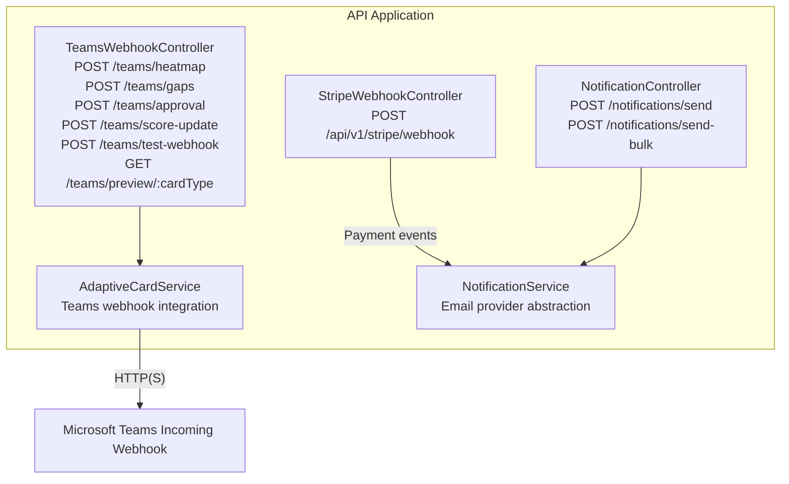
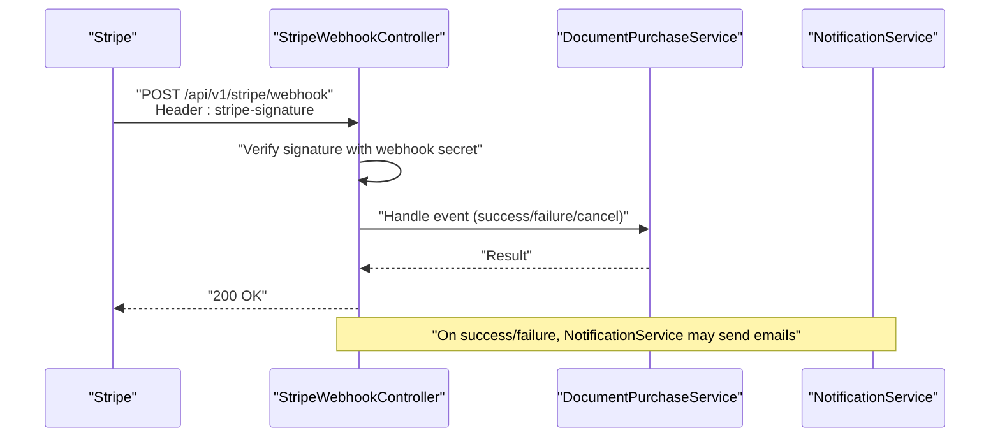
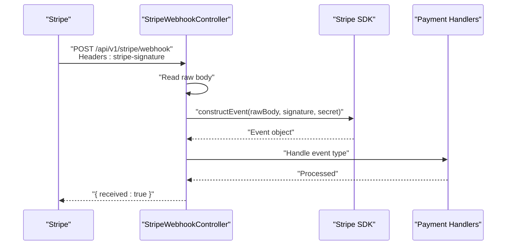
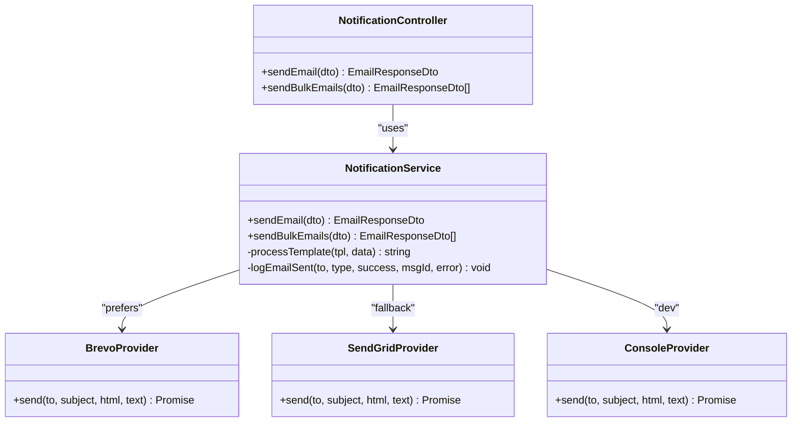
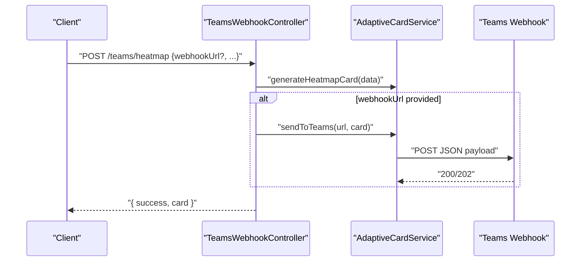
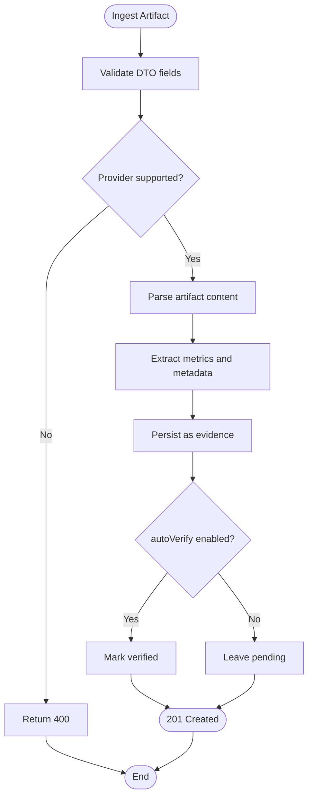
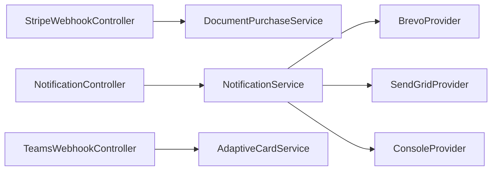

# Webhooks & Notifications API

<cite>
**Referenced Files in This Document**
- [stripe-webhook.controller.ts](file://apps/api/src/modules/document-commerce/stripe-webhook.controller.ts)
- [notification.controller.ts](file://apps/api/src/modules/notifications/notification.controller.ts)
- [notification.service.ts](file://apps/api/src/modules/notifications/notification.service.ts)
- [teams-webhook.controller.ts](file://apps/api/src/modules/notifications/teams-webhook.controller.ts)
- [adaptive-card.service.ts](file://apps/api/src/modules/notifications/adaptive-card.service.ts)
- [send-email.dto.ts](file://apps/api/src/modules/notifications/dto/send-email.dto.ts)
- [evidence-registry.controller.ts](file://apps/api/src/modules/evidence-registry/evidence-registry.controller.ts)
</cite>

## Table of Contents
1. [Introduction](#introduction)
2. [Project Structure](#project-structure)
3. [Core Components](#core-components)
4. [Architecture Overview](#architecture-overview)
5. [Detailed Component Analysis](#detailed-component-analysis)
6. [Dependency Analysis](#dependency-analysis)
7. [Performance Considerations](#performance-considerations)
8. [Troubleshooting Guide](#troubleshooting-guide)
9. [Conclusion](#conclusion)
10. [Appendices](#appendices)

## Introduction
This document provides comprehensive API documentation for Quiz-to-Build’s webhook and notification endpoints. It covers:
- Stripe webhook processing for document purchases
- Email notification delivery via configurable providers
- Microsoft Teams integration endpoints using Adaptive Cards
- CI/CD artifact ingestion endpoints
- Webhook security, signature verification, and retry considerations
- Examples of payloads, event types, and operational procedures

## Project Structure
The relevant webhook and notification functionality resides in the API application under the notifications and document-commerce modules, along with supporting DTOs and services.

**Diagram sources**
- [stripe-webhook.controller.ts:22-103](file://apps/api/src/modules/document-commerce/stripe-webhook.controller.ts#L22-L103)
- [notification.controller.ts:11-36](file://apps/api/src/modules/notifications/notification.controller.ts#L11-L36)
- [teams-webhook.controller.ts:36-344](file://apps/api/src/modules/notifications/teams-webhook.controller.ts#L36-L344)
- [adaptive-card.service.ts:16-528](file://apps/api/src/modules/notifications/adaptive-card.service.ts#L16-L528)
- [notification.service.ts:159-470](file://apps/api/src/modules/notifications/notification.service.ts#L159-L470)

**Section sources**
- [stripe-webhook.controller.ts:1-144](file://apps/api/src/modules/document-commerce/stripe-webhook.controller.ts#L1-L144)
- [notification.controller.ts:1-37](file://apps/api/src/modules/notifications/notification.controller.ts#L1-L37)
- [teams-webhook.controller.ts:1-345](file://apps/api/src/modules/notifications/teams-webhook.controller.ts#L1-L345)
- [adaptive-card.service.ts:1-686](file://apps/api/src/modules/notifications/adaptive-card.service.ts#L1-L686)
- [notification.service.ts:1-471](file://apps/api/src/modules/notifications/notification.service.ts#L1-L471)

## Core Components
- Stripe Webhook Controller: Receives and verifies Stripe events, dispatches to purchase service handlers.
- Notification Controller: Admin-only endpoints to send single or bulk emails.
- Notification Service: Email provider abstraction supporting Brevo, SendGrid, and console provider; includes audit logging.
- Teams Webhook Controller: Endpoints to send Adaptive Cards to Teams channels and test webhook connectivity.
- Adaptive Card Service: Generates Adaptive Cards and posts them to Teams webhooks.
- CI/CD Artifact Ingestion: Evidence registry endpoints to ingest CI artifacts as evidence.

**Section sources**
- [stripe-webhook.controller.ts:22-103](file://apps/api/src/modules/document-commerce/stripe-webhook.controller.ts#L22-L103)
- [notification.controller.ts:11-36](file://apps/api/src/modules/notifications/notification.controller.ts#L11-L36)
- [notification.service.ts:159-470](file://apps/api/src/modules/notifications/notification.service.ts#L159-L470)
- [teams-webhook.controller.ts:36-344](file://apps/api/src/modules/notifications/teams-webhook.controller.ts#L36-L344)
- [adaptive-card.service.ts:16-528](file://apps/api/src/modules/notifications/adaptive-card.service.ts#L16-L528)
- [evidence-registry.controller.ts:370-461](file://apps/api/src/modules/evidence-registry/evidence-registry.controller.ts#L370-L461)

## Architecture Overview
The system integrates external services through secure, authenticated endpoints:
- Stripe webhook endpoint validates signatures and triggers purchase outcome handlers.
- Email notifications are sent via configurable providers with audit logging.
- Teams notifications are generated as Adaptive Cards and posted to configured webhooks.
- CI/CD artifact ingestion endpoints parse and persist build artifacts as evidence.

**Diagram sources**
- [stripe-webhook.controller.ts:55-103](file://apps/api/src/modules/document-commerce/stripe-webhook.controller.ts#L55-L103)
- [notification.service.ts:159-470](file://apps/api/src/modules/notifications/notification.service.ts#L159-L470)

## Detailed Component Analysis

### Stripe Webhook Endpoint
- Path: POST /api/v1/stripe/webhook
- Authentication: Public decorator allows external Stripe calls
- Signature Verification: Uses Stripe SDK to constructEvent with raw body and stripe-signature header
- Supported Event Types:
  - payment_intent.succeeded
  - payment_intent.payment_failed
  - payment_intent.canceled
- Behavior:
  - Validates presence of raw body and webhook secret
  - Throws bad request on verification failure
  - Dispatches to handler methods per event type
  - Returns { received: true } on success

**Diagram sources**
- [stripe-webhook.controller.ts:55-103](file://apps/api/src/modules/document-commerce/stripe-webhook.controller.ts#L55-L103)

**Section sources**
- [stripe-webhook.controller.ts:22-103](file://apps/api/src/modules/document-commerce/stripe-webhook.controller.ts#L22-L103)

### Email Notification Delivery
- Paths:
  - POST /notifications/send (Admin only)
  - POST /notifications/send-bulk (Admin only)
- Authentication: JWT + Roles guard (ADMIN, SUPER_ADMIN)
- Providers:
  - Brevo (primary) via API v3 SMTP
  - SendGrid legacy fallback via API v3
  - Console provider for development
- Templates: Predefined email types with variable substitution
- Audit Logging: Creates audit log entries for each send attempt

**Diagram sources**
- [notification.controller.ts:11-36](file://apps/api/src/modules/notifications/notification.controller.ts#L11-L36)
- [notification.service.ts:159-470](file://apps/api/src/modules/notifications/notification.service.ts#L159-L470)

**Section sources**
- [notification.controller.ts:11-36](file://apps/api/src/modules/notifications/notification.controller.ts#L11-L36)
- [notification.service.ts:159-470](file://apps/api/src/modules/notifications/notification.service.ts#L159-L470)
- [send-email.dto.ts:1-65](file://apps/api/src/modules/notifications/dto/send-email.dto.ts#L1-L65)

### Microsoft Teams Integration Endpoints
- Paths:
  - POST /teams/heatmap
  - POST /teams/gaps
  - POST /teams/approval
  - POST /teams/score-update
  - POST /teams/test-webhook
  - GET /teams/preview/:cardType
- Authentication: JWT guard
- Functionality:
  - Generate Adaptive Cards for heatmap, gaps, approvals, and score updates
  - Optionally send to a provided webhook URL or configured default
  - Test webhook connectivity with a sample card
  - Preview card JSON for debugging

**Diagram sources**
- [teams-webhook.controller.ts:46-101](file://apps/api/src/modules/notifications/teams-webhook.controller.ts#L46-L101)
- [adaptive-card.service.ts:478-528](file://apps/api/src/modules/notifications/adaptive-card.service.ts#L478-L528)

**Section sources**
- [teams-webhook.controller.ts:36-344](file://apps/api/src/modules/notifications/teams-webhook.controller.ts#L36-L344)
- [adaptive-card.service.ts:16-528](file://apps/api/src/modules/notifications/adaptive-card.service.ts#L16-L528)

### CI/CD Artifact Ingestion Endpoints
- Paths:
  - POST /evidence/ci/ingest
  - POST /evidence/ci/bulk-ingest
  - GET /evidence/ci/session/:sessionId
  - GET /evidence/ci/build/:sessionId/:buildId
- Authentication: JWT guard
- Supported Providers: azure-devops, github-actions, gitlab-ci
- Supported Artifact Types: junit, jest, lcov, cobertura, cyclonedx, spdx, trivy, owasp
- Behavior:
  - Parses artifacts and extracts metrics
  - Automatically detects question IDs if not provided
  - Supports bulk ingestion in a single request

**Diagram sources**
- [evidence-registry.controller.ts:370-461](file://apps/api/src/modules/evidence-registry/evidence-registry.controller.ts#L370-L461)

**Section sources**
- [evidence-registry.controller.ts:370-461](file://apps/api/src/modules/evidence-registry/evidence-registry.controller.ts#L370-L461)

## Dependency Analysis
- Controllers depend on services for business logic:
  - StripeWebhookController -> DocumentPurchaseService
  - NotificationController -> NotificationService
  - TeamsWebhookController -> AdaptiveCardService
- Services encapsulate provider abstractions and configuration:
  - NotificationService selects provider based on environment variables
  - AdaptiveCardService posts to Teams webhooks
- DTOs define request/response shapes for validation and documentation.

**Diagram sources**
- [stripe-webhook.controller.ts:22-103](file://apps/api/src/modules/document-commerce/stripe-webhook.controller.ts#L22-L103)
- [notification.controller.ts:11-36](file://apps/api/src/modules/notifications/notification.controller.ts#L11-L36)
- [teams-webhook.controller.ts:36-344](file://apps/api/src/modules/notifications/teams-webhook.controller.ts#L36-L344)
- [notification.service.ts:159-470](file://apps/api/src/modules/notifications/notification.service.ts#L159-L470)
- [adaptive-card.service.ts:16-528](file://apps/api/src/modules/notifications/adaptive-card.service.ts#L16-L528)

**Section sources**
- [notification.service.ts:159-470](file://apps/api/src/modules/notifications/notification.service.ts#L159-L470)
- [adaptive-card.service.ts:16-528](file://apps/api/src/modules/notifications/adaptive-card.service.ts#L16-L528)

## Performance Considerations
- Email provider selection:
  - Prefer Brevo for production; console provider logs only for development.
- Rate limiting:
  - Bulk email sending introduces small delays between sends to mitigate provider throttling.
- Teams webhook:
  - Uses HTTPS POST; ensure network timeouts and retries are handled by the caller if needed.

[No sources needed since this section provides general guidance]

## Troubleshooting Guide
- Stripe Webhook
  - Ensure STRIPE_WEBHOOK_SECRET is configured; otherwise, all events are rejected.
  - Verify raw body availability and correct stripe-signature header.
  - Confirm supported event types and that handlers are invoked.
- Email Notifications
  - Configure BREVO_API_KEY or SENDGRID_API_KEY; otherwise, emails are logged to console.
  - Check audit logs for send attempts and errors.
- Teams Integration
  - Verify TEAMS_WEBHOOK_URL (and TEAMS_APPROVAL_WEBHOOK_URL if used) are set.
  - Use POST /teams/test-webhook to validate connectivity.
  - Use GET /teams/preview/:cardType to inspect generated Adaptive Card JSON.
- CI/CD Artifacts
  - Confirm provider and artifact type are supported.
  - Ensure sessionId and build identifiers are correct.

**Section sources**
- [stripe-webhook.controller.ts:34-48](file://apps/api/src/modules/document-commerce/stripe-webhook.controller.ts#L34-L48)
- [notification.service.ts:165-187](file://apps/api/src/modules/notifications/notification.service.ts#L165-L187)
- [teams-webhook.controller.ts:170-221](file://apps/api/src/modules/notifications/teams-webhook.controller.ts#L170-L221)
- [adaptive-card.service.ts:532-573](file://apps/api/src/modules/notifications/adaptive-card.service.ts#L532-L573)
- [evidence-registry.controller.ts:370-461](file://apps/api/src/modules/evidence-registry/evidence-registry.controller.ts#L370-L461)

## Conclusion
Quiz-to-Build provides robust webhook and notification capabilities:
- Secure Stripe webhook processing with strict signature verification
- Flexible email delivery via configurable providers with audit logging
- Rich Teams notifications using Adaptive Cards with preview and test endpoints
- Automated CI/CD artifact ingestion for evidence management

[No sources needed since this section summarizes without analyzing specific files]

## Appendices

### API Definitions

- Stripe Webhook
  - Method: POST
  - Path: /api/v1/stripe/webhook
  - Headers:
    - stripe-signature: string
  - Body: Raw body (required)
  - Responses:
    - 200 OK: { received: true }
    - 400 Bad Request: On invalid signature or missing raw body
  - Notes:
    - Requires STRIPE_WEBHOOK_SECRET configured

- Email Notifications (Admin)
  - Method: POST
  - Path: /notifications/send
  - Authentication: Bearer JWT (ADMIN/SUPER_ADMIN)
  - Body: SendEmailDto
  - Responses:
    - 200 OK: EmailResponseDto
    - 403 Forbidden: Insufficient permissions

  - Method: POST
  - Path: /notifications/send-bulk
  - Authentication: Bearer JWT (ADMIN/SUPER_ADMIN)
  - Body: BulkSendEmailDto
  - Responses:
    - 200 OK: EmailResponseDto[]

- Teams Integration
  - Method: POST
  - Path: /teams/heatmap
  - Body: HeatmapCardData (with optional webhookUrl)
  - Responses:
    - 200 OK: { success: boolean, card: unknown }

  - Method: POST
  - Path: /teams/gaps
  - Body: GapSummaryCardData (with optional webhookUrl)
  - Responses:
    - 200 OK: { success: boolean, card: unknown }

  - Method: POST
  - Path: /teams/approval
  - Body: ApprovalRequestCardData (with optional webhookUrl)
  - Responses:
    - 200 OK: { success: boolean, card: unknown }

  - Method: POST
  - Path: /teams/score-update
  - Body: ScoreUpdateCardData (with optional webhookUrl)
  - Responses:
    - 200 OK: { success: boolean, card: unknown }

  - Method: POST
  - Path: /teams/test-webhook
  - Body: { webhookUrl: string }
  - Responses:
    - 200 OK: { success: boolean, message: string }

  - Method: GET
  - Path: /teams/preview/:cardType
  - Params:
    - cardType: heatmap | gaps | approval | score-update
  - Responses:
    - 200 OK: { cardType: string, card: unknown }

- CI/CD Artifact Ingestion
  - Method: POST
  - Path: /evidence/ci/ingest
  - Body: IngestArtifactDto
  - Responses:
    - 201 Created: Ingestion result
    - 400 Bad Request: Invalid artifact format/type

  - Method: POST
  - Path: /evidence/ci/bulk-ingest
  - Body: BulkIngestDto
  - Responses:
    - 201 Created: Bulk ingestion result

  - Method: GET
  - Path: /evidence/ci/session/:sessionId
  - Responses:
    - 200 OK: List of CI artifacts

  - Method: GET
  - Path: /evidence/ci/build/:sessionId/:buildId
  - Responses:
    - 200 OK: Build summary with metrics
    - 404 Not Found: Build not found

**Section sources**
- [stripe-webhook.controller.ts:55-103](file://apps/api/src/modules/document-commerce/stripe-webhook.controller.ts#L55-L103)
- [notification.controller.ts:17-35](file://apps/api/src/modules/notifications/notification.controller.ts#L17-L35)
- [teams-webhook.controller.ts:46-259](file://apps/api/src/modules/notifications/teams-webhook.controller.ts#L46-L259)
- [evidence-registry.controller.ts:374-461](file://apps/api/src/modules/evidence-registry/evidence-registry.controller.ts#L374-L461)

### Payload and Event Type References

- Stripe Events
  - payment_intent.succeeded
  - payment_intent.payment_failed
  - payment_intent.canceled

- Teams Adaptive Cards
  - HeatmapCardData
  - GapSummaryCardData
  - ApprovalRequestCardData
  - ScoreUpdateCardData

- Email DTOs
  - SendEmailDto
  - BulkSendEmailDto
  - EmailResponseDto
  - EmailType enum

**Section sources**
- [stripe-webhook.controller.ts:85-100](file://apps/api/src/modules/document-commerce/stripe-webhook.controller.ts#L85-L100)
- [teams-webhook.controller.ts:261-343](file://apps/api/src/modules/notifications/teams-webhook.controller.ts#L261-L343)
- [send-email.dto.ts:4-64](file://apps/api/src/modules/notifications/dto/send-email.dto.ts#L4-L64)

### Configuration and Environment Variables
- Stripe
  - STRIPE_SECRET_KEY
  - STRIPE_WEBHOOK_SECRET
- Email
  - BREVO_API_KEY
  - SENDGRID_API_KEY
  - EMAIL_FROM
  - EMAIL_FROM_NAME
  - FRONTEND_URL
- Teams
  - TEAMS_WEBHOOK_URL
  - TEAMS_APPROVAL_WEBHOOK_URL

**Section sources**
- [stripe-webhook.controller.ts:33-34](file://apps/api/src/modules/document-commerce/stripe-webhook.controller.ts#L33-L34)
- [notification.service.ts:165-173](file://apps/api/src/modules/notifications/notification.service.ts#L165-L173)
- [adaptive-card.service.ts:532-564](file://apps/api/src/modules/notifications/adaptive-card.service.ts#L532-L564)