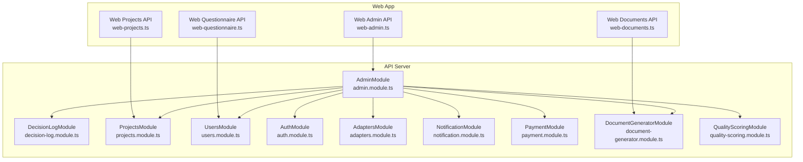
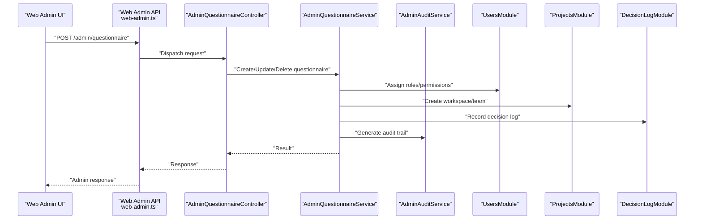
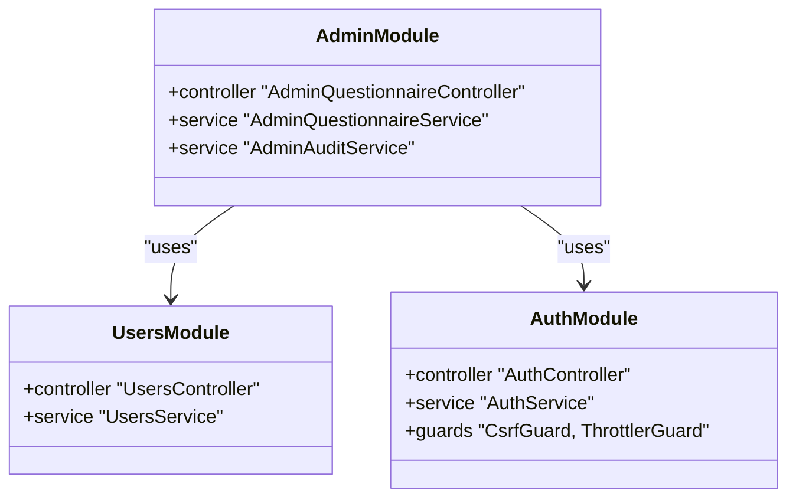
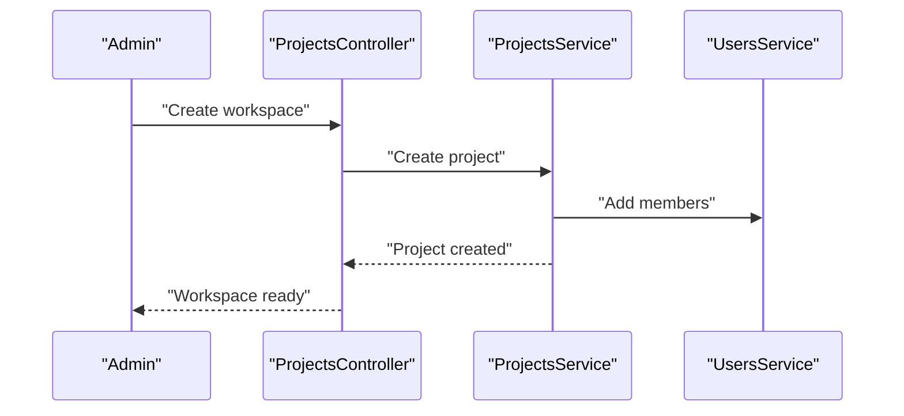
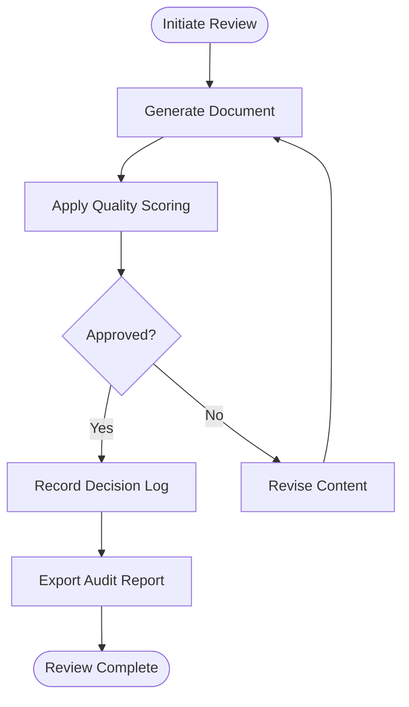
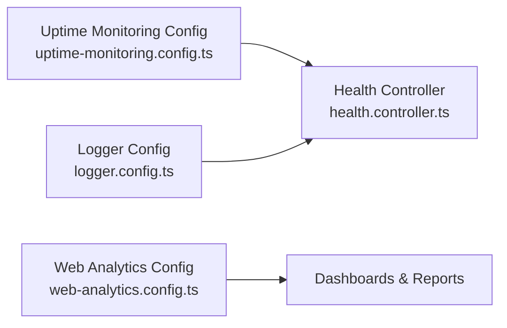
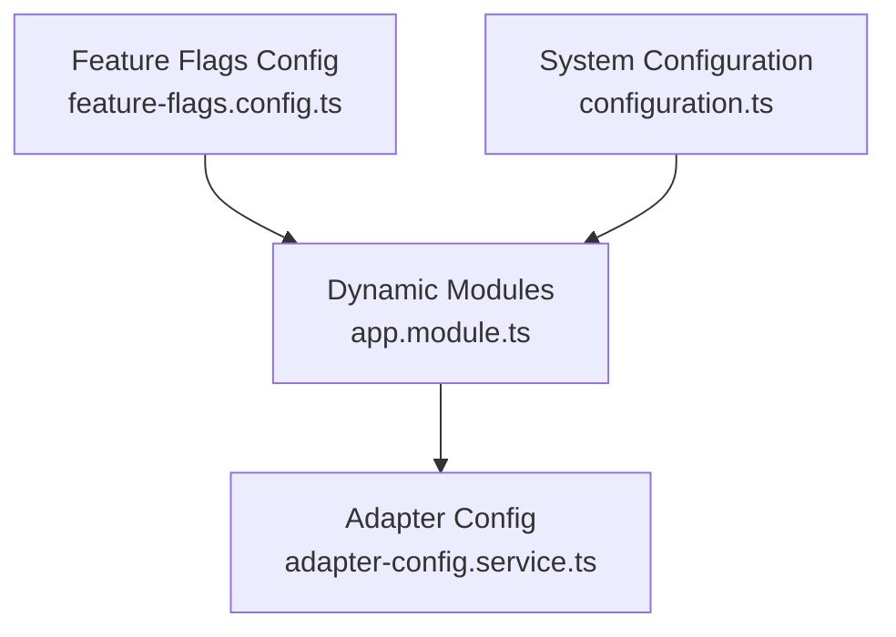
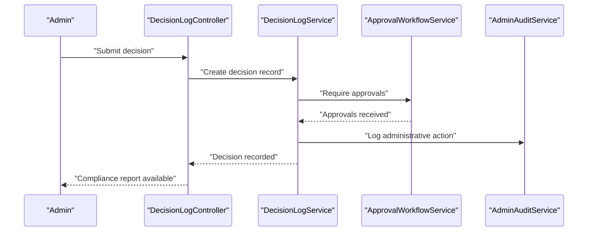
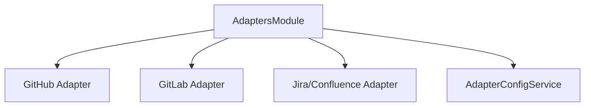
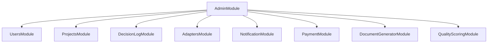

# Admin System

<cite>
**Referenced Files in This Document**
- [admin.module.ts](file://apps/api/src/modules/admin/admin.module.ts)
- [app.module.ts](file://apps/api/src/app.module.ts)
- [decision-log.module.ts](file://apps/api/src/modules/decision-log/decision-log.module.ts)
- [admin-questionnaire.controller.ts](file://apps/api/src/modules/admin/controllers/admin-questionnaire.controller.ts)
- [admin-questionnaire.service.ts](file://apps/api/src/modules/admin/services/admin-questionnaire.service.ts)
- [admin-audit.service.ts](file://apps/api/src/modules/admin/services/admin-audit.service.ts)
- [approval-workflow.service.ts](file://apps/api/src/modules/decision-log/approval-workflow.service.ts)
- [decision-log.service.ts](file://apps/api/src/modules/decision-log/decision-log.service.ts)
- [decision-log.controller.ts](file://apps/api/src/modules/decision-log/decision-log.controller.ts)
- [users.module.ts](file://apps/api/src/modules/users/users.module.ts)
- [users.controller.ts](file://apps/api/src/modules/users/controllers/users.controller.ts)
- [users.service.ts](file://apps/api/src/modules/users/services/users.service.ts)
- [auth.module.ts](file://apps/api/src/modules/auth/auth.module.ts)
- [auth.controller.ts](file://apps/api/src/modules/auth/controllers/auth.controller.ts)
- [auth.service.ts](file://apps/api/src/modules/auth/services/auth.service.ts)
- [projects.module.ts](file://apps/api/src/modules/projects/projects.module.ts)
- [projects.controller.ts](file://apps/api/src/modules/projects/controllers/projects.controller.ts)
- [projects.service.ts](file://apps/api/src/modules/projects/services/projects.service.ts)
- [document-generator.module.ts](file://apps/api/src/modules/document-generator/document-generator.module.ts)
- [document-generator.controller.ts](file://apps/api/src/modules/document-generator/controllers/document-generator.controller.ts)
- [document-generator.service.ts](file://apps/api/src/modules/document-generator/services/document-generator.service.ts)
- [quality-scoring.module.ts](file://apps/api/src/modules/quality-scoring/quality-scoring.module.ts)
- [quality-scoring.service.ts](file://apps/api/src/modules/quality-scoring/services/quality-scoring.service.ts)
- [notification.module.ts](file://apps/api/src/modules/notifications/notification.module.ts)
- [notification.service.ts](file://apps/api/src/modules/notifications/services/notification.service.ts)
- [payment.module.ts](file://apps/api/src/modules/payment/payment.module.ts)
- [payment.service.ts](file://apps/api/src/modules/payment/services/payment.service.ts)
- [adapters.module.ts](file://apps/api/src/modules/adapters/adapters.module.ts)
- [adapter.controller.ts](file://apps/api/src/modules/adapters/controllers/adapter.controller.ts)
- [adapter-config.service.ts](file://apps/api/src/modules/adapters/services/adapter-config.service.ts)
- [github.adapter.ts](file://apps/api/src/modules/adapters/adapters/github.adapter.ts)
- [gitlab.adapter.ts](file://apps/api/src/modules/adapters/adapters/gitlab.adapter.ts)
- [jira-confluence.adapter.ts](file://apps/api/src/modules/adapters/adapters/jira-confluence.adapter.ts)
- [monitoring.config.ts](file://apps/api/src/config/uptime-monitoring.config.ts)
- [logger.config.ts](file://apps/api/src/config/logger.config.ts)
- [feature-flags.config.ts](file://apps/api/src/config/feature-flags.config.ts)
- [configuration.ts](file://apps/api/src/config/configuration.ts)
- [health.controller.ts](file://apps/api/src/health.controller.ts)
- [web-admin.ts](file://apps/web/src/api/admin.ts)
- [web-auth.ts](file://apps/web/src/api/auth.ts)
- [web-projects.ts](file://apps/web/src/api/projects.ts)
- [web-documents.ts](file://apps/web/src/api/documents.ts)
- [web-questionnaire.ts](file://apps/web/src/api/questionnaire.ts)
- [web-analytics.config.ts](file://apps/web/src/config/analytics.config.ts)
- [web-feature-flags.config.ts](file://apps/web/src/config/feature-flags.config.ts)
- [web-sentry.config.ts](file://apps/web/src/config/sentry.config.ts)
- [dashboard.e2e.test.ts](file://e2e/admin/dashboard.e2e.test.ts)
- [admin-deep-clone.test.ts](file://test/regression/admin-deep-clone.test.ts)
- [admin-approval-workflow.flow.test.ts](file://apps/api/test/integration/admin-approval-workflow.flow.test.ts)
</cite>

## Table of Contents
1. [Introduction](#introduction)
2. [Project Structure](#project-structure)
3. [Core Components](#core-components)
4. [Architecture Overview](#architecture-overview)
5. [Detailed Component Analysis](#detailed-component-analysis)
6. [Dependency Analysis](#dependency-analysis)
7. [Performance Considerations](#performance-considerations)
8. [Troubleshooting Guide](#troubleshooting-guide)
9. [Conclusion](#conclusion)
10. [Appendices](#appendices)

## Introduction
This document describes the administrative system and oversight capabilities of the platform. It covers user management interfaces (provisioning, role assignment, access control), project management (workspace creation, team collaboration, lifecycle), document review workflows and quality assurance, system monitoring and reporting, configuration management (feature flags, settings, tenant customization), audit logging and compliance, integrations with external systems (HR, project management, compliance), and administrative workflows including security measures and troubleshooting.

## Project Structure
The administrative domain spans both the NestJS API server and the React web application. The API module composes multiple feature modules, including Admin, Decision Log, Projects, Users, Auth, Adapters, Notifications, Payments, and others. The web app exposes administrative APIs and UI surfaces for admin tasks.

**Diagram sources**
- [admin.module.ts:1-14](file://apps/api/src/modules/admin/admin.module.ts#L1-L14)
- [decision-log.module.ts:1-25](file://apps/api/src/modules/decision-log/decision-log.module.ts#L1-L25)
- [projects.module.ts](file://apps/api/src/modules/projects/projects.module.ts)
- [users.module.ts](file://apps/api/src/modules/users/users.module.ts)
- [auth.module.ts](file://apps/api/src/modules/auth/auth.module.ts)
- [adapters.module.ts](file://apps/api/src/modules/adapters/adapters.module.ts)
- [notification.module.ts](file://apps/api/src/modules/notifications/notification.module.ts)
- [payment.module.ts](file://apps/api/src/modules/payment/payment.module.ts)
- [document-generator.module.ts](file://apps/api/src/modules/document-generator/document-generator.module.ts)
- [quality-scoring.module.ts](file://apps/api/src/modules/quality-scoring/quality-scoring.module.ts)
- [web-admin.ts](file://apps/web/src/api/admin.ts)
- [web-questionnaire.ts](file://apps/web/src/api/questionnaire.ts)
- [web-projects.ts](file://apps/web/src/api/projects.ts)
- [web-documents.ts](file://apps/web/src/api/documents.ts)

**Section sources**
- [app.module.ts:1-130](file://apps/api/src/app.module.ts#L1-L130)
- [admin.module.ts:1-14](file://apps/api/src/modules/admin/admin.module.ts#L1-L14)
- [decision-log.module.ts:1-25](file://apps/api/src/modules/decision-log/decision-log.module.ts#L1-L25)

## Core Components
- AdminModule: Provides administrative services and controllers for questionnaire administration and audit functions.
- DecisionLogModule: Implements append-only decision records, approval workflows, and compliance export.
- ProjectsModule: Manages workspace creation, team collaboration, and project lifecycle.
- UsersModule/AuthModule: Handles user provisioning, roles, and access control.
- AdaptersModule: Integrates with external systems (GitHub, GitLab, Jira/Confluence).
- Notifications/Payments: Support communication and billing-related administrative tasks.
- Monitoring/Logging: Uptime monitoring, structured logging, and analytics configuration.

**Section sources**
- [admin.module.ts:1-14](file://apps/api/src/modules/admin/admin.module.ts#L1-L14)
- [decision-log.module.ts:1-25](file://apps/api/src/modules/decision-log/decision-log.module.ts#L1-L25)
- [projects.module.ts](file://apps/api/src/modules/projects/projects.module.ts)
- [users.module.ts](file://apps/api/src/modules/users/users.module.ts)
- [auth.module.ts](file://apps/api/src/modules/auth/auth.module.ts)
- [adapters.module.ts](file://apps/api/src/modules/adapters/adapters.module.ts)
- [notification.module.ts](file://apps/api/src/modules/notifications/notification.module.ts)
- [payment.module.ts](file://apps/api/src/modules/payment/payment.module.ts)
- [monitoring.config.ts](file://apps/api/src/config/uptime-monitoring.config.ts)
- [logger.config.ts](file://apps/api/src/config/logger.config.ts)

## Architecture Overview
Administrative workflows are orchestrated by the AdminModule, which depends on Users, Projects, Decision Log, Adapters, Notifications, Payments, and Document Generator modules. The web app consumes typed APIs to perform administrative actions.

**Diagram sources**
- [web-admin.ts](file://apps/web/src/api/admin.ts)
- [admin-questionnaire.controller.ts](file://apps/api/src/modules/admin/controllers/admin-questionnaire.controller.ts)
- [admin-questionnaire.service.ts](file://apps/api/src/modules/admin/services/admin-questionnaire.service.ts)
- [admin-audit.service.ts](file://apps/api/src/modules/admin/services/admin-audit.service.ts)
- [users.module.ts](file://apps/api/src/modules/users/users.module.ts)
- [projects.module.ts](file://apps/api/src/modules/projects/projects.module.ts)
- [decision-log.module.ts](file://apps/api/src/modules/decision-log/decision-log.module.ts)

## Detailed Component Analysis

### User Management Interfaces
- Provisioning: Managed via UsersModule controllers and services. Administrative actions include creating users, assigning roles, and managing profiles.
- Role Assignment: Implemented through user service methods and authorization guards.
- Access Control: Enforced by AuthModule guards and decorators; CSRF protection and throttling are configured at the application level.

**Diagram sources**
- [users.module.ts](file://apps/api/src/modules/users/users.module.ts)
- [users.controller.ts](file://apps/api/src/modules/users/controllers/users.controller.ts)
- [users.service.ts](file://apps/api/src/modules/users/services/users.service.ts)
- [auth.module.ts](file://apps/api/src/modules/auth/auth.module.ts)
- [auth.controller.ts](file://apps/api/src/modules/auth/controllers/auth.controller.ts)
- [auth.service.ts](file://apps/api/src/modules/auth/services/auth.service.ts)
- [admin.module.ts](file://apps/api/src/modules/admin/admin.module.ts)

**Section sources**
- [users.module.ts](file://apps/api/src/modules/users/users.module.ts)
- [auth.module.ts](file://apps/api/src/modules/auth/auth.module.ts)
- [app.module.ts:118-127](file://apps/api/src/app.module.ts#L118-L127)

### Project Management System
- Workspace Creation: ProjectsModule provides controllers and services for creating and organizing workspaces.
- Team Collaboration: Integrated with UsersModule for member management and permissions.
- Lifecycle Management: Workflows for project states and transitions are handled by project services.

**Diagram sources**
- [projects.controller.ts](file://apps/api/src/modules/projects/controllers/projects.controller.ts)
- [projects.service.ts](file://apps/api/src/modules/projects/services/projects.service.ts)
- [users.service.ts](file://apps/api/src/modules/users/services/users.service.ts)

**Section sources**
- [projects.module.ts](file://apps/api/src/modules/projects/projects.module.ts)
- [projects.controller.ts](file://apps/api/src/modules/projects/controllers/projects.controller.ts)
- [projects.service.ts](file://apps/api/src/modules/projects/services/projects.service.ts)

### Document Review Workflows and Quality Assurance
- Document Generation: DocumentGeneratorModule manages templates and generation pipelines.
- Quality Scoring: QualityScoringModule evaluates outputs against standards.
- Decision Log: Append-only records capture approvals and changes for compliance.

**Diagram sources**
- [document-generator.controller.ts](file://apps/api/src/modules/document-generator/controllers/document-generator.controller.ts)
- [document-generator.service.ts](file://apps/api/src/modules/document-generator/services/document-generator.service.ts)
- [quality-scoring.service.ts](file://apps/api/src/modules/quality-scoring/services/quality-scoring.service.ts)
- [decision-log.service.ts](file://apps/api/src/modules/decision-log/decision-log.service.ts)

**Section sources**
- [document-generator.module.ts](file://apps/api/src/modules/document-generator/document-generator.module.ts)
- [quality-scoring.module.ts](file://apps/api/src/modules/quality-scoring/quality-scoring.module.ts)
- [decision-log.module.ts:1-25](file://apps/api/src/modules/decision-log/decision-log.module.ts#L1-L25)

### System Monitoring Dashboards and Reporting
- Uptime Monitoring: Configurable via uptime-monitoring.config.ts.
- Logging: Structured logging with Pino via logger.config.ts.
- Analytics: Web-side analytics configuration supports dashboards and usage reporting.

**Diagram sources**
- [monitoring.config.ts](file://apps/api/src/config/uptime-monitoring.config.ts)
- [logger.config.ts](file://apps/api/src/config/logger.config.ts)
- [health.controller.ts](file://apps/api/src/health.controller.ts)
- [web-analytics.config.ts](file://apps/web/src/config/analytics.config.ts)

**Section sources**
- [monitoring.config.ts](file://apps/api/src/config/uptime-monitoring.config.ts)
- [logger.config.ts](file://apps/api/src/config/logger.config.ts)
- [health.controller.ts](file://apps/api/src/health.controller.ts)
- [web-analytics.config.ts](file://apps/web/src/config/analytics.config.ts)

### Configuration Management (Feature Flags, Settings, Tenant Customization)
- Feature Flags: Controlled via feature-flags.config.ts and runtime toggles.
- System Settings: Centralized in configuration.ts with environment-specific overrides.
- Tenant Customization: Supported through dynamic module loading and adapter configurations.

**Diagram sources**
- [feature-flags.config.ts](file://apps/api/src/config/feature-flags.config.ts)
- [configuration.ts](file://apps/api/src/config/configuration.ts)
- [app.module.ts:36-51](file://apps/api/src/app.module.ts#L36-L51)
- [adapter-config.service.ts](file://apps/api/src/modules/adapters/services/adapter-config.service.ts)

**Section sources**
- [feature-flags.config.ts](file://apps/api/src/config/feature-flags.config.ts)
- [configuration.ts](file://apps/api/src/config/configuration.ts)
- [app.module.ts:36-51](file://apps/api/src/app.module.ts#L36-L51)
- [adapter-config.service.ts](file://apps/api/src/modules/adapters/services/adapter-config.service.ts)

### Audit Logging and Compliance Reporting
- Decision Log: Append-only records with supersession tracking and two-person rule enforcement.
- Admin Audit: Dedicated AdminAuditService generates administrative audit trails.
- Compliance Export: Decision logs support compliance reporting.

**Diagram sources**
- [decision-log.controller.ts](file://apps/api/src/modules/decision-log/decision-log.controller.ts)
- [decision-log.service.ts](file://apps/api/src/modules/decision-log/decision-log.service.ts)
- [approval-workflow.service.ts](file://apps/api/src/modules/decision-log/approval-workflow.service.ts)
- [admin-audit.service.ts](file://apps/api/src/modules/admin/services/admin-audit.service.ts)

**Section sources**
- [decision-log.module.ts:1-25](file://apps/api/src/modules/decision-log/decision-log.module.ts#L1-L25)
- [admin-audit.service.ts](file://apps/api/src/modules/admin/services/admin-audit.service.ts)

### External System Integrations
- GitHub Adapter: GitHub integration for repositories and CI/CD.
- GitLab Adapter: GitLab integration for project and artifact management.
- Jira/Confluence Adapter: Issue and documentation integration.
- Adapter Configuration: Centralized adapter-config.service.ts for provider settings.

**Diagram sources**
- [adapters.module.ts](file://apps/api/src/modules/adapters/adapters.module.ts)
- [adapter.controller.ts](file://apps/api/src/modules/adapters/controllers/adapter.controller.ts)
- [adapter-config.service.ts](file://apps/api/src/modules/adapters/services/adapter-config.service.ts)
- [github.adapter.ts](file://apps/api/src/modules/adapters/adapters/github.adapter.ts)
- [gitlab.adapter.ts](file://apps/api/src/modules/adapters/adapters/gitlab.adapter.ts)
- [jira-confluence.adapter.ts](file://apps/api/src/modules/adapters/adapters/jira-confluence.adapter.ts)

**Section sources**
- [adapters.module.ts](file://apps/api/src/modules/adapters/adapters.module.ts)
- [adapter-config.service.ts](file://apps/api/src/modules/adapters/services/adapter-config.service.ts)
- [github.adapter.ts](file://apps/api/src/modules/adapters/adapters/github.adapter.ts)
- [gitlab.adapter.ts](file://apps/api/src/modules/adapters/adapters/gitlab.adapter.ts)
- [jira-confluence.adapter.ts](file://apps/api/src/modules/adapters/adapters/jira-confluence.adapter.ts)

### Administrative Tasks and Maintenance Procedures
- Example Tasks:
  - Provision users and assign roles via UsersModule.
  - Create workspaces and manage team collaboration via ProjectsModule.
  - Initiate document generation and quality scoring via DocumentGenerator and QualityScoring modules.
  - Configure feature flags and system settings via configuration.ts and feature-flags.config.ts.
  - Integrate external systems using adapters and adapter-config.service.ts.
- Maintenance:
  - Monitor uptime and logs using monitoring.config.ts and logger.config.ts.
  - Validate admin workflows with E2E tests (e2e/admin/dashboard.e2e.test.ts) and regression tests (test/regression/admin-deep-clone.test.ts).

**Section sources**
- [users.module.ts](file://apps/api/src/modules/users/users.module.ts)
- [projects.module.ts](file://apps/api/src/modules/projects/projects.module.ts)
- [document-generator.module.ts](file://apps/api/src/modules/document-generator/document-generator.module.ts)
- [quality-scoring.module.ts](file://apps/api/src/modules/quality-scoring/quality-scoring.module.ts)
- [feature-flags.config.ts](file://apps/api/src/config/feature-flags.config.ts)
- [configuration.ts](file://apps/api/src/config/configuration.ts)
- [monitoring.config.ts](file://apps/api/src/config/uptime-monitoring.config.ts)
- [logger.config.ts](file://apps/api/src/config/logger.config.ts)
- [dashboard.e2e.test.ts](file://e2e/admin/dashboard.e2e.test.ts)
- [admin-deep-clone.test.ts](file://test/regression/admin-deep-clone.test.ts)

### Security Measures and Privilege Escalation Controls
- Guards and Decorators: CSRF guard, throttling, and authorization decorators protect administrative endpoints.
- Structured Logging: Pino-based logging ensures audit trails for admin actions.
- Approval Workflows: DecisionLogModule enforces two-person rule and append-only records for sensitive changes.

**Section sources**
- [app.module.ts:118-127](file://apps/api/src/app.module.ts#L118-L127)
- [logger.config.ts](file://apps/api/src/config/logger.config.ts)
- [decision-log.module.ts:1-25](file://apps/api/src/modules/decision-log/decision-log.module.ts#L1-L25)

## Dependency Analysis
Administrative functionality is composed from multiple modules with clear boundaries. AdminModule aggregates services from Users, Projects, Decision Log, Adapters, Notifications, Payments, and Document Generator.

**Diagram sources**
- [admin.module.ts:1-14](file://apps/api/src/modules/admin/admin.module.ts#L1-L14)
- [users.module.ts](file://apps/api/src/modules/users/users.module.ts)
- [projects.module.ts](file://apps/api/src/modules/projects/projects.module.ts)
- [decision-log.module.ts](file://apps/api/src/modules/decision-log/decision-log.module.ts)
- [adapters.module.ts](file://apps/api/src/modules/adapters/adapters.module.ts)
- [notification.module.ts](file://apps/api/src/modules/notifications/notification.module.ts)
- [payment.module.ts](file://apps/api/src/modules/payment/payment.module.ts)
- [document-generator.module.ts](file://apps/api/src/modules/document-generator/document-generator.module.ts)
- [quality-scoring.module.ts](file://apps/api/src/modules/quality-scoring/quality-scoring.module.ts)

**Section sources**
- [admin.module.ts:1-14](file://apps/api/src/modules/admin/admin.module.ts#L1-L14)
- [app.module.ts:93-112](file://apps/api/src/app.module.ts#L93-L112)

## Performance Considerations
- Rate Limiting: ThrottlerGuard configured at the application level to prevent abuse.
- Caching: RedisModule integrated for performance-sensitive operations.
- Logging Overhead: Structured logging with Pino should be tuned for production throughput.
- Database Operations: Use PrismaModule efficiently with appropriate indexing and transactions for admin-heavy operations.

[No sources needed since this section provides general guidance]

## Troubleshooting Guide
- Health Checks: Use HealthController to validate service availability.
- E2E Tests: Admin dashboard tests (e2e/admin/dashboard.e2e.test.ts) and regression tests (test/regression/admin-deep-clone.test.ts) validate admin workflows.
- Approval Workflows: Integration tests (apps/api/test/integration/admin-approval-workflow.flow.test.ts) demonstrate expected behavior for decision logs and approvals.
- Logging: Verify logs via logger.config.ts and adjust levels for diagnostics.

**Section sources**
- [health.controller.ts](file://apps/api/src/health.controller.ts)
- [dashboard.e2e.test.ts](file://e2e/admin/dashboard.e2e.test.ts)
- [admin-deep-clone.test.ts](file://test/regression/admin-deep-clone.test.ts)
- [admin-approval-workflow.flow.test.ts](file://apps/api/test/integration/admin-approval-workflow.flow.test.ts)
- [logger.config.ts](file://apps/api/src/config/logger.config.ts)

## Conclusion
The administrative system integrates user management, project lifecycle, document workflows, monitoring, configuration, and external integrations into a cohesive platform. AdminModule orchestrates these capabilities with strong audit and compliance controls, while the web app provides practical interfaces for administrators.

[No sources needed since this section summarizes without analyzing specific files]

## Appendices
- API Surface Examples:
  - Admin: [web-admin.ts](file://apps/web/src/api/admin.ts)
  - Authentication: [web-auth.ts](file://apps/web/src/api/auth.ts)
  - Projects: [web-projects.ts](file://apps/web/src/api/projects.ts)
  - Documents: [web-documents.ts](file://apps/web/src/api/documents.ts)
  - Questionnaire: [web-questionnaire.ts](file://apps/web/src/api/questionnaire.ts)
- Web Configuration:
  - Analytics: [web-analytics.config.ts](file://apps/web/src/config/analytics.config.ts)
  - Feature Flags: [web-feature-flags.config.ts](file://apps/web/src/config/feature-flags.config.ts)
  - Sentry: [web-sentry.config.ts](file://apps/web/src/config/sentry.config.ts)

[No sources needed since this section lists files without analyzing specific code]