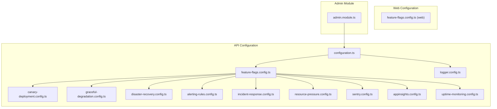
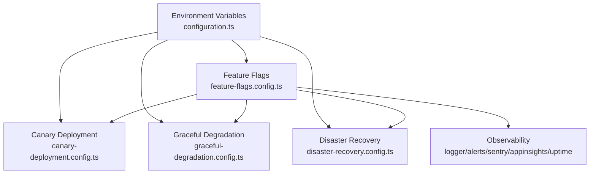
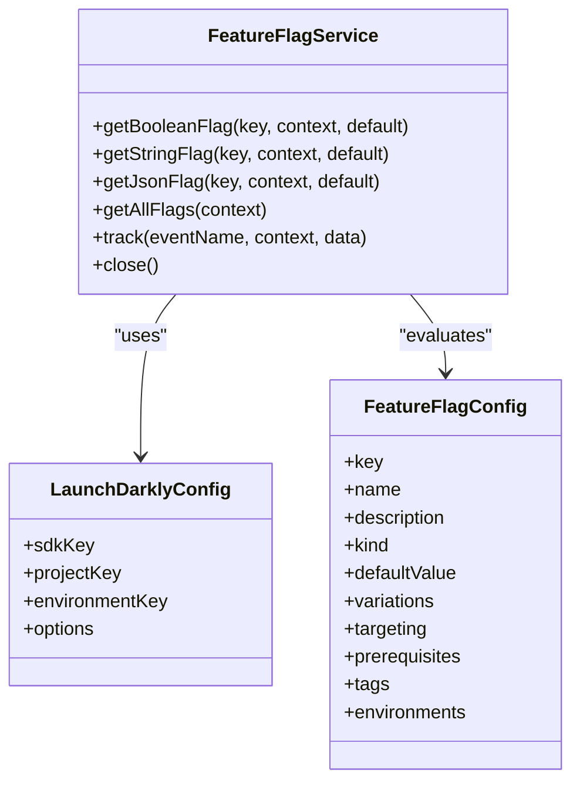
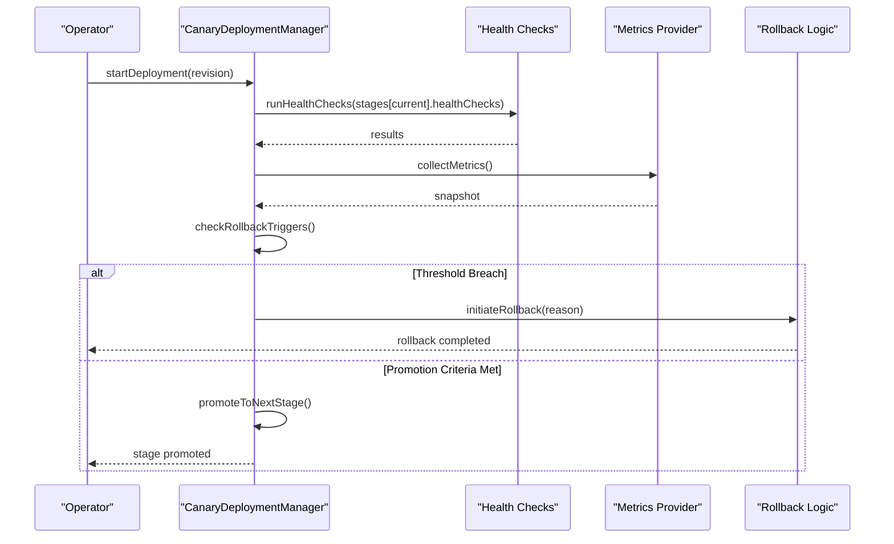
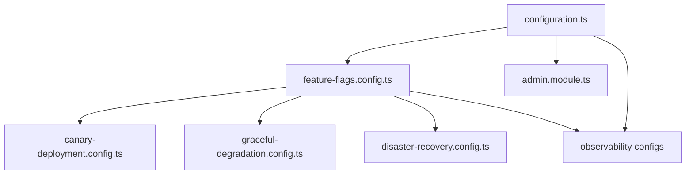

# Configuration & System Settings

<cite>
**Referenced Files in This Document**
- [configuration.ts](file://apps/api/src/config/configuration.ts)
- [feature-flags.config.ts](file://apps/api/src/config/feature-flags.config.ts)
- [feature-flags.config.ts](file://apps/web/src/config/feature-flags.config.ts)
- [canary-deployment.config.ts](file://apps/api/src/config/canary-deployment.config.ts)
- [graceful-degradation.config.ts](file://apps/api/src/config/graceful-degradation.config.ts)
- [disaster-recovery.config.ts](file://apps/api/src/config/disaster-recovery.config.ts)
- [logger.config.ts](file://apps/api/src/config/logger.config.ts)
- [alerting-rules.config.ts](file://apps/api/src/config/alerting-rules.config.ts)
- [incident-response.config.ts](file://apps/api/src/config/incident-response.config.ts)
- [resource-pressure.config.ts](file://apps/api/src/config/resource-pressure.config.ts)
- [sentry.config.ts](file://apps/api/src/config/sentry.config.ts)
- [appinsights.config.ts](file://apps/api/src/config/appinsights.config.ts)
- [uptime-monitoring.config.ts](file://apps/api/src/config/uptime-monitoring.config.ts)
- [admin.module.ts](file://apps/api/src/modules/admin/admin.module.ts)
</cite>

## Table of Contents
1. [Introduction](#introduction)
2. [Project Structure](#project-structure)
3. [Core Components](#core-components)
4. [Architecture Overview](#architecture-overview)
5. [Detailed Component Analysis](#detailed-component-analysis)
6. [Dependency Analysis](#dependency-analysis)
7. [Performance Considerations](#performance-considerations)
8. [Troubleshooting Guide](#troubleshooting-guide)
9. [Conclusion](#conclusion)
10. [Appendices](#appendices)

## Introduction
This document provides comprehensive guidance for configuration management and system settings administration across the Quiz-to-Build platform. It covers feature flag management (activation/deactivation, rollout strategies, A/B testing), system-wide settings (tenant customization, branding, operational parameters), environment-specific configurations, deployment settings, runtime parameter adjustments, audit logging, compliance, security policies, integration settings for external systems, backup and recovery, disaster recovery, and maintenance scheduling. It also includes practical examples, rollback procedures, validation workflows, configuration versioning, change management, and troubleshooting best practices.

## Project Structure
Configuration is organized into modular configuration files within the API application and web application, with dedicated modules for administration and monitoring. The configuration system supports environment-specific settings, feature flags, deployment strategies, resilience patterns, monitoring, and disaster recovery.

**Diagram sources**
- [configuration.ts:1-115](file://apps/api/src/config/configuration.ts#L1-L115)
- [feature-flags.config.ts:1-918](file://apps/api/src/config/feature-flags.config.ts#L1-L918)
- [feature-flags.config.ts:1-37](file://apps/web/src/config/feature-flags.config.ts#L1-L37)
- [canary-deployment.config.ts:1-1008](file://apps/api/src/config/canary-deployment.config.ts#L1-L1008)
- [graceful-degradation.config.ts:1-910](file://apps/api/src/config/graceful-degradation.config.ts#L1-L910)
- [disaster-recovery.config.ts:1-791](file://apps/api/src/config/disaster-recovery.config.ts#L1-L791)
- [logger.config.ts:1-62](file://apps/api/src/config/logger.config.ts#L1-L62)
- [alerting-rules.config.ts:1-772](file://apps/api/src/config/alerting-rules.config.ts#L1-L772)
- [incident-response.config.ts:1-1115](file://apps/api/src/config/incident-response.config.ts#L1-L1115)
- [resource-pressure.config.ts:1-906](file://apps/api/src/config/resource-pressure.config.ts#L1-L906)
- [sentry.config.ts:1-228](file://apps/api/src/config/sentry.config.ts#L1-L228)
- [appinsights.config.ts:1-610](file://apps/api/src/config/appinsights.config.ts#L1-L610)
- [uptime-monitoring.config.ts:1-379](file://apps/api/src/config/uptime-monitoring.config.ts#L1-L379)
- [admin.module.ts:1-14](file://apps/api/src/modules/admin/admin.module.ts#L1-L14)

**Section sources**
- [configuration.ts:1-115](file://apps/api/src/config/configuration.ts#L1-L115)
- [admin.module.ts:1-14](file://apps/api/src/modules/admin/admin.module.ts#L1-L14)

## Core Components
This section outlines the primary configuration domains and their responsibilities:

- Environment and Runtime Configuration: Centralized environment variable parsing, validation, and default values for ports, API prefixes, database connections, Redis, JWT, throttling, CORS, logging, email, Claude AI, frontend URLs, and token expirations.
- Feature Flags and A/B Testing: LaunchDarkly integration, flag targeting rules, weighted rollouts, prerequisite flags, environment toggles, and client-side feature flags for the web application.
- Deployment Strategies: Canary deployment with progressive rollout stages, health checks, rollback triggers, notification channels, and metrics collection.
- Resilience Patterns: Circuit breakers, fallback mechanisms, retry with exponential backoff, bulkheads, and rate limiting.
- Disaster Recovery: Targets (RTO/RPO), backup configurations, point-in-time recovery (PITR), failover modes, and detailed DR procedures.
- Observability: Logging configuration, alerting rules, incident response, resource pressure testing, Sentry error tracking, Application Insights telemetry, and uptime monitoring.
- Administration: Admin module integration for administrative operations.

**Section sources**
- [configuration.ts:1-115](file://apps/api/src/config/configuration.ts#L1-L115)
- [feature-flags.config.ts:1-918](file://apps/api/src/config/feature-flags.config.ts#L1-L918)
- [feature-flags.config.ts:1-37](file://apps/web/src/config/feature-flags.config.ts#L1-L37)
- [canary-deployment.config.ts:1-1008](file://apps/api/src/config/canary-deployment.config.ts#L1-L1008)
- [graceful-degradation.config.ts:1-910](file://apps/api/src/config/graceful-degradation.config.ts#L1-L910)
- [disaster-recovery.config.ts:1-791](file://apps/api/src/config/disaster-recovery.config.ts#L1-L791)
- [logger.config.ts:1-62](file://apps/api/src/config/logger.config.ts#L1-L62)
- [alerting-rules.config.ts:1-772](file://apps/api/src/config/alerting-rules.config.ts#L1-L772)
- [incident-response.config.ts:1-1115](file://apps/api/src/config/incident-response.config.ts#L1-L1115)
- [resource-pressure.config.ts:1-906](file://apps/api/src/config/resource-pressure.config.ts#L1-L906)
- [sentry.config.ts:1-228](file://apps/api/src/config/sentry.config.ts#L1-L228)
- [appinsights.config.ts:1-610](file://apps/api/src/config/appinsights.config.ts#L1-L610)
- [uptime-monitoring.config.ts:1-379](file://apps/api/src/config/uptime-monitoring.config.ts#L1-L379)

## Architecture Overview
The configuration architecture integrates environment-driven settings, feature flag orchestration, deployment automation, resilience engineering, and observability layers. It ensures safe rollouts, robust operations, and rapid incident response.

**Diagram sources**
- [configuration.ts:1-115](file://apps/api/src/config/configuration.ts#L1-L115)
- [feature-flags.config.ts:1-918](file://apps/api/src/config/feature-flags.config.ts#L1-L918)
- [canary-deployment.config.ts:1-1008](file://apps/api/src/config/canary-deployment.config.ts#L1-L1008)
- [graceful-degradation.config.ts:1-910](file://apps/api/src/config/graceful-degradation.config.ts#L1-L910)
- [disaster-recovery.config.ts:1-791](file://apps/api/src/config/disaster-recovery.config.ts#L1-L791)
- [logger.config.ts:1-62](file://apps/api/src/config/logger.config.ts#L1-L62)
- [alerting-rules.config.ts:1-772](file://apps/api/src/config/alerting-rules.config.ts#L1-L772)
- [sentry.config.ts:1-228](file://apps/api/src/config/sentry.config.ts#L1-L228)
- [appinsights.config.ts:1-610](file://apps/api/src/config/appinsights.config.ts#L1-L610)
- [uptime-monitoring.config.ts:1-379](file://apps/api/src/config/uptime-monitoring.config.ts#L1-L379)

## Detailed Component Analysis

### Environment and Runtime Configuration
- Purpose: Centralized environment validation and configuration building for production and development.
- Key behaviors:
  - Production validation for JWT secrets, CORS origins, and required environment variables.
  - Default values for ports, API prefix, database URL, Redis, JWT, bcrypt rounds, throttling, CORS, logging level, email, Claude AI, frontend URL, and token expirations.
- Best practices:
  - Always validate production environment variables during startup.
  - Use strong random secrets for JWT and avoid wildcard CORS in production.

**Section sources**
- [configuration.ts:1-115](file://apps/api/src/config/configuration.ts#L1-L115)

### Feature Flags and A/B Testing
- Purpose: Manage feature releases, gradual rollouts, and experimentation.
- Key behaviors:
  - LaunchDarkly integration with configurable SDK keys, project/environment keys, and streaming options.
  - Comprehensive flag definitions with targeting rules, weighted rollouts, prerequisites, and environment toggles.
  - Client-side feature flags for the web application controlled via Vite environment variables.
  - A/B test configurations with hypotheses, metrics, allocations, durations, and statuses.
- Rollout strategies:
  - Boolean, string, number, and JSON flags with targeting rules and weighted variations.
  - Prerequisites to gate dependent features.
  - Environment-specific activation and event tracking toggles.
- A/B Testing:
  - Random, percentage, and sticky allocations with exposure percentages.
  - Primary and secondary metrics, confidence thresholds, and winner determination.

**Diagram sources**
- [feature-flags.config.ts:1-918](file://apps/api/src/config/feature-flags.config.ts#L1-L918)

**Section sources**
- [feature-flags.config.ts:1-918](file://apps/api/src/config/feature-flags.config.ts#L1-L918)
- [feature-flags.config.ts:1-37](file://apps/web/src/config/feature-flags.config.ts#L1-L37)

### Canary Deployment
- Purpose: Safe, progressive rollouts with automated health checks and rollback.
- Key behaviors:
  - Four-stage rollout: 5% → 25% → 50% → 100% traffic.
  - Health checks for liveness, readiness, and general health endpoints.
  - Rollback triggers for error rates, latency, restarts, and resource usage.
  - Notification channels for Teams, Slack, email, and PagerDuty.
  - Metrics collection via Azure Monitor with custom KQL queries.
  - Manual approval gating at the 50% stage.
- Operations:
  - Start deployment, monitor health, promote stages, and initiate rollback if thresholds breached.

**Diagram sources**
- [canary-deployment.config.ts:521-796](file://apps/api/src/config/canary-deployment.config.ts#L521-L796)

**Section sources**
- [canary-deployment.config.ts:1-1008](file://apps/api/src/config/canary-deployment.config.ts#L1-L1008)

### Graceful Degradation
- Purpose: Maintain system stability under stress using circuit breakers, fallbacks, retries, bulkheads, and rate limiting.
- Key behaviors:
  - Circuit breaker thresholds, timeouts, and monitoring with alerting.
  - Fallback handlers for cache, queues, default values, alternative endpoints, and local cache.
  - Retry with exponential backoff and jitter, categorized by error types.
  - Bulkhead isolation with permits, queueing, and wait timeouts.
  - Rate limiting per user, globally, login attempts, email sending, and file uploads.
- Resilience levels define actions and disabled features during degradation.

**Section sources**
- [graceful-degradation.config.ts:1-910](file://apps/api/src/config/graceful-degradation.config.ts#L1-L910)

### Disaster Recovery
- Purpose: Define RTO/RPO targets, backup strategies, point-in-time recovery, failover, and DR procedures.
- Key behaviors:
  - Targets: RTO (recovery time), RPO (recovery point), availability, and downtime budgets.
  - Backup types: full, incremental, differential, transaction log, snapshot, continuous replication.
  - Storage: Azure Blob, Azure Backup Vault, S3, GCS, local with redundancy options.
  - Encryption: AES-256, RSA-2048/4096 with Key Vault integration.
  - PITR: Continuous WAL archiving with retention and geo-redundancy.
  - Failover: Active-passive with DNS failover, database read replicas, and storage failover.
  - Procedures: Region failover, database PITR, full system restore with step-by-step commands.
  - Testing: Quarterly DR drills, monthly backup restore tests, annual full exercises.

**Section sources**
- [disaster-recovery.config.ts:1-791](file://apps/api/src/config/disaster-recovery.config.ts#L1-L791)

### Observability and Monitoring
- Logging:
  - Pino logger with JSON in production, pretty-print in development, correlation IDs, and redaction of sensitive headers.
- Alerting:
  - Comprehensive alert rules for error rates, performance, security, business metrics, and resource usage with severity levels and escalation policies.
- Incident Response:
  - Severity definitions (SEV1–SEV4), escalation paths, runbooks, on-call schedules, and communication templates.
- Resource Pressure Testing:
  - CPU, memory, disk, network, and connection saturation tests with expected behaviors, alerts, and validation checks.
- Error Tracking:
  - Sentry integration with DSN, environment, release, tracing, profiling, filtering, and alerting rules.
- Application Insights:
  - Telemetry client initialization, custom metrics/events, dependency tracking, performance counters, availability, and middleware.
- Uptime Monitoring:
  - SLA targets, health endpoints, UptimeRobot configuration, alert channels, escalation, and status messages.

**Section sources**
- [logger.config.ts:1-62](file://apps/api/src/config/logger.config.ts#L1-L62)
- [alerting-rules.config.ts:1-772](file://apps/api/src/config/alerting-rules.config.ts#L1-L772)
- [incident-response.config.ts:1-1115](file://apps/api/src/config/incident-response.config.ts#L1-L1115)
- [resource-pressure.config.ts:1-906](file://apps/api/src/config/resource-pressure.config.ts#L1-L906)
- [sentry.config.ts:1-228](file://apps/api/src/config/sentry.config.ts#L1-L228)
- [appinsights.config.ts:1-610](file://apps/api/src/config/appinsights.config.ts#L1-L610)
- [uptime-monitoring.config.ts:1-379](file://apps/api/src/config/uptime-monitoring.config.ts#L1-L379)

### Administration Integration
- Admin module integrates Prisma for administrative operations and exposes controllers/services for administrative tasks.

**Section sources**
- [admin.module.ts:1-14](file://apps/api/src/modules/admin/admin.module.ts#L1-L14)

## Dependency Analysis
Configuration components interact across layers: environment configuration feeds feature flags, deployment, and resilience; feature flags drive canary deployments and A/B tests; observability monitors all components; disaster recovery protects the system; administration manages operational tasks.

**Diagram sources**
- [configuration.ts:1-115](file://apps/api/src/config/configuration.ts#L1-L115)
- [feature-flags.config.ts:1-918](file://apps/api/src/config/feature-flags.config.ts#L1-L918)
- [canary-deployment.config.ts:1-1008](file://apps/api/src/config/canary-deployment.config.ts#L1-L1008)
- [graceful-degradation.config.ts:1-910](file://apps/api/src/config/graceful-degradation.config.ts#L1-L910)
- [disaster-recovery.config.ts:1-791](file://apps/api/src/config/disaster-recovery.config.ts#L1-L791)
- [logger.config.ts:1-62](file://apps/api/src/config/logger.config.ts#L1-L62)
- [alerting-rules.config.ts:1-772](file://apps/api/src/config/alerting-rules.config.ts#L1-L772)
- [incident-response.config.ts:1-1115](file://apps/api/src/config/incident-response.config.ts#L1-L1115)
- [resource-pressure.config.ts:1-906](file://apps/api/src/config/resource-pressure.config.ts#L1-L906)
- [sentry.config.ts:1-228](file://apps/api/src/config/sentry.config.ts#L1-L228)
- [appinsights.config.ts:1-610](file://apps/api/src/config/appinsights.config.ts#L1-L610)
- [uptime-monitoring.config.ts:1-379](file://apps/api/src/config/uptime-monitoring.config.ts#L1-L379)
- [admin.module.ts:1-14](file://apps/api/src/modules/admin/admin.module.ts#L1-L14)

**Section sources**
- [configuration.ts:1-115](file://apps/api/src/config/configuration.ts#L1-L115)
- [feature-flags.config.ts:1-918](file://apps/api/src/config/feature-flags.config.ts#L1-L918)
- [canary-deployment.config.ts:1-1008](file://apps/api/src/config/canary-deployment.config.ts#L1-L1008)
- [graceful-degradation.config.ts:1-910](file://apps/api/src/config/graceful-degradation.config.ts#L1-L910)
- [disaster-recovery.config.ts:1-791](file://apps/api/src/config/disaster-recovery.config.ts#L1-L791)
- [logger.config.ts:1-62](file://apps/api/src/config/logger.config.ts#L1-L62)
- [alerting-rules.config.ts:1-772](file://apps/api/src/config/alerting-rules.config.ts#L1-L772)
- [incident-response.config.ts:1-1115](file://apps/api/src/config/incident-response.config.ts#L1-L1115)
- [resource-pressure.config.ts:1-906](file://apps/api/src/config/resource-pressure.config.ts#L1-L906)
- [sentry.config.ts:1-228](file://apps/api/src/config/sentry.config.ts#L1-L228)
- [appinsights.config.ts:1-610](file://apps/api/src/config/appinsights.config.ts#L1-L610)
- [uptime-monitoring.config.ts:1-379](file://apps/api/src/config/uptime-monitoring.config.ts#L1-L379)
- [admin.module.ts:1-14](file://apps/api/src/modules/admin/admin.module.ts#L1-L14)

## Performance Considerations
- Use environment-specific logging levels and transports to balance observability and overhead.
- Tune throttling, rate limiting, and bulkhead parameters to prevent overload during peak loads.
- Configure circuit breaker thresholds and fallbacks to maintain service continuity under dependency failures.
- Optimize backup schedules and PITR retention to meet RPO targets without excessive storage costs.
- Leverage canary deployments with health checks to detect regressions early and reduce risk.

## Troubleshooting Guide
Common configuration issues and resolutions:

- Production startup failures due to missing environment variables:
  - Validate required variables (JWT secrets, database URL, CORS origin) and ensure strong secrets are configured.
- Feature flags not applying:
  - Verify LaunchDarkly SDK keys, project/environment keys, and flag targeting rules; confirm client-side feature flags are set via Vite environment variables.
- Canary deployment stuck or failing:
  - Review health check endpoints, thresholds, and rollback triggers; check notification channels for alerts.
- Resilience patterns not triggering:
  - Confirm circuit breaker thresholds, fallback configurations, retry policies, and bulkhead settings align with observed error patterns.
- Disaster recovery procedures:
  - Practice failover and PITR steps; validate backup restoration and encryption keys; ensure failover DNS and database settings are correct.
- Observability gaps:
  - Check Sentry DSN and filtering rules; verify Application Insights connection string/instrumentation key; confirm alerting rules and escalation policies.
- Administrative operations:
  - Ensure Prisma module integration and admin controllers/services are properly configured.

**Section sources**
- [configuration.ts:1-115](file://apps/api/src/config/configuration.ts#L1-L115)
- [feature-flags.config.ts:1-918](file://apps/api/src/config/feature-flags.config.ts#L1-L918)
- [canary-deployment.config.ts:1-1008](file://apps/api/src/config/canary-deployment.config.ts#L1-L1008)
- [graceful-degradation.config.ts:1-910](file://apps/api/src/config/graceful-degradation.config.ts#L1-L910)
- [disaster-recovery.config.ts:1-791](file://apps/api/src/config/disaster-recovery.config.ts#L1-L791)
- [logger.config.ts:1-62](file://apps/api/src/config/logger.config.ts#L1-L62)
- [alerting-rules.config.ts:1-772](file://apps/api/src/config/alerting-rules.config.ts#L1-L772)
- [incident-response.config.ts:1-1115](file://apps/api/src/config/incident-response.config.ts#L1-L1115)
- [resource-pressure.config.ts:1-906](file://apps/api/src/config/resource-pressure.config.ts#L1-L906)
- [sentry.config.ts:1-228](file://apps/api/src/config/sentry.config.ts#L1-L228)
- [appinsights.config.ts:1-610](file://apps/api/src/config/appinsights.config.ts#L1-L610)
- [uptime-monitoring.config.ts:1-379](file://apps/api/src/config/uptime-monitoring.config.ts#L1-L379)
- [admin.module.ts:1-14](file://apps/api/src/modules/admin/admin.module.ts#L1-L14)

## Conclusion
The Quiz-to-Build configuration system provides a robust foundation for managing features, deployments, resilience, and operations. By leveraging environment-driven settings, feature flags, canary deployments, graceful degradation, comprehensive monitoring, and disaster recovery procedures, the platform maintains reliability, scalability, and operational excellence. Administrators should follow documented workflows for change management, validation, and rollback to ensure safe and effective configuration administration.

## Appendices

### Examples of Common Configuration Tasks
- Enable a feature flag for internal users:
  - Modify targeting rules to include internal user attributes and adjust weighted variations.
- Configure canary deployment for a new revision:
  - Set stage weights, health check intervals, and rollback thresholds; configure notification channels.
- Adjust rate limiting for login:
  - Update login rate limiter configuration to enforce stricter limits.
- Set up disaster recovery:
  - Configure backup retention, encryption, PITR, and failover settings; practice DR procedures.

### Rollback Procedures
- Canary rollback:
  - If thresholds breach, automatically shift traffic to stable revision and notify operators.
- Feature flag rollback:
  - Disable flag or adjust targeting rules to revert to control variation.
- Database PITR:
  - Stop application, restore to target time, update connection string, restart application, and verify.

### Validation Workflows
- Feature flag validation:
  - Confirm flag evaluations in staging; verify A/B test metrics and statistical significance.
- Deployment validation:
  - Run health checks, monitor latency and error rates, and validate metrics history.
- Disaster recovery validation:
  - Execute backup restore tests and DR drills; measure RTO/RPO achievement.

### Configuration Versioning and Change Management
- Maintain configuration in version control; use feature flags for safe experimentation.
- Document approval processes for production changes; enforce environment-specific validation.
- Track configuration drift and maintain audit trails for compliance.