# Document Review & Approval Workflows

<cite>
**Referenced Files in This Document**
- [approval-workflow.service.ts](file://apps/api/src/modules/decision-log/approval-workflow.service.ts)
- [decision-log.service.ts](file://apps/api/src/modules/decision-log/decision-log.service.ts)
- [document-generator.service.ts](file://apps/api/src/modules/document-generator/document-generator.service.ts)
- [document-admin.controller.ts](file://apps/api/src/modules/document-generator/controllers/document-admin.controller.ts)
- [document.controller.ts](file://apps/api/src/modules/document-generator/controllers/document.controller.ts)
- [notification.service.ts](file://apps/api/src/modules/notifications/notification.service.ts)
- [quality-scoring.service.ts](file://apps/api/src/modules/quality-scoring/services/quality-scoring.service.ts)
- [quality-calibrator.service.ts](file://apps/api/src/modules/document-generator/services/quality-calibrator.service.ts)
- [pdf-renderer.service.ts](file://apps/api/src/modules/document-generator/services/pdf-renderer.service.ts)
- [DocumentReviewPage.tsx](file://apps/web/src/pages/admin/DocumentReviewPage.tsx)
- [ReviewQueuePage.tsx](file://apps/web/src/pages/admin/ReviewQueuePage.tsx)
- [ReviewActions.tsx](file://apps/web/src/components/admin/ReviewActions.tsx)
- [admin.ts](file://apps/web/src/api/admin.ts)
- [04-user-stories-use-cases.md](file://docs/ba/04-user-stories-use-cases.md)
</cite>

## Table of Contents
1. [Introduction](#introduction)
2. [Project Structure](#project-structure)
3. [Core Components](#core-components)
4. [Architecture Overview](#architecture-overview)
5. [Detailed Component Analysis](#detailed-component-analysis)
6. [Dependency Analysis](#dependency-analysis)
7. [Performance Considerations](#performance-considerations)
8. [Troubleshooting Guide](#troubleshooting-guide)
9. [Conclusion](#conclusion)
10. [Appendices](#appendices)

## Introduction
This document describes the end-to-end document review and approval workflow system. It covers document submission, quality checks, review queue management, approval configuration, reviewer assignment, notifications, deadlines, quality assurance controls, audit trails, compliance reporting, versioning, change requests, and revision workflows. It also includes integration points with external systems, performance metrics, bottleneck identification, and optimization recommendations.

## Project Structure
The workflow spans both the API backend and the web frontend:
- Backend modules: Decision Log, Document Generator, Notifications, Quality Scoring
- Frontend pages: Review Queue and Document Review pages with action components
- Controllers and services orchestrate document lifecycle, approvals, and notifications

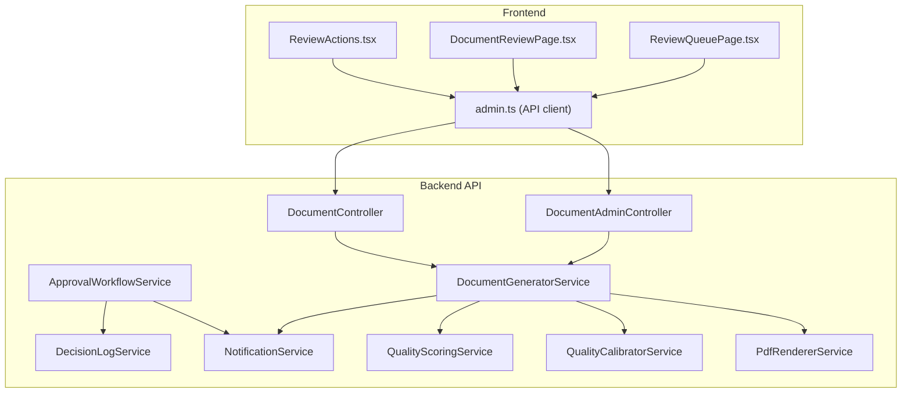

**Diagram sources**
- [document-admin.controller.ts:141-263](file://apps/api/src/modules/document-generator/controllers/document-admin.controller.ts#L141-L263)
- [document.controller.ts:107-277](file://apps/api/src/modules/document-generator/controllers/document.controller.ts#L107-L277)
- [document-generator.service.ts:434-608](file://apps/api/src/modules/document-generator/document-generator.service.ts#L434-L608)
- [approval-workflow.service.ts:108-243](file://apps/api/src/modules/decision-log/approval-workflow.service.ts#L108-L243)
- [decision-log.service.ts:49-123](file://apps/api/src/modules/decision-log/decision-log.service.ts#L49-L123)
- [notification.service.ts:396-413](file://apps/api/src/modules/notifications/notification.service.ts#L396-L413)
- [quality-scoring.service.ts:36-94](file://apps/api/src/modules/quality-scoring/services/quality-scoring.service.ts#L36-L94)
- [quality-calibrator.service.ts:206-267](file://apps/api/src/modules/document-generator/services/quality-calibrator.service.ts#L206-L267)
- [pdf-renderer.service.ts:131-205](file://apps/api/src/modules/document-generator/services/pdf-renderer.service.ts#L131-L205)

**Section sources**
- [document-admin.controller.ts:141-263](file://apps/api/src/modules/document-generator/controllers/document-admin.controller.ts#L141-L263)
- [document.controller.ts:107-277](file://apps/api/src/modules/document-generator/controllers/document.controller.ts#L107-L277)
- [document-generator.service.ts:434-608](file://apps/api/src/modules/document-generator/document-generator.service.ts#L434-L608)
- [approval-workflow.service.ts:108-243](file://apps/api/src/modules/decision-log/approval-workflow.service.ts#L108-L243)
- [decision-log.service.ts:49-123](file://apps/api/src/modules/decision-log/decision-log.service.ts#L49-L123)
- [notification.service.ts:396-413](file://apps/api/src/modules/notifications/notification.service.ts#L396-L413)
- [quality-scoring.service.ts:36-94](file://apps/api/src/modules/quality-scoring/services/quality-scoring.service.ts#L36-L94)
- [quality-calibrator.service.ts:206-267](file://apps/api/src/modules/document-generator/services/quality-calibrator.service.ts#L206-L267)
- [pdf-renderer.service.ts:131-205](file://apps/api/src/modules/document-generator/services/pdf-renderer.service.ts#L131-L205)

## Core Components
- Document Submission Pipeline: Validates session completion, required questions, creates PENDING document, generates content, uploads file, and notifies owners.
- Review Queue Management: Lists documents awaiting review, supports filtering, pagination, and batch operations.
- Approval Workflow: Enforces two-person rule for high-risk decisions, manages approval categories, permissions, expiration, and audit logs.
- Quality Assurance: Integrates quality scoring and calibrator services to influence generation parameters and content depth.
- Notifications: Emails for document readiness, approvals, rejections, and review requests.
- Versioning and Change Requests: Retrieves version history and download URLs for specific versions.

**Section sources**
- [document-generator.service.ts:37-136](file://apps/api/src/modules/document-generator/document-generator.service.ts#L37-L136)
- [document-admin.controller.ts:141-263](file://apps/api/src/modules/document-generator/controllers/document-admin.controller.ts#L141-L263)
- [approval-workflow.service.ts:108-243](file://apps/api/src/modules/decision-log/approval-workflow.service.ts#L108-L243)
- [quality-scoring.service.ts:36-94](file://apps/api/src/modules/quality-scoring/services/quality-scoring.service.ts#L36-L94)
- [quality-calibrator.service.ts:206-267](file://apps/api/src/modules/document-generator/services/quality-calibrator.service.ts#L206-L267)
- [notification.service.ts:396-413](file://apps/api/src/modules/notifications/notification.service.ts#L396-L413)
- [document.controller.ts:199-226](file://apps/api/src/modules/document-generator/controllers/document.controller.ts#L199-L226)

## Architecture Overview
The system follows a layered architecture:
- Presentation layer: React pages and components for review and queue management
- API layer: Controllers expose endpoints for admin and user operations
- Domain services: Document generation, approval workflow, quality scoring, notifications
- Persistence: Prisma ORM for audit logs, decisions, documents, and users
- External integrations: Email providers, Teams webhooks, storage services

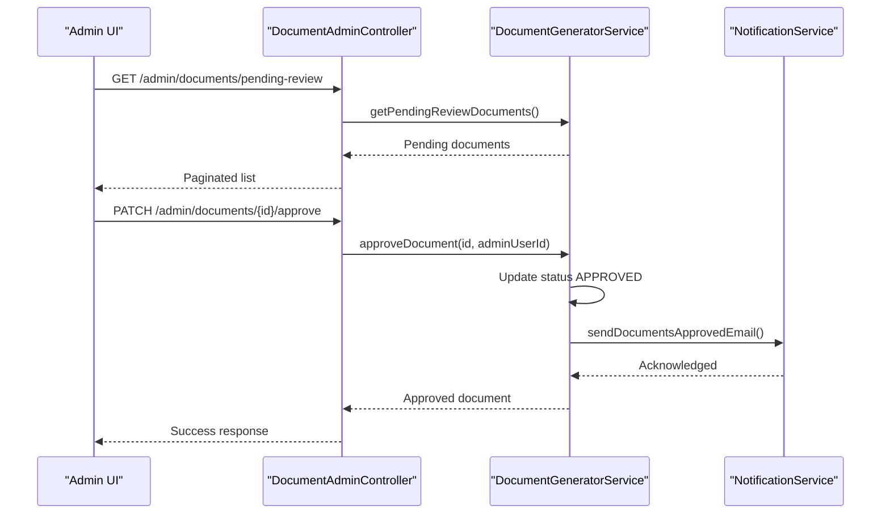

**Diagram sources**
- [document-admin.controller.ts:141-213](file://apps/api/src/modules/document-generator/controllers/document-admin.controller.ts#L141-L213)
- [document-generator.service.ts:445-481](file://apps/api/src/modules/document-generator/document-generator.service.ts#L445-L481)
- [notification.service.ts:373-391](file://apps/api/src/modules/notifications/notification.service.ts#L373-L391)

## Detailed Component Analysis

### Document Submission and Generation
- Validation: Session must be COMPLETED and required questions satisfied.
- Creation: Document record created with PENDING status.
- Generation: Attempts AI content generation; falls back to template-based if needed.
- Storage: Uploads file to storage service and updates metadata.
- Notifications: Sends readiness email to document owner.

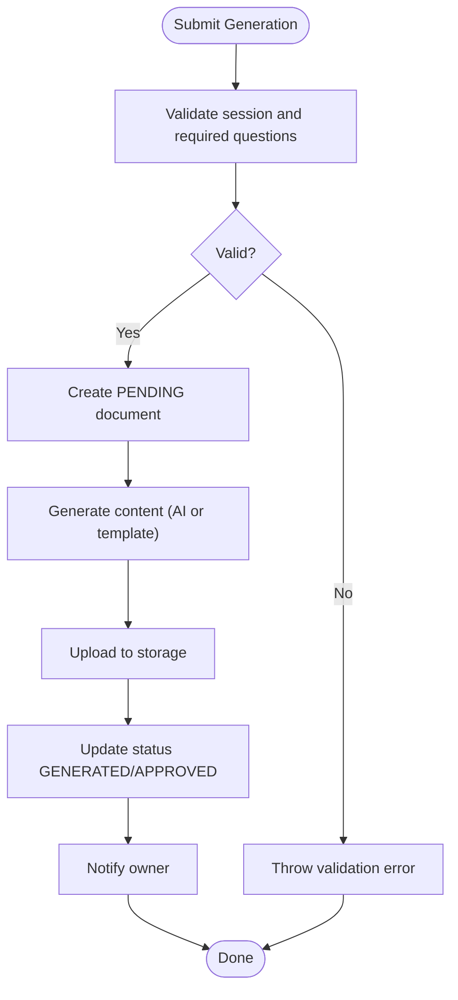

**Diagram sources**
- [document-generator.service.ts:37-136](file://apps/api/src/modules/document-generator/document-generator.service.ts#L37-L136)
- [document-generator.service.ts:142-219](file://apps/api/src/modules/document-generator/document-generator.service.ts#L142-L219)
- [notification.service.ts:350-367](file://apps/api/src/modules/notifications/notification.service.ts#L350-L367)

**Section sources**
- [document-generator.service.ts:37-136](file://apps/api/src/modules/document-generator/document-generator.service.ts#L37-L136)
- [document-generator.service.ts:142-219](file://apps/api/src/modules/document-generator/document-generator.service.ts#L142-L219)
- [notification.service.ts:350-367](file://apps/api/src/modules/notifications/notification.service.ts#L350-L367)

### Review Queue Management
- Admin endpoint lists documents with PENDING_REVIEW status.
- Frontend supports search, filtering, pagination, and batch operations.
- Approve/Reject actions trigger service methods and notifications.

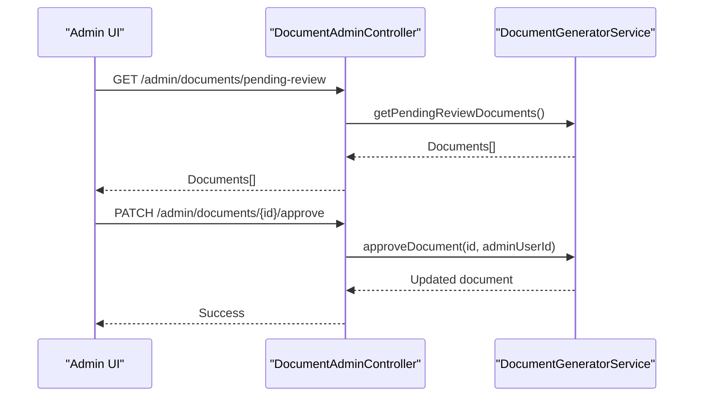

**Diagram sources**
- [document-admin.controller.ts:141-213](file://apps/api/src/modules/document-generator/controllers/document-admin.controller.ts#L141-L213)
- [document-generator.service.ts:434-481](file://apps/api/src/modules/document-generator/document-generator.service.ts#L434-L481)

**Section sources**
- [document-admin.controller.ts:141-213](file://apps/api/src/modules/document-generator/controllers/document-admin.controller.ts#L141-L213)
- [document-generator.service.ts:434-481](file://apps/api/src/modules/document-generator/document-generator.service.ts#L434-L481)
- [ReviewQueuePage.tsx:147-575](file://apps/web/src/pages/admin/ReviewQueuePage.tsx#L147-L575)
- [DocumentReviewPage.tsx:311-337](file://apps/web/src/pages/admin/DocumentReviewPage.tsx#L311-L337)
- [ReviewActions.tsx:1-44](file://apps/web/src/components/admin/ReviewActions.tsx#L1-L44)
- [admin.ts:78-120](file://apps/web/src/api/admin.ts#L78-L120)

### Approval Workflow Configuration
- Categories: Policy lock, ADR approval, high-risk decision, security exception, data access.
- Two-person rule: Requester cannot approve their own request; approver must have required role.
- Expiration: Default 72 hours; expired requests marked accordingly.
- Execution: On approval, associated actions executed (e.g., locking decisions).
- Audit: Full audit trail for all approval events.

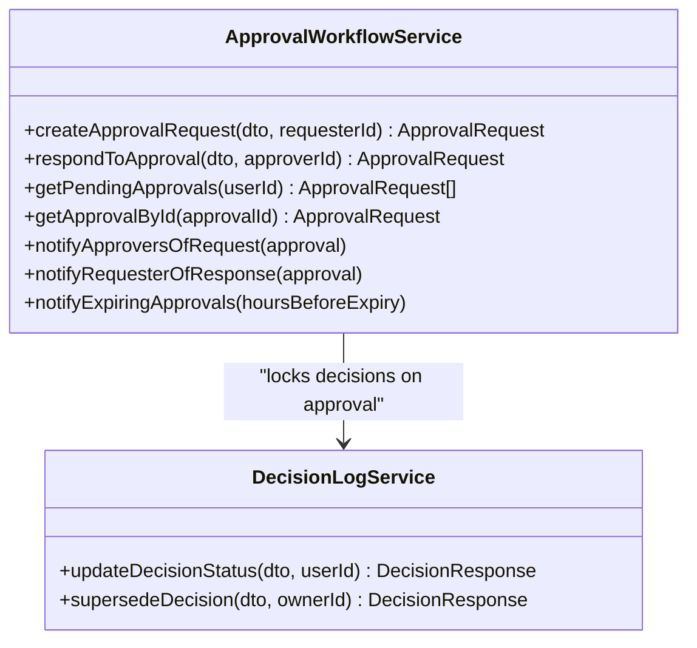

**Diagram sources**
- [approval-workflow.service.ts:108-243](file://apps/api/src/modules/decision-log/approval-workflow.service.ts#L108-L243)
- [decision-log.service.ts:87-123](file://apps/api/src/modules/decision-log/decision-log.service.ts#L87-L123)

**Section sources**
- [approval-workflow.service.ts:15-88](file://apps/api/src/modules/decision-log/approval-workflow.service.ts#L15-L88)
- [approval-workflow.service.ts:108-243](file://apps/api/src/modules/decision-log/approval-workflow.service.ts#L108-L243)
- [decision-log.service.ts:87-123](file://apps/api/src/modules/decision-log/decision-log.service.ts#L87-L123)

### Reviewer Assignment and Routing
- Eligibility: Based on role requirements per approval category.
- Exclusion: Requester cannot review their own request.
- Notification: Audit entries logged for sent notifications.

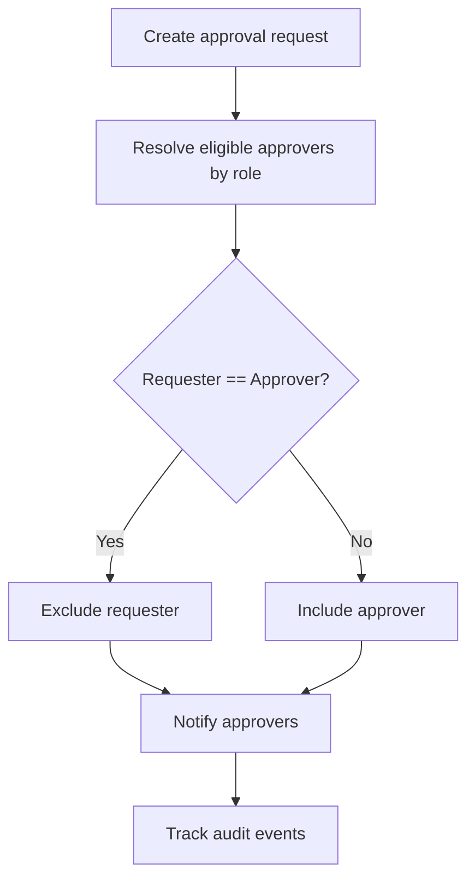

**Diagram sources**
- [approval-workflow.service.ts:589-613](file://apps/api/src/modules/decision-log/approval-workflow.service.ts#L589-L613)
- [approval-workflow.service.ts:533-585](file://apps/api/src/modules/decision-log/approval-workflow.service.ts#L533-L585)

**Section sources**
- [approval-workflow.service.ts:589-613](file://apps/api/src/modules/decision-log/approval-workflow.service.ts#L589-L613)
- [approval-workflow.service.ts:533-585](file://apps/api/src/modules/decision-log/approval-workflow.service.ts#L533-L585)

### Deadline Tracking and Escalation
- Expiration: Requests expire after configurable hours; status updated to EXPIRED.
- Warning: Scheduled notifications sent before expiry threshold.
- Escalation: Not implemented in code; can be extended via scheduled job invoking notifyExpiringApprovals.

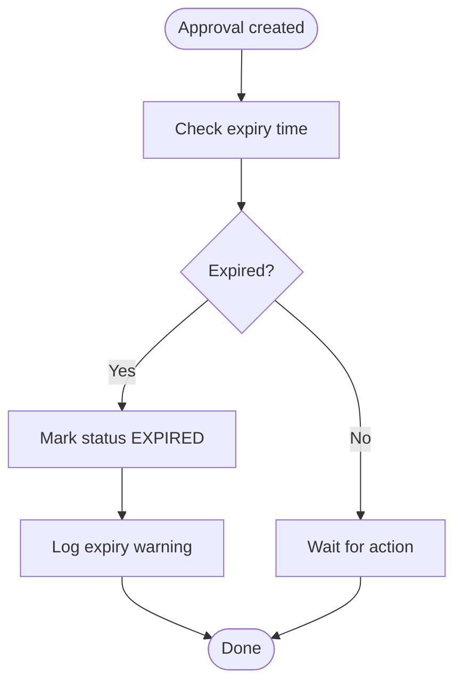

**Diagram sources**
- [approval-workflow.service.ts:184-189](file://apps/api/src/modules/decision-log/approval-workflow.service.ts#L184-L189)
- [approval-workflow.service.ts:618-651](file://apps/api/src/modules/decision-log/approval-workflow.service.ts#L618-L651)

**Section sources**
- [approval-workflow.service.ts:184-189](file://apps/api/src/modules/decision-log/approval-workflow.service.ts#L184-L189)
- [approval-workflow.service.ts:618-651](file://apps/api/src/modules/decision-log/approval-workflow.service.ts#L618-L651)

### Quality Assurance Controls
- Quality Scoring: Computes dimension scores, completeness, and confidence; generates recommendations.
- Quality Calibrator: Adjusts generation parameters by quality level (Basic to Enterprise).
- Integration: Document generation leverages quality insights to tailor content depth and features.

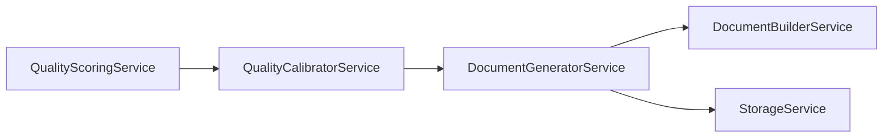

**Diagram sources**
- [quality-scoring.service.ts:36-94](file://apps/api/src/modules/quality-scoring/services/quality-scoring.service.ts#L36-L94)
- [quality-calibrator.service.ts:206-267](file://apps/api/src/modules/document-generator/services/quality-calibrator.service.ts#L206-L267)
- [document-generator.service.ts:142-219](file://apps/api/src/modules/document-generator/document-generator.service.ts#L142-L219)

**Section sources**
- [quality-scoring.service.ts:36-94](file://apps/api/src/modules/quality-scoring/services/quality-scoring.service.ts#L36-L94)
- [quality-calibrator.service.ts:206-267](file://apps/api/src/modules/document-generator/services/quality-calibrator.service.ts#L206-L267)
- [document-generator.service.ts:142-219](file://apps/api/src/modules/document-generator/document-generator.service.ts#L142-L219)

### Manual Review Processes and Notifications
- Manual review: Admin approves or rejects documents; updates status and records audit.
- Notifications: Emails for documents ready and approved; review pending notifications to admins.

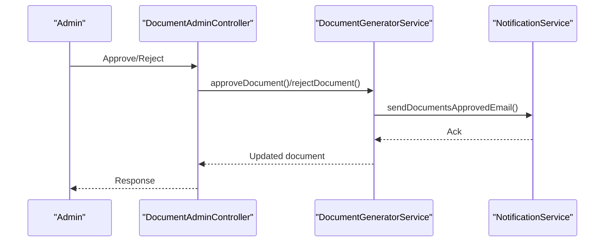

**Diagram sources**
- [document-admin.controller.ts:172-213](file://apps/api/src/modules/document-generator/controllers/document-admin.controller.ts#L172-L213)
- [document-generator.service.ts:445-513](file://apps/api/src/modules/document-generator/document-generator.service.ts#L445-L513)
- [notification.service.ts:373-391](file://apps/api/src/modules/notifications/notification.service.ts#L373-L391)

**Section sources**
- [document-admin.controller.ts:172-213](file://apps/api/src/modules/document-generator/controllers/document-admin.controller.ts#L172-L213)
- [document-generator.service.ts:445-513](file://apps/api/src/modules/document-generator/document-generator.service.ts#L445-L513)
- [notification.service.ts:373-391](file://apps/api/src/modules/notifications/notification.service.ts#L373-L391)

### Approval Decision Tracking and Audit Trails
- Decision Log: Append-only record with status transitions (DRAFT → LOCKED → SUPERSEDED/AMENDED).
- Audit Logs: Captures all actions (approval requests, grants, rejections, expiry warnings).
- Compliance: Export for audit includes decision chains and metadata.

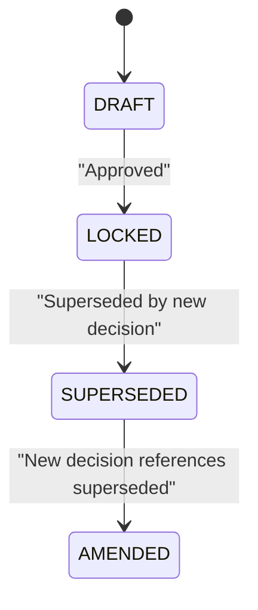

**Diagram sources**
- [decision-log.service.ts:19-36](file://apps/api/src/modules/decision-log/decision-log.service.ts#L19-L36)
- [decision-log.service.ts:135-188](file://apps/api/src/modules/decision-log/decision-log.service.ts#L135-L188)

**Section sources**
- [decision-log.service.ts:19-36](file://apps/api/src/modules/decision-log/decision-log.service.ts#L19-L36)
- [decision-log.service.ts:135-188](file://apps/api/src/modules/decision-log/decision-log.service.ts#L135-L188)
- [approval-workflow.service.ts:499-516](file://apps/api/src/modules/decision-log/approval-workflow.service.ts#L499-L516)

### Compliance Reporting
- Decision export: Includes session decisions, supersession chain, and timestamps.
- Audit events: Logged for all document and approval actions.

**Section sources**
- [decision-log.service.ts:235-269](file://apps/api/src/modules/decision-log/decision-log.service.ts#L235-L269)
- [decision-log.service.ts:352-367](file://apps/api/src/modules/decision-log/decision-log.service.ts#L352-L367)

### Document Versioning, Change Requests, and Revision Workflows
- Version history: Retrieve all versions of a document within the same session/type.
- Download URLs: Secure URLs for specific versions with status checks.
- Revision workflow: Approved documents can be superseded by new decisions; change requests handled via new submissions.

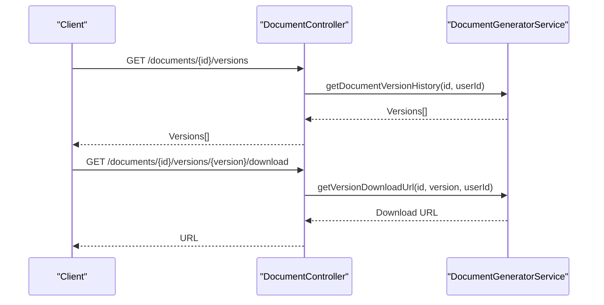

**Diagram sources**
- [document.controller.ts:199-226](file://apps/api/src/modules/document-generator/controllers/document.controller.ts#L199-L226)
- [document-generator.service.ts:311-366](file://apps/api/src/modules/document-generator/document-generator.service.ts#L311-L366)

**Section sources**
- [document.controller.ts:199-226](file://apps/api/src/modules/document-generator/controllers/document.controller.ts#L199-L226)
- [document-generator.service.ts:311-366](file://apps/api/src/modules/document-generator/document-generator.service.ts#L311-L366)

### Examples of Common Approval Scenarios
- Approve document: Admin selects a pending document and approves; system updates status and notifies owner.
- Reject document: Admin rejects with reason; system updates status and records rejection.
- Batch operations: Admin approves or rejects multiple documents atomically.
- Two-person rule: Requester cannot approve their own request; approver must meet role requirements.

**Section sources**
- [document-admin.controller.ts:172-263](file://apps/api/src/modules/document-generator/controllers/document-admin.controller.ts#L172-L263)
- [document-generator.service.ts:445-571](file://apps/api/src/modules/document-generator/document-generator.service.ts#L445-L571)
- [approval-workflow.service.ts:191-196](file://apps/api/src/modules/decision-log/approval-workflow.service.ts#L191-L196)

### Exception Handling and Workflow Customization
- Validation errors: Throws descriptive errors for invalid sessions, missing questions, or wrong statuses.
- Access control: Ensures only document owners or authorized users can access documents.
- Customization: Approval categories and role requirements can be extended; quality levels and prompts can be tuned.

**Section sources**
- [document-generator.service.ts:49-100](file://apps/api/src/modules/document-generator/document-generator.service.ts#L49-L100)
- [document-generator.service.ts:275-278](file://apps/api/src/modules/document-generator/document-generator.service.ts#L275-L278)
- [approval-workflow.service.ts:444-463](file://apps/api/src/modules/decision-log/approval-workflow.service.ts#L444-L463)

### Integration with External Systems and Compliance Frameworks
- Email providers: Brevo (primary), SendGrid (fallback), Console (dev).
- Teams webhooks: Adaptive cards for notifications.
- Storage: Upload/download URLs with expiration.
- Compliance: Audit logs and decision export support regulatory needs.

**Section sources**
- [notification.service.ts:165-187](file://apps/api/src/modules/notifications/notification.service.ts#L165-L187)
- [notification.service.ts:396-413](file://apps/api/src/modules/notifications/notification.service.ts#L396-L413)
- [pdf-renderer.service.ts:146-205](file://apps/api/src/modules/document-generator/services/pdf-renderer.service.ts#L146-L205)

## Dependency Analysis
The following diagram highlights key dependencies among modules and services:

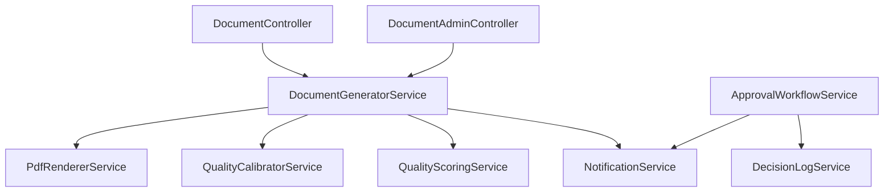

**Diagram sources**
- [document-admin.controller.ts:1-38](file://apps/api/src/modules/document-generator/controllers/document-admin.controller.ts#L1-L38)
- [document.controller.ts:1-38](file://apps/api/src/modules/document-generator/controllers/document.controller.ts#L1-L38)
- [document-generator.service.ts:1-32](file://apps/api/src/modules/document-generator/document-generator.service.ts#L1-L32)
- [approval-workflow.service.ts:1-9](file://apps/api/src/modules/decision-log/approval-workflow.service.ts#L1-L9)
- [decision-log.service.ts:1-17](file://apps/api/src/modules/decision-log/decision-log.service.ts#L1-L17)

**Section sources**
- [document-admin.controller.ts:1-38](file://apps/api/src/modules/document-generator/controllers/document-admin.controller.ts#L1-L38)
- [document.controller.ts:1-38](file://apps/api/src/modules/document-generator/controllers/document.controller.ts#L1-L38)
- [document-generator.service.ts:1-32](file://apps/api/src/modules/document-generator/document-generator.service.ts#L1-L32)
- [approval-workflow.service.ts:1-9](file://apps/api/src/modules/decision-log/approval-workflow.service.ts#L1-L9)
- [decision-log.service.ts:1-17](file://apps/api/src/modules/decision-log/decision-log.service.ts#L1-L17)

## Performance Considerations
- Asynchronous generation: Document generation runs synchronously in current implementation; consider offloading to background jobs for scalability.
- Batch operations: Use batch endpoints to minimize API overhead during mass approvals.
- Pagination: Ensure frontend and backend pagination limits prevent excessive payload sizes.
- Notifications: Email sends are fire-and-forget; consider queuing for reliability under load.
- PDF rendering: Puppeteer launches a browser; optimize by reusing instances or using serverless PDF services.

[No sources needed since this section provides general guidance]

## Troubleshooting Guide
Common issues and resolutions:
- Document not available for download: Status must be GENERATED or APPROVED; verify storage URL presence.
- Approval not permitted: Check requester-role conflict and required approver roles.
- Missing required questions: Ensure document type requirements are satisfied before generation.
- Expiration errors: Approvals outside the configured window are considered expired.

**Section sources**
- [document-generator.service.ts:374-387](file://apps/api/src/modules/document-generator/document-generator.service.ts#L374-L387)
- [document-generator.service.ts:495-498](file://apps/api/src/modules/document-generator/document-generator.service.ts#L495-L498)
- [approval-workflow.service.ts:191-196](file://apps/api/src/modules/decision-log/approval-workflow.service.ts#L191-L196)

## Conclusion
The document review and approval workflow integrates document generation, quality assurance, and governance controls. It enforces two-person rule approvals, maintains audit trails, and supports versioning and compliance reporting. Extending approval categories, adding escalation, and optimizing generation pipelines will further strengthen the system.

## Appendices
- User stories and acceptance flows are documented in the business analysis artifacts.

**Section sources**
- [04-user-stories-use-cases.md:633-672](file://docs/ba/04-user-stories-use-cases.md#L633-L672)