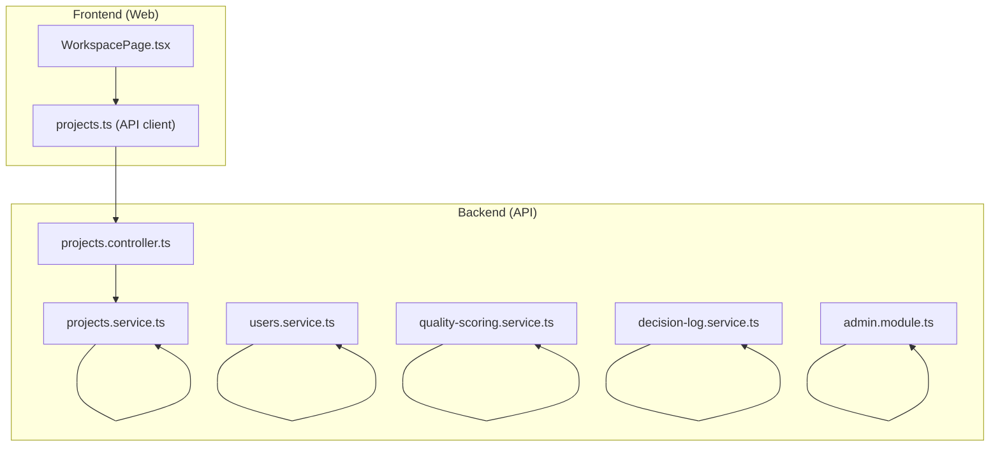
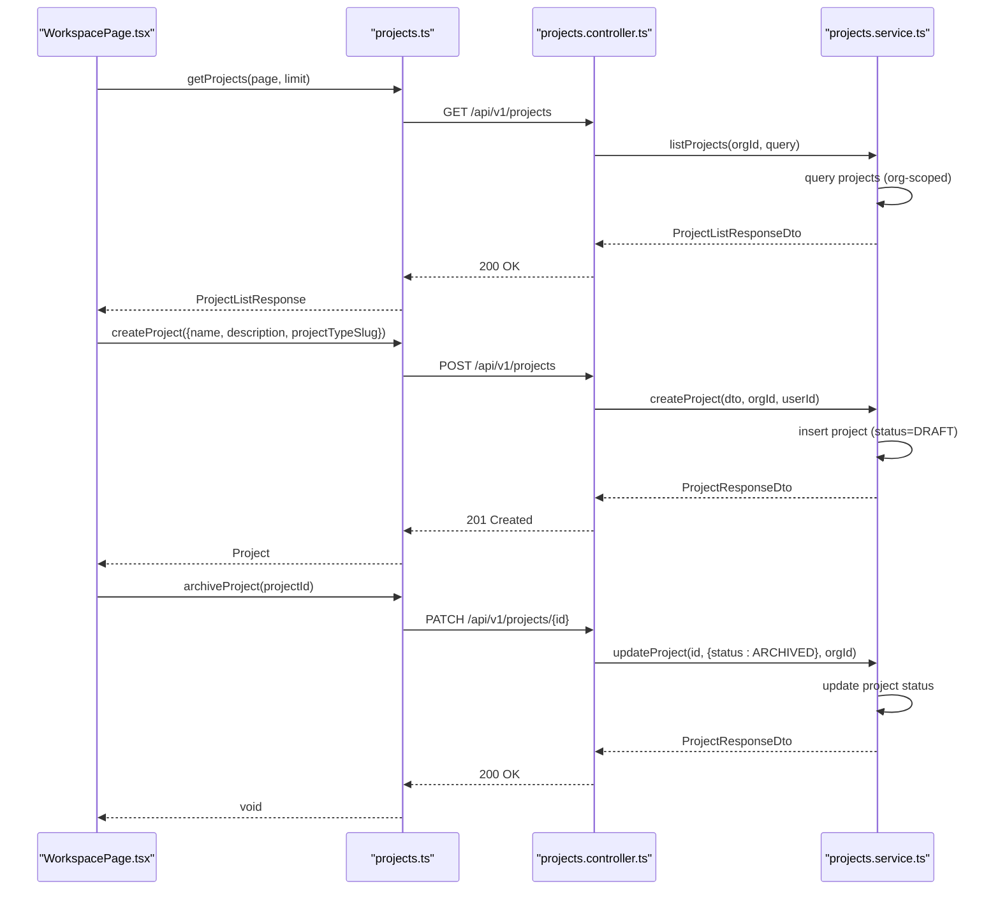
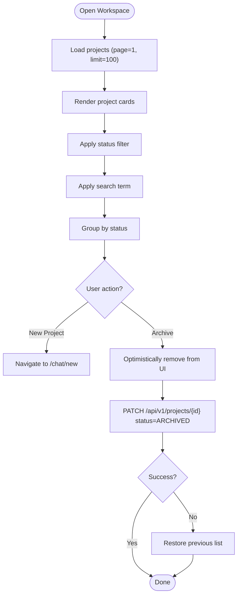
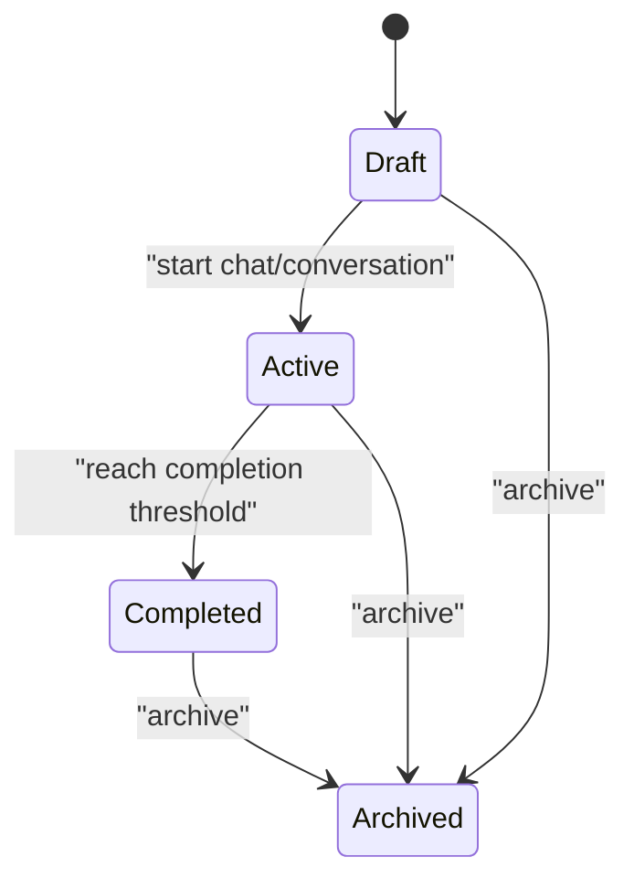
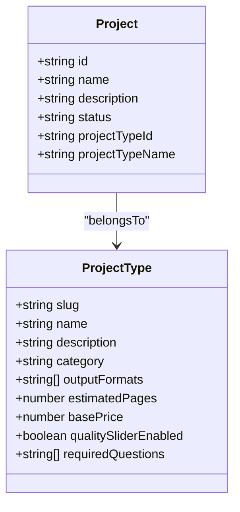
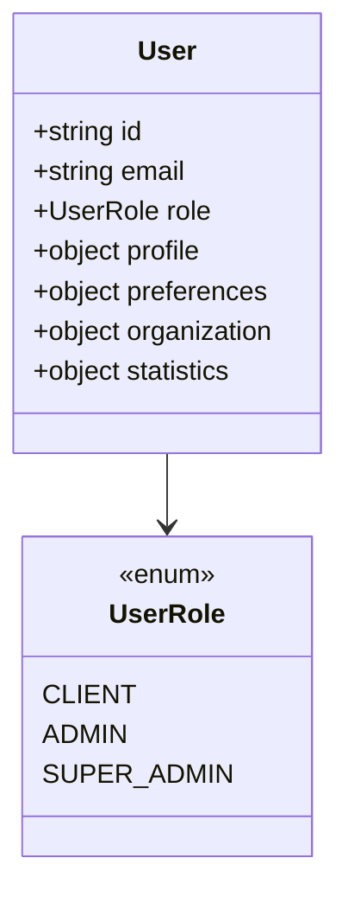
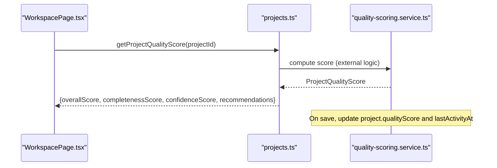
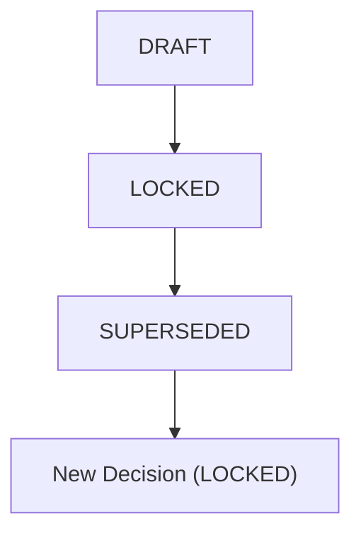
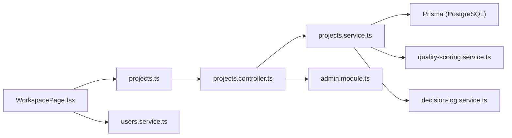

# Project Administration

<cite>
**Referenced Files in This Document**
- [WorkspacePage.tsx](file://apps/web/src/pages/workspace/WorkspacePage.tsx)
- [projects.ts](file://apps/web/src/api/projects.ts)
- [projects.controller.ts](file://apps/api/src/modules/projects/projects.controller.ts)
- [projects.service.ts](file://apps/api/src/modules/projects/projects.service.ts)
- [users.service.ts](file://apps/api/src/modules/users/users.service.ts)
- [quality-scoring.service.ts](file://apps/api/src/modules/quality-scoring/services/quality-scoring.service.ts)
- [decision-log.service.ts](file://apps/api/src/modules/decision-log/decision-log.service.ts)
- [admin.module.ts](file://apps/api/src/modules/admin/admin.module.ts)
- [14-onboarding-offboarding-procedures.md](file://docs/cto/14-onboarding-offboarding-procedures.md)
- [business-requirements.template.ts](file://apps/api/src/modules/document-generator/templates/business-requirements.template.ts)
- [business-plan.template.ts](file://apps/api/src/modules/document-generator/templates/business-plan.template.ts)
- [change-request.template.ts](file://apps/api/src/modules/document-generator/templates/change-request.template.ts)
- [project-types.seed.ts](file://prisma/seeds/project-types.seed.ts)
- [20260325000000_add_draft_project_status/migration.sql](file://prisma/migrations/20260325000000_add_draft_project_status/migration.sql)
- [dashboard.e2e.test.ts](file://e2e/admin/dashboard.e2e.test.ts)
</cite>

## Table of Contents
1. [Introduction](#introduction)
2. [Project Structure](#project-structure)
3. [Core Components](#core-components)
4. [Architecture Overview](#architecture-overview)
5. [Detailed Component Analysis](#detailed-component-analysis)
6. [Dependency Analysis](#dependency-analysis)
7. [Performance Considerations](#performance-considerations)
8. [Troubleshooting Guide](#troubleshooting-guide)
9. [Conclusion](#conclusion)
10. [Appendices](#appendices)

## Introduction
This document describes the project administration system for managing workspaces, projects, and team collaboration within the platform. It covers:
- Workspace creation and navigation
- Project lifecycle management (creation, status transitions, archival)
- Project settings and visibility controls
- Team member management and role-based access
- Quality scoring and progress monitoring
- Reporting and analytics capabilities
- Integration points with external tools
- UI customization and navigation patterns

## Project Structure
The administration system spans the frontend web application and the backend API:
- Frontend: Workspace hub, project cards, filtering, and actions
- Backend: Projects controller/service, user profiles, quality scoring, decision logs, and admin module scaffolding

**Diagram sources**
- [WorkspacePage.tsx:187-376](file://apps/web/src/pages/workspace/WorkspacePage.tsx#L187-L376)
- [projects.ts:46-93](file://apps/web/src/api/projects.ts#L46-L93)
- [projects.controller.ts:42-147](file://apps/api/src/modules/projects/projects.controller.ts#L42-L147)
- [projects.service.ts:24-188](file://apps/api/src/modules/projects/projects.service.ts#L24-L188)
- [users.service.ts:37-203](file://apps/api/src/modules/users/users.service.ts#L37-L203)
- [quality-scoring.service.ts:301-338](file://apps/api/src/modules/quality-scoring/services/quality-scoring.service.ts#L301-L338)
- [decision-log.service.ts:37-396](file://apps/api/src/modules/decision-log/decision-log.service.ts#L37-L396)
- [admin.module.ts:1-14](file://apps/api/src/modules/admin/admin.module.ts#L1-L14)

**Section sources**
- [WorkspacePage.tsx:187-376](file://apps/web/src/pages/workspace/WorkspacePage.tsx#L187-L376)
- [projects.ts:46-93](file://apps/web/src/api/projects.ts#L46-L93)
- [projects.controller.ts:42-147](file://apps/api/src/modules/projects/projects.controller.ts#L42-L147)
- [projects.service.ts:24-188](file://apps/api/src/modules/projects/projects.service.ts#L24-L188)
- [users.service.ts:37-203](file://apps/api/src/modules/users/users.service.ts#L37-L203)
- [quality-scoring.service.ts:301-338](file://apps/api/src/modules/quality-scoring/services/quality-scoring.service.ts#L301-L338)
- [decision-log.service.ts:37-396](file://apps/api/src/modules/decision-log/decision-log.service.ts#L37-L396)
- [admin.module.ts:1-14](file://apps/api/src/modules/admin/admin.module.ts#L1-L14)

## Core Components
- Workspace hub: Lists projects, supports filtering, searching, and archiving
- Project API client: Fetches projects, creates projects, archives projects, retrieves quality scores
- Projects controller/service: Enforces organization scoping, handles CRUD and status updates
- Users service: Provides user profiles and statistics used in collaboration contexts
- Quality scoring service: Computes and persists project quality scores
- Decision log service: Append-only decision records with supersession support
- Admin module: Foundation for administrative features

**Section sources**
- [WorkspacePage.tsx:187-376](file://apps/web/src/pages/workspace/WorkspacePage.tsx#L187-L376)
- [projects.ts:46-93](file://apps/web/src/api/projects.ts#L46-L93)
- [projects.controller.ts:42-147](file://apps/api/src/modules/projects/projects.controller.ts#L42-L147)
- [projects.service.ts:24-188](file://apps/api/src/modules/projects/projects.service.ts#L24-L188)
- [users.service.ts:37-203](file://apps/api/src/modules/users/users.service.ts#L37-L203)
- [quality-scoring.service.ts:301-338](file://apps/api/src/modules/quality-scoring/services/quality-scoring.service.ts#L301-L338)
- [decision-log.service.ts:37-396](file://apps/api/src/modules/decision-log/decision-log.service.ts#L37-L396)
- [admin.module.ts:1-14](file://apps/api/src/modules/admin/admin.module.ts#L1-L14)

## Architecture Overview
The system follows a layered architecture:
- Presentation layer: React components render the workspace and project cards
- API layer: NestJS controllers expose REST endpoints protected by JWT
- Domain services: Projects, Users, Quality Scoring, Decision Log encapsulate business logic
- Persistence: Prisma ORM with PostgreSQL

**Diagram sources**
- [WorkspacePage.tsx:195-223](file://apps/web/src/pages/workspace/WorkspacePage.tsx#L195-L223)
- [projects.ts:46-93](file://apps/web/src/api/projects.ts#L46-L93)
- [projects.controller.ts:68-145](file://apps/api/src/modules/projects/projects.controller.ts#L68-L145)
- [projects.service.ts:32-153](file://apps/api/src/modules/projects/projects.service.ts#L32-L153)

## Detailed Component Analysis

### Workspace Hub and Navigation
- Loads projects with pagination and organization scoping
- Filters by status (all, active, completed, archived)
- Searches by name or project type
- Provides quick actions: new project, archive project
- Displays progress indicators and quality scores

**Diagram sources**
- [WorkspacePage.tsx:195-247](file://apps/web/src/pages/workspace/WorkspacePage.tsx#L195-L247)
- [projects.ts:46-93](file://apps/web/src/api/projects.ts#L46-L93)

**Section sources**
- [WorkspacePage.tsx:187-376](file://apps/web/src/pages/workspace/WorkspacePage.tsx#L187-L376)
- [projects.ts:46-93](file://apps/web/src/api/projects.ts#L46-L93)

### Project Lifecycle Management
- Creation: Initializes a project with status DRAFT and optional project type
- Updates: Name, description, and status transitions are supported
- Organization scoping: All operations are restricted to the authenticated user’s organization
- Archival: Projects are marked ARCHIVED and excluded from listings

**Diagram sources**
- [20260325000000_add_draft_project_status/migration.sql:1-2](file://prisma/migrations/20260325000000_add_draft_project_status/migration.sql#L1-L2)
- [projects.service.ts:103-116](file://apps/api/src/modules/projects/projects.service.ts#L103-L116)

**Section sources**
- [projects.controller.ts:103-145](file://apps/api/src/modules/projects/projects.controller.ts#L103-L145)
- [projects.service.ts:88-153](file://apps/api/src/modules/projects/projects.service.ts#L88-L153)
- [20260325000000_add_draft_project_status/migration.sql:1-2](file://prisma/migrations/20260325000000_add_draft_project_status/migration.sql#L1-L2)

### Project Settings and Visibility Controls
- Project type association: Creation supports selecting a project type slug, linking to templates and outputs
- Project type metadata: Includes categories, output formats, pricing, and required questions
- Visibility: Projects are organization-scoped; access control enforced by controller guards

**Diagram sources**
- [project-types.seed.ts:383-425](file://prisma/seeds/project-types.seed.ts#L383-L425)
- [projects.service.ts:93-116](file://apps/api/src/modules/projects/projects.service.ts#L93-L116)

**Section sources**
- [project-types.seed.ts:383-425](file://prisma/seeds/project-types.seed.ts#L383-L425)
- [projects.controller.ts:103-120](file://apps/api/src/modules/projects/projects.controller.ts#L103-L120)
- [projects.service.ts:88-116](file://apps/api/src/modules/projects/projects.service.ts#L88-L116)

### Team Member Management and Roles
- User profiles include role, preferences, organization, and statistics
- Access control: Controllers enforce organization scoping and role checks
- Role matrix and access levels documented for onboarding/offboarding procedures

**Diagram sources**
- [users.service.ts:7-35](file://apps/api/src/modules/users/users.service.ts#L7-L35)
- [14-onboarding-offboarding-procedures.md:573-607](file://docs/cto/14-onboarding-offboarding-procedures.md#L573-L607)

**Section sources**
- [users.service.ts:37-203](file://apps/api/src/modules/users/users.service.ts#L37-L203)
- [14-onboarding-offboarding-procedures.md:573-607](file://docs/cto/14-onboarding-offboarding-procedures.md#L573-L607)

### Collaboration Features
- Real-time collaboration, version history, undo/redo, and comments are part of the collaboration module
- These features enable team editing and review workflows within projects

**Section sources**
- [WorkspacePage.tsx:187-376](file://apps/web/src/pages/workspace/WorkspacePage.tsx#L187-L376)

### Quality Scoring and Progress Monitoring
- Quality score computed and persisted per project
- Score includes overall, completeness, and confidence metrics with recommendations
- Last activity timestamp updated upon score persistence

**Diagram sources**
- [projects.ts:72-75](file://apps/web/src/api/projects.ts#L72-L75)
- [quality-scoring.service.ts:322-338](file://apps/api/src/modules/quality-scoring/services/quality-scoring.service.ts#L322-L338)

**Section sources**
- [projects.ts:34-41](file://apps/web/src/api/projects.ts#L34-L41)
- [quality-scoring.service.ts:301-338](file://apps/api/src/modules/quality-scoring/services/quality-scoring.service.ts#L301-L338)

### Decision Records and Compliance
- Append-only decision log with status workflow: DRAFT → LOCKED → (SUPERSEDED)
- Supersession mechanism preserves audit trail and allows corrections
- Export and supersession chain retrieval for compliance

**Diagram sources**
- [decision-log.service.ts:31-36](file://apps/api/src/modules/decision-log/decision-log.service.ts#L31-L36)
- [decision-log.service.ts:135-188](file://apps/api/src/modules/decision-log/decision-log.service.ts#L135-L188)

**Section sources**
- [decision-log.service.ts:49-188](file://apps/api/src/modules/decision-log/decision-log.service.ts#L49-L188)

### Reporting and Analytics
- Project quality scores and progress indicators are surfaced in the workspace
- Document templates define content mappings and defaults for business plans, requirements, and change requests
- Analytics configurations and feature flags are managed at runtime

**Section sources**
- [WorkspacePage.tsx:131-136](file://apps/web/src/pages/workspace/WorkspacePage.tsx#L131-L136)
- [business-plan.template.ts:489-496](file://apps/api/src/modules/document-generator/templates/business-plan.template.ts#L489-L496)
- [business-requirements.template.ts:322-357](file://apps/api/src/modules/document-generator/templates/business-requirements.template.ts#L322-L357)
- [change-request.template.ts:60-124](file://apps/api/src/modules/document-generator/templates/change-request.template.ts#L60-L124)

### Admin and Approval Workflows
- Admin module is present and can be extended for approvals and audits
- E2E tests indicate planned approval routes, currently skipped

**Section sources**
- [admin.module.ts:1-14](file://apps/api/src/modules/admin/admin.module.ts#L1-L14)
- [dashboard.e2e.test.ts:131-199](file://e2e/admin/dashboard.e2e.test.ts#L131-L199)

## Dependency Analysis
- Frontend depends on the API client for project operations
- Controller depends on ProjectsService for business logic
- ProjectsService depends on Prisma for persistence
- UsersService provides user context for collaboration and access control
- Quality scoring and decision log services operate independently but integrate with project data

**Diagram sources**
- [WorkspacePage.tsx:187-376](file://apps/web/src/pages/workspace/WorkspacePage.tsx#L187-L376)
- [projects.ts:46-93](file://apps/web/src/api/projects.ts#L46-L93)
- [projects.controller.ts:42-147](file://apps/api/src/modules/projects/projects.controller.ts#L42-L147)
- [projects.service.ts:24-188](file://apps/api/src/modules/projects/projects.service.ts#L24-L188)
- [users.service.ts:37-203](file://apps/api/src/modules/users/users.service.ts#L37-L203)
- [quality-scoring.service.ts:301-338](file://apps/api/src/modules/quality-scoring/services/quality-scoring.service.ts#L301-L338)
- [decision-log.service.ts:37-396](file://apps/api/src/modules/decision-log/decision-log.service.ts#L37-L396)
- [admin.module.ts:1-14](file://apps/api/src/modules/admin/admin.module.ts#L1-L14)

**Section sources**
- [projects.controller.ts:42-147](file://apps/api/src/modules/projects/projects.controller.ts#L42-L147)
- [projects.service.ts:24-188](file://apps/api/src/modules/projects/projects.service.ts#L24-L188)
- [users.service.ts:37-203](file://apps/api/src/modules/users/users.service.ts#L37-L203)
- [quality-scoring.service.ts:301-338](file://apps/api/src/modules/quality-scoring/services/quality-scoring.service.ts#L301-L338)
- [decision-log.service.ts:37-396](file://apps/api/src/modules/decision-log/decision-log.service.ts#L37-L396)
- [admin.module.ts:1-14](file://apps/api/src/modules/admin/admin.module.ts#L1-L14)

## Performance Considerations
- Pagination: API supports page and limit parameters to avoid large payloads
- Optimistic UI updates: Workspace removes items immediately on archive and rolls back on error
- Sorting: Projects are ordered by last activity to surface recent work
- Quality scoring: Computation occurs asynchronously; UI displays cached scores and updates on save

[No sources needed since this section provides general guidance]

## Troubleshooting Guide
- Access denied errors: Ensure the user belongs to an organization; controllers enforce organization scoping
- Project not found: Verify the project ID and organization membership
- Archive failures: UI rolls back optimistic removal; check network and server logs
- Quality scoring errors: Confirm score computation completes and project updates last activity timestamp

**Section sources**
- [projects.controller.ts:49-66](file://apps/api/src/modules/projects/projects.controller.ts#L49-L66)
- [projects.service.ts:126-153](file://apps/api/src/modules/projects/projects.service.ts#L126-L153)
- [WorkspacePage.tsx:212-223](file://apps/web/src/pages/workspace/WorkspacePage.tsx#L212-L223)
- [quality-scoring.service.ts:322-338](file://apps/api/src/modules/quality-scoring/services/quality-scoring.service.ts#L322-L338)

## Conclusion
The project administration system provides a robust foundation for workspace management, project lifecycle control, quality monitoring, and collaboration. It enforces organization scoping, supports role-based access, and integrates with decision records and document generation templates. Administrative capabilities can be extended via the admin module and approval workflows.

[No sources needed since this section summarizes without analyzing specific files]

## Appendices

### Example Tasks and Workflows
- Create a new project: Navigate to “New Project” and select a project type; project initializes as DRAFT
- Archive a project: Open the project menu and choose Archive; operation is optimistic and reversible on error
- Monitor progress: Use the chat progress bar and quality score badges in the workspace
- Export decision records: Use decision log export and supersession chain APIs for compliance

**Section sources**
- [WorkspacePage.tsx:257-263](file://apps/web/src/pages/workspace/WorkspacePage.tsx#L257-L263)
- [WorkspacePage.tsx:212-223](file://apps/web/src/pages/workspace/WorkspacePage.tsx#L212-L223)
- [decision-log.service.ts:235-269](file://apps/api/src/modules/decision-log/decision-log.service.ts#L235-L269)

### Integration Notes
- Document templates: Business requirements, business plan, and change request templates define mappings and defaults
- Admin module: Ready for approvals and audit exports; see e2e tests for planned routes

**Section sources**
- [business-requirements.template.ts:322-357](file://apps/api/src/modules/document-generator/templates/business-requirements.template.ts#L322-L357)
- [business-plan.template.ts:489-496](file://apps/api/src/modules/document-generator/templates/business-plan.template.ts#L489-L496)
- [change-request.template.ts:60-124](file://apps/api/src/modules/document-generator/templates/change-request.template.ts#L60-L124)
- [admin.module.ts:1-14](file://apps/api/src/modules/admin/admin.module.ts#L1-L14)
- [dashboard.e2e.test.ts:131-199](file://e2e/admin/dashboard.e2e.test.ts#L131-L199)