# System Monitoring & Analytics

<cite>
**Referenced Files in This Document**
- [alerting-rules.config.ts](file://apps/api/src/config/alerting-rules.config.ts)
- [sentry.config.ts](file://apps/api/src/config/sentry.config.ts)
- [uptime-monitoring.config.ts](file://apps/api/src/config/uptime-monitoring.config.ts)
- [health.controller.ts](file://apps/api/src/health.controller.ts)
- [analytics.config.ts](file://apps/web/src/config/analytics.config.ts)
- [Analytics.tsx](file://apps/web/src/components/analytics/Analytics.tsx)
- [AnalyticsDashboardPage.tsx](file://apps/web/src/pages/analytics/AnalyticsDashboardPage.tsx)
- [scoring-analytics.ts](file://apps/api/src/modules/scoring-engine/strategies/scoring-analytics.ts)
- [main.tf](file://infrastructure/terraform/modules/monitoring/main.tf)
- [health-monitor.ps1](file://scripts/health-monitor.ps1)
</cite>

## Table of Contents
1. [Introduction](#introduction)
2. [Project Structure](#project-structure)
3. [Core Components](#core-components)
4. [Architecture Overview](#architecture-overview)
5. [Detailed Component Analysis](#detailed-component-analysis)
6. [Dependency Analysis](#dependency-analysis)
7. [Performance Considerations](#performance-considerations)
8. [Troubleshooting Guide](#troubleshooting-guide)
9. [Conclusion](#conclusion)
10. [Appendices](#appendices)

## Introduction
This document describes the system monitoring and analytics dashboard for the Quiz-to-Build platform. It covers key performance indicators (KPIs), real-time monitoring (health checks, performance alerts, capacity planning), analytics reporting (trend analysis, comparative reporting, custom dashboards), user behavior analytics, feature adoption metrics, conversion tracking, system health monitoring, error tracking, and incident response dashboards. It also details data visualization components, interactive charts, drill-down capabilities, integration points with external monitoring tools, and practical troubleshooting guidance.

## Project Structure
The monitoring and analytics capabilities span three primary areas:
- Backend API monitoring and alerting (NestJS)
- Frontend analytics and user behavior tracking (React)
- Infrastructure monitoring (Azure Application Insights and Log Analytics)

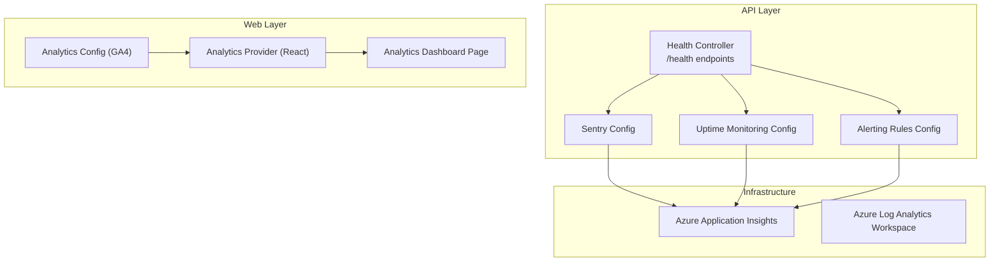

**Diagram sources**
- [health.controller.ts:68-141](file://apps/api/src/health.controller.ts#L68-L141)
- [alerting-rules.config.ts:61-478](file://apps/api/src/config/alerting-rules.config.ts#L61-L478)
- [sentry.config.ts:51-127](file://apps/api/src/config/sentry.config.ts#L51-L127)
- [uptime-monitoring.config.ts:100-149](file://apps/api/src/config/uptime-monitoring.config.ts#L100-L149)
- [analytics.config.ts:44-73](file://apps/web/src/config/analytics.config.ts#L44-L73)
- [Analytics.tsx:240-347](file://apps/web/src/components/analytics/Analytics.tsx#L240-L347)
- [AnalyticsDashboardPage.tsx:299-480](file://apps/web/src/pages/analytics/AnalyticsDashboardPage.tsx#L299-L480)
- [main.tf:3-21](file://infrastructure/terraform/modules/monitoring/main.tf#L3-L21)

**Section sources**
- [health.controller.ts:68-141](file://apps/api/src/health.controller.ts#L68-L141)
- [alerting-rules.config.ts:61-478](file://apps/api/src/config/alerting-rules.config.ts#L61-L478)
- [sentry.config.ts:51-127](file://apps/api/src/config/sentry.config.ts#L51-L127)
- [uptime-monitoring.config.ts:100-149](file://apps/api/src/config/uptime-monitoring.config.ts#L100-L149)
- [analytics.config.ts:44-73](file://apps/web/src/config/analytics.config.ts#L44-L73)
- [Analytics.tsx:240-347](file://apps/web/src/components/analytics/Analytics.tsx#L240-L347)
- [AnalyticsDashboardPage.tsx:299-480](file://apps/web/src/pages/analytics/AnalyticsDashboardPage.tsx#L299-L480)
- [main.tf:3-21](file://infrastructure/terraform/modules/monitoring/main.tf#L3-L21)

## Core Components
- Real-time health monitoring: Kubernetes-style liveness, readiness, and startup probes with detailed dependency checks.
- Alerting framework: Configurable alert rules across error, performance, security, business, and resource categories with escalation policies.
- Error tracking and performance monitoring: Sentry integration for error capture, user context, breadcrumbs, and optional profiling.
- Uptime monitoring: External service configuration for uptime checks, response time thresholds, and incident severity mapping.
- User analytics: Google Analytics 4 integration for page views, custom events, user properties, conversions, and timing.
- Behavioral analytics: In-app session recording, heatmaps, funnels, user journeys, and replay player.
- Industry benchmarking: Scoring engine analytics for readiness scores, percentiles, and dimension-level benchmarks.

**Section sources**
- [health.controller.ts:68-141](file://apps/api/src/health.controller.ts#L68-L141)
- [alerting-rules.config.ts:61-478](file://apps/api/src/config/alerting-rules.config.ts#L61-L478)
- [sentry.config.ts:51-127](file://apps/api/src/config/sentry.config.ts#L51-L127)
- [uptime-monitoring.config.ts:100-149](file://apps/api/src/config/uptime-monitoring.config.ts#L100-L149)
- [analytics.config.ts:44-73](file://apps/web/src/config/analytics.config.ts#L44-L73)
- [Analytics.tsx:240-347](file://apps/web/src/components/analytics/Analytics.tsx#L240-L347)
- [scoring-analytics.ts:24-67](file://apps/api/src/modules/scoring-engine/strategies/scoring-analytics.ts#L24-L67)

## Architecture Overview
The monitoring and analytics architecture integrates internal health checks, external uptime monitoring, error/performance telemetry, and frontend behavioral analytics.

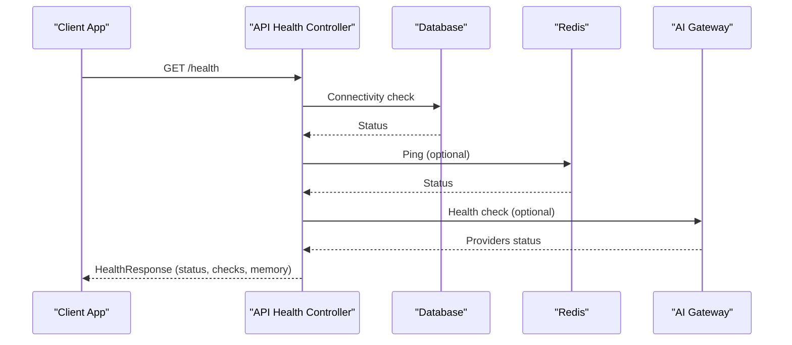

**Diagram sources**
- [health.controller.ts:68-141](file://apps/api/src/health.controller.ts#L68-L141)
- [health.controller.ts:240-408](file://apps/api/src/health.controller.ts#L240-L408)

**Section sources**
- [health.controller.ts:68-141](file://apps/api/src/health.controller.ts#L68-L141)
- [health.controller.ts:240-408](file://apps/api/src/health.controller.ts#L240-L408)

## Detailed Component Analysis

### Health Monitoring and Kubernetes Probes
The API exposes standardized health endpoints:
- Liveness probe (/health/live): minimal check confirming process responsiveness.
- Readiness probe (/health/ready): verifies database connectivity and optional Redis availability.
- Full health (/health): comprehensive status including memory, disk, database, Redis, and AI gateway checks.
- Startup probe (/health/startup): similar to readiness but used during initial startup.

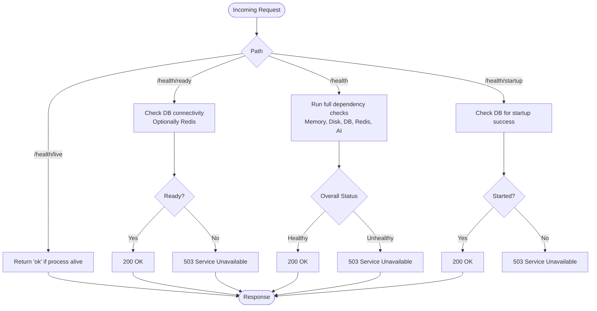

**Diagram sources**
- [health.controller.ts:68-234](file://apps/api/src/health.controller.ts#L68-L234)

**Section sources**
- [health.controller.ts:68-234](file://apps/api/src/health.controller.ts#L68-L234)

### Alerting Framework and Escalation Policies
The alerting configuration defines:
- Alert rule categories: error, performance, security, business, and resource.
- Severity levels and conditions (thresholds, durations).
- Notification channels: email, Slack, Teams, PagerDuty, SMS, webhook.
- Global evaluation and resolution intervals, grouping, and inhibition rules.
- Escalation policies: default and critical with multi-level channels and delays.

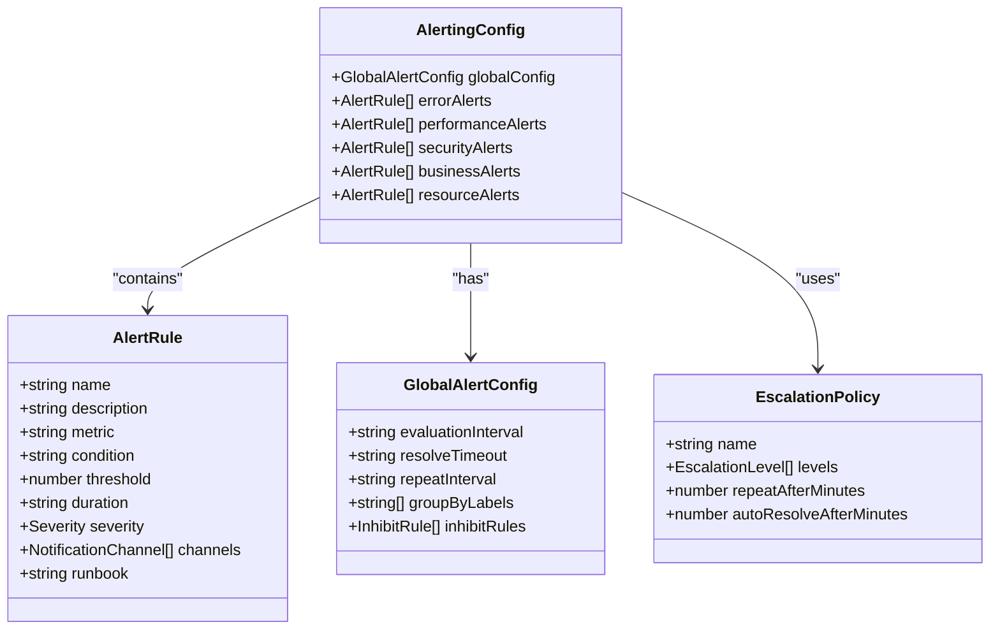

**Diagram sources**
- [alerting-rules.config.ts:20-478](file://apps/api/src/config/alerting-rules.config.ts#L20-L478)

**Section sources**
- [alerting-rules.config.ts:61-478](file://apps/api/src/config/alerting-rules.config.ts#L61-L478)

### Error Tracking and Performance Monitoring (Sentry)
Sentry integration provides:
- Initialization with environment-specific settings and optional profiling.
- Filtering of sensitive data (headers, cookies, API keys) and health check transactions.
- Error capture with user context, breadcrumbs, and transaction tracing.
- Alerting rules for error rates, response times, and critical error categories.

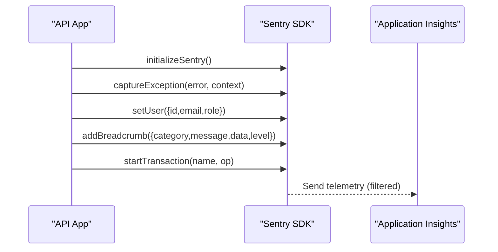

**Diagram sources**
- [sentry.config.ts:51-127](file://apps/api/src/config/sentry.config.ts#L51-L127)
- [main.tf:13-21](file://infrastructure/terraform/modules/monitoring/main.tf#L13-L21)

**Section sources**
- [sentry.config.ts:51-127](file://apps/api/src/config/sentry.config.ts#L51-L127)
- [main.tf:13-21](file://infrastructure/terraform/modules/monitoring/main.tf#L13-L21)

### Uptime Monitoring and External Services
External uptime monitoring configuration supports:
- Monitors for API health endpoints and web application pages.
- Response time thresholds and consecutive failure alerting.
- Multi-tier escalation with channels and severity mapping.
- Status page messages and SLA tracking.

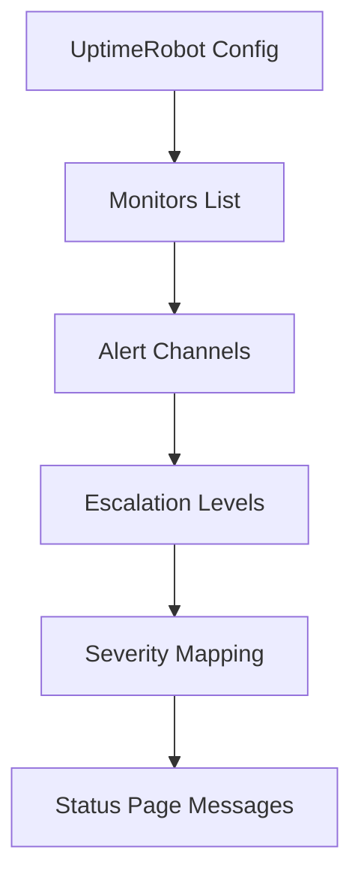

**Diagram sources**
- [uptime-monitoring.config.ts:100-268](file://apps/api/src/config/uptime-monitoring.config.ts#L100-L268)

**Section sources**
- [uptime-monitoring.config.ts:100-268](file://apps/api/src/config/uptime-monitoring.config.ts#L100-L268)

### Frontend Analytics and User Behavior
Google Analytics 4 integration enables:
- Page view tracking and route change integration.
- Custom events for authentication, questionnaires, scoring, documents, payments, and UI interactions.
- Conversion goals and timing measurements.
- Consent management and opt-in/opt-out controls.

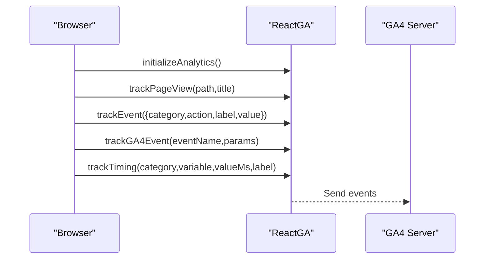

**Diagram sources**
- [analytics.config.ts:44-151](file://apps/web/src/config/analytics.config.ts#L44-L151)

**Section sources**
- [analytics.config.ts:44-151](file://apps/web/src/config/analytics.config.ts#L44-L151)

### Behavioral Analytics Dashboard (React)
The in-app analytics provider captures:
- User sessions, page views, and interaction events.
- Heatmap generation, funnel analysis, user journeys, and session replay.
- Metrics computation (sessions, page views, unique users, bounce rate, conversion rate).
- Export functionality for analytics data.

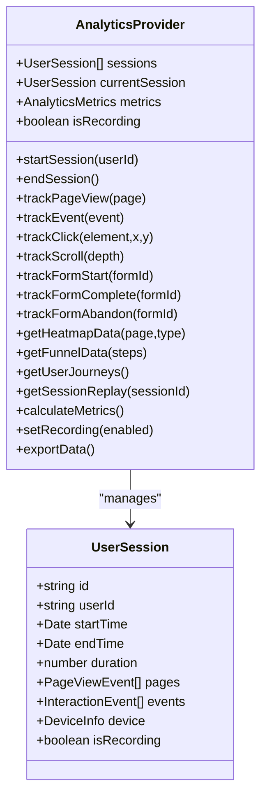

**Diagram sources**
- [Analytics.tsx:240-817](file://apps/web/src/components/analytics/Analytics.tsx#L240-L817)

**Section sources**
- [Analytics.tsx:240-817](file://apps/web/src/components/analytics/Analytics.tsx#L240-L817)

### Analytics Dashboard Page (Pre-built Charts)
The analytics dashboard page aggregates:
- Key metrics cards (total users, session completion, average session duration, documents generated).
- Interactive charts: session completion rate, user growth, retention, and drop-off funnel.
- Document generation metrics table with share percentages.
- Time range selector and skeleton loading states.

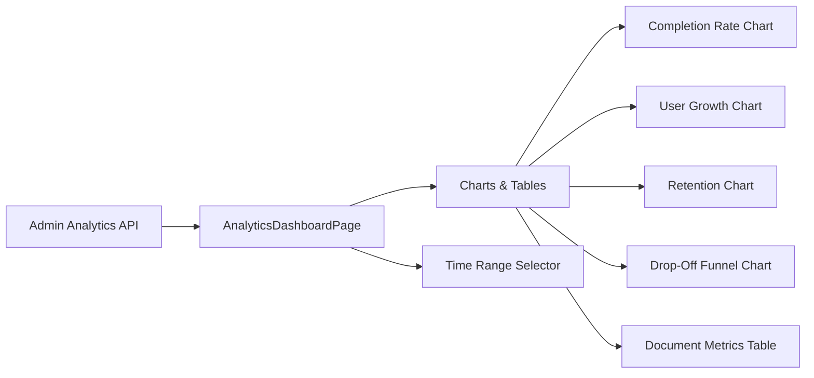

**Diagram sources**
- [AnalyticsDashboardPage.tsx:67-128](file://apps/web/src/pages/analytics/AnalyticsDashboardPage.tsx#L67-L128)
- [AnalyticsDashboardPage.tsx:299-480](file://apps/web/src/pages/analytics/AnalyticsDashboardPage.tsx#L299-L480)

**Section sources**
- [AnalyticsDashboardPage.tsx:67-128](file://apps/web/src/pages/analytics/AnalyticsDashboardPage.tsx#L67-L128)
- [AnalyticsDashboardPage.tsx:299-480](file://apps/web/src/pages/analytics/AnalyticsDashboardPage.tsx#L299-L480)

### Industry Benchmarking and Scoring Analytics
The scoring analytics service provides:
- Score history retrieval for trend analysis.
- Industry benchmark comparison with percentiles and performance categories.
- Dimension-level benchmarks with residual risk gaps and recommendations.

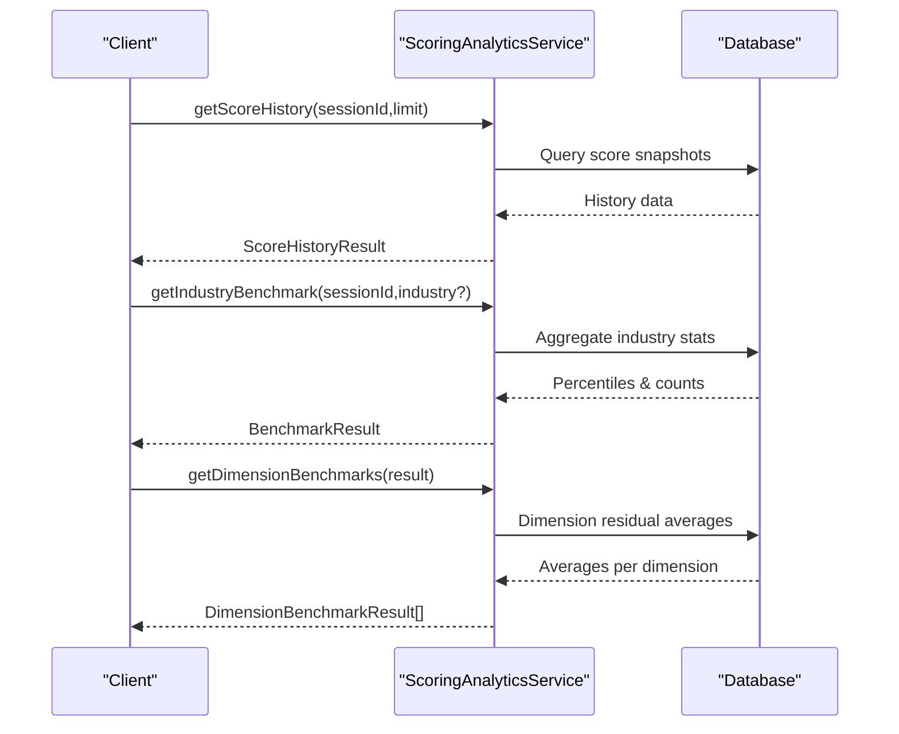

**Diagram sources**
- [scoring-analytics.ts:24-67](file://apps/api/src/modules/scoring-engine/strategies/scoring-analytics.ts#L24-L67)
- [scoring-analytics.ts:73-165](file://apps/api/src/modules/scoring-engine/strategies/scoring-analytics.ts#L73-L165)
- [scoring-analytics.ts:171-240](file://apps/api/src/modules/scoring-engine/strategies/scoring-analytics.ts#L171-L240)

**Section sources**
- [scoring-analytics.ts:24-67](file://apps/api/src/modules/scoring-engine/strategies/scoring-analytics.ts#L24-L67)
- [scoring-analytics.ts:73-165](file://apps/api/src/modules/scoring-engine/strategies/scoring-analytics.ts#L73-L165)
- [scoring-analytics.ts:171-240](file://apps/api/src/modules/scoring-engine/strategies/scoring-analytics.ts#L171-L240)

## Dependency Analysis
The monitoring stack exhibits clear separation of concerns:
- API health depends on database, Redis, and AI gateway services.
- Alerting and uptime monitoring rely on external services and environment variables.
- Frontend analytics depends on GA4 measurement ID and runtime environment.
- Infrastructure monitoring integrates with Azure Application Insights and Log Analytics.

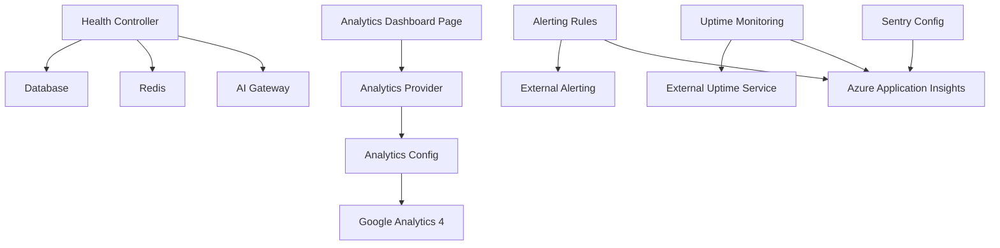

**Diagram sources**
- [health.controller.ts:56-62](file://apps/api/src/health.controller.ts#L56-L62)
- [alerting-rules.config.ts:61-478](file://apps/api/src/config/alerting-rules.config.ts#L61-L478)
- [uptime-monitoring.config.ts:100-268](file://apps/api/src/config/uptime-monitoring.config.ts#L100-L268)
- [analytics.config.ts:44-73](file://apps/web/src/config/analytics.config.ts#L44-L73)
- [Analytics.tsx:240-347](file://apps/web/src/components/analytics/Analytics.tsx#L240-L347)
- [AnalyticsDashboardPage.tsx:299-480](file://apps/web/src/pages/analytics/AnalyticsDashboardPage.tsx#L299-L480)
- [sentry.config.ts:51-127](file://apps/api/src/config/sentry.config.ts#L51-L127)
- [main.tf:13-21](file://infrastructure/terraform/modules/monitoring/main.tf#L13-L21)

**Section sources**
- [health.controller.ts:56-62](file://apps/api/src/health.controller.ts#L56-L62)
- [alerting-rules.config.ts:61-478](file://apps/api/src/config/alerting-rules.config.ts#L61-L478)
- [uptime-monitoring.config.ts:100-268](file://apps/api/src/config/uptime-monitoring.config.ts#L100-L268)
- [analytics.config.ts:44-73](file://apps/web/src/config/analytics.config.ts#L44-L73)
- [Analytics.tsx:240-347](file://apps/web/src/components/analytics/Analytics.tsx#L240-L347)
- [AnalyticsDashboardPage.tsx:299-480](file://apps/web/src/pages/analytics/AnalyticsDashboardPage.tsx#L299-L480)
- [sentry.config.ts:51-127](file://apps/api/src/config/sentry.config.ts#L51-L127)
- [main.tf:13-21](file://infrastructure/terraform/modules/monitoring/main.tf#L13-L21)

## Performance Considerations
- Health endpoint thresholds: response time thresholds for database and Redis influence readiness and overall status.
- Alert evaluation intervals: configurable evaluation and resolve timeouts balance timeliness and noise.
- Sentry sampling rates: adjust tracesSampleRate and profilesSampleRate to control telemetry overhead.
- GA4 event batching and consent: enable debug mode in development and respect user consent to minimize network overhead.
- Infrastructure telemetry: configure Application Insights retention and SKU appropriately for cost and performance.

[No sources needed since this section provides general guidance]

## Troubleshooting Guide
Common monitoring issues and resolutions:
- Health endpoint returns 503:
  - Verify database connectivity and response times.
  - Check Redis availability if present.
  - Review AI gateway provider health.
- Alerts not firing or delayed:
  - Confirm alert rule thresholds and durations.
  - Validate notification channels and environment variables.
  - Check escalation policy configuration.
- Sentry events missing:
  - Ensure DSN is configured and environment variables are set.
  - Verify beforeSend filtering does not remove critical events.
  - Confirm health check transactions are excluded as intended.
- Uptime monitoring false positives:
  - Adjust response time thresholds and consecutive failure counts.
  - Validate monitor URLs and intervals.
  - Review maintenance windows and SLA calculations.
- Frontend analytics not tracking:
  - Confirm measurement ID is configured.
  - Check browser consent settings and opt-out flags.
  - Verify route change tracking integration.

**Section sources**
- [health.controller.ts:135-140](file://apps/api/src/health.controller.ts#L135-L140)
- [alerting-rules.config.ts:61-478](file://apps/api/src/config/alerting-rules.config.ts#L61-L478)
- [sentry.config.ts:51-127](file://apps/api/src/config/sentry.config.ts#L51-L127)
- [uptime-monitoring.config.ts:100-268](file://apps/api/src/config/uptime-monitoring.config.ts#L100-L268)
- [analytics.config.ts:44-73](file://apps/web/src/config/analytics.config.ts#L44-L73)

## Conclusion
The Quiz-to-Build monitoring and analytics system combines robust backend health checks, comprehensive alerting and uptime monitoring, error/performance telemetry via Sentry, and rich frontend behavioral analytics. Together, these components provide real-time observability, trend analysis, comparative reporting, and actionable insights for optimizing user engagement, system utilization, and business outcomes.

[No sources needed since this section summarizes without analyzing specific files]

## Appendices

### KPIs and Metrics Catalog
- User Engagement:
  - Total Users, Active Users, Unique Users
  - Session Completion Rate, Average Session Duration
  - Bounce Rate, Pages Per Session
  - Top Pages, Top Actions
- System Utilization:
  - CPU/Memory/Disk Usage (proxy via heap utilization)
  - Database/Redis Response Times
  - AI Gateway Provider Availability
- Business Outcomes:
  - Documents Generated, Revenue by Document Type
  - Conversion Goals (first questionnaire complete, high readiness achieved, tier upgrade)
- Behavioral Insights:
  - Heatmap Click/Scroll/Hover Patterns
  - Conversion Funnel Drop-off Rates
  - User Journeys and Session Replays

[No sources needed since this section provides general guidance]

### Integration Points
- External Uptime Monitoring: UptimeRobot monitors API and web endpoints.
- Error and Performance Telemetry: Sentry integrates with Azure Application Insights.
- Frontend Analytics: Google Analytics 4 for page views and custom events.

**Section sources**
- [uptime-monitoring.config.ts:100-149](file://apps/api/src/config/uptime-monitoring.config.ts#L100-L149)
- [sentry.config.ts:51-127](file://apps/api/src/config/sentry.config.ts#L51-L127)
- [main.tf:13-21](file://infrastructure/terraform/modules/monitoring/main.tf#L13-L21)
- [analytics.config.ts:44-151](file://apps/web/src/config/analytics.config.ts#L44-L151)

### Monitoring Scenarios and Workflows
- Health Check Failure:
  - Liveness probe passes, readiness fails → scale up or investigate DB.
  - Full health shows degraded status → investigate memory/disk/database.
- Performance Alert:
  - Response time exceeds threshold → review slow queries and caching.
- Security Spike:
  - Authentication failures exceed threshold → enable rate limiting and review firewall logs.
- Capacity Planning:
  - Resource usage near thresholds → provision more resources or optimize queries.

**Section sources**
- [health.controller.ts:68-234](file://apps/api/src/health.controller.ts#L68-L234)
- [alerting-rules.config.ts:154-226](file://apps/api/src/config/alerting-rules.config.ts#L154-L226)
- [uptime-monitoring.config.ts:216-268](file://apps/api/src/config/uptime-monitoring.config.ts#L216-L268)

### Dashboard Customization Options
- Time Range Selection: 7 days, 30 days, 90 days, 1 year.
- Metric Cards: customize icons, colors, and subtitles.
- Charts: replace or extend chart components with custom implementations.
- Export Data: download analytics data for external analysis.

**Section sources**
- [AnalyticsDashboardPage.tsx:185-219](file://apps/web/src/pages/analytics/AnalyticsDashboardPage.tsx#L185-L219)
- [AnalyticsDashboardPage.tsx:299-480](file://apps/web/src/pages/analytics/AnalyticsDashboardPage.tsx#L299-L480)
- [Analytics.tsx:779-790](file://apps/web/src/components/analytics/Analytics.tsx#L779-L790)