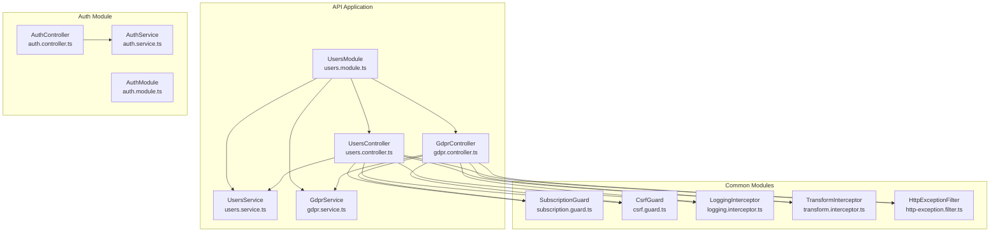
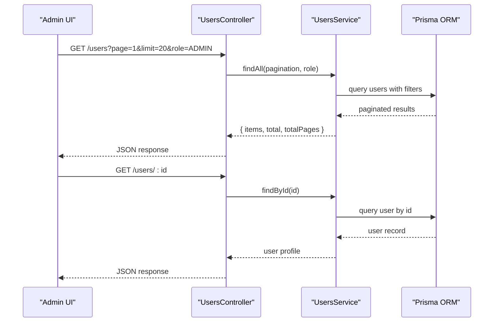
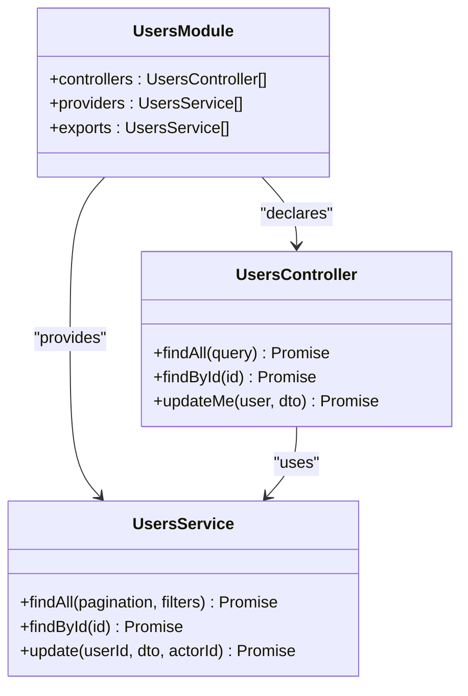
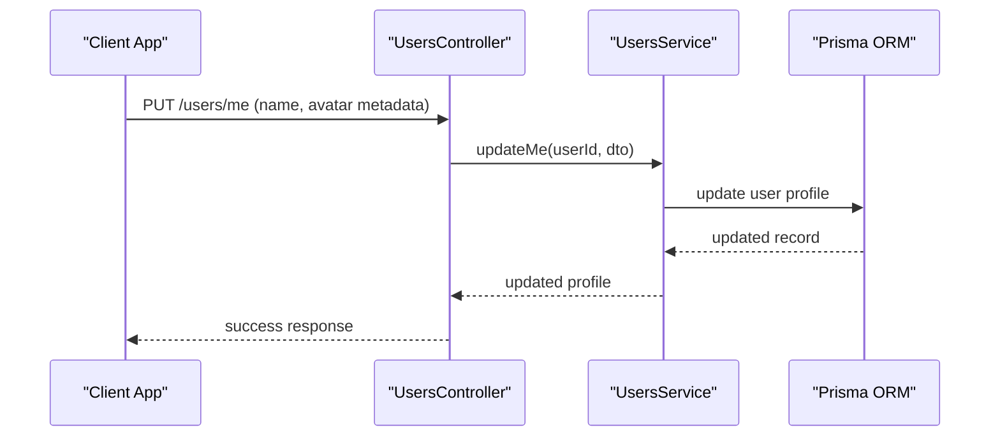
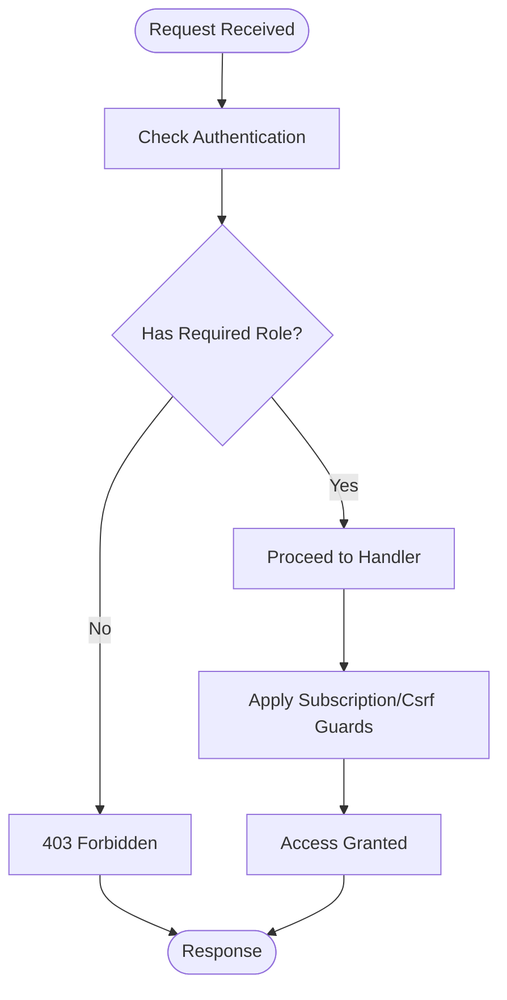
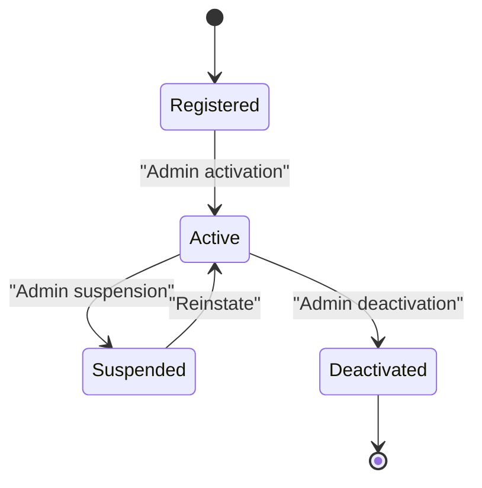
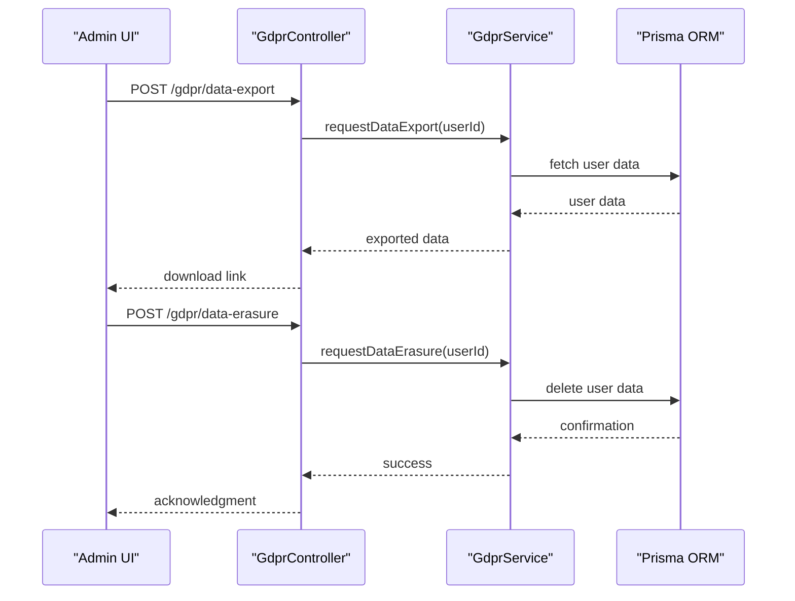
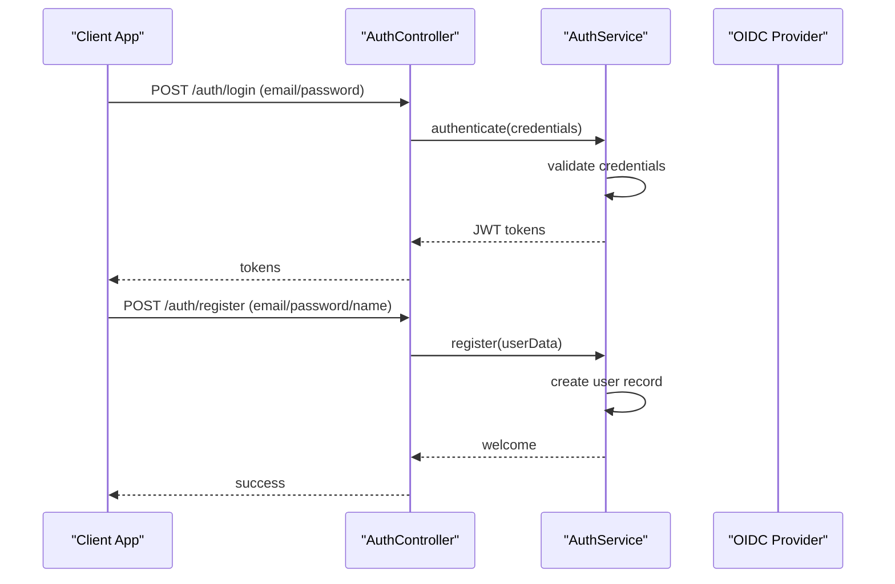
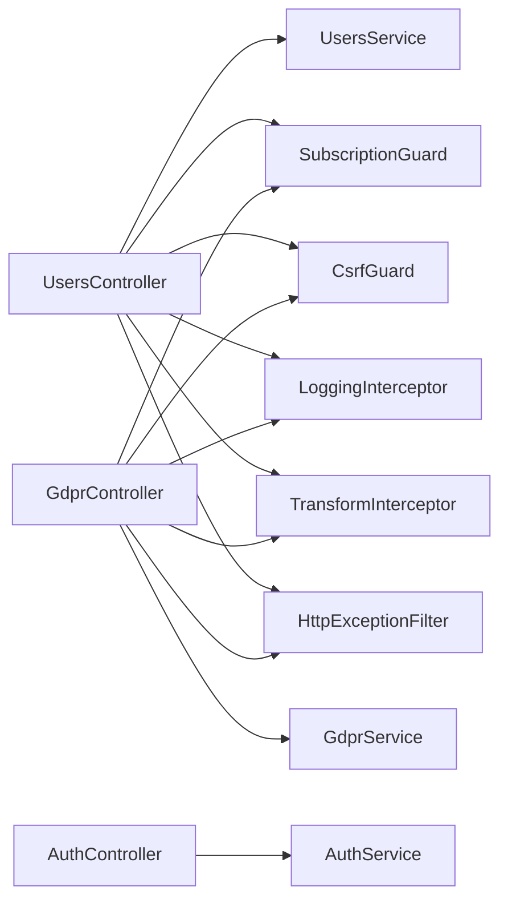
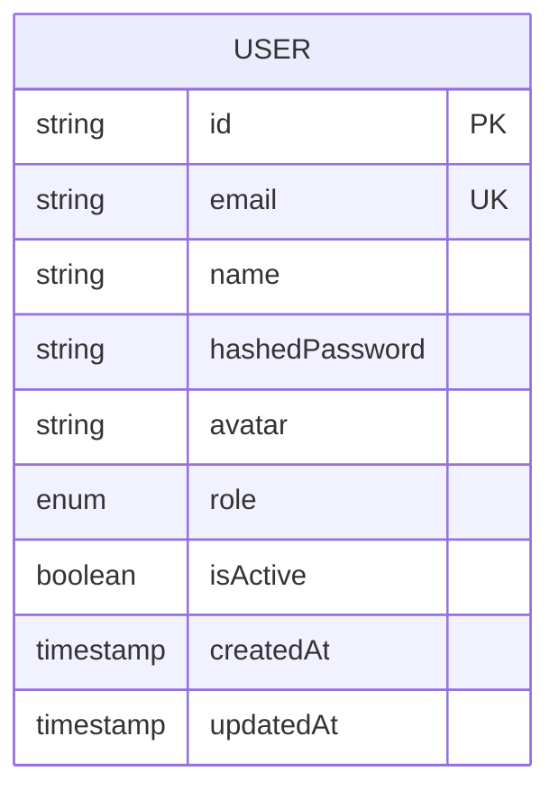

# User Management

<cite>
**Referenced Files in This Document**
- [users.controller.ts](file://apps/api/src/modules/users/users.controller.ts)
- [users.service.ts](file://apps/api/src/modules/users/users.service.ts)
- [users.module.ts](file://apps/api/src/modules/users/users.module.ts)
- [gdpr.controller.ts](file://apps/api/src/modules/users/gdpr.controller.ts)
- [gdpr.service.ts](file://apps/api/src/modules/users/gdpr.service.ts)
- [users.controller.spec.ts](file://apps/api/src/modules/users/users.controller.spec.ts)
- [schema.prisma](file://prisma/schema.prisma)
- [20260210000000_add_user_name_avatar](file://prisma/migrations/20260210000000_add_user_name_avatar/migration.sql)
- [dashboard.e2e.test.ts](file://e2e/admin/dashboard.e2e.test.ts)
- [auth.service.ts](file://apps/api/src/modules/auth/auth.service.ts)
- [auth.controller.ts](file://apps/api/src/modules/auth/auth.controller.ts)
- [auth.module.ts](file://apps/api/src/modules/auth/auth.module.ts)
- [login.dto.ts](file://apps/api/src/modules/auth/dto/login.dto.ts)
- [register.dto.ts](file://apps/api/src/modules/auth/dto/register.dto.ts)
- [subscription.guard.ts](file://apps/api/src/modules/common/guards/subscription.guard.ts)
- [csrf.guard.ts](file://apps/api/src/modules/common/guards/csrf.guard.ts)
- [logging.interceptor.ts](file://apps/api/src/modules/common/interceptors/logging.interceptor.ts)
- [transform.interceptor.ts](file://apps/api/src/modules/common/interceptors/transform.interceptor.ts)
- [http-exception.filter.ts](file://apps/api/src/modules/common/filters/http-exception.filter.ts)
- [configuration.ts](file://apps/api/src/modules/config/configuration.ts)
- [appinsights.config.ts](file://apps/api/src/modules/config/appinsights.config.ts)
- [sentry.config.ts](file://apps/api/src/modules/config/sentry.config.ts)
- [uptime-monitoring.config.ts](file://apps/api/src/modules/config/uptime-monitoring.config.ts)
- [feature-flags.config.ts](file://apps/api/src/modules/config/feature-flags.config.ts)
- [incident-response.config.ts](file://apps/api/src/modules/config/incident-response.config.ts)
- [logger.config.ts](file://apps/api/src/modules/config/logger.config.ts)
</cite>

## Table of Contents
1. [Introduction](#introduction)
2. [Project Structure](#project-structure)
3. [Core Components](#core-components)
4. [Architecture Overview](#architecture-overview)
5. [Detailed Component Analysis](#detailed-component-analysis)
6. [Dependency Analysis](#dependency-analysis)
7. [Performance Considerations](#performance-considerations)
8. [Troubleshooting Guide](#troubleshooting-guide)
9. [Conclusion](#conclusion)
10. [Appendices](#appendices)

## Introduction
This document provides comprehensive documentation for the user management system within the admin interface. It covers user provisioning workflows (account creation, invitations, onboarding), role-based access control (RBAC), user profile management (personal info, avatar uploads, GDPR features), lifecycle management (registration through deactivation), administrative actions (password resets, suspensions, bulk operations), search and filtering, activity monitoring, audit trails, SSO integration, and compliance reporting. The content is derived from the repository's API module for user management, supporting frontend admin tests, and related configuration and monitoring utilities.

## Project Structure
The user management system is primarily implemented in the API application under the users module. The module exposes controllers for user operations and GDPR-related endpoints, along with a service layer for business logic. Supporting components include guards, interceptors, filters, and configuration modules for monitoring and security.

**Diagram sources**
- [users.module.ts:1-12](file://apps/api/src/modules/users/users.module.ts#L1-L12)
- [users.controller.ts](file://apps/api/src/modules/users/users.controller.ts)
- [users.service.ts](file://apps/api/src/modules/users/users.service.ts)
- [gdpr.controller.ts](file://apps/api/src/modules/users/gdpr.controller.ts)
- [gdpr.service.ts](file://apps/api/src/modules/users/gdpr.service.ts)
- [auth.controller.ts](file://apps/api/src/modules/auth/auth.controller.ts)
- [auth.service.ts](file://apps/api/src/modules/auth/auth.service.ts)
- [auth.module.ts](file://apps/api/src/modules/auth/auth.module.ts)
- [subscription.guard.ts](file://apps/api/src/modules/common/guards/subscription.guard.ts)
- [csrf.guard.ts](file://apps/api/src/modules/common/guards/csrf.guard.ts)
- [logging.interceptor.ts](file://apps/api/src/modules/common/interceptors/logging.interceptor.ts)
- [transform.interceptor.ts](file://apps/api/src/modules/common/interceptors/transform.interceptor.ts)
- [http-exception.filter.ts](file://apps/api/src/modules/common/filters/http-exception.filter.ts)

**Section sources**
- [users.module.ts:1-12](file://apps/api/src/modules/users/users.module.ts#L1-L12)
- [users.controller.ts](file://apps/api/src/modules/users/users.controller.ts)
- [users.service.ts](file://apps/api/src/modules/users/users.service.ts)
- [gdpr.controller.ts](file://apps/api/src/modules/users/gdpr.controller.ts)
- [gdpr.service.ts](file://apps/api/src/modules/users/gdpr.service.ts)
- [auth.controller.ts](file://apps/api/src/modules/auth/auth.controller.ts)
- [auth.service.ts](file://apps/api/src/modules/auth/auth.service.ts)
- [auth.module.ts](file://apps/api/src/modules/auth/auth.module.ts)
- [subscription.guard.ts](file://apps/api/src/modules/common/guards/subscription.guard.ts)
- [csrf.guard.ts](file://apps/api/src/modules/common/guards/csrf.guard.ts)
- [logging.interceptor.ts](file://apps/api/src/modules/common/interceptors/logging.interceptor.ts)
- [transform.interceptor.ts](file://apps/api/src/modules/common/interceptors/transform.interceptor.ts)
- [http-exception.filter.ts](file://apps/api/src/modules/common/filters/http-exception.filter.ts)

## Core Components
- UsersModule: Declares controllers and providers for user management and GDPR features.
- UsersController: Exposes endpoints for user listing, retrieval, updates, and administrative operations.
- UsersService: Implements business logic for user operations, including pagination, filtering, and profile updates.
- GdprController and GdprService: Provide GDPR-compliant data access and deletion endpoints.
- Guards and Interceptors: Enforce security and request/response transformations.
- Configuration: Monitoring, logging, and feature flags support.

Key capabilities evidenced by tests and module structure:
- Listing users with pagination and role filtering.
- Retrieving user details by ID.
- Updating current user profile.
- Administrative user management workflows (placeholder in E2E tests indicating planned features).

**Section sources**
- [users.module.ts:1-12](file://apps/api/src/modules/users/users.module.ts#L1-L12)
- [users.controller.spec.ts:53-141](file://apps/api/src/modules/users/users.controller.spec.ts#L53-L141)
- [dashboard.e2e.test.ts:220-305](file://e2e/admin/dashboard.e2e.test.ts#L220-L305)

## Architecture Overview
The user management architecture follows a layered pattern:
- Presentation Layer: Controllers expose REST endpoints.
- Business Logic Layer: Services encapsulate domain logic.
- Persistence: Prisma ORM manages data access against the database schema.
- Security and Observability: Guards, interceptors, and filters handle cross-cutting concerns.

**Diagram sources**
- [users.controller.ts](file://apps/api/src/modules/users/users.controller.ts)
- [users.service.ts](file://apps/api/src/modules/users/users.service.ts)
- [schema.prisma](file://prisma/schema.prisma)

## Detailed Component Analysis

### Users Module and Controllers
The UsersModule declares the UsersModule with controllers and providers. The UsersModule exports UsersService for use elsewhere in the application.

**Diagram sources**
- [users.module.ts:1-12](file://apps/api/src/modules/users/users.module.ts#L1-L12)
- [users.controller.ts](file://apps/api/src/modules/users/users.controller.ts)
- [users.service.ts](file://apps/api/src/modules/users/users.service.ts)

Administrative user actions and workflows are covered in E2E tests, indicating planned routes and UI interactions for:
- Viewing users list and details
- Role assignment and updates
- Account deactivation
- Filtering by role and search by email
- Audit log viewing and filtering

These tests are currently skipped, signaling that the admin routes (/admin/users, /admin/audit-log, /admin/approvals) are not yet implemented.

**Section sources**
- [users.module.ts:1-12](file://apps/api/src/modules/users/users.module.ts#L1-L12)
- [users.controller.spec.ts:53-141](file://apps/api/src/modules/users/users.controller.spec.ts#L53-L141)
- [dashboard.e2e.test.ts:220-337](file://e2e/admin/dashboard.e2e.test.ts#L220-L337)

### User Profile Management
User profile management includes:
- Personal information updates via updateMe endpoint.
- Avatar uploads (indicated by schema additions).
- GDPR compliance features via dedicated endpoints.

**Diagram sources**
- [users.controller.ts](file://apps/api/src/modules/users/users.controller.ts)
- [users.service.ts](file://apps/api/src/modules/users/users.service.ts)
- [schema.prisma](file://prisma/schema.prisma)

Evidence of avatar support exists in the schema migration, enabling avatar storage for user profiles.

**Section sources**
- [users.controller.spec.ts:58-73](file://apps/api/src/modules/users/users.controller.spec.ts#L58-L73)
- [20260210000000_add_user_name_avatar](file://prisma/migrations/20260210000000_add_user_name_avatar/migration.sql)

### Role-Based Access Control (RBAC)
Role-based access control is enforced through:
- Guards for subscription checks and CSRF protection.
- Role-aware endpoints in controllers.
- Tests demonstrating role-based filtering and administrative actions.

**Diagram sources**
- [subscription.guard.ts](file://apps/api/src/modules/common/guards/subscription.guard.ts)
- [csrf.guard.ts](file://apps/api/src/modules/common/guards/csrf.guard.ts)
- [users.controller.spec.ts:95-109](file://apps/api/src/modules/users/users.controller.spec.ts#L95-L109)

### User Lifecycle Management
Lifecycle stages evidenced by tests and module structure:
- Registration: handled by AuthController/AuthService.
- Onboarding: placeholder in E2E tests for admin onboarding flows.
- Active management: listing, filtering, role updates, profile edits.
- Deactivation: indicated in E2E tests for admin deactivation actions.

**Section sources**
- [auth.controller.ts](file://apps/api/src/modules/auth/auth.controller.ts)
- [auth.service.ts](file://apps/api/src/modules/auth/auth.service.ts)
- [dashboard.e2e.test.ts:271-286](file://e2e/admin/dashboard.e2e.test.ts#L271-L286)

### Administrative Actions
Planned administrative actions (currently skipped in E2E tests):
- Password resets
- Account suspension
- Bulk user operations
- User search and filtering
- Activity monitoring and audit trails

These features indicate future development for admin routes and UI components.

**Section sources**
- [dashboard.e2e.test.ts:220-337](file://e2e/admin/dashboard.e2e.test.ts#L220-L337)

### GDPR Compliance Features
GDPR endpoints are provided by GdprController and GdprService, enabling:
- Data access requests
- Data deletion requests

**Diagram sources**
- [gdpr.controller.ts](file://apps/api/src/modules/users/gdpr.controller.ts)
- [gdpr.service.ts](file://apps/api/src/modules/users/gdpr.service.ts)

**Section sources**
- [gdpr.controller.ts](file://apps/api/src/modules/users/gdpr.controller.ts)
- [gdpr.service.ts](file://apps/api/src/modules/users/gdpr.service.ts)

### Integration with External Identity Providers and SSO
Single sign-on (SSO) is integrated via the Auth module, which includes OAuth strategies and controllers for authentication flows. The AuthController and AuthService manage login, registration, and token handling, while DTOs define request structures for login and registration.

**Diagram sources**
- [auth.controller.ts](file://apps/api/src/modules/auth/auth.controller.ts)
- [auth.service.ts](file://apps/api/src/modules/auth/auth.service.ts)
- [login.dto.ts](file://apps/api/src/modules/auth/dto/login.dto.ts)
- [register.dto.ts](file://apps/api/src/modules/auth/dto/register.dto.ts)

**Section sources**
- [auth.controller.ts](file://apps/api/src/modules/auth/auth.controller.ts)
- [auth.service.ts](file://apps/api/src/modules/auth/auth.service.ts)
- [login.dto.ts](file://apps/api/src/modules/auth/dto/login.dto.ts)
- [register.dto.ts](file://apps/api/src/modules/auth/dto/register.dto.ts)

## Dependency Analysis
The UsersModule depends on UsersService for business logic and exports it for broader application usage. Controllers rely on guards and interceptors for security and response formatting. The Auth module provides foundational authentication and SSO capabilities leveraged by user management.

**Diagram sources**
- [users.controller.ts](file://apps/api/src/modules/users/users.controller.ts)
- [users.service.ts](file://apps/api/src/modules/users/users.service.ts)
- [gdpr.controller.ts](file://apps/api/src/modules/users/gdpr.controller.ts)
- [gdpr.service.ts](file://apps/api/src/modules/users/gdpr.service.ts)
- [subscription.guard.ts](file://apps/api/src/modules/common/guards/subscription.guard.ts)
- [csrf.guard.ts](file://apps/api/src/modules/common/guards/csrf.guard.ts)
- [logging.interceptor.ts](file://apps/api/src/modules/common/interceptors/logging.interceptor.ts)
- [transform.interceptor.ts](file://apps/api/src/modules/common/interceptors/transform.interceptor.ts)
- [http-exception.filter.ts](file://apps/api/src/modules/common/filters/http-exception.filter.ts)
- [auth.controller.ts](file://apps/api/src/modules/auth/auth.controller.ts)
- [auth.service.ts](file://apps/api/src/modules/auth/auth.service.ts)

**Section sources**
- [users.module.ts:1-12](file://apps/api/src/modules/users/users.module.ts#L1-L12)
- [users.controller.spec.ts:53-141](file://apps/api/src/modules/users/users.controller.spec.ts#L53-L141)

## Performance Considerations
- Pagination and filtering: The UsersService supports pagination and role filtering to minimize payload sizes and improve responsiveness.
- Interceptors: Logging and transform interceptors add observability and normalize responses without impacting core logic.
- Guards: Subscription and CSRF guards prevent unauthorized access and reduce downstream failures.

[No sources needed since this section provides general guidance]

## Troubleshooting Guide
- Authentication failures: Review AuthController/AuthService flows and DTO validations.
- Authorization errors: Verify role checks and guard application in controllers.
- Request/response anomalies: Inspect logging and transform interceptors.
- Error handling: Use HttpExceptionFilter for consistent error responses.

**Section sources**
- [auth.controller.ts](file://apps/api/src/modules/auth/auth.controller.ts)
- [auth.service.ts](file://apps/api/src/modules/auth/auth.service.ts)
- [logging.interceptor.ts](file://apps/api/src/modules/common/interceptors/logging.interceptor.ts)
- [transform.interceptor.ts](file://apps/api/src/modules/common/interceptors/transform.interceptor.ts)
- [http-exception.filter.ts](file://apps/api/src/modules/common/filters/http-exception.filter.ts)

## Conclusion
The user management system integrates controllers, services, and security layers to support user provisioning, RBAC, profile management, GDPR compliance, and SSO. While many administrative features are outlined in E2E tests, the foundational modules and schema support the intended functionality. The architecture emphasizes separation of concerns, security enforcement, and observability.

[No sources needed since this section summarizes without analyzing specific files]

## Appendices

### Data Model Overview
The user data model includes fields for identification, authentication, roles, and profile information, with avatar support added via a migration.

**Diagram sources**
- [schema.prisma](file://prisma/schema.prisma)
- [20260210000000_add_user_name_avatar](file://prisma/migrations/20260210000000_add_user_name_avatar/migration.sql)

### Common Administrative Tasks (Examples)
- View users list with pagination and role filter.
- Search users by email.
- Change user role.
- Deactivate user account.
- Export user data for GDPR requests.
- Erase user data per GDPR.

Note: These tasks are defined in E2E tests and are currently marked as not implemented in the admin routes.

**Section sources**
- [dashboard.e2e.test.ts:220-337](file://e2e/admin/dashboard.e2e.test.ts#L220-L337)

### Compliance Reporting
- Monitor user activities and audit logs via planned admin routes.
- Generate compliance reports using exported user data endpoints.

**Section sources**
- [gdpr.controller.ts](file://apps/api/src/modules/users/gdpr.controller.ts)
- [gdpr.service.ts](file://apps/api/src/modules/users/gdpr.service.ts)
- [dashboard.e2e.test.ts:307-337](file://e2e/admin/dashboard.e2e.test.ts#L307-L337)