# Architecture & Design

<cite>
**Referenced Files in This Document**
- [apps/api/src/main.ts](file://apps/api/src/main.ts)
- [apps/api/src/app.module.ts](file://apps/api/src/app.module.ts)
- [apps/api/src/modules/auth/auth.module.ts](file://apps/api/src/modules/auth/auth.module.ts)
- [apps/api/src/modules/ai-gateway/ai-gateway.module.ts](file://apps/api/src/modules/ai-gateway/ai-gateway.module.ts)
- [apps/api/src/modules/chat-engine/chat-engine.module.ts](file://apps/api/src/modules/chat-engine/chat-engine.module.ts)
- [apps/api/src/modules/document-generator/document-generator.module.ts](file://apps/api/src/modules/document-generator/document-generator.module.ts)
- [apps/api/src/config/configuration.ts](file://apps/api/src/config/configuration.ts)
- [apps/web/package.json](file://apps/web/package.json)
- [apps/api/package.json](file://apps/api/package.json)
- [prisma/schema.prisma](file://prisma/schema.prisma)
- [libs/database/src/index.ts](file://libs/database/src/index.ts)
- [libs/redis/src/index.ts](file://libs/redis/src/index.ts)
- [docker-compose.yml](file://docker-compose.yml)
- [infrastructure/terraform/main.tf](file://infrastructure/terraform/main.tf)
</cite>

## Table of Contents
1. [Introduction](#introduction)
2. [Project Structure](#project-structure)
3. [Core Components](#core-components)
4. [Architecture Overview](#architecture-overview)
5. [Detailed Component Analysis](#detailed-component-analysis)
6. [Dependency Analysis](#dependency-analysis)
7. [Performance Considerations](#performance-considerations)
8. [Troubleshooting Guide](#troubleshooting-guide)
9. [Conclusion](#conclusion)
10. [Appendices](#appendices)

## Introduction
This document describes the architecture and design of Quiz-to-Build, an adaptive questionnaire and AI-powered document generation platform. The system follows a modern cloud-native design with a NestJS backend, a React 19 frontend, PostgreSQL with Prisma, Redis caching, and Azure-hosted infrastructure. It emphasizes modularity, observability, security, and extensibility through feature-flagged modules and a layered architecture.

## Project Structure
The repository is organized as a monorepo with three primary applications and supporting libraries and infrastructure:
- apps/api: NestJS backend exposing REST APIs and real-time features
- apps/web: React 19 single-page application (SPA)
- apps/cli: Command-line utilities for offline and batch operations
- libs: Shared libraries for database and Redis integration
- prisma: Data modeling and migrations
- infrastructure/terraform: Azure infrastructure provisioning
- docker: Container images and compose for local development and CI

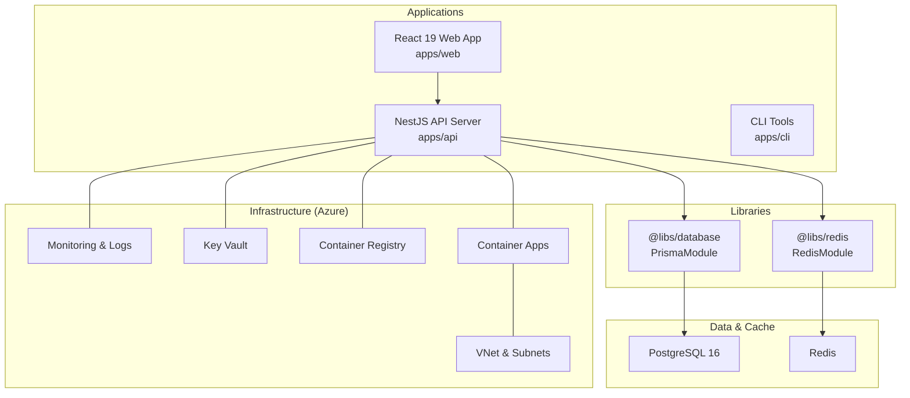

**Diagram sources**
- [apps/api/src/app.module.ts:53-129](file://apps/api/src/app.module.ts#L53-L129)
- [apps/web/package.json:18-36](file://apps/web/package.json#L18-L36)
- [docker-compose.yml:18-150](file://docker-compose.yml#L18-L150)
- [infrastructure/terraform/main.tf:1-153](file://infrastructure/terraform/main.tf#L1-L153)

**Section sources**
- [apps/api/src/app.module.ts:1-130](file://apps/api/src/app.module.ts#L1-L130)
- [apps/web/package.json:1-75](file://apps/web/package.json#L1-L75)
- [apps/api/package.json:1-144](file://apps/api/package.json#L1-L144)
- [docker-compose.yml:1-150](file://docker-compose.yml#L1-L150)
- [infrastructure/terraform/main.tf:1-153](file://infrastructure/terraform/main.tf#L1-L153)

## Core Components
- Backend (NestJS):
  - Centralized bootstrapping with security middleware, compression, CORS, throttling, and structured logging
  - Modular feature modules (auth, questionnaire, session, adaptive logic, AI gateway, chat engine, document generator, etc.)
  - Configuration-driven behavior with environment validation for production
- Frontend (React 19):
  - SPA built with Vite, TypeScript, TailwindCSS, and React Router
  - Integrates with backend APIs and real-time features
- Data Layer:
  - PostgreSQL via Prisma with a rich domain model for organizations, users, questionnaires, sessions, responses, scoring, documents, and AI artifacts
- Cache Layer:
  - Redis for session state, rate limiting, and short-lived caches
- Infrastructure (Azure):
  - Terraform-managed resources: VNet, monitoring, registry, database, cache, key vault, and container apps
- CLI:
  - Utilities for offline operations and batch tasks

**Section sources**
- [apps/api/src/main.ts:28-329](file://apps/api/src/main.ts#L28-L329)
- [apps/api/src/app.module.ts:53-129](file://apps/api/src/app.module.ts#L53-L129)
- [prisma/schema.prisma:1-800](file://prisma/schema.prisma#L1-L800)
- [libs/database/src/index.ts:1-3](file://libs/database/src/index.ts#L1-L3)
- [libs/redis/src/index.ts:1-3](file://libs/redis/src/index.ts#L1-L3)
- [apps/api/src/config/configuration.ts:87-115](file://apps/api/src/config/configuration.ts#L87-L115)

## Architecture Overview
The system employs a layered, modular backend with clear separation of concerns:
- Presentation: REST endpoints and real-time features (SSE) exposed by NestJS controllers
- Domain Services: Feature-specific services implementing business logic (e.g., AI gateway, chat engine, document generation)
- Persistence: Prisma ORM with PostgreSQL for relational data and JSON fields for flexible metadata
- Caching: Redis for transient state and performance
- Observability: Application Insights and Sentry for telemetry and error tracking
- Security: Helmet CSP, permissions policy, rate limiting, CSRF guard, JWT-based auth, and OAuth/MFA

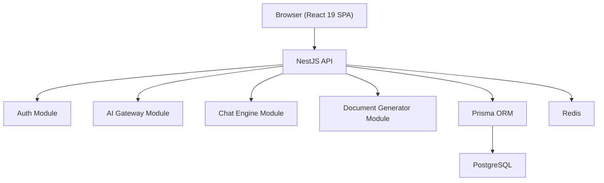

**Diagram sources**
- [apps/api/src/app.module.ts:93-112](file://apps/api/src/app.module.ts#L93-L112)
- [apps/api/src/modules/auth/auth.module.ts:17-51](file://apps/api/src/modules/auth/auth.module.ts#L17-L51)
- [apps/api/src/modules/ai-gateway/ai-gateway.module.ts:8-25](file://apps/api/src/modules/ai-gateway/ai-gateway.module.ts#L8-L25)
- [apps/api/src/modules/chat-engine/chat-engine.module.ts:8-25](file://apps/api/src/modules/chat-engine/chat-engine.module.ts#L8-L25)
- [apps/api/src/modules/document-generator/document-generator.module.ts:19-46](file://apps/api/src/modules/document-generator/document-generator.module.ts#L19-L46)

## Detailed Component Analysis

### Backend Bootstrapping and Security
The API server initializes telemetry, security headers, compression, CORS, throttling, and Swagger/OpenAPI documentation. It enforces production-grade environment validation and structured logging.

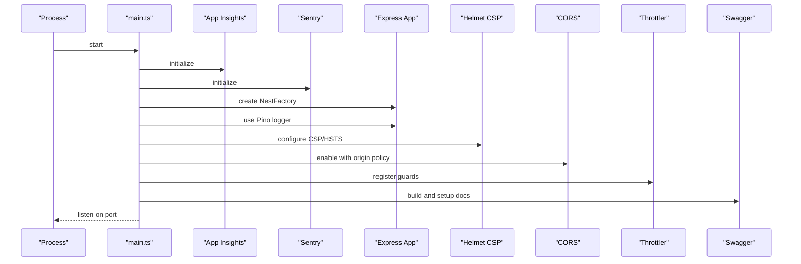

**Diagram sources**
- [apps/api/src/main.ts:28-329](file://apps/api/src/main.ts#L28-L329)

**Section sources**
- [apps/api/src/main.ts:28-329](file://apps/api/src/main.ts#L28-L329)
- [apps/api/src/config/configuration.ts:5-43](file://apps/api/src/config/configuration.ts#L5-L43)

### Authentication and Authorization Module
The Auth module integrates JWT, Passport strategies, roles guard, CSRF protection, OAuth, and MFA. It centralizes authentication concerns and exposes guards for controllers.

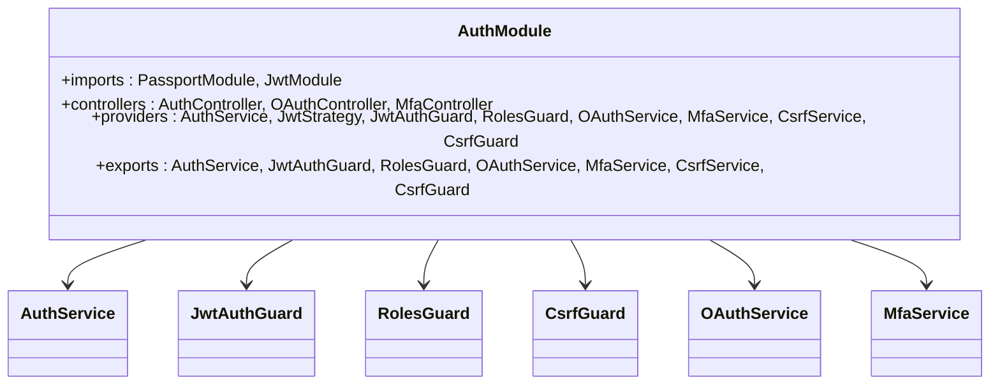

**Diagram sources**
- [apps/api/src/modules/auth/auth.module.ts:17-51](file://apps/api/src/modules/auth/auth.module.ts#L17-L51)

**Section sources**
- [apps/api/src/modules/auth/auth.module.ts:1-53](file://apps/api/src/modules/auth/auth.module.ts#L1-L53)

### AI Gateway and Chat Engine
The AI Gateway provides a unified interface to multiple AI providers with cost tracking and fallback. The Chat Engine manages project-based chat sessions with message limits and SSE streaming.

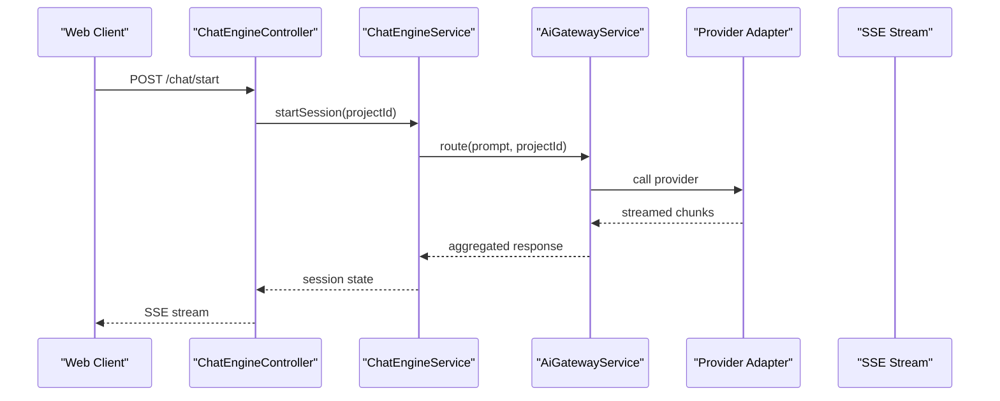

**Diagram sources**
- [apps/api/src/modules/chat-engine/chat-engine.module.ts:19-25](file://apps/api/src/modules/chat-engine/chat-engine.module.ts#L19-L25)
- [apps/api/src/modules/ai-gateway/ai-gateway.module.ts:19-25](file://apps/api/src/modules/ai-gateway/ai-gateway.module.ts#L19-L25)

**Section sources**
- [apps/api/src/modules/ai-gateway/ai-gateway.module.ts:1-26](file://apps/api/src/modules/ai-gateway/ai-gateway.module.ts#L1-L26)
- [apps/api/src/modules/chat-engine/chat-engine.module.ts:1-26](file://apps/api/src/modules/chat-engine/chat-engine.module.ts#L1-L26)

### Document Generator
The Document Generator module orchestrates templating, AI content, quality calibration, rendering, and storage. It exposes admin and compiler endpoints for deliverables.

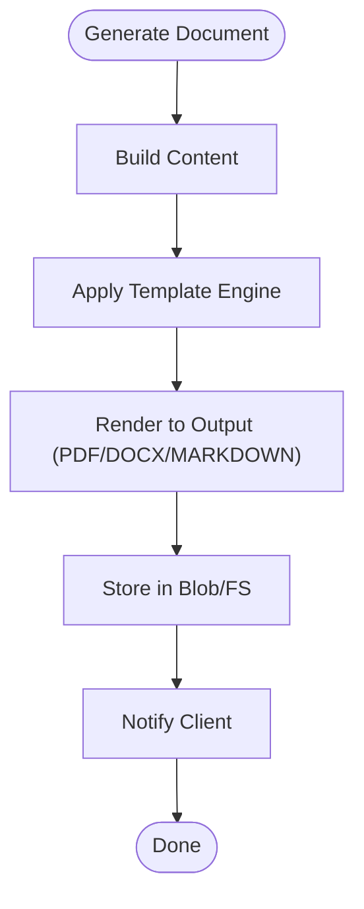

**Diagram sources**
- [apps/api/src/modules/document-generator/document-generator.module.ts:19-46](file://apps/api/src/modules/document-generator/document-generator.module.ts#L19-L46)

**Section sources**
- [apps/api/src/modules/document-generator/document-generator.module.ts:1-47](file://apps/api/src/modules/document-generator/document-generator.module.ts#L1-L47)

### Data Model Overview
The Prisma schema defines core entities for organizations, users, questionnaires, sessions, responses, scoring, documents, audit logs, and AI artifacts. It includes enums for roles, statuses, and coverage scales, enabling rich domain modeling.

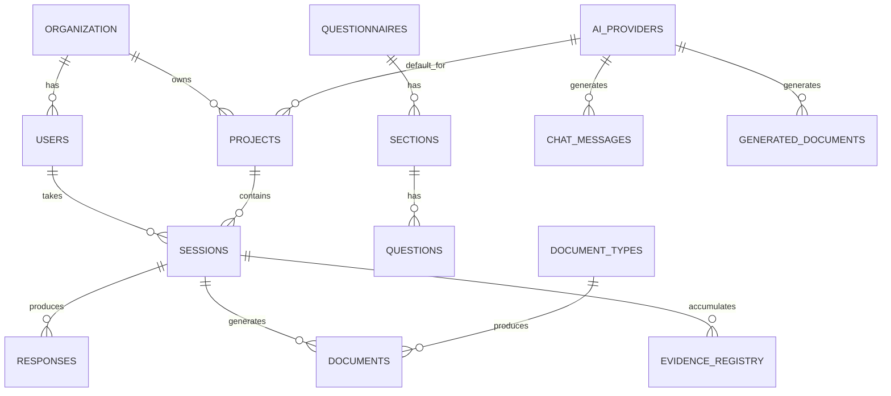

**Diagram sources**
- [prisma/schema.prisma:154-286](file://prisma/schema.prisma#L154-L286)
- [prisma/schema.prisma:351-423](file://prisma/schema.prisma#L351-L423)
- [prisma/schema.prisma:512-560](file://prisma/schema.prisma#L512-L560)
- [prisma/schema.prisma:744-774](file://prisma/schema.prisma#L744-L774)
- [prisma/schema.prisma:177-197](file://prisma/schema.prisma#L177-L197)

**Section sources**
- [prisma/schema.prisma:1-800](file://prisma/schema.prisma#L1-L800)

### Technology Stack
- Backend: NestJS, Prisma, Redis, Application Insights, Sentry
- Frontend: React 19, React Router, TanStack Query, TailwindCSS
- Database: PostgreSQL 16
- Infrastructure: Azure (Container Apps, ACR, Key Vault, Monitoring, VNet)
- DevOps: Docker, Terraform, GitHub Actions

**Section sources**
- [apps/api/package.json:21-65](file://apps/api/package.json#L21-L65)
- [apps/web/package.json:18-36](file://apps/web/package.json#L18-L36)
- [docker-compose.yml:27-46](file://docker-compose.yml#L27-L46)
- [infrastructure/terraform/main.tf:108-152](file://infrastructure/terraform/main.tf#L108-L152)

## Architecture Overview

### C4 Model Context
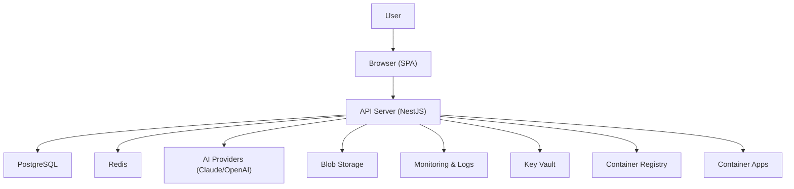

**Diagram sources**
- [apps/api/src/main.ts:68-123](file://apps/api/src/main.ts#L68-L123)
- [apps/api/src/app.module.ts:87-91](file://apps/api/src/app.module.ts#L87-L91)
- [infrastructure/terraform/main.tf:108-152](file://infrastructure/terraform/main.tf#L108-L152)

### Container-Level Architecture
- API container: runs the NestJS server, connects to PostgreSQL and Redis, and exposes REST/SSE endpoints
- Web container: static SPA served via Nginx (in production)
- Supporting containers: PostgreSQL and Redis for data and caching

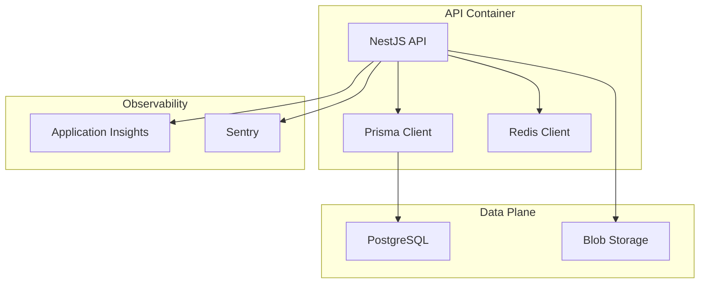

**Diagram sources**
- [apps/api/src/app.module.ts:87-91](file://apps/api/src/app.module.ts#L87-L91)
- [apps/api/src/main.ts:30-33](file://apps/api/src/main.ts#L30-L33)
- [docker-compose.yml:109-135](file://docker-compose.yml#L109-L135)

### Component-Level Design
- Modular NestJS modules encapsulate features and dependencies
- Shared libraries (@libs/database, @libs/redis) provide reusable services
- Controllers delegate to services; services interact with Prisma and Redis
- Cross-cutting concerns (logging, throttling, CSRF, security headers) are applied globally

**Section sources**
- [apps/api/src/app.module.ts:53-129](file://apps/api/src/app.module.ts#L53-L129)
- [libs/database/src/index.ts:1-3](file://libs/database/src/index.ts#L1-L3)
- [libs/redis/src/index.ts:1-3](file://libs/redis/src/index.ts#L1-L3)

## Dependency Analysis
- Backend depends on:
  - NestJS core and community modules (JWT, Passport, Swagger, Throttler)
  - Prisma for data access
  - Redis for caching
  - Azure SDKs for blob storage
  - Sentry and Application Insights for observability
- Frontend depends on:
  - React 19, React Router, TanStack Query, Axios, Zod, and UI libraries
- Infrastructure depends on:
  - Terraform modules for networking, monitoring, registry, database, cache, key vault, and container apps

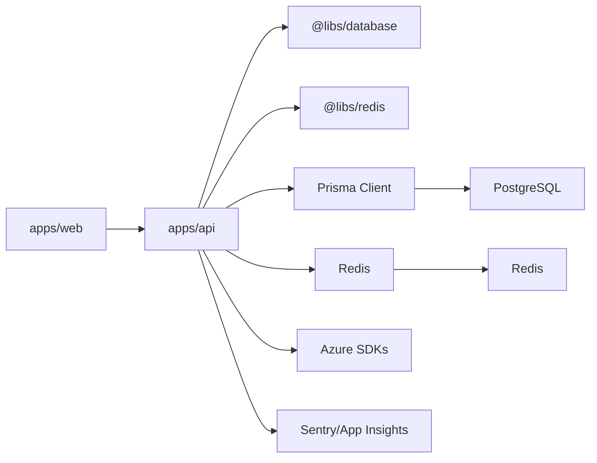

**Diagram sources**
- [apps/api/src/app.module.ts:87-91](file://apps/api/src/app.module.ts#L87-L91)
- [apps/web/package.json:18-36](file://apps/web/package.json#L18-L36)
- [apps/api/package.json:21-65](file://apps/api/package.json#L21-L65)

**Section sources**
- [apps/api/src/app.module.ts:87-129](file://apps/api/src/app.module.ts#L87-L129)
- [apps/api/package.json:21-65](file://apps/api/package.json#L21-L65)
- [apps/web/package.json:18-36](file://apps/web/package.json#L18-L36)

## Performance Considerations
- Compression: Gzip/Brotli enabled with exclusions for SSE and streaming endpoints
- Rate limiting: TTL-based throttling with guards registered globally
- Caching: Redis for session state and high-frequency reads
- Database: Prisma-generated queries with appropriate indexes and JSON fields for flexibility
- Streaming: SSE for real-time chat and AI responses
- Observability: Telemetry and error reporting to detect bottlenecks early

**Section sources**
- [apps/api/src/main.ts:43-67](file://apps/api/src/main.ts#L43-L67)
- [apps/api/src/app.module.ts:68-85](file://apps/api/src/app.module.ts#L68-L85)

## Troubleshooting Guide
- Environment validation failures in production (missing secrets or weak JWT secrets)
- CORS misconfiguration causing preflight or credential issues
- Compression interfering with SSE streams (verify filter logic)
- Redis connectivity or password issues
- Database connection string problems or migration mismatches
- Telemetry shutdown on SIGTERM/SIGINT during graceful termination

Recommended checks:
- Confirm production environment variables and secrets
- Review CSP and permissions policy headers
- Validate Redis host/port/password and TLS settings
- Inspect Application Insights and Sentry for error traces
- Verify graceful shutdown hooks and telemetry flush

**Section sources**
- [apps/api/src/config/configuration.ts:5-43](file://apps/api/src/config/configuration.ts#L5-L43)
- [apps/api/src/main.ts:180-191](file://apps/api/src/main.ts#L180-L191)
- [apps/api/src/main.ts:300-312](file://apps/api/src/main.ts#L300-L312)

## Conclusion
Quiz-to-Build adopts a robust, cloud-native architecture combining NestJS, React 19, PostgreSQL, Redis, and Azure. Its modular backend, rich data model, and comprehensive observability support enable scalable growth while maintaining security and reliability. The documented patterns and diagrams provide a blueprint for extending features, integrating AI providers, and operating in production.

## Appendices

### Deployment Topology
- Local development: Docker Compose with PostgreSQL 16 and Redis
- Production: Azure Container Apps with ACR, Key Vault, Monitoring, and VNet integration

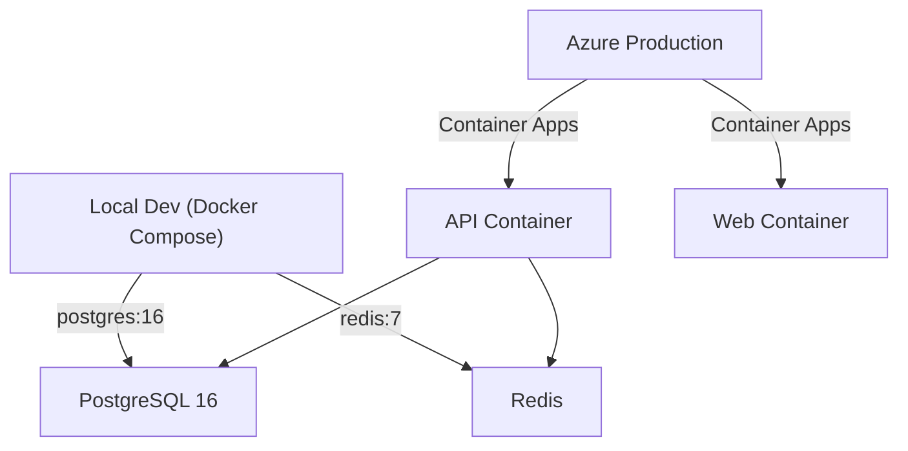

**Diagram sources**
- [docker-compose.yml:27-46](file://docker-compose.yml#L27-L46)
- [docker-compose.yml:55-68](file://docker-compose.yml#L55-L68)
- [infrastructure/terraform/main.tf:108-152](file://infrastructure/terraform/main.tf#L108-L152)

### Infrastructure Requirements
- Azure resources provisioned by Terraform modules:
  - Resource group, VNet, subnets
  - PostgreSQL (managed), Redis (managed)
  - Container Registry, Container Apps
  - Key Vault for secrets
  - Monitoring and log analytics

**Section sources**
- [infrastructure/terraform/main.tf:12-152](file://infrastructure/terraform/main.tf#L12-L152)