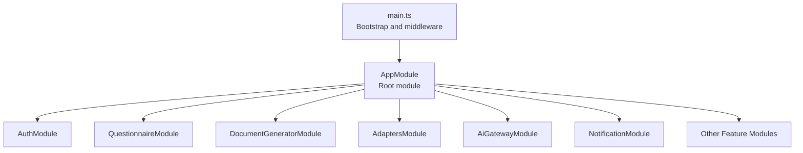
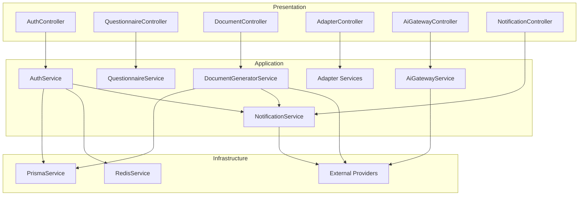
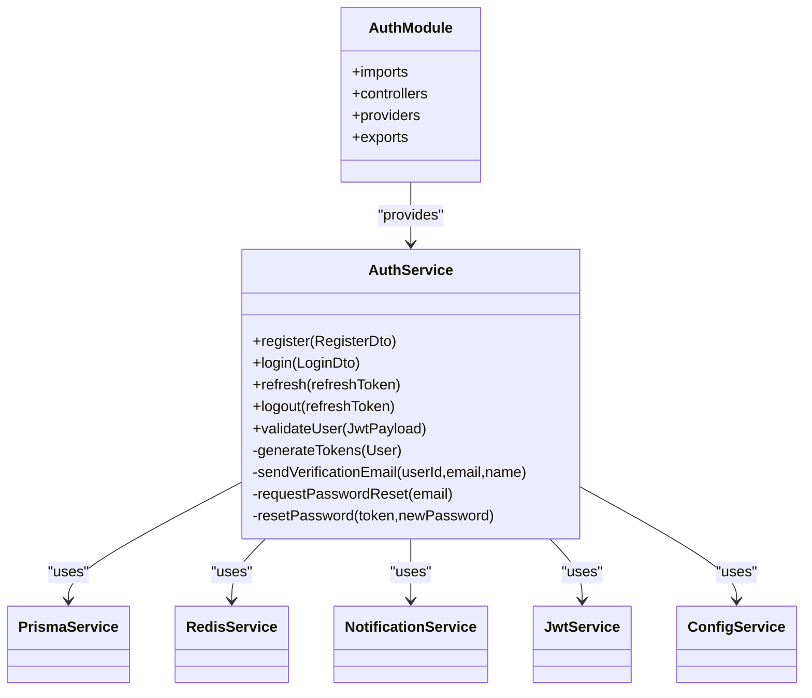
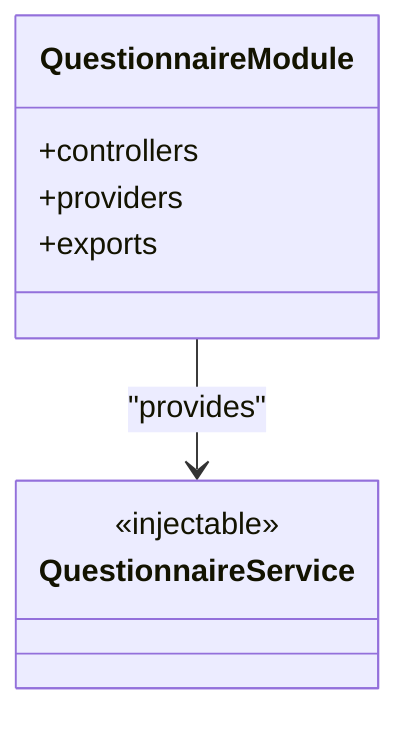
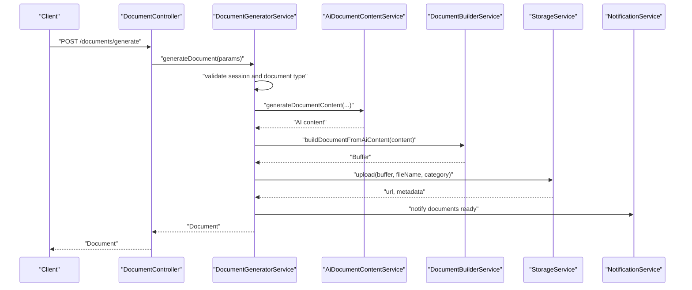
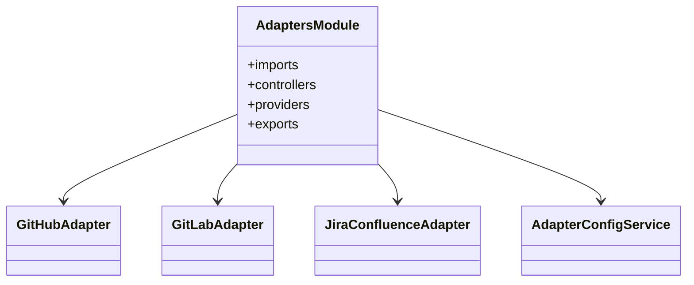
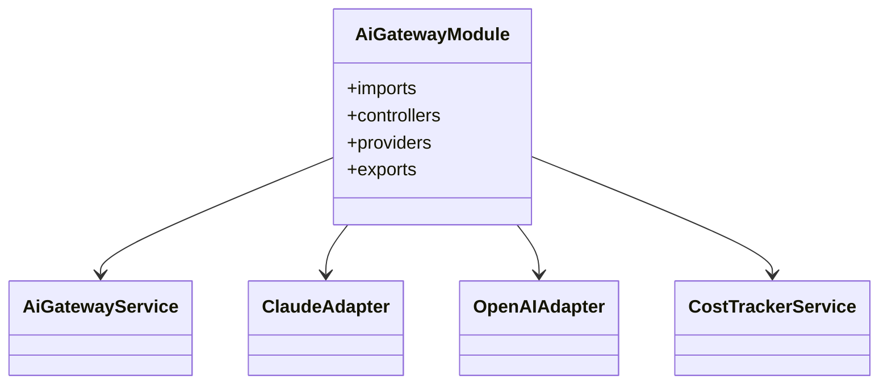
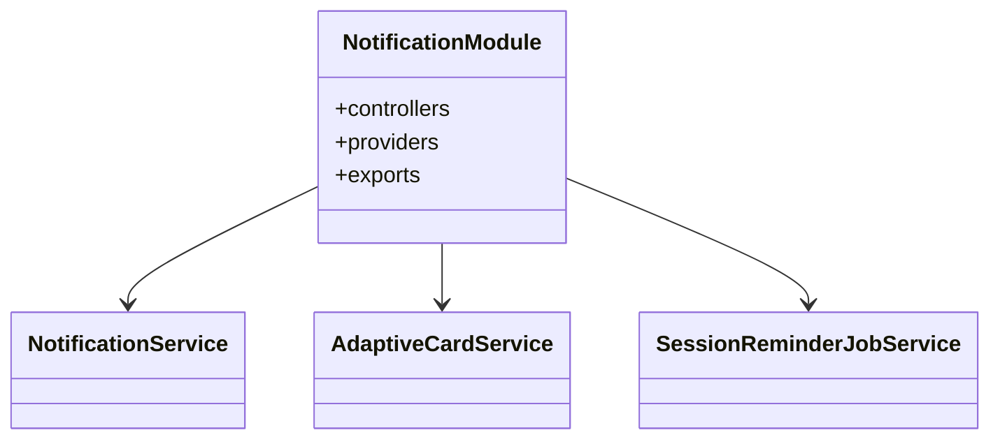
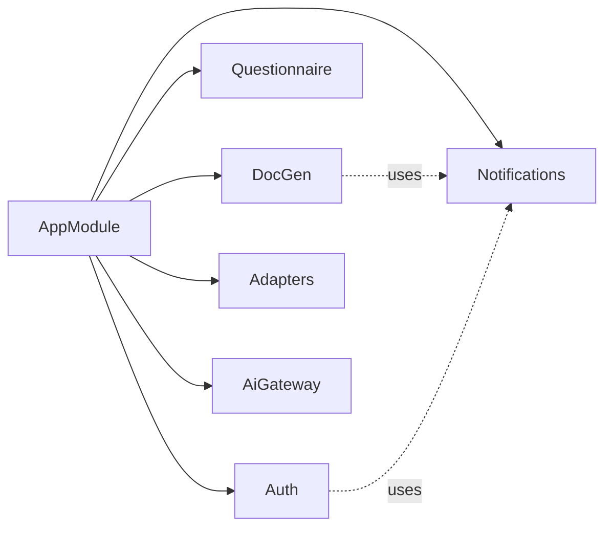

# Component Design & Modules

<cite>
**Referenced Files in This Document**
- [app.module.ts](file://apps/api/src/app.module.ts)
- [main.ts](file://apps/api/src/main.ts)
- [auth.module.ts](file://apps/api/src/modules/auth/auth.module.ts)
- [auth.service.ts](file://apps/api/src/modules/auth/auth.service.ts)
- [questionnaire.module.ts](file://apps/api/src/modules/questionnaire/questionnaire.module.ts)
- [document-generator.module.ts](file://apps/api/src/modules/document-generator/document-generator.module.ts)
- [document-generator.service.ts](file://apps/api/src/modules/document-generator/services/document-generator.service.ts)
- [adapters.module.ts](file://apps/api/src/modules/adapters/adapters.module.ts)
- [ai-gateway.module.ts](file://apps/api/src/modules/ai-gateway/ai-gateway.module.ts)
- [notification.module.ts](file://apps/api/src/modules/notifications/notification.module.ts)
</cite>

## Table of Contents
1. [Introduction](#introduction)
2. [Project Structure](#project-structure)
3. [Core Components](#core-components)
4. [Architecture Overview](#architecture-overview)
5. [Detailed Component Analysis](#detailed-component-analysis)
6. [Dependency Analysis](#dependency-analysis)
7. [Performance Considerations](#performance-considerations)
8. [Troubleshooting Guide](#troubleshooting-guide)
9. [Conclusion](#conclusion)

## Introduction
This document describes the component design and NestJS module-based architecture of the Quiz-to-Build platform. It focuses on the core modules (authentication, questionnaire, document generator), their supporting modules (adapters, AI gateway, notifications), and the service layer organization. It explains module boundaries, dependency injection patterns, initialization sequences, lifecycle management, layered architecture, DTO patterns, interface contracts, and testing strategies grounded in the repository’s implementation.

## Project Structure
The API server is a NestJS application bootstrapped in main.ts and configured via AppModule. AppModule aggregates all feature modules and third-party integrations (database, cache, logging, throttling). The module system organizes concerns into cohesive units with explicit import/export boundaries.

**Diagram sources**
- [main.ts:28-317](file://apps/api/src/main.ts#L28-L317)
- [app.module.ts:53-129](file://apps/api/src/app.module.ts#L53-L129)

**Section sources**
- [main.ts:1-329](file://apps/api/src/main.ts#L1-L329)
- [app.module.ts:1-130](file://apps/api/src/app.module.ts#L1-L130)

## Core Components
- AppModule: Declares global configuration, logging, rate limiting, database/cache modules, and all feature modules. It also conditionally loads legacy modules via an environment flag and registers global guards.
- Bootstrap (main.ts): Initializes telemetry, sets up security middleware, CORS, compression, global pipes/filters/interceptors, Swagger, and handles graceful shutdown hooks.

Key responsibilities:
- Centralized DI container wiring and module composition
- Global middleware pipeline and security posture
- Environment-driven feature toggles and module activation

**Section sources**
- [app.module.ts:53-129](file://apps/api/src/app.module.ts#L53-L129)
- [main.ts:28-317](file://apps/api/src/main.ts#L28-L317)

## Architecture Overview
The system follows a layered architecture:
- Presentation Layer: Controllers in each module expose endpoints
- Application Layer: Services orchestrate workflows and coordinate domain logic
- Infrastructure Layer: Database (Prisma), cache (Redis), external adapters, and third-party SDKs
- Cross-cutting Concerns: Guards, interceptors, filters, logging, monitoring, and error handling

**Diagram sources**
- [auth.module.ts:17-51](file://apps/api/src/modules/auth/auth.module.ts#L17-L51)
- [questionnaire.module.ts:5-9](file://apps/api/src/modules/questionnaire/questionnaire.module.ts#L5-L9)
- [document-generator.module.ts:19-45](file://apps/api/src/modules/document-generator/document-generator.module.ts#L19-L45)
- [adapters.module.ts:10-16](file://apps/api/src/modules/adapters/adapters.module.ts#L10-L16)
- [ai-gateway.module.ts:19-25](file://apps/api/src/modules/ai-gateway/ai-gateway.module.ts#L19-L25)
- [notification.module.ts:8-14](file://apps/api/src/modules/notifications/notification.module.ts#L8-L14)

## Detailed Component Analysis

### Authentication Module (AuthModule)
Responsibilities:
- JWT-based authentication and authorization
- OAuth integration and MFA support
- User registration, login, token refresh/logout
- Email verification and password reset flows
- CSRF protection and role-based access control

Implementation highlights:
- Uses Passport with a JWT strategy and guards
- Integrates with Prisma for persistence and Redis for token storage
- Leverages NotificationService for email workflows
- Exports guards and services for consumption by other modules

**Diagram sources**
- [auth.module.ts:17-51](file://apps/api/src/modules/auth/auth.module.ts#L17-L51)
- [auth.service.ts:37-507](file://apps/api/src/modules/auth/auth.service.ts#L37-L507)

**Section sources**
- [auth.module.ts:1-53](file://apps/api/src/modules/auth/auth.module.ts#L1-L53)
- [auth.service.ts:1-507](file://apps/api/src/modules/auth/auth.service.ts#L1-L507)

### Questionnaire Module (QuestionnaireModule)
Responsibilities:
- Manages questionnaire-related endpoints and workflows
- Provides QuestionnaireService for orchestration

**Diagram sources**
- [questionnaire.module.ts:5-9](file://apps/api/src/modules/questionnaire/questionnaire.module.ts#L5-L9)

**Section sources**
- [questionnaire.module.ts:1-11](file://apps/api/src/modules/questionnaire/questionnaire.module.ts#L1-L11)

### Document Generator Module (DocumentGeneratorModule)
Responsibilities:
- Orchestrates document generation from questionnaire sessions
- Coordinates template assembly, AI content generation, rendering, storage, and notifications
- Supports versioning, approvals, and bulk operations

Key services and interactions:
- DocumentGeneratorService: primary orchestrator
- TemplateEngineService, DocumentBuilderService, StorageService
- AiDocumentContentService: AI-powered content generation
- NotificationService: user notifications for document readiness/approval

**Diagram sources**
- [document-generator.module.ts:19-45](file://apps/api/src/modules/document-generator/document-generator.module.ts#L19-L45)
- [document-generator.service.ts:21-219](file://apps/api/src/modules/document-generator/services/document-generator.service.ts#L21-L219)

**Section sources**
- [document-generator.module.ts:1-47](file://apps/api/src/modules/document-generator/document-generator.module.ts#L1-L47)
- [document-generator.service.ts:1-609](file://apps/api/src/modules/document-generator/services/document-generator.service.ts#L1-L609)

### Adapters Module (AdaptersModule)
Responsibilities:
- Integrates external systems (GitHub, GitLab, Jira/Confluence)
- Centralizes adapter configuration and controller exposure

**Diagram sources**
- [adapters.module.ts:10-16](file://apps/api/src/modules/adapters/adapters.module.ts#L10-L16)

**Section sources**
- [adapters.module.ts:1-17](file://apps/api/src/modules/adapters/adapters.module.ts#L1-L17)

### AI Gateway Module (AiGatewayModule)
Responsibilities:
- Unified access to multiple AI providers (e.g., Claude, OpenAI)
- Streaming responses (SSE), cost tracking, and provider failover

**Diagram sources**
- [ai-gateway.module.ts:19-25](file://apps/api/src/modules/ai-gateway/ai-gateway.module.ts#L19-L25)

**Section sources**
- [ai-gateway.module.ts:1-26](file://apps/api/src/modules/ai-gateway/ai-gateway.module.ts#L1-L26)

### Notifications Module (NotificationModule)
Responsibilities:
- Global notification service for emails, adaptive cards, and webhook integrations
- Job-based reminders and centralized notification APIs

**Diagram sources**
- [notification.module.ts:8-14](file://apps/api/src/modules/notifications/notification.module.ts#L8-L14)

**Section sources**
- [notification.module.ts:1-15](file://apps/api/src/modules/notifications/notification.module.ts#L1-L15)

## Dependency Analysis
Module-level dependencies:
- AppModule composes all feature modules and cross-cutting concerns
- Core modules (Auth, Questionnaire, DocumentGenerator) are foundational and consumed by others
- Supporting modules (Adapters, AiGateway, Notifications) are imported by modules that need their capabilities
- Cross-module dependencies are managed via exports and imports; services are injected via NestJS DI

**Diagram sources**
- [app.module.ts:93-112](file://apps/api/src/app.module.ts#L93-L112)
- [document-generator.module.ts:22-34](file://apps/api/src/modules/document-generator/document-generator.module.ts#L22-L34)
- [auth.module.ts:32-39](file://apps/api/src/modules/auth/auth.module.ts#L32-L39)

**Section sources**
- [app.module.ts:93-112](file://apps/api/src/app.module.ts#L93-L112)
- [document-generator.module.ts:19-45](file://apps/api/src/modules/document-generator/document-generator.module.ts#L19-L45)
- [auth.module.ts:17-51](file://apps/api/src/modules/auth/auth.module.ts#L17-L51)

## Performance Considerations
- Compression: Enabled globally except for streaming endpoints to preserve SSE/real-time semantics
- CORS and security headers: Tight CSP and permissions policies reduce attack surface while maintaining functionality
- Rate limiting: Throttler guards applied globally to protect resources
- Logging and monitoring: Pino structured logging and Application Insights/Sentry initialized early
- Asynchronous workflows: Document generation updates status and notifies users asynchronously to keep request latency low

[No sources needed since this section provides general guidance]

## Troubleshooting Guide
Common areas to inspect:
- Bootstrap failures: main.ts captures bootstrap errors and flushes telemetry before exit
- Middleware conflicts: Review compression and CORS configuration if endpoints behave unexpectedly
- Authentication issues: Validate JWT secret/expiry, Redis connectivity for refresh tokens, and email delivery via NotificationService
- Document generation errors: Check session completion status, required questions, storage upload, and AI content service availability

**Section sources**
- [main.ts:319-328](file://apps/api/src/main.ts#L319-L328)
- [auth.service.ts:147-183](file://apps/api/src/modules/auth/auth.service.ts#L147-L183)
- [document-generator.service.ts:37-136](file://apps/api/src/modules/document-generator/services/document-generator.service.ts#L37-L136)

## Conclusion
The Quiz-to-Build API employs a clean, module-based NestJS architecture with strong separation of concerns. Core modules encapsulate business capabilities, while supporting modules provide specialized integrations. The design leverages dependency injection, global middleware, and robust error handling to deliver a scalable and maintainable system. The documented patterns and diagrams serve as a blueprint for extending functionality, adding tests, and integrating new features.