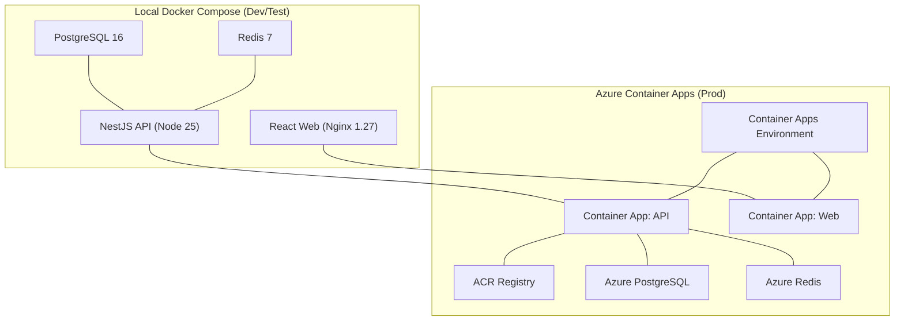
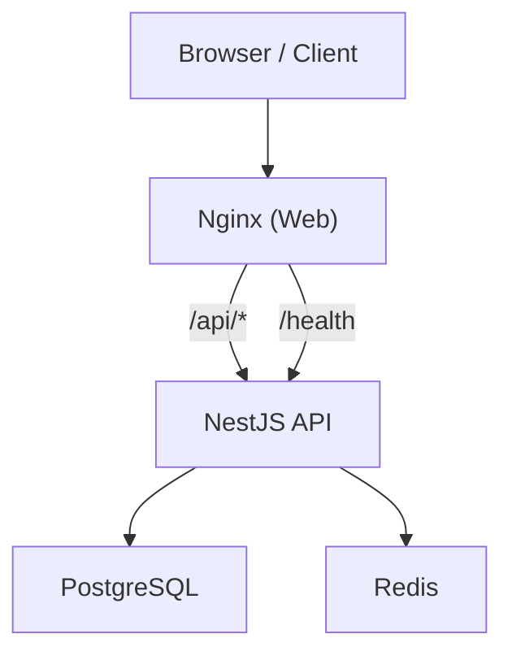
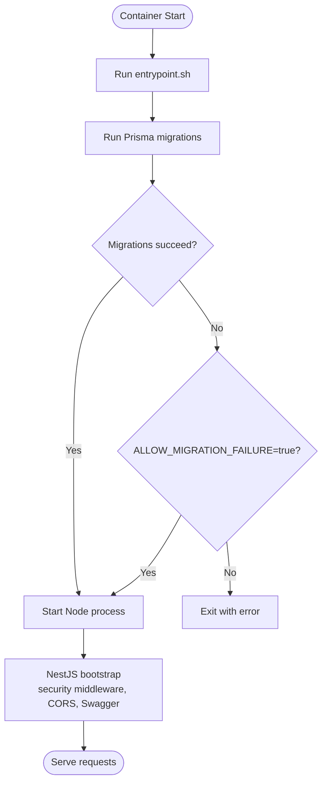
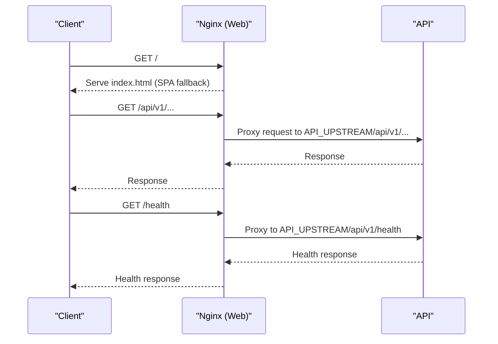
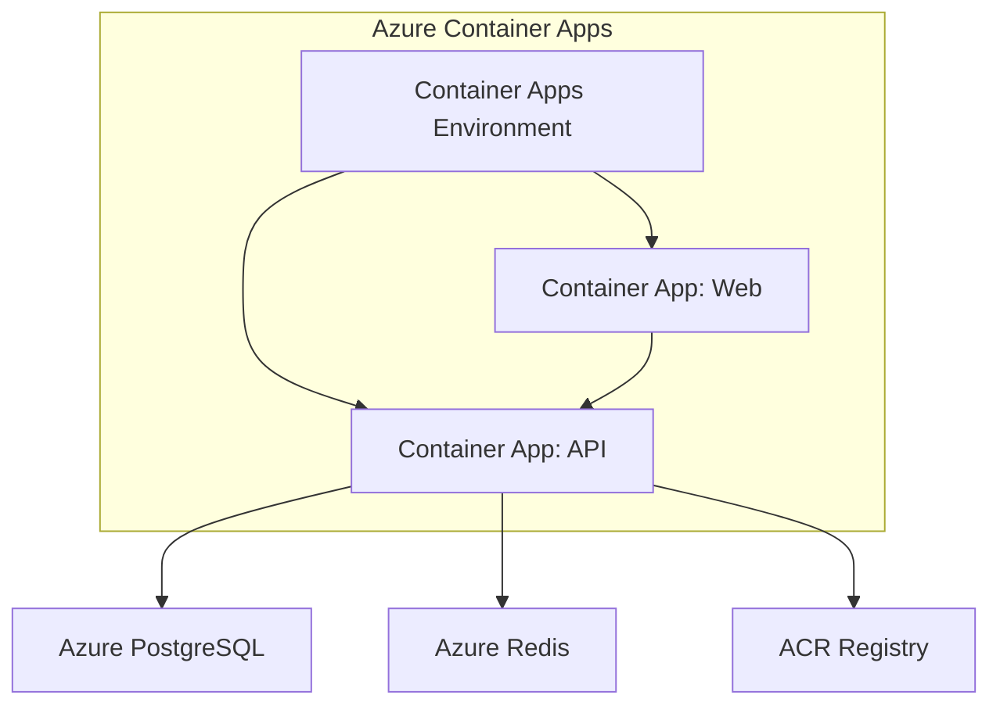
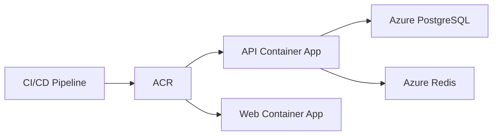

# Container Architecture & Services

<cite>
**Referenced Files in This Document**
- [docker/api/Dockerfile](file://docker/api/Dockerfile)
- [docker/web/Dockerfile](file://docker/web/Dockerfile)
- [docker-compose.yml](file://docker-compose.yml)
- [docker-compose.prod.yml](file://docker-compose.prod.yml)
- [docker/api/entrypoint.sh](file://docker/api/entrypoint.sh)
- [docker/web/nginx.conf](file://docker/web/nginx.conf)
- [apps/api/src/main.ts](file://apps/api/src/main.ts)
- [apps/api/src/config/configuration.ts](file://apps/api/src/config/configuration.ts)
- [infrastructure/terraform/modules/container-apps/main.tf](file://infrastructure/terraform/modules/container-apps/main.tf)
- [azure-pipelines.yml](file://azure-pipelines.yml)
- [scripts/deploy-to-azure.ps1](file://scripts/deploy-to-azure.ps1)
- [scripts/setup-azure.sh](file://scripts/setup-azure.sh)
- [apps/web/vite.config.ts](file://apps/web/vite.config.ts)
</cite>

## Table of Contents
1. [Introduction](#introduction)
2. [Project Structure](#project-structure)
3. [Core Components](#core-components)
4. [Architecture Overview](#architecture-overview)
5. [Detailed Component Analysis](#detailed-component-analysis)
6. [Dependency Analysis](#dependency-analysis)
7. [Performance Considerations](#performance-considerations)
8. [Troubleshooting Guide](#troubleshooting-guide)
9. [Conclusion](#conclusion)
10. [Appendices](#appendices)

## Introduction
This document describes the container architecture and services for the Quiz-to-Build platform. It covers the containerized microservices for the Questionnaire API and the web application, along with supporting infrastructure containers (PostgreSQL and Redis). It explains service boundaries, inter-service communication, container orchestration strategy, and the Azure Container Apps deployment topology. It also details environment variables, service dependencies, networking, load balancing, scaling, health monitoring, security posture, resource limits, and performance optimization.

## Project Structure
The repository organizes the platform into:
- NestJS-based Questionnaire API service under apps/api
- React-based web application under apps/web
- Supporting infrastructure containers (PostgreSQL and Redis) defined in docker-compose files
- Container images built via Dockerfiles under docker/
- Azure Container Apps infrastructure managed by Terraform under infrastructure/terraform/modules/container-apps/main.tf
- CI/CD pipeline under azure-pipelines.yml and deployment scripts under scripts/

**Diagram sources**
- [docker-compose.yml:18-150](file://docker-compose.yml#L18-L150)
- [docker-compose.prod.yml:1-95](file://docker-compose.prod.yml#L1-L95)
- [infrastructure/terraform/modules/container-apps/main.tf:1-310](file://infrastructure/terraform/modules/container-apps/main.tf#L1-L310)

**Section sources**
- [docker-compose.yml:1-150](file://docker-compose.yml#L1-L150)
- [docker-compose.prod.yml:1-95](file://docker-compose.prod.yml#L1-L95)
- [infrastructure/terraform/modules/container-apps/main.tf:1-310](file://infrastructure/terraform/modules/container-apps/main.tf#L1-L310)

## Core Components
- Questionnaire API (NestJS):
  - Built from docker/api/Dockerfile targeting production stage
  - Starts via docker/api/entrypoint.sh which runs Prisma migrations and launches the Node process
  - Bootstrapped in apps/api/src/main.ts with security middleware, CORS, compression, Swagger, and health endpoints
  - Reads configuration from apps/api/src/config/configuration.ts, validating production secrets and defaults

- Web Application (React SPA served by Nginx):
  - Built from docker/web/Dockerfile with a multi-stage build
  - Production stage serves static assets via Nginx configured by docker/web/nginx.conf
  - Environment variables injected at build time for API endpoints and OAuth clients

- Supporting Infrastructure:
  - PostgreSQL 16 and Redis 7 containers orchestrated locally via docker-compose files
  - Azure PostgreSQL and Azure Redis integrated in production via Terraform-managed Container Apps

**Section sources**
- [docker/api/Dockerfile:1-120](file://docker/api/Dockerfile#L1-L120)
- [docker/api/entrypoint.sh:1-34](file://docker/api/entrypoint.sh#L1-L34)
- [apps/api/src/main.ts:1-329](file://apps/api/src/main.ts#L1-L329)
- [apps/api/src/config/configuration.ts:1-115](file://apps/api/src/config/configuration.ts#L1-L115)
- [docker/web/Dockerfile:1-85](file://docker/web/Dockerfile#L1-L85)
- [docker/web/nginx.conf:1-61](file://docker/web/nginx.conf#L1-L61)

## Architecture Overview
The platform follows a container-first microservices architecture:
- API service exposes REST endpoints behind a global prefix and health probes
- Web application proxies API calls and serves static assets via Nginx
- Both services communicate with PostgreSQL and Redis
- Production deploys via Azure Container Apps with managed scaling, health probes, and secrets

**Diagram sources**
- [docker/web/nginx.conf:20-43](file://docker/web/nginx.conf#L20-L43)
- [apps/api/src/main.ts:194](file://apps/api/src/main.ts#L194)
- [docker-compose.yml:109-135](file://docker-compose.yml#L109-L135)

**Section sources**
- [docker/web/nginx.conf:1-61](file://docker/web/nginx.conf#L1-L61)
- [apps/api/src/main.ts:194](file://apps/api/src/main.ts#L194)
- [docker-compose.yml:109-135](file://docker-compose.yml#L109-L135)

## Detailed Component Analysis

### Questionnaire API Container (NestJS)
- Image build:
  - Multi-stage Dockerfile with builder, development, and production stages
  - Production stage installs security updates, creates non-root user, copies pruned node_modules and libs, sets health check, and starts via entrypoint.sh

- Runtime behavior:
  - Entry point runs Prisma migrations and then starts the Node process with constrained memory
  - Bootstrap initializes Application Insights and Sentry, configures Helmet/CSP, compression, CORS, Swagger, and global pipes/filters/interceptors
  - Health endpoints exposed under the configured API prefix

- Environment variables:
  - NODE_ENV, PORT, API_PREFIX, DATABASE_URL, REDIS_HOST, REDIS_PORT, JWT_SECRET, JWT_REFRESH_SECRET, LOG_LEVEL, CORS_ORIGIN, FRONTEND_URL, APPLICATIONINSIGHTS_CONNECTION_STRING
  - Configuration module enforces production validation for secrets and CORS

**Diagram sources**
- [docker/api/entrypoint.sh:1-34](file://docker/api/entrypoint.sh#L1-L34)
- [docker/api/Dockerfile:68-120](file://docker/api/Dockerfile#L68-L120)
- [apps/api/src/main.ts:28-329](file://apps/api/src/main.ts#L28-L329)
- [apps/api/src/config/configuration.ts:5-43](file://apps/api/src/config/configuration.ts#L5-L43)

**Section sources**
- [docker/api/Dockerfile:1-120](file://docker/api/Dockerfile#L1-L120)
- [docker/api/entrypoint.sh:1-34](file://docker/api/entrypoint.sh#L1-L34)
- [apps/api/src/main.ts:1-329](file://apps/api/src/main.ts#L1-L329)
- [apps/api/src/config/configuration.ts:1-115](file://apps/api/src/config/configuration.ts#L1-L115)

### Web Application Container (React SPA + Nginx)
- Image build:
  - Multi-stage Dockerfile with a builder stage generating environment-specific .env.production.local and a production stage serving assets via Nginx
  - Nginx template supports runtime substitution of API_UPSTREAM

- Runtime behavior:
  - Nginx listens on port 80, proxies API requests to the upstream API, serves SPA fallback, and applies security headers
  - Health endpoint proxies to the API’s health path

**Diagram sources**
- [docker/web/nginx.conf:20-48](file://docker/web/nginx.conf#L20-L48)
- [docker/web/Dockerfile:40-85](file://docker/web/Dockerfile#L40-L85)

**Section sources**
- [docker/web/Dockerfile:1-85](file://docker/web/Dockerfile#L1-L85)
- [docker/web/nginx.conf:1-61](file://docker/web/nginx.conf#L1-L61)

### Supporting Infrastructure Containers
- PostgreSQL 16 and Redis 7:
  - Defined in docker-compose files with health checks, persistent volumes, and network isolation
  - Used for local development and testing; production uses Azure-managed services

**Section sources**
- [docker-compose.yml:27-107](file://docker-compose.yml#L27-L107)
- [docker-compose.prod.yml:2-64](file://docker-compose.prod.yml#L2-L64)

### Azure Container Apps Deployment Topology
- Container Apps Environment hosts both API and Web applications
- API container:
  - Managed CPU/memory, replicas, and secrets
  - Liveness/readiness/startup probes under the API prefix
  - Ingress enabled externally with traffic weights
- Web container:
  - Single-revision deployment, external ingress, and health probes
- Registry integration with ACR credentials and image updates

**Diagram sources**
- [infrastructure/terraform/modules/container-apps/main.tf:20-310](file://infrastructure/terraform/modules/container-apps/main.tf#L20-L310)

**Section sources**
- [infrastructure/terraform/modules/container-apps/main.tf:1-310](file://infrastructure/terraform/modules/container-apps/main.tf#L1-L310)
- [scripts/deploy-to-azure.ps1:212-265](file://scripts/deploy-to-azure.ps1#L212-L265)

## Dependency Analysis
- Internal dependencies:
  - API depends on database and Redis; web proxies to API
- External dependencies:
  - Azure PostgreSQL and Redis for production
  - ACR for image registry
- CI/CD pipeline:
  - Builds images via ACR Tasks, signs with Sigstore Cosign, attaches SLSA provenance, and deploys to Container Apps

**Diagram sources**
- [azure-pipelines.yml:729-800](file://azure-pipelines.yml#L729-L800)
- [infrastructure/terraform/modules/container-apps/main.tf:183-222](file://infrastructure/terraform/modules/container-apps/main.tf#L183-L222)

**Section sources**
- [azure-pipelines.yml:1-908](file://azure-pipelines.yml#L1-L908)
- [infrastructure/terraform/modules/container-apps/main.tf:1-310](file://infrastructure/terraform/modules/container-apps/main.tf#L1-L310)

## Performance Considerations
- Compression:
  - API applies gzip/brotli selectively, skipping streaming endpoints
- Static asset caching:
  - Web server caches long-lived assets and enables gzip
- Build optimization:
  - Vite splits vendor bundles for improved caching
- Resource limits:
  - Container Apps specify CPU/memory and replica counts; entrypoint constrains Node heap
- Observability:
  - Application Insights and Sentry initialized early; health probes configured

**Section sources**
- [apps/api/src/main.ts:43-67](file://apps/api/src/main.ts#L43-L67)
- [docker/web/nginx.conf:8-18](file://docker/web/nginx.conf#L8-L18)
- [apps/web/vite.config.ts:8-18](file://apps/web/vite.config.ts#L8-L18)
- [docker/api/entrypoint.sh:33](file://docker/api/entrypoint.sh#L33)
- [infrastructure/terraform/modules/container-apps/main.tf:32-39](file://infrastructure/terraform/modules/container-apps/main.tf#L32-L39)

## Troubleshooting Guide
- Health checks:
  - API exposes liveness/readiness/startup probes under the API prefix
  - Web exposes a root health endpoint that proxies to the API
- Migration failures:
  - API entrypoint supports overriding migration failure behavior via an environment variable
- CORS and secrets:
  - Configuration module enforces production-grade CORS and secret strength
- Logs and telemetry:
  - Application Insights and Sentry initialized at bootstrap; graceful shutdown flushes telemetry

**Section sources**
- [infrastructure/terraform/modules/container-apps/main.tf:124-156](file://infrastructure/terraform/modules/container-apps/main.tf#L124-L156)
- [docker/web/nginx.conf:20-29](file://docker/web/nginx.conf#L20-L29)
- [docker/api/entrypoint.sh:17-30](file://docker/api/entrypoint.sh#L17-L30)
- [apps/api/src/config/configuration.ts:5-43](file://apps/api/src/config/configuration.ts#L5-L43)
- [apps/api/src/main.ts:300-312](file://apps/api/src/main.ts#L300-L312)

## Conclusion
The Quiz-to-Build platform employs a robust container-first architecture with clear service boundaries, secure production deployments via Azure Container Apps, and comprehensive observability and security measures. The API and Web services are independently scalable, communicate over well-defined endpoints, and integrate with managed Azure infrastructure for databases and caching. The CI/CD pipeline ensures supply chain security and reproducible deployments.

## Appendices

### Container Networking and Inter-Service Communication
- Local Docker Compose:
  - Bridge network isolates services; API connects to PostgreSQL and Redis by service name
- Azure Container Apps:
  - API communicates with Azure PostgreSQL and Redis using environment variables and secrets
  - Web proxies API traffic via the configured API_UPSTREAM

**Section sources**
- [docker-compose.yml:144-150](file://docker-compose.yml#L144-L150)
- [infrastructure/terraform/modules/container-apps/main.tf:57-75](file://infrastructure/terraform/modules/container-apps/main.tf#L57-L75)
- [docker/web/nginx.conf:31-43](file://docker/web/nginx.conf#L31-L43)

### Scaling and Auto-Scaling Policies
- Azure Container Apps:
  - API defines minimum and maximum replicas and CPU/memory allocation
  - Traffic distribution supports single or multiple revisions depending on canary deployment setting

**Section sources**
- [infrastructure/terraform/modules/container-apps/main.tf:32-33](file://infrastructure/terraform/modules/container-apps/main.tf#L32-L33)
- [infrastructure/terraform/modules/container-apps/main.tf:25](file://infrastructure/terraform/modules/container-apps/main.tf#L25)

### Environment Variables Reference
- API:
  - NODE_ENV, PORT, API_PREFIX, DATABASE_URL, REDIS_HOST, REDIS_PORT, REDIS_PASSWORD, JWT_SECRET, JWT_REFRESH_SECRET, JWT_EXPIRES_IN, JWT_REFRESH_EXPIRES_IN, BCRYPT_ROUNDS, LOG_LEVEL, CORS_ORIGIN, FRONTEND_URL, APPLICATIONINSIGHTS_CONNECTION_STRING
- Web:
  - NODE_ENV, VITE_API_URL (injected at build time), OAuth client IDs

**Section sources**
- [apps/api/src/config/configuration.ts:87-114](file://apps/api/src/config/configuration.ts#L87-L114)
- [docker/web/Dockerfile:19-33](file://docker/web/Dockerfile#L19-L33)
- [infrastructure/terraform/modules/container-apps/main.tf:41-122](file://infrastructure/terraform/modules/container-apps/main.tf#L41-L122)

### Security and Supply Chain
- Images built with security updates and non-root users
- ACR Tasks cloud build; Cosign keyless signing; SLSA provenance attestation
- Secrets stored as Container Apps secrets and referenced by name

**Section sources**
- [docker/api/Dockerfile:85-109](file://docker/api/Dockerfile#L85-L109)
- [docker/web/Dockerfile:54-73](file://docker/web/Dockerfile#L54-L73)
- [azure-pipelines.yml:745-800](file://azure-pipelines.yml#L745-L800)
- [infrastructure/terraform/modules/container-apps/main.tf:183-222](file://infrastructure/terraform/modules/container-apps/main.tf#L183-L222)