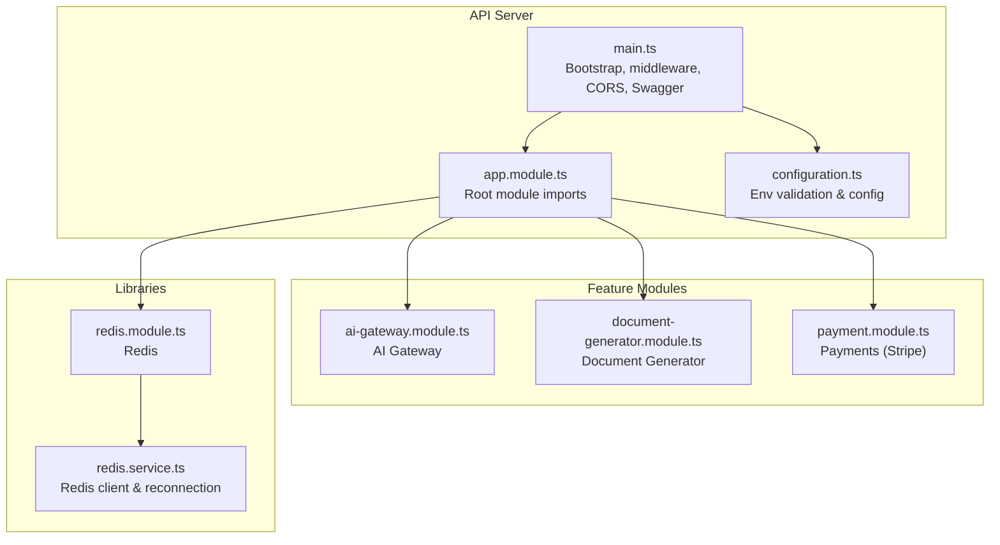
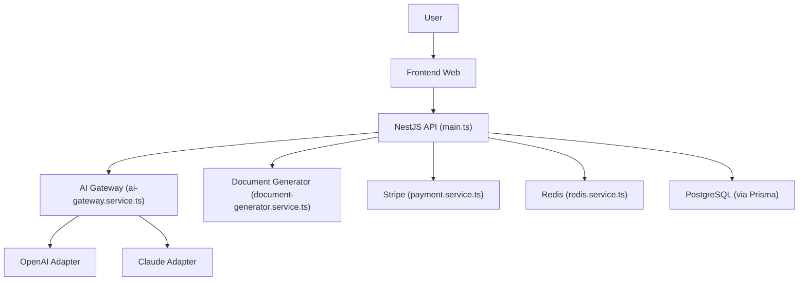
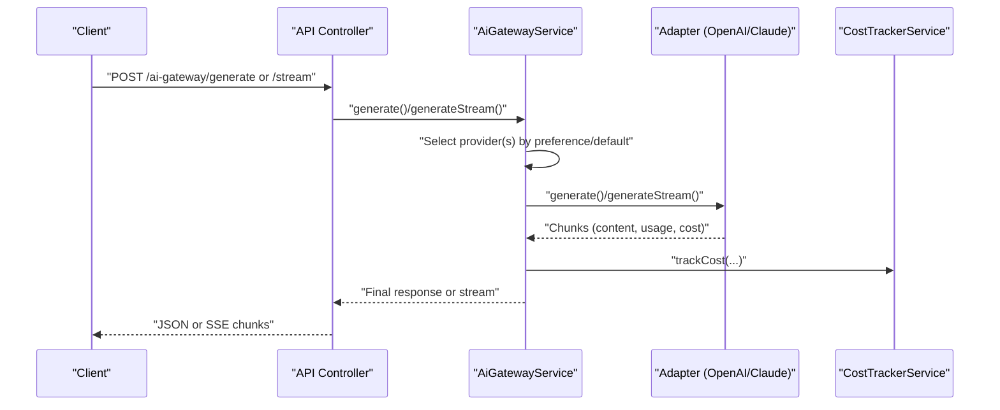
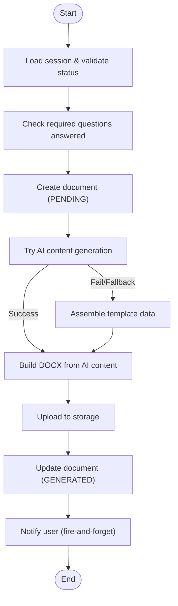
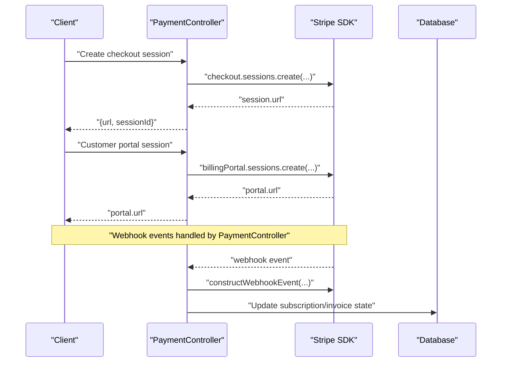
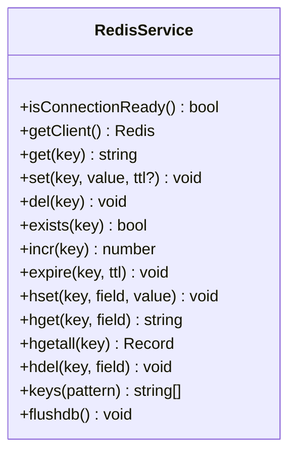
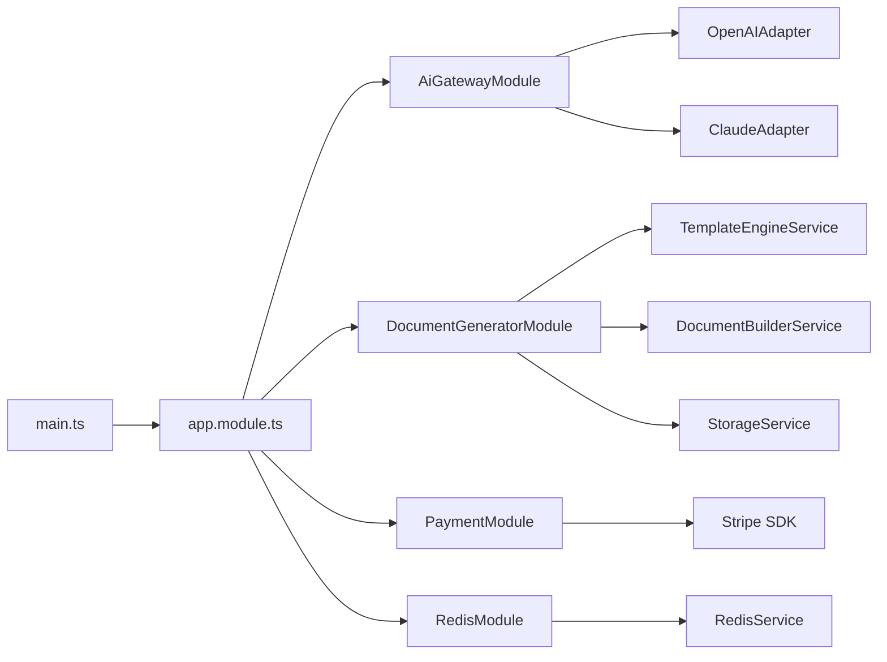

# Data Flow & Integration Patterns

<cite>
**Referenced Files in This Document**
- [main.ts](file://apps/api/src/main.ts)
- [app.module.ts](file://apps/api/src/app.module.ts)
- [configuration.ts](file://apps/api/src/config/configuration.ts)
- [redis.module.ts](file://libs/redis/src/redis.module.ts)
- [redis.service.ts](file://libs/redis/src/redis.service.ts)
- [ai-gateway.module.ts](file://apps/api/src/modules/ai-gateway/ai-gateway.module.ts)
- [ai-gateway.service.ts](file://apps/api/src/modules/ai-gateway/ai-gateway.service.ts)
- [document-generator.module.ts](file://apps/api/src/modules/document-generator/document-generator.module.ts)
- [document-generator.service.ts](file://apps/api/src/modules/document-generator/services/document-generator.service.ts)
- [payment.module.ts](file://apps/api/src/modules/payment/payment.module.ts)
- [payment.service.ts](file://apps/api/src/modules/payment/payment.service.ts)
</cite>

## Table of Contents
1. [Introduction](#introduction)
2. [Project Structure](#project-structure)
3. [Core Components](#core-components)
4. [Architecture Overview](#architecture-overview)
5. [Detailed Component Analysis](#detailed-component-analysis)
6. [Dependency Analysis](#dependency-analysis)
7. [Performance Considerations](#performance-considerations)
8. [Security Considerations](#security-considerations)
9. [Error Handling and Retry Mechanisms](#error-handling-and-retry-mechanisms)
10. [Data Consistency Patterns](#data-consistency-patterns)
11. [Troubleshooting Guide](#troubleshooting-guide)
12. [Conclusion](#conclusion)

## Introduction
This document describes the data flow architecture and integration patterns for Quiz-to-Build, focusing on how user interactions, API requests, database operations, and external service integrations move data through the system. It explains integration patterns with AI providers (OpenAI, Claude), payment processors (Stripe), and document generation services. It also details data transformation pipelines, caching strategies using Redis, asynchronous processing patterns, and security considerations including encryption in transit and data validation. Finally, it covers error handling, retry mechanisms, and data consistency across distributed components.

## Project Structure
The API server is a NestJS application bootstrapped with structured logging, rate limiting, security middleware, and global interceptors/filters. Modules encapsulate features such as AI gateway, document generation, payments, and Redis integration. Configuration is centralized and validated, especially in production.

**Diagram sources**
- [main.ts:28-317](file://apps/api/src/main.ts#L28-L317)
- [app.module.ts:53-128](file://apps/api/src/app.module.ts#L53-L128)
- [configuration.ts:87-114](file://apps/api/src/config/configuration.ts#L87-L114)
- [redis.module.ts:1-10](file://libs/redis/src/redis.module.ts#L1-L10)
- [redis.service.ts:19-84](file://libs/redis/src/redis.service.ts#L19-L84)
- [ai-gateway.module.ts:19-25](file://apps/api/src/modules/ai-gateway/ai-gateway.module.ts#L19-L25)
- [document-generator.module.ts:19-46](file://apps/api/src/modules/document-generator/document-generator.module.ts#L19-L46)
- [payment.module.ts:18-24](file://apps/api/src/modules/payment/payment.module.ts#L18-L24)

**Section sources**
- [main.ts:28-317](file://apps/api/src/main.ts#L28-L317)
- [app.module.ts:53-128](file://apps/api/src/app.module.ts#L53-L128)
- [configuration.ts:87-114](file://apps/api/src/config/configuration.ts#L87-L114)

## Core Components
- Bootstrap and middleware pipeline: Compression, Helmet CSP/HSTS, Permissions-Policy, CORS, validation pipes, logging, and global interceptors.
- Root module wiring: Config, Prisma, Redis, feature modules (Auth, Questionnaire, Session, Adaptive Logic, Standards, Admin, Document Generator, Scoring Engine, Heatmap, Notifications, Payment, Adapters, Idea Capture, AI Gateway, Chat Engine, Fact Extraction, Quality Scoring, Projects).
- Configuration: Production validation for secrets, JWT, Redis, throttling, email, Claude, and frontend URL.
- Redis: Global module exposing a robust client with exponential backoff and ready-state tracking.

**Section sources**
- [main.ts:43-213](file://apps/api/src/main.ts#L43-L213)
- [app.module.ts:53-128](file://apps/api/src/app.module.ts#L53-L128)
- [configuration.ts:5-43](file://apps/api/src/config/configuration.ts#L5-L43)
- [redis.module.ts:1-10](file://libs/redis/src/redis.module.ts#L1-L10)
- [redis.service.ts:19-84](file://libs/redis/src/redis.service.ts#L19-L84)

## Architecture Overview
The system orchestrates user interactions through REST APIs to feature modules. AI requests traverse an AI Gateway that routes to provider adapters (OpenAI, Claude), tracks costs, and supports streaming. Document generation consumes session answers, optionally augments with AI content, builds DOCX, uploads to storage, and notifies users. Payments integrate with Stripe for checkout sessions, customer portal, and webhooks. Redis provides caching and connection resilience.

**Diagram sources**
- [main.ts:28-317](file://apps/api/src/main.ts#L28-L317)
- [ai-gateway.service.ts:22-331](file://apps/api/src/modules/ai-gateway/ai-gateway.service.ts#L22-L331)
- [document-generator.service.ts:21-609](file://apps/api/src/modules/document-generator/services/document-generator.service.ts#L21-L609)
- [payment.service.ts:57-316](file://apps/api/src/modules/payment/payment.service.ts#L57-L316)
- [redis.service.ts:14-146](file://libs/redis/src/redis.service.ts#L14-L146)

## Detailed Component Analysis

### AI Gateway: Routing, Streaming, and Cost Tracking
The AI Gateway centralizes provider selection, fallback ordering, streaming, and cost accounting. It loads provider configurations from the database, selects adapters, and streams tokens to clients while tracking usage and cost.

**Diagram sources**
- [ai-gateway.service.ts:133-258](file://apps/api/src/modules/ai-gateway/ai-gateway.service.ts#L133-L258)

**Section sources**
- [ai-gateway.module.ts:19-25](file://apps/api/src/modules/ai-gateway/ai-gateway.module.ts#L19-L25)
- [ai-gateway.service.ts:22-331](file://apps/api/src/modules/ai-gateway/ai-gateway.service.ts#L22-L331)

### Document Generation: AI-Augmented Pipelines and Storage
Document generation validates session completion, checks required answers, creates a pending document record, and either generates content using AI or falls back to templates. It builds DOCX, uploads to storage, updates metadata, and notifies users.

**Diagram sources**
- [document-generator.service.ts:37-219](file://apps/api/src/modules/document-generator/services/document-generator.service.ts#L37-L219)

**Section sources**
- [document-generator.module.ts:19-46](file://apps/api/src/modules/document-generator/document-generator.module.ts#L19-L46)
- [document-generator.service.ts:21-609](file://apps/api/src/modules/document-generator/services/document-generator.service.ts#L21-L609)

### Payment Integration: Stripe Checkout, Portal, and Webhooks
The payment service integrates with Stripe for checkout sessions, customer portal, subscriptions, invoices, and webhook verification. It retrieves price IDs from environment variables and constructs events safely.

**Diagram sources**
- [payment.service.ts:105-152](file://apps/api/src/modules/payment/payment.service.ts#L105-L152)
- [payment.service.ts:157-168](file://apps/api/src/modules/payment/payment.service.ts#L157-L168)
- [payment.service.ts:274-280](file://apps/api/src/modules/payment/payment.service.ts#L274-L280)

**Section sources**
- [payment.module.ts:18-24](file://apps/api/src/modules/payment/payment.module.ts#L18-L24)
- [payment.service.ts:57-316](file://apps/api/src/modules/payment/payment.service.ts#L57-L316)

### Redis: Caching and Resilient Connections
Redis is exposed globally and used for caching. The service manages connection lifecycle, exponential backoff, and ready-state tracking. It supports basic operations (get/set/del/expire/hash ops) and safe usage patterns.

**Diagram sources**
- [redis.service.ts:14-146](file://libs/redis/src/redis.service.ts#L14-L146)

**Section sources**
- [redis.module.ts:1-10](file://libs/redis/src/redis.module.ts#L1-L10)
- [redis.service.ts:19-84](file://libs/redis/src/redis.service.ts#L19-L84)

## Dependency Analysis
- The API bootstrap wires middleware, logging, validation, and global interceptors/filters. It sets a global prefix and conditionally exposes Swagger.
- The root module aggregates feature modules and third-party libraries (Prisma, Redis).
- AI Gateway depends on adapters and cost tracking; Document Generator depends on template engine, builder, storage, and notification services; Payment depends on Stripe; Redis is a shared library.

**Diagram sources**
- [main.ts:28-317](file://apps/api/src/main.ts#L28-L317)
- [app.module.ts:53-128](file://apps/api/src/app.module.ts#L53-L128)
- [ai-gateway.module.ts:19-25](file://apps/api/src/modules/ai-gateway/ai-gateway.module.ts#L19-L25)
- [document-generator.module.ts:19-46](file://apps/api/src/modules/document-generator/document-generator.module.ts#L19-L46)
- [payment.module.ts:18-24](file://apps/api/src/modules/payment/payment.module.ts#L18-L24)
- [redis.module.ts:1-10](file://libs/redis/src/redis.module.ts#L1-L10)

**Section sources**
- [main.ts:28-317](file://apps/api/src/main.ts#L28-L317)
- [app.module.ts:53-128](file://apps/api/src/app.module.ts#L53-L128)

## Performance Considerations
- Compression: Enabled for most responses except Server-Sent Events and streaming AI gateway endpoints to preserve streaming semantics.
- Rate limiting: Configured via ThrottlerModule with short/medium/long windows.
- Validation: Global ValidationPipe enforces whitelisting and transforms inputs.
- Caching: Redis provides low-latency caching with automatic reconnection and retry strategy.
- Streaming: AI gateway supports SSE streaming to reduce latency and improve UX.

[No sources needed since this section provides general guidance]

## Security Considerations
- Encryption in transit: Helmet config enables HSTS in production, restricts permissions, and enforces CSP; TLS is used for Redis when configured.
- Secrets and validation: Production validation ensures JWT secrets, database URL, and CORS origin are set appropriately.
- Authentication and authorization: JWT bearer auth is documented in Swagger; CSRF guard is registered globally.
- Request size limits: JSON/URL-encoded payloads limited to 1MB to mitigate abuse.
- CORS: Origin parsing and credential handling are enforced; wildcard origin disabled outside development.
- Error reporting: Sentry and Application Insights initialized early for observability and error capture.

**Section sources**
- [main.ts:69-123](file://apps/api/src/main.ts#L69-L123)
- [main.ts:177-191](file://apps/api/src/main.ts#L177-L191)
- [main.ts:214-298](file://apps/api/src/main.ts#L214-L298)
- [configuration.ts:5-43](file://apps/api/src/config/configuration.ts#L5-L43)

## Error Handling and Retry Mechanisms
- AI Gateway: Attempts fallback providers in order; yields a final error chunk if all fail; tracks cost on successful completion.
- Redis: Exponential backoff retry strategy with capped delays and max retries per request; ready-state tracking and event logging.
- Payment: Stripe SDK handles network errors; webhook verification uses constructed events; guarded against unconfigured environments.
- Document Generator: Marks documents as FAILED with metadata on generation errors; continues to notify on success.

**Section sources**
- [ai-gateway.service.ts:133-188](file://apps/api/src/modules/ai-gateway/ai-gateway.service.ts#L133-L188)
- [ai-gateway.service.ts:193-258](file://apps/api/src/modules/ai-gateway/ai-gateway.service.ts#L193-L258)
- [redis.service.ts:30-42](file://libs/redis/src/redis.service.ts#L30-L42)
- [redis.service.ts:54-70](file://libs/redis/src/redis.service.ts#L54-L70)
- [payment.service.ts:274-280](file://apps/api/src/modules/payment/payment.service.ts#L274-L280)
- [document-generator.service.ts:114-129](file://apps/api/src/modules/document-generator/services/document-generator.service.ts#L114-L129)

## Data Consistency Patterns
- Document generation updates status transitions (PENDING → GENERATING → GENERATED) and records metadata; failures are captured with timestamps and messages.
- AI cost tracking persists usage and cost per request; streaming cost tracking updates on final chunk.
- Redis operations are atomic per command; ready-state gating prevents issuing commands before connection is ready.
- Stripe operations are idempotent via SDK and webhook verification; metadata stored in sessions and subscriptions.

**Section sources**
- [document-generator.service.ts:147-211](file://apps/api/src/modules/document-generator/services/document-generator.service.ts#L147-L211)
- [ai-gateway.service.ts:151-166](file://apps/api/src/modules/ai-gateway/ai-gateway.service.ts#L151-L166)
- [ai-gateway.service.ts:220-236](file://apps/api/src/modules/ai-gateway/ai-gateway.service.ts#L220-L236)
- [redis.service.ts:76-78](file://libs/redis/src/redis.service.ts#L76-L78)
- [payment.service.ts:134-151](file://apps/api/src/modules/payment/payment.service.ts#L134-L151)

## Troubleshooting Guide
- Bootstrap failures: Captured and logged with stack traces; Sentry exception capture enabled.
- Redis connectivity: Check ready-state, connection events, and retry logs; ensure host/port/password/TLS configuration matches environment.
- AI provider failures: Inspect fallback order and adapter availability; verify provider configs loaded from database.
- Document generation errors: Review FAILED metadata timestamps and messages; confirm session completion and required answers.
- Payment webhooks: Validate signatures using webhook secret; ensure Stripe secret key configured.

**Section sources**
- [main.ts:319-328](file://apps/api/src/main.ts#L319-L328)
- [redis.service.ts:54-70](file://libs/redis/src/redis.service.ts#L54-L70)
- [ai-gateway.service.ts:49-91](file://apps/api/src/modules/ai-gateway/ai-gateway.service.ts#L49-L91)
- [document-generator.service.ts:118-129](file://apps/api/src/modules/document-generator/services/document-generator.service.ts#L118-L129)
- [payment.service.ts:274-280](file://apps/api/src/modules/payment/payment.service.ts#L274-L280)

## Conclusion
Quiz-to-Build employs a modular NestJS architecture with clear data flow boundaries. AI Gateway provides resilient provider routing and streaming with cost tracking. Document generation integrates AI augmentation and storage with robust status transitions and notifications. Stripe integration covers checkout, portal, and webhooks. Redis offers reliable caching with graceful reconnection. Security is enforced through validated configuration, CSP/HSTS, rate limiting, and global interceptors. Error handling and retry strategies ensure resilience, while status-driven updates maintain consistency across components.